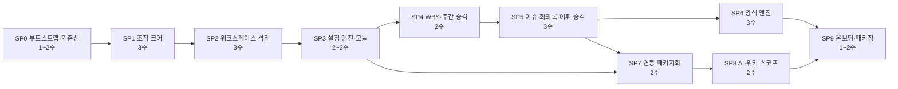

# 범용 프로젝트 관리 플랫폼(가칭) 설계 스펙

> **익명화(2026-09-24):** 원본 고객사·구 브랜드·고객 업무 문자열은 일반 명칭으로 치환했다. 실측 재현 명령과 식별자도 함께 치환돼 있어 원본 리포에서 그대로 실행되지 않을 수 있다.

| 항목 | 값 |
|---|---|
| 날짜 | 2026-09-23 |
| 상태 | 초안 — 사용자 검토 대기 |
| 원본 리포 | `wbs-web`(구 브랜드명, 원본 고객사 운영). 실측 기준 worktree `staging` 77cf6785 / `origin/main` 03fedcf |
| 컷오프 | 예정 — 포크 시점의 `origin/main` SHA 를 첫 커밋 트레일러 `Fork-of: wbs-web@<sha>` 와 `docs/fork-policy.md` 에 고정(6.6) |
| 정본 관계 | 3안 적대적 비교의 종합안(점진 포크 뼈대 + 조직 코어 선행 + 경량 모듈 레지스트리)을 정본으로 삼되, 파일 경로·라인·수치는 코드에서 재확인해 틀린 것은 고쳐 적었다. 확인하지 못한 값은 "(미검증)" 으로 표기한다 |
| 확정 결정 | 결정 1~9(1.3)·미결 질문의 답 Q1~Q6(1.4)은 **사용자 명시 결정으로만** 개정한다. 개정 이력은 §1.10 |
| 개정 | 2026-09-27 개정 문서(`docs/superpowers/specs/2026-09-27-platform-revision-configurability-design.md` — 결정 6·Q4 개정, 설정 계약·로드맵 교체). 반영 범위는 개정 문서 §7 |

## 목차

1. 개요·목표·결정·비목표·용어
2. 조직·권한 모델
3. 설정 엔진·모듈 레지스트리·유연화 인벤토리
4. 양식 병합 엔진
5. 외부 연동·AI·폐쇄망 대비
6. 서브 프로젝트 로드맵·리스크·검증 전략·포크 정책
7. 디자인 시스템·정보 구조
8. 열린 항목

---

## 1. 개요·목표·결정·비목표·용어

### 1.1 배경 — 원본 고객사 특화 실측(2026-09-23, `staging` 77cf6785)

| 항목 | 실측 |
|---|---|
| 규모 | `src` .ts/.tsx 637파일/101,570줄(전체 파일 644), 테스트 516파일, API 라우트 41, `'use server'` 40파일(export async 179), 마이그레이션 0001~0100(빈 번호 0018·0027·0069·0081), 테이블 68 |
| 원본 고객사 상수 | **105건/48파일**(재현 명령은 표 아래). `"구 브랜드명"` 24파일, `Asia/Seoul` 25파일, 초대 도메인 `['example-corp.com']`(`src/lib/domain/invites.ts:17`) |
| Supabase 결합 | RLS 라이브 정책 116/정책 보유 테이블 60, 읽기 개방 46(`using (true)` 43 + `can_read_project` 3 — 본문이 `select true`, 0052:58), `app_role()` 잔존 9 — 이 넷은 **(미검증 — `policy_sim.py` 마이그레이션 텍스트 리플레이, 운영 `pg_policies` 미대조)**; 마이그레이션 텍스트 grep 은 `using (true)` 57문/32파일(비롤백·대소문자 무시, 2·6절과 같은 기준); `security definer` 46, `.rpc()` 42종, 버킷 3, presence 채널 2, `createAdminClient` 65파일, 환경변수 39 |
| 조직 모델 | 워크스페이스 개념 없음. 사람이 `memberships`(계정당 팀 1개, 0001)·`project_roles`(0052)·`project_members`(0003)·`project_member_identities`(0070) 4곳에 흩어짐 |
| 테스트 결합 | `vi.mock('@/lib/authz')` 50파일, `vi.mock('@/lib/supabase/admin')` 71파일 |

원본 고객사 상수 재현(`-r` 필수, 패턴은 작은따옴표):

```bash
grep -rE '원본 고객사|ORIGIN|PMO|MDM|APS' src | wc -l      # 105
grep -rlE '원본 고객사|ORIGIN|PMO|MDM|APS' src | wc -l     # 48
```

**급소 6곳**(105건이 모이는 자리; 승격 대상·소비처 전수는 3.4 표):

| # | 급소 | 정본 |
|---|---|---|
| ① | 주간보고 11구분·팀 매핑·PMO 폴백 | `WEEKLY_SECTIONS` `src/lib/domain/weeklySheet.ts:21` |
| ② | 5팀 폴백·색상표 | `DEFAULT_TEAMS` `src/lib/domain/teams.ts:17`, `TEAM_COLOR` `src/lib/report/brand.ts:33`(해소 — importer 0 인 죽은 모듈, 하드닝 6 이 삭제), `TEAM` `src/components/wbs/shared.tsx:4` |
| ③ | 이슈 8영역·코드 접두 트리거 | `ISSUE_MEGA_AREAS` `src/lib/domain/issueAnalysis.ts:4`, 0055/0062 |
| ④ | 엑셀 3행 헤더·팀 열 폴백 | `LEGACY_ORIGIN_PROFILE` `src/lib/excel/profile.ts:142`, `src/app/api/export/route.ts:30` |
| ⑤ | WBS 라벨 폴백·프리셋 | `DEFAULT_LEVEL_LABELS` `src/components/wbs/shared.tsx:27`(축약표 `LEGACY_LABEL_ABBR` `:39`), `src/lib/domain/projectPresets.ts` |
| ⑥ | 회의록 팀 폴더 5축 시드·APS 별칭 | `src/lib/minutes/folders.ts`, `TEAM_SUB_ALIASES` `src/lib/domain/minutes.ts:86` |

### 1.2 목표

wbs-web 을 포크해 **어떤 고객사·프로젝트든 쓰는 범용 프로젝트 관리 플랫폼**(가칭)을 만든다. 한 배포에 여러 워크스페이스, 원본 고객사 값은 전부 설정으로 승격, 출력물은 고객 양식에 병합, 모듈은 유지하되 설정으로 켜고 끈다. 또박또박 연동·에이전트 스튜디오가 패키지의 핵심이다.

### 1.3 확정 결정(사용자 결정으로만 개정 — §1.10)

| # | 결정 | 귀결 |
|---|---|---|
| 1 | 포크. 구 브랜드명 운영은 기존 리포. 원본 고객사 데이터 이관 없음 | 구조 자유, 기준선=운영 **스키마** `pg_dump --schema-only`(데이터 제외 → 6절 SP0) |
| 2 | 1단계 온라인, 폐쇄망 2단계. 클라우드 고유 기능에 새로 기대지 않음 | Postgres·RLS·Auth·Storage·Realtime 만(→ 5절) |
| 3 | 멀티 워크스페이스, 사용자 다중 소속 | `workspaces`·`workspace_members`(→ 2절) |
| 4 | (a)다중 팀 (b)프로젝트별 역할·팀 (c)계정 없는 담당자 (d)담당 영역 축 | `people`·`project_member_teams`·`project_areas`(→ 2절) |
| 5 | 프리셋 없음. 스키마 고정·값은 관리자. 빈 값 또는 복사 | `settings/registry.ts` + `project_settings.values`(→ 3절) |
| 6′ | 행=설정값, 열=제품 고정 핵심 필드 + 프로젝트 사용자 정의 필드(대상 `wbs_item`·`issue`·`weekly_row`, 선언형 타입), 출력=고객 양식+자리표시(2026-09-27 개정, §1.10) | `form_templates` + FormEngine(→ 4절), `fields.<entity>` 설정 키 + `custom jsonb`(→ 개정 문서 `docs/superpowers/specs/2026-09-27-platform-revision-configurability-design.md` §3.6) |
| 7 | 모듈 전부 유지, 설정으로 토글. 또박또박·에이전트 핵심 | 유효 모듈=env 가용∩`modules.allowed`∩`modules.enabled`(3층, → 3.2.3), `integration_credentials`(→ 5절) |
| 8 | 판정 두 곳·가드 3종·`roleIn(actor, pid)` 불변 | 포크 성립 조건(→ 1.6) |
| 9 | 바꿀 수 있는 모든 것을 고려 | 행이 FK 로 참조하는 목록(팀·담당 영역)은 FK 테이블. 어휘·표시 상태·필드 정의는 `values` + 트리거(§3.5 열린 항목 3 종결) |

### 1.4 미결 질문의 답

| Q | 답 |
|---|---|
| Q1 As-Is 트리(5·6) | 제품 고정 슬라이드 유형 유지(결정 6 예외). 표·텍스트 페이지만 엔진(→ 4절) |
| Q2 워크스페이스 관리자 | 모든 프로젝트 관리자 자동 승계, 비공개 포함(→ 1.8) |
| Q3 명단·권한 | `project_members.access_role` 한 행. 숨김 편집자 없음(→ 2절) |
| Q4′ 승격 어휘(2026-09-27 개정, §1.10) | 근태 유형(현 9종)·회의 카테고리(6)·이슈 심각도(3)/원인(4=S/P/O/I)/원천(6)·타임존·근무일 승격(유지) + 주 시작 요일 승격. 시스템 의미 범주(이슈 4·WBS 단계 4 `as/ip/im/xx`(`fp` 는 0096 폐지)·주문 5)와 에이전트 프로토콜은 고정, 표시 상태·라벨·승인 단계·선행 기준·크레딧 정책은 프로젝트 설정(→ 개정 문서 §3). 스크립팅 없음 |
| Q5 고객 양식 3종 | 미확보. SP6 착수 조건 = 실제 3종 또는 원본 고객사 양식+자체 샘플 2종, SP6 직전 재확인(→ 6절) |
| Q6 또박또박 | 헤더 자격증명만 변경, payload 불변. 팀·프로젝트는 토큰의 기본 매핑(→ 5절) |

### 1.5 비목표

기각 11건(코드로 확인된 이유)과 2026-09-27 개정이 더한 7건(12~18, 사용자 결정 근거 — §1.10):

| # | 기각 | 이유 |
|---|---|---|
| 1 | 코어 재설계(호환 뷰) 뼈대 | `project_members` 를 가리키는 FK 8개 — 뷰는 FK 대상 불가 |
| 2 | 모듈러 뼈대(헬퍼 교체 격리) | `can_read_project` 참조 정책 3개뿐, 개방 43개는 리터럴 |
| 3 | SP1 워크스페이스→SP2 조직 순서 | 0071 정책이 `memberships.team_id` 직접 서브쿼리 |
| 4 | `project_areas.owner_team_id` 단일 FK | '생산계획'∈ERP∩MES → `area_teams` |
| 5 | `project_settings` 키당 1행 | 1행 `values jsonb`+레지스트리+history 가 단순 |
| 6 | `roleIn` 시그니처 변경 | `projectWorkspace` Map 으로 유지 가능 |
| 7 | `teams.project_id not null` | 미지정 회의록·또박또박 team 해석 불가 |
| 8 | docxtemplater 1안 | 상용 모듈·폐쇄망 라이선스 미확인. JSZip 1안 |
| 9 | env 플래그 폐지 | '배포 가용' 은 DB 가 대신 못 함 |
| 10 | 프리셋·워크스페이스별 LLM 키·이미지/차트 자리표시·출력물 보관·모듈 버전·런타임 플러그인 | 결정 5 + YAGNI. 종합안 기각 10번에 함께 있던 **타임존·근무일은 Q4 로 승격이 확정돼 이 행에서 뺐다**(기각 아님, → 3절) |
| 11 | 코드 그리기 기본 양식 폴백 | 결정 6 위반. 기본 양식도 동봉 파일 |
| 12 | 스크립트형 워크플로(프로젝트별 전이표·조건식·자동 전이·타이머·웹훅) | Q4′ — 범주 전이는 고정, 설정은 표시 상태·승인 단계·선행 기준·크레딧 정책뿐(개정 문서 §1.4.1) |
| 13 | 승인 0단계(자동 승인) | Q4′ — 승인은 1~3단, 기본 1단 = 현행(개정 문서 §3.3.1) |
| 14 | 대상 밖 엔티티의 사용자 정의 필드와 필드 비목표 | 결정 6′ — 대상은 `wbs_item`·`issue`·`weekly_row` 셋(개정 문서 §3.6.10) |
| 15 | 국가·지역 공휴일 달력 | 사용자 결정 5 — 기본 공휴일 없음, 쉬는 날은 프로젝트 데이터에서만(개정 문서 §4.2.7) |
| 16 | 집계·위험·완료 정책의 설정화 | 사용자 결정 3 — 현행 고정(개정 문서 §1.4.3) |
| 17 | 고객별 임의 CSS·HTML·JS·레이아웃, 메뉴 그룹 구조 변경, 메뉴 숨김 설정 | 사용자 결정 6 — 디자인 설정 범위는 개정 문서 §5.11 |
| 18 | 워크스페이스별 SMTP | SMTP 는 배포 운영 설정(env), 워크스페이스는 발신 표시명 `branding.mail_from_name` 만 정한다(개정 문서 §4.9, → 5.7) |

3안 점수(실현성/적합성/치명): 점진 포크 6/7/0 · 코어 재설계 5/6/2 · 모듈러 5/6/2.

**재제안 금지**: 10번 전부(타임존·근무일은 승격 항목이므로 해당 없음), 12~18번 전부, 타입 프리셋, 비공개 프로젝트 RLS 잠금(화면 숨김 유지), 도형 페이지 자리표시 규약(Q1 종결).

### 1.6 접근 뼈대

「점진 포크 뼈대 + 조직 코어 선행 + 경량 모듈 레지스트리」. 점진 포크인 이유 셋: ① 유일하게 치명 결함 없음. ② 637파일·테스트 516·`vi.mock` 50/71·1인+에이전트·단계별 배포 제약 아래 실현 가능. ③ 핵심 자산 4종 보존 — 스키마 기준선(`pg_dump --schema-only`)·가드 3종·FK 테이블 설정·운영 검증된 JSZip 템플릿필(`templateFill.ts`·`xml.ts`·`jszipRenderer.ts`). 이식: 코어 재설계안에서 `people`·`access_role`·`area_teams`·`integration_credentials`·RLS 하네스, 모듈러안에서 정적 매니페스트·`effectiveModules`·`requireModule`·`profiles`·`/w/[slug]`(→ 2·3절).

**포크 성립 조건** — 아래가 불변이어야 `vi.mock('@/lib/authz')` 50파일과 가드 호출부(`requireSuperuser` 24·`requireProjectAdmin` 54·`requireProjectMember` 35곳)가 무수정이다.

```ts
// src/lib/authz/index.ts:144,151,158
export async function requireSuperuser(): Promise<GuardResult>
export async function requireProjectAdmin(projectId: string | null): Promise<GuardResult>
export async function requireProjectMember(projectId: string | null): Promise<GuardResult>
// src/lib/domain/authz.ts:31 — 본문만 4단으로 확장
export function roleIn(actor: Actor | null, projectId: string | null): EffectiveRole | null
```

`Actor` 는 바뀐다(→ 2절): `teamCode`·`teamId`(`src/lib/domain/authz.ts:14-15`) 삭제, `workspaceRoles`·`projectWorkspace` 신설, 현행 `rosterTeams`(`:21`, 프로젝트당 팀 1개)는 `{ teamIds: string[]; teamCodes: string[] }` 배열형으로. `effectiveLegacyRole` shim(소비처 6파일)도 삭제.

### 1.7 용어

| 용어 | 정의 | 정본 |
|---|---|---|
| 워크스페이스 | 고객사 1개=격리 단위. 폐쇄망은 1행 | `workspaces(slug)` |
| 플랫폼 관리자 | 배포 운영자. `memberships.is_superuser` 대체 | `platform_admins` |
| 워크스페이스 관리자 | 프로젝트·사람·공용 팀·자격증명 관리 + 전 프로젝트 관리자 승계 | `workspace_members.role='admin'` |
| 사람(people) | 워크스페이스 인물 원장, 계정 유무 무관(`kind account\|external`) | `people(user_id nullable)` |
| 명단 | 프로젝트별 참여 행. 권한(`access_role`)·역할 라벨은 한 행에, 팀은 `project_member_teams` 다대다. 담당자 FK 는 `(id, project_id)` | `project_members(person_id, access_role)`·`project_member_teams` |
| 담당 영역 | 팀과 별개 업무 축(주간 구분·이슈 영역). `kind` 고정, 행은 설정값, 담당 팀 다대다 | `project_areas`·`area_teams` |
| 모듈 | 정적 선언 기능 단위. 유효=env 가용∩`modules.allowed`∩`modules.enabled` | `src/lib/modules/registry.ts` |
| 양식 | 업로드된 고객 PPTX/XLSX 또는 동봉 기본 템플릿. 활성본 1개/`form_kind` | `form_templates` + 버킷 `form-templates` |
| 자리표시 | 양식 내 토큰 `{{path}}`·`{{#rows}}`·`{{#slide}}`·`{{#items}}`. 매핑은 `forms[form_kind].mapping` | FormEngine `scan`/`render` |

### 1.8 권한 4단

판정은 `src/lib/domain/authz.ts`(순수)·`src/lib/authz/index.ts`(가드) 두 곳뿐이고, 외부 API 판정부도 Actor 를 조립해 `roleIn` 을 재사용한다(→ 2절).

| 단 | 근거 | `roleIn` | 권한 |
|---|---|---|---|
| 플랫폼 관리자 | `platform_admins` | `'superuser'` | 워크스페이스 생성·모듈 계약·LLM·사용 현황(→ 2.7) |
| 워크스페이스 관리자 | `workspace_members.role='admin'` | `'admin'`(전 프로젝트, 비공개 포함) | 프로젝트 생성·초대·사람·공용 팀·자격증명·브랜딩 |
| 프로젝트 관리자 | `project_members.access_role='admin'` | `'admin'` | 설정·명단·영역·양식·모듈 |
| 멤버 | `access_role='member'` | `'member'` | 실적·이슈·회의록 쓰기 |
| (조회 전용) | 워크스페이스 멤버 + 명단 행 없음 또는 `access_role null` | `'viewer'` | 읽기 |
| (타 워크스페이스) | `projectWorkspace` 에 없음 | `null` | 존재 은닉 |

가드는 `requireSuperuser()`·`requireWorkspaceAdmin(wid)`(신설)·`requireProjectAdmin(pid)`·`requireProjectMember(pid)`·`requireModule(pid|wid, moduleId)`(신설). 기존 셋은 불변.

### 1.9 문서 구성

1 개요·결정(이 절) / 2 조직·권한 — 데이터 모델·Actor·RLS 격리 / 3 설정·모듈·인벤토리 — 레지스트리·3층 토글·승격 목록 / 4 양식 엔진 — 저장·자리표시·매핑·스파이크·Q1 예외 / 5 연동·AI·폐쇄망 — 자격증명·AI 스코프·2단계 경계 / 6 로드맵·리스크·검증 — SP0~SP9·완료 기준·열린 항목 / 7 디자인·IA — 토큰·셸·내비·상태 계약 / 8 열린 항목. 명칭은 종합안을 그대로 쓴다.

### 1.10 결정 개정 이력

결정 1~9·Q1~Q6 은 사용자 명시 결정으로만 개정하고, 개정은 이 표에 남긴다. **에이전트·검토 문서는 결정을 대신 뒤집지 못한다.** 각 개정의 계약은 개정 문서 §1.2(사용자 결정)·§1.3(결정 변경 대장)·§1.4(결정 수준 계약)다.

| 날짜 | 결정 | 이전 | 이후 | 출처 |
|---|---|---|---|---|
| 2026-09-26 | Q4 → Q4′ | 이슈 상태(4)·WBS 단계 `as/ip/im/xx` 제품 고정 | 시스템 의미 범주·에이전트 프로토콜만 고정, 표시 상태·라벨·승인 단계·선행 기준·크레딧 정책은 프로젝트 설정, 스크립팅 없음(1.4) | 사용자 결정 U-1, 개정 문서 §1.3 C2·C3·C4 |
| 2026-09-26 | 결정 6 → 6′ | 열=제품 고정 | 열=제품 고정 핵심 필드 + 프로젝트 사용자 정의 필드(3엔티티, 선언형 타입)(1.3) | 사용자 결정 U-2, 개정 문서 §1.3 C5 |
| 2026-09-26 | 사용자 결정 3(집계·위험·완료 정책) — 현행 확인 | 롤업·판정 고정 | 고정 유지(재개방 아님). 진척 롤업 null 가중치만 null=1 로 정합 수정(SP4) | 사용자 결정 U-3, 개정 문서 §1.3 C6 |
| 2026-09-26 | §3.3.4 주 시작 요일 | 주 시작=월요일, `calendar.week_start` 는 YAGNI | `calendar.week_start` 신설, 기본 일요일(`'monday'` 허용), 다음 주부터 적용 | 사용자 결정 U-4, 개정 문서 §1.3 C7 |
| 2026-09-26 | §3.5·§7 #2 한국 공휴일 오버레이 | 표시 전용 제품 고정(표시 조건 열린 항목) | 삭제. 제품은 기본 공휴일을 두지 않는다 | 사용자 결정 U-5, 개정 문서 §1.3 C8 |
| 2026-09-26 | 물려받은 코드 결정 3건(전역 브리지 메뉴·다크 토글 숨김·크림·틸 팔레트) | 원본 리포에서 물려받은 결정(정본에 없음) | 번복 — 워크스페이스 전체 범위, 다크 모드 재노출, 중립·코발트(→ 7절) | 사용자 결정 U-6, 개정 문서 §1.3 C9·C10·C11 |

---

## 2. 조직·권한 모델

이 절은 결정 3(멀티 워크스페이스)·4(조직 유연성 4가지)·8(권한 판정 두 곳 규칙)과 확정 답 Q2(워크스페이스 관리자의 자동 승계, 비공개 포함)·Q3(명단과 권한을 한 행으로)를 스키마·판정식·가드·RLS 로 옮긴다. 설정 항목과 모듈 토글은 → 3절, 양식 저장 테이블(`form_templates`)은 → 4절, 또박또박·에이전트 계약 본문은 → 5절, 서브프로젝트 순서(SP1 조직 코어 → SP2 격리)와 검증 기준은 → 6절 참조.

현 리포와 대비할 때 인용하는 파일은 `src/lib/domain/authz.ts`·`src/lib/authz/index.ts`·`src/lib/authz/errors.ts`·`src/lib/domain/permissions.ts`·`src/lib/authz/accessScope.ts`·`src/lib/agent/externalApi.ts`·`src/lib/minutes/externalApi.ts`·`src/lib/supabase/admin.ts`·`supabase/migrations/0002·0003·0013·0032·0039·0041·0042·0045·0052·0053·0054·0065·0070·0071·0074·0077·0078·0094·0098` 이며, 수치는 2026-09-23 `staging` 브랜치(HEAD `77cf6785`)에서 grep 으로 잰 값이다.

### 2.1 원칙과 4단 권한

| 원칙 | 내용 | 근거 |
|---|---|---|
| 워크스페이스 = 고객사 | 한 배포에 여러 워크스페이스. 폐쇄망 배포는 `workspaces` 행 1개(시드). 전환 UI 는 소속 워크스페이스가 2개 이상일 때만 노출 | 결정 3 |
| 사람은 계정과 분리 | `people` 이 워크스페이스 인물 원장. 계정 없는 외부 인력도 같은 표의 한 행이며, 명단(`project_members`)에 있으면 WBS·이슈·회의 담당자가 된다 | 결정 4(c) |
| 명단 = 권한 | `project_members.access_role` 이 유일한 프로젝트 권한 축. "명단에 없는 숨김 편집자"는 없다 | Q3 |
| 워크스페이스 관리자 승계 | `workspace_members.role='admin'` 이면 그 워크스페이스 **모든** 프로젝트(비공개 포함)의 관리자 | Q2 |
| 행 부재 = 조회 전용 | 워크스페이스 멤버이지만 명단 행이 없거나 `access_role` 이 null 이면 viewer. viewer 값을 따로 두지 않는다(0054 주석의 이유 유지) | 현행 0052 유지 |
| 타 워크스페이스 = 존재 은닉 | 내 워크스페이스가 아닌 프로젝트는 `roleIn` 이 null, RLS 는 0행. 가드는 `ERR_MISSING` 을 돌려주고 `denyStatus` 가 404 로 매핑하며, 화면은 `notFound()`(2.4.4) | 결정 3 |
| 판정 두 곳 | 순수 `src/lib/domain/authz.ts` + 가드 `src/lib/authz/index.ts`. 액션·라우트·외부 API 어디서도 `role === '...'` 직접 비교 금지 | 결정 8 |
| 가드 이름·시그니처 불변 | `requireSuperuser()`·`requireProjectAdmin(pid)`·`requireProjectMember(pid)`·`roleIn(actor, pid)` 의 시그니처를 바꾸지 않는다. `vi.mock('@/lib/authz')` 50파일·`vi.mock('@/lib/supabase/admin')` 71파일이 그 시그니처에 매여 있다(실측) | 결정 8 |

권한은 4단이다. 현행 3단(슈퍼유저·관리자·멤버)에 워크스페이스 관리자가 끼어든다.

| 단 | 저장 위치 | 범위 | 주요 권한(조직 계층에 한함 — 모듈별 권한은 → 3절) |
|---|---|---|---|
| 플랫폼 관리자 (`superuser`) | `platform_admins` | 배포 전체 | 워크스페이스 생성·삭제, 플랫폼 관리자 지정, 워크스페이스별 모듈 계약(`workspace_settings.modules.allowed`), LLM 서버 설정. 모든 프로젝트에서 `roleIn`='superuser' |
| 워크스페이스 관리자 (`admin`) | `workspace_members.role='admin'` | 워크스페이스 | 프로젝트 생성·삭제(비공개 포함), 사람(`people`) 관리, 공용 팀, 초대 도메인, 브랜딩, 외부 연동 자격증명 발급·회수, 워크스페이스 화면(`/w/[slug]/…`). 그 워크스페이스 모든 프로젝트에서 `roleIn`='admin' |
| 프로젝트 관리자 (`admin`) | `project_members.access_role='admin'` | 프로젝트 | 명단·팀·담당 영역·설정·양식·모듈 토글·WBS 구조 편집. 현행 `requireProjectAdmin` 범위 그대로 |
| 프로젝트 멤버 (`member`) | `project_members.access_role='member'` | 프로젝트 | 회의·회의록·주간보고·이슈·근태·첨부 쓰기, WBS 실적(자기 팀 담당 리프). 현행 `requireProjectMember` 범위 그대로 |
| 조회 전용 (`viewer`) | 행 부재 / `access_role` null | 프로젝트 | 그 워크스페이스 프로젝트 읽기만 |
| 외부 인력 | `people.user_id` null | — | 로그인 없음 → `Actor` 없음. 담당자·참석자·근태 대상으로만 존재 |

워크스페이스 멤버(`workspace_members.role='member'`)는 별도 단이 아니다. 워크스페이스 소속은 "그 워크스페이스 프로젝트를 읽을 수 있다"는 자격이고, 쓰기 권한은 전부 프로젝트 명단 행이 준다.

### 2.2 현재 상태 대비

| 축 | 현 리포(실측) | 이 설계 |
|---|---|---|
| 전역 등급 | `memberships.is_superuser`(0052:17), `is_superuser()` 가 `memberships` 를 읽음(0052:37-41) | `platform_admins` 표. 함수 이름 `is_superuser()` 유지, 본문만 교체 |
| 계정 전역 팀 | `memberships.team_id not null`(0001:19), `Actor.teamCode/teamId`, `getMembership()`(`src/lib/auth.ts:22`) | 없음. 팀 소속은 프로젝트별 `project_member_teams` 뿐 |
| 프로젝트 권한 | `project_roles(project_id, user_id, role)`(0052:23-31) | `project_members.access_role` |
| 명단 | `project_members(name, email, team_id, role('admin'\|'contributor'), title, role_label, user_id)`(0003:8-17·0019·0071:41) | `project_members(person_id, access_role, role_label, title, active, sort_order)` — 이름·이메일은 `people` |
| 이메일 정본 | `project_member_identities(email PK, name)` + 복합 FK `project_members_email_name_fkey`(0070:190-197) + 트리거 `enforce_project_member_email_identity` | `people` 의 `unique(workspace_id, email)`. 표·트리거·복합 FK 전부 폐기 |
| '내 팀' 판정 | `memberships.team_id ∪ project_members.team_id`(0071:47-69 `member_update_actual`, 0071:72-92 `can_attach`, `actorTeamCodesFor` `src/lib/domain/permissions.ts:5-11`) | `project_member_teams` 단일 경로, `my_team_ids(pid)` 헬퍼 |
| 읽기 범위 | `can_read_project(pid)` = `select true`(0052:58-59); 리포 마이그레이션에 `using (true)` 57문/32파일(비-rollback, grep); `can_read_project` 를 부르는 정책은 0079 위키 3개뿐(0079:456·461·483) | `project_id in (select accessible_project_ids())` 템플릿 + `can_read_project(pid) := is_ws_member(project_ws(pid))` |
| 옛 역할 shim | `app_role()`(0052:118-128), 비-rollback 마이그레이션 26파일에 등장; `effectiveLegacyRole`(authz.ts:46-58) 소비처 6파일 | 둘 다 삭제 |
| 외부 API 판정 | `isAgentProjectMember/Admin`·`agentMemberRole`(agent/externalApi.ts:58-119), `isBatchAuthorized`(minutes/externalApi.ts:69-85), `accessScope.ts:29-33` 이 `memberships`·`project_roles` 를 직접 읽음 | `actorFromUser(admin, userId)` 로 `Actor` 를 조립해 `roleIn` 재사용 |
| 시크릿 | `MINUTES_API_SECRET`·`AGENT_API_SECRET` 단일 env + `agent_runners`(0078) | `integration_credentials`(워크스페이스별). env 는 `envAvailable` 킬스위치(→ 3절) |
| 자격증명 표 | `agent_runners`(정책 0개·service_role 전용, 0078:35-40), `project_invites`(정책 0개, 0065:77-83) | 같은 관례(정책 0개·service_role 전용)를 `integration_credentials`·`project_invites` 에 유지 |

### 2.3 테이블 정의

표기: PK = 기본키, FK 는 `→ 대상(컬럼) [on delete …]`. 모든 `id` 는 `uuid default gen_random_uuid()`, 모든 `created_at` 은 `timestamptz not null default now()`. RLS 는 표마다 "읽기 / 쓰기" 로 적고, 정책 본문 템플릿은 2.4.6 에 둔다. 마이그레이션 파일 번호는 → 6절.

#### 2.3.1 플랫폼·워크스페이스

**`workspaces`** — 고객사 1개.

| 컬럼 | 타입 | 제약 |
|---|---|---|
| `id` | uuid | PK |
| `slug` | text | not null, `unique`, `check (slug ~ '^[a-z0-9][a-z0-9-]{1,62}$')` — URL `/w/[slug]` 세그먼트 |
| `name` | text | not null, `check (btrim(name) <> '')` |
| `created_at` | timestamptz | |
| `created_by` | uuid | → `auth.users(id)` on delete set null |

RLS: 읽기 `id in (select my_workspace_ids())` / 쓰기 정책 없음(플랫폼 관리자 액션 + service_role). 인덱스는 `unique(slug)` 로 충분.

**`platform_admins`** — 배포 운영자. 현 `memberships.is_superuser` 대체.

| 컬럼 | 타입 | 제약 |
|---|---|---|
| `user_id` | uuid | PK, → `auth.users(id)` on delete cascade |
| `granted_by` | uuid | → `auth.users(id)` on delete set null |
| `granted_at` | timestamptz | not null default now() |

RLS: 읽기 `user_id = auth.uid() or is_superuser()` / 쓰기 `is_superuser()`. 0052:77-81 의 "관리자가 관리자를 늘리면 안 된다" 규칙을 플랫폼 층에 그대로 둔다 — 워크스페이스 관리자는 이 표를 쓰지 못한다.

**`profiles`** — 앱 소유 계정 표. `auth.admin.listUsers` 전수 순회 3곳(`src/lib/minutes/externalApi.ts`·`src/lib/data/usage.ts`·`src/lib/data/accounts.ts`, 실측) 대체.

| 컬럼 | 타입 | 제약 |
|---|---|---|
| `user_id` | uuid | PK, → `auth.users(id)` on delete cascade |
| `email` | text | not null, `unique`, `check (email = lower(btrim(email)))` |
| `display_name` | text | not null, `check (btrim(display_name) <> '')` |
| `created_at` | timestamptz | |
| `updated_at` | timestamptz | not null default now() |

`auth.users` 에 트리거를 걸지 않는다(0019 헤더의 결정 유지 — 실패하는 트리거가 GoTrue 가입 전체를 막는다). 계정 생성 액션(`accounts.ts`)과 초대 수락 RPC 가 명시적으로 insert 한다. RLS: 읽기 `is_superuser() or exists (select 1 from workspace_members a join workspace_members b using (workspace_id) where a.user_id = auth.uid() and b.user_id = profiles.user_id)` — 같은 워크스페이스를 공유하는 계정끼리만 이메일·표시 이름을 본다 / 쓰기 `user_id = auth.uid()`(표시 이름 본인 수정) 외 정책 없음.

**`workspace_members`** — 한 계정이 여러 워크스페이스(결정 3).

| 컬럼 | 타입 | 제약 |
|---|---|---|
| `workspace_id` | uuid | → `workspaces(id)` on delete cascade |
| `user_id` | uuid | → `auth.users(id)` on delete cascade |
| `role` | text | not null, `check (role in ('admin','member'))` |
| `invited_by` | uuid | → `auth.users(id)` on delete set null |
| `created_at` | timestamptz | |
| PK | | `(workspace_id, user_id)` |
| 인덱스 | | `workspace_members_user_idx (user_id)` — `getActor`·`my_workspace_ids()` 의 탐색 경로 |

RLS: 읽기 `is_ws_member(workspace_id)`(같은 워크스페이스 구성원 목록) / 쓰기 `is_ws_admin(workspace_id)`. 마지막 관리자 행의 삭제·강등은 트리거 `workspace_members_keep_last_admin` 이 거부한다(관리자 0명인 워크스페이스는 플랫폼 관리자만 복구할 수 있는 상태가 되므로).

**`workspace_settings`** — 값 저장소. 키 스키마(`branding.*`·`invites.allowed_domains`·`modules.allowed`·`minutes.root_folders`·`ai.enabled`·`calendar.timezone`)와 파서는 → 3절.

| 컬럼 | 타입 | 제약 |
|---|---|---|
| `workspace_id` | uuid | PK, → `workspaces(id)` on delete cascade |
| `values` | jsonb | not null default `'{}'` |
| `updated_at` | timestamptz | not null default now() |
| `updated_by` | uuid | → `auth.users(id)` on delete set null |

RLS: 읽기 `is_ws_member(workspace_id)` / 쓰기 정책 없음(`requireWorkspaceAdmin` + service_role; `modules.allowed` 키만 `requireSuperuser` — 키 단위 게이트는 → 3절).

#### 2.3.2 사람

**`people`** — 워크스페이스 인물 원장. 계정 있는 사용자와 계정 없는 외부 인력이 한 표(결정 4c). 현 `project_member_identities` 와 `project_members.name/email/user_id` 를 흡수.

| 컬럼 | 타입 | 제약 |
|---|---|---|
| `id` | uuid | PK |
| `workspace_id` | uuid | not null, → `workspaces(id)` on delete cascade |
| `display_name` | text | not null, `check (display_name = btrim(display_name) and display_name <> '')` |
| `email` | text | null, `check (email is null or (email = lower(btrim(email)) and email ~ '^[^\s@]+@[^\s@]+\.[^\s@]+$'))` — 0070:23-26 의 정규화 규칙 이관 |
| `user_id` | uuid | null, → `auth.users(id)` on delete set null |
| `kind` | text | `generated always as (case when user_id is null then 'external' else 'account' end) stored` |
| `active` | boolean | not null default true |
| `created_at` | timestamptz | |
| `updated_at` | timestamptz | not null default now() |
| 유니크 | | `people_ws_email_uidx unique (workspace_id, email) where email is not null` |
| 유니크 | | `people_ws_user_uidx unique (workspace_id, user_id) where user_id is not null` |
| 유니크 | | `people_id_ws_uidx unique (id, workspace_id)` — 복합 FK 참조용 |
| 인덱스 | | `people_user_idx (user_id) where user_id is not null` — `getActor` 4축 조회 경로 |

`kind` 를 `check` 가 아니라 생성 컬럼으로 두는 이유: `user_id` 가 `on delete set null` 이라 계정 삭제가 `kind='account' and user_id is null` 상태를 만든다. 그 조합을 `check` 가 거부하면 `auth.users` 삭제 자체가 실패한다 — 0065:55-63 이 `redeem_pair` 제약에서 같은 이유로 등가 CHECK 를 피했다.

계정↔인물 연결 규칙:
- 계정 생성 액션과 초대 수락 RPC 가 `(workspace_id, email)` 로 기존 `people` 행을 찾아 `user_id` 를 채우고, 없으면 새 행을 만든다. 자동 트리거는 없다(0019 헤더 결정 유지).
- 같은 이메일이 두 워크스페이스에 있으면 `people` 행도 둘이다(워크스페이스마다 독립 원장). `profiles` 는 계정당 1행.
- `user_id` 가 null 로 바뀌면(계정 삭제·연결 해제) 트리거 `people_unlink_revokes_access` 가 그 인물의 모든 `project_members.access_role` 을 null 로 내린다. 명단 행과 담당 FK 는 남는다.
- 이름 정본은 `people.display_name` 하나다. 0070 의 "프로젝트마다 다른 이름을 관리자가 못 고친다" 문제는 표가 하나이므로 사라진다. 개명 권한은 워크스페이스 관리자, 또는 그 인물이 명단에 있는 프로젝트의 관리자.

RLS: 읽기 `is_ws_member(workspace_id)` / 쓰기 `is_ws_admin(workspace_id) or exists (select 1 from project_members pm where pm.person_id = people.id and is_project_admin(pm.project_id))`. 외부 인력을 프로젝트 관리자가 명단에 넣을 때 `people` 행을 함께 만들어야 하므로 insert 는 `is_ws_member(workspace_id) and is_project_admin_anywhere_in_ws(workspace_id)`(헬퍼 2.4.5).

#### 2.3.3 프로젝트·명단·권한

**`projects`** — 변경분만.

| 컬럼 | 타입 | 제약 |
|---|---|---|
| `workspace_id` | uuid | not null, → `workspaces(id)` on delete restrict(프로젝트가 남은 워크스페이스는 지울 수 없다) |
| `is_private` | boolean | 유지(0070). 의미는 현행대로 "화면 숨김"이며 RLS 경계가 아니다(사용자 결정 2026-08-10, → 2.4.3 `canSeeProject`) |
| 유니크 | | `projects_id_ws_uidx unique (id, workspace_id)` |
| 인덱스 | | `projects_ws_idx (workspace_id)` |

`project_id` 를 가진 60여 테이블은 컬럼을 더하지 않는다. 워크스페이스는 `project_ws(pid)` 로 유도한다. RLS: 읽기 `workspace_id in (select my_workspace_ids())` / insert·delete `is_ws_admin(workspace_id)`(현 `su_insert_projects`·`su_delete_projects` 0053:104-109 를 워크스페이스 관리자로 내림) / update `is_project_admin(id)`.

**`project_members`** — 명단과 권한을 한 행으로(Q3). 이 표를 가리키는 담당자 FK 는 현행 8건이며 복합 `(id, project_id)` 5건(0032:20·0041:49·0042:49·0045:323·0077:37)과 단일 `(id)` 3건(0003:24·0013:42·0074:44)이 섞여 있다(실측). 새 리포는 아래 FK 표대로 전부 복합으로 승격해 "담당자와 행의 프로젝트 일치를 DB 가 보증한다" 는 전제를 예외 없이 성립시킨다.

| 컬럼 | 타입 | 제약 |
|---|---|---|
| `id` | uuid | PK |
| `project_id` | uuid | not null, → `projects(id)` on delete cascade |
| `person_id` | uuid | not null, → `people(id)` on delete restrict(명단 행이 남은 인물은 삭제 대신 `active=false`) |
| `access_role` | text | null, `check (access_role in ('admin','member'))` — null = 명단만(조회 전용) |
| `role_label` | text | null — 표시용 자유 입력(0071:41 유지, 권한 아님) |
| `title` | text | null — 직함 |
| `active` | boolean | not null default true |
| `sort_order` | int | not null default 0 |
| `access_granted_by` | uuid | null, → `auth.users(id)` on delete set null — 현 `project_roles.granted_by`(0052:27) 승계. 쓰는 곳 3파일(`inviteRedeem.ts:97`·`accounts.ts:95`·`projectRoles.ts:225`, 실측)이 사고 추적용으로 남기는 값이라 유지 |
| `access_granted_at` | timestamptz | null — `access_role` 이 바뀔 때 트리거가 `now()` |
| `created_at` | timestamptz | |
| `updated_at` | timestamptz | not null default now() |
| 유니크 | | `project_members_project_person_uidx unique (project_id, person_id)` |
| 유니크 | | `project_members_id_project_uidx unique (id, project_id)` — 현 이름(0032:4) 그대로, 담당자 복합 FK 7건(아래 표)의 참조 대상 |
| 인덱스 | | `project_members_person_idx (person_id)` |

담당자 FK 승격 결정(참조 컬럼 7개, 현행 제약 8건 → 새 리포 복합 7건):

| 참조 컬럼 | 현행(실측) | 새 리포 |
|---|---|---|
| `attendance_records.member_id` | 단일 FK(0003:24)와 복합 FK `attendance_member_project_fk`(0032:20)가 같은 컬럼에 병존 | 복합만 남긴다 |
| `issues.assignee_member_id` | 복합(0041:49) | 유지 |
| `issue_assignees.member_id` | 복합(0042:49) | 유지 |
| `wiki_items.owner_member_id` | 복합(0045:323) | 유지 |
| `wbs_items.assignee_member_id` | 복합(0077:37) | 유지 |
| `meeting_attendees.member_id` | 단일(0013:42), 표에 `project_id` 없음 | `project_id uuid not null` 추가 + 복합 FK 2건 `(meeting_id, project_id) → meetings(id, project_id)`·`(member_id, project_id) → project_members(id, project_id)` — 0042 `issue_assignees` 가 `issues`·`project_members` 양쪽에 복합 FK 를 건 관례. `meetings_id_project_uidx unique (id, project_id)` 를 신설한다(현 리포에 없음, 실측). 읽기 정책은 `project_id` 직접 술어(2.4.6) |
| `notification_recipients.member_id` | 단일(0074:44), 표에 `project_id` 없음, `member_id` nullable | `project_id uuid null` 추가 + 복합 FK `(member_id, project_id) → project_members(id, project_id)` + `check (member_id is null or project_id is not null)` — FK 의 기본 MATCH SIMPLE 은 한 컬럼이라도 null 이면 검사를 건너뛰므로 `(member, null)` 조합을 CHECK 로 막는다. 사건과의 일치는 복합 FK `(event_id, project_id) → notification_events(id, project_id)`(`notification_events_id_project_uidx unique (id, project_id)` 신설). 프로젝트 없는 사건의 수신자는 `member_id`·`project_id` 둘 다 null 이고 `user_id` 로만 잇는다 |

트리거 `project_members_guard`(before insert or update):
1. `access_role is not null` 이면 `people.user_id is not null` 이어야 한다(계정 없는 사람에게 권한을 줄 수 없다). 위반 시 `PROJECT_MEMBER_ACCESS_REQUIRES_ACCOUNT`(23514).
2. `people.workspace_id = project_ws(new.project_id)` 여야 한다. 위반 시 `PROJECT_MEMBER_CROSS_WORKSPACE`(23514).
3. `project_id` 변경 금지(담당 FK 가 `(id, project_id)` 복합이라 바꾸면 FK 가 깨진다 — 현행 0032 관례).
4. `access_role` 이 `old` 와 다르면 `access_granted_at := now()`. `access_granted_by` 는 액션·RPC 가 넣는다(service_role 경로에서는 `auth.uid()` 가 null 이라 트리거가 채울 수 없다).

삭제된 컬럼 `name`·`email`·`team_id`·`role`·`user_id`: 이름·이메일·계정은 `people` 로, 팀은 `project_member_teams` 로, `role('admin'|'contributor')` 는 표시 의미가 없어져 `access_role` 로 대체. 현 `role` 은 권한이 아니라 명단 표시값이었다(memory `member-roster-vs-authz`).

권한 부여 규칙(서버 가드 + RLS + RPC 본문이 동일):
- `access_role='admin'` 부여·회수: 워크스페이스 관리자 이상. 현 0052:77-81 의 "관리자 슬롯은 슈퍼유저만" 을 워크스페이스 층으로 내린다.
- `access_role='member'` 부여·회수, 명단 행 CRUD: 프로젝트 관리자 이상.
- 본인 행의 `access_role` 회수 금지(마지막 관리자 소실 방지). 워크스페이스 관리자는 승계로 항상 관리자이므로 예외.

이 세 규칙은 호출자 신원이 필요한 검사다. 쓰기 경로가 둘이므로 판정 주체도 둘이다:
- **세션 경로**(RLS 정책을 통과하는 직접 쓰기): 트리거 `project_members_no_self_demote` 가 `auth.uid()` 로 본인 행 여부를 판정한다. `auth.uid() is null`(service_role)이면 통과한다 — 0052:137 `guard_non_admin_column_scope` 의 관례와 같다.
- **service_role 경로**(명단 편집 액션이 부르는 RPC `upsert_project_member`, 2.4.5): 트리거가 신원을 알 수 없으므로 RPC 가 `p_actor uuid`(가드가 돌려준 `actor.userId`)를 받아 본문에서 세 규칙을 전부 재판정한다. 위반은 `PROJECT_MEMBER_SELF_DEMOTE`·`PROJECT_MEMBER_ADMIN_SLOT`(42501) 으로 거부한다. 액션은 가드 통과 뒤에만 RPC 를 부르므로 `p_actor` 는 위조 경로가 없다(RPC 는 `grant execute … to service_role` 만).

RLS: 읽기 `project_id in (select accessible_project_ids())` / 쓰기 두 정책 — `admin_write_member_rows`: `is_project_admin(project_id) and (access_role is distinct from 'admin')` 의 using+with check, `wsadmin_write_admin_rows`: `is_ws_admin(project_ws(project_id))`. UPDATE 로 `member→admin` 승격을 시도하면 첫 정책의 with check 가 거부하고 둘째 정책만 통과시키므로 세션 경로에서는 RLS 만으로 부여 규칙이 닫힌다.

**`project_invites`** — 0065 의 "지정된 한 사람에게, 그 사람의 메일함으로만, 한 번만" 계약을 워크스페이스로 확장.

| 컬럼 | 타입 | 제약 |
|---|---|---|
| `id` | uuid | PK |
| `workspace_id` | uuid | not null, → `workspaces(id)` on delete cascade |
| `project_id` | uuid | not null, → `projects(id)` on delete cascade |
| `email` | text | not null, `check (email = lower(btrim(email)) and email <> '')` |
| `access_role` | text | null, `check (access_role in ('admin','member'))` — null = 명단 등재·조회 전용 초대 |
| `role_label` | text | null |
| `team_ids` | uuid[] | null — 현 `team_id not null`(0065:47) 제거. 수락 시 `project_member_teams` 로 전개 |
| `token_hash` | text | not null, `unique` — sha256(토큰) hex. 평문은 메일 링크 1회만 존재(`agent_runners` 0078:6 관례) |
| `created_by` | uuid | → `auth.users(id)` on delete set null |
| `created_at` | timestamptz | |
| `expires_at` | timestamptz | not null |
| `revoked_at` | timestamptz | null |
| `redeemed_by` | uuid | → `auth.users(id)` on delete set null |
| `redeemed_at` | timestamptz | null |
| 제약 | | `project_invites_redeem_pair check (redeemed_by is null or redeemed_at is not null)` — 0065:64 원문 그대로(한 방향만 금지하는 이유는 0065:55-63) |
| 유니크 | | `project_invites_active_email_uidx unique (project_id, email) where redeemed_at is null and revoked_at is null` |
| 인덱스 | | `project_invites_project_created_idx (project_id, created_at desc)` |

트리거 `project_invites_guard`: `project_ws(project_id) = workspace_id`; `team_ids` 의 각 팀이 `resolveTeamsForProject` 규칙 안에 있어야 한다(같은 프로젝트 전용 팀, 또는 같은 워크스페이스 공용 팀); `access_role='admin'` 초대는 발급자가 워크스페이스 관리자여야 한다. 이 표는 service_role 로만 쓰므로(아래) `auth.uid()` 가 항상 null 이라, 발급자 판정은 **행의 `created_by`** 로 한다 — `created_by is not null` 이고 `platform_admins` 또는 `workspace_members(workspace_id, role='admin')` 에 있어야 한다. `created_by` 는 발급 액션이 `requireWorkspaceAdmin(wid)`(admin 초대) 또는 `requireProjectAdmin(pid)`(그 외) 를 통과한 뒤 가드가 돌려준 `actor.userId` 로 채우므로, 트리거는 가드의 2차 방어선이다. 허용 도메인은 `workspace_settings.values.invites.allowed_domains`(현 env `INVITE_ALLOWED_DOMAINS` 대체, → 3절).

RLS: 정책 0개 + `revoke all … from public, anon, authenticated` + `grant all … to service_role`(0065:77-83 관례). 수락은 RPC `consume_project_invite(p_token_hash text, p_email text, p_user uuid)` 하나가 한 트랜잭션에서 처리한다 — 0065:88-104 의 단일 UPDATE 술어(미사용·미취소·미만료·이메일 일치)를 유지하고, 이어서 ① `profiles` upsert, ② `people` 연결(`(workspace_id, email)` 매치 → `user_id` 설정, 없으면 insert), ③ `workspace_members(role='member')` on conflict do nothing, ④ `project_members` upsert(`access_role`·`role_label`), ⑤ `project_member_teams` 전개. 앱 계층에 다섯 쓰기를 흩뿌리면 부분 실패가 "소비된 초대 + 소속 없음" 을 남기므로 RPC 안에 둔다. 반환은 `(workspace_id, project_id, member_id)`. `security definer`, `grant execute … to service_role` 만.

#### 2.3.4 팀

**`teams`** — 프로젝트별 팀(0071)을 워크스페이스 아래로 내린다. `project_id null` = 워크스페이스 공용 팀(현 "전역 팀"). 현 `resolveTeamsForProject` 규칙 "프로젝트 전용 팀이 있으면 그것만, 없으면 공용" 은 그대로다(0071:2-3 주석의 규칙).

| 컬럼 | 타입 | 제약 |
|---|---|---|
| `id` | uuid | PK |
| `workspace_id` | uuid | not null, → `workspaces(id)` on delete cascade |
| `project_id` | uuid | null, → `projects(id)` on delete cascade |
| `code` | text | not null, `check (code = btrim(code) and code <> '')` — 현 `check (code in ('PMO','DT','ERP','MES'))`(0001:5) 는 이미 0044 에서 풀렸고(`TeamCode = string`, `src/lib/domain/types.ts:4` 실측) 값 제약을 두지 않는다 |
| `name` | text | not null |
| `color` | text | not null, `check (color ~ '^#[0-9a-fA-F]{6}$')` — `shared.tsx` TEAM 토큰 대체(→ 3절 설정 카탈로그) |
| `sort_order` | int | not null default 0 |
| `active` | boolean | not null default true |
| `progress_visible` | boolean | not null default true |
| 유니크 | | `teams_ws_project_code_key unique nulls not distinct (workspace_id, project_id, code)` — 0071:28 의 PG17 `nulls not distinct` 유지, 워크스페이스 축 추가 |
| 유니크 | | `teams_id_ws_uidx unique (id, workspace_id)` |
| 인덱스 | | `teams_project_idx (project_id)` |

트리거 `teams_guard`: `project_id is not null` 이면 `project_ws(project_id) = workspace_id`; `code` 는 생성 후 불변(엑셀 프로파일·`item_owners` 임포트가 코드로 해석하므로). RLS: 읽기 `workspace_id in (select my_workspace_ids())` / 공용 행 쓰기 `project_id is null and is_ws_admin(workspace_id)`(현 `su_insert_teams`·`su_update_teams` 0053:226-233 을 워크스페이스로 내림) / 프로젝트 행 쓰기 `project_id is not null and is_project_admin(project_id)`(0071:32-38 유지). delete 정책 없음(비활성화=삭제, 0044 관례).

**`project_member_teams`** — (a) 한 사람 여러 팀, (b) `project_members` 가 프로젝트별 행이라 프로젝트마다 다른 팀·라벨이 자동 성립.

| 컬럼 | 타입 | 제약 |
|---|---|---|
| `member_id` | uuid | → `project_members(id)` on delete cascade |
| `team_id` | uuid | → `teams(id)` on delete restrict |
| `is_primary` | boolean | not null default false |
| PK | | `(member_id, team_id)` |
| 유니크 | | `project_member_teams_primary_uidx unique (member_id) where is_primary` — 대표 팀은 최대 1개 |
| 인덱스 | | `project_member_teams_team_idx (team_id)` |

트리거 `project_member_teams_guard`: 팀이 그 명단 행의 프로젝트 전용 팀이거나, 같은 워크스페이스의 공용 팀이어야 한다. "전용 팀이 있으면 공용은 선택지에서 빠진다" 는 앱 계층(`resolveTeamsForProject`)이 강제하고 DB 는 워크스페이스 일치만 본다. RLS: 읽기 부모 `project_members` 조인 / 쓰기 `exists (select 1 from project_members pm where pm.id = member_id and is_project_admin(pm.project_id))`.

'내 팀' 판정은 이 표 단일 경로다. 0071:47-69 `member_update_actual` 과 0071:72-92 `can_attach` 의 `memberships ∪ project_members` 합집합은 폐기하고 `my_team_ids(pid)`(2.4.5) 로 교체한다. 계정 전역 팀은 없으므로 프로젝트 밖 화면의 '내 팀' 은 그 워크스페이스 안 내 명단 행들의 팀 합집합이고, 기본 탭은 `user_preferences`(설정 레지스트리 밖 — 3.3.1 말미).

**`item_owners`** — `(wbs_item_id, team_id, kind)` 유지(0001:43-48). RLS 는 2.4.6 의 부모 조인 템플릿.

#### 2.3.5 담당 영역

팀과 별개의 축(결정 4d). 주간보고 구분과 이슈 영역이 같은 표의 `kind` 로 구분된다. `kind` 값은 제품 고정이며 모듈 매니페스트가 선언한다(→ 3절). 행 값(코드·이름·순서)은 프로젝트 관리자 설정값이다(→ 3절 설정 카탈로그 `project_areas`).

**`project_areas`**

| 컬럼 | 타입 | 제약 |
|---|---|---|
| `id` | uuid | PK |
| `project_id` | uuid | not null, → `projects(id)` on delete cascade |
| `kind` | text | not null, `check (kind in ('weekly_section','issue_area'))` |
| `code` | text | not null, `check (code = btrim(code) and code <> '')` — 생성 후 불변(이슈 ID 접두에 쓰이므로, → 3절) |
| `name` | text | not null |
| `sort_order` | int | not null default 0 |
| `active` | boolean | not null default true |
| `meta` | jsonb | not null default `'{}'` |
| `created_at` | timestamptz | |
| 유니크 | | `project_areas_project_kind_code_uidx unique (project_id, kind, code)` |
| 유니크 | | `project_areas_id_project_uidx unique (id, project_id)` — `weekly_report_rows`·`issues`·`issue_major_processes` 의 복합 FK 참조 대상(0042 관례) |

트리거 `project_areas_guard`: `code` 변경 거부. 데이터가 달린 영역은 삭제 대신 `active=false`(자식 FK 는 restrict). RLS: 읽기 `project_id in (select accessible_project_ids())` / 쓰기 `is_project_admin(project_id)`.

**`area_teams`** — 영역 담당 팀 다대다. 현 `WEEKLY_TEAM_SECTIONS` 에서 '생산계획' 이 ERP·MES 양쪽에 속하는 실측 때문에 단일 FK 가 아니다.

| 컬럼 | 타입 | 제약 |
|---|---|---|
| `area_id` | uuid | → `project_areas(id)` on delete cascade |
| `team_id` | uuid | → `teams(id)` on delete restrict |
| `kind` | text | not null, `check (kind in ('primary','support'))` |
| PK | | `(area_id, team_id)` |

트리거 `area_teams_guard`: 팀이 영역의 프로젝트 전용 팀이거나 같은 워크스페이스 공용 팀. RLS: 읽기 부모 조인 / 쓰기 `exists (select 1 from project_areas a where a.id = area_id and is_project_admin(a.project_id))`.

소비 컬럼(정의는 해당 절): `weekly_report_rows.project_id` + `area_id` 복합 FK → 3절(SP4), `issues.area_id`·`issue_major_processes.area_id` → 3절(SP5).

#### 2.3.6 외부 연동 자격증명

**`integration_credentials`** — `MINUTES_API_SECRET`·`AGENT_API_SECRET` 단일 env 와 `agent_runners`(0078) 흡수. 헤더 자격증명만 바뀌고 payload 는 불변(Q6). 계약 본문은 → 5절.

| 컬럼 | 타입 | 제약 |
|---|---|---|
| `id` | uuid | PK |
| `workspace_id` | uuid | not null, → `workspaces(id)` on delete cascade |
| `kind` | text | not null, `check (kind in ('minutes_api','agent_runner'))` |
| `name` | text | not null |
| `token_prefix` | text | not null, `unique` — 조회 키(0078:19 관례, `parsePatPrefix` 재사용) |
| `token_hash` | text | not null — sha256 hex, 상수시간 비교(`hashMatches`) |
| `scopes` | text[] | not null default `'{}'` — `agent_runner` 는 현 `work:read`·`work:claim`(`requireScope`, agent/externalApi.ts:199-206). `minutes_api` 는 `check (kind <> 'minutes_api' or scopes = '{}')` 로 빈 배열 고정 — 현 회의록 API 에 스코프 개념이 없고(minutes/externalApi.ts:95-120 시크릿 단일 검사) Q6 가 계약 변경을 헤더 자격증명으로 한정했다. 배치 재편철 권한은 `isWorkspaceAdmin` 판정(2.4.8)으로 닫힌다. 스코프 어휘 신설은 → 2.8 비목표 |
| `project_ids` | uuid[] | null — null = 워크스페이스 전 프로젝트. 현 `agent_runners.project_id`(단일) 확장 |
| `default_project_id` | uuid | null, → `projects(id)` on delete set null — 또박또박 payload 에 프로젝트가 없을 때의 라우팅 대상(Q6 "토큰에 묶인 기본 프로젝트") |
| `default_team_id` | uuid | null, → `teams(id)` on delete set null — payload `team` 문자열이 아래 `team_map` 에도, 워크스페이스 팀 코드에도 없을 때 회의록이 귀속되는 팀(Q6 "토큰에 묶인 기본 팀"). `minutes_api` 전용, `agent_runner` 는 null |
| `team_map` | jsonb | not null default `'{}'` — `{"<payload team 문자열>": "<teams.id>"}`. 또박또박이 보내는 `team`(회의 폴더의 최상위 폴더명, 계약 D10)이 고객사 팀 코드와 다를 때 토큰 단위로 잇는 매핑. 해석 순서는 2.4.8. `agent_runner` 는 `'{}'` |
| `owner_user_id` | uuid | null, → `auth.users(id)` on delete cascade — `check ((kind = 'agent_runner') = (owner_user_id is not null))`: 에이전트 토큰은 반드시 사람 소유(0078:4 "소유자 소멸 = 자격증명 즉시 소멸"), 또박또박 토큰은 워크스페이스 소유 |
| `enabled` | boolean | not null default true |
| `expires_at` | timestamptz | not null |
| `revoked_at` | timestamptz | null |
| `last_used_at` | timestamptz | null |
| `created_by` | uuid | → `auth.users(id)` on delete set null |
| `created_at` | timestamptz | |
| 유니크 | | kind 별 부분 유니크 2개(5.1.2 DDL): `integration_credentials_runner_name_uq (workspace_id, owner_user_id, name) where kind = 'agent_runner'`(0078 ① 사용자별 PAT 이름 공존 유지)·`integration_credentials_minutes_name_uq (workspace_id, name) where kind = 'minutes_api'` |
| 인덱스 | | `integration_credentials_owner_idx (owner_user_id) where owner_user_id is not null` |

트리거 `integration_credentials_guard`: `project_ids` 의 모든 원소와 `default_project_id` 가 `workspace_id` 의 프로젝트여야 한다; `default_project_id` 는 `project_ids` 가 null 이거나 그 안에 있어야 한다; `default_team_id` 와 `team_map` 의 모든 값(`jsonb_each_text` 로 전개, uuid 형식 검사 후 캐스트)이 `teams.workspace_id = workspace_id` 인 팀이어야 하고, 그 팀이 프로젝트 전용(`teams.project_id not null`)이면 그 프로젝트가 `project_ids` 범위 안이어야 한다; `kind='agent_runner'` 면 `default_team_id is null and team_map = '{}'`. RLS: 정책 0개 + service_role 전용(0078:35-40 관례). 발급·회수·목록은 세션 가드를 통과한 서버 액션 — `minutes_api` 는 `requireWorkspaceAdmin(wid)`, `agent_runner` 는 본인(`owner_user_id = actor.userId`) 또는 워크스페이스 관리자. 검사 순서 `enabled → revoked → expires → hash` 는 현 계약 고정(agent/externalApi.ts:141)이며 `tokenUsable` 을 그대로 쓴다.

#### 2.3.7 워크스페이스 직접 스코프 테이블

프로젝트 없는 행이 존재하는 표에는 `workspace_id` 를 둔다. `project_id` 가 있는 행은 `project_ws(project_id) = workspace_id` 를 트리거로 강제한다.

| 테이블 | 현 상태(실측) | 변경 |
|---|---|---|
| `minutes` | `project_id` nullable(0045:17 `add column`) | `workspace_id uuid not null`; `team_code text` → `team_id uuid → teams(id)` (→ 3절 SP5). 외부 API 의 payload `team` 문자열 → `team_id` 해석은 2.4.8 또박또박 행 |
| `minute_folders` | `project_id` nullable(0076:9) | `workspace_id not null`; 루트 유니크 `(workspace_id, name) where parent_id is null and project_id is null` 로 재편(현 0076:13-14 의 전역 루트 유니크 대체) |
| `ai_documents` | `project_scope 'global'`(0031) | `workspace_id not null`, `'global'` 폐지(→ 5절 SP8) |
| `ai_index_jobs` | — | `workspace_id not null` |
| `usage_events` | `project_id` 있음(0051) | `workspace_id not null` |
| `notification_events` | `project_id` nullable(0074:26) | `workspace_id not null` |
| `user_preferences` | 사용자 소유 행(0017) | `workspace_id` nullable 컬럼 추가 — 워크스페이스별 기본 탭 등(계정별 UI 설정은 설정 레지스트리 밖 — 3.3.1 말미) |
| `agent_watchers` | `project_id` nullable(0094:17 "null = 배정분 전체"), 읽기 `using (true)`(0094:32-33) | `workspace_id not null` — 프로젝트 없는 행(배정분 전체 감시)이 있으므로 이 표의 규칙에 든다. 읽기는 `workspace_id in (select my_workspace_ids())`. 쓰기 정책 없음(현행 service_role 전용 유지) |
| `llm_config`·`llm_profiles` | 전역(0038) | 변경 없음 — 플랫폼 전역 유지 |

`minutes`·`minute_folders` 의 읽기는 `workspace_id in (select my_workspace_ids())`. 프로젝트 지정 회의록을 viewer 도 읽는 현행(전면 개방)을 워크스페이스 안에서는 유지한다.

#### 2.3.8 무결성 트리거 목록

| 트리거 | 테이블 | 검사 |
|---|---|---|
| `project_members_guard` | `project_members` | `access_role` ⇒ 계정 있음; 인물·프로젝트 같은 워크스페이스; `project_id` 불변; `access_role` 변경 시 `access_granted_at` |
| `project_members_no_self_demote` | `project_members` | 본인 행 `access_role` 회수 금지(워크스페이스 관리자 예외). 판정 주체는 `auth.uid()` — 세션 경로만. `auth.uid() is null`(service_role)이면 통과하고, 그 경로는 RPC `upsert_project_member(p_actor, …)` 본문이 같은 판정을 한다(2.3.3) |
| `people_unlink_revokes_access` | `people` | `user_id` → null 시 그 인물의 `access_role` 전부 null |
| `workspace_members_keep_last_admin` | `workspace_members` | 마지막 admin 삭제·강등 거부 |
| `teams_guard` | `teams` | 프로젝트 행의 워크스페이스 일치; `code` 불변 |
| `project_member_teams_guard` | `project_member_teams` | 팀이 명단 행의 프로젝트 전용 또는 같은 워크스페이스 공용 |
| `area_teams_guard` | `area_teams` | 위와 동형 |
| `project_areas_guard` | `project_areas` | `code` 불변 |
| `project_invites_guard` | `project_invites` | 워크스페이스 일치; `team_ids` 유효; admin 초대는 발급자(`new.created_by`)가 워크스페이스 관리자 — service_role 경로라 `auth.uid()` 대신 행의 발급자 컬럼으로 판정(2.3.3) |
| `integration_credentials_guard` | `integration_credentials` | `project_ids`·`default_project_id` 워크스페이스 일치; `default_team_id`·`team_map` 값이 워크스페이스 팀이고 프로젝트 전용 팀이면 `project_ids` 범위 안; `agent_runner` 는 팀 매핑 없음 |
| `<t>_ws_consistency` | `minutes`·`minute_folders`·`notification_events`·`usage_events`·`ai_documents`·`ai_index_jobs`·`agent_watchers` | `project_id` 가 있으면 `project_ws(project_id) = workspace_id` |

폐기되는 트리거: `project_members_normalize_link`(0019:80-115, 이메일→계정 자동 연결), `enforce_project_member_email_identity`(0070:115-172), `zz_project_member_email_identity_trg`. `guard_non_admin_column_scope`(0052:133-159, `wbs_items` 컬럼 가드)는 유지 — 본문의 `is_project_admin(old.project_id)` 호출이 새 헬퍼로 자동 승계된다.

### 2.4 권한 판정

#### 2.4.1 판정 격자

| 상황 | `roleIn(actor, pid)` |
|---|---|
| 비로그인 | `null` |
| `platform_admins` 행 있음(`pid` 가 무엇이든, null 포함) | `'superuser'` — ② 가 ③ 앞. `isProjectAdmin(actor, null)` = "슈퍼유저만" 이라는 현행 계약을 미지정 회의록 판정이 쓴다(`actions/minutes.ts:85·459`·`components/minutes/MinutesExplorer.tsx:100`·`(app)/minutes/[id]/page.tsx:69`, 실측). DB 헬퍼도 같은 순서(2.4.5) |
| `pid` 가 null(프로젝트 미지정 회의록 등) | `'viewer'` — 현행 fail-closed 유지(authz.ts:27-30) |
| `pid` 가 내 워크스페이스에 없음 | `null` — 타 워크스페이스 또는 미존재. 존재 은닉 |
| 그 워크스페이스에서 `workspace_members.role='admin'` | `'admin'` — Q2, `is_private` 무관 |
| `project_members.access_role='admin'`(active) | `'admin'` |
| `project_members.access_role='member'`(active) | `'member'` |
| 그 외 워크스페이스 멤버 | `'viewer'` |

현행(authz.ts:31-36 은 `projectRoles` 만 본다)과 달라지는 반환 경로는 둘 — ④ 타 워크스페이스 프로젝트에 대해 `'viewer'` 가 아니라 `null`, ⑤ 워크스페이스 관리자에게 명단 행 없이도 `'admin'`. `isProjectAdmin`·`isProjectMember` 는 `null` 을 false 로 다루므로 본문 무변경이다. 현 리포에서 `roleIn` 을 직접 부르는 곳은 `src/lib/domain/authz.ts` 안(`isProjectAdmin`·`isProjectMember`·`effectiveLegacyRole`) 뿐이며(실측: `src` 에서 정의 파일 밖 직접 호출 0건), 새 리포에서는 가드 `requireProjectAdmin`·`requireProjectMember` 가 `null`(404) 과 `'viewer'`(403) 를 가르기 위해 직접 부른다(2.4.4).

#### 2.4.2 Actor 최종형

```ts
// src/lib/domain/authz.ts — 순수 계층. IO 없음.
export type ProjectRole = 'admin' | 'member'
export type WorkspaceRole = 'admin' | 'member'
export type EffectiveRole = 'superuser' | 'admin' | 'member' | 'viewer'

export interface Actor {
  userId: string
  /** platform_admins 행 존재. 필드 이름은 requireSuperuser() 와 짝이라 유지한다. */
  isSuperuser: boolean
  /** workspaceId → role. 없는 키 = 그 워크스페이스 소속 아님. */
  workspaceRoles: ReadonlyMap<string, WorkspaceRole>
  /** projectId → workspaceId. 내 워크스페이스들의 프로젝트 전부(권한 유무 무관). 없는 키 = 타 워크스페이스. */
  projectWorkspace: ReadonlyMap<string, string>
  /** projectId → access_role. active 명단 행 중 access_role 이 non-null 인 것만. */
  projectRoles: ReadonlyMap<string, ProjectRole>
  /** projectId → 내 project_members.id. 알림·회의 참석·근태의 '나' 를 잇는 키. */
  memberIds: ReadonlyMap<string, string>
  /** projectId → 그 프로젝트 명단의 내 팀 전부(project_member_teams). 없는 키 = 팀 없음. */
  rosterTeams: ReadonlyMap<string, { teamIds: readonly string[]; teamCodes: readonly string[] }>
}
```

삭제되는 필드: `teamCode`·`teamId`(계정 전역 팀). 현 `rosterTeams` 값 `{ teamId, teamCode }` 단수 → 배열. `TeamCode` 타입 별칭(`= string`)은 유지한다.

파생 순수 함수의 변경 여부:

| 함수 | 변경 |
|---|---|
| `roleIn(actor, pid)` | 시그니처 불변, 본문 2.4.3 |
| `isProjectAdmin`·`isProjectMember` | 무변경(`roleIn` 위) |
| `canSeeProject(actor, project)` | 비공개 판정에 워크스페이스 관리자 추가: `actor.isSuperuser \|\| isWorkspaceAdmin(actor, actor.projectWorkspace.get(project.id)) \|\| actor.projectRoles.has(project.id)`. 타 워크스페이스 프로젝트는 애초에 목록에 오지 않는다(RLS) |
| `isAnyProjectAdmin(actor)` | `projectRoles` 에 admin 이 있거나 `workspaceRoles` 에 admin 이 있으면 true |
| `hasAnyProjectRole(actor)` | 위와 동형으로 확장 |
| `adminProjectIds(actor)` | `projectRoles` 의 admin 프로젝트 ∪ (admin 인 워크스페이스의 `projectWorkspace` 키 전부) |
| `workspaceRoleIn(actor, wid)` | **신설** — `'superuser' \| 'admin' \| 'member' \| null` |
| `isWorkspaceAdmin(actor, wid)`·`isWorkspaceMember(actor, wid)` | **신설** |
| `effectiveLegacyRole` | **삭제**. 소비처 6파일(`minutes/page.tsx`·`p/[projectId]/dashboard/page.tsx`·`meetings/page.tsx`·`issues/page.tsx`·`api/chat/v2/stream/route.ts`·`components/meetings/MeetingsView.tsx`, 실측)은 `isProjectAdmin`/`isProjectMember` 불리언으로 전환. `'pmo_admin'` 문자열은 `src` 9파일에 남아 있다(실측, 테스트 제외 여부 미분리) |
| `toProjectActorView`·`actorFromView` | `ProjectActorView` 에서 `teamCode`·`teamId`·`rosterTeamId`·`rosterTeamCode` 를 빼고 `workspaceId`·`workspaceRole`·`memberId`·`rosterTeamIds[]`·`rosterTeamCodes[]`·`primaryTeamCode`(`is_primary` 팀, 없으면 `rosterTeamCodes[0]`, 없으면 null) 를 넣는다. 소비처 6파일(`p/[projectId]/{agents,wbs,kanban}/page.tsx`·`AgentHubView.tsx`·`WbsGanttSheet.tsx`·`KanbanBoard.tsx`, 실측) 중 `rosterTeamId/Code` 를 직접 읽는 곳은 0건이고 `teamCode` 를 읽는 곳은 `KanbanBoard.tsx:70,167` 뿐 |
| `actorTeamCodesFor`·`actorTeamIdsFor` (`src/lib/domain/permissions.ts:5-20`) | 본문을 `actor.rosterTeams.get(pid)?.teamCodes ?? []` 로. `canEditActual`·`canAttachDeliverable`·`canEditDeliverable`·`canEditWeight` 는 무변경. 소비처 `actions/wbs.ts`·`actions/attachments.ts`(실측) |

`Actor.teamCode/teamId` 를 직접 읽는 소비처와 대체값(`src` 비-테스트, 실측):

| 소비처 | 현행 | 대체 |
|---|---|---|
| `components/kanban/KanbanBoard.tsx:70,167` '내 팀' 렌즈 | `actorView.teamCode` 단수 — 기본 렌즈 판정과 `lensCards(…, myTeam)` | `rosterTeamCodes` 전체 배열. 기본 렌즈 = `isProjectAdmin \|\| rosterTeamCodes.length === 0 ? 'all' : 'myTeam'`; `lensCards(cards, lens, myTeams: string[])` 는 카드 `owners` 의 팀과 `myTeams` 의 교집합이 비어 있지 않으면 '내 팀'(한 사람 여러 팀이므로 대표 팀 하나로 좁히지 않는다) |
| `app/api/chat/v2/stream/route.ts:109` 챗 `context.teamId` | `actor.teamId`(계정 전역 팀) | 필드 삭제 — `src/lib/ai/tools/types.ts:52` 에 선언만 있고 `src/lib/ai` 에서 `.teamId` 를 읽는 도구가 0건(실측). 챗 컨텍스트 계약은 → 5절 |
| `app/api/issue-analysis/route.ts:45` PPT `authorTeam` | `guard.actor.teamCode ?? ''` | `rosterTeams.get(projectId)` 의 대표 팀 code(`is_primary`), 없으면 `teamCodes[0]`, 없으면 `''` |
| `app/(app)/layout.tsx:63` → `components/app/HeaderChrome.tsx:141,216,223,374` 헤더 `identity.teamCode` | 계정 전역 팀 1개 | `identity.teamCodes: string[]` — 현재 워크스페이스 안 내 명단 행들의 대표 팀 code(중복 제거·`compareKoreanName` 정렬). 표시는 0개 '소속 미지정'(현행 문구), 1개 그대로, 2개 이상 `${첫 팀} 외 N` |
| `lib/domain/permissions.ts:7-18` | `teamCode/teamId ∪ rosterTeams` 합집합 | 위 표의 `actorTeamCodesFor` 행 |
| `lib/authz/index.ts:73-74`·`lib/domain/authz.ts:81-82,94-95` | 조립·뷰 매핑 | `buildActor`·새 `ProjectActorView` |

명단·계정 DTO 의 `teamCode` 단수 필드(`actions/memberSearch.ts:78`·`actions/projectRoles.ts:82,99`·`actions/accounts.ts:261,276`·`components/settings/ProjectRolesManager.tsx:258,405,615`·`components/members/MembersBoard.tsx:441`·`lib/repositories/supabase/members.ts:43`·`lib/data/members.ts:30`, 실측)는 `Actor` 가 아니라 명단 표시 계약이다. `project_member_teams` 배열로의 전환은 명단·계정 화면의 몫이며(→ 6절 SP1 UI), 이 절의 권한 판정과는 무관하다.

#### 2.4.3 `roleIn` 판정 순서

```ts
export function roleIn(actor: Actor | null, projectId: string | null): EffectiveRole | null {
  if (!actor) return null                                   // ① 비로그인
  if (actor.isSuperuser) return 'superuser'                 // ② 플랫폼 관리자
  if (!projectId) return 'viewer'                           // ③ 프로젝트 미지정 — fail-closed(현행)
  const wid = actor.projectWorkspace.get(projectId)
  if (!wid) return null                                     // ④ 타 워크스페이스·미존재 — 존재 은닉
  if (actor.workspaceRoles.get(wid) === 'admin') return 'admin'  // ⑤ 워크스페이스 관리자 승계(Q2, 비공개 포함)
  return actor.projectRoles.get(projectId) ?? 'viewer'      // ⑥ 명단 행의 access_role, 없으면 viewer
}

export function workspaceRoleIn(actor: Actor | null, workspaceId: string): 'superuser' | WorkspaceRole | null {
  if (!actor) return null
  if (actor.isSuperuser) return 'superuser'
  return actor.workspaceRoles.get(workspaceId) ?? null
}
```

⑤ 가 ⑥ 앞에 있어야 하는 이유: 워크스페이스 관리자가 어떤 프로젝트 명단에 `member` 로 올라 있어도(역할 라벨·팀 배정을 위해 명단 행이 필요할 수 있다) 관리자 권한이 깎이면 안 된다. DB 헬퍼 `is_project_admin` 도 같은 순서다(2.4.5).

#### 2.4.4 가드 5종과 `getActor`

```ts
// src/lib/authz/index.ts
export type GuardResult = { ok: true; actor: Actor } | { ok: false; error: string }

export async function requireSuperuser(): Promise<GuardResult>                       // 불변 — platform_admins
export async function requireProjectAdmin(projectId: string | null): Promise<GuardResult>   // 불변
export async function requireProjectMember(projectId: string | null): Promise<GuardResult>  // 불변
export async function requireWorkspaceAdmin(workspaceId: string): Promise<GuardResult>      // 신설
export async function requireModule(
  scope: { projectId: string } | { workspaceId: string },
  moduleId: ModuleId,
): Promise<GuardResult>                                                                      // 신설 — 판정은 effectiveModules(→ 3절)
```

- **존재 은닉의 가드 계약.** `requireProjectAdmin(pid)`·`requireProjectMember(pid)` 는 `roleIn(actor, pid) === null`(로그인은 했으나 타 워크스페이스·미존재)이면 `ERR_DENIED` 가 아니라 `ERR_MISSING`('대상을 찾을 수 없습니다.', errors.ts:13 기존 상수)을 돌려주고, `denyStatus` 에 `ERR_MISSING → 404` 매핑을 추가한다(현행은 `ERR_ANON→401`·`ERR_DENIED→403` 뿐이고 `ERR_MISSING` 은 fallback 500 — errors.ts:21-25). `'viewer'` 는 종전대로 `ERR_DENIED`(403). 시그니처는 그대로다. 부수 효과: `resolveProjectId` 의 행 부재(index.ts:183)도 같은 상수라 `denyStatus` 호출 5곳(실측)에서 500 대신 404 가 된다 — 의미상 맞는 값이다. 화면은 `/p/[projectId]` 레이아웃에서 `roleIn === null → notFound()`, 외부 API 는 `credentialAllows` 실패·`roleIn === null` 모두 404 로 응답한다(2.4.8).
- `requireWorkspaceAdmin` 은 `actorOrError()` → `workspaceRoleIn(actor, wid)` 이며 `null`(소속 아님·미존재)은 `ERR_MISSING`, `'member'` 는 `ERR_DENIED`. 현 `requireSuperuser()` 호출 24곳/10파일(실측) 은 "플랫폼 관리 vs 워크스페이스 관리" 분류표(→ 6절 SP2)에 따라 둘로 갈린다. 플랫폼에 남는 것: 워크스페이스 생성·삭제, `platform_admins`, `workspace_settings.modules.allowed`, LLM 설정(`llm_config`·`llm_profiles`), 봇 재색인, **사용 현황**(`canViewUsage`, `src/lib/authz/usageAccess.ts:11-13` — 전 직원 행동 데이터라 프로젝트 관리자에게도 열지 않는다는 2026-07-30 사용자 결정을 유지한다. 대응 정책 `read_usage_events`(0053:248-249) 도 `is_superuser()` 유지, `usage_events.workspace_id` 는 플랫폼 관리자 화면의 워크스페이스 필터용. 워크스페이스 관리자에게 여는 문제는 → 2.7). 워크스페이스로 내려가는 것: 프로젝트 생성·삭제, 공용 팀, 사람, 초대 도메인, 브랜딩, 자격증명.
- `requireModule` 은 `effectiveModules({ workspaceId, projectId? })`(3.2.3 — Actor 를 받지 않는다) 에 `moduleId` 가 없으면 `ERR_MODULE_DISABLED`(신설, `src/lib/authz/errors.ts` 에 추가하고 `denyStatus` 는 404 로 매핑 — 존재 은닉) 를 돌려주고, 있으면 `actorOrError()` 결과를 `GuardResult` 로 싣는다(3.2.4 본문). 액션에서는 역할 가드를 먼저, `requireModule` 을 다음에 부른다(3.2.4 호출 규약 — 세션 사용자에게 권한 오류와 모듈 오류를 구분해 돌려주기 위해). 전수 열거 게이트 테스트(현 `tests/actions/*-gate.test.ts` 9파일 관례, 실측)로 누락을 잡는 방식은 → 3.2.6·6.5.3.
- `GuardResult`·`ERR_*` 상수·`denyStatus` 의 배치(`./errors` 순수 모듈)는 현행 유지 — `vi.mock('@/lib/authz')` 50파일이 그 경계에 매여 있다.

`getActor`(`cache()` 래핑, `getClaims()` 로 `userId` 확보 — 현행 index.ts:23-32 유지) 는 4축을 `Promise.all` 로 읽고, 어느 축이든 실패하면 throw 한다(현행 fail-closed, index.ts:49-60).

| 축 | 조회 | 채우는 필드 |
|---|---|---|
| ① | `platform_admins` where `user_id = me` | `isSuperuser` |
| ② | `workspace_members(workspace_id, role)` where `user_id = me` | `workspaceRoles` |
| ③ | `projects(id, workspace_id)` — RLS 가 내 워크스페이스로 좁힌다(플랫폼 관리자는 전부) | `projectWorkspace` |
| ④ | `project_members(id, project_id, access_role) ⨝ people(user_id = me) ⨝ project_member_teams ⨝ teams(id, code)` where `pm.active and people.active` | `projectRoles`·`memberIds`·`rosterTeams` |

③ 이 필요한 이유: `roleIn(actor, pid)` 시그니처를 유지하면서 "타 워크스페이스 = null" 을 판정하려면 Actor 가 `pid → wid` 를 알아야 한다. 요청당 1회이고 워크스페이스당 프로젝트 수는 수십 건이라 비용은 ②와 같은 급이다.

조립 본문은 `buildActor(client, userId)` 하나로 두고 `getActor`(세션 클라이언트)와 `actorFromUser`(admin 클라이언트, 2.4.8)가 공유한다. 두 경로 모두 `user_id = userId` 를 명시 필터로 건다 — 세션 경로는 RLS 가 어차피 좁히지만, admin 경로에서 필터를 빠뜨리면 전원의 권한이 합쳐진 Actor 가 나온다.

`getActorForView`·`getActorViewState`(degraded 표시)·`isFrameworkSignal` 은 무변경.

`resolveProjectId(table, id)` 는 화이트리스트 `ProjectScopedTable`(index.ts:165-167) 을 유지하고 호출부 26곳(실측)도 그대로다. 프로젝트 없는 행(`minutes`·`minute_folders`·`teams`·`people`·`integration_credentials`)을 다루는 액션을 위해 `resolveScope(table, id): Promise<{ ok: true; workspaceId: string; projectId: string | null } | { ok: false; error }>` 를 신설한다. 둘 다 조회 실패는 `ERR_LOOKUP`(쓰기 중단, 3원칙 ②).

#### 2.4.5 DB 헬퍼 함수

전부 `language sql stable security definer set search_path = ''`, `revoke all from public` 후 `grant execute to authenticated`(0052:61-68 관례). `security definer` 라 정책 안에서 `workspace_members`·`project_members` 를 다시 읽어도 RLS 재귀가 없다(0052:33-36 의 이유).

```sql
-- 플랫폼
create or replace function public.is_superuser() returns boolean as $$
  select exists (select 1 from public.platform_admins a where a.user_id = auth.uid())
$$;

-- 워크스페이스
create or replace function public.my_workspace_ids() returns setof uuid as $$
  select w.id from public.workspaces w where public.is_superuser()
  union
  select m.workspace_id from public.workspace_members m where m.user_id = auth.uid()
$$;
create or replace function public.is_ws_member(wid uuid) returns boolean as $$
  select public.is_superuser()
      or exists (select 1 from public.workspace_members m
                  where m.workspace_id = wid and m.user_id = auth.uid())
$$;
create or replace function public.is_ws_admin(wid uuid) returns boolean as $$
  select public.is_superuser()
      or exists (select 1 from public.workspace_members m
                  where m.workspace_id = wid and m.user_id = auth.uid() and m.role = 'admin')
$$;

-- 프로젝트 → 워크스페이스
create or replace function public.project_ws(pid uuid) returns uuid as $$
  select p.workspace_id from public.projects p where p.id = pid
$$;
create or replace function public.accessible_project_ids() returns setof uuid as $$
  select p.id from public.projects p
   where p.workspace_id in (select public.my_workspace_ids())
$$;

-- 프로젝트 역할 — roleIn 과 같은 순서(플랫폼 → pid null 판정 → 워크스페이스 관리자 → 명단 행).
-- 플랫폼 관리자는 pid 가 null 이어도 true(roleIn ② 가 ③ 앞) — 0098:75-76 주석의 현행과 같다.
create or replace function public.is_project_admin(pid uuid) returns boolean as $$
  select public.is_superuser()
      or (pid is not null and (
             public.is_ws_admin(public.project_ws(pid))
          or exists (select 1 from public.project_members pm
                       join public.people pe on pe.id = pm.person_id
                      where pm.project_id = pid and pm.active and pe.active
                        and pe.user_id = auth.uid() and pm.access_role = 'admin')))
$$;
create or replace function public.is_project_member(pid uuid) returns boolean as $$
  select public.is_project_admin(pid)
      or (pid is not null and exists (
            select 1 from public.project_members pm
              join public.people pe on pe.id = pm.person_id
             where pm.project_id = pid and pm.active and pe.active
               and pe.user_id = auth.uid() and pm.access_role is not null))
$$;
create or replace function public.can_read_project(pid uuid) returns boolean as $$
  select public.is_superuser()
      or (pid is not null and public.is_ws_member(public.project_ws(pid)))
$$;

-- 명단 자기 행·내 팀
create or replace function public.my_member_id(pid uuid) returns uuid as $$
  select pm.id from public.project_members pm
    join public.people pe on pe.id = pm.person_id
   where pm.project_id = pid and pe.user_id = auth.uid() and pm.active
   limit 1
$$;
create or replace function public.my_team_ids(pid uuid) returns setof uuid as $$
  select pmt.team_id from public.project_member_teams pmt
    join public.project_members pm on pm.id = pmt.member_id
    join public.people pe on pe.id = pm.person_id
   where pm.project_id = pid and pm.active and pe.user_id = auth.uid()
$$;

-- 워크스페이스 안 어느 프로젝트든 관리자(people insert 정책용)
create or replace function public.is_project_admin_anywhere_in_ws(wid uuid) returns boolean as $$
  select public.is_ws_admin(wid)
      or exists (select 1 from public.project_members pm
                   join public.people pe on pe.id = pm.person_id
                   join public.projects p on p.id = pm.project_id
                  where p.workspace_id = wid and pe.user_id = auth.uid()
                    and pm.active and pm.access_role = 'admin')
$$;

-- can_attach — 0071:72-92 의 합집합 서브쿼리를 my_team_ids 로 교체
create or replace function public.can_attach(item uuid) returns boolean as $$
  select exists (
    select 1 from public.wbs_items w
     where w.id = item
       and (public.is_project_admin(w.project_id)
         or (public.is_project_member(w.project_id)
             and exists (select 1 from public.item_owners o
                          where o.wbs_item_id = item
                            and o.team_id in (select public.my_team_ids(w.project_id))))))
$$;
```

`is_project_admin(null)`·`is_project_member(null)`·`can_read_project(null)` 은 플랫폼 관리자에게만 true 다 — 현행(0098 주석 75-76)과 같고, 순수 계층 `roleIn` 이 ② 플랫폼 관리자를 ③ `pid null → 'viewer'` 보다 먼저 판정하는 것(2.4.3)과 한 방향이다. 서버 액션(`isProjectAdmin(actor, null)`)과 RLS 가 같은 입력에서 같은 답을 내야 하므로 DB 쪽을 `pid is not null and …` 로 더 닫지 않는다. 비관리자에게는 셋 다 null 입력에서 false 이므로, 0098 정책처럼 토픽·경로에서 뽑은 uuid 를 넘기는 정책은 `is not null` 방어를 그대로 병기한다.

`app_role()` 은 삭제한다. 삭제 전에 이 함수를 부르는 라이브 정책을 전부 교체해야 한다 — 리포 마이그레이션 기준 `minute_folders`(0040:48-59)·`wbs_progress_snapshots`(0020:28-29)·`storage.objects "minutes bucket delete"`(0045:255-262) 등이 확인되며, 운영 `pg_policies` 의 정확한 잔존 수는 (미검증 — SP2 착수 시 `select policyname, tablename from pg_policies where qual ilike '%app_role%' or with_check ilike '%app_role%'` 로 실측).

`update_project_member_with_identity`(0071:240-361) 는 `project_member_identities` 와 함께 폐기하고, 명단 편집은 `project_members`·`people`·`project_member_teams` 를 서버 액션(`requireProjectAdmin` + service_role)이 한 트랜잭션 RPC `upsert_project_member(p_actor uuid, p_project_id uuid, p_person jsonb, p_member jsonb, p_team_ids uuid[])` 로 쓴다. `p_actor` 는 가드가 돌려준 `actor.userId` 이며, RPC 본문은 ① `p_member->>'access_role'` 이 `'admin'` 으로 바뀌거나 `'admin'` 에서 내려가면 `p_actor` 가 `platform_admins` 또는 그 워크스페이스 `workspace_members(role='admin')` 인지, ② 회수(`access_role` → null)의 대상 인물이 `p_actor` 본인이면 ①의 워크스페이스 관리자 여부를 판정해 위반 시 `PROJECT_MEMBER_ADMIN_SLOT`·`PROJECT_MEMBER_SELF_DEMOTE`(42501) 로 거부한다(2.3.3 — service_role 경로에서는 트리거가 `auth.uid()` 를 못 보므로 RPC 가 판정 주체다). `security definer`, `grant execute … to service_role` 만. 0070 의 전역 rename 잠금 절차는 이름 정본이 `people` 한 행이므로 필요 없다. 소비처 `src/app/actions/members.ts`(실측).

#### 2.4.6 RLS 정책 템플릿

**읽기 — `project_id` 를 가진 테이블(현 `using (true)` 57문/32파일의 대부분)**

```sql
drop policy if exists <t>_read on public.<t>;
create policy <t>_read on public.<t> for select to authenticated
  using (project_id in (select public.accessible_project_ids()));
```

`in (select …)` 이 initplan 으로 접혀 문(statement)당 1회만 평가된다. 행마다 `can_read_project(project_id)` 를 부르는 형태는 쓰지 않는다 — Micro 컴퓨트에서 2026-08-05 풀 고갈 이력이 있고, `can_read_project` 가 `select true` 상수에서 조인 함수로 바뀌는 순간 행 단위 호출 비용이 그대로 드러난다. `can_read_project(pid)` 는 단건 판정(storage 경로 파싱, RPC 내부)에만 쓴다.

**읽기 — 직접 술어를 걸 수 없는 자식 테이블(부모 조인)**

목록 산출 방법(재현 가능): 비-rollback 마이그레이션의 `create table` 블록과 `alter table … add column` 을 합쳐 (a) `project_id` 컬럼이 없는 표 전수와 (b) `project_id` 가 nullable 인 표 전수를 뽑고, 거기서 폐기 표(`memberships`·`project_member_identities`·`agent_projects`·`agent_runners`)·플랫폼 전역 표(`llm_config`·`llm_profiles`·`migration_ledger`)·`projects` 자신·2.3.7 에서 `workspace_id` 를 받는 표·PK 가 `project_id` 인 표(`project_settings`·`wiki_project_rebuild_jobs`)를 뺀 나머지다(2026-09-23 실측, 표 70개 중 아래 16개. 그중 `meeting_attendees`·`weekly_report_rows` 는 컬럼이 생겨 직접 술어로 빠진다). `issue_mega_areas`(0055:23, 전역 마스터·스코프 없음)는 `project_areas(kind='issue_area')` 가 대체해 표 자체가 없어지므로(2.3.5, → 3절 SP5) 목록에 없다.

| 테이블 | 부모(조인 컬럼) | 부모의 스코프 컬럼 | 추가 조건 |
|---|---|---|---|
| `item_owners` | `wbs_items(wbs_item_id)` | `project_id` | |
| `change_logs` | `wbs_items(wbs_item_id)` | `project_id` | 없음 — 현행 읽기는 `using (true)`(0002:24) 전면 개방이고 본인 행 조건은 insert 정책(0002:56-57)뿐이라 유지할 개인 소유 읽기 정책이 없다. 타 프로젝트의 자기 로그를 읽는 화면도 없다(실측: `src` 의 `change_logs` 읽기는 `actions/wbs.ts:38-42` 한 곳이고 `wbs_item_id` 로 조회한다. `user_id` 조건 읽기 0건) |
| `deliverable_attachments` | `wbs_items(wbs_item_id)` | `project_id` | |
| `meeting_attendees` | — | — | 2.3.3 FK 표에서 `project_id not null` 을 받으므로 직접 술어 템플릿을 쓴다 |
| `meeting_exceptions` | `meetings(meeting_id)` | `project_id` | |
| `weekly_report_rows` | `weekly_reports(report_id)` | `project_id` | SP4 에서 `project_id` 컬럼이 생기면(→ 3절) 직접 술어로 교체 |
| `minute_files` | `minutes(minute_id)` | `workspace_id` | |
| `minute_insights` | `minutes(minute_id)` | `workspace_id` | |
| `minute_highlights` | `minutes(minute_id)` | `workspace_id` | |
| `minute_embeddings` | `minutes(minute_id)` | `workspace_id` | |
| `minute_versions` | `minutes(minute_id)` | `workspace_id` | 자체 `project_id`(0045:88 `add column`, nullable 스냅샷)는 술어에 쓰지 않는다 — 미지정 회의록의 버전이 `project_id in (…)` 에서 NULL 로 사라진다. 현행 읽기 `using (true)`(0045:1955-1956) |
| `minute_favorites` | `minutes(minute_id)` | `workspace_id` | `and user_id = auth.uid()` — 현 `own_minute_favorites`(0039:34-36, `for all`)의 본인 조건 유지 + 부모 조인 추가(떠난 워크스페이스의 즐겨찾기는 보이지 않는다). 쓰기는 현행 본인 행 정책 그대로 |
| `wiki_item_sources` | `wiki_items(wiki_item_id)` | `project_id` | |
| `wiki_item_relations` | `wiki_items(from_item_id)` | `project_id` | 현행 읽기 `using (true)`(0045:1970-1971). `to_item_id` 는 검사하지 않는다 — 두 항목이 같은 프로젝트라는 것은 위키 파이프라인(service_role 쓰기)의 불변식이고, 어긋나면 한쪽 프로젝트 사용자에게만 보이는 것이 fail-closed 다 |
| `notification_recipients` | `notification_events(event_id)` | `workspace_id` | `and (user_id = auth.uid() or member_id = my_member_id(e.project_id))` — 수신자 본인만 |
| `agent_work_reports` | `agent_work_orders(work_order_id)` | `project_id` | |

조인 컬럼은 각 `create table` 정의에서 실측(0001·0008·0013·0021·0023·0025·0039·0045·0057·0074). 템플릿:

```sql
create policy item_owners_read on public.item_owners for select to authenticated
  using (exists (select 1 from public.wbs_items w
                  where w.id = item_owners.wbs_item_id
                    and w.project_id in (select public.accessible_project_ids())));
```

부모 테이블의 RLS 에 기대지 않고 술어를 명시한다 — 부모에 "본인 행" 같은 별도 읽기 정책이 있으면 자식이 그 폭으로 함께 열린다.

**읽기 — 워크스페이스 스코프 테이블(2.3.7)**

```sql
using (workspace_id in (select public.my_workspace_ids()))
```

**쓰기** — 0053 의 프로젝트 인자 헬퍼 정책(`admin_write_*`·`member_write_*`·`insert_own_*`)은 텍스트를 바꾸지 않는다. 헬퍼 본문이 바뀌므로 의미가 따라온다. 예외는 세 가지: ① `member_update_actual`(0071:47-69) 의 팀 서브쿼리를 `o.team_id in (select public.my_team_ids(wbs_items.project_id))` 로, ② `su_*` 정책(`projects` insert/delete, `teams` 공용 행, `memberships`)을 `is_ws_admin(...)` 으로, ③ `app_role()` 잔존 정책 교체. 쓰기 정책이 없는 계열(회의록·위키·AI 브리핑·`project_settings`·에이전트 원장·초대·자격증명)은 현행대로 서버 가드 + `adminFor(scope)` 가 유일 관문이다(2.4.7).

**'개방 읽기 0건' 불변식** — 기준선 SQL 과 신규 마이그레이션을 리플레이해 `pg_policies` 에서 `cmd='SELECT' and qual in ('true', '(true)')` 인 정책이 0건임을 `tests/rls`(6.5.1) 가 DB 에서, 정적 불변식 `tests/invariants/no-open-read-policy.test.ts`(6.5.2) 가 마이그레이션 텍스트에서 단언한다(→ 6절 SP2). 현 리포에서 `read_all_project_roles`(0052:74-75) 같은 `using (true)` 읽기가 정책 이름으로는 격리처럼 보이지 않으므로 grep 이 아니라 카탈로그로 판정한다.

**storage.objects** — 현 3버킷(`deliverables` 0008, `minutes` 0021, `issue-attachments` 0068)의 읽기 정책은 `bucket_id = '…'` 만 검사한다(실측: 0008:9-10, 0021:61-62, 0068:111-112; `deliverables` 만 0036:24-29 에서 `can_attach(split_part(name,'/',1)::uuid)` 로 좁혀져 있다). 경로 규약을 `ws/<workspace_id>/p/<project_id|_>/<entity>/<entity_id>/<file>` 로 통일하고(`_` = 프로젝트 없는 회의록) 세그먼트 파서를 헬퍼로 둔다.

```sql
-- 세그먼트 → uuid. 형식이 어긋나면 null — 직접 캐스트는 22P02 예외를 던지고,
-- RLS 정책 안의 예외는 false 가 아니라 오류라 목록 조회 한 건이 버킷 전체 조회를 실패시킨다(0098:72-76 의 교훈).
create or replace function public.uuid_or_null(seg text) returns uuid
language sql immutable as $$
  select case when seg ~ '^[0-9a-fA-F]{8}-[0-9a-fA-F]{4}-[0-9a-fA-F]{4}-[0-9a-fA-F]{4}-[0-9a-fA-F]{12}$'
              then seg::uuid end
$$;
create or replace function public.storage_ws(name text) returns uuid
language sql immutable as $$ select public.uuid_or_null(split_part(name, '/', 2)) $$;
create or replace function public.storage_project(name text) returns uuid
language sql immutable as $$ select public.uuid_or_null(split_part(name, '/', 4)) $$;   -- '_' 도 불일치 → null
create or replace function public.storage_entity(name text) returns uuid
language sql immutable as $$ select public.uuid_or_null(split_part(name, '/', 6)) $$;

-- 읽기(3버킷 공통 골격): 경로 형식 검사 + 워크스페이스 멤버 + (프로젝트가 있으면) 그 프로젝트 읽기.
-- storage_project 는 '_' 와 형식 불량을 모두 null 로 돌려주므로, 형식 불량이 '프로젝트 없음' 으로
-- 읽히지 않게 4번째 세그먼트가 '_' 이거나 uuid 로 파싱됐음을 명시한다.
create policy "minutes read" on storage.objects for select to authenticated
  using (bucket_id = 'minutes'
     and public.storage_ws(name) is not null
     and (split_part(name, '/', 4) = '_' or public.storage_project(name) is not null)
     and public.is_ws_member(public.storage_ws(name))
     and (public.storage_project(name) is null
          or public.can_read_project(public.storage_project(name))));
-- 쓰기: 경로의 워크스페이스와 프로젝트가 일치해야 한다(교차 경로 업로드 차단)
create policy "deliverables insert" on storage.objects for insert to authenticated
  with check (bucket_id = 'deliverables'
     and public.storage_project(name) is not null
     and public.storage_entity(name) is not null
     and public.project_ws(public.storage_project(name)) = public.storage_ws(name)
     and public.can_attach(public.storage_entity(name)));
```

| 버킷 | 읽기 | insert | delete |
|---|---|---|---|
| `deliverables` | 골격 + `can_attach(storage_entity(name))`(0036 현행 유지) | 골격 + `can_attach` | 골격 + `can_attach` |
| `minutes` | 골격 | 골격 + (`storage_project is null` 이면 `is_ws_member`, 아니면 `is_project_member`) | `owner = auth.uid() or is_project_admin(...) or (project null and is_ws_admin(...))` + 0045:255-262 의 `minute_versions` WORM 가드 유지 |
| `issue-attachments` | 골격 | 골격 + `can_edit_issue(storage_entity(name))`(0068:113-115 현행) | 동일 |
| `form-templates` | → 4절 | → 4절 | → 4절 |

`storage.js` 의 `remove()` 가 delete 와 select 를 함께 요구하므로(0068:105-107) 읽기를 쓰기보다 좁히지 않는다. 브라우저 직접 업로드 경로 변경 지점(5곳)은 → 6절 SP2.

**realtime.messages** — 현재 private 채널은 `user-<uid>-notifications`(0075:46-52)과 `project-<pid>-wbs`(0098:77-84) 둘이고, `page-presence-<key>`(`src/components/app/usePagePresence.ts:37`)·`weekly-presence-<reportId>`(`src/components/weekly/usePresence.ts:54`)·`weekly-rows-<reportId>`(`src/components/weekly/WeeklySheetView.tsx:167`, `postgres_changes`) 세 채널은 private 이 아니다(실측). 워크스페이스가 둘이 되면 presence 상태(표시 이름·페이지)가 토픽 이름만 알면 교차 노출된다.

- 토픽에 프로젝트 id 를 싣는다: `project-<pid>-presence-<pageKey>`, `project-<pid>-weekly-<reportId>-presence`.
- `config: { private: true }` 로 전환하고 `realtime.messages` 에 select(수신)·insert(track) 정책을 둔다. 판정은 `can_read_project` 다 — presence 는 "누가 이 화면을 보고 있나" 표시이고 WBS·주간 시트는 viewer 도 읽는 화면이라(`WbsGanttSheet.tsx:368` 은 `enabled: !!me` 로 로그인만 본다) `is_project_member` 로 두면 viewer 의 채널이 CHANNEL_ERROR 로 실패한다. 읽기 권한과 같은 폭으로 맞춰 화면 쪽 분기를 만들지 않는다.
- 토픽 정규식은 0098:72-76 의 엄격 uuid 패턴을 재사용하고 `is not null` 을 병기한다. 정규식 `substring` 은 불일치에서 null 을 돌려주므로 캐스트가 실행되지 않고, 접미 그룹은 비캡처 `(?:presence|weekly)-` 라 0098 의 `project-<pid>-wbs`(멤버 전용 broadcast) 토픽과 겹치지 않는다.

```sql
create policy presence_project_channel on realtime.messages
  for select to authenticated
  using (extension = 'presence'
     and substring(realtime.topic() from
           '^project-([0-9a-fA-F]{8}-[0-9a-fA-F]{4}-[0-9a-fA-F]{4}-[0-9a-fA-F]{4}-[0-9a-fA-F]{12})-(?:presence|weekly)-'
         ) is not null
     and public.can_read_project(
           (substring(realtime.topic() from
             '^project-([0-9a-fA-F]{8}-[0-9a-fA-F]{4}-[0-9a-fA-F]{4}-[0-9a-fA-F]{4}-[0-9a-fA-F]{12})-(?:presence|weekly)-'
           ))::uuid));
create policy presence_project_channel_send on realtime.messages
  for insert to authenticated
  with check (extension = 'presence'
     and substring(realtime.topic() from
           '^project-([0-9a-fA-F]{8}-[0-9a-fA-F]{4}-[0-9a-fA-F]{4}-[0-9a-fA-F]{4}-[0-9a-fA-F]{12})-(?:presence|weekly)-'
         ) is not null
     and public.can_read_project(
           (substring(realtime.topic() from
             '^project-([0-9a-fA-F]{8}-[0-9a-fA-F]{4}-[0-9a-fA-F]{4}-[0-9a-fA-F]{4}-[0-9a-fA-F]{12})-(?:presence|weekly)-'
           ))::uuid));
```

- `weekly-rows-<reportId>` 는 `postgres_changes` 구독이라 `realtime.messages` 정책이 아니라 `weekly_report_rows` 의 읽기 정책(부모 조인, SP4 이후 직접 술어)이 구독자별로 적용된다. 이 동작은 Supabase 의 문서상 계약이며 실측은 SP2 `tests/rls` 에서 한다(미검증).

#### 2.4.7 service_role 경로 — `adminFor(scope)`

`createAdminClient` 를 import 하는 파일은 65개(실측). RLS 를 우회하는 이 경로가 워크스페이스 격리의 가장 큰 구멍이므로, 스코프 없이는 admin 클라이언트를 만들 수 없게 한다.

```ts
// src/lib/supabase/admin.ts — 무변경. createAdminClient() export 유지(admin.ts:8).
//   테스트 71파일이 vi.mock('@/lib/supabase/admin', () => ({ createAdminClient: … })) 로
//   이 심볼을 팩토리에 정의한다(실측: 71/71). 심볼을 없애면 71개가 전부 깨진다.

// src/lib/supabase/adminFor.ts — 신설. createAdminClient 를 import 하는 유일한 앱 모듈.
import { createAdminClient } from './admin'
export type AdminScope =
  | { workspaceId: string }
  | { projectId: string }
  | { platform: true; reason: string }   // cron·워커·플랫폼 관리 액션만. reason 은 감사 로그 문자열

export interface ScopedAdminClient extends SupabaseClient { readonly scope: AdminScope }
export function adminFor(scope: AdminScope): ScopedAdminClient
//   createAdminClient() 를 호출당 1회 부르고 scope 를 붙여 돌려준다.
```

규칙:
1. 앱 코드(`src/**`)는 `adminFor(scope)` 만 쓴다. `createAdminClient` 를 import 하는 앱 파일은 `src/lib/supabase/adminFor.ts` 하나뿐이며, 정적 테스트 `tests/invariants/admin-scope.test.ts`(6.5.2) 가 `src` 에서 그 외 `createAdminClient` import 0건과 `@supabase/supabase-js` 의 `createClient` 직접 호출이 `admin.ts`·`server.ts`·`client.ts` 밖에 0건임을 단언한다(현재 `createAdminClient` import 65파일, 실측 — 전부 `adminFor` 호출로 교체한다). `vi.mock('@/lib/supabase/admin')` 71파일의 팩토리는 무변경이다 — `adminFor` 는 모킹되지 않은 실제 모듈이고 내부에서 모킹된 `createAdminClient` 를 부르므로, 테스트가 주입한 가짜 클라이언트가 그대로 `scope` 를 달고 돌아온다. `mocks.createAdminClient` 호출 횟수 단언도 성립한다(앱이 `createAdminClient()` 를 부르던 자리에서 `adminFor()` 를 같은 횟수 부른다).
2. `{ projectId }` 스코프 클라이언트로 프로젝트 스코프 테이블을 읽고 쓸 때는 `.eq('project_id', scope.projectId)` 를 반드시 건다. 부모 조인 자식 테이블(2.4.6 표)은 부모 id 로 좁힌다. `{ workspaceId }` 는 `.eq('workspace_id', …)`. 이 규칙은 런타임으로 강제하지 않는다 — 대신 `adminFor` 가 `scope` 를 `console.debug` 태그로 남기고, SP2 의 `tests/rls` 교차 조회 하네스가 결과로 검증한다.
3. `{ platform: true }` 는 워커(위키·인덱스·inbox-retention)·cron·워크스페이스 생성 같은 플랫폼 액션에만 쓴다. 워커는 활성 워크스페이스를 순회하며 워크스페이스마다 `adminFor({ workspaceId })` 로 다시 좁힌다(→ 5절).
4. 서버 가드가 세션으로 판정을 끝낸 뒤 쓰기만 service_role 로 하는 현행 관례(회의록·위키·AI 브리핑·`project_settings`·에이전트 원장)는 유지하되, 그 쓰기는 가드가 돌려준 `actor` 와 판정된 `projectId` 를 받은 `adminFor({ projectId })` 로 한다.

#### 2.4.8 외부 API 판정부 통합

현재 세 파일이 `memberships`·`project_roles` 를 직접 읽어 자체 판정한다(실측 인용):

| 현 함수 | 파일:라인 | 소비처 |
|---|---|---|
| `isAgentProjectMember`·`isAgentProjectAdmin`·`agentMemberRole` | `src/lib/agent/externalApi.ts:58-119` | `lib/agent/routeShared.ts`·`lib/agent/mineShared.ts`·`api/v1/agent/{work,work/[id],me}/route.ts`·`api/v1/wbs/{import,structure}/route.ts` |
| `resolveAgentPrincipal`·`patProjectAllowed` | `src/lib/agent/externalApi.ts:143-212` | 위와 동일 |
| `isBatchAuthorized` | `src/lib/minutes/externalApi.ts:69-85` | `api/v1/minutes/folder/route.ts` |
| `resolveUserByEmail`(`listUsers` 순회) | `src/lib/minutes/externalApi.ts:132-150` | `api/v1/minutes/{route,link/route,folder/route}.ts`·`lib/agent/routeShared.ts` |
| `createSupabaseAccessScopeResolver` | `src/lib/authz/accessScope.ts:24-60` | `api/chat/v2/stream`·`api/wiki/{ask,summarize,search}/route.ts` |
| `project_roles` 직접 조회(관리자 알림 수신자) | `src/app/api/v1/agent/work/[id]/report/route.ts:126` | — |

통합 형태 — 판정은 전부 `Actor` 로 모은다.

```ts
// src/lib/authz/actorFromUser.ts — admin 경로용 Actor 조립(세션 없음)
export async function actorFromUser(admin: ScopedAdminClient, userId: string): Promise<Actor>
//   buildActor(admin, userId) — getActor 와 같은 4축, user_id 명시 필터. 조회 실패 throw.

// src/lib/authz/credentials.ts
export interface ResolvedCredential {
  id: string; workspaceId: string; kind: 'minutes_api' | 'agent_runner'
  name: string; tokenPrefix: string; expiresAt: string
  scopes: readonly string[]; projectIds: readonly string[] | null; defaultProjectId: string | null
  defaultTeamId: string | null                       // integration_credentials.default_team_id
  teamMap: Readonly<Record<string, string>>          // integration_credentials.team_map (payload team 문자열 → teams.id)
  ownerUserId: string | null
}
export function resolveCredentialTeam(
  cred: ResolvedCredential, payloadTeam: string,
  teams: ReadonlyArray<{ id: string; code: string; active: boolean }>,   // 대상 프로젝트의 resolveTeamsForProject 결과(전용 팀이 있으면 전용만, 없으면 공용)
): string | null
//   순서: ① cred.teamMap[payloadTeam] 이 teams 안의 활성 팀이면 그 id
//        ② teams 에서 code === payloadTeam 인 활성 팀(현행 activeTeamCodesSync 완전일치, minutes/externalApi.ts:336-338 의 규칙을 워크스페이스·프로젝트 팀으로 옮긴 것)
//        ③ cred.defaultTeamId 가 teams 안의 활성 팀이면 그 id
//        ④ null → 라우트가 400 validation_failed(계약 §6 형식 오류 규격, 사유 문자열에 payloadTeam 과 후보 code 목록)
//   비활성 팀에 걸리면 ①~③ 어디서든 400 team_inactive(계약 D23 유지). 순수 함수 — IO 없음.
export async function resolveCredential(req: Request, admin: ScopedAdminClient, kind: ResolvedCredential['kind']): Promise<ResolvedCredential | NextResponse>
//   Authorization: Bearer → parsePatPrefix → integration_credentials(token_prefix) → tokenUsable → hashMatches
//   → last_used_at best-effort 갱신(현 resolveAgentPrincipal 176-178 관례). 실패는 전부 401(사유 비구분).
//   모듈 꺼짐의 응답 코드는 3.2.4 표(env 404 / 또박또박 409 / 에이전트 404 — 5절 정본).
export function credentialAllows(cred: ResolvedCredential, projectId: string): boolean
//   cred.projectIds === null || cred.projectIds.includes(projectId)  — 현 patProjectAllowed 대체
export function narrowActor(actor: Actor, cred: ResolvedCredential): Actor
//   projectWorkspace·projectRoles·memberIds·rosterTeams 를 cred.workspaceId 의 프로젝트 ∩ credentialAllows 로 자르고,
//   workspaceRoles 는 cred.workspaceId 한 항목만 남기고 isSuperuser 는 false 로 고정한다 — 자격증명 경로에는 플랫폼 관리자 승격이 없다(5.1.3).
//   워크스페이스 밖 pid 는 projectWorkspace 에 없어 roleIn 이 null(404) 을 준다.
export async function actorFromCredential(admin: ScopedAdminClient, cred: ResolvedCredential, userId: string): Promise<Actor>
//   := narrowActor(await actorFromUser(admin, userId), cred) — 외부 API 라우트가 부르는 진입점(5.1.3).
```

경로별 판정:

| 경로 | 주체(Actor) | 판정 |
|---|---|---|
| 에이전트 API(`agent_runner`) | `actorFromCredential(admin, cred, cred.ownerUserId)` | 읽기·claim 은 `isProjectMember(actor, pid)`, import·발행은 `isProjectAdmin(actor, pid)`. `requireAgentProject`(현 `agent_projects.enabled`)는 `effectiveModules('agents')` 로(→ 3절). `requireScope` 는 그대로 |
| 또박또박 API(`minutes_api`) | payload `user_email` → `profiles(email)` → `workspace_members(cred.workspaceId)` 소속 확인(없으면 403 `unknown_user` — 현 코드 `api/v1/minutes/route.ts:399` 의 code 유지, 의미만 "그 워크스페이스의 사용자가 아님" 으로 확장) → `actorFromCredential` | `POST /minutes` 는 프로젝트가 정해지면 `isProjectMember`, 미지정 회의록은 `isWorkspaceMember`; 배치 재편철(`isBatchAuthorized`)은 `isWorkspaceAdmin(actor, cred.workspaceId)`. **프로젝트** 는 payload `meeting.project_id`(있으면 `credentialAllows` 검사, 실패는 403 `project_not_allowed` — 5.2.2 ⑤) 아니면 `cred.defaultProjectId`, 둘 다 없으면 미지정 회의록(Q6 "토큰에 묶인 기본 프로젝트"). **팀** 은 payload `team`(필수 문자열, minutes/externalApi.ts:269-272 — 본문 계약 불변) 을 `resolveCredentialTeam(cred, team, teams)` 로 `teams.id` 로 바꾼다 — ① 토큰 `team_map` → ② 워크스페이스·프로젝트 팀 `code` 완전일치 → ③ 토큰 `default_team_id` → ④ 400(Q6 "토큰에 묶인 기본 팀 매핑"). `teams` 는 프로젝트가 정해졌으면 그 프로젝트의 `resolveTeamsForProject` 결과, 미지정이면 워크스페이스 공용 팀. `GET /minutes/meta` 의 `teams` 는 같은 집합의 `code` 를 돌려주므로(→ 5절 계약 v3) 또박또박이 meta 를 쓰는 현행(계약 D9)이면 ② 에서 끝나고, 폴더명이 코드와 다른 고객사는 관리자가 `team_map` 만 채운다. 해석 결과의 팀 루트 편철(계약 §4.7 ①~③)은 `team_id` 기준으로 그대로 |
| 챗·위키 `AccessScopeResolver` | 세션 `getActor()` | `allowedProjectIds = [...actor.projectWorkspace.keys()].filter(pid => canSeeProject(actor, projects.get(pid)))` — `projects(id, is_private)` 는 RLS 아래 조회. 인터페이스(`resolve(userId)`)와 `ACCESS_SCOPE_UNAVAILABLE` 계약은 유지 |
| 에이전트 report 라우트의 관리자 수신자 | `adminFor({ projectId })` | `project_members ⨝ people(access_role='admin', user_id not null)` — 워크스페이스 관리자는 명단 행이 없으면 수신자가 아니다(수신자 FK 가 `notification_recipients.member_id → project_members(id, project_id)` 라 구조적으로 불가, 5.3.2) |

`resolveUserByEmail` 은 `profiles` 단건 조회로 바뀌고 `listUsers` 순회는 사라진다. `AdminClient` 타입은 `ScopedAdminClient` 로. env 시크릿(`MINUTES_API_SECRET`·`AGENT_API_SECRET`)으로 통과하는 `legacy` principal(agent/externalApi.ts:124·152)은 새 플랫폼에 없다 — 기존 고객이 없으므로 호환 분기를 만들지 않는다. env 플래그는 `envAvailable` 킬스위치 의미로만 남는다(→ 3절).

### 2.5 폐기 대상과 소비처

| 폐기 | 대체 | 코드 소비처(실측, `src` 기준) | DB 의존 |
|---|---|---|---|
| `memberships` | `platform_admins` + `workspace_members`(+ `people.user_id`) | 직접 조회 11파일 22곳: `actions/inviteRedeem.ts`·`actions/wbs.ts`·`actions/projectRoles.ts`·`actions/accounts.ts`·`lib/auth.ts`·`lib/repositories/supabase/wbs.ts`·`lib/agent/externalApi.ts`·`lib/minutes/externalApi.ts`·`lib/authz/accessScope.ts`·`lib/authz/index.ts`·`lib/data/usage.ts`; 테스트 22파일 | `is_superuser()`(0052:37-41)·`app_role()`(0052:118-128)·`member_update_actual`·`can_attach`(0071)·`su_write_memberships`(0053:221-224)·0052:91-94 이메일 백필 |
| `memberships.role`·`team_id` | 없음(계정 전역 팀 폐지) | `getMembership()`(`lib/auth.ts:22-34`)·`Membership` 타입(`domain/types.ts:10-14`) 삭제 | 0001:17-22 |
| `project_roles` | `project_members.access_role` | 직접 조회 8파일 16곳: `actions/inviteRedeem.ts`·`actions/accounts.ts`·`actions/projectRoles.ts`·`api/v1/agent/work/[id]/report/route.ts`·`lib/agent/externalApi.ts`·`lib/minutes/externalApi.ts`·`lib/authz/accessScope.ts`·`lib/authz/index.ts` | 정책 3개(0052:73-87), `is_project_admin/member` 본문 |
| `project_member_identities` | `people.unique(workspace_id, email)` | 1파일 1곳: `actions/projectRoles.ts:139` | 복합 FK `project_members_email_name_fkey`·트리거 `zz_project_member_email_identity_trg`(0070)·RPC `update_project_member_with_identity`(0070/0071, 소비처 `actions/members.ts`) |
| `project_members.name/email/team_id/role/user_id` | `people`·`project_member_teams`·`access_role` | `from('project_members')` 24파일; `team_id` 를 select 하는 조회 1곳(`lib/authz/index.ts:46`); `role_label` 4파일 | 0003·0019·0071:41; 트리거 `project_members_normalize_link_trg`(0019) |
| `agent_runners` | `integration_credentials(kind='agent_runner')` | 2파일: `actions/agentTokens.ts`·`lib/agent/externalApi.ts` | 0078 |
| `agent_projects` | `project_settings.values.modules.enabled` 의 `'agents'`(→ 3절) | 7파일 | 0057:10-17 |
| `project_invites.team_id not null`·`token` 평문 | `team_ids uuid[]`·`token_hash` | `actions/inviteRedeem.ts`·`lib/mail/projectInvite.ts` | 0065 RPC `consume_project_invite` 재작성 |
| `app_role()` | `is_project_*`·`is_ws_*` | `'pmo_admin'` 문자열 9파일 | 비-rollback 마이그레이션 26파일에 등장; 라이브 잔존 정책 수 (미검증) |
| `can_read_project := select true` | 본문 교체(이름 유지) | — | 0079 정책 3개(0079:456·461·483)는 텍스트 무변경 |
| `Actor.teamCode/teamId` | `rosterTeams[pid].teamIds[]/teamCodes[]`(2.4.2 소비처 표) | 직접 읽기 5파일: `domain/permissions.ts:7-18`·`app/(app)/layout.tsx:63`(→ `HeaderChrome.tsx` identity)·`api/chat/v2/stream/route.ts:109`·`api/issue-analysis/route.ts:45`·`components/kanban/KanbanBoard.tsx:70,167`(`ProjectActorView.teamCode` 경유); 조립·매핑 2파일 `authz/index.ts:73-74`·`domain/authz.ts:81-82,94-95`; `actions/wbs.ts`·`actions/attachments.ts` 는 `permissions.ts` 경유라 무변경; 테스트 `projectRoles: new Map` 리터럴 35파일·`rosterTeams` 16파일 | — |
| `effectiveLegacyRole` | `isProjectAdmin`/`isProjectMember` | 6파일(2.4.2) | — |
| `requireSuperuser` 의 워크스페이스 관리 용법 | `requireWorkspaceAdmin` | 24곳/10파일 중 분류표에 따라 일부(→ 6절 SP2) | `su_insert_projects`·`su_delete_projects`·`su_insert_teams`·`su_update_teams`(0053) |
| `listUsers` 순회 | `profiles` | `lib/minutes/externalApi.ts`·`lib/data/usage.ts`·`lib/data/accounts.ts` | — |
| `INVITE_ALLOWED_DOMAINS` env | `workspace_settings.values.invites.allowed_domains` | → 3절 | — |

유지되는 것(이름·시그니처): `requireSuperuser`·`requireProjectAdmin`·`requireProjectMember`·`roleIn`·`GuardResult`·`ERR_*`(상수 유지, `ERR_MISSING → 404` 매핑 추가·`ERR_MODULE_DISABLED` 신설)·`denyStatus`·`resolveProjectId`·`ProjectScopedTable`·`createAdminClient`(export 유지, 앱에서는 `adminFor` 경유)·`is_superuser()`·`is_project_admin(uuid)`·`is_project_member(uuid)`·`can_read_project(uuid)`·`can_attach(uuid)`·`can_edit_issue(uuid)`·`wbs_is_leaf(uuid)`·`guard_non_admin_column_scope`·`project_members_id_project_uidx`·담당자 복합 FK 5건(+ 단일 3건을 복합으로 승격, 2.3.3 FK 표)·`tokenUsable`·`hashMatches`·`parsePatPrefix`·`requireScope`.

### 2.6 이행 순서(이 절에 고유한 제약만)

세부 일정·검증 기준은 → 6절. 여기서는 스키마 의존 때문에 어길 수 없는 순서만 적는다.

1. `platform_admins`·`profiles`·`workspaces`(시드 1행)·`workspace_members`·`people`·`project_members` 재정의·`project_member_teams`·`project_areas`·`area_teams` 를 한 마이그레이션에서 만들고 `memberships`·`project_roles`·`project_member_identities` 를 같은 파일에서 폐기한다. 담당자 FK 승격(2.3.3 FK 표 — `attendance_records` 단일 FK 제거, `meeting_attendees`·`notification_recipients` 에 `project_id` + 복합 FK, `meetings`·`notification_events` 의 `(id, project_id)` 유니크)도 이 파일이다. 새 리포는 데이터 이관이 없으므로(결정 1) 백필·이중 쓰기 기간이 없다. `projects.workspace_id not null` 은 시드 워크스페이스로 채운다.
2. 헬퍼 본문(`is_superuser`·`is_project_admin`·`is_project_member`·`can_attach`)과 `member_update_actual` 정책은 1 과 같은 파일에서 교체한다 — `memberships` 를 참조하는 정책·함수가 남은 채로 표를 지우면 그 자리에서 깨진다(종합안이 SP1→SP2 순서를 뒤집은 이유).
3. 읽기 격리(`accessible_project_ids`·`using (true)` 전수 교체·부모 조인 자식 테이블(2.4.6 표)·`agent_watchers.workspace_id`·storage·realtime·`app_role()` 삭제)는 그 다음 마이그레이션이다. 조직 모델이 확정돼야 같은 정책을 두 번 고치지 않는다.
4. 코드는 `Actor`·`getActor`·가드·`permissions.ts`·외부 API 판정부·`Actor.teamCode/teamId` 소비처 5파일(2.4.2 표)을 1·2 와 같은 배포 단위로 바꾼다. 가드 시그니처가 불변이므로 `vi.mock('@/lib/authz')` 50파일은 손대지 않고, Actor 리터럴 테스트 35파일은 공용 fixture(`tests/authz/fixtures.ts`)로 모은 뒤 바꾼다. `adminFor` 도입은 `createAdminClient` 호출 65파일의 호출부 교체(스코프 인자 부여)이며, `admin.ts` 의 export 가 남으므로 `vi.mock('@/lib/supabase/admin')` 71파일의 팩토리는 무변경이다(2.4.7). `denyStatus` 의 `ERR_MISSING → 404` 추가는 호출 5곳(실측)의 응답 코드를 바꾸므로 라우트 테스트의 500 기대값을 404 로 고친다.
5. `integration_credentials` 와 외부 API 통합(2.4.8)은 모듈 레지스트리(→ 3절) 이후다 — `requireAgentProject` 의 대체가 `effectiveModules` 이기 때문.

### 2.7 열린 항목

| 항목 | 상태 | 왜 여기서 결정하지 않는가 |
|---|---|---|
| 운영 DB 의 `app_role()` 잔존 정책 수 | (미검증) | 리포 마이그레이션은 정책 이력의 텍스트일 뿐 라이브 카탈로그가 아니다(memory `migration-drift-audit` 의 드리프트 이력). SP2 착수 시 `pg_policies` 실측으로 확정 |
| `postgres_changes` 구독이 구독자 RLS 를 적용하는지 | (미검증) | Supabase 문서상 계약이며 자체호스트 Realtime 에서의 동작은 SP2 `tests/rls` 와 SP9 리허설(→ 5절)에서 실측 |
| `is_private` 를 RLS 로 잠글지 | 현행 "화면 숨김" 유지 | 사용자 결정(2026-08-10). 워크스페이스 관리자 승계(Q2)가 비공개에도 적용되므로 화면 숨김 판정만 확장했다 |
| 사용 현황(`/usage`)을 워크스페이스 관리자에게 열지 | 플랫폼 관리자 전용 유지 — 사용자 재확인 필요 | 슈퍼유저 전용은 2026-07-30 사용자 결정(전 직원 행동 데이터, `usageAccess.ts:5-8`)이고 결정 1~9·Q1~Q6 에 완화 근거가 없다. 멀티 워크스페이스에서 고객사 관리자가 자기 워크스페이스의 접속·사용량을 보는 요구가 생기면 `canViewUsage` 와 `read_usage_events` 정책을 쌍으로 `is_ws_admin(workspace_id)` 로 내린다(`usage_events.workspace_id` 는 2.3.7 에서 이미 둔다) |

### 2.8 비목표

- 워크스페이스 간 사용자·프로젝트 이동, 워크스페이스 병합.
- 프로젝트 역할의 세분화(현 admin/member/viewer 3값 외 커스텀 역할). `role_label` 은 표시용이다.
- 계정 전역 팀, 워크스페이스 전역 '내 팀' 설정의 서버 저장(기본 탭은 `user_preferences`).
- `is_private` 의 RLS 강제.
- 자격증명의 워크스페이스 간 공유, 워크스페이스별 LLM 키(→ 3절 비목표).
- 또박또박 토큰(`minutes_api`)의 스코프 어휘(`minutes:write`·`minutes:batch` 같은 세분화). Q6 는 계약 변경을 헤더 자격증명으로 한정했고, 배치 권한은 `isWorkspaceAdmin` 판정으로 이미 닫힌다. `scopes` 컬럼은 `agent_runner` 의 현행 `work:read`·`work:claim` 만 담는다.
- `auth.users` 트리거에 의한 `profiles`·`people` 자동 생성.

---

## 3. 설정 엔진·모듈 레지스트리·유연화 인벤토리

이 절은 결정 5(프리셋 없음·항목은 제품 고정·값은 프로젝트 관리자)·결정 7(모듈 전부 유지, 설정으로 활성/비활성)·원칙 9(유연하게 바꿀 수 있는 모든 것)를 코드 구조로 옮긴다. 조직·권한 테이블(`people`·`project_members`·`teams`·`project_areas`·`area_teams`)의 정의는 2절, 양식 템플릿(`form_templates`·자리표시 엔진)은 4절, 외부 연동 자격증명·워커 실행 주체·폐쇄망은 5절, SP 순서·검증 기준은 6절이 정본이다. 여기서는 그것들을 **읽어서 합성하는 쪽**(설정 레지스트리·모듈 레지스트리)과, 현 코드에서 걷어낼 대상의 전수 목록만 다룬다.

### 3.0 현행 실측 (2026-09-23, 브랜치 `staging` 77cf6785)

| 항목 | 현행 | 근거 |
|---|---|---|
| 프로젝트 설정 저장소 | `project_settings` 넓은 컬럼식 — `level_labels text[]`·`max_depth`·`extra_axis_label`·`milestone_keywords text[]`·`excel_profile jsonb`·`enabled_modules text[]`·`weekly_sections text[]`·`working_days int[]`·`timezone text`·`preset_applied text` + `stage_credits jsonb`(0096) | `supabase/migrations/0058_project_settings.sql:5-20`, `0096_wbs_stage_credits.sql:15` |
| 그중 코드가 읽지 않는 컬럼 | `enabled_modules`·`weekly_sections`·`working_days`·`timezone` — `src` 에 판독 코드 0건. `preset_applied` 는 쓰기만(`src/app/actions/project.ts:82`) | `grep -rn "enabled_modules\|weekly_sections\|working_days\|preset_applied" src` |
| 설정 로더 | `getProjectConfig(projectId, client?)` — 6컬럼 select, 행 없음=`DEFAULT_PROJECT_CONFIG`(levelLabels `['Phase','Task','Activity']`·keywords `[]`), 조회 실패=throw, 요청당 cache 없음(호출부가 주입) | `src/lib/data/projectConfig.ts:21-56` |
| 프로젝트 생성 | `createProject(name,start,end,description)` — `requireSuperuser()`, `PRESETS.pi` 로 `project_settings` 시드, 시드 실패는 로그만 | `src/app/actions/project.ts:56-88` |
| 팀 마스터 | `src/lib/teams/master.ts` — 프로세스 전역 sync 캐시(TTL 60s), service_role 로 전 팀 로드, 전역 행 0이면 throw→`DEFAULT_TEAMS` 5팀 폴백, 모듈 최상위 `await refreshTeams()`; importer **32파일** | `master.ts:18-47,140`; `grep -rl "@/lib/teams/master" src` |
| 모듈 토글 | 없음. env 플래그 10종이 라우트·워커·챗 경로에서 `=== 'true'` 문자열 비교로 켜고 끔 | 3.2.7 표 |
| 에이전트 모듈 토글 | `agent_projects.enabled`(0057) — `requireAgentProject(admin, projectId)` 가 행 조회, 조회 실패 throw | `src/lib/agent/externalApi.ts:49-55` |
| 메뉴·도메인 정의 | 11벌이 서로 손동기화(3.2.5 표) | 각 파일 |
| 서버 액션·라우트 | `src/app/actions/*.ts` 35파일 **export 함수 173개**, `src/app/api/**/route.ts` **41파일**(HTTP 핸들러 export 44개) | `grep -cE "^export (async )?function"`, `find src/app/api -name route.ts` |
| 권한 게이트 테스트 | `tests/actions/*-gate.test.ts` 9파일(accounts·announcement-from-meeting·issue-attachments·issue-updates·issues·llmConfig·meeting-notify·project-invites·usage-track) — `vi.hoisted` 스파이 + `vi.mock('@/lib/authz')` + "가드 통과 전 `createAdminClient` 호출 금지" 패턴 | `ls tests/actions/*-gate.test.ts`, `tests/actions/accounts-gate.test.ts:5-16` |
| `vi.mock('@/lib/authz')` | tests 50파일 — 가드 3종 이름·시그니처 불변(결정 8)의 이유 | `grep -rl` |

### 3.1 설정 엔진

이 절(옛 3.1.1~3.1.6)은 개정 문서(`docs/superpowers/specs/2026-09-27-platform-revision-configurability-design.md`) §2.0~§2.7 로 **대체됐다**(2026-09-27). 요지: 스코프는 플랫폼·워크스페이스·프로젝트·개인 4층이고 런타임 상속 없이 생성 시 복사하며, 설정 표에 `revision`·`schema_version`·키 단위 이력을 두고, 쓰기는 SECURITY DEFINER RPC 로만 한다(`anon`·`authenticated` 쓰기 회수, service_role 유지, 0008 `workspace_settings_write` 정책 삭제, 설정 행 존재 트리거, `expectedRevision`·`commandId`·409). 미등록 키는 거부하고, 읽을 때 parse 실패는 키 단위 `invalid`, 참조 검사는 같은 트랜잭션의 잠금(`settings_ref_check` 디스패처)으로 하며, `SettingDef` 는 10필드 + 선택 4(`impact` 목록), 오류 코드는 `CONFIG_*` 이고 모듈 검증 모순(core 누락 거부·닫힘 순서)을 해소했다.

옛 절 번호의 행방: 3.1.1 저장소 → 개정 문서 §2.2, 3.1.2 `SettingDef` → §2.6, 3.1.3 `getProjectConfig` 합성 → §2.5, 3.1.4 저장 경로 → §2.3, 3.1.5 `validateConfig` → §2.3.1·§2.7.2, 3.1.6 생성·복사 → §2.3.3.

### 3.2 모듈 레지스트리

#### 3.2.1 `ModuleDef` — 10필드 상한

```ts
// src/lib/modules/registry.ts  (SP3) — 정적 매니페스트. 이벤트 버스·DI 컨테이너·동적 import 금지.
export type ModuleId =
  | 'dashboard' | 'wbs' | 'members' | 'settings'                    // core
  | 'kanban' | 'meetings' | 'weekly' | 'issues' | 'issue_analysis' | 'wiki' | 'announcements' | 'attendance' | 'agents'
  | 'minutes' | 'minutes_integration' | 'chatbot' | 'portfolio' | 'usage'

export interface ModuleDef {
  id: ModuleId
  core: boolean                              // true = 항상 effective 에 포함. allowed/enabled 로 끌 수 없다
  scope: 'project' | 'workspace' | 'both'    // 화면·설정이 붙는 층. both = /p/[id]/… 와 /w/[slug]/… 둘 다
  nav: { project?: NavEntry; workspace?: NavEntry } | null   // null = 메뉴 없음. NavEntry 에 id·group(개정 문서 §5.3.5 — 2026-09-27 개정, 필드 수 10 유지)
  routePrefixes: readonly string[]           // '/p/[projectId]/kanban' 처럼 세그먼트 패턴. layout 가 notFound 판정에 씀
  apiPrefixes: readonly string[]             // '/api/v1/minutes' 처럼 라우트 파일 경로 접두. 게이트 테스트가 전수 대조
  requires: readonly ModuleId[]              // 닫힘 규칙(3.2.3). 순환 금지 — 레지스트리 로드 시 검사
  envAvailable: () => boolean                // 배포 가용(시크릿·워커·기능 플래그 존재). 동기·순수 — process.env 만 읽는다. DB 값으로 대신할 수 없는 것만.
                                             // LLM 키·프로필 존재는 여기 아님: hasLLM() 은 DB(llm_config·llm_profiles) 오버라이드 캐시를 읽으므로(3.2.7) 호출 시점 판정이다
  botDomains: readonly BotDomain[]           // 이 모듈이 켜져야 노출되는 챗 도메인(protocol.ts BOT_DOMAINS 의 부분집합)
  settings: readonly SettingDef[]            // 이 모듈이 소유한 설정 키(3.3). 양식 카탈로그도 forms.<kind> SettingDef 안에 싣는다
}
export const MODULES: readonly ModuleDef[]
export function moduleDef(id: ModuleId): ModuleDef
```

필드는 정확히 10개다. 종합안 forms_decision 이 말한 "모듈 매니페스트 `forms[]`" 는 11번째 필드가 되므로 두지 않고, `settings` 안의 `forms.<form_kind>` `SettingDef.widget`(`custom: 'FormsManager'`)이 데이터 카탈로그를 가진다(4절이 카탈로그 정본). 모듈 버전·의존성 해석·런타임 플러그인은 비목표다.

#### 3.2.2 모듈 목록

| id | core | scope | nav.segment | routePrefixes(요지) | apiPrefixes | requires | envAvailable | botDomains |
|---|---|---|---|---|---|---|---|---|
| `dashboard` | ✓ | project | `dashboard` | `/p/[id]/dashboard` | — | — | `true` | `dashboard` |
| `wbs` | ✓ | project | `wbs` | `/p/[id]/wbs`, `/p/[id]/gantt`, `/p/[id]/import` | `/api/export`, `/api/import/*` | — | `true` | `wbs` |
| `members` | ✓ | project | `members` | `/p/[id]/members` | — | — | `true` | `members` |
| `settings` | ✓ | project | `settings`(관리자만 노출, 현행 `isAdmin` 조건 유지) | `/p/[id]/settings` | — | — | `true` | `settings` |
| `kanban` | | project | `kanban` | `/p/[id]/kanban` | — | `wbs` | `true` | `kanban` |
| `meetings` | | both | `meetings` | `/p/[id]/meetings`, `/w/[slug]/meetings`(내 회의) | — | — | `true` | `meetings` |
| `weekly` | | project | `weekly` | `/p/[id]/weekly` | `/api/report` | — | `true` | `weekly` |
| `issues` | | project | `issues` | `/p/[id]/issues` | — | — | `true` | `issues` |
| `issue_analysis` | | project | — (이슈 화면 안 분석 기능) | — | `/api/issue-analysis` | `issues` | `true` | — |
| `announcements` | | project | `announcements` | `/p/[id]/announcements` | — | — | `true` | `announcements` |
| `attendance` | | project | `attendance` | `/p/[id]/attendance` | — | — | `true` | `attendance` |
| `agents` | | both | `agents`(기본 화면 `/agents/office`, 현행) | `/p/[id]/agents/*`, `/w/[slug]/agents` | `/api/v1/agent/*`, `/api/v1/wbs/*` | `wbs` | `true`(UI 는 배포 가용 조건 없음. `AGENT_API_ENABLED` 는 API 표면 킬스위치 — 3.2.7) | — |
| `minutes` | | workspace | `minutes` | `/w/[slug]/minutes/*` | `/api/minutes/*` | — | `true` | `minutes` |
| `minutes_integration` | | workspace | — | — | `/api/v1/minutes/*` | `minutes` | `MINUTES_API_ENABLED==='true'`(시크릿 존재 조건은 SP7 에서 `integration_credentials` 행으로 이동, 5절) | — |
| `wiki` | | project | `wiki` | `/p/[id]/wiki/*` | `/api/wiki/*` | `minutes` | `WIKI_SERVICE_ENABLED==='true'`(LLM 존재는 `hasLLM()` 호출 시점 판정 — 3.3.2 `ai.enabled`) | `wiki` |
| `chatbot` | | both | — (플로팅 위젯) | — | `/api/chat/*`, `/api/cron/ai-index` | — | `CHAT_V2_ENABLED==='true'`(LLM 존재는 위와 같음) | (도구별 — 도구가 속한 도메인의 모듈 판정을 따른다) |
| `portfolio` | | workspace | `portfolio` | `/w/[slug]/portfolio` | — | — | `true` | — |
| `usage` | | workspace | `usage`(플랫폼 관리자만 노출 — 2.7) | `/w/[slug]/usage` | `/api/track` | — | `true` | — |

`requires` 닫힘 4건(`kanban→wbs`, `wiki→minutes`, `minutes_integration→minutes`, `agents→wbs`)은 종합안 그대로다. 2026-09-27 개정이 선택 모듈 `issue_analysis`(`requires: issues`)를 더했다 — 새 프로젝트는 꺼짐(`OFF_ON_CREATE`), 기존 워크스페이스 `modules.allowed`·기존 프로젝트 `modules.enabled` 에는 편입한다(개정 문서 §4.4.2, §2.6.2 R6). `attendance`·`meetings` 가 명단을 쓰지만 `members` 는 core 라 선언하지 않는다. `wiki→minutes` 는 위키 파이프라인이 회의록을 원천으로 하기 때문이며(`src/lib/ai/wiki-ingest.ts`), 회의록 없이 위키만 켜는 구성은 없다.

`/api/v1/wbs/import`·`/api/v1/wbs/structure` 는 `wbs` 가 아니라 `agents` 의 apiPrefixes 다 — 두 라우트는 `resolveAgentPrincipal`·`requireAgentProject`·`requireScope` 로 게이트되는 외부 자격증명 라우트라(`src/app/api/v1/wbs/structure/route.ts:6,29`, `import/route.ts:5`) PAT/시크릿 없이는 열리지 않고, `agents` 를 끄면 닫혀야 한다. `src/app/api/v1/**` 15개 라우트 파일은 전부 `agents`(9+2) 또는 `minutes_integration`(4) 소속이다.

`/api/prefs`, `/api/shell`, `/api/cron/inbox-retention`, `/api/cron/form-templates-gc`(SP6 신설, 4.7.1) 는 어느 모듈에도 속하지 않는 **core API** 로 게이트 테스트의 명시 허용 목록에 올린다(3.2.6). 봇 도메인 `projects`(`verifier.ts:28` → `/projects`, 프로젝트 목록)는 어느 모듈에도 속하지 않는 core 도메인이라 위 표에 없고 3.2.5 #7 단언식이 `{projects, unknown}` 으로 더한다. `/w/[slug]/admin`·`/admin/llm-config` 는 워크스페이스/플랫폼 관리 화면으로 모듈 밖이다(2절).

#### 3.2.3 `effectiveModules` — 3층 교집합 + `requires` 닫힘

```ts
// src/lib/modules/effective.ts  (SP3)
import { cache } from 'react'

export function closeRequires(ids: ReadonlySet<ModuleId>): ReadonlySet<ModuleId> {
  // 고정점까지 반복: requires 중 하나라도 집합 밖이면 그 모듈을 뺀다. 자동 추가는 하지 않는다(설정이 진실).
}

/** 프로젝트 층 토글 대상 — scope ∈ {project, both} ∧ !core. workspace 스코프 모듈은 프로젝트 층 교집합에 참여하지 않는다. */
export const PROJECT_TOGGLABLE: ReadonlySet<ModuleId> =
  new Set(MODULES.filter(m => !m.core && m.scope !== 'workspace').map(m => m.id))
/** 워크스페이스 `ai.enabled`(3.3.2) 가 false 면 빠지는 모듈 */
const AI_MODULES: readonly ModuleId[] = ['wiki', 'chatbot']

// effectiveModules 본문은 개정 문서 `docs/superpowers/specs/2026-09-27-platform-revision-configurability-design.md` §2.7.1 이 대체한다(2026-09-27).
// 요지: env 가용 ∩ modules.allowed(∖ ai.enabled=false 면 AI_MODULES) ∩ (PROJECT_TOGGLABLE 에 한해) modules.enabled 로 선택 모듈을 고른 뒤,
// core 를 **먼저 합치고** closeRequires 로 닫는다(kanban·agents→wbs 가 살아남는다). core 의 requires·envAvailable 은 레지스트리 적재 시 단언한다.
```

- `modules.allowed`(워크스페이스) 는 상품 패키지 계약이다 — 또박또박 연동 포함 여부(`minutes_integration`)·에이전트 포함 여부(`agents`) 등. 플랫폼 관리자가 쓴다.
- `modules.enabled`(프로젝트) 는 프로젝트 관리자가 설정 페이지에서 토글한다. 토글 목록은 `PROJECT_TOGGLABLE`(`kanban`·`meetings`·`weekly`·`issues`·`issue_analysis`·`announcements`·`attendance`·`agents`·`wiki`·`chatbot`)뿐이다 — `scope: 'workspace'` 모듈(`minutes`·`minutes_integration`·`portfolio`·`usage`)은 프로젝트 화면·설정이 없으므로 목록에 없고, 워크스페이스 층(`env ∩ allowed`)의 결과가 그대로 프로젝트 컨텍스트로 통과한다(그래서 `wiki→minutes` 는 프로젝트 관리자가 손댈 것 없이 충족된다; 봇 `minutes` 도메인 도구도 같은 규칙). 워크스페이스가 허용하지 않은 모듈은 회색으로 표시되고 켤 수 없다(저장 시 `validateConfig` 가 거부).
- env 가 꺼진 모듈은 두 층이 켜져 있어도 빠진다. 화면에는 "이 배포에서는 사용할 수 없는 모듈" 로 표시한다(배너 문구는 `envAvailable` 이 false 인 이유를 말하지 않는다 — 시크릿 존재 여부를 노출하지 않기 위해).
- `closeRequires` 는 **뺄 뿐 더하지 않는다.** 저장 시점에 `validateConfig` 가 같은 함수로 검사해 거부하므로 정상 데이터에서는 no-op 이고, 워크스페이스 `allowed` 가 나중에 좁혀졌을 때만 실제로 작동한다.
- 워크스페이스 층만 있는 호출(`projectId` 없음)은 `/w/[slug]/*` 화면·워커 순회가 쓴다.

#### 3.2.4 `requireModule` — fail-closed

```ts
// src/lib/authz/index.ts 에 추가 (SP3). 가드 3종(requireSuperuser·requireProjectAdmin·requireProjectMember)은
// 이름·시그니처·본문 불변. requireModule 은 **권한을 판정하지 않는다** — 권한 가드 뒤에 하나 더 붙는 관문이다.
export async function requireModule(
  scope: { projectId: string } | { workspaceId: string },
  moduleId: ModuleId,
): Promise<GuardResult> {
  try {
    const wid = 'workspaceId' in scope ? scope.workspaceId : (await resolveScope('projects', scope.projectId)).workspaceId
    const ids = await effectiveModules({ workspaceId: wid, projectId: 'projectId' in scope ? scope.projectId : undefined })
    if (!ids.has(moduleId)) return { ok: false, error: ERR_MODULE_DISABLED }
    const r = await actorOrError()          // GuardResult 형태를 맞추기 위해 actor 를 싣는다
    return r
  } catch (e) {
    console.error('[requireModule]', moduleId, e instanceof Error ? e.message : e)
    return { ok: false, error: ERR_MODULE_DISABLED }   // 조회 실패 = 비활성으로 취급(fail-closed). 켜진 것으로 위장하지 않는다
  }
}
```

호출 규약(모든 서버 액션·라우트 핸들러가 같은 순서):

```ts
const g = await requireProjectMember(projectId)          // 1 권한(불변 가드)
if (!g.ok) return { ok: false, error: g.error }
const m = await requireModule({ projectId }, 'kanban')   // 2 모듈
if (!m.ok) return { ok: false, error: m.error }
```

응답 형태는 소비처별로 고정한다: 서버 액션 `{ ok:false, error: ERR_MODULE_DISABLED }`, 세션 API 라우트(`/api/v1/**` 제외) **404**(존재 은닉 — 현 워커 라우트의 태도와 동일), 페이지 `notFound()`, 봇 도구 "미등록"(도메인 자체가 레지스트리에 없음), 워커 "건너뜀"(로그 1줄). 구분 규칙은 관측자에 따라 다르다 — **세션 없이 관측 가능한 HTTP 코드는 404 하나로 통일**(권한 없음과 모듈 꺼짐을 코드로 나누면 모듈 계약을 밖에서 탐지할 수 있다), **세션 사용자에게 돌아가는 서버 액션 오류는 `g.error`(권한)와 `ERR_MODULE_DISABLED`(모듈)로 구분**한다(같은 세션이 메뉴에서 이미 모듈 상태를 보므로 은닉 가치가 없고, 설정 페이지가 "모듈을 켜세요" 를 안내해야 한다).

**외부 자격증명 API(`/api/v1/**`)는 예외**로, 응답 코드 계약은 5절이 정본이며 이 절은 `requireModule` 이 어느 단계에서 무엇을 돌려주는지만 정한다. 현 코드는 이미 두 단계를 구분한다 — `gateAgentApi`·`gateMinutesApi` 는 env 킬스위치 꺼짐 404 / 시크릿 불일치 401 이다(`src/lib/agent/externalApi.ts:37-44`, `src/lib/minutes/externalApi.ts:116-120`). 통합 후:

| 단계 | 판정 | 응답 |
|---|---|---|
| 1 자격증명 검사 전 | env 킬스위치(`AGENT_API_ENABLED`·`MINUTES_API_ENABLED`) 꺼짐 | 404(현행 유지 — 라우트 존재 은닉) |
| 2 자격증명 | 없음·불일치·만료·타 워크스페이스 자원 | 401 / 404(5절·SP7 done_when "타 워크스페이스 자격증명은 404/403") |
| 3 자격증명 통과 후 모듈 | `requireModule({ workspaceId }, 'minutes_integration' \| 'agents')` 실패(`modules.allowed` 에서 빠짐·`closeRequires` 로 탈락), 또는 대상 프로젝트 층(`agents` 의 `modules.enabled`·`agents.stage_workflow.enabled`) 실패 | 또박또박 API **409 `module_disabled`**(종합안 SP7 "모듈 꺼짐 409 — 조용한 미분류 저장 금지"); 에이전트 API 는 현행 `requireAgentProject` 관례대로 **404**(5.3.2 — `dflow-*` 스킬 계약이 404 존재 은닉을 동결, 5.3.4) |

종합안 SP7 에는 "모듈 꺼짐 409" 와 "`requireModule` 로 비활성 시 API 404" 두 문장이 함께 있다. 이 절은 그 둘을 위 표의 1단계(404)·3단계로 **분해했다** — 또박또박은 자격증명을 가진 상대에게 은닉할 존재가 없고 404 는 "엔드포인트 없음" 으로 읽혀 재시도·경보 로직을 바꾸므로(Q6: 계약 변경은 헤더뿐) 409 이고, 에이전트 API 는 `dflow-*` 스킬 8종이 404 존재 은닉을 전제로 동결돼 있어(5.3.4) 현행 404 를 유지한다. 이 분해는 이 절이 종합안을 고쳐 적은 것이며 5절 계약 본문이 코드·본문 형식을 확정한다.

외부 API(또박또박·에이전트)의 판정부는 세션이 아니라 자격증명으로 Actor 를 합성해 `roleIn` 을 재사용한다(종합안 grafts, 5절). `requireModule` 은 그 Actor 합성과 무관하게 `{ workspaceId }` 로 호출된다 — 자격증명 행에서 워크스페이스가 이미 정해져 있기 때문이다.

#### 3.2.5 소비처 파생 — 메뉴 11벌 통합

현재 프로젝트 메뉴·도메인 목록은 아래 11곳이 각자 들고 있다(실측). 모두 `MODULES` 에서 파생하는 함수 하나로 바꾼다.

| # | 정의 위치 | 형태 | 통합 후 |
|---|---|---|---|
| 1 | `src/components/app/Sidebar.tsx:48-73` `projectMenu(base, showUsage, showPortfolio, isAdmin)` | 정적 11항목 + 조건부 3 | `navFor({ scope, base, effective, caps, menu })` — 권한은 caps 로 주입받고 `navigation.menu` 로 그룹 안 순서·라벨을 덮는다(개정 문서 §5.3.5 시그니처) |
| 2 | `src/components/app/HeaderChrome.tsx:298-301` 모바일 메뉴 | 이미 `projectMenu` 를 재사용(2026-09-19) | 1 과 동일 함수 |
| 3 | `src/components/app/HeaderChrome.tsx:25-28` `SECTION_LABEL` | 세그먼트→한국어 라벨 12항목(i18n 미사용) | `navFor` 라벨(브레드크럼) |
| 4 | `src/components/app/ProjectTabs.tsx:9-13` `TABS` | wbs·dashboard·settings 3항목 | **삭제**(importer 0) |
| 5 | `src/lib/domain/usageMenu.ts:18-42` `USAGE_MENUS` | 22항목(내린 화면도 보존 — 사용 이벤트 사전) | **통합하지 않는다.** 과거 이벤트 키를 읽는 사전이라 레지스트리와 별개로 남기되, `tests/domain/usage-menu.test.ts` 에 "현재 `MODULES.nav.segment` 전부가 이 사전에 있다" 단언을 추가 |
| 6 | `src/lib/domain/usageMenu.ts:45-48` `PROJECT_SEGMENT_KEYS` | 12세그먼트 Set | `MODULES.map(m => m.nav?.segment)` 파생 |
| 7 | `src/lib/ai/chat/protocol.ts:11-26` `BOT_DOMAINS` | 14도메인 리터럴(`unknown` 포함) | 리터럴 유지(프로토콜 타입) + `tests/modules/registry.test.ts` 가 `MODULES.flatMap(botDomains) ∪ {projects, unknown} === BOT_DOMAINS` 단언 |
| 8 | `src/lib/ai/chat/verifier.ts:27-42` `DOMAIN_PATH` | 도메인→허용 경로 접두 | `moduleForDomain(d).routePrefixes` 파생(`/p/[id]/gantt` 별칭 포함). `navFor` 소비처 목록에 든다(개정 문서 §5.3.5) |
| 9 | `src/components/chat/BotPageContextProvider.tsx:49-66` `inferDomain` | 경로 세그먼트 switch 10항목 | `moduleBySegment(seg)?.botDomains[0]` |
| 10 | `src/lib/ai/chat/deep-links.ts:24-104` `projectMenuPath(projectId, menu)` 호출 11곳·세그먼트 10종(wbs·weekly·meetings·attendance·announcements·members·kanban·wiki×2·dashboard·settings) | 세그먼트 문자열 리터럴 | `ModuleDef.nav.segment` 상수 참조(문자열 리터럴 금지 — 타입 `ModuleId` 로) |
| 11 | `src/lib/i18n/dict/common.ts:8~` `nav.*` 키 | 라벨 사전 | 유지(레지스트리가 키를 참조) |
| 12 | ⌘K '이동' 그룹(신설) | — | `navFor` 파생 |
| 13 | `src/lib/domain/usageMenu.ts:59-65` `resolveMenuKey` | 경로 → 사용 현황 키 | `navFor` 의 `segment` 파생(`/w/[slug]/minutes` 와 옛 `/minutes` 가 같은 키) |

12·13 행은 2026-09-27 개정이 더한 `navFor` 소비처다(개정 문서 §5.3.5). 워크스페이스·프로젝트 내비 분리와 그룹 구조는 7절.

이 통합은 `src/components/app/*` 를 건드리므로 UI 위험 파일 규칙(`ui/` 브랜치 + 스테이징 눈확인, `Preview-checked:`/`Staging-verified:` 트레일러)을 따른다(6절 SP3 done_when). 모듈이 꺼지면 메뉴에서 사라지고, 직접 URL 은 `src/app/(app)/p/[projectId]/layout.tsx` 가 요청 경로의 첫 세그먼트를 `routePrefixes` 와 대조해 `notFound()` 한다. 이 레이아웃은 현재 `teamsForProjectSync(projectId)` 로 프로젝트 팀을 읽어 `TeamsProvider` 에 주입한다(`layout.tsx:1-2,11-15`) — 3.1.3 에서 폐기하기로 한 `teams/master.ts` sync 접근자의 importer 32파일 중 하나다. SP3 은 그 주입을 그대로 둔 채 그 위에 `notFound()` 판정을 얹고, SP4 에서 주입을 `getProjectConfig(projectId).teams` 로 교체한다(두 SP 가 같은 파일을 만지므로 SP3 변경은 판정 블록 추가로만 한정). 세그먼트가 어느 모듈에도 없으면 역시 `notFound()`(fail-closed).

#### 3.2.6 서버 액션·API 라우트 전수 열거 게이트 테스트

`requireModule` 을 173개 액션·41개 라우트에 손으로 심으면 빠진 곳이 fail-open 이 된다(종합안 top_risks). 그래서 **누락을 테스트가 잡는다**:

```ts
// tests/gates/enumerate.test.ts + tests/gates/deny.test.ts  (SP3 — 파일 배치는 6.5.3)
// 1 src/app/actions/*.ts 를 전부 import 해 export 된 함수 이름을 모은다(173개, 파일 추가 시 자동 포함).
// 2 tests/gates/manifest.ts 의 항목 { guard, module: ModuleId | null } 과 대조(module null = core/workspace 공용 액션).
//   - 매니페스트에 없는 export → 실패("게이트 미선언: weekly.ts.saveCell").
//   - 매니페스트에 있는데 export 가 없음 → 실패(죽은 항목).
// 3 항목마다: requireModule 을 vi.hoisted 스파이로 모킹해 { ok:false } 를 돌려주고 액션을 호출 →
//   반환이 { ok:false } 이고 createAdminClient·createServerClient 가 호출되지 않았음을 단언
//   (tests/actions/accounts-gate.test.ts:5-16 의 "가드 통과 전 admin 클라이언트 금지" 패턴 일반화).
//   module null(core) 항목은 requireModule 호출이 없어야 한다(core 모듈은 게이트 불필요 — 호출하면 실패).
```

라우트는 같은 `tests/gates/enumerate.test.ts`·`deny.test.ts` 가 `src/app/api/**/route.ts` 파일 경로를 열거해 각 파일이 어느 모듈의 `apiPrefixes` 에 매칭되거나 core 허용 목록(`/api/prefs`·`/api/shell`·`/api/cron/inbox-retention`·`/api/cron/form-templates-gc`)에 있는지 대조한다. 매칭된 라우트는 핸들러(44개)에 `requireModule` 을 `{ ok:false }` 로 모킹해 호출했을 때 세션 라우트는 404 를, `/api/v1/**` 는 3.2.4 표의 단계별 코드(자격증명 전 404·통과 후 또박또박 409 / 에이전트 404 — 5절)를 돌려주는지 단언한다. 불변식 하나를 더 단언한다 — **`src/app/api/v1/**` 는 어느 `core: true` 모듈의 `apiPrefixes` 에도 매칭되면 안 된다**(외부 자격증명 라우트는 `requireModule` 을 반드시 거쳐야 하므로 core 가 될 수 없다; `/api/v1/wbs/*` 를 `wbs` 에 두면 `agents` 를 꺼도 열린 채로 테스트가 고정되는 회귀를 막는다). 두 테스트 모두 **파일 추가만으로 자동 편입**되므로 새 액션·라우트를 만들면 매니페스트를 채우기 전까지 CI 가 빨갛다.

봇은 도구 레지스트리(`createChatToolRegistry`, `src/lib/ai/chat/registry.ts`)에 도구를 넣기 전에 `effectiveModules` 로 걸러 **꺼진 도메인의 도구는 등록 자체를 하지 않는다**(플래너가 도구를 볼 수 없으니 호출도 없다). `tests/modules/bot-domains.test.ts` 가 도구 이름 → 도메인 → 모듈 매핑이 전수인지 단언한다.

#### 3.2.7 워커 순회 규칙과 env 플래그 10종

워커·크론 라우트 4개(`/api/wiki/worker`, `/api/chat/index/worker`, `/api/cron/ai-index`, `/api/cron/inbox-retention`) 중 **프로젝트를 전역으로 열거해 스코프를 만드는 것은 `cron/ai-index`(`route.ts:52`)와 `chat/index/worker`(`route.ts:106`) 둘이다** — `admin.from('projects').select('id').limit(100)` 으로 전 프로젝트 100건을 대상으로 삼는다(세션 라우트 `wiki/reindex/route.ts:38` 도 같은 꼴 — 5.4.4). `wiki/worker` 는 `runWorker(limit)`(1~20, `route.ts:44-59`)로 잡 큐를 소비하고, `chat/index/worker` 는 그 스코프 위에서 `mode`·`domain` 단위 consistency/backfill 스캔을 하며 repair 만 도메인 무관 전역 스캔이다(`route.ts:67-68`), `inbox-retention` 은 `purge_read_notifications` RPC 1회다(`route.ts:24`). 통합 후 라우트는 셋이다 — `chat/index/worker` 는 `cron/ai-index` 의 `POST` 모드로 흡수된다(5.5.2 ①). 규칙:

1. 인증은 5.5.2 ① 잡 레지스트리가 정한다 — 세 라우트 모두 `Authorization: Bearer <CRON_SECRET>`(GET 스케줄·POST 수동 공통), sha256 후 `timingSafeEqual`, 시크릿 미설정 404·불일치 401(현 401/403/503 혼재 통일). `WIKI_WORKER_SECRET`·`CHAT_V2_INDEX_CRON_SECRET` 은 삭제.
2. `envAvailable` 이 false 면 404(현행 `WIKI_WORKER_ENABLED`·`CHAT_V2_INDEX_WORKER_ENABLED` 판정과 같은 자리).
3. 대상 판정은 두 갈래다. **(a) 전역 열거형(`cron/ai-index`)** — `workspaces` → `effectiveModules({ workspaceId })` 에 `chatbot` 이 있는 워크스페이스만 → 그 안의 `projects` 중 `effectiveModules({ workspaceId, projectId })` 가 통과하는 것만. 100건 상한은 워크스페이스당으로 바꾼다. **(b) 잡 큐·스캔형(`wiki/worker`, `cron/ai-index` 의 POST 모드 consistency/backfill/repair — 현 `chat/index/worker`)** — 프로젝트를 전역으로 열거하지 않는다. 잡 행(또는 스캔 대상 행)의 `project_id` → 워크스페이스를 풀어 `effectiveModules({ workspaceId, projectId })` 에 해당 모듈(`wiki`·`chatbot`)이 없으면 그 잡을 **건너뛰고**(로그 1줄, 잡 상태는 `skipped` 로 닫아 재소비되지 않게) 다음 잡으로 간다. `repair` 모드의 전역 스캔은 행 단위로 같은 판정을 한다.
4. 실행 주체(Vercel cron·pg_cron·systemd timer)는 5절 — 어느 쪽이든 같은 URL·같은 헤더다.
5. `inbox-retention`(`purge_read_notifications` RPC)은 모듈과 무관한 core 잡이라 판정 없이 그대로 돈다. SP6 에서 신설되는 `form-templates-gc`(4.7.1) 도 같은 core 잡이다.

env 플래그 10종(`src` 실측) 중 폐지되는 2종(`MINUTES_FOLDER_PATH_ENABLED`·`CHAT_V2_INDEX_ENQUEUE_ENABLED`)을 뺀 8종은 **`envAvailable` 본문과, API 표면 킬스위치 2곳(`gateAgentApi`·`gateMinutesApi`)에서만** 읽는다. 다른 파일에서 `process.env.*_ENABLED` 를 직접 비교하는 코드는 `tests/modules/env-flags.test.ts`(grep 기반, 허용 목록 = `src/lib/modules/registry.ts`·`src/lib/agent/externalApi.ts`·`src/lib/minutes/externalApi.ts`)가 금지한다.

| env 플래그 | 현 판독 위치 | 통합 후 `envAvailable` 소속 | 상시 토글 역할의 DB 대체 |
|---|---|---|---|
| `AGENT_API_ENABLED` | `src/lib/agent/externalApi.ts:13-15`(`agentApiEnabled`), `:37-44`(`gateAgentApi`) | **`agents` 모듈의 API 라우트 킬스위치 — 모듈 가용(`envAvailable`)과 별개.** `requireModule` 뒤에 현행 `gateAgentApi`(플래그+시크릿)를 그대로 둔다. 현 코드에서도 이 플래그는 외부 API 와 토큰 발급 액션(`src/app/actions/agentTokens.ts`)만 막고 스튜디오·위임/승인 화면(`/p/[id]/agents/*`, `/agents`)은 읽지 않는다(`grep -rln "agentApiEnabled\|AGENT_API_ENABLED" src/app src/components src/lib/data` → `agentTokens.ts` 1건). 통합 후에도 같다 — 플래그를 꺼도 스튜디오·결재 UI·`core.stage_credits` 편집은 남고 `/api/v1/agent/*`·`/api/v1/wbs/*` 만 닫힌다(결정 7 "에이전트 스튜디오 핵심") | `modules.allowed`/`modules.enabled` 'agents' + `agents.stage_workflow` |
| `MINUTES_API_ENABLED` | `src/lib/minutes/externalApi.ts:38`(`minutesApiEnabled`), `:116-120`(`gateMinutesApi`) | `minutes_integration`(이 모듈은 API 표면뿐이라 모듈 가용 = 킬스위치. `gateMinutesApi` 의 시크릿 조건은 SP7 에서 `integration_credentials` 행으로 이동) | `modules.allowed` 'minutes_integration' |
| `MINUTES_FOLDER_PATH_ENABLED` | `src/lib/minutes/externalApi.ts:54` | (env 폐지) | `minutes.auto_file_by_path`(프로젝트) |
| `WIKI_SERVICE_ENABLED` | `src/lib/ai/wiki-ingest.ts:43`, `src/lib/wiki/serviceState.ts:17` | `wiki` | `ai.enabled`(워크스페이스) ∧ `modules.enabled` 'wiki' |
| `WIKI_WORKER_ENABLED` | `src/app/api/wiki/worker/route.ts:15`, `serviceState.ts:18` | `wiki`(워커 존재) | — (배포 가용) |
| `CHAT_V2_ENABLED` | `src/app/api/chat/v2/stream/route.ts:31` | `chatbot` | `ai.enabled` ∧ `modules.enabled` 'chatbot' |
| `CHAT_V2_PLANNER_ENABLED` | `src/app/api/chat/v2/stream/route.ts:61` | `chatbot`(플래너 하위 기능) | — (배포 가용) |
| `CHAT_V2_LLM_SYNTHESIS_ENABLED` | `src/lib/ai/chat/orchestrator.ts:478` | `chatbot` | `ai.enabled` |
| `CHAT_V2_INDEX_ENQUEUE_ENABLED` | `src/lib/ai/index/enqueue.ts:14` | (env 폐지 — 기본값이 완전 no-op 이고 호출부 0건이라 새 플랫폼의 기본 상태로 둘 수 없다, 5.4.5) | `effectiveModules 'chatbot' ∧ ai.enabled` |
| `CHAT_V2_INDEX_WORKER_ENABLED` | `src/app/api/chat/index/worker/route.ts:77`, `src/app/api/cron/ai-index/route.ts:38` | `chatbot`(색인 워커) | — |

`hasLLM()`(`src/lib/ai/provider.ts:97-102`)은 env 만 보는 함수가 아니다 — `llmOverrideSync().mode === 'none'` 이면 false, 아니면 `!!llmConfig().apiKey` 다. `llmOverrideSync` 는 플랫폼 전역 `/admin/llm-config` 가 쓰는 `llm_config`·`llm_profiles` 를 service_role 로 읽는 인메모리 캐시의 동기 접근자(`src/lib/ai/llm-override.ts:10,57,71,161`)이고, `llmConfig()` 는 `mode === 'profile'` 이면 프로필 토큰을, `'env'` 면 공급자별 키 env(gemini `GEMINI_API_KEY|GOOGLE_API_KEY`, openai `LLM_API_KEY|OPENAI_API_KEY` — `provider.ts:29-41`)를 돌려준다. 따라서 (1) `LLM_BASE_URL` 단독으로는 true 가 되지 않고, (2) 플랫폼 관리자가 '선택 안함' 을 고르면 env 키가 있어도 false 이며, (3) env 키가 없어도 활성 프로필이 있으면 true 다. DB 상태에 좌우되므로 **`envAvailable` 에 넣지 않는다**(3.2.1) — `wiki`·`chatbot` 의 `envAvailable` 은 기능 플래그만 보고, LLM 존재는 호출부가 `aiAvailable({ workspaceId, projectId? })`(= `hasLLM()` ∧ `ai.enabled` ∧ 모듈 판정, 5.4.5 — `hasLLM()` 직접 호출은 `provider.ts`·`health.ts` 2파일만) 로 판정해 결정형 폴백을 탄다(`provider.ts` 변경 없음). 워크스페이스 단위로 AI 를 끄는 스위치는 3.3.2 `ai.enabled` 다. 종합안 settings_catalog 가 적은 `MINUTES_FOLDER_DND_ENABLED` 는 `src` 에 존재하지 않는다(`MinutesExplorer.tsx` 의 드래그는 플래그 없이 권한만으로 켜진다) — 따라서 `minutes.folder_dnd` 키는 두지 않는다.

### 3.3 설정 카탈로그

키 카탈로그의 정본은 개정 문서 §2.8(키 이름·편집 주체·값 형태·기본값·적용·영향·SQL·SP 전수)이고, `docs/settings-catalog.md` 는 SP3a 가 레지스트리에서 생성한다(개정 문서 §2.10). 아래 표는 키별 **대체 대상(현 코드)** 과 소비처의 기록으로 남기며, 2026-09-27 개정의 키 개명·신설·은퇴를 행 단위로 반영했다.

#### 3.3.1 프로젝트 스코프

| 키 | 모듈 | 대체 대상(현 코드) | 값 형태 | 검증 | 소비처 |
|---|---|---|---|---|---|
| `core.level_labels` | wbs | `DEFAULT_LEVEL_LABELS`(`shared.tsx:27`, importer 4)·`DEFAULT_PROJECT_CONFIG.levelLabels`(`projectConfig.ts:22`)·`projectPresets.ts` 3종·`shared.tsx:39` `LEGACY_LABEL_ABBR`·0058 `level_labels`/`max_depth`·0058 시드 | `string[]` 길이 1~10 = 깊이. 생성 필수 | `validateLevelSettings`; 축소는 `treeMaxDepth` 대조 | `levelBadgeText`·간트 헤더·엑셀 계층 열 헤더(`/api/export`)·임포트 마법사·`wbsAffordance` |
| `core.extra_axis_label` | wbs | 0058 `extra_axis_label`·시드 `'Biz'` | `string \| null` | 1~20자 | 엑셀 프로파일 `logical.extraAxis`·간트 열 |
| `core.milestone_keywords` | wbs | 0058 `milestone_keywords`·시드 10개·`PRESETS.*.milestoneKeywords` | `string[]` (빈 배열 허용 = 마커 0건) | 소문자 정규화, 항목 1~40자 | `isMilestoneLeaf`·대시보드 마일스톤 카드·간트 기준선 |
| `workflow.stage_credits`(정본의 `core.stage_credits` 에서 개명 — 개정 문서 §2.8.6) | wbs(크레딧 표는 `apply_workflow_event` 가 `wbs_items.actual_pct` 에 쓰는 WBS 진척값이다 — 0097:183 조회 → `:203` 갱신. `agents` 가 꺼진 프로젝트에서도 편집은 되지만 워크플로 이벤트가 없어 효과가 없으므로 슬라이더 위에 "에이전트 모듈이 꺼져 있습니다" 안내) | 0096 `stage_credits jsonb`·`DEFAULT_STAGE_CREDITS` 폴백 | `{ default: { as, ip, rw, im, xx } }` | `validateStageCredits`(불변식 정수·0~100·`xx=100`·엄격 증가는 고정, 단위·간격은 `workflow.credit_policy` 주입, `CREDIT_KEYS` 밖 키 거부, `stageCredits.ts:30-56`) | RPC `apply_workflow_event`(`values->'workflow.stage_credits'` 를 읽도록 0097:183 경로 수정)·`StageCreditSlider` |
| `workflow.credit_policy` | → 개정 문서 §2.8.2 | `CREDIT_STEP=5`·`CREDIT_GAP=10`(`stageCredits.ts:18-19`) | `{ step: 1 \| 5, min_gap: 1~10 }`, 기본 `{ step: 5, min_gap: 10 }`(현행) | 정수. 현 `workflow.stage_credits` 가 새 정책을 만족해야 함(교차) | `validateStageCredits`·`StageCreditSlider`(→ 개정 문서 §3.3.4) |
| `teams`(테이블 행, 참조) | members | `DEFAULT_TEAMS`(`domain/teams.ts:17-23`)·`master.ts` 폴백·`shared.tsx:4-10` `TEAM`·`kanban.ts:22-24` `TEAM_DOT`·`MembersBoard.tsx:18-24` `TEAM_META`·`seed.sql:1-2` 4팀·`AccountsManager.tsx:322` 안내문 | 행 `{ code(불변), name, color hex, sort_order, active, progress_visible }` — 2절 정의 | `normalizeNewTeamCode`(20자; 예약어는 상수 `RESERVED_TEAM_NAMES`(`teams.ts:41`, 엑셀 헤더 낱말 'Biz'·'Phase'·'Task'·'Activity' 등) 대신 `wbs.excel_profile` 헤더·`core.level_labels`·`core.extra_axis_label` 에서 파생 — SP4) | `config.teams` 주입 전부(간트·칸반·대시보드 팀별·주간 봇 필터·엑셀 팀 열) |
| `project_areas kind='weekly_section'` + `area_teams`(테이블 행) | weekly | `WEEKLY_SECTIONS` 11(`weeklySheet.ts:21-24`, importer 6)·`WEEKLY_TEAM_SECTIONS`(`:30-41`)·`LEGACY_SECTION_MAP`(`:53-69`)·`FALLBACK_SECTION`(`:44`)·`weekly_report_rows.section/module` 자유 텍스트(0023:21-22)·`ensureStandardRows`(`data/weeklySheet.ts:27-49`) | 행 `{ code(불변), name, sort_order, active }` + `area_teams { area_id, team_id, kind primary\|support }` | 코드 불변·데이터 달린 영역은 `active=false` 만 | `defaultWeeklyRows(areas)`·`carryOverRows(prev, areas)`·`sortWeeklyRows`·`sectionKeyOf`·`sheetNarrative`·`weeklyLint`·봇 `weekly:read` 팀 필터·PPT 페이지 합성 |
| `project_areas kind='issue_area'`(테이블 행) | issues | `ISSUE_MEGA_AREAS` 8(`issueAnalysis.ts:4-13`, 관련 식별자 소비처 16파일)·전역 `issue_mega_areas`·0055 check·`deckPlan` Mega 순서 | 행 `{ code(불변, 이슈 ID 에 쓰임), name, sort_order, active }` | 코드 `[A-Z0-9]{1,8}` 불변 | 이슈 등록 폼·목록 필터·분석서 표·체번 트리거 |
| `issues.id_policy`(정본의 `issues.code_prefix` 대체) | issues | `'PI-I'`(`issueAnalysis.ts:170` `formatPiIssueCode`, DB 트리거 0055:240·0062:246 — 0055:118 은 기존 행 백필 `update` 라 기준선에 흡수) | `{ prefix; pattern; counter_scope; reset }`, 기본 `ISS-{seq:3}` 프로젝트 카운터 | 형식·토큰 규칙(→ 개정 문서 §4.4.3). 변경은 신규 이슈에만(트리거가 발번 시점 값 사용) | 체번 트리거·이슈 코드 렌더 |
| `wbs.excel_profile` | wbs | `LEGACY_ORIGIN_PROFILE`(`profile.ts:142-152`, importer 4)·`/api/export` `'{}'`→LEGACY 폴백(`route.ts:30-46`)·`parseWithProfile`/`exportWithProfile` 폴백 | `ExcelProfile v1` jsonb | `validateProfile`; `teamColumns` 의 팀명이 `config.teams` 에 있어야 함(교차) | 임포트 마법사·내보내기. 라우트는 하드닝 1 선반영(저장 양식은 접기·펼침 두 내보내기 모두에 쓰고, 손상 422, 양식 없음+펼침 409, LEGACY 폴백 삭제. 가져오기는 저장 양식과 파일 구조가 다르면 감지 결과가 기본이고 서버가 409 — 하드닝 1b). SP4 = 비어 있으면 표준 레이아웃(명시 표기), 손상은 422, LEGACY 는 fixture. 저장소 이전의 SP 배정은 개정 문서 §4.6. 사용자 필드 `customColumns`(SP5c)(→ 개정 문서 §4.1·§4.6) |
| `modules.enabled` | settings(core) | `Sidebar.projectMenu` 등 11벌(3.2.5)·`agent_projects.enabled`(0057)·`AgentProjectToggle.tsx`·`requireAgentProject`(`agent/externalApi.ts:47-53`) | `ModuleId[]` — `PROJECT_TOGGLABLE`(scope ∈ {project, both} ∧ !core) 의 부분집합만. workspace 스코프 모듈은 이 키에 없다(3.2.3) | ⊆ `PROJECT_TOGGLABLE ∩ modules.allowed`, `closeRequires(enabled ∪ (allowed ∩ workspace) ∪ core)` 가 `enabled` 를 보존(3.1.5) | `effectiveModules` |
| `forms.<form_kind>` | weekly / issues / wbs | `templateFill.ts` 좌표·`CELL_BUDGET`·`ISSUE_BUDGET`·`ISSUE_CAP`·`EVENT_CAP`·자산 경로·`excel.ts` 코드 그리기 | 4절 정의 `{ template_id, mapping, options }` | 4절(미매핑 토큰 0) | 4절 엔진 |
| `minutes.auto_file_by_path` | minutes | `MINUTES_FOLDER_PATH_ENABLED` env | `boolean`, default `true`(새 플랫폼엔 접두 시절 데이터가 없다 — 5.1.4) | — | `/api/v1/minutes` folder_path 편철 분기(`externalApi.ts:53-55` 자리) |
| `attendance.types` | attendance | `AttendanceType` 유니온·`ATTENDANCE_META`·check 제약·봇 정규식 — 상세 → 3.3.3(project) | `{ code, label, short, color, counts_as, selectable, sort }[]` | code `[a-z_]{1,20}` 유일·사용 중 삭제 금지 | 근태 셀렉트·범례·월 집계·주간보고 근태 표·봇 정규식 |
| `meetings.categories` | meetings | `MeetingCategory` 유니온·`MEETING_META`·check 제약 — 상세 → 3.3.3(project) | `{ code, label, color, sort, announce_default }[]` | code 유일·사용 중 삭제 금지 | 회의 폼·달력 칩·회의→공지 |
| `issues.severities` / `issues.cause_categories` / `issues.sources` | issues | `ISSUE_SEVERITIES`·`ISSUE_ANALYSIS_CAUSE_CATEGORIES`·`ISSUE_SOURCE_TYPES` 와 각 `_META`·check — 상세 → 3.3.3(project) | 각각 `{ code, label, rank, color }[]` / `{ code, label, sort }[]` / `{ code, label, sort }[]` | code 유일(`sources` 의 `'minutes'` 예약) | 이슈 목록·대시보드·분석서·LLM 프롬프트 검증 |
| `calendar.timezone` / `calendar.working_days` | settings(core) | `'Asia/Seoul'` 리터럴·`isWeekendDow` — 상세 → 3.3.3(project; `timezone` 의 default 는 3.3.2 워크스페이스 값) | IANA 문자열 / `number[]`(1~7) | `Intl.supportedValuesOf('timeZone')` 포함 / 길이≥1·유일 | `todayIn(tz)`·`stampIn(tz)` / 간트 영업일·근무일 집계 |
| `calendar.week_start` | settings(core) | 주 시작=월요일 고정 — 상세 → 3.3.3(project) | 규칙 목록 `{ day: 'sunday'\|'monday'; from }[]`(편집 입력은 요일 하나) | 개정 문서 §4.2.4 | 주 키·주 보기(개정 문서 §4.2.8) |
| `workflow.issue_statuses` | → 개정 문서 §2.8.2 | `ISSUE_STATUSES` 4종의 표시(`issues.ts:8`) | `{ code, label, color, category, sort, active }[]` — `category` 는 고정 범주 4종 | `open`·`resolved` 범주에 활성 1개 이상, 사용 중 code 삭제 금지 | 이슈 목록·보드·트리거 `enforce_issue_workflow`(→ 개정 문서 §3.2) |
| `workflow.wbs_stage_labels` | → 개정 문서 §2.8.2 | `STAGE_LABEL_KO`·`STAGE_NONE_LABEL_KO`(`stageLabels.ts:9-12`) | 단계 코드(미착수 포함 5칸)별 라벨 | 1~20자 | 단계 배지·필터(→ 개정 문서 §3.3.1) |
| `workflow.approval_steps` / `workflow.approval_distinct_approvers` | → 개정 문서 §2.8.2 | 승인 1단 고정(`reported → approved`) | `{ code, label, approver }[]` 1~3단, 기본 1단 = 현행 / `boolean` 기본 `true` | 0단(자동 승인) 없음, 승인자는 기존 가드를 좁히기만 | 승인 원장 `wbs_stage_approvals`·`apply_workflow_event`(→ 개정 문서 §3.3.2) |
| `workflow.predecessor_gate` | → 개정 문서 §2.8.2 | `predecessorReached`(`agentWork.ts:19-23`) | `'reached' \| 'final'`, 기본 `'reached'`(현행) | enum | 선행 충족 판정 TS·SQL(→ 개정 문서 §3.3.3) |
| `issues.analysis` | issue_analysis | — | `'optional' \| 'required'`, 기본 `'optional'` | enum. 사용 여부는 모듈 토글 | 이슈 등록·분석(→ 개정 문서 §4.4.2) |
| `fields.wbs_item` / `fields.issue` / `fields.weekly_row` | → 개정 문서 §2.8.2 | — | `FieldDef[]`, 기본 `[]` | 개정 문서 §3.6.2~§3.6.4 | 엔티티 `custom jsonb`·트리거 `enforce_custom_fields`·출력 `custom.<key>`(→ 개정 문서 §3.6) |
| `views.default` | → 개정 문서 §2.8.2 | — | `{ wbs: 'sheet'\|'timeline'\|'board'; density }` | `board` 는 `kanban` 모듈이 유효할 때만 | 작업 계획 보기 전환(→ 개정 문서 §5.11.2) |

`wbs.hide_done` 같은 **계정별 UI 설정은 `user_preferences`** 이지 여기가 아니다. `holidays`(프로젝트 수동 공휴일, `ScheduleManager`·`removeHoliday`)는 이미 별도 테이블/액션으로 존재하며 이 절의 키가 아니다(그대로 유지).

#### 3.3.2 워크스페이스 스코프

| 키 | 대체 대상 | 값 형태 | 검증 | 소비처 |
|---|---|---|---|---|
| `branding.product_name`·`branding.logo`·`branding.accent`·`branding.mail_from_name`(2단 키 — 개정 문서 §2.8.1) | `"구 브랜드명"` 문자열 `src` **24파일**(실측; 종합안 28 은 과대)·`public/logo.png`·`src/app/login/page.tsx:152` "© 2026 원본 고객사시스템즈"·`MAIL_FROM_NAME`/`DEFAULT_FROM_NAME '원본 고객사 회의알림'`(`transport.ts:18`)·`projectInvite.ts:63` "[원본 고객사]"·`dkbrand.ts` 색 | 키별: `string` 1~40 / `{ full; full_dark; mark }`(Storage 경로) / `{ base: hex; light; dark } \| null`(서버 파생 세트) / `string` 1~40 | 길이, 로고 형식·크기, accent 대비 검사(개정 문서 §2.8.1) | `(app)/layout` 헤더·메일 발신명·PPT/엑셀 기본 양식 파일의 `{{branding.product_name}}`. 로그인 페이지(워크스페이스 미확정)는 env `BRAND_*` 기본값(SP0 `src/lib/branding.ts`) |
| `invites.allowed_domains` | `INVITE_ALLOWED_DOMAINS` env·`DEFAULT_ALLOWED_DOMAINS ['example-corp.com']`(`invites.ts:17`)·`ProjectInviteManager.tsx:149` `placeholder` 속성 | `string[]`; `[]` = 초대 불가(fail-closed 유지), `['*']` = 제한 없음(명시) | 호스트 형식, 서브도메인 불허 규칙 유지(`isAllowedInviteDomain`) | 초대 발급 액션·초대 폼 `placeholder` 속성(첫 항목) |
| `modules.allowed` | env 플래그의 상시 토글 역할(3.2.7) | `ModuleId[]` | 레지스트리 ⊆; **플랫폼 관리자만 쓰기** | `effectiveModules` |
| `minutes.root_folders` | `folders.ts:9-26` 팀 루트 시드(created_by null 5축)·`domain/minutes.ts:86` `TEAM_SUB_ALIASES`·0021 `minutes.team_code` check | `{ mode: 'teams' } \| { mode: 'custom', names: string[] }` | names 1~30자 유일 | 회의록 트리 루트 생성·또박또박 folder_path 정규화(2절 팀 해석). 레지스트리 등록은 SP5 |
| `ai.enabled` | `WIKI_SERVICE_ENABLED`·`CHAT_V2_ENABLED`·`CHAT_V2_LLM_SYNTHESIS_ENABLED` 를 "LLM 켜짐" 으로 쓰던 관행 | `boolean`, default `true` | — | `effectiveModules` 가 false 면 `AI_MODULES`(`wiki`·`chatbot`)를 뺀다(3.2.3 코드). 세 층이 겹친다 — 배포: `envAvailable`(플래그) / 워크스페이스: `ai.enabled` / 플랫폼·호출 시점: `hasLLM()`(오버라이드 `mode !== 'none'` ∧ 키 또는 프로필, 3.2.7). 앞 둘이 모듈 집합을 정하고 마지막은 호출부가 `aiAvailable`(5.4.5) 로 합성해 결정형 폴백을 고르는 데 쓴다 |
| `calendar.timezone` | → 3.3.3(workspace 기본값) — 워크스페이스 화면(`/w/[slug]/minutes`·내 회의)의 '오늘'과 새 프로젝트 `calendar.timezone` 의 초기값 | IANA 문자열, default `'UTC'` | 3.3.3 과 동일(`Intl.supportedValuesOf`) | 워크스페이스 층 화면·`createProject` 초기값 복사. 레지스트리 등록은 SP5 |
| `calendar.working_days` | → 3.3.3(workspace 기본값) | `number[]`(ISO 1~7), default `[1,2,3,4,5]` | 3.3.3 과 동일 | 워크스페이스 달력·새 프로젝트 초기값 복사. 레지스트리 등록은 SP5 |
| `calendar.week_start` | 주 시작=월요일 고정(3.3.3) | `'sunday' \| 'monday'`, default `'sunday'` | enum | 워크스페이스 화면의 주 보기·새 프로젝트 초기값 복사. 레지스트리 등록은 SP5 |
| `navigation.menu` | 메뉴 11벌(3.2.5)의 순서·라벨 | `{ order; labels }` — 그룹 안 순서·라벨만, 숨김 키 없음 | 개정 문서 §2.8.1 | `navFor`(개정 문서 §5.3.5) |
| `portal.widgets` | — | `{ id; enabled }[]` | 위젯 레지스트리 id | 워크스페이스 홈 포털 |
| `security.local_drafts` | — | `{ allowed; retention_days }` | retention 1~30 | 로컬 초안 정책(개정 문서 §5.8.5) |
| `notify.policy` | — | 알림 유형별 `{ enabled }` | 등록된 유형만, 필수 유형 끄기 거부 | 관리자 알림 정책 — SP8 스트레치(레지스트리 등록 전까지 planned) |

#### 3.3.3 Q4 승격 어휘 4종 (사용자 확정)

네 어휘는 현재 TypeScript 유니온 + `*_META` 상수 + DB `check` 제약 + i18n 라벨 + 봇 라벨/정규식으로 다섯 겹에 박혀 있다. 승격 후에는 **행이 `code`(불변 문자열)를 저장하고 라벨·색·순서는 설정값**이다. DB `check` 제약은 삭제하고, 트리거 함수 `enforce_project_vocab(kind)` 하나가 `project_settings.values->kind` 의 활성 code 집합에 있는지 검사한다(0062 가 `project_settings` 를 읽는 트리거 관례를 그대로 쓴다; RLS 쓰기 정책이 있는 `attendance_records`·`meetings`·`issues` 는 PostgREST 직접 쓰기가 가능하므로 서버 검증만으로는 부족하다). 설정 행이 없거나 code 가 비활성이면 거부(fail-closed). 잠금 규약: 참조 쓰기 트리거는 설정 행을 `FOR SHARE` 로 잡고, 설정 RPC 는 설정 행을 `FOR UPDATE` 로 잡은 뒤 참조 수를 센다. 사용 중 code 의 이관은 명시 명령 `migrate_setting_code` 로만 한다(→ 개정 문서 §2.4).

| 키 | 스코프 | 대체 대상(현 코드) | 값 형태 | 검증 | 소비처 |
|---|---|---|---|---|---|
| `attendance.types` | project | `AttendanceType` 유니온 9종(`types.ts:123-124`)·`ATTENDANCE_META`(`attendance.ts:7-17`)·`ATTENDANCE_TYPES` 등록 옵션 6종(`:20-22`)·`summarize` 의 `leave/trip/remote` 분류(`:28-32`)·0003:26/0015:8 check·봇 `attendanceTypesFrom` 정규식(`router.ts:210-212`)·`orchestrator.ts:150` 라벨·i18n `att.*` | `{ code, label, short, color: 'done'\|'brand'\|'progress'\|'delayed'\|'accent'\|'pending', counts_as: 'work'\|'leave'\|'trip'\|'remote'\|'absent', selectable: boolean, sort }[]` | code `[a-z_]{1,20}` 유일; 사용 중 code 삭제 금지(비활성만); `counts_as` 는 제품 고정 5분류 | 근태 셀렉트(`selectable`)·범례·월 집계(`counts_as`)·주간보고 근태 표·봇 정규식(라벨에서 생성) |
| `meetings.categories` | project | `MeetingCategory` 유니온 6종(`types.ts:163`)·`MEETING_META`(`meetings.ts:9-19`)·`MEETING_CATEGORIES`(`:22`)·0013:23 check·i18n `meet.cat.*`·`orchestrator.ts:151` 라벨 | `{ code, label, color, sort }[]` | code 유일; 사용 중 삭제 금지 | 회의 폼 셀렉트·달력 칩·회의→공지 등록(`kickoff`·`report` 판정은 code 가 아니라 설정의 `announce_default: boolean` 로 — 없으면 판정 없음) |
| `issues.severities` | project | `ISSUE_SEVERITIES`(`issues.ts:11`)·`ISSUE_SEVERITY_META`(`:92`)·`SEVERITY_ORDER`(`:124`)·0041:35 check | `{ code, label, rank, color }[]` (`rank` 오름차순이 위험 순) | code 유일·rank 정수 유일 | 이슈 목록 정렬(`rank`)·대시보드 이슈 현황·분석서 표 |
| `issues.cause_categories` | project | `ISSUE_ANALYSIS_CAUSE_CATEGORIES` 4종 `strategy_policy/process/organization/it`(`report/issues/model.ts:13-18`)·`deckPlan.ts:630` `CAUSE_CATEGORY_LABELS`·`ai/issue-analysis.ts:387,445` LLM 출력 검증·정렬·`storedRun.ts:362` | `{ code, label, sort }[]` | code 유일; LLM 프롬프트가 이 목록을 열거하고 출력은 목록 밖 값 거부(현 검증 유지) | 분석서 원인 표·LLM 프롬프트·저장 JSON 검증 |
| `issues.sources` | project | `ISSUE_SOURCE_TYPES` 6종(`issueAnalysis.ts:20-27`)·`ISSUE_SOURCE_META`·i18n `issue.source.type.*` | `{ code, label, sort }[]` | code 유일; **`'minutes'` 는 예약 code — 삭제·비활성 불가**(`allowMinutesSource` 경로 고정 참조) | 이슈 원천 셀렉트·회의록 드래그 등록 |
| `calendar.timezone` | project(default = 3.3.2 workspace 값) | `'Asia/Seoul'` 리터럴 **25파일**(`dates.ts:21,35` `seoulYmd`/`seoulStamp`, `api/chat/v2/stream/route.ts:114`, `ProjectInviteManager.tsx:40` 등) | IANA 문자열, default 는 워크스페이스 값(생성 시 복사) | `Intl.supportedValuesOf('timeZone')` 포함 여부 — Node ≥18 지원(로컬 v22.18.0 에서 418개 반환 확인; Vercel 런타임 Node 버전은 `package.json` `engines`·`.nvmrc` 가 없어 (미검증)). `parse` 는 목록에 없으면 폴백 없이 거부(`'Asia/Seoul'` 로 조용히 대체하지 않음) | `todayIn(tz)`·`stampIn(tz)` 로 `seoulToday`/`seoulYmd`/`seoulStamp` 를 대체(이름에서 seoul 제거)·근태 '오늘'·주차 계산·보고서 파일명·메일 시각·대시보드 today |
| `calendar.working_days` | project(default = 3.3.2 workspace 값) | `isWeekendDow`(`dates.ts:10-12`, 토·일 고정 — 소비처는 `isBusinessDay`(`:50-52`)·`ganttScale.ts:40`, 그 뒤로 `dependencySchedule.ts`·`trend.ts` 의 영업일 계산)·0058 `working_days int[]`(미판독) | `number[]` ISO 요일 1(월)~7(일), default `[1,2,3,4,5]` | 길이 ≥1, 1..7 정수 유일 | 개정 문서 §4.2.8 표 |
| `calendar.week_start` | project(default = 3.3.2 workspace 값, 생성 시 복사) | 주 시작=월요일 고정(`issueDashboard.ts:111-114` `issueTrend` 의 `(dow + 6) % 7`, 주간보고 `week` 키) | 프로젝트: 규칙 목록 `{ day: 'sunday'\|'monday'; from }[]`(편집 입력은 요일 하나), 워크스페이스: `'sunday'\|'monday'`, 기본 `'sunday'` | 개정 문서 §4.2.2·§4.2.4 | 개정 문서 §4.2.8 표 |

`holidays`(프로젝트 날짜 예외 표, 키 아님)에 `kind 'off'|'work'`(기본 `'off'`)를 더한다(SP5 Phase A). 제품은 어떤 공휴일도 기본으로 넣지 않는다(사용자 결정 5, 2026-09-26). WBS 빌더 CLI·Excel 템플릿의 기본 공휴일은 빈 목록이다(하드닝 6 선반영), 검증 CLI 는 SP5 Phase A(→ 개정 문서 §1.4.5·§4.2.7).

#### 3.3.4 제품 고정 어휘(승격하지 않음)

이 절은 개정 문서 §2.9.1(제품 고정)·§2.9.2(지원 제한)로 **대체됐다**(2026-09-27). 요지: 이슈는 범주 4종과 범주 간 전이가 고정이고 표시 상태는 설정, WBS 는 단계 코드 `as/ip/im/xx` 가 고정이고 라벨·승인 단계·선행 기준은 설정, 주간 시트는 핵심 4열 고정 + 사용자 정의 필드이며, 주 시작 요일 행은 삭제됐다(`calendar.week_start`). 주문 상태 5종·사건→크레딧 키·크레딧 불변식·에이전트 우선순위와 좌석 TTL·진척 집계(null 가중치=1)·위험 임계값·생애 판정을 고정 목록에 더했고, 이 목록은 SP3a 가 레지스트리에서 생성하는 `docs/settings-catalog.md` 의 제품 고정·지원 제한 절로 배포된다(→ 6절 R12).

### 3.4 유연화 인벤토리

#### 3.4.1 실행과 집계

```
$ grep -rn "원본 고객사\|ORIGIN\|PMO\|MDM\|APS\|origincorp\|원본 고객사" src | wc -l
114
```

- 원시 히트 **114건 / 53파일**.
- 오탐(패턴 `APS` 가 `COLLAPSE`·`SNAPSHOT` 안에 걸림) **10건 / 4파일**: `DependencyEgoGraph.tsx` `COLLAPSE_AT` 4, `ChangeHistoryList.tsx` `HISTORY_COLLAPSED_COUNT` 3, `data/portfolio.ts` `SNAPSHOT_WINDOW_DAYS` 2, `ai/wiki-ingest.ts` `JOB_PROJECT_SNAPSHOT_MISMATCH` 1.
- 실질 **104건 / 49파일**(종합안 "48파일 105건" 과 ±1).
- SP 배정 합계: SP0 36 · SP1 27 · SP2 2 · SP4 34 · SP5 4 · SP8 1 = 104.

판정 어휘: **승격** = 설정 키/테이블 행으로 이동(키 명시) · **고정** = 제품 고정 문구/라벨로 교체 · **삭제** = 코드·주석 제거 · **fixture** = `tests/fixtures/` 로 이동(테스트 오라클) · **오탐**.
SP 는 그 줄이 실제로 바뀌는 SP 다. "원본 고객사"·"원본 고객사"·"origincorp" 텍스트는 주석이라도 SP0 에서 지운다(6절 SP0 done_when: `grep 'origincorp|원본 고객사|ORIGIN|원본 고객사' src+public 0건`). 식별자 `LEGACY_ORIGIN_PROFILE` 은 SP0 에서 `LEGACY_EXCEL_PROFILE_V1` 로 개명해 grep 조건을 만족시켰다. 런타임 폴백 삭제는 하드닝 1 이 선반영했고, fixture 이동은 SP4 다. `PMO`·`MDM`·`APS` 리터럴이 든 상수(`WEEKLY_SECTIONS` 등)는 SP4/5 에서 런타임 import 가 사라질 때 fixture 로 옮긴다 — 그 전까지는 SP3 `no-runtime-constants` 테스트의 허용 목록에 둔다. `DEFAULT_TEAMS` 는 하드닝 8 이 런타임 소비처(`TeamsProvider` 가 import 했다)를 걷고 fixture 로 옮겼다(3.4.2).

#### 3.4.2 전수 표

| 파일 | 라인 | 건 | 내용 | 판정 → 대체 | SP |
|---|---|---|---|---|---|
| `src/lib/domain/weeklySheet.ts` | 17,18,22 | 3 | `WEEKLY_SECTIONS` 11구분 정의·주석 | 승격 → `project_areas kind='weekly_section'`; `defaultWeeklyRows(areas)` | SP4 |
| 〃 | 36,38,40 | 3 | `WEEKLY_TEAM_SECTIONS` PMO/MDM 매핑 | 승격 → `area_teams` | SP4 |
| 〃 | 51,63,74 | 3 | `FALLBACK_SECTION`(PMO 폴백)·sort_order 주석 | 삭제 — 매핑 불가 행은 폴백 없이 배너("구분 없음 N행") | SP4 |
| 〃 | 56 | 1 | `LEGACY_SECTION_MAP` `'APS': '생산계획'` | 삭제 — 새 리포엔 레거시 행이 없다(결정 1) | 하드닝 6 선반영 |
| `src/components/admin/AccountsManager.tsx` | 210,219,444,451 | 4 | `teamOptions[0] ?? 'PMO'` 폴백 | 삭제 — 계정 생성에서 팀 필수 제거(명단 `project_member_teams` 로 이동) | SP1 |
| 〃 | 322 | 1 | 안내문 "팀코드: PMO · 가공 · ERP · MES · MDM / 역할: admin · member · viewer" | 삭제 — 일괄 등록 열에서 팀 제거, 역할은 `access_role` 어휘로 | SP1 |
| 〃 | 329 | 1 | `placeholder` 속성 `'…, PMO, member, …'` | 삭제(위와 동일) | SP1 |
| `src/app/api/export/route.ts` | 10,30 | 2 | `LEGACY_ORIGIN_PROFILE` import·초기값 | 라우트는 하드닝 1 선반영(LEGACY 폴백 삭제, 저장 양식 없음 `'{}'`+펼침 409). 비어 있으면 표준 레이아웃은 SP4. 저장소 이전의 SP 배정은 개정 문서 §4.6 | 하드닝 1(폴백 삭제·'{}'+펼침 409) / SP4(표준 레이아웃) |
| 〃 | 23,40,46,50 | 4 | "원본 고객사 회귀 기준"·폴백 주석·계층 헤더 주석 | 삭제(주석) + 식별자 개명 | SP0 |
| `src/components/wbs/shared.tsx` | 5,9 | 2 | `TEAM` PMO/MDM CSS 토큰 | 승격 → `teams.color` inline style | SP4 |
| 〃 | 24 | 1 | `DEFAULT_LEVEL_LABELS` 주석(원본 고객사) | 삭제 — `core.level_labels` 필수, 폴백 상수 제거 | SP4 |
| 〃 | 38,41 | 2 | `LEGACY_LABEL_ABBR` Phase→PHASE 축약 | 삭제 — 라벨 원문 표시 | SP4 |
| `src/lib/domain/minutes.ts` | 83,84,89 | 3 | `TEAM_SUB_ALIASES` 주석(APS→생산계획, deprecated) | 삭제 — 프로덕션 사용처 0(코드 주석 명시) | SP0 |
| 〃 | 86 | 1 | `TEAM_SUB_ALIASES = { APS: '생산계획' }` | 삭제(`resolveTeamSub`·`subgroupFolderId` 와 테스트 동반 삭제) | SP0 |
| `src/lib/domain/invites.ts` | 17 | 1 | `DEFAULT_ALLOWED_DOMAINS = ['example-corp.com']` | 승격 → `invites.allowed_domains`(SP2). SP0 에서는 기본값 `[]`(fail-closed: 미설정=초대 불가) | SP0 |
| 〃 | 23,31,80 | 3 | 주석 예시 `@example-corp.com`·`a.example-corp.com`·실명 이메일 1건 | 삭제 → `example.com` 으로 교체 | SP0 |
| `src/components/wbs/RowDetailPanel.tsx` | 29,42,613,713 | 4 | 주석·섹션 라벨 "PMO 편집"·"담당팀·PMO" | 고정 → "관리자" 문구(`access_role` 어휘) | SP1 |
| `src/components/wbs/DependencyEgoGraph.tsx` | 22,75,76,145 | 4 | `COLLAPSE_AT` | 오탐 | — |
| `src/app/actions/wbs.ts` | 142,636,651 | 3 | 오류 문구 "담당 팀·PMO만 입력 가능"·"PMO만 가능" | 고정 → "담당 팀·관리자만" | SP1 |
| 〃 | 276 | 1 | 주석 "SUB-ACT 추가 — PMO 전용" | 고정 → "관리자 전용" | SP1 |
| `src/lib/report/brand.ts` | 34,38 | 2 | `TEAM_COLOR` PMO/MDM hex | 해소 — `brand.ts` 는 importer 0 인 죽은 모듈이었고 하드닝 6 으로 파일째 삭제됐다 | 하드닝 6 |
| 〃 | 55 | 1 | 주석 "'● PMO  △ 가공' 형태" | 해소(위와 같이 파일 삭제) | 하드닝 6 |
| `src/lib/i18n/dict/settings.ts` | 30,31,37 | 3 | `settings.pmoOnlyNotice/Badge/noImportPermissionDesc` "PMO 관리자" | 고정 → "프로젝트 관리자" | SP1 |
| `src/lib/i18n/dict/settings.en.ts` | 32,33,39 | 3 | 〃 영문 | 고정 → "project admin" | SP1 |
| `src/lib/excel/profile.ts` | 141,142,150 | 3 | `LEGACY_ORIGIN_PROFILE` 정의(5팀 열) | fixture → `tests/fixtures/excel/legacy-3row-profile.ts`(라운드트립 테스트 기준). 식별자 개명은 SP0 | SP4 |
| `src/lib/domain/teams.ts` | 10 | 1 | 주석 "기존 MDM 제외 규칙의 데이터화" | 삭제(주석) | SP0 |
| 〃 | 18,22 | 2 | `DEFAULT_TEAMS` PMO·MDM 행 | fixture → `tests/fixtures/teams.ts`; `master.ts` 폴백 제거·`TeamsProvider` 기본값 `[]`. 하드닝 8 이 런타임 소비처를 걷고 옮겼다 — `DEFAULT_TEAMS` 와 파생 상수(`DEFAULT_TEAM_CODES`·`SUB_ACT_TEAMS`·회의록 `TEAM_CODES`)·`validateMinuteInput` 을 `src` 에서 지웠고, `TeamsProvider` 문맥 기본값은 `[]`, 5팀은 fixture `tests/fixtures/teams.ts`, 가드는 `tests/invariants/no-default-teams.test.ts` 다. SP4 grep 은 회귀 가드로 남긴다 | 하드닝 8(SP3a 전) |
| `src/lib/data/weeklySheet.ts` | 21,30,54 | 3 | `ensureStandardRows` 주석(PMO 백필) | 삭제 — 읽기 경로 쓰기 금지. 영역 추가·재활성 RPC 가 현재·이후 주차에 행 생성(→ 개정 문서 §4.3.2) | SP4 |
| `src/components/wbs/WbsGanttSheet.tsx` | 239,376 | 2 | 주석 "없으면 원본 고객사 기본값"·"위임 없는 프로젝트(원본 고객사)" | 삭제 — `levelLabels` prop 필수 | SP4 |
| 〃 | 1273 | 1 | 주석 "새 Phase 입력 (PMO)" | 고정 → "(관리자)" | SP1 |
| `src/components/wbs/ChangeHistoryList.tsx` | 12,59,60 | 3 | `HISTORY_COLLAPSED_COUNT` | 오탐 | — |
| `src/components/settings/ProjectInviteManager.tsx` | 62 | 1 | `teamOptions[0] ?? 'PMO'` | 삭제 — 초대 `team_ids[]` 선택, 기본 없음 | SP1 |
| 〃 | 137 | 1 | 안내문 "원본 고객사 전체의 회의록·WBS…" | 고정 → "이 워크스페이스 전체의 …" | SP2 |
| 〃 | 149 | 1 | `placeholder` 속성 `name@example-corp.com` | 승격 → `invites.allowed_domains[0]` 에서 파생 | SP2 |
| `src/lib/minutes/folders.ts` | 146,147 | 2 | 주석 `team_code='MDM'` 재편철 예시 | 삭제 — 루트 규칙이 `minutes.root_folders` 로 재작성될 때 | SP5 |
| `src/lib/excel/exportWithProfile.ts` | 70,82 | 2 | 주석 `LEGACY_ORIGIN_PROFILE` 언급 | 삭제(주석) + 식별자 개명 | SP0 |
| `src/lib/domain/dashboard.ts` | 205 | 1 | 주석 "기존 MDM 제외 규칙" | 삭제(주석; `progress_visible` 로 이미 데이터화) | SP0 |
| 〃 | 264 | 1 | 주석 "데이터 위생 — (PMO 거버넌스)" | 삭제(주석) → "계획 데이터 품질" | SP0 |
| `src/lib/data/portfolio.ts` | 16,68 | 2 | `SNAPSHOT_WINDOW_DAYS` | 오탐 | — |
| `src/components/members/MembersBoard.tsx` | 19,23 | 2 | `TEAM_META` PMO/MDM 토큰 | 승격 → `teams.color` | SP4 |
| `src/lib/repositories/supabase/wbs.ts` | 84 | 1 | `actorLabel` `'PMO 관리자'` | 삭제 — `pmo_admin`/`team_editor` 문자열 계약과 `effectiveLegacyRole` shim 제거 | SP1 |
| `src/lib/report/weekly.ts` | 10 | 1 | 주석 "원본 계열사A 주간보고(PPT)·공정보고(Excel)" | 삭제(주석) | SP0 |
| `src/lib/report/excel.ts` | 221 | 1 | 주석 "원본 고객사 보라 2시트 xlsx" | 삭제(주석; 코드 경로 이관은 SP6) | SP0 |
| `src/lib/report/dkbrand.ts` | 1 | 1 | 주석 "원본 고객사 그룹 공정보고 디자인 토큰 … ORIGINCORP BLUE" | 삭제(주석). 파일은 SP0 중립 기본 양식 파일 도입 시 `branding.accent_color` 로 대체·SP6 삭제 | SP0 |
| `src/lib/mail/transport.ts` | 18 | 1 | `DEFAULT_FROM_NAME = '원본 고객사 회의알림'` | 승격 → `branding.mail_from_name`(SP0 `branding.ts` env 기본값 → SP3 워크스페이스) | SP0 |
| `src/lib/mail/projectInvite.ts` | 63 | 1 | 메일 제목 `[원본 고객사] … 초대` | 승격 → `[${branding.product_name}]` | SP0 |
| `src/lib/i18n/dict/wbs.ts` | 182 | 1 | `wbs.rolePmoAdmin: 'PMO 관리자'` | 삭제(shim 제거와 함께) | SP1 |
| `src/lib/i18n/dict/wbs.en.ts` | 170 | 1 | `wbs.rolePmoAdmin: 'PMO admin'` | 삭제 | SP1 |
| `src/lib/excel/parseWithProfile.ts` | 2 | 1 | 주석 "레거시 원본 고객사 프로파일" | 삭제(주석) | SP0 |
| `src/lib/excel/parse.ts` | 20 | 1 | `LEGACY_COLUMN_MAP` 5팀 열(구 파서; `src` importer 0, tests 5) | fixture → 파일째 `tests/fixtures/excel/legacyParse.ts`. 런타임 5팀 사본은 `profile.ts:150`(SP4 fixture)만 남는다 | 하드닝 6 선반영(SP0 에서 밀림) |
| `src/lib/excel/export.ts` | 64 | 1 | 주석 "원본 고객사 회귀 기준" | 삭제(주석) | SP0 |
| `src/lib/domain/weeklyLint.ts` | 4 | 1 | 주석 "PMO의 줄과 영업의 줄" | 삭제(주석) → 일반 예시 | SP0 |
| `src/lib/domain/wbsAffordance.ts` | 4 | 1 | 주석 "원본 고객사(maxDepth=3)" 예시 | 삭제(주석) | SP0 |
| `src/lib/domain/kanban.ts` | 23 | 1 | `TEAM_DOT` PMO/MDM 토큰 | 승격 → `teams.color` | SP4 |
| `src/lib/ai/wiki-ingest.ts` | 1020 | 1 | `JOB_PROJECT_SNAPSHOT_MISMATCH` | 오탐 | — |
| `src/lib/ai/chat/router.ts` | 207 | 1 | 정규식 `(PMO\|ERP\|MES\|가공\|MDM)` | 코드 추출은 하드닝 4 선반영. SP4 = 원천을 `config.teams` 로 + 이름 매칭, 별칭 없음. SP8 = 플래너·verifier 도메인(→ 개정 문서 §4.8) | 하드닝 4 / SP4 / SP8 |
| `src/lib/ai/chat/orchestrator.ts` | 155 | 1 | 라벨 `pmo_admin: 'PMO 관리자'` | 삭제(shim 제거) | SP1 |
| `src/lib/ai/analytics.ts` | 351 | 1 | 주석 "원본 고객사 현행과 동일해 … 바이트 불변" | 삭제(주석) | SP0 |
| `src/lib/agent/wbsImport.ts` | 31 | 1 | 주석 `if_id // PMO I/F 대장 참조` | 삭제(주석; 필드는 계약 v2.1 유지) | SP0 |
| `src/components/weekly/WeeklySheetView.tsx` | 603 | 1 | 빈 시트 안내 "(PMO·영업·… 업무영역 N개 구분)" | 승격 → 구분 0개면 "설정 필요" 배너, 있으면 `areas.map(name)`. 같은 파일 `:664` 주석 "업무영역 11개"도 함께 고친다(패턴 밖) | SP4 |
| `src/components/settings/ReindexButton.tsx` | 9 | 1 | 주석 "(PMO 관리자)" | 고정 → "(프로젝트 관리자)" | SP1 |
| `src/components/minutes/MinuteUploadModal.tsx` | 40 | 1 | `teamCodes[0] ?? 'PMO'` | 삭제 — 팀 0개면 업로드 폼에 "팀을 등록하세요" 배너 | SP5 |
| `src/components/minutes/MinuteChatPanel.tsx` | 156 | 1 | 주석 "각 프로젝트의 PMO 등" | 삭제(주석) | SP5 |
| `src/components/import/WbsMarkdownImport.tsx` | 77 | 1 | 미리보기 라벨 `'골격(PMO)'` | 고정 → `'골격'`(wbs.md `skeleton` 모드 라벨, i18n) | SP4 |
| `src/components/dashboard/TeamProgress.tsx` | 14 | 1 | 주석 "기존 'MDM 제외' 규칙" | 삭제(주석) | SP0 |
| `src/components/dashboard/DashboardView.tsx` | 27 | 1 | 주석 "경영진/PMO 대시보드" | 삭제(주석) → "경영진 대시보드" | SP0 |
| `src/app/login/page.tsx` | 152 | 1 | "© 2026 원본 고객사시스템즈. All rights reserved." | 승격 → env `BRAND_COPYRIGHT`(로그인은 워크스페이스 미확정) | SP0 |
| `src/app/api/report/route.ts` | 133 | 1 | 주석 파일명 예시 "원본 고객사 Project_7월1주차" | 삭제(주석) | SP0 |
| `src/app/api/import/execute/route.ts` | 95 | 1 | 주석 "전역 상속 프로젝트(원본 고객사)는 … 슈퍼유저만" + `requireSuperuser` 분기 | 승격 → 미등록 팀은 항상 프로젝트 전용 팀으로 등록(`requireProjectAdmin`); 공용 팀 등록은 워크스페이스 관리 화면만 | SP4 |
| `src/app/actions/project.ts` | 73 | 1 | 주석 "신규 프로젝트는 pi(원본 고객사 형) 기본" + `PRESETS.pi` 시드 | 삭제 — `projectPresets.ts` 폐지, `levelLabels` 필수 인자 | SP0 |

#### 3.4.2a 패턴 밖 후속 — grep 에 잡히지 않는 팀 CSS 토큰

3.4.1 의 grep 은 대소문자를 구분하므로 소문자 토큰은 114건에 들어 있지 않다. `shared.tsx` `TEAM`·`kanban.ts` `TEAM_DOT`·`MembersBoard.tsx` `TEAM_META`(위 표의 SP4 승격 3건)가 참조하는 CSS 토큰은 `src/app/globals.css` 에 있다:

| 파일 | 라인 | 내용 | 판정 | SP |
|---|---|---|---|---|
| `src/app/globals.css` | 103-107 | `--color-team-{pmo,dt,erp,mes,mdm}` + `-weak` 10개(라이트) | 삭제 — 소비처 3벌이 `teams.color` inline style 로 바뀌면 죽은 정의 | SP4 |
| 〃 | 174-176 | `--color-team-{pmo,dt,erp,mes,mdm}-weak` 5개(다크 재정의) | 삭제(위와 동일) | SP4 |

`globals.css` 는 UI 위험 파일이므로(CLAUDE.md) 이 삭제는 `ui/` 브랜치 + 스테이징 눈확인을 거친다. SP4 done_when 에 `grep -nE 'team-(pmo|dt|erp|mes|mdm)' src/app/globals.css` **0건** 을 추가한다(6절). 이 15개 선언은 3.4.3 의 114건 집계에 포함하지 않는다(별도 패턴).

#### 3.4.3 SP별 집계와 판정 종류

| SP | 건 | 파일 | 주 내용 |
|---|---|---|---|
| SP0 | 36 | 23 | 브랜드 문자열(원본 고객사·원본 고객사·origincorp) 주석·메일·로그인·초대 기본 도메인 `[]`, `DEFAULT_TEAMS`/`parse.ts` fixture, `projectPresets` 삭제, `TEAM_SUB_ALIASES` 삭제, `LEGACY_ORIGIN_PROFILE` 식별자 개명 |
| SP1 | 27 | 12 | `pmo_admin`/'PMO 관리자' 문구·i18n·shim, 계정·초대 폼의 `'PMO'` 팀 폴백 |
| SP2 | 2 | 1 | 초대 화면 워크스페이스 문구·도메인 `placeholder` 속성 |
| SP4 | 34 | 12 | `WEEKLY_SECTIONS` 계열 → `project_areas`, 팀 색 토큰 4벌 → `teams.color`, `LEGACY_ORIGIN_PROFILE` fixture(런타임 폴백 삭제는 하드닝 1 선반영, 표준 레이아웃은 SP4), `DEFAULT_LEVEL_LABELS`·`LEGACY_LABEL_ABBR` 삭제 |
| SP5 | 4 | 3 | 회의록 업로드 팀 폴백·폴더 루트 주석 |
| SP8 | 1 | 1 | 봇 라우터 팀명 정규식 |
| 오탐 | 10 | 4 | — |

판정 종류별: 승격 26 · 고정(문구) 18 · 삭제(코드·주석) 54 · fixture 6 · 오탐 10 = 114.

SP2 뒤·SP3a 전 하드닝 H1 이 일부 행을 앞당겨 끝냈다(하드닝 1·4·6·8 — 3.4.2 SP 열에 표기). 위 두 집계는 원 배정 기준으로 두고 다시 세지 않는다.

SP5 done_when 의 최종 판정 명령은 `grep -rnE "원본 고객사|ORIGIN|PMO|MDM|APS|origincorp|원본 고객사" src` **런타임 0건**이며, 오탐 4파일은 식별자를 바꾸지 않고 grep 패턴에 단어 경계(`\b(APS)\b`)를 쓰는 것으로 제외한다.

### 3.5 열린 항목

| 항목 | 이유 | 담당 |
|---|---|---|
| ~~한국 공휴일 테이블(`src/lib/domain/holidays.ts`)의 표시 조건~~ | **닫힘**(사용자 결정 5, 2026-09-26 — §1.10). 오버레이를 삭제한다. 제품은 기본 공휴일을 두지 않고, 쉬는 날은 프로젝트 달력(근무 요일 + `holidays` 날짜 예외)에서만 온다(개정 문서 §4.2.7) | — |
| `usageMenu.USAGE_MENUS` 의 과거 메뉴 키 보존 | 사용 현황 사전은 레지스트리로 파생하면 내린 화면(`admin-accounts`·`wiki` 등)의 지난 기록이 이름을 잃는다. 이 절은 "파생하지 않고 포함 단언만" 으로 정했다 — 새 리포에는 과거 이벤트가 없으므로(결정 1) 파생으로 바꿔도 되나, `usage_events` 스키마 이관 여부와 함께 8절(SP8)에서 확정 | 6절/SP8 |
| ~~어휘 승격 4종의 DB 트리거 vs FK 테이블~~ | **닫힘**(2026-09-27) — "`values` + 트리거"로 정했다. 표시 상태·필드 정의도 같은 모양이고 잠금 규약을 더했다(1.3 결정 9 귀결, 개정 문서 §2.4.1) | — |
| ~~`agents.stage_workflow.require_approval` 의 기본값~~ | **닫힘**(2026-09-27) — 키를 은퇴시키고 승인 단계 `workflow.approval_steps` 로 일반화했다. 기본 1단계 = 현행, 자동 승인(0단계) 없음(개정 문서 §3.3.1) | — |

---

## 4. 양식 병합 엔진

결정 6 의 구현 절이다. 행(구분)은 설정값, 열(필드)은 제품 고정, 출력물은 고객사 PPT/엑셀 양식을 올려 자리표시(placeholder)에 병합하고, 어떤 데이터를 어느 자리에 넣을지는 설정값으로 잇는다. 조직·권한은 → 2절, 설정 레지스트리·모듈 매니페스트·`project_areas` 는 → 3절, 로드맵상 위치(SP6)와 검증 기준은 → 6절을 참조한다.

### 4.1 출발점 — 현행 렌더 경로 실측

종합안의 "현 PPT 는 코드 그리기가 아니다" 는 코드로 재확인했다. 다만 코드 그리기가 **엑셀 두 경로** 라는 점은 종합안과 다르다.

| 출력물 | 진입점 | 구현 파일 | 라이브러리 | 방식 | 코드에 박힌 것 |
|---|---|---|---|---|---|
| 주간보고 PPT (WBS 내러티브·시트·AI 코멘트) | `GET /api/report?format=pptx[&source=sheet][&ai=1]` | `src/lib/report/templateFill.ts`, `xml.ts` | JSZip | 리포 자산 `src/lib/report/assets/weekly-template.pptx` 를 열어 `slide2.xml` 표의 `[행][열]` 셀 `<a:txBody>` 만 교체(`mapTableCell`). 넘치면 slide2 를 복제해 `slide3~` 로 배선 | 셀 좌표 `(0,1)(0,2)(1,1)(1,2)(2,1)(2,2)`, `CELL_BUDGET 15`, `ISSUE_BUDGET 12`, `ISSUE_CAP 5`, `EVENT_CAP 5`, 빈칸 문구 `'(해당 없음)'`·`'-'`, `'예정된 주요 이벤트 없음'`, 헤더 라벨 `'전주 주요활동'`·`'금주실적'` 등 |
| 주간 공정보고 엑셀 | `GET /api/report?format=xlsx` | `src/lib/report/excel.ts` | exceljs | 워크북을 코드로 처음부터 그린다(`1.공정보고`·`2.WBS` 2시트, 12열·16열, 병합·색·테두리 전부 코드) | 시트명·열폭·섹션 제목·`PX` 팔레트(`dkbrand.ts`)·`wb.creator = "구 브랜드명"` |
| WBS 엑셀 내보내기 | `GET /api/export[?expand=1]` | `src/lib/excel/export.ts`, `exportWithProfile.ts` | SheetJS(`xlsx`) | AoA 를 코드로 만들어 쓴다. 3행 헤더 규약은 임포트 파서(`parse.ts`)와의 **라운드트립 계약** | `LEGACY_ORIGIN_PROFILE` 폴백, `DEFAULT_TEAM_CODES`, 헤더 문자열 |
| 이슈분석서 PPT | `GET /api/issue-analysis` | `src/lib/report/issues/jszipRenderer.ts`, `slideXml.ts`, `deckPlan.ts` | JSZip | 리포 자산 `issue-analysis-template.pptx`(12장) 에서 `deckPlan.sourceSlide` 번호의 원본 슬라이드를 페이지마다 복제하고, **shape ID·표 셀·커넥터** 만 치환. 원본 슬라이드 파트는 전부 지우고 출력 순서로 다시 배선 | `sourceSlide` 매핑(표지 1·목차 2/4/11·접근 3·트리 5·정의 6·종합 8·종합 계속 9·원인 10·개선기회 12, 7 미사용), shape ID(`'146'` 제목·`'100'` 태그·`'5'` 표지 작성자/일자·`'3'`/`'6'` 바닥글(`setPageFooter`); `'145'` 헤드라인은 5·6 트리·정의 전용이라 `processSlideRenderer.ts` 에만 있고 `jszipRenderer.ts` 에는 없다), 표 용량(첫 장 3·계속 5·원인 4·개선기회 10단위), EMU 좌표 상수(`CAUSE_*`, `OPPORTUNITY_*`) |

주간 템플릿의 구조적 사실(자산을 풀어 실측):

- 슬라이드 2장(표지·본문). 본문 표는 3행×3열, 병합 셀 0, 행 높이 `346914`·`2980389`·`2441008` EMU. 표지(slide1)에는 OLE 개체 `graphicFrame` 1개(`presentationml/2006/ole`)가 있고 본문(slide2)에는 없다(`<a:tbl>` 1개뿐) — 복제 대상인 slide2 는 OLE 파트를 공유하지 않는다.
- `slide2.xml` 에 think-cell `<p:custDataLst>` 가 있고 `slide2.xml.rels` 에 `tags` 관계가 있다. `appendContinuationSlides` 가 복제 슬라이드에서 둘 다 제거한다.
- **문단 46개 중 32개가 런(`<a:r>`) 2개 이상**이다. 예: `'전주'·' '·'주요활동 '·'(6/29~7/3'·')'` 5런. PowerPoint 는 맞춤법·언어·자동 서식 경계에서 런을 쪼개므로 고객이 `{{report.week_range}}` 를 타이핑하면 같은 일이 토큰 안에서 일어난다. 이것이 4.4.2 의 런 병합 규약과 스파이크 ① 의 근거다.

이슈분석서 템플릿의 구조적 사실:

- 12장. 표(`<a:tbl>`)가 있는 장은 8·9·10(8·9 는 1개, 10 은 2개). **1(표지)의 `graphicFrame` 은 표가 아니라 OLE 개체다**(`<a:graphicData uri=".../presentationml/2006/ole">`, `ppt/embeddings/oleObject12.bin`·`vmlDrawing12.vml`·`image1.emf` 관계, `docProps/app.xml` "포함된 OLE 서버 1"). 8·9·10·12 에는 OLE·차트 관계가 없다. 5 는 도형 50·커넥터 16·그룹 1, 6 은 도형 25·커넥터 4, **12 는 도형 20·커넥터 5·그룹 1**.
- 8·9·10 의 표 렌더(`fillIssueTable`·`replaceTableRows`)는 행을 **복제하지 않고** 템플릿 행 수(`capacity + 1`)를 검증한 뒤 남는 행을 지우고 높이를 내용 비율로 재배분한다.
- **12(개선기회)는 표가 아니다.** `renderOpportunitySlide` 가 프로토타입 도형 `'54'`(이슈 제목)·`'55'`(이슈 코드)·`'45'`(개선기회 박스)·`'46'`(번호 배지)·커넥터 `'71'` 을 지우고 블록마다 EMU 좌표를 계산해 다시 세운다. 종합안의 "개선기회 커넥터 12" 는 슬라이드 번호이며, 커넥터는 원본 5개·출력은 연결 이슈 수만큼이다.
- 5·6(As-Is 프로세스 트리·정의)은 `processSlideRenderer.ts` 가 그룹 `'124'` 의 체브론 8칸(`TREE_CHEVRON_IDS`)·Major 슬롯 8개·Sub 프로토타입 `'108'`·커넥터 16개(`TREE_CONNECTOR_IDS`, `'95'` 는 음수 y 회전 bentConnector)를 좌표 재계산으로 그린다. `ISSUE_MEGA_AREAS`(8영역 상수)를 직접 읽는다(→ 3절 `project_areas kind='issue_area'` 주입으로 교체).

그 밖의 확인 사항:

- 템플릿 진단은 이슈분석서에만 있다. `issues/template.ts` 의 `hasZipHeader`(PK 매직바이트)와 `classifyIssueAnalysisTemplateHeader`(`missing`·`protected`·`ready`, Document Safer 같은 DRM 래퍼는 `protected`)가 그것이다. 주간 템플릿은 검사 없이 `readFile` 한다.
- 페이지 분할 순수 함수 `paginateGroups`·`paginateLines`·`lineCost`(전각 26자/줄 추정)·`capItems` 는 `templateFill.ts` 에 있고 테스트가 있다. 엔진이 재사용한다.
- 텍스트 재작성은 두 계열이다. `xml.ts` 는 셀 문단에서 `<a:buChar>` 문단(제목)·`<a:buNone>` 문단(상세) 스켈레톤을 뽑아 **txBody 전체를 단일 런 문단들로 다시 쓴다**. `slideXml.ts` 의 `rebuildTextBody` 는 원본 문단 서식을 유지하며 줄 단위로 문단을 다시 만들고 `mapSingleXmlElement` 로 "대상 요소가 정확히 1개" 를 강제한다(0개·2개면 throw). 후자가 엔진의 fail-loud 관례가 된다.
- `next.config.ts` 의 `outputFileTracingIncludes` 가 `/api/report`·`/api/issue-analysis`·`/p/[projectId]/issues` 에 두 자산을 번들한다.
- 의존: `jszip ^3.10.1`, `exceljs ^4.4.0`, `xlsx ^0.18.5`. docxtemplater·pizzip·pptx-automizer 는 없다. `from 'exceljs'` 는 `report/excel.ts` 한 곳, `from 'xlsx'` 는 `src/lib/excel/` 6파일(파싱·감지·내보내기).
- 테스트는 `tests/report/` 19파일이다.
- 가드: `/api/issue-analysis` 만 `requireProjectMember` 를 쓴다. `/api/report`·`/api/export` 는 `getSession()` 만 확인한다(로그인이면 누구나). 엔진 라우트는 전부 `requireProjectMember(pid)` + 모듈 게이트로 통일한다(→ 2절·3절).

### 4.2 결정

1. **일반화의 방향.** "고정 자산 + 좌표 하드코딩" 을 "업로드 자산 + 이름 있는 자리표시 + 매핑 설정" 으로 바꾼다. 새 의존을 들이지 않고 현행 JSZip OOXML 조작(`xml.ts`·`templateFill.ts`·`slideXml.ts`)과 exceljs 위에 세운다.
2. **양식(form)은 파일이다.** 프로젝트 관리자가 올린 `.pptx`/`.xlsx` 한 벌이 출력물의 디자인·페이지 구성·표 구조를 전부 결정한다. 코드는 자리표시를 채우고, 반복하고, 넘치면 잇는다.
3. **제품 기본 양식도 파일이다.** 리포에 동봉된 중립 디자인 템플릿 4개(`form_kind` 마다 1개)를 같은 엔진으로 렌더한다. 코드 그리기 폴백은 없다. 활성 양식이 없는 프로젝트는 기본 양식으로 렌더하고 화면에 "기본 양식 사용 중" 을 표시한다.
4. **행은 설정값, 열은 제품 고정.** 주간보고 구분(`project_areas kind='weekly_section'`)·이슈 영역(`kind='issue_area'`)이 반복의 축이고, 각 항목의 필드(카탈로그 경로)는 제품이 고정한다. 고객 양식은 필드 중 무엇을 어디에 놓을지만 정한다.
5. **Q1 반영.** 이슈분석서 As-Is 프로세스 트리·정의 페이지(원본 5·6)는 자리표시로 표현되지 않으므로 **제품 고정 슬라이드 유형** 으로 격리한다(결정 6 의 명시적 예외). `processSlideRenderer.ts`·`processPages.ts` 는 유지한다. 나머지 페이지(표지·목차·접근·종합·원인·개선기회)는 자리표시 엔진으로 옮긴다.
6. **개선기회 페이지는 엔진 대상이다.** 도형 복제로 그려지지만 데이터는 표형(번호·제목·설명·연결 이슈)이라 `{{#rows opportunities}}` 로 표현된다. 커넥터 다이어그램 표현은 포기하고 한계에 적는다(4.12).
7. **WBS 엑셀은 두 경로다.** 임포트 파서와의 라운드트립(`/api/export`, `wbs.excel_profile`, SheetJS)은 임포트 계약이라 WBS 모듈에 남는다(→ 3절 `wbs.excel_profile`). 엔진으로 옮기는 것은 **양식 출력**(`form_kind='wbs_export_xlsx'`)뿐이다.
8. **삭제.** SP6 완료 시 `templateFill.ts` 의 렌더부·`xml.ts`(재사용 함수는 4.8 표대로 엔진으로 옮긴 뒤 파일 삭제)·`excel.ts` 전체·`jszipRenderer.ts` 의 표/텍스트 페이지·`deckPlan.ts` 의 `sourceSlide` 상수·`CELL_BUDGET`/`ISSUE_BUDGET`/`ISSUE_CAP`/`EVENT_CAP`·`dkbrand.ts`·SP0 중립 자산 2파일(4.6.4)을 지운다. 예산·캡·빈칸 문구는 `forms.<form_kind>.options` 설정값이 된다(→ 3절 설정 카탈로그).

### 4.3 엔진 구조

```
src/lib/report/engine/
  index.ts       engineFor(format) — 'pptx' | 'xlsx' 구현 선택
  tokens.ts      토큰 문법·문단/셀 텍스트 스캔·런 병합(순수)
  catalog.ts     카탈로그 타입·경로 해석·값 서식(순수)
  paginate.ts    paginateGroups·paginateLines·lineCost·capItems (templateFill.ts 에서 이동)
  pptx.ts        PptxFormEngine — JSZip: 슬라이드 복제·표 행 복제·문단 복제·OPC 배선
  xlsx.ts        XlsxFormEngine — exceljs: load → 치환·duplicateRow → writeBuffer
  validate.ts    매직바이트·DRM·매크로·zip 안전·라운드트립 손실 감지(hasZipHeader 이동)
  errors.ts      FormRenderError·ScanIssueCode
src/lib/report/assets/default/          SP6 신설(4.6.4). SP0~SP5 는 현 경로의 중립 자산 2파일을 현행 렌더러로 쓴다
  weekly_report_pptx.pptx  weekly_report_xlsx.xlsx  issue_analysis_pptx.pptx  wbs_export_xlsx.xlsx
src/lib/report/assets/fixed/
  issue-analysis-process.pptx   제품 고정 슬라이드 유형의 원본(현 5·6번 슬라이드만 추린 파일)
src/lib/report/issues/
  processPages.ts · processSlideRenderer.ts · slideXml.ts(도형 조작부만)   유지
```

#### 4.3.1 FormEngine 인터페이스

```ts
// src/lib/report/engine/index.ts — errors.ts 의 타입을 re-export 한다
export type FormKind =
  | 'weekly_report_pptx' | 'weekly_report_xlsx' | 'issue_analysis_pptx' | 'wbs_export_xlsx'
export type FormFormat = 'pptx' | 'xlsx'
export const FORM_FORMAT: Record<FormKind, FormFormat>  // kind → 확장자 계열(제품 고정)

export type PlaceholderKind = 'value' | 'rows' | 'slide' | 'items'

/** 토큰이 있는 자리. pptx 는 slide·shapeId(·table 셀·paragraph), xlsx 는 sheet·cell. */
export interface PlaceholderLocation {
  slide?: number                       // 1-based, ppt/slides/slideN.xml 의 N
  shapeId?: string                     // <p:cNvPr id>
  table?: { row: number; col: number } // 0-based, <a:tbl> 안일 때
  paragraph?: number                   // 0-based, 그 txBody 안 문단 순번
  sheet?: string
  cell?: string                        // 'B7'
}

export interface Placeholder {
  token: string          // 원문(공백 정규화) '{{report.week_range}}'
  kind: PlaceholderKind
  path: string           // 'report.week_range' | 'sections' | '.this_content' | '.'
  scope: string[]        // 둘러싼 블록 토큰 원문, 바깥부터. 최상위는 []  예: ['{{#slide areas}}', '{{#rows .issues}}']
  location: PlaceholderLocation
  mergedRuns: boolean    // 여러 런에 걸친 토큰을 병합해 인식했는가(스파이크 ① 지표)
}

// src/lib/report/engine/errors.ts (PlaceholderLocation 은 index.ts 에서 import type — 타입 전용이라 순환 무해)
export type ScanIssueCode =
  | 'UNKNOWN_TOKEN'          // 문법은 맞지만 카탈로그에도 매핑에도 없음 → 활성화 거부
  | 'MALFORMED_TOKEN'        // '{{' 로 열리고 문법 불일치 → 활성화 거부
  | 'UNCLOSED_BLOCK'         // {{#items}} 에 {{/items}} 없음, 또는 여는 토큰 없는 {{/rows}}·{{/items}} → 활성화 거부. {{#rows}} 단독은 정상(4.4.1)
  | 'ROWS_OUTSIDE_TABLE'     // {{#rows}} 가 표 셀 밖 → 활성화 거부
  | 'ROWS_SPAN_ROWS'         // {{#rows}}…{{/rows}} 가 다른 행에 → 활성화 거부
  | 'VERTICAL_MERGE_IN_ROWS' // 반복 행이 세로 병합에 걸림 → 활성화 거부
  | 'MULTIPLE_SLIDE_BLOCKS'  // 한 슬라이드에 {{#slide}} 2개 → 활성화 거부
  | 'SLIDE_IN_XLSX'          // xlsx 에 {{#slide}} → 활성화 거부
  | 'TYPE_MISMATCH'          // 블록 토큰에 스칼라 경로, 값 토큰에 목록 경로 → 활성화 거부
  | 'SPLIT_RUN'              // 병합으로 인식했으나 런이 쪼개져 있었음 → 경고
  | 'ROUNDTRIP_LOSS'         // 차트·피벗·조건부 서식·데이터 유효성·매크로 없는 VBA 참조 등 → 경고
  | 'SHARED_PART_ON_CLONE'   // {{#slide}} 슬라이드가 OLE·차트 파트를 참조 → 경고
  | 'RECOMMENDED_MISSING'    // 그 form_kind 의 권장 토큰(예: 주간 sections) 부재 → 경고

export interface ScanIssue {
  code: ScanIssueCode
  severity: 'error' | 'warning'
  message: string
  location?: PlaceholderLocation
  token?: string
}

export class FormRenderError extends Error {
  constructor(
    readonly code: ScanIssueCode | 'MISSING_PATH' | 'TEMPLATE_DRIFT' | 'FIXED_SLIDE_LIMIT' | 'OPC_REWIRE',
    readonly location: PlaceholderLocation | undefined,
    readonly token: string | undefined,
    message: string,
  )
}

// src/lib/report/engine/index.ts (계속)
export interface ScanReport {
  engineVersion: 'forms-engine.v1'   // 문법이 바뀌면 올리고, 다르면 활성화·렌더 전 재스캔
  format: FormFormat
  placeholders: Placeholder[]
  issues: ScanIssue[]
}

/** 매핑 키(4.4.7: 최상위는 토큰 원문, 블록 안은 scope 를 '/' 로 이은 복합 키) → 카탈로그 경로. 토큰 이름이 경로와 같으면 항목 불필요(자동). */
export type RenderMapping = Record<string, string>

export interface RenderOptions {
  max_lines_per_cell: number   // pptx 셀·문단 넘침 기준(시각 줄수, lineCost). 1 이상
  max_rows_per_slide: number   // pptx {{#rows}} 한 슬라이드당 복제 행 상한. 1 이상, xlsx 는 무시(4.4.6)
  item_cap: number             // {{#items}} 항목 상한, 초과는 '외 N건' 한 줄(0 = 무제한)
  empty_text: string           // 빈 목록·빈 값에 쓰는 문구('' 허용)
  continuation_label: string   // 연속 슬라이드·연속 행 표기(예: '(계속)')
}

export interface FormEngine {
  readonly format: FormFormat
  scan(template: Uint8Array): Promise<ScanReport>
  render(
    template: Uint8Array,
    model: CatalogModel,          // catalog.ts — form_kind 별 루트 객체
    mapping: RenderMapping,
    options: RenderOptions,
  ): Promise<Uint8Array>
}
```

종합안의 `render(buf, model, mapping, options): Buffer` 에서 두 가지를 바꿨다. JSZip·exceljs 가 모두 비동기라 `Promise` 이고, 반환은 `jszipRenderer` 관례대로 `Uint8Array` 다(`Buffer` 는 그 서브타입이라 호출부 변경 없음).

#### 4.3.2 렌더 파이프라인

`render` 는 형식과 무관하게 같은 순서로 간다. 어느 단계든 실패하면 `FormRenderError` 로 즉시 멈추고 부분 출력물을 만들지 않는다.

1. **재스캔·드리프트 검사.** 바이트를 다시 `scan` 하고 `form_templates.placeholders` 와 토큰 집합을 비교한다. 다르면 `TEMPLATE_DRIFT`(버전별 객체는 불변이므로 정상 운영에서 일어나지 않는다). `severity:'error'` 가 하나라도 있으면 렌더하지 않는다.
2. **매핑 해석.** 토큰마다 카탈로그 경로를 확정한다(자동 또는 `mapping` — 키는 `scope` 복합 키, 4.4.7). 블록 안의 상대 경로(`.name`)는 둘러싼 블록의 항목 타입으로 해석한다. 카탈로그에 없는 경로는 `MISSING_PATH`.
3. **슬라이드 전개**(pptx). `{{#slide path}}` 슬라이드를 항목 수만큼 복제하고, 항목 0개면 그 슬라이드를 덱에서 뺀다. 복제본마다 항목 컨텍스트를 붙인다.
4. **표 행 전개.** `{{#rows path}}` 행을 항목 수만큼 복제한다(pptx `<a:tr>`, xlsx `duplicateRow`). 넘침 규칙(4.4.6)에 따라 pptx 는 연속 슬라이드로 나눈다.
5. **문단 전개.** `{{#items path}}` 블록의 문단들을 항목마다 복제한다. `item_cap` 초과는 `'외 N건'` 한 줄.
6. **값 치환.** 남은 값 토큰을 4.4.2 규칙으로 채운다. 빈 값은 `empty_text`.
7. **OPC 배선**(pptx). 새 슬라이드의 `[Content_Types].xml` Override, `presentation.xml.rels` Relationship, `p:sldIdLst` 항목, `docProps/app.xml` 의 `<Slides>` 수를 갱신한다. 복제 슬라이드에서 `<p:custDataLst>`·`tags` 관계를 제거하고 `p14:creationId` 를 새 값으로 바꾼다(현 `appendContinuationSlides`·`jszipRenderer` 배선의 합집합).
8. **직렬화.** JSZip `generateAsync({type:'uint8array', compression:'DEFLATE'})` / exceljs `writeBuffer()`.

데이터 로딩은 엔진 밖(라우트)에서 하되, **스캔 결과가 참조하는 카탈로그 루트만 로더를 실행한다**(4.5.4). 시트 구분 토큰이 없는 양식을 위해 시트를 읽거나, `ai_comment` 를 쓰지 않는 양식 때문에 브리핑 신선도로 409 를 내는 일이 없어진다.

### 4.4 자리표시 규약

이 절은 `docs/forms-placeholders.md` 로 고객사에 배포되는 문서의 정본이다. 규약은 제품 고정이며 6종뿐이다. 필터·수식·조건문·이미지·차트 자리표시는 없다(4.13).

#### 4.4.1 토큰 문법

```
token      := '{{' ws? body ws? '}}'
body       := value | open | close
value      := path
open       := '#' ('rows' | 'slide' | 'items') ws path
close      := '/' ('rows' | 'items')
path       := absolute | relative
absolute   := ident ('.' ident)*                 예: report.week_range · sections
relative   := '.' (ident ('.' ident)*)?          예: .name · .this_content · .   (블록 안에서만)
ident      := [a-z_][a-z0-9_]*
ws         := [ \t]+
```

- 구분자는 `{{` `}}` 두 겹 중괄호다. 여는 괄호 뒤·닫는 괄호 앞의 공백은 무시한다. `{{ report.week_range }}` 와 `{{report.week_range}}` 는 같다.
- 경로는 소문자 스네이크 케이스만이다. 대문자·하이픈·공백이 섞이면 `MALFORMED_TOKEN`.
- `{{#slide}}` 에는 닫는 토큰이 없다(슬라이드 자체가 범위). `{{#rows}}` 의 `{{/rows}}` 는 생략할 수 있다(행 하나가 범위). `{{#items}}` 는 `{{/items}}` 가 필수다.
- 블록 토큰은 출력에서 지워진다. 블록 토큰만 있는 문단(pptx)은 지우되, **그 `txBody` 에 남는 마지막 문단이면 지우지 않고 빈 문단으로 남긴다**(`<a:pPr>` 와 `endParaRPr` 유지). `<a:txBody>` 에 `<a:p>` 가 0개면 OOXML 상 무효라 PowerPoint 복구 대화상자의 원인이 되며, 현 코드도 빈 셀에 문단 1개를 강제한다(`xml.ts:86-87` `buildCellTxBody` 의 `emptyText` 문단, `slideXml.ts:361-363` `rebuildTextBody` 의 서식 문단 0개 throw). 따라서 4.4.3 관례대로 `{{#rows}}` 를 첫 셀에 단독으로 두어도 그 셀은 빈 문단 하나를 가진 유효한 셀이 된다. xlsx 는 셀 값만 `''` 로 하고 셀(스타일·병합·열 너비)은 제거하지 않는다. 값 토큰과 한 문단에 섞여 있으면 값 토큰만 남는다.
- 스캔 범위(pptx): `ppt/slides/slideN.xml` 의 모든 `<a:p>`(그룹 도형 안 도형·표 셀 포함). 슬라이드 마스터·레이아웃·노트·차트 파트·SmartArt 데이터 파트는 스캔하지 않는다. 스캔 범위(xlsx): 모든 워크시트의 셀 값(문자열·리치텍스트). 머리글/바닥글·이름 정의·차트 제목은 스캔하지 않는다.
- 같은 토큰을 여러 곳에 써도 된다. 각 자리가 독립적으로 채워진다.

#### 4.4.2 값 `{{path}}`

문단(pptx) 또는 셀(xlsx) 안의 토큰을 카탈로그 값으로 바꾼다.

**런 병합(pptx).** 한 문단의 런(`<a:r>`)들의 텍스트를 이어 붙여 토큰을 찾는다. 토큰이 런 하나 안에 있으면 그 런의 텍스트만 바꾼다. 토큰이 런 여러 개에 걸치면, 토큰과 겹치는 런들만 **첫 겹침 런의 `<a:rPr>`** 하나로 합치고(앞 런의 토큰 앞 글자 + 값 + 뒤 런의 토큰 뒤 글자), 토큰과 겹치지 않는 런은 그대로 둔다. 따라서 `**전주 주요활동** ({{report.prev_week_range}})` 처럼 라벨만 굵은 문단은 라벨 서식이 보존된다. 문단을 넘어가는 토큰(`{{report.` 와 `week_range}}` 가 다른 문단)은 인식하지 않는다(한계). 스캔 결과의 `mergedRuns:true` 는 `SPLIT_RUN` 경고로 노출한다.

**서식 상속.** 값은 토큰이 있던 자리의 서식을 그대로 입는다. pptx 는 위 규칙의 런 `<a:rPr>` 와 문단 `<a:pPr>`(불릿·들여쓰기·정렬), xlsx 는 셀 스타일(글꼴·채우기·테두리·표시 형식·정렬)이다. 엔진은 어떤 서식도 만들거나 바꾸지 않는다.

**여러 줄 값.** 값에 개행(`\n`)이 있으면 pptx 는 개행마다 문단을 복제한다(첫 문단은 토큰 앞뒤 글자를 유지하고 이후 문단은 값 줄만, `<a:pPr>` 동일). xlsx 는 셀 값에 개행을 그대로 넣는다. 자동 줄바꿈은 양식의 셀 서식(`wrapText`)에 따른다 — 엔진이 켜지 않는다.

**타입별 문자열화(제품 고정).** 카탈로그 필드 타입이 정한다.

| 타입 | pptx 표기 | xlsx 셀 값 |
|---|---|---|
| `text` | 그대로 | 문자열 |
| `int` | `1234` | 숫자 |
| `pct1` | 소수 1자리(`formatPct1`, 도메인 롤업 관례) | 숫자(표시 형식은 양식 셀의 것) |
| `pp1` | 부호 포함 소수 1자리(`formatPp1`) | 숫자 |
| `date` | `YYYY-MM-DD` | Date 셀 |
| `list<text>` | 값 토큰에 쓰면 개행으로 이어 붙임 | 개행으로 이어 붙임 |
| `list<record>` | 값 토큰에 쓸 수 없음(`TYPE_MISMATCH`) | 같음 |

**빈 값.** `null`·`''`·빈 목록은 `options.empty_text` 로 채운다. `empty_text` 가 `''` 이면 토큰만 지워진다.

**위치.** 어느 슬라이드·어느 텍스트 상자·어느 표 셀이든 된다. 표지의 `{{report.project_name}}` 과 반복 슬라이드 안의 `{{report.project_name}}` 은 같은 값이다.

#### 4.4.3 표 행 반복 `{{#rows path}} … {{/rows}}`

표의 **한 행** 을 목록 항목 수만큼 복제한다.

- `{{#rows path}}` 는 표(`<a:tbl>` / 워크시트) 셀 안에 있어야 한다. 관례는 그 행의 첫 셀 맨 앞이다. 표 밖이면 `ROWS_OUTSIDE_TABLE`.
- `{{/rows}}` 를 쓰면 같은 행에 있어야 한다. 관례는 마지막 셀 맨 뒤. 다른 행이면 `ROWS_SPAN_ROWS`. 반복 단위는 항상 행 하나다(두 행짜리 단위는 지원하지 않는다).
- 행 안의 상대 토큰 `{{.code}}` `{{.name}}` 은 현재 항목의 필드다. 절대 토큰도 쓸 수 있다.
- 복제 행은 템플릿 행의 XML(pptx: `<a:tr h=…>` 와 각 셀의 `<a:tcPr>`·문단 서식 / xlsx: `duplicateRow` 가 옮기는 행 높이·셀 스타일)을 그대로 가져간다. 행 높이는 템플릿 값을 유지한다 — 내용 비율로 재배분하는 현 `issueRowHeights` 는 폐기한다.
- 항목 0개면 템플릿 행을 지운다(빈 행을 남기지 않는다). 표 헤더 행은 건드리지 않는다.
- **병합 셀.** 반복 행 안의 가로 병합(pptx `gridSpan`/`hMerge`, xlsx 같은 행 안의 merge)은 그대로 복제한다. 반복 행이 세로 병합(pptx `rowSpan`/`vMerge`, xlsx 다른 행과의 merge)에 걸리면 복제본이 깨지므로 `VERTICAL_MERGE_IN_ROWS` 오류로 활성화를 거부한다.
- 셀 안에 `{{#items .lines}}…{{/items}}` 를 넣어 항목의 목록 필드를 문단으로 펼칠 수 있다(4.4.5).
- 넘침: pptx 는 4.4.6, xlsx 는 시트가 아래로 자란다(제한 없음). xlsx 에서 복제 행 아래의 기존 셀·수식은 밀려 내려간다. 밀린 범위를 가리키는 수식 참조가 함께 조정되는지는 exceljs 동작에 달려 있다(미검증 — 스파이크 ②·④). 양식 작성 지침: 반복 표 아래에 수식을 두지 말고, 합계는 반복 표 위나 다른 시트에 전체 열 참조(`SUM(E:E)`)로 둔다.

#### 4.4.4 슬라이드 반복 `{{#slide path}}`

슬라이드를 목록 항목 수만큼 복제한다. pptx 전용이며 xlsx 에 쓰면 `SLIDE_IN_XLSX`.

- 슬라이드의 어느 텍스트 상자·표 셀에든 한 번 쓴다. 두 번 이상이면 `MULTIPLE_SLIDE_BLOCKS`. 토큰은 출력에서 지워진다.
- 복제본은 원본 슬라이드의 XML·`_rels`(레이아웃·이미지 관계) 를 그대로 가져간다. 레이아웃·마스터·테마는 원본과 공유한다(파트 복사 없음). `<p:custDataLst>`·`tags` 관계는 복제본에서 제거한다(think-cell 태그 공유 방지, 현 `appendContinuationSlides` 동일). OLE·차트 파트를 참조하는 슬라이드는 파트를 공유하게 되므로 `SHARED_PART_ON_CLONE` 경고를 낸다(미검증 — 4.12. 현 자산 두 개의 표지 slide1 이 이 경우라 스파이크 ③ 의 실측 대상이다, 4.1).
- 복제본은 원본 위치에 항목 순서대로 놓인다. 원본 슬라이드 자체는 첫 항목이 된다. 항목 0개면 슬라이드를 덱에서 뺀다.
- 슬라이드 안의 상대 토큰(`{{.name}}`, `{{#rows .issues}}`, `{{#items .this_content}}`)은 현재 항목 기준이다. `{{#slide}}` 는 중첩되지 않는다(슬라이드 안에 슬라이드 없음).
- 엔진 내장 값 `{{slide.page}}`·`{{slide.page_count}}`·`{{slide.continuation}}` 을 슬라이드 어디에나 쓸 수 있다. `slide.continuation` 은 첫 페이지에서 `''`, 넘침으로 생긴 연속 페이지에서 `options.continuation_label` 이다. 제목에 `{{.name}} {{slide.continuation}}` 처럼 쓴다.
- 배선은 4.3.2 의 7 단계. 새 `sldId` 는 기존 최댓값 + 1 부터, 관계 ID 는 `rIdFm<n>` 이다.

#### 4.4.5 목록 문단 반복 `{{#items path}} … {{/items}}`

한 텍스트 상자·표 셀 안에서 **문단** 을 목록 항목 수만큼 복제한다.

- `{{#items path}}` 와 `{{/items}}` 는 같은 txBody(pptx) / 같은 셀(xlsx) 안에 있어야 한다. 사이의 문단들이 반복 단위다. 열고 닫는 토큰이 같은 문단에 있으면 그 문단 하나가 단위다.
- 스칼라 목록(`list<text>`)은 `{{.}}` 로 항목을 찍는다. 레코드 목록은 `{{.field}}` 다.
- **문단 역할 두 개(heading·detail).** 그룹형 항목(`{title, lines[]}`)은 블록 안에 문단을 둘 두고 안쪽에 `{{#items .lines}}` 를 중첩한다. 첫 문단은 그룹 제목(불릿·굵게 등 그 문단의 서식), 둘째 문단은 하위 줄(들여쓰기 등 그 문단의 서식)이다. 이것이 현 `xml.ts` 의 `buChar`(제목)/`buNone`(상세) 스켈레톤 추출의 일반화이며, 이제 어느 문단이 어떤 역할인지는 양식이 정한다.

  ```
  {{#items wbs_groups.curr}}{{.title}}
  {{#items .lines}}{{.}}{{/items}}
  {{/items}}
  ```

  위는 3문단이다. 1문단 = 그룹 제목(블록 열기 토큰은 지워짐), 2문단 = 줄마다 복제, 3문단 = 닫기만 있어 지워짐. 그룹 사이에 빈 줄을 두려면 블록 안에 빈 문단을 하나 더 두면 된다(그 문단도 항목마다 복제된다).
- 중첩은 문단 단위로 2단까지다(그룹 → 줄). 3단은 `TYPE_MISMATCH`.
- 복제 문단은 원문 문단의 `<a:pPr>`·첫 런 `<a:rPr>` 를 가져간다. 빈 문단의 줄 높이는 `endParaRPr` 로 유지한다(현 `asEndParaRPr`).
- `item_cap` 초과 항목은 `'외 N건'` 한 줄로 접는다(현 `capItems`). `0` 이면 접지 않는다.
- **항목 0개.** 최상위 블록(그 txBody 안에서 다른 `{{#items}}` 에 싸이지 않은 블록)이 0개면 블록 문단을 모두 지우고 그 자리에 `empty_text` 한 문단을 둔다(첫 반복 문단의 `<a:pPr>`·첫 런 `<a:rPr>`). `empty_text` 가 `''` 이면 빈 문단 1개다(문단 0개 금지, 4.4.1). 중첩된 안쪽 블록(`{{#items .lines}}`)이 0개면 그 문단들만 지우고 `empty_text` 를 넣지 않는다 — 현 `buildCellTxBody` 의 "그룹 0개 → `emptyText` 1문단, 항목 없는 그룹 → 제목만" 과 같다. xlsx 셀은 값이 `empty_text` 다. 현 주간보고의 "이슈 0건은 `''`·이벤트 0건은 `'예정된 주요 이벤트 없음'`"(`templateFill.ts:178-188`) 같은 셀별 문구 차이는 없어지고 양식 하나에 `empty_text` 하나다.
- xlsx 셀 안에서는 문단 대신 줄이다. 셀 값에 개행으로 쌓이고 서식은 셀 하나의 것이다.
- 현 주간보고 4셀(전주/금주 주요활동·이슈·이벤트)은 이 규약으로 표현된다. `templateFill.ts` 의 그룹형·flat(무불릿) 두 렌더 함수는 사라지고, 양식 문단의 서식이 그 차이를 만든다.

#### 4.4.6 넘침(options)

옵션은 `project_settings.values.forms.<form_kind>.options` 에 있고(→ 3절), 기본값은 레지스트리가 `form_kind` 별로 정한다.

| 옵션 | `weekly_report_pptx` | `issue_analysis_pptx` | xlsx 2종 | 근거 |
|---|---|---|---|---|
| `max_lines_per_cell` | 15 | 15 | 무시 | 현 `CELL_BUDGET 15` |
| `max_rows_per_slide` | 5 | 5 | 무시 | 현 `ISSUE_ANALYSIS_CONTINUATION_CAPACITY 5`. 첫 장 3·계속 5 의 구분(`ISSUE_ANALYSIS_FIRST_PAGE_CAPACITY 3`)은 없어진다 — 연속 페이지가 같은 슬라이드의 복제본이라 페이지마다 용량이 한 값이다 |
| `item_cap` | 0 | 0 | 0 | 현 `ISSUE_CAP 5`·`EVENT_CAP 5` 는 WBS 자동 보고 경로 전용 캡이라 기본값으로 올리지 않는다 |
| `empty_text` | `''` | `''` | `''` | |
| `continuation_label` | `'(계속)'` | `'(계속)'` | 무시 | |

레지스트리 parse 는 pptx 종류에서 `max_rows_per_slide`·`max_lines_per_cell` 을 **1 이상의 정수**로만 받는다. "무제한(0)" 은 없다 — pptx 표 행은 템플릿 높이를 유지하므로(4.4.3) 행 수를 제한하지 않으면 표가 슬라이드 아래로 그대로 밀리고, 기본 이슈분석서 양식이 이슈 200건(스파이크 ⑤ 규모)을 한 장에 싣게 된다. 현 상수(`CELL_BUDGET 15`·`ISSUE_BUDGET 12`·`ISSUE_CAP 5`·`EVENT_CAP 5`)는 코드에서 지운다.

pptx 에서만 동작한다(xlsx 는 아래로 자란다).

| 구조 | 넘침 판정 | 처리 |
|---|---|---|
| `{{#items}}` 가 있는 셀·텍스트 상자 | 복제 문단의 시각 줄수 합(`lineCost`) > `max_lines_per_cell` | 현 `paginateGroups`(그룹형)·`paginateLines`(단순 목록)로 나눠 슬라이드를 복제. 그룹이 찢기면 다음 페이지 제목에 `continuation_label` 을 붙이고, 헤더가 페이지 끝에 홀로 남지 않게 한다(현 규칙 그대로). 같은 슬라이드의 여러 셀이 각각 나뉘면 페이지 수는 최댓값이고 짧은 셀은 `empty_text` |
| `{{#rows}}` 가 있는 표 | 복제 행 수 > `max_rows_per_slide` | 행을 나눠 슬라이드를 복제. 헤더 행은 매 페이지 반복 |
| `{{#rows}}` 행의 한 셀 | 셀 텍스트 시각 줄수 > `max_lines_per_cell` | 그 항목을 연속 행으로 나누고 첫 셀 값에 `continuation_label i/n` 을 붙인다(현 `splitIssueAnalysisTextForRows` 규칙, 원문 유실 없음) |
| 값 토큰 단독 | 판정하지 않음 | 양식의 `normAutofit` 등에 맡긴다 |

연속 슬라이드는 `{{#slide}}` 복제본과 같은 배선을 쓰며 `slide.continuation` 이 채워진다. `{{#slide}}` 항목 하나가 여러 페이지로 나뉘면 페이지 순서는 항목 순서 안에서 유지된다.

시각 줄수 추정은 현 `lineCost`(12pt·셀폭 4.67" 기준 전각 26자/줄)를 그대로 쓴다. 양식의 셀폭·글꼴이 다르면 추정이 어긋난다 — `max_lines_per_cell` 을 프로젝트가 조정하는 것이 대응이며, 글꼴 메트릭 계산은 하지 않는다(4.12).

#### 4.4.7 매핑

토큰 이름과 카탈로그 경로가 같으면 자동이다. 다르면 설정 UI(스캔된 토큰 목록 ↔ 카탈로그 셀렉트)가 `mapping` 항목을 만든다.

```jsonc
// project_settings.values.forms.weekly_report_pptx
{
  "template_id": "…uuid…",              // null = 제품 기본 양식
  "mapping": {
    "{{title}}":              "report.project_name",
    "{{#rows list}}":         "sections",
    "{{#rows list}}/{{.a}}":  ".this_content"    // 블록 안 상대 토큰은 복합 키(둘러싼 블록/토큰), 값은 상대 경로
  },
  "options": { "max_lines_per_cell": 15, "max_rows_per_slide": 5, "item_cap": 0,
               "empty_text": "", "continuation_label": "(계속)" }
}
```

- 매핑 키는 **`Placeholder.scope` 와 토큰 원문(공백 정규화 후)을 `/` 로 이은 복합 키**이고 값은 카탈로그 경로다. 최상위 토큰은 원문 그대로(`{{title}}`·`{{#rows list}}`), 블록 안 토큰은 둘러싼 블록 토큰을 바깥부터 앞에 붙인다(`{{#rows list}}/{{.a}}`, `{{#slide areas}}/{{#rows .issues}}/{{.t}}`). 그래서 `{{#rows sections}}` 안의 `{{.name}}` 과 `{{#rows issues}}` 안의 `{{.name}}` 은 다른 키이고 서로 다른 필드로 이을 수 있다. 같은 키가 여러 자리에 있으면(같은 블록 안에 같은 토큰 두 번) 한 항목으로 잇는다.
- 셀렉트는 토큰 종류에 맞는 경로만 보여 준다(값 토큰 ↔ 스칼라·`list<text>`, `#rows`/`#slide`/`#items` ↔ 목록, 블록 안 상대 토큰 ↔ 그 항목 타입의 필드).
- 스캔 토큰 중 하나라도 자동으로도 매핑으로도 해석되지 않으면 활성화를 거부한다(4.7).
- 매핑에 있으나 양식에 없는 토큰은 무시하고 경고로 보여 준다(양식을 바꿔 올린 뒤 남은 찌꺼기).
- 기본 양식은 매핑이 비어 있다(토큰 = 경로).

### 4.5 데이터 카탈로그

카탈로그는 `form_kind` 별 루트 객체의 경로 사전이다. 제품 고정이며 모듈 매니페스트의 `settings` 안 `forms.<form_kind>` `SettingDef` 가 선언한다(→ 3.2.1 — `ModuleDef` 에 `forms[]` 필드는 두지 않는다). 타입은 4.4.2 표의 것이고, 목록은 `list<text>` 또는 `list<record>` 다. 아래 표의 "출처" 는 현 순수 모델의 필드로, `catalog.ts` 가 그 모델을 카탈로그 객체로 바꾼다. 모델 자체(`buildWeeklyReportModel`·`buildWeeklyNarrative`·`buildSheetSections`·`briefToExtraSlide`·`buildIssueAnalysisReport`·`getComputedWbs`)는 바꾸지 않는다.

#### 4.5.1 weekly (`weekly_report_pptx`·`weekly_report_xlsx` 공용)

| 경로 | 타입 | 출처 | 비고 |
|---|---|---|---|
| `report.project_name` | text | `WeeklyMeta.projectName` | |
| `report.week_label` | text | `.weekLabel` | `'2026년 7월 1주차 (6/29~7/5)'` |
| `report.week_tag` | text | `.weekTag` | 파일명용 `'7월1주차'` |
| `report.week_range` / `report.prev_week_range` / `report.next_week_range` | text | `.weekRange` / `.prevWeekRange` / `.nextWeekRange` | `'6/29~7/5'`. 세 범위와 `kpi.*`·`wbs_groups`·`meetings`·`announcements`·`attendance` 는 전부 **기준일 `report.today`** 에서 파생된다(`weekly.ts:302` `mondayOf(today)`). 기준일 규칙(`week` 파라미터)은 4.5.4 |
| `report.week_start` / `report.today` | date | `.weekStart` / `.today` | |
| `report.generated_at` | text | `.generatedAt` | |
| `report.description` | text | `.description` | |
| `kpi.plan` / `kpi.actual` / `kpi.variance` | pct1 / pct1 / pp1 | `WeeklyKpi.planned` / `.actual` / `.variance` | 편차 = 실적 − 계획 |
| `kpi.total` / `kpi.done` / `kpi.in_progress` / `kpi.not_started` / `kpi.delayed` / `kpi.done_this_week` | int | 동명 필드 | `WeeklyKpi.onHold` 는 모델이 항상 0(`weekly.ts:48` "구 브랜드명 미지원 → 0")이라 카탈로그에 올리지 않는다 |
| `kpi.done_ratio` / `kpi.in_progress_ratio` / `kpi.delayed_ratio` | pct1 | 동명 | |
| `kpi.phase_count` / `kpi.total_leaves` | int | `WeeklyMeta.phaseCount` / `.totalLeaves` | |
| `sections[]` | list<record> | `buildSheetSections(rows, areas)`(SP4 시그니처) + `project_areas kind='weekly_section'` | 활성 구분 전부(내용 없는 구분 포함, `sort_order` 순). SP4 이후 `weekly_report_rows.area_id` 는 `not null` FK 이고 `section`·`module` 텍스트가 없으므로(→ 3절) 현 `buildSheetSections` 의 비표준(자유 문자열) 행은 존재하지 않는다. 비활성 구분에 내용 있는 행이 남아 있으면 그 구분을 활성 구분 뒤에 `sort_order` 순으로 붙인다(내용 유실 금지) |
| `sections[].code` / `.name` | text | `project_areas.code` / `.name` | |
| `sections[].this_content` / `.next_content` / `.this_issue` / `.next_issue` | list<text> | `SheetSectionCells` 4필드 | 줄 배열, 작성 원문의 마커·들여쓰기 유지(`sheetLineText` 적용) |
| `wbs_groups.prev[]` / `wbs_groups.curr[]` | list<record> | `NarrativeModel.prev` / `.curr` | 그룹형 |
| `wbs_groups.*[].title` / `.num` / `.lines` | text / int / list<text> | `NarrativeGroup.phase` / `.num` / `.items` | `lines` 는 `subLineText` 적용 후 |
| `issues[]` | list<text> | `NarrativeModel.issues` | `NO_ISSUE_TEXT` 제외·중복 병합 후 |
| `issues_detail[]` | list<record> `{grade, content, action}` | `WeeklyReportModel.issues` | 엑셀 이슈 표용 |
| `events[]` | list<text> | `NarrativeModel.events` | 회의 병합 줄 + `[공지]` 줄 |
| `meetings.this_week[]` / `meetings.next_week[]` | list<record> `{date, date_iso, time, title, location, attendee_count}` | `WeeklyMeetings` | |
| `meetings.total` | int | `.total` | |
| `announcements.prev_week[]` / `announcements.this_week[]` | list<record> `{date, title}` | `WeeklyAnnouncements` | |
| `attendance.this_week[]` / `attendance.next_week[]` | list<record> `{member_name, per_day[], count}` | `WeeklyAttendance` | `per_day` 는 월~금 5칸 |
| `phases[]` | list<record> `{name, weight_pct, planned_pct, actual_pct, gap, done_count, total_count, delayed_count, status, status_label}` | `WeeklyPhase` | 엑셀 공정 진도 표 |
| `plan_actual[]` | list<record> `{phase_name, planned_pct, actual_pct, prev_week[], this_week[], next_week[]}` | `PhasePlanActual` | 하위 목록은 `{name, owner_text, status_label, actual_pct}` |
| `workload[]` | list<record> `{name, per_day[], total, note}` | `WorkloadRow` | 팀별 |
| `wbs_rows[]` | list<record> `{no, level_label, depth, name, deliverable, owner_text, weight_pct, planned_start, planned_end, planned_pct, actual_pct, gap, delay_days, status, status_label}` | `WbsFlatRow` | 엑셀 WBS 시트. `weight_pct` = `weightToPct(weight)`(`domain/format.ts`), `weight` 가 `null`(`weekly.ts:146`)이면 `empty_text` |
| `ai_comment[]` | list<record> `{left_title, right_title, left[], right[]}` | `briefToExtraSlide` | **0 또는 1 항목.** `ai=1` 이고 브리핑이 신선할 때만 1건. `{{#slide ai_comment}}` 로 쓰면 없을 때 슬라이드가 빠진다. `left[]`/`right[]` 는 그룹형 |

헤더 라벨(`'전주 주요활동'`·`'금주 주요활동'`·`'금주실적'`·`'차주계획'`·`'이슈사항'`·`'주요 이벤트'`)은 카탈로그에 없다. 기본 양식 파일이 글자로 갖고, 고객 양식은 자기 글자를 쓴다. 현 시트 경로가 `weekRange` 자리에 `nextRange` 를 넣어 라벨을 뒤집던 것(`route.ts` "좌=금주실적, 우=차주계획")은 양식이 `{{report.week_range}}`·`{{report.next_week_range}}` 를 골라 쓰는 것으로 흡수된다.

`ai=1` 인데 브리핑이 없거나 오래됐으면 현행대로 409 다(조용한 구식 코멘트 금지). `ai_comment` 토큰이 없는 양식이면 `ai` 파라미터를 무시한다.

#### 4.5.2 issue_analysis (`issue_analysis_pptx`)

| 경로 | 타입 | 출처 | 비고 |
|---|---|---|---|
| `summary.project_name` / `.author_name` / `.author_team` | text | `IssueAnalysisDeckMeta.projectName` / `.authorName` / `.authorTeam` | `author_team` 은 SP1 이후 `rosterTeams.get(projectId)` 의 대표 팀(`is_primary`) code, 없으면 `teamCodes[0]`, 없으면 `''`(→ 2.4.2) |
| `summary.generated_at` | text | `IssueAnalysisReport.generatedAt`(현 라우트가 `meta.generatedAt` 에 넣는 값과 같다 — `api/issue-analysis/route.ts:46`) | ISO 문자열 |
| `summary.date_label` | text | `catalog.ts` 파생 = 현 `formatDateInSeoul(report.generatedAt)` 규칙을 `calendar.timezone` 주입형으로(SP5, → 3.3.3) | `'26.09.23'` 꼴. 현 `deckPlan.ts:227` 의 `YY.MM.DD` 규칙(1025행에서 표지 슬라이드 객체에만 실리던 값)을 `catalog.ts` 로 옮긴다 |
| `summary.issue_count` | int | `IssueAnalysisReport.issueCount` | |
| `summary.area_count` | int | `catalog.ts` 파생 = 이슈가 있는 `areas.length`(`areas[]` 와 같은 필터) | `IssueAnalysisReport` 에는 없는 필드다 |
| `areas[]` | list<record> | `IssueAnalysisReportArea[]` + `project_areas kind='issue_area'` | 이슈가 있는 영역만, `sort_order` 순 |
| `areas[].code` / `.name` | text | `megaCode` / `megaName` → `project_areas.code` / `.name` | 영문명은 없다 — `project_areas` 행은 `{code, name, sort_order, active}`(→ 3절)이고, 현 `megaNameEn` 은 `model.ts` 밖 어디에서도 읽지 않는다(`deckPlan`·`processPages`·`processSlideRenderer`·`jszipRenderer` grep 0건) |
| `areas[].summary.total_count` | int | `IssueAnalysisAreaSummary.totalCount` | |
| `areas[].summary.status.open` / `.in_progress` / `.resolved` / `.on_hold` | int | `.statusCounts` | 이슈 상태 4종(`ISSUE_STATUSES`)은 제품 고정(Q4)이라 고정 키다 |
| `areas[].summary.severity_counts[]` | list<record> `{code, label, count}` | `.severityCounts` × 3절 `issues.severities[]` | 심각도는 설정값(Q4)이라 고정 키가 없다. 설정의 활성 심각도 전부를 `rank` 순으로(3.3.3), 이슈 0건인 심각도도 `count 0` 으로 싣는다 |
| `areas[].summary.owner_departments` / `.related_systems` | list<text> | 동명 | |
| `areas[].issues[]` | list<record> | `IssueAnalysisReportIssue[]` | |
| `areas[].issues[].code` / `.title` / `.body` / `.sub_process` / `.owner_department` | text | `piIssueCode`·`title`·`body`·`subProcess`·`ownerDepartment` | `body` 는 `[현황]`·`[문제/영향]`·`[필요 조치]` 구조 원문(개행 포함) |
| `areas[].issues[].status` / `.status_label` | text | `status` / i18n `issue.status.<status>` 라벨(`domain/issues.ts:86` `labelKey`) | 제품 고정(Q4) |
| `areas[].issues[].severity` / `.severity_label` | text | `severity` / 3절 `issues.severities[]` 에서 `code` 가 같은 행의 `label` | 설정값(Q4). 조회는 활성·비활성을 가리지 않는다(비활성 심각도는 새 이슈에 못 쓸 뿐 기존 이슈에 남는다). 설정에 없는 코드는 로더가 throw 한다(에러 처리 3원칙) |
| `areas[].issues[].related_systems` / `.source_lines` | list<text> | `relatedSystems` / `issueSourceLines` | `source_lines` 의 원천 유형 줄은 3절 `issues.sources[]` 의 `label` 로 만든다(현 `deckPlan.ts:199` `SOURCE_TYPE_LABELS` 하드코딩 교체). 회의록 원천 줄(`'회의록 · <일자> <제목>'`)은 제품 고정 |
| `areas[].issues[].causes[]` | list<record> `{category, category_label, direct_cause, root_cause}` | `causeAnalyses[].causes` | `category` 는 3절 `issues.cause_categories[]` 의 `code`, `category_label` 은 그 행의 `label`(현 `deckPlan.ts:630` `CAUSE_CATEGORY_LABELS` `'S · 전략/규정'` 등과 `model.ts:13` `ISSUE_ANALYSIS_CAUSE_CATEGORIES` 4값 교체). `root_cause` 가 `null` 이면 `'추가 확인 필요'`(현 README 규칙) |
| `areas[].opportunities[]` | list<record> `{no, title, description, issues[]}` | `IssueAnalysisOpportunity[]` | `issues[]` 는 `{code, title}`, 최대 5(`ISSUE_ANALYSIS_OPPORTUNITY_CAPACITY`) |
| `issues[]` | list<record> | 전 영역 이슈 평탄화 | `areas[].issues[]` 의 필드 + `area_code`·`area_name`. 한 표에 전량을 싣는 양식용 |
| `opportunities[]` | list<record> | 전 영역 개선기회 평탄화 | + `area_code`·`area_name` |

심각도·원인 분류·원천의 **값과 라벨은 설정값이다(Q4)** — 3절 설정 레지스트리 `issues.severities[]`·`issues.cause_categories[]`·`issues.sources[]` 에서 온다. 이 절이 읽는 열은 `code`(불변)·`label`·순서(`severities` 는 `rank`, 나머지는 `sort`)·`active` 이고(행 정의는 → 3절), 레지스트리 기본값은 현 상수(`ISSUE_SEVERITIES` `high/medium/low`·`ISSUE_ANALYSIS_CAUSE_CATEGORIES` `strategy_policy/process/organization/it`·`ISSUE_SOURCE_TYPES` 6값)와 그 라벨(`CAUSE_CATEGORY_LABELS`·`SOURCE_TYPE_LABELS`·i18n `issue.severity.*`)이다. 카탈로그는 코드 값을 `code`·`severity`·`category` 로, 라벨을 `*_label` 로 노출할 뿐 값 집합을 고정하지 않는다. 제품 고정으로 남는 것은 이슈 상태 4종(`ISSUE_STATUSES`)뿐이며 `status.*` 카운트 키가 그것이다. 평탄화 목록 `issues[]` 도 같은 필드다.

현 덱의 페이지들은 이 카탈로그로 이렇게 표현된다: 영역별 이슈 종합 = `{{#slide areas}}` 슬라이드 + `{{#rows .issues}}` 표(넘침은 `max_rows_per_slide`·`max_lines_per_cell`), 원인 분석 = `{{#slide issues}}` 슬라이드 + `{{#rows .causes}}` 표, 개선기회 = `{{#rows opportunities}}` 표(셀 안 `{{#items .issues}}{{.code}} {{.title}}{{/items}}`). As-Is 트리·정의는 4.9.

#### 4.5.3 wbs_export (`wbs_export_xlsx`)

| 경로 | 타입 | 출처 | 비고 |
|---|---|---|---|
| `project.name` / `.start_date` / `.end_date` | text / date / date | `projects` | |
| `project.level_labels` | list<text> | `core.level_labels` 설정 | |
| `wbs_items[]` | list<record> | `getComputedWbs` 평탄화(sub-act 펼침) | 트리 순서 |
| `wbs_items[].no` / `.depth` / `.level_label` / `.code` / `.name` / `.deliverable` / `.owner_text` | int / int / text / text / text / text / text | `ComputedItem` + 라벨 | `level_label = level_labels[depth]` |
| `wbs_items[].owners[]` | list<record> `{team_code, team_name, kind}` | `ComputedItem.owners` | `kind` = `primary`\|`support` |
| `wbs_items[].weight_pct` / `.planned_pct` / `.actual_pct` / `.gap` | pct1 | `weightToPct`·`plannedPct`·`rolledActualPct`·차 | |
| `wbs_items[].planned_start` / `.planned_end` | date | | |
| `wbs_items[].delay_days` | int | | |
| `wbs_items[].status` / `.status_label` | text | `Status`(`not_started`·`in_progress`·`delayed`·`done`, 제품 고정) | |
| `teams[]` | list<record> `{code, name, color}` | `resolveTeamsForProject` | |
| `holidays[]` | list<record> `{date, name}` | `getComputedWbs().holidays` | |
| `kpi.*` | | 4.5.1 과 동일 정의 | |

팀별 담당 마크 열(현 `●`/`△`)은 `wbs_items[].owners[]` 로 표현된다. 열 하나에 특정 팀의 마크를 찍는 형태(`{{.owner_mark.ERP}}` 같은 동적 필드)는 지원하지 않는다 — 열이 팀 수에 따라 변하는 표는 제품 고정 열 원칙(결정 6)에 어긋난다. 그런 라운드트립 양식은 `/api/export`(프로파일 경로)가 계속 만든다.

#### 4.5.4 로더와 카탈로그 객체

`catalog.ts` 는 `form_kind` 마다 `buildCatalog(kind, loaded)` 순수 함수를 두고, 라우트는 `ScanReport.placeholders` 의 루트 이름 집합(예: `{report, kpi, sections}`)을 보고 필요한 로더만 실행한다.

| 루트 | 로더 |
|---|---|
| `report`·`kpi`·`phases`·`plan_actual`·`workload`·`wbs_rows`·`wbs_groups`·`issues`·`issues_detail`·`events`·`meetings`·`announcements`·`attendance` | `getComputedWbs`·`getProjectMembers`·`getAttendanceRecords`·`getProjectMeetingData`·`getAnnouncements`(현 `/api/report` 기본 경로와 동일) → `buildWeeklyReportModel` → `buildWeeklyNarrative` |
| `sections` | `getWeeklySheet(pid, weekStart)` + `getProjectConfig(pid).areas` → `buildSheetSections(rows, areas)`(SP4 시그니처) |
| `ai_comment` | `loadProjectFacts`·`getAiBrief` 신선도 검사 |
| `summary`·`areas`·`issues`·`opportunities`(issue_analysis) | `loadSavedIssueAnalysisRun(pid, runId)` |
| `project`·`wbs_items`·`teams`·`holidays` | `getComputedWbs`·`getProjectConfig` |

로더 실패는 throw 다(에러 처리 3원칙). `sections` 가 0건(구분 미등록)이면 렌더를 거부하고 "설정 필요" 를 안내한다(→ 3절 배너).

**기준일(weekly).** `week`(YYYY-MM-DD) 파라미터가 있으면 `weekStart = mondayIso(week)` 이고, 기준일 `today` 는 `getComputedWbs().today`(`projects.base_date ?? 오늘`)를 **`[weekStart, weekStart+4일]` 로 클램프한 날**이다 — 지난 주면 그 주 금요일, 이번 주면 오늘, 미래 주면 그 주 월요일. 없으면 기준일은 `getComputedWbs().today` 그대로이고 `weekStart = mondayOf(today)` 다. 이 기준일을 `buildWeeklyReportModel(items, project, today, …)` 의 `today` 인자에 넣으므로 `report.*`·`kpi.*`·`wbs_groups`·`meetings`·`announcements`·`attendance` 와 `sections`(`getWeeklySheet(pid, weekStart)`)가 **같은 주** 를 본다. 바꾸지 않는 것: `getComputedWbs` 의 트리 계산(`computeTree(rows, today)` 의 `today` 는 `base_date ?? 오늘`, `data/wbs.ts:129`) — 항목별 계획·실적 값은 현행대로이고 `week` 는 주 범위와 회의·공지·근태 창만 옮긴다. 현 `/api/report` 는 시트 경로(`week` 기준 `sheetWeekMeta`)와 기본 경로(`today` 기준 `WeeklyMeta`)가 따로여서 한 양식이 `sections` 와 `report.*`·`kpi.*` 를 함께 쓰면 두 주차가 섞였다 — `source` 파라미터를 없애면서 이 규칙으로 통일한다.

### 4.6 저장 — 테이블·Storage·설정

#### 4.6.1 `form_templates`

```sql
create table public.form_templates (
  id            uuid primary key default gen_random_uuid(),
  project_id    uuid not null references public.projects(id) on delete cascade,
  form_kind     text not null check (form_kind in
                  ('weekly_report_pptx','weekly_report_xlsx','issue_analysis_pptx','wbs_export_xlsx')),
  file_name     text not null,                       -- 업로드 원본 파일명(표시용)
  storage_path  text not null unique,                -- 4.6.2 경로, 버전별 불변
  size_bytes    integer not null check (size_bytes between 1 and 10485760),
  version       integer not null check (version >= 1),
  placeholders  jsonb not null,                      -- ScanReport (스캔 캐시)
  active        boolean not null default false,
  uploaded_by   uuid references auth.users(id) on delete set null,
  created_at    timestamptz not null default now(),
  unique (project_id, form_kind, version)
);
create unique index form_templates_one_active
  on public.form_templates (project_id, form_kind) where active;
create index form_templates_project on public.form_templates (project_id);

alter table public.form_templates enable row level security;
create policy form_templates_read on public.form_templates for select to authenticated
  using (project_id in (select public.accessible_project_ids()));
-- 쓰기 정책 없음: 서버 액션(requireProjectAdmin) + service_role 이 유일 관문(회의록·위키·project_settings 와 같은 관례).
```

종합안의 `options jsonb` 컬럼은 두지 않는다. 옵션은 `project_settings.values.forms.<form_kind>.options` 한 곳이다(레지스트리 parse·`project_settings_history` 추적). 두 곳에 두면 어느 쪽이 정본인지 코드마다 달라진다.

`placeholders` 는 스캔 캐시다. 설정 UI 는 이 JSON 으로 토큰 목록·경고를 그리고, 렌더는 재스캔 결과와 대조한다(4.3.2 의 1 단계).

#### 4.6.2 Storage 버킷 `form-templates`

```sql
insert into storage.buckets (id, name, public, file_size_limit)
values ('form-templates', 'form-templates', false, 10485760)
on conflict (id) do update set file_size_limit = excluded.file_size_limit, public = excluded.public;

-- 경로: ws/<workspace_id>/p/<project_id>/<form_kind>/v<version>.<pptx|xlsx>
--       ws/<workspace_id>/p/<project_id>/<form_kind>/incoming/<uuid>.<pptx|xlsx>   (등록 전 임시)
-- split_part(name,'/',4) = project_id  (0036 deliverables·0068 issue-attachments 의 split_part 관례)
-- 세그먼트 파서는 2.4.6 의 storage_project(name)(= uuid_or_null(split_part(name,'/',4))) —
-- 직접 ::uuid 캐스트는 22P02 예외로 목록 조회 전체를 실패시킨다(0098:72-76 의 교훈)
create policy "form-templates read" on storage.objects for select to authenticated
  using (bucket_id = 'form-templates'
         and public.storage_project(name) is not null
         and public.is_project_admin(public.storage_project(name)));
create policy "form-templates insert" on storage.objects for insert to authenticated
  with check (bucket_id = 'form-templates'
              and public.storage_project(name) is not null
              and public.project_ws(public.storage_project(name)) = public.storage_ws(name)   -- 교차 경로 업로드 차단(2.4.6)
              and split_part(name, '/', 5) <> ''                       -- form_kind 세그먼트 존재
              and split_part(name, '/', 6) = 'incoming'                 -- 브라우저는 incoming 에만 쓴다
              and public.is_project_admin(public.storage_project(name)));
-- delete·update 정책 없음: v<n> 객체는 활성 행이 가리키므로 브라우저가 지우면 행만 남는다.
-- 삭제·이동은 서버(service_role)만 한다(4.7.1).
```

- **브라우저 delete 정책을 두지 않는다.** 0068 이 읽기 정책을 `can_read_project` 로 넓힌 이유는 storage-js `remove()` 가 `delete` 와 `select` 를 함께 요구해서였는데(0068:105), 여기서는 브라우저가 지우지 않으므로 그 전제가 없다. 읽기 정책은 업로드 주체와 같은 `is_project_admin` 으로 좁힌다 — 브라우저 다운로드 화면은 없고 실제 읽기는 서버(service_role)뿐이다. 이로써 "활성 행이 가리키는 객체가 사라진 채 행만 남는" 상태를 클라이언트가 만들 수 없다.
- 브라우저 직접 업로드는 `incoming/` 에만 허용한다. `v<n>` 경로는 서버 등록 단계가 `move` 로만 만든다. 그래서 버전 번호와 행이 1:1 이고, 고아 객체는 전부 `incoming/` 아래에 있다(정리 규칙은 4.7.1).
- 워크스페이스 세그먼트는 SP2 의 경로 규약 통일(`ws/<wid>/p/<pid>/<entity>/…`)과 같다(→ 2절). 정책은 `project_id` 로 판정하고 `workspace_id` 는 경로 정리·감사용이다.

#### 4.6.3 설정 키

`forms.<form_kind>` 는 → 3절 설정 카탈로그의 항목이다. 형태는 4.4.7. 레지스트리 `parse` 는 형태만 본다 — `mapping` 값이 카탈로그 경로인지, `options` 가 정수·문자열 범위인지. `template_id` 의 존재·`form_kind` 일치·`active`·미매핑 토큰 0 은 DB 상태가 필요하므로 `validateConfig`(3.1.5) 의 몫이다. 프로젝트 복사 생성(→ 3절 `createProject({copyFromProjectId})`)에서 양식은 **서버 액션이 두 단계로** 옮긴다 — Storage 객체 바이트는 Postgres RPC 안에서 복사할 수 없다(`storage.objects` 는 메타데이터 행이고 실체는 객체 저장소에 있다). (1) 서버 액션(service_role)이 원본 프로젝트의 활성 양식마다 `storage.from('form-templates').copy(v<n> 경로 → ws/<wid>/p/<새 pid>/<form_kind>/v1.<ext>)` 를 한다. (2) `copy_project_config` RPC 가 설정값·`project_areas`·`area_teams`·`form_templates` 행(`storage_path` = (1) 의 새 경로, `version=1`, `placeholders` 그대로, `active=true`, `uploaded_by` = 복사한 사용자)을 한 트랜잭션에 insert 하고 `forms.<kind>.template_id` 를 새 행 id 로 넣는다. (2) 가 실패하면 액션이 (1) 에서 만든 객체를 전부 지우고 오류를 돌려준다(행 없음·객체 없음). (1) 이 실패하면 RPC 를 부르지 않는다. 비활성 이전 버전은 복사하지 않는다. 종합안 SP3 의 "`copy_project_config` RPC(… `form_templates` 메타+Storage 복사)" 는 이 분담으로 읽는다.

#### 4.6.4 제품 기본 양식

두 단계다. 종합안 로드맵(SP0 scope_in "weekly-template.pptx·issue-analysis-template.pptx 를 중립 디자인 '기본 양식 파일' 로 교체", SP4 scope_out "SP6 — 이 SP 에서는 SP0 중립 기본 양식으로 현행 렌더 유지")과 맞춘다.

| 단계 | 파일 | 조건 |
|---|---|---|
| SP0 | `src/lib/report/assets/weekly-template.pptx`·`issue-analysis-template.pptx` — **현 경로·현 이름 그대로**, 디자인만 중립으로 교체(2파일) | 현행 렌더러(`templateFill.ts:109` `TEMPLATE_PATH`·셀 좌표, `jszipRenderer.ts` `expectedSourceSlide`)가 그대로 동작해야 하므로 **구조 불변**: 주간은 slide2 3×3 표(셀 좌표 `(0,1)…(2,2)`·`buChar`/`buNone` 스켈레톤·`custDataLst`), 이슈분석서는 12장 `sourceSlide` 번호·shape ID·표 행 수(`capacity+1`)·5/6 도형 ID 전부 유지. 토큰은 심지 않는다. `docProps/app.xml` 의 "원본 고객사 마스터플랜 프로젝트 (이슈 분석서)" 같은 문자열도 교체 범위다. `weekly_report_xlsx`·`wbs_export_xlsx` 는 SP6 전엔 코드 그리기(`excel.ts`·`excel/export.ts`)라 파일이 없다 |
| SP6 | `src/lib/report/assets/default/<form_kind>.<ext>` 4개 신설 + `assets/fixed/issue-analysis-process.pptx`(4.9) | 토큰은 전부 카탈로그 경로와 같은 이름(매핑 없음). OLE·차트·think-cell 태그 없음(스캔 경고 0). CI 테스트가 4개를 `scan` 해 `error 0`·`UNKNOWN_TOKEN 0`·`warning 0` 을 단언. SP0 파일 2개를 지우고 `next.config.ts` `outputFileTracingIncludes` 를 이 5개로 바꾼다(4.2.8·4.8) |

- 활성 양식이 없으면 `template_id=null` 이며 라우트는 기본 파일을 읽는다. 응답 헤더 `X-Form-Template: default` 와 설정 화면 배지로 "기본 양식 사용 중" 을 드러낸다.

### 4.7 업로드·검증·활성화

모든 액션은 `requireProjectAdmin(pid)` 다. 렌더 라우트는 `requireProjectMember(pid)`. 둘 다 그 `form_kind` 를 선언한 모듈이 활성일 때만(→ 3절 `requireModule`).

#### 4.7.1 흐름

```
[브라우저] prepareFormTemplateUpload({projectId, formKind, fileName, sizeBytes})
              → 서버: 가드·확장자·10MB 사전 검사 → incoming 경로 반환
[브라우저] storage.from('form-templates').upload(incomingPath, file)     -- RLS insert 정책
[브라우저] registerFormTemplate({projectId, formKind, incomingPath, fileName})
              → 서버(service_role): download → validate → scan → move(v<n>) → insert(active=false)
                 실패 시 incoming 객체 삭제 후 오류 반환(행 없음)
[브라우저] (설정 UI) 매핑·옵션 저장 → updateProjectSettings('forms.<kind>')
[브라우저] activateFormTemplate({projectId, templateId})
              → 서버: 매핑 완전성 검사 → activate_form_template RPC(원자적)
```

서버 액션 본문으로 파일을 받지 않는다. 브라우저 직접 업로드는 이 리포의 첨부 5곳 관례이고, Vercel 함수의 요청 본문 상한(4.5MB, 미검증 — Vercel 문서 값)이 10MB 를 막는다.

**`incoming/` 정리.** `registerFormTemplate` 은 성공하면 `move` 로(원 객체가 사라진다), 실패하면 `remove` 로 `incoming/` 객체를 없앤다. 브라우저가 업로드만 하고 `registerFormTemplate` 을 부르지 않은 객체(탭 닫힘·네트워크 단절)만 남는다 — 이것이 유일한 고아이며, `/api/cron/form-templates-gc` 워커(현 `/api/cron/inbox-retention` 과 같은 `CRON_SECRET` Bearer 관례, 실행 주체는 SP8 의 워커 실행 주체 문서와 동일)가 `storage.objects.created_at` 이 24시간을 넘은 `*/incoming/*` 객체를 service_role 로 지운다. `prepareFormTemplateUpload` 가 돌려준 `incoming` 경로의 유효기간도 24시간이다 — 그 뒤 `registerFormTemplate` 이 오면 객체가 없으므로 "업로드를 다시 하세요" 오류다.

`activate_form_template(p_project_id uuid, p_template_id uuid)` 는 security definer(`search_path=''`) RPC 로 한 트랜잭션에서 (1) 같은 `form_kind` 의 다른 행 `active=false`, (2) 대상 `active=true`, (3) `project_settings.values.forms.<kind>.template_id` 갱신, (4) `project_settings_history` 행 삽입을 한다. 활성 해제 RPC 는 반대로 `template_id=null` 로 돌린다. 불변식 테스트: `active=true` 행의 `id` 와 설정의 `template_id` 는 항상 같다.

#### 4.7.2 등록 시 검증(전부 거부 사유)

| 검사 | 규칙 | 근거·재사용 |
|---|---|---|
| 확장자·형식 | `form_kind` 의 형식(`FORM_FORMAT`)과 확장자 일치. `.pptm`·`.xlsm`·`.ppt`·`.xls` 거부 | |
| 크기 | `size_bytes ≤ 10,485,760`. 버킷 `file_size_limit` 이 2차 방어 | |
| 매직바이트 | 첫 4바이트 `PK\x03\x04`(또는 `PK\x05\x06`·`PK\x07\x08`) | `hasZipHeader` 이동 |
| DRM | 매직바이트 불일치는 전부 `protected` 로 분류(Document Safer 등 래퍼) | `classifyIssueAnalysisTemplateHeader` 일반화 |
| OPC 본체 | `[Content_Types].xml` 존재, pptx 는 `ppt/presentation.xml`, xlsx 는 `xl/workbook.xml` 존재. 주 파트 콘텐츠 타입이 `form_kind` 형식과 일치 | `requiredZipText` 관례 |
| 매크로 | `[Content_Types]` 에 `application/vnd.ms-office.vbaProject` 또는 `vbaProject.bin` 파트가 있으면 거부 | |
| zip 안전 | 항목 수 ≤ 5,000, 압축 해제 합 ≤ 100MB, 경로에 `..`·절대 경로 없음 | zip 폭탄·경로 탈출 |
| 문법·구조 | `scan` 의 `severity:'error'` 0건 | 4.3.1 코드 목록 |

`ROUNDTRIP_LOSS`·`SPLIT_RUN`·`SHARED_PART_ON_CLONE`·`RECOMMENDED_MISSING` 은 경고이며 등록을 막지 않는다. 경고는 `placeholders.issues` 에 남아 설정 화면에 계속 보인다. `ROUNDTRIP_LOSS` 감지는 파트 존재로 한다: `xl/charts/`·`xl/pivotTables/`·`xl/pivotCache/`·`xl/drawings/`(도형·이미지)·워크시트의 `<conditionalFormatting>`·`<dataValidations>`·`<extLst>`(x14 조건부 서식 등)·`xl/externalLinks/`. exceljs 가 이 중 무엇을 살리고 무엇을 잃는지는 스파이크 ④ 가 실측하고, 실측 결과로 경고 문구를 확정한다.

#### 4.7.3 활성화 시 검증

- 스캔 토큰 전부가 자동 또는 `mapping` 으로 카탈로그 경로에 닿는다. 하나라도 아니면 거부하고 미매핑 토큰 목록을 돌려준다.
- 블록/값 종류와 경로 타입이 맞는다(`TYPE_MISMATCH`).
- `engineVersion` 이 현재와 다르면 먼저 재스캔해 `placeholders` 를 갱신하고 위 검사를 한다.
- `RECOMMENDED_MISSING` 은 막지 않는다. 표지에 프로젝트명만 찍는 양식도 유효하다.

#### 4.7.4 렌더 fail-loud

- 라우트는 `FormRenderError` 를 `422 { error, code, location, token }` 로 돌려준다. `location` 은 `slide 7 · shape 23 · table[2,0]` 또는 `sheet '공정보고' · C12` 로 문자열화한다. 로그에 같은 내용을 `console.error` 로 남긴다(표시 = 로깅).
- 로더 실패·설정 조회 실패는 500 이고 기본 양식으로 위장하지 않는다.
- 조용한 빈칸 금지: 경로가 카탈로그에 없으면 `MISSING_PATH` 로 실패한다. 값이 비어 있는 것(`null`)만 `empty_text` 다.
- 부분 출력물은 없다. 메모리에서 조립이 끝난 바이트만 응답한다.

### 4.8 렌더 경로 이관

| 라우트 | 현행 | 이관 후 |
|---|---|---|
| `GET /api/report?projectId&format=pptx\|xlsx&week=…[&ai=1]` | `source=sheet` 분기, `fillWeeklyTemplate`·`fillSheetTemplate`·`buildReportWorkbook` | `source` 파라미터 삭제(양식이 슬라이드 구성을 정한다). `format` 으로 `weekly_report_pptx`/`weekly_report_xlsx` 선택 → 활성 양식 또는 기본 → 스캔 루트 기반 로더 → `engine.render`. `week` 는 `sections` 루트가 있을 때 필수이고, 있으면 모든 루트의 기준일을 그 주로 통일한다(4.5.4) |
| `GET /api/issue-analysis?projectId&runId` | `buildIssueAnalysisDeckPlan` → `renderIssueAnalysisPptWithJsZip` | 저장 실행 → 카탈로그(4.5.2) → `engine.render`. 제품 고정 슬라이드 유형(4.9)은 렌더 후 삽입 |
| `GET /api/export?projectId[&expand=1]` | 프로파일 라운드트립 | **유지**(엔진 무관) |
| `GET /api/export?projectId&form=1` | 없음 | `wbs_export_xlsx` 양식 렌더(신설 분기) |

가드는 셋 다 `requireProjectMember(pid)` + 모듈 게이트로 통일한다(현 `/api/report`·`/api/export` 의 `getSession()` 단독 검사 종료, → 2절).

삭제·이동 목록(SP6 완료 조건의 grep 기준):

| 파일 | 처리 |
|---|---|
| `src/lib/report/templateFill.ts` | `paginateGroups`·`paginateLines`·`lineCost`·`capItems` → `engine/paginate.ts`. 나머지(`renderTemplate`·`appendContinuationSlides`·`fillWeeklyTemplate`·`fillSheetTemplate`·상수 4개) 삭제 |
| `src/lib/report/xml.ts` | `escapeXml`·`mapTableCell` 의 정규식·`subLineText` → `engine/pptx.ts`·`catalog.ts`. `extractCellSkeletons`·`build*TxBody` 삭제 |
| `src/lib/report/excel.ts`·`dkbrand.ts` | 삭제 |
| `src/lib/report/issues/jszipRenderer.ts` | `updateContentTypes`·`updatePresentation*`·`updateCoreProperties`·`updateAppProperties`·`removeSourceSlideParts` → `engine/pptx.ts` 배선부. 페이지 렌더 함수(`renderSlide`·`fillIssueTable`·`renderCauseAnalysisSlide`·`renderOpportunitySlide`·`setCoverTitle`·EMU 상수) 삭제 |
| `src/lib/report/issues/deckPlan.ts` | `sourceSlide` 매핑·표 용량 상수·`splitIssueAnalysisTextForRows` 의 표 분할은 엔진 넘침 규칙으로 흡수. `buildIssueAnalysisDeckPlan` 은 고정 슬라이드(트리·정의) 계획만 남긴다 |
| `src/lib/report/issues/slideXml.ts` | 도형 조작(`mapShape`·`deleteShapeOrConnector`·`withElementTransform`·`appendShapeTreeElements` 등)은 4.9 가 쓰므로 유지. `rebuildTextBody` 의 `issue-body`·`cause-analysis`·`opportunity` 모드 삭제(`plain` 만 남음) |
| `src/lib/report/issues/template.ts` | `hasZipHeader`·분류 함수 → `engine/validate.ts`. 고정 경로 상수는 4.9 의 fixed 자산 경로로 |
| `src/lib/report/issues/processPages.ts`·`processSlideRenderer.ts` | 유지(4.9). `ISSUE_MEGA_AREAS` 참조는 SP5 에서 `areas` 주입으로 |
| `src/lib/report/issues/export.ts` | `renderIssueAnalysisPpt`·`getIssueAnalysisPptExportDiagnostic`·`IssueAnalysisPptRendererUnavailableError`(`export.ts:16-42`) 삭제 — 라우트가 `engine.render` 를 직접 부르고 템플릿 진단은 4.7.2 등록 검증으로 대체. `buildIssueAnalysisFilename`·`ISSUE_ANALYSIS_PPTX_MIME` 유지 |
| `src/lib/report/issues/index.ts` | 유지(배럴). `export * from './export'` 는 남은 export 만 내보낸다 |
| `src/lib/report/assets/weekly-template.pptx`·`issue-analysis-template.pptx`(SP0 중립 자산) | 삭제. `assets/default/` 4개·`assets/fixed/` 1개로 대체(4.6.4) |
| `tests/report/`(19파일) | **유지 13**: `templateFill.test.ts`(페이지 분할 케이스만)·`narrative`·`weekly`·`sheetNarrative`·`aiComment`·`week`·`model`·`issue-analysis.test.ts`(model 순수 함수)·`issue-analysis-deck-plan`(고정 슬라이드 부분)·`issue-analysis-process-pages`·`issue-analysis-process-render`·`issue-analysis-stored-run`·`issue-analysis-loader`·`slide-xml.test.ts`(도형 조작 케이스만, 텍스트 모드 케이스 삭제). **이동 1**: `issue-analysis-template.test.ts`(`hasZipHeader`·`classifyIssueAnalysisTemplateHeader`) → `tests/report/engine/validate.test.ts`. **삭제 4**: `xml.test.ts`·`excel.test.ts`·`exporters.test.ts`·`issue-analysis-export.test.ts`. 엔진 테스트 `tests/report/engine/` 신설 |

### 4.9 제품 고정 슬라이드 유형 (Q1)

이슈분석서 As-Is 프로세스 트리(원본 5)·정의(원본 6)는 결정 6 의 명시적 예외다. 자리표시로 표현되지 않으므로 코드가 그리고, 그 코드는 다음 경계 안에 격리한다.

- **원본은 제품 자산이다.** `src/lib/report/assets/fixed/issue-analysis-process.pptx` 에 현 템플릿의 5·6 번 슬라이드(와 그 레이아웃·마스터·테마)만 담는다. shape ID(`'146'`·`'145'`·`'100'`·`'124'`·`'108'`·`'107'`·`'101'`·16 커넥터·24 Sub 박스·8 Major·8 체브론·정의 페이지의 `'52'`·`'49'`·이름 4·본문 4·커넥터 4)는 이 파일에 묶인다. 고객 양식의 slide ID 와 무관하다.
- **계획·렌더 함수는 유지한다.** `buildIssueAnalysisProcessSlides(area)`(열 8·Sub 6·정의 행 4 용량)와 `renderProcessTreeSlide`·`renderProcessDefinitionSlide`. `ISSUE_MEGA_AREAS` 직접 참조는 `areas: {code, name}[]` 인자로 바꾼다(SP5).
- **영역 수 제약.** 체브론 슬롯이 8개(`TREE_CHEVRON_IDS`)라 활성 `issue_area` 가 8개를 넘으면 `FIXED_SLIDE_LIMIT` 로 렌더를 거부한다. 슬롯을 늘리는 것은 새 원본 도형 작업이며 SP6 범위 밖이다.
- **삽입 방식은 스파이크 항목이다(게이트 5항목 밖).** 후보는 둘이다. (A) 고객 양식의 `{{#slide areas}}` 슬라이드 안에 값 토큰 `{{fixed.process_pages}}` 를 두면 그 슬라이드 **뒤에** 그 영역의 고정 슬라이드들을 끼운다(토큰은 지워짐, 카탈로그의 `fixed.*` 네임스페이스는 이 용도로만). (B) 양식과 무관하게 옵션 `forms.issue_analysis_pptx.options.append_process_pages` 로 덱 끝에 붙인다. A 는 위치를 양식이 정하고 B 는 양식을 건드릴 필요가 없다. 단 A 의 `{{fixed.process_pages}}` 는 값 토큰 꼴이지만 값이 없고 슬라이드를 삽입하는 마커라 4.4 의 6종 어디에도 속하지 않는다 — A 를 택하면 4.4.1 문법에 `marker := '{{' 'fixed.' ident '}}'` 를 추가하고 `PlaceholderKind` 에 `'marker'` 를 더해 규약을 **7종으로 개정**한다(`fixed.*` 는 카탈로그 경로가 아니라 매핑 대상이 아니고 `issue_analysis_pptx` 에서만 유효, 다른 `form_kind` 에 있으면 `UNKNOWN_TOKEN`). B 를 택하면 규약은 6종 그대로다. 스파이크에서 둘 다 만들어 보고 하나만 남긴다.
- **테마 색 상속은 스파이크 항목이다.** 고정 슬라이드는 자기 레이아웃·마스터·테마 파트를 갖고 온다. 고객 덱에 끼울 때 (1) 파트를 함께 복사해 원본 색을 유지하거나, (2) 고객 덱의 마스터에 붙여 고객 테마 색(`schemeClr`)을 입히는 두 결과가 가능하다. (2) 는 도형의 `schemeClr` 참조가 고객 테마에서 어떻게 보이는지 실측 없이는 결정할 수 없다. 스파이크가 3종 양식에서 둘을 비교하고 기록한다.
- **기본 출력에서의 위치.** 제품 기본 양식 `issue_analysis_pptx.pptx` 는 (A)/(B) 결정에 따라 고정 슬라이드를 포함한다. 사용자가 원치 않으면 옵션으로 끈다.
- 삭제하지 않는 이유는 Q1 결정이 "유지" 이기 때문이며, 새 도형 반복 규약(`{{#tree}}`)은 만들지 않는다(4.13).

### 4.10 라이브러리 결정과 스파이크 게이트

#### 4.10.1 결정

| 대상 | 결정 | 이유 |
|---|---|---|
| PPTX | **현행 JSZip 확장(1안)** | 의존 추가 0. 서버리스·자체호스트 무관. 슬라이드 복제·OPC 배선·표 셀 치환이 운영에서 검증된 코드(`templateFill.ts`·`jszipRenderer.ts`)로 이미 있다 |
| XLSX 양식 | **exceljs** | 이미 의존. `load → 치환 → duplicateRow → writeBuffer` 왕복이 가능한 유일한 기존 의존(SheetJS 무료판은 스타일을 쓰지 못한다) |
| XLSX 임포트·라운드트립 | SheetJS 유지 | 파싱 6파일이 그대로. 엔진과 무관 |
| docxtemplater | **전환 게이트** | 코어는 MIT 이나 pptx·xlsx 모듈은 상용이다(라이선스 조건·재배포·폐쇄망 허용 여부 미검증). 스파이크 ①②가 실패할 때만 pptx 텍스트/표 치환을 여기로 넘기고 슬라이드 반복·OPC 배선은 JSZip 을 유지하는 하이브리드 |
| pptx-automizer | **후순위** | MIT 이나 shape 이름 지정형 API 라(미검증) 자리표시 규약과 맞지 않는다. 고정 슬라이드 삽입(4.9)에서 파트 복사 참고 구현으로만 본다 |

#### 4.10.2 1주 스파이크 결정 게이트(SP6 1주차)

실제 고객 양식 3종(또는 Q5 대체 픽스처)에 토큰을 심어 다음 다섯을 실측한다. 각 항목은 통과 기준과 실패 시 경로가 있다. 결과는 `docs/superpowers/specs/` 에 기록하고 SP6 나머지 2주의 범위를 그 기록으로 확정한다.

| # | 항목 | 측정 | 통과 기준 | 실패 시 |
|---|---|---|---|---|
| ① | 런 분할 빈도·병합 정확도 | 3종 양식에 PowerPoint 로 토큰 60개 이상 입력 → `scan` 의 인식률, `SPLIT_RUN` 비율, 4.4.2 병합 후 렌더 결과의 토큰 앞뒤 서식 보존 | 인식 100%, 병합 후 오탈자·서식 유실 0. 문단 경계를 넘는 토큰이 실제 입력에서 발생하지 않음 | 문단 단위 병합으로 인식 못 하는 사례가 있으면 docxtemplater 하이브리드로 전환 |
| ② | 표 행 복제 | pptx `<a:tr>` 복제(높이·`tcPr`·가로 병합·`a16:rowId`)와 xlsx `duplicateRow`(스타일·높이·병합·수식 이동)를 3종에서 각 50행 | PowerPoint/Excel 에서 복구 대화상자 없이 열림, 서식 동일, 가로 병합 유지. xlsx 수식 이동 동작 문서화 | pptx 실패 → docxtemplater 하이브리드. xlsx 수식 미이동 → 4.4.3 작성 지침으로 흡수(양식 작성자 안내) |
| ③ | 슬라이드 반복 | `{{#slide}}` 로 3종 각 30장 복제(이미지·think-cell·차트 포함 슬라이드 하나 이상). **OLE 는 SP0 중립 자산 2개의 표지(slide1)가 실측 대상이다** — 현 자산 둘 다 표지에 OLE `graphicFrame` 이 있다(4.1) | 복구 대화상자 없음, 이미지·레이아웃 유지, `SHARED_PART_ON_CLONE` 경고 대상(OLE·차트)의 실제 동작 기록 | 라이브러리로 해결되지 않는 영역 — JSZip 배선을 고친다 |
| ④ | exceljs 왕복 손실 | 3종 xlsx 를 `load → writeBuffer` 만 하고 파트 diff(차트·피벗·조건부 서식·데이터 유효성·정의 이름·열 너비·인쇄 설정) | 손실이 4.7.2 의 감지 목록 안에만 있고 스캔이 전부 경고로 잡는다. 기본 서식(글꼴·채우기·테두리·병합·열 너비)은 무손실 | 기본 서식 손실 → xlsx 는 docxtemplater xlsx 모듈(상용) 전환 게이트 심의. 목록 밖 손실 → 감지 목록 확장 |
| ⑤ | Vercel 메모리·시간 | 최대 픽스처(주간 12구분×각 셀 40줄, 이슈 200건·영역 8, WBS 1,500행)를 스테이징 배포에서 렌더 | p95 10초 이내, 피크 메모리 512MB 이내(배포 플랜의 실제 한도는 미검증 — 리포에 설정 없음, `vercel.json` 은 리전만) | `item_cap` 기본값 도입·`max_rows_per_slide` 기본값 하향(4.4.6 표) 또는 스트리밍 zip 생성 |

게이트 밖 조사 항목(결정은 하되 SP6 착수를 막지 않음): 4.9 의 고정 슬라이드 삽입 방식(A/B)과 테마 색 상속.

#### 4.10.3 Q5 착수 조건

SP6 는 다음이 갖춰지기 전에 시작하지 않는다. SP6 직전(SP5 완료 시점)에 재확인한다.

- 실제 고객사 PPT/엑셀 양식 **3종**(서로 다른 고객사·서로 다른 표 구조), 또는 미확보 시 **원본 고객사 양식(현 자산 2개) + 다른 구조의 자체 샘플 2종**(예: 표 없는 텍스트형 주간보고 1종, 한 표에 전 이슈를 싣는 이슈 목록형 1종).
- 픽스처는 `tests/fixtures/forms/<name>/` 에 두되 고객사 자료는 사용 허락이 있을 때만 리포에 넣는다. 허락이 없으면 동일 구조로 재작성한 익명 사본을 만들고 원본은 스파이크 로컬에서만 쓴다.
- 픽스처마다 기대 출력(슬라이드 수·표 행 수·토큰 0잔존)을 적은 회귀 테스트가 SP6 완료 조건이다(→ 6절).

### 4.11 검증(요약)

세부 기준은 → 6절. 이 절의 범위에서 자동화되는 것만 적는다.

- **엔진 단위 테스트**(`tests/report/engine/`): 토큰 문법·런 병합(3런에 걸친 토큰, 앞뒤 런 보존)·행 복제(가로 병합 유지, 세로 병합 거부)·문단 복제(2단 중첩, `item_cap`)·넘침(4.4.6 표 4행 각각)·OPC 배선(`[Content_Types]`·`sldIdLst`·`app.xml` 수 일치)·검증 8종(4.7.2)·fail-loud 위치 문자열.
- **픽스처 회귀**: 기본 양식 4 + 고객/샘플 3종 × form_kind 별 최대·최소 데이터. 출력 zip 을 다시 열어 (1) XML 정형성, (2) 토큰 잔존 0, (3) 슬라이드·행 수 기대값, (4) `[Content_Types]` 와 실제 파트 일치를 단언한다. "복구 대화상자 없음" 은 CI 가 판정하지 못한다 — 스테이징에서 사람이 열어 기록한다(→ 6절 done_when).
- **불변식**: `form_templates` 활성 행 = 설정 `template_id`; 기본 양식 4개 스캔 `error 0`; `grep CELL_BUDGET|ISSUE_BUDGET|ISSUE_CAP|EVENT_CAP|weekly-template.pptx|issue-analysis-template.pptx src` 0건.

### 4.12 명시적 한계

- 이미지·차트·SmartArt·OLE 데이터 바인딩이 없다. 양식에 있는 것은 그대로 남고, 값으로 바뀌지 않는다.
- 토큰이 문단·도형·셀을 넘어 쪼개지면 인식하지 못한다. 병합은 한 문단의 런 사이에서만 한다.
- 폰트를 임베딩하지 않는다. 최종 렌더는 사용자의 PowerPoint/Excel 이다. 줄수 추정(`lineCost`)은 12pt·전각 26자 가정이며 양식의 폭·글꼴에 따라 어긋난다.
- 표 행 높이는 템플릿 값을 유지한다. 셀 내용이 높이를 넘으면 PowerPoint 가 렌더 시 행을 늘려 표가 슬라이드 밖으로 밀릴 수 있다(미검증 — 애플리케이션 동작). 행 수는 `max_rows_per_slide`(pptx 는 1 이상 필수, 4.4.6), 셀 줄수는 `max_lines_per_cell` 이 대응이다.
- 값에 따른 조건부 서식(음수 빨강, 지연 강조 등)은 만들지 않는다. 엑셀은 양식의 조건부 서식(exceljs 보존 여부는 스파이크 ④), PPT 는 없다.
- think-cell 태그·`custDataLst` 는 복제 슬라이드에서 제거된다. OLE·차트 파트를 참조하는 슬라이드의 복제는 파트를 공유하며 동작은 미검증(경고).
- xlsx 행 삽입 뒤 수식 참조 조정은 exceljs 동작에 따른다(미검증). 반복 표 아래에 수식을 두지 않는다.
- DRM 양식·매크로 양식·10MB 초과는 거부한다. 서버리스 메모리·시간 안에서만 렌더한다.
- PDF 변환이 없다(서버리스에 soffice 없음).
- 제품 고정 슬라이드 유형은 영역 8개까지다. 고객 덱에 끼울 때의 테마 색은 스파이크 결과에 따른다.
- 개선기회의 이슈–기회 커넥터 다이어그램은 표로 대체된다.
- 팀 수에 따라 열이 변하는 표(담당 마크 열)는 양식 출력으로 만들 수 없다. 라운드트립 경로가 담당한다.
- 슬라이드 마스터·레이아웃·노트·머리글/바닥글의 토큰은 스캔하지 않는다.

### 4.13 비목표(YAGNI)

이미지·차트·SmartArt 자리표시, 필터·수식·조건 분기(`{{#if}}`), 도형 반복 규약(`{{#tree}}`), 시트 반복(`{{#sheet}}`), 두 행짜리 반복 단위, 출력물 보관·이력, PDF 변환, 워크스페이스 공용 양식 라이브러리, 양식 버전 간 diff, 글꼴 메트릭 기반 줄바꿈 계산, docx 출력, 런타임 플러그인 엔진.

### 4.14 열린 항목

| 항목 | 이유 | 기본 처리 |
|---|---|---|
| 개선기회 페이지의 커넥터 다이어그램 | Q1 은 트리·정의(5·6)만 명시했다. 12 는 도형 복제 페이지지만 데이터가 표형이라 이 절은 엔진(표) 대상으로 정했다 | 표로 이관. 다이어그램이 필요하면 4.9 의 고정 슬라이드 유형으로 12 를 추가하는 결정을 별도로 받는다(코드 `renderOpportunitySlide` 는 그때까지 삭제하지 않고 fixed 자산에 함께 보존) |
| 고정 슬라이드 삽입 방식(A/B)·테마 색 | 실측 없이 결정 불가 | 스파이크 조사 항목(4.9) |
| 배포 플랜의 함수 메모리·시간 한도 | 리포에 설정이 없다(`vercel.json` 리전만) | 스파이크 ⑤ 가 스테이징에서 측정하고 값을 기록 |
| docxtemplater 상용 모듈의 폐쇄망 재배포 조건 | 미확인 | 스파이크 ①②가 실패했을 때만 확인한다 |

---

## 5. 외부 연동·AI·폐쇄망 대비

이 절은 세션 밖에서 들어오는 모든 진입점(또박또박 수신 API·에이전트 API·잡 라우트)과 LLM·검색·워커 계열을 멀티 워크스페이스(결정 3)와 모듈 토글(결정 7) 위에 올리고, 1단계에서 폐쇄망(결정 2)을 위해 넘지 말아야 할 선을 정한다. 조직 모델과 `Actor`·가드는 → 2절, 설정 레지스트리·`effectiveModules`·`requireModule` 은 → 3절, 양식 엔진은 → 4절, 서브프로젝트 일정과 검증 정의는 → 6절을 참조한다. 여기서는 그 위에서 **연동 계약과 스코프 규칙**만 정한다.

### 5.1 자격증명·킬스위치 — 외부 진입점의 단일 모델

#### 5.1.1 현행 실측 — 진입점 인벤토리

세션 인증이 아닌 진입점은 셋이고, 각각 자격증명·신원 해석·권한 판정부가 따로 있다.

| 진입점 | 라우트 수 | env 게이트 | 자격증명 | 신원 해석 | 권한 판정부 | 근거 |
|---|---|---|---|---|---|---|
| 회의록 수신 API `/api/v1/minutes*` | 4 (`route`·`meta`·`link`·`folder`) | `MINUTES_API_ENABLED==='true' ∧ MINUTES_API_SECRET` 미설정 시 404 | `Authorization: Bearer <MINUTES_API_SECRET>` 단일 시크릿, sha256 후 `timingSafeEqual` | `user_email` → `auth.admin.listUsers` 200건 페이지 순회 | `isBatchAuthorized`(`memberships.is_superuser` ∨ `project_roles.role='admin'` 직접 조회), inline `meeting` 은 `project_members` 명단 | `src/lib/minutes/externalApi.ts:37-39`·`88-102`·`132-150`·`69-85` |
| 에이전트 API `/api/v1/agent/*`·`/api/v1/wbs/*` | 9 + 2 | `AGENT_API_ENABLED==='true'` 만 킬스위치 | ① `AGENT_API_SECRET` 레거시(`kind:'legacy'`) ② PAT `agent_runners` 행 — `dflow_pat_<prefix 12자>_<secret>` 형식, prefix 로 조회 후 sha256 hex 상수시간 비교 | PAT: `owner_user_id` → `auth.admin.getUserById` / 레거시: `user_email` → `resolveUserByEmail` | `isAgentProjectMember`·`isAgentProjectAdmin`·`agentMemberRole`(`memberships`+`project_roles` 직접 조회), `requireAgentProject`(`agent_projects.enabled`), `patProjectAllowed`(`project_id` 단일 nullable) | `src/lib/agent/externalApi.ts:13-15`·`47-52`·`58-119`·`143-186`·`209-212`, `src/lib/domain/agentToken.ts:5`, `supabase/migrations/0078_agent_runners.sql:13-38` |
| 잡 라우트 | 4 | 라우트마다 다름(5.5.2 표) | `CRON_SECRET`(GET Bearer)·`CHAT_V2_INDEX_CRON_SECRET`·`WIKI_WORKER_SECRET`(POST `x-cron-secret`) 3종 | 없음(서비스 자격) | 없음 — 전 프로젝트 순회 | `src/app/api/cron/*`, `src/app/api/chat/index/worker/route.ts:76-84`, `src/app/api/wiki/worker/route.ts:33-40`·`60-72` |

결정 8(두 곳 규칙) 위반 지점은 표의 「권한 판정부」 열 전부다 — `memberships`·`project_roles` 를 직접 읽는 함수가 회의록 1·에이전트 3·챗봇 스코프 1(`src/lib/authz/accessScope.ts:29-32`) 로 다섯이다. 판정부는 아니지만 같은 표를 직접 읽는 외부 진입점 경로가 하나 더 있다 — 에이전트 완료 보고 라우트가 알림 수신자를 `project_roles.role='admin'` 으로 뽑는다(`src/app/api/v1/agent/work/[id]/report/route.ts:125-126`). 2절의 `Actor` 개편(`project_roles` 폐기)이 이 여섯을 한 번에 깨뜨리므로 세 단계로 옮긴다 — SP1 에서 `memberships`·`project_roles` 폐기에 맞춰 `project_members ⨝ people` 조회로 최소 교체(6절 SP1 done_when 의 grep 0건), SP2 에서 판정부 다섯을 지우고 `actorFromUser` + `roleIn(actor, pid)` 한 곳으로 통합(2.4.8·6절 SP2), SP7 에서 자격증명 행 기반 `narrowActor`·`requireAgentProject = effectiveModules` 로 완성(5.1.3). 수신자 산출은 5.3.2 표의 규칙으로 바꾼다.

#### 5.1.2 `integration_credentials`

`MINUTES_API_SECRET`·`AGENT_API_SECRET` 단일 env 와 `agent_runners` 를 하나의 워크스페이스 스코프 테이블로 흡수한다(종합안 core_data_model). 자체호스트 가능한 Postgres 테이블 하나이므로 결정 2 를 어기지 않는다.

```sql
create table public.integration_credentials (
  id                 uuid primary key default gen_random_uuid(),
  workspace_id       uuid not null references public.workspaces(id) on delete cascade,
  kind               text not null check (kind in ('minutes_api','agent_runner')),
  name               text not null,
  token_prefix       text not null unique,          -- 토큰에 평문으로 든 조회 키(12자 영숫자)
  token_hash         text not null,                 -- sha256 hex. 평문은 발급 응답 1회뿐
  scopes             text[] not null default '{}',
  project_ids        uuid[],                        -- null = 워크스페이스 전 프로젝트
  default_project_id uuid references public.projects(id) on delete set null,
  default_team_id    uuid references public.teams(id) on delete set null,   -- minutes_api: team_map·코드 일치가 모두 실패했을 때의 귀속 팀(2.3.6)
  team_map           jsonb not null default '{}',   -- minutes_api: payload team 문자열 → teams.id
  owner_user_id      uuid references auth.users(id) on delete cascade,  -- check ((kind = 'agent_runner') = (owner_user_id is not null)) — 2.3.6
  enabled            boolean not null default true,
  revoked_at         timestamptz,
  expires_at         timestamptz not null,
  last_used_at       timestamptz,
  created_by         uuid references auth.users(id) on delete set null,
  created_at         timestamptz not null default now()
);
-- 이름 유일성은 kind 별 부분 유니크. 0078 ① "unique(owner_user_id, name): 사용자별 PAT 공존 시 이름 선점 충돌 방지" 를
-- 워크스페이스 안에서 그대로 유지한다 — (workspace_id, kind, name) 으로 좁히면 같은 워크스페이스의 두 사용자가
-- 같은 이름(예: laptop)의 PAT 를 갖지 못해 /account 화면을 그대로 둘 수 없다.
create unique index integration_credentials_runner_name_uq
  on public.integration_credentials (workspace_id, owner_user_id, name) where kind = 'agent_runner';
create unique index integration_credentials_minutes_name_uq
  on public.integration_credentials (workspace_id, name) where kind = 'minutes_api';
alter table public.integration_credentials enable row level security;  -- 정책 0개(0078 관례): token_hash 는 어떤 세션 경로로도 읽히지 않는다
```

| 규칙 | 내용 | 강제 지점 |
|---|---|---|
| 스코프 집합 | `agent_runner`: `{work:read, work:claim}` 부분집합(현 `SELF_ISSUE_SCOPES`, `src/app/actions/agentTokens.ts:20`). `minutes_api`: `'{}'` 고정(`check (kind <> 'minutes_api' or scopes = '{}')`, 2.3.6 — 스코프 어휘 신설은 2.8 비목표, 배치 권한은 `isWorkspaceAdmin` 판정으로 닫힌다) | 발급 액션 + check 제약 |
| 이름 유일성 | `agent_runner`: `(workspace_id, owner_user_id, name)` — 같은 워크스페이스의 두 사용자가 같은 이름의 PAT 를 가질 수 있다(0078 ① 유지). `minutes_api`: `(workspace_id, name)` — 소유자가 없으므로 워크스페이스 안에서 유일 | 부분 유니크 인덱스 2개(위 DDL). 충돌은 DB 메시지를 그대로 노출(현 `agentTokens.ts:56-58` 관례) |
| 프로젝트 소속 | `project_ids` 의 모든 원소와 `default_project_id` 는 `project_ws(pid) = workspace_id` 이어야 한다 | DB 트리거(insert/update) — 앱 검증만으로는 프로젝트 이동 시 드리프트가 남는다 |
| 소유자 | `agent_runner` 는 `owner_user_id not null` 이고 그 사용자는 `workspace_members` 여야 한다. `minutes_api` 는 `owner_user_id null`(워크스페이스 소유) | check 제약(2.3.6) + 트리거(`workspace_members` 소속) |
| 만료 | 둘 다 `expires_at not null`. kind 별 상한·기본값을 분리한다 — `agent_runner`: 상한 180일(현 `MAX_EXPIRES_DAYS`, `agentTokens.ts:21`, 범위 검증 `:44-47`)·기본 90일(현 `MyTokensSection.tsx:29`·`:42` 의 `EXPIRES_OPTIONS [30,90,180]`·초기값 90 그대로). `minutes_api`: 상한 365일·기본 365일 — 상대 시스템 설정 화면을 사람이 바꾸는 작업이라 PAT 보다 길게 두고, 연 1회 회전을 5.2.5 온보딩 점검 주기와 맞춘다. 회전은 5.1.5 | 발급 액션(kind 별 상수 2쌍) |
| 검사 순서 | `enabled → revoked_at → expires_at → hash` — 계약 v2.0 고정 순서(`tokenUsable`, `src/lib/domain/agentToken.ts:19-27`) 를 두 kind 에 그대로 적용. hash 비교는 `hashMatches`(sha256 hex 로 만든 뒤 `timingSafeEqual`, 길이 불일치는 선반환, `src/lib/agent/token.ts:21-26`) 를 두 kind 공통으로 재사용한다. 실패 사유는 응답에서 구분하지 않는다(전부 401) | `resolveCredential` |
| 토큰 형식 | `agent_runner`: `dflow_pat_<prefix12>_<secret43>` — **`PAT_RE` 동결**(dflow.sh 가 이 형식으로 키를 고른다, 5.3.4). `minutes_api`: 같은 생성기에 태그만 다른 `dflow_int_<prefix12>_<secret43>`. 태그 리터럴은 프로토콜 상수이지 브랜딩(3절 `branding`)이 아니다 | `src/lib/agent/token.ts` 의 `generateAgentToken` 을 `generateCredentialToken(kind)` 로 일반화 |
| `last_used_at` | 요청 통과 시 best-effort 갱신(현 `last_seen_at` 관례, `externalApi.ts:176-178`) | `resolveCredential` |
| 회수 | `revoked_at` 기록 + `enabled=false`. 행은 지우지 않는다 — 행 자체가 감사 이력 | 회수 액션 |

종합안 컬럼에 `revoked_at`·`team_map`·`default_team_id` 셋을 더했다. 첫째는 계약 고정 검사 순서(enabled→revoked→expires)를 한 테이블에서 유지하기 위해서고, 뒤 둘은 Q6 답("팀·프로젝트 해석은 토큰에 묶인 기본 프로젝트·팀 매핑으로 우리 쪽이 처리") 을 담을 자리가 종합안에 없었기 때문이다(해석 순서는 5.2.2, 컬럼 정의는 2.3.6). `agent_runners.kind` 의 `'runner'` 값은 발급 경로가 없고(`agentTokens.ts:52` 는 `'user_pat'` 만 insert) `/me` 응답 `kind` 로만 노출되므로, `agent_runner` 행의 `/me` `kind` 는 `'user_pat'` 상수로 동결 반환한다(5.3.4).

#### 5.1.3 판정부 통합 — 자격증명에서 `Actor` 를 만들어 `roleIn` 재사용

```ts
// src/lib/authz/credentials.ts (신규 — 2.4.8 과 같은 파일. 타입·함수 이름은 2절 정본)
export interface ResolvedCredential {
  id: string; workspaceId: string; kind: 'minutes_api' | 'agent_runner'
  name: string; tokenPrefix: string; expiresAt: string; scopes: readonly string[]
  projectIds: readonly string[] | null; defaultProjectId: string | null; defaultTeamId: string | null
  teamMap: Readonly<Record<string, string>>; ownerUserId: string | null
}
/** 헤더 → 행. 순서 고정: envAvailable(404) → Bearer 파싱(401) → prefix 조회 → enabled/revoked/expires → hash.
 *  hash 비교는 hashMatches(sha256 후 timingSafeEqual, src/lib/agent/token.ts:21-26) 재사용 — 두 kind 공통. 조회 실패는 401(fail-closed, 로깅). */
export async function resolveCredential(req: Request, admin: ScopedAdminClient, kind: ResolvedCredential['kind']): Promise<ResolvedCredential | NextResponse>
/** 자격증명이 허용하는 프로젝트인가 — pid ∈ (projectIds ?? 전체). boolean 만 돌려준다(현 patProjectAllowed 계약,
 *  src/lib/agent/externalApi.ts:210-213). 타 워크스페이스 pid 는 여기서 거르지 않는다 — narrowActor 가 projectWorkspace 에서
 *  빼므로 roleIn 이 null(404) 을 준다. 응답 코드는 호출부가 정한다(아래 표). */
export function credentialAllows(cred: ResolvedCredential, pid: string): boolean
/** admin 클라이언트로 2절 Actor 4축을 조립(actorFromUser)한 뒤 narrowActor 로 자른다. isSuperuser 는 항상 false — 자격증명
 *  경로에는 플랫폼 관리자 승격이 없다. projectWorkspace 는 cred.workspaceId 의 프로젝트만 남는다 → 타 워크스페이스 pid 는 roleIn 이 null 을 준다. */
export async function actorFromCredential(admin: ScopedAdminClient, cred: ResolvedCredential, userId: string): Promise<Actor>
```

| 계약 | 내용 |
|---|---|
| `credentialAllows` 거짓일 때의 응답(같은 워크스페이스인데 `project_ids` 밖) | **호출부가 정한다.** 에이전트 API: 404(존재 은닉, 현 `wbs/import/route.ts:44` 의 `apiNotFound()` 관례). 회의록 API: 403 `project_not_allowed` — ②(5.2.2)를 통과한 상대는 이미 워크스페이스가 확인된 호출자라 은닉이 필요 없고, 은닉하면 "URL 오류" 와 "토큰 범위 밖" 을 또박또박이 구분하지 못한다(5.2.2 ③ 과 같은 논리) |
| `actorFromCredential` 의 `isSuperuser` | 항상 `false`. 플랫폼 관리자가 발급한 PAT 도 `workspace_members`·`project_members` 로만 판정된다 — 워크스페이스 밖 프로젝트는 `narrowActor` 가 `projectWorkspace` 에서 빼 `roleIn` 이 null(404) 을 주고, 같은 워크스페이스 안에서도 `credentialAllows`(`project_ids`)와 명단·워크스페이스 역할로만 통과한다. 따라서 이 경로의 `roleIn` 은 `'superuser'` 를 돌려주지 않는다 |
| `roleIn` 의 반환값 해석 | `null`(타 워크스페이스·미지 프로젝트) → 404, `'viewer'` → 에이전트 API 404 / 회의록 `meeting` 생성 403 `not_project_member`, `'member'` → 통과, `'admin'`(워크스페이스 관리자 승계 포함, Q2) → 구조 쓰기·배치 통과 |

이 세 함수가 `isAgentProjectMember`·`isAgentProjectAdmin`·`agentMemberRole`·`isBatchAuthorized`·`createSupabaseAccessScopeResolver` 다섯을 대체한다. 라우트는 `roleIn(actorFromCredential(...), pid)` 로 `'admin' | 'member' | 'viewer' | null` 을 받아(위 표 — 이 경로에서 `'superuser'` 는 나오지 않는다) 종전 응답 코드(멤버 미만 404/403, 관리자 미만 403 `forbidden_role`)를 그대로 낸다. `roleIn(actor, pid)` 시그니처는 불변(결정 8)이고, 가드 3종은 세션 전용이라 이 경로에서 부르지 않는다 — 세션이 없는 요청에 `requireProjectMember` 를 흉내내는 함수를 만들지 않는다.

#### 5.1.4 env 시크릿은 킬스위치로만

| env | 현 의미 | 1단계 의미 | 근거 |
|---|---|---|---|
| `MINUTES_API_ENABLED` | 시크릿과 함께 라우트 존재 게이트 | 모듈 `minutes_integration` 의 `envAvailable`(3절). `false` 면 4 라우트 전부 404 | `externalApi.ts:37-39` |
| `MINUTES_API_SECRET` | 유일한 자격증명 | **삭제.** `integration_credentials(kind='minutes_api')` 행이 대체 | 〃 |
| `AGENT_API_ENABLED` | 킬스위치 | `agents` 모듈의 **API 표면 킬스위치**(`gateAgentApi`, `requireModule` 뒤에 그대로) — 모듈 `envAvailable` 은 `true` 라 스튜디오·결재 UI 는 열려 있다(3.2.7). PAT 발급 액션도 이 뒤(현행 유지) | `agent/externalApi.ts:13-15`, `agentTokens.ts:34` |
| `AGENT_API_SECRET` | 레거시 principal(`kind:'legacy'`) | **삭제.** `AgentPrincipal` 의 `legacy` 변형·`loadGatedOrder`(레거시)·`work/route.ts` 의 `principal.kind === 'pat'` 분기·`identity_required` 400 이 함께 사라진다. 새 플랫폼에는 기존 클라이언트가 없어 호환 창이 필요 없다 | `externalApi.ts:123-131`·`151-152`, `routeShared.ts:47-62` |
| `MINUTES_FOLDER_PATH_ENABLED` | R1/R2 전환 플래그 | 프로젝트 설정 `minutes.auto_file_by_path`(3절). 새 플랫폼에는 접두 시절 데이터가 없으므로 레지스트리 기본값 `true` | `externalApi.ts:53-55` |
| `CRON_SECRET` | 잡 GET 인증 | **유지** — 잡 레지스트리의 유일한 시크릿(5.5.2) | 잡 라우트 4 |
| `CHAT_V2_INDEX_CRON_SECRET`·`WIKI_WORKER_SECRET` | POST 수동 실행용 별도 시크릿 | **삭제.** 수동 실행도 `CRON_SECRET` Bearer. `chat/index/worker` 라우트 자체가 `cron/ai-index` 에 흡수된다(5.5.2 ①) | `chat/index/worker/route.ts:80`, `wiki/worker/route.ts:37` |
| `CHAT_V2_INDEX_WORKER_ENABLED`·`WIKI_WORKER_ENABLED` | 워커 라우트 존재 게이트 | 잡 레지스트리 항목의 `envAvailable`(5.5.2) | 〃 |

#### 5.1.5 발급·회수 UI

| 화면 | 가드 | 할 수 있는 것 |
|---|---|---|
| `/w/[slug]/settings/integrations` | `requireWorkspaceAdmin(wid)`(2절) | `minutes_api` 발급(이름·`project_ids`·`default_project_id`·`default_team_id`·`team_map`·만료)·회수·`last_used_at` 열람. `agent_runner` 는 워크스페이스 전 사용자 것을 **목록·회수만**(발급은 본인) |
| `/account` 「내 API 토큰」 | 세션 본인 | 현 `MyTokensSection` 유지. 워크스페이스 선택(소속 2개 이상일 때만 노출)과 `project_ids` 다중 선택이 추가된다. 현 `revalidatePath('/account')`·평문 1회 표시·만료 선택지 `[30,90,180]`(기본 90) 유지. 이름 유일성이 사용자 단위(5.1.2)라 다른 사용자의 토큰 이름과 충돌하지 않는 현 동작도 그대로다 |

회전 절차는 두 행 동시 유효를 허용해 무중단으로 한다: 새 행 발급 → 상대 시스템(또박또박 서버·에이전트 `.env`)에 교체 → 옛 행 회수. env 시크릿을 지워도 자격증명 행으로 동작하고, `envAvailable=false` 로 두면 행이 있어도 404 가 되는 것이 SP7 완료 조건이다(→ 6절).

### 5.2 또박또박 계약 v3 최소안

정본 문서는 `docs/design/dflow-minutes-upload-api-spec.md`(v2.5, 2026-08-06) 이며 v3 는 그 문서에 「워크스페이스」 절을 더하는 additive 개정이다. 또박또박(Rails) 리포 자체 변경은 이 리포 범위 밖이고, 계약 초안은 SP1 착수 시점에 먼저 보낸다(→ 6절 리스크).

#### 5.2.1 원칙 (Q6 확정)

1. **헤더 자격증명만 바뀐다.** `Authorization: Bearer <MINUTES_API_SECRET>` → `Authorization: Bearer <integration_credentials 토큰>`. 헤더 이름·형식은 같고 값의 출처만 다르다.
2. **payload 는 불변이다.** `POST /minutes` 의 `user_email`·`date`·`team`·`title`·`body_markdown`·`external_id`·`meeting_id`·`meeting`·`folder_path`·`on_conflict`, `POST /minutes/link`·`POST /minutes/folder`·`GET /minutes` 의 모든 필드와 의미가 v2.5 그대로다. 최상위 `project_id`·`workspace` 필드를 **추가하지 않는다.**
3. **워크스페이스·프로젝트·팀 해석은 서버가 토큰으로 한다.** 또박또박은 "어느 워크스페이스로 보내는가" 를 알 필요가 없다 — 토큰이 곧 워크스페이스다.
4. 응답 JSON 은 기존 키를 지우거나 뜻을 바꾸지 않는다. 더하는 키는 `GET /minutes/meta` 의 `workspace` 하나, 더하는 오류 `code` 는 409 `module_disabled`·403 `project_not_allowed` 둘이다(5.2.3). **또박또박의 필수 작업은 헤더 값 교체 1건뿐이다** — 새 `code` 2건은 §6 평면 형식의 사람용 `error` 문구를 그대로 보이면 되므로 코드별 분기는 선택 작업이다.

#### 5.2.2 자격증명 해석 규칙

```
① envAvailable(minutes_integration) 가 false → 404 (존재 은닉, 현행)
② resolveCredential(req, admin, 'minutes_api') → 401 (사유 비구분)
③ effectiveModules(cred.workspaceId).has('minutes_integration') 가 false(워크스페이스 층 = modules.allowed) → 409 module_disabled
④ user_email → profiles.email(lower/trim) 조회 → 없거나 workspace_members(cred.workspaceId) 가 아니면 403 unknown_user
⑤ 대상 프로젝트 결정(아래 표) → credentialAllows 실패 → 403 project_not_allowed (5.1.3 표 — 은닉 불필요; 타 워크스페이스 pid 는 roleIn null → 404 not_found)
⑥ 대상 프로젝트가 있고 effectiveModules(pid).has('minutes_integration') 가 false(프로젝트 층 = modules.enabled; requires 닫힘
   minutes_integration→minutes 이므로 이 검사가 참이면 minutes 도 켜져 있다 — 3절) → 409 module_disabled
⑦ team 해석(아래 표) → 실패 → 400 validation_failed / 비활성 → 400 team_inactive
⑧ 이후는 v2.5 §4.5 규칙 1~12 그대로
```

③ 을 404 가 아니라 409 로 두는 이유: ② 를 통과한 호출자는 이미 워크스페이스가 확인된 상대이므로 존재 은닉이 필요 없고, 404 로 접으면 또박또박이 "URL 이 틀렸다" 와 "관리자가 모듈을 껐다" 를 구분하지 못해 조용한 미분류 저장이나 재시도 폭주로 이어진다. 회의록은 **어떤 경우에도 조용히 미분류로 저장하지 않는다** — 저장되거나 사유 코드와 함께 거절된다.

| 대상 프로젝트 결정 | 규칙 |
|---|---|
| `meeting` 객체 있음 | `meeting.project_id` (v2.5 §4.2). ⑤ 검사 후 `not_project_member` 판정은 `project_members ⨝ people.user_id` 로 (2절 Q3 통합 모델) |
| `meeting_id` 있음 | `meetings.project_id` (현 `route.ts:406-413`) |
| 둘 다 없음 | `cred.default_project_id`. 그것도 null 이면 **워크스페이스 미지정 회의록**(`minutes.project_id null`, `minutes.workspace_id` 필수 — 2절 core_data_model) |
| `on_conflict=replace` | 기존 행의 `project_id` 를 유지한다. 위 규칙은 **신규 생성에만** 프로젝트를 정한다 — 재전송이 `default_project_id` 변경으로 기존 회의록을 옮기면 폴더·위키가 소리 없이 재편된다(v2.5 D3 "created_by 최초값 유지" 와 같은 태도) |

`team` 문자열 해석은 순수 함수 `resolveCredentialTeam(cred, payloadTeam, teams)`(2.4.8) 이 한다:

| `team` 문자열 해석 | 규칙 |
|---|---|
| ① `cred.team_map[team]` 이 있음 | 그 `teams.id`. 대상 팀은 `cred.workspaceId` 소속·`active` 여야 한다(아니면 400) |
| ② 없으면 코드 일치 | `resolveTeamsForProject(대상 프로젝트)`(2절 — 프로젝트 전용 팀이 있으면 그것만, 없으면 워크스페이스 공용 팀) 안에서 `teams.code = team`. 미지정 회의록은 공용 팀에서 |
| ③ 둘 다 없으면 `cred.default_team_id` | 그 팀이 ② 의 집합 안에 있고 `active` 면 그 `teams.id`(Q6 "토큰에 묶인 기본 팀") |
| ④ 셋 다 아님 | 400 `validation_failed`(현 문구 형식 유지, 사유에 `payloadTeam` 과 후보 code 목록). 서버는 팀을 만들지 않는다 |
| 비활성 팀 | 400 `team_inactive`(v2.4 D23 유지). 판정 축이 `teams/master.ts` 캐시에서 `teams.active` 행으로 바뀐다 |

현행 코드는 `activeTeamCodesForProjectSync(projectId)` / `activeTeamCodesSync()` 로 이미 "프로젝트 팀 있으면 그것만, 없으면 전역" 을 구현하고 있다(`src/app/api/v1/minutes/route.ts:82-84`). v3 는 그 규칙의 「전역」을 「워크스페이스 공용」으로 내리고 프로세스 캐시를 요청 스코프 로더로 바꾸는 것뿐이다(→ 3절 SP4 팀 캐시 폐기).

#### 5.2.3 바뀌는 지점 · 안 바뀌는 지점

| 항목 | v2.5(현행) | v3 | 또박또박 작업 |
|---|---|---|---|
| 헤더 | `Bearer <MINUTES_API_SECRET>` (`externalApi.ts:96-102`) | `Bearer <dflow_int_…>` | 설정 화면의 값 교체 |
| 존재 은닉 404 | env 미설정 | `envAvailable=false` | 없음 |
| 401 `unauthorized` | 시크릿 불일치 | 자격증명 무효(enabled·revoked·expires·hash 어느 것이든) | 없음 |
| `user_email` 해석 | `auth.users` 전수 순회(`externalApi.ts:136-149`) | `profiles.email` 1행 조회 ∧ `workspace_members` | 없음(403 `unknown_user` 의미 확장: "그 워크스페이스의 사용자가 아님") |
| `team` 허용값 | `activeTeamCodesSync()`(전역 5팀 마스터) | 5.2.2 표(`team_map` → 코드 일치 → `default_team_id`) | 없음 — 종전대로 `GET /minutes/meta` 의 `teams` 를 쓴다 |
| `POST /minutes` payload 10필드 | §4.2 | **불변** | 없음 |
| `folder_path` 3값·정규화 ①②③·깊이 5·NFC·`folder_path_status` | §4.2·§4.7·§4.9 | **불변**. 편철 트리는 대상 프로젝트의 트리, 루트는 `workspace_settings.minutes.root_folders` 규칙(3절) | 없음 |
| `POST /minutes` 응답 필드 | §4.3 | **키 불변.** `url` 값의 경로가 `/w/<slug>/minutes/<id>` 형식이 되고 호스트는 `NEXT_PUBLIC_APP_URL`(현 `req.nextUrl.origin`, `route.ts:76`·`534`) | 없음(불투명 문자열) |
| `meeting` 생성 권한 | `project_members` 명단 | `project_members ⨝ people.user_id`(2절) | 없음 |
| `GET /minutes` 파라미터·`items[]`·`archived` | §5.1 | **불변**. 결과는 자격증명 워크스페이스로 자동 한정 | 없음 |
| `GET /minutes/meta` | `teams`·`projects`(전 프로젝트)·`limits`·`meetings` | `teams` = 워크스페이스 공용 팀 코드(`project_id` 지정 시 그 프로젝트의 `resolveTeamsForProject`), `projects` = `cred.project_ids` 로 한정, `limits`·`meetings` 불변, **`workspace: {id, slug, name}` 추가** | `workspace.name` 을 설정 화면에 표시(선택) |
| `POST /minutes/link` | §4b | **불변**. 대상 `minute_id` 가 타 워크스페이스면 404 `not_found` | 없음 |
| `POST /minutes/folder` 봉투·`items[]`·`status` 집합·조상 규칙 | §4c | **불변**. 실행 게이트를 두 단으로 나눈다. **① 계정 게이트**(items 파싱 전, 현 순서 `folder/route.ts:268-285` 유지 — `items: []` 프로브에도 적용): `actor.workspaceRoles.get(cred.workspaceId) === 'admin'` ∨ 그 워크스페이스 안에 `roleIn(actor, pid) === 'admin'` 인 프로젝트가 1개 이상. 미달은 403 `forbidden_role`(현 `isBatchAuthorized` 의 "슈퍼유저 ∨ 아무 프로젝트 admin", `minutes/externalApi.ts:69-85` 을 워크스페이스로 좁힌 것). **② 건별**: `roleIn(actor, item.project_id) !== 'admin'` 이면 그 건만 `results[].status='failed'`, `reason='forbidden_project'`(§4c.3 표에 신설 — `team_mismatch` 처럼 "입력·전제 문제" 계열, 재실행해도 같은 결과). 워크스페이스 관리자는 Q2 로 ①②를 모두 통과한다. E13 기대는 ① 기준(프로브 포함 403, DB 부작용 0)이고 ② 는 5.2.5 #10 에 E20 으로 더한다 | 없음(`reason` 값 1건 추가는 §4c.3 의 기존 "사람이 고칠 대상" 분기에 얹힌다) |
| 신규 오류 | — | 409 `module_disabled`, 403 `project_not_allowed`, 건별 `failed(forbidden_project)` | **선택** — `error` 문구를 그대로 보이면 된다(5.2.1 원칙 4). 코드별 안내문을 두고 싶을 때만 2건 추가 |
| §6 오류표 나머지 | 전부 | **불변** | 없음 |
| 배포 순서 | 구 브랜드명 먼저(env 미설정=404) | 같다. 새 플랫폼은 `envAvailable=false` 로 먼저 배포하고, 자격증명 발급 후 켠다 | 순서 준수 |

#### 5.2.4 `GET /minutes/meta` v3 응답

```json
{
  "workspace": { "id": "<uuid>", "slug": "acme", "name": "ACME 제조" },
  "teams": ["PMO", "ERP", "MES"],
  "projects": [ { "id": "<uuid>", "name": "차세대 MES 구축" } ],
  "limits": { "max_body_chars": 100000, "max_request_bytes": 4194304, "max_attachments": 10, "max_attachment_bytes": 20971520 }
}
```

`limits` 값은 현 상수(`MINUTE_BODY_MAX`·`MINUTES_API_MAX_REQUEST_BYTES`·`MINUTE_ATTACHMENTS_MAX_COUNT`·`MINUTE_ATTACHMENT_MAX`, `meta/route.ts:33-38`) 그대로다. `teams` 가 빈 배열이면 또박또박 자동 판정이 항상 실패하므로, 온보딩 체크리스트(5.2.5)가 팀 등록을 자격증명 발급보다 앞에 둔다.

#### 5.2.5 공동 온보딩 체크리스트 (워크스페이스 1개당 1회)

| # | 담당 | 항목 | 확인 |
|---|---|---|---|
| 1 | 플랫폼 관리자 | 워크스페이스 생성, `workspace_settings.modules.allowed` 에 `minutes`·`minutes_integration` 포함(상품 계약) | `/w/[slug]/settings` 에 모듈이 회색이 아님 |
| 2 | 플랫폼 관리자 | 워크스페이스 관리자 1명 지정 | `workspace_members.role='admin'` |
| 3 | 워크스페이스 관리자 | 공용 팀 등록(코드·이름·색), `minutes.root_folders` 모드 결정 | `GET /minutes/meta` `teams` 비어 있지 않음 |
| 4 | 워크스페이스 관리자 | 프로젝트 생성(빈 값 또는 복사), 프로젝트 `modules.enabled` 에 `minutes`·`minutes_integration`(후자가 5.2.2 ⑥ 의 검사 대상; requires 닫힘으로 전자가 함께 켜진다) | `/p/[id]/minutes` 열림, 프로젝트 설정 화면에 `minutes_integration` 켜짐 |
| 5 | 워크스페이스 관리자 | 또박또박 전송 사용자를 초대·수락 → `profiles`·`people`·`workspace_members` 연결 | 해당 이메일이 `/w/[slug]/admin` 사람 목록에 있음 |
| 6 | 워크스페이스 관리자 | `/w/[slug]/settings/integrations` 에서 `minutes_api` 발급 — `project_ids`·`default_project_id`·`team_map`(또박또박 최상위 폴더명이 팀 코드와 다를 때만)·`default_team_id`(선택) | 평문 토큰 1회 복사 |
| 7 | 양측 | 토큰을 보안 채널로 전달(현 D6 관례: 코드·문서·커밋에 평문 금지) | — |
| 8 | 또박또박 관리자 | 설정 화면에 플랫폼 URL(`NEXT_PUBLIC_APP_URL`)·토큰 입력 | — |
| 9 | 플랫폼 팀장 | curl 스모크 S1~S5(§14.2) — S2 에 `workspace` 키 확인 추가 | 5건 기대 코드 |
| 10 | 양측 | E2E — v2.5 §14.3 의 E1·E2·E3·E6·E7·E8·E9·E13(5.2.3 의 계정 게이트 ① 기준 — 프로브 포함 403 `forbidden_role`, DB 부작용 0) + **E18** 타 워크스페이스 토큰으로 `GET /minutes?external_id=` → 0건, `POST /minutes/link` → 404 + **E19** 프로젝트 `modules.enabled` 에서 `minutes_integration` 을 빼고 전송 → 409 `module_disabled`(5.2.2 ⑥), 레코드 미생성; 워크스페이스 `modules.allowed` 에서 빼면 같은 코드(5.2.2 ③) + **E20** 계정 게이트 ① 은 통과하는 관리자가 자기가 관리자가 아닌 프로젝트의 회의록을 `items[]` 에 섞어 배치 → 봉투 200, 그 건만 `failed(forbidden_project)`, 나머지 건은 정상 처리 | 기록을 `docs/runbook-staging.md` 에 |
| 11 | 양측 | 또박또박 측 계약 사본을 v3 로 동기화(정본 = 이 리포 사본, 상단 「사본 관계」 규칙 유지) | diff 0 |

### 5.3 에이전트 스튜디오·PAT

#### 5.3.1 현행 실측

- PAT 행 `agent_runners` 는 `project_id` 단일 nullable(null = 전 프로젝트)이고 `patProjectAllowed` 가 그것만 본다(`externalApi.ts:209-212`). 워크스페이스 개념이 없어 이대로 두면 한 계정이 두 워크스페이스에 속할 때 PAT 하나가 양쪽 프로젝트를 모두 연다.
- 프로젝트 게이트 `requireAgentProject` 는 `agent_projects.enabled` 를 읽는다(`externalApi.ts:47-52`). 이 표를 읽는 곳은 아래 7파일 + 토글 UI 2파일이며(실측 `grep -rln agent_projects src`; `Sidebar.tsx` 는 0건), 전부 3절 `modules.enabled 'agents'` 로 흡수된다. SP7 의 `agent_projects` 삭제 범위가 이 9파일이다.

  | 파일 | 읽는 지점 | 대체 |
  |---|---|---|
  | `src/lib/agent/externalApi.ts:47-52` | `requireAgentProject` | `effectiveModules(pid).has('agents')` ∧ `agents.stage_workflow.enabled`(5.3.2) |
  | `src/app/api/v1/agent/me/route.ts:21` | `enabled=true` 전량 → 프로젝트 목록 | `cred.workspaceId` 안에서 `effectiveModules('agents')` 인 프로젝트(5.3.2 표) |
  | `src/lib/agent/mineShared.ts:13` | PAT 접근 가능 프로젝트 = enabled ∩ 멤버 | 위와 동일 집합 |
  | `src/lib/agent/delegation.ts:84` | 위임 시 `enabled` 확인 | `requireAgentProject` |
  | `src/lib/agent/ensureOrder.ts:19-21`·`:132`·`:139-144` | 발행 게이트 + 미등록 시 행 자동 생성 | `requireAgentProject`; 자동 생성 분기 삭제(설정값은 프로젝트 설정 화면이 유일한 쓰기 경로) |
  | `src/app/actions/agentWork.ts:42-50`·`:68` | `setAgentProjectEnabled` 토글 액션·현재값 조회 | 삭제 — `modules.enabled` 편집 액션(3절)이 대체 |
  | `src/lib/data/agentHub.ts:27` | 허브 상태바용 `enabled` | `getProjectConfig(pid).modules` |
  | `src/components/settings/AgentProjectToggle.tsx`·`src/components/agent-hub/HubStatusBar.tsx:7`·`:35` | 토글 UI | 삭제 — 상태바는 모듈 설정 화면으로 가는 링크만 남긴다 |
- 워크스페이스 층 화면은 `/agents`(좌석표, `canViewAgents` = 역할 있는 프로젝트 1개 이상, `src/lib/authz/agentsAccess.ts:5-7`)이고 프로젝트 층은 `/p/[projectId]/agents`·`/p/[projectId]/agents/office` 다. 좌석표 범위는 `seatmapProjectIds(actor)`(슈퍼유저 null=전체, 그 외 `projectRoles` 키) 로 건다.
- `GET /api/v1/agent/me` 는 `agent_projects.enabled=true` 전량을 읽어 `patProjectAllowed` ∩ `agentMemberRole` 로 좁힌다(`me/route.ts:21-45`).

#### 5.3.2 변경

```ts
export type AgentPrincipal = {
  kind: 'pat'; credentialId: string; workspaceId: string          // workspaceId 신설, runnerId → credentialId
  userId: string; userEmail: string; scopes: string[]
  projectIds: string[] | null                                       // projectId(단일) → projectIds(배열)
  runnerKind: 'user_pat'                                            // /me kind 동결값
  tokenExpiresAt: string; runnerName: string; tokenPrefix: string
}
export async function resolveAgentPrincipal(req, admin): Promise<AgentPrincipal | NextResponse>  // 시그니처 유지, 내부는 resolveCredential(kind='agent_runner')
export function patProjectAllowed(p: AgentPrincipal, projectId: string): boolean  // credentialAllows 위임(2.4.8)
export async function requireAgentProject(admin, projectId): Promise<boolean>
  // := effectiveModules(pid).has('agents') ∧ project_settings.values.agents.stage_workflow.enabled — 조회 실패는 throw(현행 유지)
```

| 규칙 | 내용 |
|---|---|
| PAT 워크스페이스 제한 | `projectIds null` = 그 워크스페이스 전 프로젝트. 타 워크스페이스 `project_id` 는 `patProjectAllowed`(`project_ids` 밖) 또는 `roleIn` null(`narrowActor` 가 `projectWorkspace` 에서 제외) 로 404(현 존재 은닉 관례). `/me` 의 `projects[]` 는 `cred.workspaceId` 안에서 `effectiveModules('agents')` 인 프로젝트 ∩ `projectIds` ∩ `roleIn ≠ null` |
| 멤버 판정 | `roleIn(actorFromCredential(...), pid)`: `null` → 404, `'viewer'` → 404(현 "비멤버 404"), `'member'` 이상 통과, 구조 쓰기(`/wbs/import`·`/wbs/structure`·발행)는 `'admin'` 이상 아니면 403 `forbidden_role`(현 `import/route.ts:44-52` 순서 유지: `patProjectAllowed` 404 → `requireAgentProject` 404 → 비멤버 404 → 관리자 403). 이 경로의 `Actor` 는 `isSuperuser=false` 라 `'superuser'` 분기는 없다(5.1.3 표) |
| 완료 보고 알림 수신자 | 현 `report/route.ts:125-126` 의 `project_roles.role='admin'` 조회를 **`project_members.access_role='admin' ⨝ people.user_id is not null`** 로 바꾼다. 워크스페이스 관리자는 권한은 승계하지만(Q2) 명단 행이 없으면 수신자가 아니다 — 알림 수신자 FK 가 `notification_recipients.member_id → project_members(id, project_id)` 라(2.3.3 담당자 FK 표) 명단 행이 없는 계정은 구조적으로 수신자가 될 수 없고, 모든 프로젝트의 완료 보고를 워크스페이스 관리자에게 몰아주는 것은 알림 폭주다. 조회 실패는 현행대로 로깅 후 알림 생략(전이 자체는 성공) |
| `watch`·`heartbeat`·`resume` | `agent_work_orders.project_id` 경유로 워크스페이스가 정해진다. `watch` 의 감시자 행(`user_id, agent`)에 `workspace_id` 를 더해 `/w/[slug]/agents` 가 자기 워크스페이스 감시자만 그린다 |
| 발급 액션 | `createAgentToken({ name, workspaceId, projectIds, scopes, expiresDays })` — `agentApiEnabled()` ∧ `effectiveModules(workspaceId).has('agents')` ∧ 본인이 `workspace_members`. `projectIds` 원소는 트리거가 워크스페이스 소속을 검사(5.1.2) |

#### 5.3.3 화면 — `/w/[slug]/agents`

`/agents` 를 `/w/[slug]/agents` 로 옮기고(종합안 `/w/[slug]/…` 규칙), 범위를 `seatmapProjectIds(actor) ∩ 워크스페이스 프로젝트` 로 한정한다. `getSeatmap(actor, nowMs, scope, opts)`(`src/lib/data/agentSeatmap.ts:131`) 가 `seatmapFloorIds(actor, opts.projectId)`(`:124`, 내부는 `seatmapProjectIds(actor)`, `src/lib/authz/agentsAccess.ts:10-14`) 로 범위를 만들어 `fetchSeatmapRows(admin, projectIds, nowMs)`(`:38`) 에 넘기므로, 바뀌는 곳은 `seatmapFloorIds` 에 `∩ 워크스페이스 프로젝트`(`actor.projectWorkspace` 로 판정) 한 줄이고 `fetchSeatmapRows`·조립(`assembleSeatmap`)은 무변경이다. 슈퍼유저의 `null`(전체)도 워크스페이스 프로젝트 배열로 구체화된다 — 화면이 워크스페이스 경로 아래 있으므로 "전체" 의 뜻이 "그 워크스페이스 전체" 가 된다. `canViewAgents` 는 2절 `Actor` 의 `projectRoles` 위에 그대로 선다. `/p/[projectId]/agents`·`/office` 는 `p/[projectId]/layout.tsx` 의 모듈 게이트(3절)가 `agents` 비활성 프로젝트를 404 로 막는다. `agent_projects`·`AgentProjectToggle` 은 삭제한다(3절 `modules.enabled`).

#### 5.3.4 dflow-* 스킬 영향 — 경로·응답 동결

스킬 8종(`.claude/skills/dflow-{dev,export,merge,poll,team,wbs,wbs-nlevel,work}`)이 부르는 경로는 11개이며 전부 `/api/v1/agent/*`·`/api/v1/wbs/*` 다(실측: `me`·`watch`·`work`·`work/mine`·`work/{id}`·`work/{id}/{claim,report,release}`·`wbs/import`·`wbs/structure`; `heartbeat` 는 `dflow.sh` 가 `work/` 접두로 조립). 이 경로와 요청·응답 필드는 **동결**한다 — 워크스페이스는 토큰에 묶여 있으므로 클라이언트가 알 필요가 없다.

| 대상 | 변경 | 근거 |
|---|---|---|
| URL 경로 11개 | 없음 | `/w/[slug]` 는 화면 경로다. API 는 `/api/v1/*` 그대로 |
| `dflow_pat_` 형식·`PAT_RE` | 없음 | `dflow.sh` 의 키 선택이 prefix 완전 일치로 동작(`dflow.sh:103-112`), `tests/skills/dflow-key-select.test.ts` 가 못박음 |
| `.env` 변수(`DFLOW_API_BASE`·`DFLOW_PATS`/`DFLOW_PAT`·`DFLOW_PROJECT_ID`·`DFLOW_PROJECT_MAP`·`DFLOW_AS`) | 없음 | `dflow.sh:52-83` |
| `GET /agent/me` 응답 | 기존 9키 불변(`kind` 는 `'user_pat'` 고정). **`workspace: {id, slug, name}` 추가**, `contract_version` `'2.4'` → `'2.5'`(minor, additive) | `me/route.ts:49-56` |
| `dflow.sh profiles` 출력 | 없음(추가 키는 무시) | — |
| 토큰 발급 안내 | `README.md` 「1단계」의 `/account` 경로 유지, 워크스페이스·프로젝트 다중 선택 문장 추가 | `.claude/skills/dflow-work/README.md:10-20` |
| `references/api-contract.md` | v2.5 절 추가(워크스페이스 제한·`workspace` 키·레거시 시크릿 폐지) | 현 v2.4 |
| 오류 코드 | `insufficient_scope`·`forbidden_role`·`dependency_not_met`·404 존재 은닉 불변 | `insufficient_scope`: `agent/externalApi.ts:199-206`(`requireScope`). `forbidden_role`: `agent/routeShared.ts:58`·`:82`, `wbs/import/route.ts:52`, `agent/watch/route.ts:104`. `dependency_not_met`: `agent/work/[id]/claim/route.ts:71`. 404 존재 은닉: `wbs/import/route.ts:44-48` |

포크 이중 유지보수(→ 6절 리스크) 상 스킬 디렉터리는 원본 리포에서 그대로 복사하고, 새 리포의 `tests/skills` 16파일(`.test.ts` 16개 + `_preserve.ts` + `fixtures/`)이 동결을 검증한다.

### 5.4 AI·위키·챗봇 워크스페이스 스코프

#### 5.4.1 `ai_documents.workspace_id`

```sql
alter table public.ai_documents add column workspace_id uuid not null references public.workspaces(id) on delete cascade;
-- project_scope 는 'global' 대신 워크스페이스 문서를 나타낸다. generated 식 변경은 drop/add 로만 가능하다.
alter table public.ai_documents drop column project_scope;
alter table public.ai_documents add column project_scope text generated always as (coalesce(project_id::text, workspace_id::text)) stored;
-- ai_documents_stable_key unique (project_scope, domain, entity_type, entity_id, chunk_no, index_version) 재생성
create index ai_documents_ws_domain_idx on public.ai_documents (workspace_id, domain, entity_type);
alter table public.ai_index_jobs add column workspace_id uuid not null references public.workspaces(id) on delete cascade;
```

현 `project_scope` 는 `coalesce(project_id::text, 'global')`(`0031_ai_knowledge_index.sql:15`)이라 프로젝트 미연결 회의록 청크가 전 워크스페이스에 한 축으로 섞인다. `'global'` 을 `workspace_id` 로 바꾸면 안정 키가 워크스페이스별로 갈라지고, `p_include_global` 은 "내 워크스페이스의 미지정 문서" 로 뜻이 바뀌므로 인자를 지운다(항상 포함). `ai_documents_read` 정책은 `using (true)`(`0031:75-76`)라 2절 SP2 의 「개방 읽기 0건」 전수 재작성에 포함된다 — SP2 에서는 `project_id in (select public.accessible_project_ids())` 로 먼저 닫고(그 사이 `project_id null` 인 미지정 문서는 세션 읽기에서 빠진다; 검색 RPC 경로는 별개), `workspace_id` 컬럼이 생기는 SP8 에서 `workspace_id in (select public.my_workspace_ids())`(2.4.6 워크스페이스 스코프 템플릿) 로 바꾼다. `wbs_embeddings`(`project_id not null`, `0010:16`)·`minute_embeddings`(`minute_id` 경유, `0021:44-51`)는 부모 조인으로 스코프가 정해지므로 컬럼을 더하지 않는다.

#### 5.4.2 RPC 42종 — 워크스페이스 인자 표

`src` 런타임이 `.rpc('…')` 로 부르는 함수는 42종(실측, 테스트 제외; 마이그레이션에 정의된 함수는 76종)이다. 종합안이 "검색 계열" 에 넣은 `answer_wiki_question` 은 질문 답변 **쓰기** RPC(`0079_wiki_memory.sql`, 인자 `p_question_id, p_answer, p_topic_id`)이지 검색이 아니다. 검색 계열은 4종이다.

「정의」 열은 **최초/최종** 마이그레이션 번호다 — `tests/rls/rpc-args.test.ts` 가 `pg_proc` 와 대조하므로 최종 정의가 기준이고, 롤백 파일은 세지 않는다. 「호출부」 열은 실측 전수(`grep -rn "rpc('<name>'" src`, 테스트 제외)다.

| 분류 | RPC | 정의(최초/최종) | 현 필터 인자 | 1단계 변경 | 호출부(전수) |
|---|---|---|---|---|---|
| 검색 | `match_wbs_documents` | 0010/0010 | `p_project_id uuid, p_kinds text[]` | **`p_workspace_id uuid not null`** 추가, `p_project_id` 는 `project_ws = p_workspace_id` 아니면 0행 | `src/lib/ai/retrieve.ts:40`, `src/lib/ai/health.ts:120`(진단 프로브 — 워크스페이스 문맥이 없으므로 플랫폼 진단용 워크스페이스 없이 부를 수 있게 `p_workspace_id` 를 넘기되 결과 0행을 정상으로 본다: 프로브의 목적은 RPC 실재·차원 검사이지 검색이 아니다) |
| 검색 | `match_minute_documents` | 0021/0066 | `p_team text, p_date_from, p_date_to, p_folder_ids uuid[]` | **`p_workspace_id not null`** 추가, `p_team text` → `p_team_id uuid`(SP5 `minutes.team_id`) | `src/lib/ai/minutes-answer.ts:118` |
| 검색 | `match_ai_documents` | 0031/0031 | `p_project_ids uuid[], p_include_global bool, p_domains, p_entity_types, p_team text, p_date_from, p_date_to, p_index_version` | **`p_workspace_id not null`** 추가, `p_include_global` 제거, `p_team` → `p_team_id`, `p_project_ids` 원소는 워크스페이스 밖이면 무시가 아니라 **예외**(호출부 버그를 조용히 삼키지 않는다) | `src/lib/ai/index/pgvector.ts:349`, `src/app/api/wiki/search/route.ts:94`(세션 라우트의 직접 호출 — 세션 워크스페이스를 넘긴다) |
| 검색 | `match_ai_documents_lexical` | 0083/0086 | `p_tokens, p_project_ids, p_include_global, p_domains, p_entity_types, p_index_version` | 위와 동형 | `src/lib/ai/index/lexical.ts:48` |
| 색인 큐 | `claim_ai_index_jobs` | 0033/0033 | `p_limit, p_lease_seconds`(전역 큐) | **`p_workspace_ids uuid[] default null`** 추가 — 워커가 활성 워크스페이스만 넘긴다 | `pgvector.ts:615` |
| 색인 큐 | `upsert_ai_index_jobs`·`complete_ai_index_job`·`fail_ai_index_job` | 0033/0033 | `p_jobs jsonb` / `p_id, p_generation` | `p_jobs` 원소에 `workspace_id` 필수(트리거가 `project_ws` 와 대조). 나머지 무변경 | `pgvector.ts:602`·`:627`·`:643` |
| 색인 큐 | `replace_ai_document_chunks` | 0031/0085 | `p_project_id …` | **`p_workspace_id not null`** 추가 | `pgvector.ts:439` |
| 위키(16) | `answer_wiki_question`·`apply_wiki_extracted_item_atomic`·`claim_wiki_processing_job`·`claim_wiki_project_rebuild_step`·`create_wiki_document`·`create_wiki_question`·`curate_wiki_item`·`finish_wiki_processing_job`·`finish_wiki_project_rebuild_step`·`merge_wiki_topics`·`request_wiki_processing_job_run`·`restore_wiki_document_revision`·`review_wiki_item`·`save_wiki_document`·`submit_wiki_feedback`·`verify_wiki_document` | 0046/0079 (개별: `apply_…_atomic`·`claim_…_rebuild_step`·`finish_…_job`·`finish_…_rebuild_step`·`request_…_run` 0046, `claim_wiki_processing_job` 0047/0067, `curate_wiki_item` 0048, `merge_wiki_topics` 0048/0079, 나머지 9종 0079) | 대상 행 id(uuid/bigint) — 단 `claim_wiki_processing_job(p_job_id bigint, p_locked_by text, p_lease_seconds int)` 는 **특정 job 선점**이고 `claim_wiki_project_rebuild_step(p_project_id uuid, …)` 은 `p_project_id null` 이면 RPC 본문이 후보를 고른다(`0046:174-186`) | **인자 무변경 16종 전부.** 행이 `project_id`(`wiki_processing_jobs.project_id not null`, `0045:609`)·`minute_id` 를 가져 워크스페이스가 결정된다. 워커의 워크스페이스 필터는 RPC 인자가 아니라 **후보 선택 쿼리**에 들어간다(5.4.4). 서로 다른 워크스페이스의 id 를 섞어 넘기는 호출은 RPC 본문이 예외로 거부 | `src/lib/ai/wiki-ingest.ts`(6종: `apply_…_atomic` `:646`, `request_…_run` `:841`, `finish_wiki_processing_job` `:918`·`:934`·`:1227`, `claim_wiki_processing_job` `:953`, `claim_…_rebuild_step` `:1148`, `finish_…_rebuild_step` `:1179`), `src/app/actions/wiki.ts`(10종: `answer_wiki_question` `:325` 외 9종 — 전부 세션 액션) |
| 회의록(4) | `create_minute_with_version`·`commit_minute_body_version`·`archive_minute_with_wiki_retraction`·`update_minute_metadata_with_wiki_retraction` | 0045/0045 | `p_project_id`·`p_team_code` 등 | `create_minute_with_version` 에 **`p_workspace_id not null`**, `p_team_code text` → `p_team_id uuid`(SP5). 나머지 행 id 경유 무변경 | `create_minute_with_version`: `src/app/actions/minutes.ts:211`, `src/app/api/v1/minutes/route.ts:315`. `commit_minute_body_version`: `actions/minutes.ts:572`·`:644`, `api/v1/minutes/route.ts:207`. `archive_…`: `actions/minutes.ts:728`. `update_minute_metadata_…`: `actions/minutes.ts:315`·`:467`·`:1107` |
| WBS(3) | `import_wbs`·`import_wbs_upsert`·`replace_wbs` | `import_wbs` 0006/0071, `import_wbs_upsert` 0077/0096, `replace_wbs` 0061/0071 | `p_project_id` | 무변경 — 팀 해석만 `(workspace, project)` 스코프(→ 3절 SP4) | `import_wbs`·`replace_wbs`: `src/app/api/import/execute/route.ts:131`·`:125`(임포트 마법사 실행 — `wbsImport.ts` 는 부르지 않는다). `import_wbs_upsert`: `src/lib/agent/wbsImport.ts:254` |
| 사용현황(5) | `usage_summary`·`usage_daily_actives`·`usage_menu_ranking`·`usage_user_rollup`·`usage_sessions` | 0051/0079 | `usage_summary(p_from date, p_to date, p_today date)`, `usage_sessions(p_from, p_to, p_gap_minutes int default 30)`, 나머지 3종 `(p_from date, p_to date)` | **`p_workspace_id not null`** 추가(`usage_events.workspace_id`; `/w/[slug]/usage` 는 플랫폼 관리자 전용 유지 — `p_workspace_id` 는 워크스페이스 필터, 워크스페이스 관리자에게 열지는 2.7 열린 항목) | `src/lib/data/usage.ts:27`·`:41`·`:52`·`:63`·`:80` |
| 조직(2) | `consume_project_invite`·`update_project_member_with_identity` | 0065/0065, 0070/0071 | — | → 2절 SP1: `consume_project_invite` 재작성(2.3.3), `update_project_member_with_identity` 폐기 → `upsert_project_member(p_actor, …)`(2.4.5) | `src/app/actions/inviteRedeem.ts:76`, `src/app/actions/members.ts:163` |
| 에이전트(1) | `apply_workflow_event` | 0096/0097 | 주문 id | 워크스페이스 인자 무변경(주문 → 프로젝트 → 워크스페이스); 본문의 `stage_credits` 조회는 SP3 에서 `values->'core.stage_credits'` 로(3.3.1) | `src/lib/agent/workflowEvent.ts:55` |
| 이슈(1) | `create_issue_from_minute_block` | 0049/0062(0055 중간 재정의) | `minute_id` 등 | 무변경(회의록·프로젝트 경유). 코드 접두 트리거는 → 3절 `issues.code_prefix` | `src/app/actions/issues.ts:858` |
| 알림(1) | `purge_read_notifications` | 0074/0074 | `retention_days` | 무변경(전 워크스페이스 일괄 정리가 의도) | `src/app/api/cron/inbox-retention/route.ts:24` |

`p_workspace_id` 필수 인자를 넣는 RPC 는 호출부 열의 **모든** 지점을 같은 커밋에서 고친다 — 특히 라이브러리 밖의 직접 호출인 `health.ts:120`·`api/wiki/search/route.ts:94`·`api/import/execute/route.ts:125`·`:131` 은 인자 누락이 타입 검사에 걸리지 않고(supabase-js `rpc` 인자는 느슨한 객체) 런타임 42883 으로만 드러난다.

`tests/rls/rpc-args.test.ts` 가 이 표를 고정한다: 42 이름과 인자 목록을 `pg_proc` 에서 읽어 표와 비교하고, 검색 4종·`create_minute_with_version`·`replace_ai_document_chunks`·사용현황 5종은 `p_workspace_id` 없이 호출하면 실패해야 통과다(→ 6절 SP8 done_when).

#### 5.4.3 봇 라우터 팀명 하드코딩 제거

`src/lib/ai/chat/router.ts:205-208` 의 `teamFrom` 이 `/(PMO|ERP|MES|가공|MDM)/i` 정규식으로 팀을 뽑는다 — 다른 워크스페이스의 팀은 절대 인식되지 않는다. `routeChatRequest(request, now)` 에 `teams: {id, code, name}[]`(`getProjectConfig` 또는 워크스페이스 공용 팀)를 인자로 넣고 코드·이름 완전 일치로 바꾼다. 같은 함수의 `attendanceTypesFrom`(`router.ts:210-215`)이 쓰는 한국어 키워드는 Q4 로 근태 유형이 설정값이 되면 설정 행의 라벨에서 파생한다(→ 3절). 정규식 라우터 자체를 LLM 플래너로 바꾸지는 않는다(비목표). `planner`·`verifier`·`default-registry` 의 도메인 목록은 3절 모듈 레지스트리 `botDomains` 에서 파생한다.

#### 5.4.4 워커 순회

세 라우트(`cron/ai-index`·`chat/index/worker`·`wiki/reindex`)가 같은 방식으로 스코프를 조립한다 — `projects.select('id').limit(100)` 전량 + `allowGlobal: true`(`cron/ai-index/route.ts:52-63`, `chat/index/worker/route.ts:107-113`, `wiki/reindex/route.ts:36-44`). 위키 워커 `runWikiWorkerOnce` 는 `wiki_processing_jobs` 전역 큐를 그대로 claim 한다(`src/lib/ai/wiki-ingest.ts:1207-1247`). `limit(100)` 은 프로젝트가 101개를 넘는 순간 뒤 프로젝트의 색인이 소리 없이 빠지는 잠복 결함이기도 하다.

| 워커 | 1단계 순회 규칙 |
|---|---|
| 색인 워커(`runIndexWorkerOnce`) | `workspaces` 전량 → 각 워크스페이스에서 `effectiveModules(wid).has('chatbot')` ∧ `ai.enabled` 인 것만 → `claim_ai_index_jobs(p_workspace_ids=[…])`. `accessScope = { workspaceId, allowedProjectIds: 그 워크스페이스 프로젝트 전량(limit 없음) }`, `allowGlobal` 필드 삭제 |
| 위키 워커(`runWikiWorkerOnce`) | RPC 인자는 바꾸지 않는다(`claim_wiki_processing_job` 은 특정 job 선점, 5.4.2). 대신 `runWikiWorkerOnce` 의 **후보 선택 쿼리 세 곳**에 `wiki_processing_jobs.project_id → projects.workspace_id ∈ 활성 워크스페이스` 조건을 넣는다: ⓐ stale running 회수 select(`wiki-ingest.ts:1220-1224`) ⓑ pending due select(`:1257-1262`) ⓒ 재구축 단계 — 현 `processWikiProjectRebuildStep()`(인자 없음 → `claim_wiki_project_rebuild_step(p_project_id=null)` 이 RPC 안에서 후보를 고른다, `:1248`)를 **워커가 `wiki_project_rebuild_jobs`(pending due ∨ stale running) ⨝ `projects.workspace_id ∈ 활성` 을 `run_after, updated_at` 순으로 먼저 고른 뒤 `processWikiProjectRebuildStep(projectId)` 로 건별 호출**하는 형태로 바꾼다. `p_project_id null` 경로는 워커가 더 쓰지 않는다(RPC 는 남긴다 — 인자 무변경). 신설 RPC 없음 — 세 select 는 모두 `.from()` 직접 조회라 `projects` 조인만 얹으면 된다. 재구축 완주 판정(`count(*)-count(embedding)=0`)은 워크스페이스 단위 |
| `ensureProjectIndexed` | `inFlight`·`lastAttempt` 키는 프로젝트 uuid(`src/lib/ai/ensure-index.ts:14-15`)이고 uuid 는 전역 유일이므로 키를 바꿀 필요가 없다. 필요한 것은 호출부가 세션 워크스페이스의 프로젝트만 넘긴다는 상류 검사(챗 스코프, 5.1.3)다 — 종합안의 "inFlight 키 워크스페이스화" 는 이 뜻으로 읽는다 |
| `inbox-retention` | 무변경(전 워크스페이스 일괄) |

실행 주체와 인증은 5.5.2 의 잡 레지스트리가 정한다.

#### 5.4.5 LLM 부재 폴백·`llm_config`·임베딩 768

- **유효 판정 = `hasLLM() ∧ workspace_settings.ai.enabled ∧ effectiveModules(pid|wid).has('chatbot' | 'wiki')`.** `hasLLM()`(`src/lib/ai/provider.ts:97-102`) 은 키 유무와 `llm_config.mode='none'` 만 본다 — 이것이 "배포 가용" 이고, 워크스페이스 토글과 프로젝트 모듈이 그 위에 얹힌다. `hasLLM` 을 부르는 비테스트 파일은 12개다(실측 `grep -rln hasLLM src | grep -v test`). 그중 **`provider.ts`(정의처)와 `health.ts`(`/api/chat/health` 의 배포 가용 진단 — 워크스페이스 문맥이 없고 키를 노출하지 않는 `activeModelInfo`, `health.ts:68`)는 예외**로 `hasLLM()` 을 직접 쓴다. 나머지 **10파일**(`actions/issues.ts`·`actions/weekly.ts`·`ai/answer.ts`·`ai/brief.ts`·`ai/issue-analysis.ts`·`ai/llm-override.ts`·`ai/minute-issue-draft.ts`·`ai/minutes-answer.ts`·`ai/minutes-insights.ts`·`ai/wiki-ingest.ts`)은 `hasLLM()` 을 직접 부르지 않고 `aiAvailable({ workspaceId, projectId? })` 한 함수를 거친다. `tests/ai/ai-available.test.ts` 가 "예외 2파일 외 `hasLLM(` 호출 0건" 을 단언한다. 결정형 폴백(`generateAnswer` 가 `null` 을 돌려주면 호출측이 결정형 경로, `llm.ts:33-46`)은 그대로다.
- `CHAT_V2_ENABLED`(`chat/v2/stream/route.ts:31`, 501 `CHAT_V2_DISABLED`)·`WIKI_SERVICE_ENABLED`(`wiki-ingest.ts:43` 의 `wikiServiceEnabled()` + `src/lib/wiki/serviceState.ts:11-21` 의 `wikiAutomationState` — 후자는 `WIKI_SERVICE_ENABLED ∧ WIKI_WORKER_ENABLED` 를 합성해 화면 상태 `active|paused` 를 만들므로 그 합성은 `aiAvailable ∧ 잡 레지스트리 wiki-worker.envAvailable` 로 옮긴다)·`CHAT_V2_LLM_SYNTHESIS_ENABLED`(`orchestrator.ts:478`)는 상시 토글 역할을 3절 `ai.enabled` 와 모듈 토글로 옮기고, env 자체는 `envAvailable` 킬스위치 의미로만 남긴다(3.2.7 표 — 종합안 rejected "env 플래그 완전 폐지"). `CHAT_V2_PLANNER_ENABLED` 도 같다(실험 플래그). `CHAT_V2_INDEX_ENQUEUE_ENABLED` 만 **지운다** — 현 기본값이 완전 no-op(`src/lib/ai/index/enqueue.ts:14`, `!== 'true'` 면 반환)이고 `enqueueIndexMutationBestEffort` 는 아직 어떤 쓰기 경로에도 배선돼 있지 않다(실측 호출부 0건, 주석 "별도 승인 후 연결"). 새 플랫폼에서 챗봇 모듈을 켠 프로젝트의 색인이 쓰기 뒤 갱신되지 않는 상태를 기본값으로 둘 수 없으므로, 증분 enqueue 활성 = `effectiveModules(pid).has('chatbot') ∧ ai.enabled` 로 묶고 쓰기 경로 배선은 SP8 범위에 넣는다. 누락분은 종전대로 `ai-index` 의 `consistency` 모드(5.5.2 ①)가 보완한다.
- **`llm_config`(id=1)·`llm_profiles` 는 플랫폼 전역**(`0038_llm_config.sql`)이고 `/admin/llm-config` 는 플랫폼 관리자(`requireSuperuser`, 이름 유지) 전용이다. 워크스페이스 설정 화면에 `activeModelInfo`(`src/lib/ai/health.ts`, 키 비노출 계약)로 「공유 LLM: provider/model」과 「임베딩 768차원 고정 — 모델 교체 = 전량 재색인」을 읽기 전용으로 보인다. 워크스페이스별 키는 비목표.
- **임베딩 차원은 768 로 고정한다.** `vector(768)` 이 `wbs_embeddings`(0010)·`minute_embeddings`(0021)·`ai_documents`(0031, `embedding_dimensions = 768` check 포함) 세 곳에 박혀 있고 pgvector HNSW 상한(2000)과 Gemini `outputDimensionality`·OpenAI `dimensions` 축소가 모두 768 을 전제한다(`provider.ts:80-92`, `embeddings.ts:30-38`). `EMBED_DIM` env 는 삭제하고 `EMBED_DIM = 768` 상수로 둔다 — env 로 바꿀 수 있는 척하면서 마이그레이션이 따라오지 않는 상태가 가장 나쁜 조합이다.

### 5.5 폐쇄망 대비 선 (결정 2)

1단계는 Vercel + Supabase 클라우드에 배포하지만, **자체호스트 가능한 범위(Postgres·RLS·Auth·Storage·Realtime·Node 런타임)** 밖의 기능에 새로 기대지 않는다. 아래는 현재 리포가 클라우드 고유 기능에 기대는 지점의 실측과 1단계 조치다.

#### 5.5.1 현행 플랫폼 의존 실측

| 의존 | 위치 | 폐쇄망 영향 | 판정 |
|---|---|---|---|
| Vercel Cron | `vercel.json` `crons` 1건(`/api/cron/inbox-retention`, `0 19 * * *`) | 스케줄러 없음 | 5.5.2 ① |
| `regions: ["icn1"]`·`ignoreCommand` | `vercel.json` | Vercel 전용 파일, 자체호스트는 읽지 않음 | 유지 |
| `VERCEL_ENV` | `next.config.ts:31`(툴바 헤더), `src/lib/domain/usageTracking.ts:12`(수집 여부) | 자체호스트에서 항상 undefined → 사용현황 수집이 꺼진다 | 5.5.2 ⑦ |
| `VERCEL_PROJECT_PRODUCTION_URL` | `src/app/actions/meetingNotify.ts:18`(`NEXT_PUBLIC_APP_URL` 폴백), `scripts/vercel-ignore-build.sh:19` | 메일 링크 호스트 소실 | 5.5.2 ② |
| `req.nextUrl.origin` | `src/app/api/v1/minutes/route.ts:76`·`534` | 리버스 프록시 뒤에서 내부 호스트가 노출될 수 있음 | 5.5.2 ② |
| Gemini 기본 엔드포인트 | `src/lib/ai/endpoints.ts:5`, `provider.ts:38-53` | 외부 인터넷 | `AI_PROVIDER=openai` + `LLM_BASE_URL` 경로가 이미 있고 `llm_profiles.preset_id` 가 `ollama`/`lmstudio` 를 안다(`0038` 주석) → 5.5.2 ④ |
| `smtp.gmail.com:465` | `src/lib/mail/transport.ts:32-34` | 외부 SMTP 고정 | 5.5.2 ⑥ |
| `auth.admin.listUsers` 3곳·`getUserById` 6곳 | `minutes/externalApi.ts:137`, `data/usage.ts:146`, `data/accounts.ts:22` / `actions/projectInvites.ts:314`, `actions/projectRoles.ts:130`·`189`, `api/v1/agent/work/[id]/route.ts:92`, `agent/externalApi.ts:170`, `data/agentSeatmap.ts:113` | GoTrue Admin API 의존·전수 순회 | 5.5.2 ⑤ |
| `getClaims()` 비대칭 JWKS 검증 | `src/middleware.ts:25-35` | 자체호스트 GoTrue 가 HS256 이면 내부적으로 `getUser()` 폴백(동작하되 요청당 왕복 1회) | 5.5.4 리허설 |
| Storage 3버킷·Realtime presence 2채널 | → 2절 SP2 | 자체호스트 스택에 포함 | 5.5.4 리허설 |
| GitHub Actions 워밍 | `.github/workflows/warm.yml`(`wbs-web.vercel.app` 하드코딩) | 폐쇄망 불필요 | 새 리포 URL 을 secrets 로, 폐쇄망 배포에서는 미사용 |
| `db-apply.mjs` Management API | `scripts/db-apply.mjs:63` | 폐쇄망 DB 에 적용 불가 | psql 드라이버 분리(→ 6절 SP0; `staging-sync.mjs:18-23` 이 이미 `psql`·`pg_dump 17` 경로를 씀) |
| `next/font`·`next/image`·`remotePatterns` | 0건(실측) | 없음 | `tests/airgap/no-remote-assets.test.ts` 로 0건 불변식 |
| `outputFileTracingIncludes` 템플릿 3항목 | `next.config.ts:14-19` | standalone 에서도 tracing 유효 | 기본 양식 파일(→ 4절)만 남긴다 |
| `output` 미설정 | `next.config.ts` | standalone 산출물 없음 | 5.5.2 ③ |
| `after()`(next/server) | **15파일 31곳**(실측 `grep -rn 'after(' src`, `next/server` import 기준; `WeeklySheetView.tsx` 의 `after` 는 지역 변수라 제외): 페이지 3 — `(app)/usage/page.tsx:67`(사용현황 보존기간 정리), `(app)/portfolio/page.tsx:34`, `(app)/p/[projectId]/dashboard/page.tsx:42`(진척 스냅샷) / 서버 액션 8 — `actions/project.ts:216`·`:230`, `actions/wbs.ts:151`·`:192`·`:272`·`:365`·`:428`·`:606`, `actions/wbsSpec.ts:222`, `actions/wbsAssign.ts:108`·`:304`·`:348`, `actions/agentWork.ts:186`, `actions/agentHub.ts:106`·`:195`(이상 진척 스냅샷), `actions/minutes.ts:250`·`:350`·`:499`·`:602`·`:670`·`:740`·`:1125`(위키 반영·재구축) / 라우트 4 — `api/v1/agent/work/[id]/{claim:124,release:90,report:122}/route.ts`(진척 스냅샷), `api/v1/minutes/route.ts:254`·`:357`(위키 반영), `api/v1/wbs/import/route.ts:68`(알림 발행) | standalone Node 런타임에서 응답 후 콜백이 실행되는지 (미검증) — 안 되면 진척 스냅샷·사용현황 정리·위키 반영·알림이 조용히 빠진다 | 5.5.4 R7 |

#### 5.5.2 1단계에서 지킬 것

| # | 항목 | 조치 | 검증 |
|---|---|---|---|
| ① | **잡 레지스트리 = HTTP 엔드포인트 + `CRON_SECRET`** | `src/lib/jobs/registry.ts` 에 `{ id, path, schedule, module, envAvailable, manualModes }` 정적 목록 4항목(아래 표 — SP6 의 `form-templates-gc` 포함). 현 잡 라우트 4개(5.1.1) 중 `chat/index/worker` 는 **삭제**하고 그 4모드를 `ai-index` 의 `POST` 로 흡수한다. 네 라우트 모두 `GET` + `Authorization: Bearer <CRON_SECRET>` 로 통일, 미설정 404·불일치 401(현재 401/403/503 이 섞여 있다: `cron/ai-index` 401, `wiki/worker` 403, `inbox-retention` 503/401). 수동 실행(`POST`)도 같은 시크릿. `vercel.json` `crons` 는 레지스트리에서 생성하고 테스트가 두 목록의 일치를 단언한다. 폐쇄망은 같은 URL 을 systemd timer 또는 `pg_cron`+`pg_net` 이 친다 | `tests/jobs/registry.test.ts`, 3 라우트 응답 코드 테스트 |
| ② | **`NEXT_PUBLIC_APP_URL` 정본** | `VERCEL_PROJECT_PRODUCTION_URL` 폴백(`meetingNotify.ts:16-18`) 삭제, `req.nextUrl.origin`(`minutes/route.ts:76`·`534`) 을 `appUrl()` 로 교체, `projectInvites.ts:82` 의 "미설정이면 null" 을 기동 시 검사(`scripts/check-env-target.mjs` 확장)로 승격 | env 미설정 시 `npm run build` 후 `next start` 가 경고가 아니라 실패 |
| ③ | **standalone 빌드 CI** | `next.config.ts` 에 `output: process.env.NEXT_OUTPUT === 'standalone' ? 'standalone' : undefined`. CI(SP0 신설, 현재 `warm.yml` 뿐)에 `NEXT_OUTPUT=standalone next build` 잡 + `node .next/standalone/server.js` 기동 후 `/login` 200 스모크 | CI 초록 |
| ④ | **OpenAI 호환 provider 유지** | `AI_PROVIDER=openai`·`LLM_BASE_URL`·`EMBED_MODEL` 경로(`provider.ts:29-37`·`74-84`, `embeddings.ts` `openaiEmbed` 의 `dimensions: 768`)를 삭제·우회하지 않는다. `/admin/llm-config` 프로필의 `ollama`/`lmstudio` 프리셋 유지 | `tests/ai/provider-openai-compat.test.ts`(요청 빌더 단위) + 5.5.4 리허설 |
| ⑤ | **`auth.admin.listUsers`/`getUserById` → `profiles`** | 9곳 전부 `profiles(user_id, email, display_name)` 조회로. 계정 생성·초대 수락이 `profiles` 를 insert(2절, 트리거 없음). GoTrue Admin API 호출은 계정 생성·삭제·비밀번호 리셋 3종만 남긴다 | `grep 'auth.admin.listUsers\|auth.admin.getUserById' src` 0건 테스트 |
| ⑥ | **SMTP 설정화** | `SMTP_HOST`·`SMTP_PORT`·`SMTP_SECURE` env, 발신명은 `workspace_settings.branding.mail_from_name`(→ 3절) | 미설정 시 현 `ok:false` 관례 유지 |
| ⑦ | **`VERCEL_ENV` 제거** | `APP_ENV`(`production|staging|preview|development`)로 통일. Vercel 에서는 빌드 env 로 매핑 | `usageTracking.ts`·`next.config.ts` 에서 `VERCEL_ENV` 0건 |
| ⑧ | **Supabase 고유 API 경계** | `createAdminClient` 는 `adminFor(scope)` 래퍼(→ 2절) 뒤로만. Edge Config·KV·Blob·Vercel AI SDK 등 새 의존 금지(`package.json` 의존 추가는 리뷰 항목) | `tests/airgap/no-vercel-sdk.test.ts`(`@vercel/*` import 0건) |
| ⑨ | **DB 적용 드라이버 2종** | `db-apply.mjs` 를 `--driver mgmt|psql` 로 분리(→ 6절 SP0) | 스테이징에 psql 드라이버로 1회 적용 |

①의 레지스트리 4항목과 현 4라우트(+ SP6 신설 1)의 대응:

| id | path | `GET`(스케줄) | `POST` body `mode`(수동, 같은 `CRON_SECRET`) | 흡수·대체되는 현 라우트 | `envAvailable` |
|---|---|---|---|---|---|
| `inbox-retention` | `/api/cron/inbox-retention` | `purge_read_notifications(90)` | 없음 | 현행 유지(`route.ts:13-14`) | 항상 true |
| `form-templates-gc` | `/api/cron/form-templates-gc` | `form-templates` 버킷의 `*/incoming/*` 중 `created_at` 24시간 초과 객체 삭제(4.7.1) | 없음 | 신설(SP6) — core 잡 | 항상 true |
| `ai-index` | `/api/cron/ai-index` | `worker`(현행, `route.ts:32-38`) | `worker` · `consistency`(`domain`, `projectId?`, `dryRun?`, `batchSize?`) · `backfill`(`domain`, `projectId?`, `dryRun?`, `batchSize?`) · `repair`(`batchSize?`) — 현 `chat/index/worker/route.ts:26-32` 의 `WorkerRequestBody` 를 그대로 옮기고 분기(`:99-160`)도 그대로. `projectId` 가 있으면 그 프로젝트의 워크스페이스 하나, 없으면 5.4.4 의 활성 워크스페이스 순회 | **`/api/chat/index/worker` 삭제**(`CHAT_V2_INDEX_CRON_SECRET`·`x-cron-secret` 헤더와 함께). `src/lib/ai/index/repair.ts:4` 주석의 경로도 갱신 | `CHAT_V2_INDEX_WORKER_ENABLED` |
| `wiki-worker` | `/api/wiki/worker` | `runWikiWorkerOnce`(현행 `route.ts:62-66`) | `worker` 만(현 `POST` `:33-40` 의 수동 재시도와 같은 뜻, 시크릿만 `CRON_SECRET` Bearer 로) | 현 `POST` 의 `WIKI_WORKER_SECRET` 삭제 | `WIKI_WORKER_ENABLED` |

`/api/wiki/reindex`(`status|enqueue|step|repair`, `route.ts:26`)는 잡이 아니라 **세션 라우트**(`requireSuperuser`, `WikiReindexButton.tsx:34` 가 부른다)이므로 레지스트리 밖에 그대로 둔다. 그 라우트에는 `consistency`·`backfill` 이 없고 앞으로도 넣지 않는다 — 두 모드는 프로젝트 전량 순회라 브라우저 버튼이 아니라 시크릿 경로(`ai-index` `POST`)의 몫이다.

#### 5.5.3 2단계로 미루는 것

| 항목 | 이유 |
|---|---|
| Supabase 자체호스트 운영(백업·PITR·업그레이드·모니터링) | 1단계는 리허설 1회로 "돌아간다" 만 확인한다 |
| SSO/LDAP·사내 IdP 연동 | GoTrue 외부 IdP 설정은 배포별이며 1단계 고객 요구가 없다 |
| 폐쇄망 패키징(도커 이미지·오프라인 npm 캐시·반출 절차) | standalone 산출물이 있으면 되고, 반출 절차는 고객사 보안 규정에 종속된다 |
| 사내 LLM 품질·쿼터·프롬프트 조정 | OpenAI 호환 경로가 열려 있으면 되고, 모델별 튜닝은 고객사 모델이 정해진 뒤에 |
| 또박또박의 폐쇄망 동거 배포 | 상대 팀 제품이며 계약 v3 는 네트워크 위치를 가정하지 않는다 |
| 워크스페이스 1개 시드 배포의 UI 축약(전환 UI 숨김 등) | `workspaces` count>1 조건은 1단계 코드에 있고(2절), 시드 스크립트만 SP9 에서 |

#### 5.5.4 SP9 자체호스트 리허설 항목

| # | 항목 | 절차 | 합격 기준 |
|---|---|---|---|
| R1 | 스키마 적용 | 로컬 `supabase start`(docker·CLI) 또는 자체호스트 Postgres 17 에 `psql` 드라이버로 `0000_baseline` + 0001~ 전량 | 정책·함수·트리거 수가 운영 대조 스크립트와 일치(→ 6절 SP0) |
| R2 | Auth | 자체호스트 GoTrue 기본(HS256)에서 로그인·미들웨어 통과 | `getClaims()` 폴백 동작, 클릭당 지연 증가량 기록 |
| R3 | Storage | 3버킷 생성·정책 적용·서명 URL 발급·업로드/다운로드 | 회의록 첨부 1건 왕복 |
| R4 | Realtime | presence private 채널 2종(`project-<pid>-presence-<pageKey>`·`project-<pid>-weekly-<reportId>-presence`, 2.4.6) 구독 | 두 브라우저 프레즌스 표시 |
| R5 | LLM/임베딩 | OpenAI 호환 로컬 서버(ollama 등)로 `AI_PROVIDER=openai` 챗 답변 1건·임베딩 768차원 1건 | `activeModelInfo` 가 로컬 모델을 보이고 `checkDim` 불일치 로그 0건 |
| R6 | 잡 | systemd timer 또는 `pg_cron` 으로 레지스트리 4잡 호출 | 각 200, `inbox-retention` 결과 행 |
| R7 | standalone | `NEXT_OUTPUT=standalone` 빌드 산출물 단독 기동, `NEXT_PUBLIC_APP_URL`·`APP_ENV` 만으로 | `/login`·`/api/shell`·`/w/[slug]/minutes` 200. `after()` 3계열 각 1건(5.5.1 표): ⓐ WBS 실적 편집(`actions/wbs.ts` 경로) 후 `progress_snapshots` 행 1건 생성 ⓑ `/api/v1/wbs/import` 완료 후 `notification_events` 행 1건 ⓒ `/usage` 렌더 후 보존기간 밖 `usage_events` 삭제 로그 1건 — 셋 중 하나라도 응답 후 실행되지 않으면 R10 에 "standalone 에서 `after()` 미실행" 으로 기록하고 해당 콜백을 응답 전 동기 실행으로 바꾸는 것을 SP9 잔여로 남긴다 |
| R8 | 외부 연동 | `minutes_api` 자격증명으로 curl S1~S5, PAT 로 `/agent/me` | 5.2.5 #9 와 동일 코드 |
| R9 | 메일 | 로컬 SMTP(MailHog 등)로 초대 메일 1건 | 링크 호스트 = `NEXT_PUBLIC_APP_URL` |
| R10 | 기록 | 성공/미검증 항목을 `docs/runbook-selfhost.md` 에 | 문서 존재, 미검증 항목에 사유 |

### 5.6 열린 항목

| 항목 | 왜 열려 있나 | 닫히는 시점 |
|---|---|---|
| 또박또박 측 v3 배포 일정 | Q6 로 계약 범위(헤더만)는 확정됐지만 상대 팀 릴리스 창은 미확인이다. SP7 done_when(2워크스페이스 E2E)이 상대 배포에 의존한다 | SP1 착수 시 초안 송부 후 회신 |
| 또박또박의 미지 `code` 처리 | 5.2.1 원칙 4 는 "새 `code` 2건은 `error` 문구를 그대로 보이면 된다" 를 전제하는데, 현 또박또박 구현이 §6 표에 없는 `code` 를 받았을 때 `error` 문구를 표시하는지 조용히 버리는지는 이 리포에서 확인할 수 없다(§6 은 응답 형식만 정하고 클라이언트 표시 규칙은 적지 않았다). 버린다면 "선택 작업" 이 "필수 문구 2건" 으로 바뀐다 | 같은 초안 송부 시 확인 항목으로 동봉 |
| 자체호스트 GoTrue 서명 방식 | 비대칭(ES256) 으로 설정 가능한지, 아니면 HS256 폴백 지연을 감수할지는 리허설 실측 없이는 결정할 수 없다 | SP9 R2 |
| Vercel 플랜의 cron 최소 주기 | `warm.yml` 주석대로 개인 플랜은 분 단위 cron 이 없다. 레지스트리 스케줄이 플랜 제약을 넘으면 GitHub Actions 로 대체해야 하며, 새 리포의 플랜은 미정이다 | SP0 Vercel 프로젝트 생성 시 |

### 5.7 비목표

워크스페이스별 LLM 키·과금 귀속 / 사용자 OAuth·OIDC 기반 외부 API 인증(PAT 외) / rate limit 429 / outbound webhook / 또박또박 payload 개정·multipart 첨부·`GET /minutes/{id}` / 에이전트 API 경로·응답 형식 변경 / 임베딩 차원 변경·모델별 다중 인덱스 / 런타임 플러그인·모듈 동적 로딩 / 실제 폐쇄망 고객 배포와 그 운영 절차(2단계) / 타입 프리셋·이미지/차트 자리표시·출력물 보관(→ 3·4절 비목표와 동일).

---

## 6. 서브 프로젝트 로드맵·리스크·검증 전략·포크 정책

이 절은 종합안(synthesis)의 `subprojects` SP0~SP9·`top_risks` 12건을 정본으로 삼고, 미결 질문 Q1~Q6 의 확정 답을 반영해 순서·범위·기간을 재산정한다. 데이터 모델·설정 키·양식 규약·연동 계약의 정의는 각각 2·3·4·5절이 정본이며 여기서는 참조만 한다. 경로·수치는 2026-09-23 이 리포(`origin/main` 03fedcf, worktree `staging` 77cf678)에서 재확인한 값이고, 확인하지 못한 것은 "(미검증)" 으로 표기한다.

### 6.1 로드맵 운영 원칙

**한 SP = 한 사이클.** 각 SP 는 독립된 "스펙 → 플랜 → 구현" 사이클이다. 현 리포의 관례를 그대로 쓴다 — 설계 정본은 `docs/superpowers/specs/<날짜>-<주제>-design.md`, 실행 계획은 `docs/superpowers/plans/<날짜>-<주제>.md`(현재 66건), 구현은 스테이징 브랜치 → `main` → `npm run smoke:prod` → `npm run mark:good` 으로 닫는다. 이 문서(1~6절)는 프로그램 수준의 정본이고, 각 SP 의 스펙이 그 SP 의 정본이다. **이 문서의 다음 산출물은 SP0 의 스펙**이며, SP0 스펙은 새 리포의 `docs/superpowers/specs/` 첫 문서가 된다.

**완료는 기능이 아니라 검증으로 정의한다.** `done_when` 은 자동 테스트·grep 불변식·스테이징 실측·`mark:good` 태그 중 하나 이상으로 적는다. "구현했다" 는 완료 조건이 아니다.

**매 SP 끝은 배포 가능 상태다.** SP 중간에 `main` 이 깨진 채 다음 SP 로 넘어가지 않는다. 마이그레이션 번호는 **파일 단위로 유일**하다 — SP 당 번호 1~2개(SP5 만 3개, SP9 는 0개), 배정표는 6.3 — 그리고 코드 커밋과 분리한다(G1).

**순서의 근거(종합안 `why` ②·③ 반영).** 조직 코어(SP1)가 격리(SP2)보다 먼저다 — `0071` 의 `member_update_actual`·`can_attach` 가 `memberships.team_id` 를 직접 서브쿼리하므로 워크스페이스를 먼저 넣으면 같은 정책을 두 번 고친다. 설정 엔진(SP3)이 개별 승격(SP4·SP5)보다 먼저다 — 승격할 자리(레지스트리·`project_settings.values`)가 있어야 한다. 양식(SP6)과 연동(SP7→SP8)은 서로 파일이 겹치지 않아 병렬이 가능하다.

**기간 전제.** 1인 + 에이전트 세션(worktree 병렬) 개발, 주 5일. 종합안 기간에 Q1~Q6 의 영향을 다음처럼 반영했다.

| 질문 | 확정 답 | 로드맵 반영 | 기간 영향 |
|---|---|---|---|
| Q1 이슈분석서 As-Is 트리 페이지(5·6) | 제품 고정 슬라이드 유형으로 **유지**(결정 6 의 명시적 예외) | SP6 범위에서 "격리 후 기본 출력 제외" 가 "유지·기본 양식으로 렌더" 로 바뀜. 표·텍스트 페이지만 자리표시 엔진 | SP6 3주 유지(도형 규약 개발이 빠졌으므로 증가 없음) |
| Q2 워크스페이스 관리자 | 그 워크스페이스 **모든 프로젝트의 관리자로 자동 승계, 비공개 포함** | SP2 의 `roleIn` 판정 순서·`canSeeProject`·`is_project_admin()` 헬퍼·비공개 숨김 로직(`dropHidden`)에 반영, `tests/rls` 케이스 추가 | SP2 3주 유지 |
| Q3 명단과 권한 | `project_members.access_role` **한 행으로 통합**, 숨김 편집자 없음 | SP1 에서 `project_roles` 를 hidden 행 변환 없이 단순 폐기. 데이터 이관이 없으므로 백필 없음 | SP1 3주 유지 |
| Q4 설정 승격 어휘 | 근태 유형·회의 카테고리·이슈 심각도/원인/원천·타임존·근무일 **넷 다 승격** | SP5 에 마이그레이션 1개(`0013_vocab_settings`)와 `Asia/Seoul` 25파일 + SQL 함수 4개 교체가 추가 | **SP5 2주 → 3주** |
| Q5 고객 양식 3종 | 지금은 미확보 | SP6 착수 조건을 "실제 고객 양식 3종 **또는** 원본 고객사 양식 + 다른 구조의 자체 샘플 2종" 으로 명시, SP6 직전 재확인 | SP6 착수가 막히지 않음 |
| Q6 또박또박 계약 | **헤더 자격증명만 변경, payload 불변** | SP7 에서 `GET /minutes/meta` 의 팀·프로젝트 소비를 또박또박에 요구하지 않음. 팀·프로젝트 해석은 자격증명 행의 기본 프로젝트·팀 매핑으로 우리 쪽이 처리 | **SP7 2~3주 → 2주** |

### 6.2 서브 프로젝트 상세

각 SP 는 같은 서식(목표 / 왜 이 순서 / 의존 / 범위 포함 / 범위 제외 / 마이그레이션 / 완료 조건 / 기간)으로 적는다. 테이블·컬럼·설정 키·함수명은 2~5절과 같은 명칭이다.

#### SP0 — 포크 부트스트랩·스키마 기준선·탈-브랜드

| 항목 | 내용 |
|---|---|
| 목표 | 새 리포·새 Supabase(staging + prod)·새 Vercel 프로젝트 2개·CI 에서 **빈 데이터로** 로그인 → 프로젝트 생성 → WBS 엑셀 임포트 → 주간보고 PPT/엑셀 내보내기가 완주하는 출발선. 원본 고객사 실명·브랜드·5팀 가정이 화면과 산출물에 나오지 않는다 |
| 왜 이 순서 | 이후 모든 마이그레이션이 올라탈 기준선(운영 `pg_dump`)과 회귀 판정 도구(CI·테스트 초록 기준선)가 먼저 있어야 한다. 데이터가 없는 지금이 시드·브랜드·폴백을 걷어내는 가장 싼 시점이다 |
| 의존 | 없음 |
| 마이그레이션 | `0000_baseline.sql`(운영 public 스키마 `pg_dump 17 --schema-only`) + `0001_storage_realtime.sql`(수기: `storage.buckets` 시드 3개 `deliverables`·`minutes`·`issue-attachments` + `storage.objects` **라이브 정책 9개**(3버킷 × read/insert/delete — 현 리포 `0008_attachments`·`0021_minutes`·`0036_backport_prod_policies`·`0045_minutes_wiki`·`0068_issue_attachments` 의 `create policy` 기준, `drop policy` 문 제외) + `realtime.messages` **정책 2개**(`0075` `receive_own_notification_channel`·`0098` `receive_project_wbs_channel`) — 2026-09-23 정방향 마이그레이션 multiline 집계. 단위는 문(statement)이 아니라 정책(policy) 수이며, 종합안의 "25문" 은 drop 문까지 센 값이라 `baseline-diff` 대조 기준으로 쓰지 않는다) |
| 기간 | 1~2주 |

**범위 포함**

- 기준선: 운영(스테이징 아님) 스키마를 `pg_dump 17` 로 뜬다. `scripts/staging-sync.mjs` 가 이미 `pg_dump --version` ≥ 17 을 검사하고 같은 경로를 쓴다. 현 체인은 재생이 불가하다 — 번호 공백 4개(`0018`·`0027`·`0069`·`0081`)와 중복 1개(`0070` 두 파일)가 실측되고, 종합안이 확인한 `0052` 검증 블록·이메일 하드코딩·`0058` 시드가 있다. `pg_dump --schema=public` 은 `storage`·`realtime` 정책을 담지 않으므로 그 두 스키마는 수기 SQL 이다. 기준선의 정책·함수·트리거 수를 운영 `pg_policies`·`pg_proc`·`pg_trigger` 와 대조하는 스크립트(`scripts/baseline-diff.mjs`)를 함께 만든다 — 이 스크립트의 출력이 SP2 스펙의 "라이브 정책 목록" 입력이 된다.
- 마이그레이션 정리: `supabase/migrations/0001~0100`(정방향 97파일 + 롤백 70파일)과 `tests/migrations/` 41파일(개별 SQL 텍스트 단언, 예: `0094-agent-heartbeat.test.ts` 가 `add column if not exists` 문자열을 검사) 삭제. `migration_ledger`(`0050`)는 기준선에 포함되므로 표는 유지하고 행만 초기화. `.githooks/pre-push` 의 G4 컷오프(100행·109행의 `substr($0,21,4) + 0 >= 72`)를 `>= 1` 로. `scripts/db-apply.mjs` 는 현재 Management API(`api.supabase.com/v1/projects/{ref}/database/query`) 단일 드라이버다 — `--driver mgmt|psql` 로 분리해 SP9 자체호스트 리허설과 CI(`supabase start` 의 로컬 DSN)에서 같은 스크립트를 쓴다.
- 좌표 env 화: `scripts/lib/staging.config.mjs` 의 `PROD_REF`·`STAGING_REF`·`POOLER_HOST` 리터럴, `scripts/smoke-prod.mjs`:24·`scripts/mark-good.mjs`:27 의 `https://wbs-web.vercel.app` 기본값(실측 2곳 — `scripts/agent-harness-example.mjs` 는 `AGENT_BASE` 를 필수 env 로 검사하고 기본값이 없으므로 4행 사용법 주석의 예시 URL 만 교체), `scripts/vercel-ignore-build.sh` 의 `dflow-staging*` 프로젝트명, `.github/workflows/warm.yml` 의 ping URL 을 전부 env(`SMOKE_URL`·`PROD_REF`·`STAGING_REF`·`STAGING_PROJECT_PREFIX`)로. 키체인 항목명(`"DFlow Staging DB"`·`"DFlow Prod Reader"`·`"Supabase CLI"`)도 스크립트 리터럴이므로 새 이름으로 교체.
- 브랜드: `src/lib/branding.ts` 단일 출처(env `BRAND_*` 기본값; SP3 에서 `workspace_settings.values.branding` 으로 승격). `"구 브랜드명"` 문자열은 `src`+`public` 24파일(grep 실측; 종합안의 28파일은 다른 범위 기준으로 추정), `origincorp|원본 고객사|ORIGIN|원본 고객사` 21파일, `README.md` 첫 문단, `MAIL_FROM_NAME` env, `public/logo.png`, 로그인 문구. `src/lib/report/assets/weekly-template.pptx`·`issue-analysis-template.pptx` 를 중립 디자인 "제품 기본 양식 파일" 로 교체(같은 경로·같은 `next.config.ts` `outputFileTracingIncludes` 유지 — 엔진은 SP6). `src/components/wbs/shared.tsx`:4 `TEAM` CSS 토큰은 팀 순번 팔레트로 임시 교체(컬럼화는 SP4). `src/lib/report/brand.ts`:33 `TEAM_COLOR` 는 importer 0 인 죽은 모듈이었고 하드닝 6 으로 삭제됐다(해소).
- 폴백 제거: `src/lib/teams/master.ts` 의 `let cache = DEFAULT_TEAMS` 초기값과 "전역 행 0이면 throw" 폴백 제거(공용 팀 0개 = 정상). `tests/fixtures/` 이동은 런타임 importer 가 없는 것만으로 계획했다 — `DEFAULT_TEAMS`(→ `tests/fixtures/teams.ts`; `master.ts` 폴백·`TeamsProvider` 기본값 `[]`)·`excel/parse.ts` `LEGACY_COLUMN_MAP`(→ `tests/fixtures/excel/legacyParse.ts`). 이 분류는 틀렸었다(`TeamsProvider` 가 `DEFAULT_TEAMS` 를 import 했다) — 하드닝 8 이 런타임 소비처를 걷고 옮겼다. 구 파서 fixture 이동도 SP0 에서 밀려 하드닝 6 이 했다(3.4.2). `WEEKLY_SECTIONS`(importer 6)·`ISSUE_MEGA_AREAS`(10)·`LEGACY_ORIGIN_PROFILE`(4) 은 런타임 import 가 SP4·SP5 까지 남아 그때 이동하고, 그 전까지 SP3 `no-runtime-constants` 허용 목록으로 추적한다(3.4.1). `LEGACY_ORIGIN_PROFILE` 은 SP0 done_when 의 grep 을 위해 `LEGACY_EXCEL_PROFILE_V1` 로 개명만 한다. `TEAM_SUB_ALIASES`(`domain/minutes.ts:86`, 프로덕션 사용처 0)는 SP0 에서 삭제. `supabase/seed.sql` 4팀 시드 교체, `projectPresets.ts`·`preset_applied` 삭제, `createProject` 의 `level_labels` 필수화.
- CI 신설: `.github/workflows/` 는 현재 `warm.yml`(콜드 스타트 핑) 하나뿐이다. `ci.yml`(vitest + `next build` + eslint; `tsconfig.json` `include: ['**/*.ts', …]` 라 `next build` 가 `tests/` 까지 타입체크하므로 빌드 잡이 테스트 타입 회귀도 잡는다)을 만들고, `package.json` 에 `engines.node`(현재 없음; 메모리 백로그 Node ≥ 22.4)를 명시.
  **정정(Task 8 리뷰·8b, 2026-09-24)**: 위 괄호 두 개는 실측과 다르다 — `next build` 는 `tests/` 를
  타입체크하지 **않고**(Next 가 `*.test.*`·`__tests__` 진단을 버린다), Node 하한은 개발 툴체인 실측상
  `22.4` 가 아니라 `22.13.0`(jsdom 이 요구) 이다. 정본은 SP0 스펙 §7(타입체크)·§11(Node 하한·tsc 게이트
  열린 항목) — `docs/superpowers/specs/2026-09-23-sp0-fork-bootstrap-design.md`.
- 포크 정책 문서 `docs/fork-policy.md`(→ 6.6) 와 `docs/runbook-staging.md`·`docs/runbook-rollback.md` 좌표 개정.

**범위 제외**

- 워크스페이스·조직 모델·설정 엔진 — 스키마 변경 없음, 기준선만(SP1~SP3)
- 원본 고객사 상수의 런타임 import 제거(SP4·SP5)
- 양식 엔진(SP6)

**완료 조건(done_when)**

- 새 스테이징에서 빈 DB → 로그인 → 프로젝트 생성(라벨 입력) → 엑셀 임포트 → 주간보고 PPT/엑셀 내보내기 완주(브라우저 실측 기록)
- `vitest` 전부 초록(삭제 41파일 제외), CI 초록
- `grep -rE 'origincorp|원본 고객사|ORIGIN|원본 고객사' src public` 0건(식별자 `LEGACY_ORIGIN_PROFILE` 개명 포함). `PMO`·`MDM`·`APS` 리터럴 상수는 런타임 import 가 남아 SP0 조건이 아니다 — SP3 `no-runtime-constants` 허용 목록으로 추적해 SP5 done_when 에서 0건(3.4.1)
- `scripts/baseline-diff.mjs` 가 정책·함수·트리거 수 일치를 출력
- `scripts/smoke-prod.mjs` 의 `FLOOR`(CSS 90,000바이트·규칙 1,300 등 2026-07-28 운영 실측 기반)를 탈-브랜드 후 CSS 로 재측정해 갱신(줄었다면 커밋에 사유)
- `docs/runbook-*.md` 가 새 좌표로 개정, `docs/fork-policy.md` 존재

#### SP1 — 조직 코어: 사람·명단+권한 통합·다중 팀·담당 영역

| 항목 | 내용 |
|---|---|
| 목표 | 결정 4 전부 — 한 사람이 여러 팀에 속하고, 프로젝트마다 다른 팀·다른 역할을 갖고, 계정 없는 외부 인력이 WBS·이슈 담당자로 지정되며, 팀과 별개의 담당 영역 축이 존재한다. Q3 대로 명단과 권한은 `project_members.access_role` 한 행이다. `workspaces` 는 골격(시드 1행)만 두고 격리는 SP2 |
| 왜 이 순서 | `0071` 의 `member_update_actual`·`can_attach` 가 `memberships.team_id` 를 직접 서브쿼리한다. 조직 모델을 먼저 확정해야 SP2 가 같은 정책을 두 번 고치지 않는다. 폭발 반경(→ 6.4 R2)이 가장 큰 SP 이므로 격리·설정과 섞지 않는다 |
| 의존 | SP0 |
| 마이그레이션 | `0003_org_core.sql` |
| 기간 | 3주 (상한 초과 시 "스키마+`getActor`" / "화면" 으로 분할 — 6.4 R2) |

**범위 포함**

- 스키마(→ 2절): `workspaces`(골격)·`workspace_members`·`platform_admins`·`profiles`·`people`·`teams.workspace_id`/`color`·`project_members` 재정의(`person_id`·`access_role`·`role_label`; `name`/`email`/`team_id`/`role` 삭제)·`project_member_teams`·`project_areas`·`area_teams`. `project_roles`·`memberships`·`project_member_identities` 폐기 — Q3 에 따라 hidden 행 변환 없이 drop 한다(원본 고객사 데이터 이관이 없으므로 백필도 없다). `projects.workspace_id not null`(시드 워크스페이스).
- RLS: `is_superuser()` → `platform_admins`; `is_project_admin`/`is_project_member` 본문 → `project_members ⨝ people`(`access_role`); `member_update_actual`·`can_attach` 의 '내 팀' 을 `project_member_teams` 단일 경로로(`0071` 의 `memberships ∪ project_members` 합집합 폐기); `update_project_member_with_identity`(`0071`)·`consume_project_invite`(`0065`) RPC 재작성; `project_invites.team_ids uuid[]`.
- `authz.ts` Actor 최종형(→ 2절): 현 `Actor { userId, teamCode, teamId, isSuperuser, projectRoles, rosterTeams }` 에서 `teamCode`/`teamId` 단일 필드와 `effectiveLegacyRole` shim(정의 `src/lib/domain/authz.ts`:46 + 소비처 6파일 실측)을 삭제하고 `workspaceRoles`·`projectWorkspace`·`memberIds` 를 추가. `roleIn(actor, pid)` 시그니처 유지. `getActor` 는 현재 `memberships`·`project_roles`·`project_members` 3축 `Promise.all`(`src/lib/authz/index.ts` 37~47행)이며 4축으로 바뀐다. `memberships` 직접 조회 11파일 22곳 실측·`getMembership`(`auth.ts`) 삭제. 외부 API 판정부(`agent/externalApi.ts`·`minutes/externalApi.ts`·`authz/accessScope.ts`·에이전트 report 라우트)는 `memberships`·`project_roles` 를 읽는 자리를 `project_members ⨝ people` 조회로 최소 교체만 한다(`roleIn` 통합은 SP2, 자격증명 행은 SP7 — 5.1.1). `src/lib/domain/permissions.ts` 의 `actorTeamCodesFor`/`actorTeamIdsFor` 는 이미 `string[]` 을 반환하므로 시그니처는 유지하고, 원천을 `actor.teamCode`/`teamId` + `rosterTeams` 합집합(5~20행)에서 `memberIds`/`project_member_teams` 기반으로 교체한다 — 외부 소비처는 `actorTeamIdsFor` 를 쓰는 `src/app/actions/wbs.ts`(100·574행)·`attachments.ts`(32행) 2파일뿐이고 `actorTeamCodesFor` 는 파일 내부 호출(35·43·59행)만 있다. `ProjectActorView` 직렬화 계약 갱신.
- 화면: 명단 관리(다중 팀 선택·역할 라벨·`access_role` 부여 = 현 `ProjectRolesManager` 흡수), 외부 인력 '계정 미연결' 배지, `memberPicker` 가 `people` 기반으로 회의 참석자·근태·이슈·WBS 담당 선택기에 외부 인력 노출, 계정 생성(`accounts.ts`) 팀 필수 제거 + `profiles` insert, 초대 수락 → `profiles`·`people` 연결.
- 테스트: 공용 Actor fixture(`tests/fixtures/actor.ts`) 를 먼저 도입한 뒤 `teamCode:` 리터럴을 쓰는 테스트(grep 실측 82파일; 종합안의 "Actor 리터럴 41파일" 은 Actor 객체를 직접 정의하는 파일 기준으로 추정 (미검증))·`memberships` 모킹·`rosterTeams` 테스트를 fixture 로 교체. `vi.mock('@/lib/authz')` 50파일(실측)은 가드 시그니처 불변으로 무수정임을 확인.

**범위 제외**

- RLS 읽기 격리·storage/realtime 정책·워크스페이스 전환 UI·`requireWorkspaceAdmin`(SP2)
- 설정값 승격·모듈 토글(SP3~SP5)
- 또박또박·에이전트 API 의 `people` 기반 해석(SP7 — 여기서는 `profiles.email` 조회로 최소 교체만)

**완료 조건(done_when)**

- 스테이징 실측: 한 사람이 프로젝트 A 에서 팀 2개·`admin`, B 에서 팀 1개·`member` 로 등록되고, WBS 실적 편집·첨부가 RLS 에서 각각 통과/거부
- 계정 없는 외부 인력이 WBS·이슈 담당자·회의 참석자로 지정됨(`project_members(id, project_id)` 복합 FK 유지 확인)
- `grep -rE 'memberships|project_roles|project_member_identities|effectiveLegacyRole' src` 0건
- 가드 3종(`requireSuperuser()`·`requireProjectAdmin(projectId: string | null)`·`requireProjectMember(projectId: string | null)` → `Promise<GuardResult>`)과 `roleIn(actor: Actor | null, projectId: string | null): EffectiveRole | null` 의 시그니처 diff 0
- `tsc`·`vitest`·CI 초록; `docs/superpowers/specs/` 에 조직 모델 정본(→ 2절의 구현판)

#### SP2 — 워크스페이스 격리 + 권한 4단

| 항목 | 내용 |
|---|---|
| 목표 | 한 배포에 여러 고객사. 다른 워크스페이스의 프로젝트·사람·파일·실시간 채널·검색 결과가 RLS·Storage·Realtime·서버 가드 네 갈래 모두에서 보이지 않는다(결정 3·8). Q2 대로 워크스페이스 관리자는 비공개 포함 모든 프로젝트의 관리자다. **완료는 기능이 아니라 교차 조회 0건 자동 테스트로 정의한다** |
| 왜 이 순서 | 조직 모델(SP1)이 확정된 뒤여야 정책을 한 번만 쓴다. 설정 엔진(SP3)보다 먼저인 이유는 `workspace_settings` 가 격리된 워크스페이스 위에 있어야 하고, 워크스페이스 화면(`/w/[slug]`) 이동이 메뉴 통합(SP3)의 전제이기 때문이다 |
| 의존 | SP1 |
| 마이그레이션 | `0006_workspace_isolation.sql` |
| 기간 | 3주 |

**범위 포함**

- 헬퍼·읽기 정책(→ 2절): `is_ws_member`/`is_ws_admin`/`project_ws`/`accessible_project_ids` 신설, `can_read_project` 본문 교체. 리터럴 `using (true)` 읽기 정책은 마이그레이션 파일 기준 57문/32파일(2026-09-23 grep, 롤백 제외; 종합안 55문/30파일과 근사) — 라이브 정책 수는 SP0 `baseline-diff` 출력으로 확정한다. `can_read_project` 를 참조하는 마이그레이션은 `0052`(정의)·`0079`(위키) 둘뿐이므로 헬퍼 교체만으로는 격리가 생기지 않는다. `0053` 식 사전검증 `do` 블록(교체할 옛 정책 이름이 전부 존재하는지 확인, 일부만 없으면 중단)과 함께 `project_id in (select accessible_project_ids())` 로 전수 교체. `project_id` 로 직접 술어를 걸 수 없는 자식 테이블은 부모 조인 정책(2.4.6 표 — 16개 중 `meeting_attendees`·`weekly_report_rows` 는 컬럼이 생겨 직접 술어). `app_role()` 을 쓰는 마이그레이션은 26파일이며 라이브 잔존 정책은 종합안 기준 9개 (미검증 — `baseline-diff` 로 확정) 교체 후 shim drop. `minutes`·`minute_folders`·`notification_events`·`user_preferences`·`agent_watchers` 에 `workspace_id`(다섯 컬럼의 소유는 이 마이그레이션 `0003`, 2.3.7 — SP8 은 `notification_events` 에 인덱스만 더하고, `ai_documents`·`ai_index_jobs`·`usage_events` 의 `workspace_id` 는 SP8 `0011` 소유).
- Q2 반영: `roleIn` 은 `workspaceRoles.get(wid) === 'admin'` 을 `projectRoles` 보다 먼저 본다. `canSeeProject` 는 비공개 프로젝트를 워크스페이스 관리자에게 보인다. DB 헬퍼 `is_project_admin(pid) := is_superuser() ∨ is_ws_admin(project_ws(pid)) ∨ …` 도 같은 순서. 비공개 숨김(`dropHidden`, 현 사용자 결정 '화면 숨김')은 워크스페이스 관리자를 예외로 둔다. 이 세 지점을 `tests/domain/authz` 와 `tests/rls` 양쪽에서 검사한다.
- Storage: 경로 규약 `ws/<wid>/p/<pid>/<entity>/…` 로 통일(브라우저 직접 업로드 5곳 (미검증) 경로 변경). `storage.objects` 정책 3버킷 재작성 — 읽기 정책이 `bucket_id = '<bucket>'` 만 검사하는 버킷은 `minutes`(`0021`:61~62 `"minutes bucket read"`)·`issue-attachments`(`0068`:111~112) 둘이고, `deliverables` 는 이미 `bucket_id = 'deliverables' and can_attach(split_part(name, '/', 1)::uuid)` 를 검사한다(`0036`:24~25). 따라서 앞 두 버킷은 2.4.6 의 골격(`storage_ws`·`storage_project` 헬퍼 — `uuid_or_null` 경유, 직접 `::uuid` 캐스트 금지) + `can_read_project(storage_project(name))` 로 새로 쓰고, `deliverables` 는 `can_attach` 의 인자를 `split_part(name,'/',1)` 에서 `storage_entity(name)`(6번째 세그먼트) 로 바꾼다(`0036`:24~25). 쓰기는 2.4.6 버킷 표(`deliverables` 는 `can_attach` 유지).
- Realtime: 현재 `private: true` 인 채널은 `useWbsRealtime.ts`(`project-<uuid>-wbs`, `0098`)·`useInboxRealtime.ts`(`user-<uuid>-notifications`, `0075`) 둘뿐이고, `src/components/app/usePagePresence.ts`(`page-presence-*`)·`src/components/weekly/usePresence.ts`(`weekly-presence-*`)·`WeeklySheetView.tsx`(`weekly-rows-*`) 는 public 채널이다. presence 둘은 토픽을 `project-<pid>-presence-<pageKey>`·`project-<pid>-weekly-<reportId>-presence` 로 바꾸고 `private: true` + `realtime.messages` 정책 2건(2.4.6 — `0098` 의 정규식 `substring` + `is not null` 패턴 재사용, 판정은 `can_read_project`)으로; `weekly-rows-*` 는 `postgres_changes` 구독이라 `weekly_report_rows` 읽기 정책이 구독자별로 적용된다(미검증 — 2.7·6.7). `usePagePresence.ts` 는 `src/components/app/` 아래라 **UI 위험 파일**(G2) — `ui/` 브랜치 + 스테이징 눈확인.
- 가드: `requireWorkspaceAdmin(wid)`·`requireSuperuser()`(= 플랫폼 관리자, 이름 유지)·`resolveScope(table, id)`(현 `resolveProjectId` 의 `ProjectScopedTable` 화이트리스트 9테이블 유지 + `workspaceId` 반환). `requireSuperuser(` 호출 24곳/10파일(실측; 정의 `src/lib/authz/index.ts`:144 별도)을 플랫폼/워크스페이스로 분류하는 표를 스펙에 싣는다. 초대 수락 시 `workspace_members` 자동 추가, `workspace_settings` 테이블 신설(`invites.allowed_domains` 만 — 레지스트리는 SP3).
- service_role: `createAdminClient` importer 65파일(실측) 감사표 + `adminFor({ workspaceId | projectId })` 래퍼 도입, 스코프 없는 admin 쿼리를 잡는 정적 테스트(→ 6.5.2). 외부 API 판정부(`src/lib/agent/externalApi.ts`·`src/lib/minutes/externalApi.ts`·`src/lib/authz/accessScope.ts` 존재 확인)를 admin 클라이언트로 Actor 를 조립해 `roleIn` 을 재사용하도록 통합(결정 8 복구 — `actorFromUser`, 2.4.8; 자격증명 행·`narrowActor` 는 SP7).
- UI: 워크스페이스 전환(쿠키 + `user_preferences`, `count > 1` 일 때만 노출), `/w/[slug]/{minutes,meetings,agents,portfolio,usage,admin}` 이동(href·`revalidatePath`·`redirect` 정리 건수는 종합안 28·122·13 (미검증)), `/projects` 워크스페이스 필터, 미들웨어 matcher 갱신.
- `tests/rls/` 신설(→ 6.5.1) + '개방 읽기 정책 0건' 정적 불변식 + 성능 기준선(`scripts/perf-baseline.mjs`: `smoke-prod.mjs` 의 `get()` 재사용, 대시보드·WBS 셸 p95 를 SP1 태그와 비교).

**범위 제외**

- 모듈 토글·설정 레지스트리·메뉴 통합(SP3)
- 벡터·lexical 검색 RPC 필터·`ai_documents` 스코프(SP8)
- 외부 연동 자격증명 워크스페이스화(SP7)
- 비공개 프로젝트를 RLS 로 잠그기(현 사용자 결정 '화면 숨김' 유지)

**완료 조건(done_when)**

- `tests/rls` 에서 워크스페이스 B 계정이 A 의 전 RLS 테이블(`pg_tables where rowsecurity`)·3버킷·presence/broadcast 토픽을 0건 읽고 쓰기가 전부 거부됨 — CI 에서 실행
- Q2 케이스: A 워크스페이스 관리자가 A 의 비공개 프로젝트를 읽고 쓰며, B 의 어떤 프로젝트도 `roleIn` 이 `null`
- '개방 읽기 정책 0건'·'스코프 없는 admin 쿼리 0건' 불변식 통과
- 스테이징 2워크스페이스 브라우저 교차 접근 스모크(URL 직접 입력 404) 기록; `usePagePresence.ts` 변경은 `Preview-checked: <스테이징 URL·일시>` 트레일러(6.5.4)
- 워크스페이스 관리자가 프로젝트를 만들고 초대한 외부 계정이 그 워크스페이스에만 속함
- 대시보드·WBS 셸 p95 가 SP1 태그 대비 +20% 이내(측정 기록)

#### SP3 — 설정 엔진 + 모듈 레지스트리·3층 토글 + 프로젝트 생성(빈 값/복사)

| 항목 | 내용 |
|---|---|
| 목표 | 설정 항목(스키마)은 코드 레지스트리가 고정하고 값은 프로젝트 관리자가 설정 페이지에서 제어하며(결정 5), 모든 모듈이 env 가용 ∩ 워크스페이스 허용 ∩ 프로젝트 활성 세 층으로 켜지고 꺼지고(결정 7), 메뉴·라우트·액션·API·봇·워커가 한 판정 함수에서 파생된다 |
| 왜 이 순서 | SP4·SP5 가 값을 옮길 자리와 UI 가 먼저 있어야 한다. 메뉴 통합은 `/w/[slug]` 이동(SP2) 뒤여야 한 번에 끝난다 |
| 의존 | SP2 |
| 마이그레이션 | `0009_settings.sql` |
| 기간 | 2~3주 |

**범위 포함**

- 스키마(→ 3절): `project_settings` → `(project_id, values jsonb, updated_at, updated_by)` + `project_settings_history`·`workspace_settings_history`(3.1.1); `workspace_settings.values` 확장. `0058` 의 컬럼식(`level_labels`·`max_depth`·`extra_axis_label`·`milestone_keywords`·`excel_profile`·`enabled_modules`·`weekly_sections`·`working_days`·`timezone`·`preset_applied` — `0058`:7~17 실측 10컬럼) 폐기. `excel_profile jsonb`(11행)는 임포트 마법사 저장 프로파일(`src/lib/excel/profile.ts`·`parseWithProfile.ts`·`exportWithProfile.ts` 가 소비)이므로 이 SP 에서 `values` 키 `wbs.excel_profile`(3절 정본)로 옮기고 소비처 3파일의 읽기 경로를 바꾼다 — SP4 의 "프로파일 없으면 마법사 저장 요구" 는 이 키를 가리킨다. `working_days`·`timezone` 컬럼은 Q4 에 따라 SP5 에서 `values` 키로 부활하므로 여기서는 컬럼만 지운다.
- `src/lib/settings/registry.ts`(`SettingDef`: `key`·`scope`·`module`·`default`·`parse`·`widget`, 교차 불변식 `validateConfig`) + `getProjectConfig` 재작성(요청당 `cache()`, 실패 throw, 인자 주입 원칙) + `updateProjectSettings`/`updateWorkspaceSettings` 액션(`requireProjectAdmin`/`requireWorkspaceAdmin` → `parse` → history). `branding`·`invites.allowed_domains`·`ai.enabled`·`minutes.root_folders`·`calendar.timezone` 을 워크스페이스 레지스트리에(3.3.2).
- `src/lib/modules/registry.ts`(`ModuleDef` 10필드 상한, 이벤트 버스·DI·동적 로딩 금지) + `effectiveModules({ workspaceId, projectId? })`(요청당 `cache`, Actor 무관 — 3.2.3) + `requireModule`(`GuardResult`, fail-closed). `p/[projectId]/layout.tsx` 경로 세그먼트 → 모듈 `notFound`; API 프리픽스 게이트. **서버 액션 173개(`src/app/actions/*.ts` 35파일의 `export async function` 실측)·API 라우트 41개(`src/app/api/**/route.ts` 실측) export 전수 열거 게이트 테스트**(→ 6.5.3). 워커(위키·인덱스·`inbox-retention`)가 활성 워크스페이스/모듈만 순회. env 플래그는 `envAvailable` 로만 — `process.env` 직접 참조 실측 10종(`AGENT_API_ENABLED`·`MINUTES_API_ENABLED`·`MINUTES_FOLDER_PATH_ENABLED`·`WIKI_SERVICE_ENABLED`·`WIKI_WORKER_ENABLED`·`CHAT_V2_ENABLED`·`CHAT_V2_PLANNER_ENABLED`·`CHAT_V2_LLM_SYNTHESIS_ENABLED`·`CHAT_V2_INDEX_ENQUEUE_ENABLED`·`CHAT_V2_INDEX_WORKER_ENABLED`; `MINUTES_FOLDER_DND_ENABLED` 는 `src` 참조 0건 — `.env.local.example`:76 주석과 `docs/design/folder-path-*.md` 에만 남은 죽은 이름이라 `envAvailable` 이관 목록에 넣지 않고 SP0 에서 예시 파일에서 삭제한다).
- 메뉴 통합: `src/components/app/Sidebar.tsx`(`projectMenu`)·`HeaderChrome.tsx`·`ProjectTabs.tsx` 실측 + `SECTION_LABEL`·챗 v2 의 verifier 화이트리스트·라우터·플래너 도메인(`src/lib/ai/chat/verifier.ts`·`router.ts`·`planner.ts`)을 레지스트리 `nav` 파생으로. 세 파일 모두 **UI 위험 파일** — `ui/` 브랜치 + 스테이징 눈확인 필수. `agent_projects.enabled`·`AgentProjectToggle` 을 `modules.enabled` 의 `agents` 로 흡수.
- 설정 페이지 `/p/[id]/settings`(레지스트리 자동 폼 + 전용 편집기: 팀·담당 영역 kind 탭·순서·개명·활성·`area_teams`, 명단/역할, 모듈 토글; 양식 자리는 SP6) + '설정 필요' 배너 컴포넌트; `/w/[slug]/settings`(브랜딩·초대 도메인·공용 팀; 모듈 계약 `modules.allowed` 는 플랫폼 관리자 전용 섹션).
- `createProject({ workspaceId, name, levelLabels, copyFromProjectId? })` + `copy_project_config` RPC(타 워크스페이스 거부). `tests/settings/no-runtime-constants.test.ts` 도입(허용 목록으로 시작 — → 6.5.2).

**범위 제외**

- 개별 상수의 실제 승격(SP4 WBS·주간, SP5 이슈·회의록·어휘)
- 양식 업로드·매핑 UI(SP6)
- 또박또박·에이전트 자격증명(SP7)

**완료 조건(done_when)**

- 프로젝트 관리자가 설정 페이지에서 모듈을 끄면 메뉴·URL(404)·서버 액션(거부)·API(404)·봇 도메인·워커가 모두 막힘 — 열거 게이트 테스트 + 스테이징 눈확인; 메뉴 통합 커밋은 `Preview-checked: <스테이징 URL·일시>` 트레일러(6.5.4)
- 워크스페이스에서 허용하지 않은 모듈은 프로젝트에서 회색으로 켤 수 없음
- 새 프로젝트를 빈 값/복사로 생성해 라벨·팀·영역이 복사됨; 설정 변경이 `project_settings_history` 에 남음
- `no-runtime-constants` 테스트가 허용 목록과 함께 CI 에 있음

#### SP4 — WBS·주간보고 설정값 승격 + 팀 캐시 폐기

| 항목 | 내용 |
|---|---|
| 목표 | `WEEKLY_SECTIONS` 11구분·`WEEKLY_TEAM_SECTIONS`·`DEFAULT_TEAMS`·`TEAM_COLOR`·`LEGACY_ORIGIN_PROFILE`·`levelLabels` 폴백이 코드에서 사라지고, 주간 시트·이월·점검·내러티브·봇이 `project_areas`/`area_teams`/`teams` 주입으로 동작한다 |
| 왜 이 순서 | 레지스트리(SP3)가 있어야 값을 옮긴다. 이슈·회의록(SP5)보다 먼저인 이유는 `teams/master.ts` 캐시 폐기가 `minutes.team_id`(SP5) 의 전제이기 때문이다 |
| 의존 | SP3 |
| 마이그레이션 | `0010_weekly_areas.sql` |
| 기간 | 2주 |

**범위 포함**

- 스키마: `weekly_report_rows.project_id` + `area_id`, FK `(area_id, project_id) → project_areas(id, project_id)`, `section`·`module` text 삭제, 인덱스.
- `weeklySheet.ts` 순수 함수에 `areas` 주입(`defaultWeeklyRows(areas)`·`carryOverRows(prev, areas)`·`sortWeeklyRows`·`sectionKeyOf` → `areaId` 키), `LEGACY_SECTION_MAP`·`WEEKLY_TEAM_SECTIONS`·`FALLBACK_SECTION` 삭제; `data/weeklySheet.ts` `ensureStandardRows`·`report/sheetNarrative.ts`·`weeklyLint.ts`·양식 통일·멀티셀 편집/프레즌스(`rowId` 키 확인)·봇 `weekly:read`(팀 필터 → `area_teams`) 재배선; 구분 0개면 배너.
- 팀: `DEFAULT_TEAMS`·`RESERVED_TEAM_NAMES`·`TEAM_COLOR`·`shared.tsx` TEAM CSS 토큰 → `teams.color` inline style. `src/lib/teams/master.ts`(프로세스 전역 sync 캐시, TTL 60초, `createAdminClient` 로 전 팀 로드, importer 32파일 실측 — `@/lib/teams/master`; 상대 경로 import 포함 33) 폐기 → 요청 스코프 로더(`(app)/layout` `TeamsProvider` 는 워크스페이스 팀 주입). 대시보드 팀별 진척·간트·칸반 색상.
- WBS: `LEGACY_ORIGIN_PROFILE`·`/api/export` `'{}'`→LEGACY 폴백·`parseWithProfile`/`exportWithProfile` 폴백 삭제(`wbs.excel_profile` 키가 비어 있으면 마법사 저장 요구 — SP3 에서 옮긴 키), `DEFAULT_PROJECT_CONFIG.levelLabels`·`LEGACY_LABEL_ABBR` 삭제, `import_wbs`/`replace_wbs` 팀 해석을 `(workspace, project)` 스코프로.
- 테스트: 팀 코드 리터럴 테스트(종합안 175파일 (미검증)) 중 WBS·주간 계열의 fixture 공용화, `WbsRow.owners` 계약 불변 확인.

**범위 제외**

- PPT/엑셀 출력 엔진(SP6 — 여기서는 SP0 중립 기본 양식으로 현행 렌더 유지)
- 이슈·회의록·어휘 상수(SP5)

**완료 조건(done_when)**

- 새 프로젝트에 구분 0개면 주간 시트가 배너를 보이고, 구분 등록 후 스켈레톤·이월·점검·PPT 내러티브·봇 `weekly:read` 가 같은 `area_id` 로 동작(테스트 + 스테이징)
- `grep -rE 'WEEKLY_SECTIONS|WEEKLY_TEAM_SECTIONS|LEGACY_SECTION_MAP|DEFAULT_TEAMS|TEAM_COLOR|LEGACY_ORIGIN_PROFILE|LEGACY_LABEL_ABBR' src` 런타임 0건(`no-runtime-constants` 허용 목록에서 제거)
- `grep -nE 'team-(pmo|dt|erp|mes|mdm)' src/app/globals.css` 0건(3.4.2a — UI 위험 파일, `ui/` 브랜치 + 스테이징 눈확인)
- `src/lib/teams/master.ts` 삭제; `tsc`·`vitest` 초록

#### SP5 — 이슈·회의록·근태·회의·공지 설정값 승격 (Q4 어휘 포함)

| 항목 | 내용 |
|---|---|
| 목표 | `ISSUE_MEGA_AREAS` 8영역·이슈 코드 접두·회의록 팀 5축 시드·APS 별칭·계정 안내문 등 잔여 원본 고객사 하드코딩을 설정값·마스터로 옮기고, Q4 로 확정된 어휘 넷(근태 유형·회의 카테고리·이슈 심각도/원인 분류/원천·타임존/근무일)을 `project_settings.values` 로 승격해 `src` 런타임에서 원본 고객사 흔적 0 을 만든다 |
| 왜 이 순서 | 팀 캐시(SP4)가 없어져야 `minutes.team_id` 가 워크스페이스 팀을 본다. 어휘 승격은 SP3 레지스트리의 `parse`·`widget` 위에서만 성립한다 |
| 의존 | SP4 |
| 마이그레이션 | `0011_issue_areas.sql` · `0012_minutes_teams.sql` · `0013_vocab_settings.sql`(Q4 추가) |
| 기간 | **3주**(종합안 2주 + Q4 1주) |

**범위 포함**

- 이슈 영역(→ 3절 `project_areas kind='issue_area'`·`issues.code_prefix`): `issues.area_id`·`issue_major_processes.area_id` 복합 FK(`mega_code` 삭제), `issue_number_counters (project_id, area_id)`, 체번 advisory lock 재작성, 코드 접두 트리거가 `project_settings.values.issues.code_prefix` 를 읽음(`'PI-I-'` 트리거 하드코딩은 `0055`:240 과 `0062`:246 — 같은 체번 함수의 재정의로 `new.mega_code` 를 참조하는 본문이 교체 대상; `0055`:118 은 기존 행 백필 `update` 문이라 기준선에 흡수되어 무관), `issue_mega_areas` 테이블·`0055` check 삭제; `issueAnalysis.ts` `IssueMegaCode` → `string`·`formatPiIssueCode` → `formatIssueCode(prefix, area.code, seq)`, 소비처 16파일 (미검증).
- 회의록 팀(→ 3절 `minutes.root_folders`): `minutes.team_code text` → `team_id → teams` FK, `minute_folders` 루트 = `workspace_settings.values.minutes.root_folders` 규칙, `folders.ts` 5축 시드·`domain/minutes.ts` `TEAM_SUB_ALIASES` 삭제, 미지정 회의록은 `workspace_id` 필수; 위키 파이프라인·목록 필터 `?team=` 을 `team_id` 로. Q6 대응으로 "또박또박 `team` 문자열 → `teams.id` 해석 함수" 를 여기서 준비한다(계약은 SP7).
- **Q4 어휘 승격(`0013_vocab_settings.sql`)** — 근태·회의·심각도·원천은 DB check 제약과 도메인 상수 두 곳에 박혀 있으므로 둘 다 걷어낸다. 원인 분류는 DB check 가 없고 리포트/AI 출력 계층의 상수와 라벨(아래 행)에만 있으므로 그쪽만 교체한다:

  | 어휘 | 현 위치(실측) | 승격 후 |
  |---|---|---|
  | 근태 유형 9종 | `0015` `check (type in ('work',…,'absent'))` + `src/lib/domain/attendance.ts` `ATTENDANCE_TYPES` + `src/lib/ai/tools/attendance.ts` | `project_settings.values.attendance.types`(코드·라벨·순서), check 삭제, 저장 시 레지스트리 `parse` 가 검증 |
  | 회의 카테고리 6종 | `0013` `check (category in ('general',…,'external'))` + `src/lib/domain/meetings.ts` `MEETING_CATEGORIES` | `values.meetings.categories`, check 삭제 |
  | 이슈 심각도 3종 | `0041` `check (severity in ('high','medium','low'))` + `src/lib/domain/issues.ts` `ISSUE_SEVERITIES`·`ISSUE_SEVERITY_META` | `values.issues.severities`, check 삭제 |
  | 이슈 원인 분류 4종(S/P/O/I = `strategy_policy`·`process`·`organization`·`it`) | DB check 없음(원인은 분석 실행 JSON 에 저장). `src/lib/report/issues/model.ts`:13 `ISSUE_ANALYSIS_CAUSE_CATEGORIES` + `deckPlan.ts`:630 `CAUSE_CATEGORY_LABELS`(→ `IssueAnalysisDeckCauseRow.categoryLabel`, `jszipRenderer.ts`:308 `causeCategoryText`) + `src/lib/ai/issue-analysis.ts` 프롬프트(58행)·검증(387행); 소비처 4파일(`model.ts`·`deckPlan.ts`·`storedRun.ts`·`ai/issue-analysis.ts`) | `values.issues.cause_categories`(코드·라벨·순서) — 프롬프트·검증·라벨이 같은 값을 주입받음 |
  | 이슈 원천 6종 | `0055`:136 `source_type in (…)` check + `src/lib/domain/issueAnalysis.ts`:20 `ISSUE_SOURCE_TYPES`(`minutes`·`interview`·`deliverable`·`as_is_analysis`·`data_analysis`·`other`) | `values.issues.sources`, check 삭제 |
  | 타임존 | `Asia/Seoul` 리터럴 `src` 25파일(실측; `lib/domain/dates.ts`·`lib/excel/parse.ts`·`app/api/report/route.ts` 등) + **SQL 함수 4개 마이그레이션**(`0005_base_date`·`0016_announcement_schedule`·`0051_usage_events`·`0079_wiki_memory` — 기준선 `0000` 에 그대로 들어가므로 이 SP 에서 함수를 재정의) | `values.calendar.timezone`(IANA 문자열; 프로젝트 기본값 = 워크스페이스 값, 워크스페이스 기본값 `'UTC'` — 3.3.2·3.3.3), 순수 함수는 인자 주입, SQL 함수는 `p_timezone` 인자 또는 `project_settings` 조회 |
  | 근무일 | `0058` `working_days int[]` 컬럼(SP3 에서 폐기)·`src` 소비처 0건(실측 — 현재는 `holidays` 표만 영업일 계산에 쓰임) | `values.calendar.working_days`(ISO 요일 배열, 기본 `[1,2,3,4,5]` — 3.3.3), `lib/domain/dates.ts` 영업일 계산이 `holidays` 와 함께 소비 |

  이슈 상태(`ISSUE_STATUSES` `open`/`in_progress`/`resolved`/`on_hold` 실측)와 WBS 단계 코드(`as`/`ip`/`im`/`xx` — `fp` 는 0096 에서 `ip` 로 이관돼 어휘에 없다, `stageLabels.ts:6` 실측)는 제품 고정으로 남긴다 — 상태 전이(`canTransition`)·에이전트 stage 워크플로가 코드에 의존하기 때문이다. 제품 고정 어휘 목록을 `docs/settings-catalog.md` "고정 어휘" 절에 못 박는다(3절 참조).
- 근태·회의·공지: `attendance_records`·`meeting_attendees` 는 SP1 의 `project_members(person)` 축 유지 확인, 회의 초대 메일 수신자 `people.email`; `AccountsManager` 안내문·`src/lib/report/weekly.ts` 의 원본 고객사 문자열 등 잔여 문자열 제거; 이슈분석서 `deckPlan` 의 Mega 순서·라벨을 `areas` 주입(렌더러 자체는 SP6).

**범위 제외**

- 또박또박 계약 변경(SP7)
- 양식 엔진(SP6)
- 이슈 상태·WBS 단계 코드의 설정화(제품 고정 — Q4)

**완료 조건(done_when)**

- `grep -rE '원본 고객사|ORIGIN|PMO|MDM|APS|origincorp|원본 고객사|Asia/Seoul' src` 런타임 0건(`tests/fixtures`·`branding.ts` 기본값 제외; `no-runtime-constants` 허용 목록 비움)
- 이슈 ID 가 프로젝트별 접두·영역 코드로 발번되고 영역 개명 후에도 기존 ID 불변(테스트)
- 근태 유형·회의 카테고리·이슈 심각도를 설정에서 바꾼 뒤 각 화면의 선택지·검증·PPT 라벨이 따라옴(스테이징); 레지스트리 밖 값은 저장 시 거부
- 타임존을 `America/New_York` 으로 바꾼 테스트 프로젝트에서 기준일·주간 범위·공지 예약·사용현황 일자가 그 타임존으로 계산됨(순수 함수 테스트 + SQL 함수 `tests/rls` 케이스)
- 회의록 트리가 워크스페이스 공용 팀에서 루트를 생성하고 팀 비활성화 시 루트가 읽기 전용으로 남음; 위키 재인덱싱 대상(`title`·`team_id`·`minute_date`) 계약 테스트

#### SP6 — 양식 병합 엔진: 템플릿 업로드·자리표시·매핑

| 항목 | 내용 |
|---|---|
| 목표 | 프로젝트 관리자가 고객사 PPT/엑셀 양식을 올리고, 주간보고·WBS 엑셀·이슈분석서 표/텍스트 페이지가 그 양식의 자리표시에 병합되어 나온다(결정 6). Q1 에 따라 이슈분석서 As-Is 프로세스 트리 페이지(5·6)는 **제품 고정 슬라이드 유형으로 유지**한다 |
| 왜 이 순서 | 데이터 카탈로그(`sections[]`·`issues[]`·`areas`)가 SP4·SP5 의 승격 결과 위에서만 정의된다. SP7→SP8 과 파일이 겹치지 않아 병렬 실행한다 |
| 의존 | SP4·SP5 |
| 마이그레이션 | `0015_form_templates.sql`(+ Storage 버킷 `form-templates` 시드·경로 파싱 정책; 번호가 SP7 의 `0009` 뒤인 이유는 6.3) |
| 기간 | 3주(1주 스파이크 포함) |
| **착수 조건(Q5)** | 스파이크 픽스처로 **실제 고객사 양식 3종**(서로 다른 고객사·표 구조) **또는** 미확보 시 **원본 고객사 양식 + 다른 구조의 자체 제작 샘플 2종**. SP5 완료 시점(SP6 직전)에 확보 여부를 재확인하고 스펙 서두에 어느 쪽인지 기록한다. 자체 샘플로 착수한 경우 첫 실제 고객 양식 입수 시 회귀 픽스처에 추가한다 |

**범위 포함**

- 1주차 스파이크(결정 게이트, → 4절 라이브러리 결정): 픽스처 3종으로 런 분할 빈도·표 행 복제·슬라이드 반복·`exceljs` 왕복 손실·Vercel 메모리를 실측하고 JSZip 유지 vs docxtemplater 하이브리드 전환을 기록. 의존은 현재 `jszip ^3.10.1`·`exceljs ^4.4.0`·`xlsx ^0.18.5`(`package.json` 실측) — `xlsx` 는 WBS 임포트 파싱뿐 아니라 **WBS 엑셀 내보내기의 작성기**다(`src/lib/excel/exportWithProfile.ts`:267 `XLSX.utils.book_new()`·:277 `XLSX.write(...)`, `src/lib/excel/export.ts`:110·118 동일). 따라서 `exceljs` 왕복 손실 실측 범위에 WBS 엑셀 양식 출력도 포함한다.
- 저장·정책(→ 4.6 `form_templates`): Storage 버킷 `form-templates`(읽기·insert 모두 `is_project_admin`, 브라우저는 `incoming/` 에만 insert, delete 정책 없음, 경로 파싱은 2.4.6 헬퍼), 업로드/스캔/활성화 서버 액션(매직바이트·DRM·10MB·토큰 스캔 캐시·미매핑 시 활성화 거부), `incoming/` 고아 정리 잡 `form-templates-gc`(4.7.1, 5.5.2 레지스트리).
- 엔진 `src/lib/report/engine/`(`tokens.ts`·`pptx.ts`·`xlsx.ts`·`catalog.ts`; 규약은 4절), 설정 페이지 '양식' 섹션, `forms.<form_kind>` 매핑 저장.
- 이관: `/api/report`·`/api/issue-analysis`·WBS 엑셀 **양식 출력**(`GET /api/export?form=1`, `form_kind='wbs_export_xlsx'`)을 엔진으로. WBS 엑셀은 두 경로다 — 임포트 파서와의 라운드트립 `GET /api/export`(`exportWithProfile.ts`·`excel/export.ts`, SheetJS, `wbs.excel_profile`)는 WBS 모듈에 그대로 남고 엔진 대상이 아니다(4.2 결정 7·4.8·4.10.1); `templateFill.ts`·`excel.ts`(주간)·`jszipRenderer` 의 표/텍스트 페이지·`deckPlan` `sourceSlide` 좌표·`CELL_BUDGET`/`ISSUE_BUDGET`/`ISSUE_CAP`/`EVENT_CAP` 삭제(4.8 표). 제품 기본 양식 = 리포 동봉 템플릿 파일(`next.config.ts` `outputFileTracingIncludes` 는 기본 양식만), 화면에 '기본 양식 사용 중' 명시, `docs/forms-placeholders.md`.
- **Q1 반영 — 제품 고정 슬라이드 유형**: `processSlideRenderer`·`processPages`(As-Is 트리·정의, 원본 5·6)는 삭제하지 않고 엔진 옆에 "고정 슬라이드 유형" 으로 둔다(4.9). 도형 소스는 제품 자산 `assets/fixed/issue-analysis-process.pptx` 이며, 고객 덱에 끼우는 방식은 스파이크가 (A) 마커 `{{fixed.process_pages}}`(양식이 위치 지정, 규약 7종으로 개정) 또는 (B) 옵션 `forms.issue_analysis_pptx.options.append_process_pages`(덱 끝) 중 하나만 남긴다(4.9). 영역 라벨·순서는 SP5 의 `project_areas` 주입, 활성 영역 8개 초과는 `FIXED_SLIDE_LIMIT`. 개선기회(원본 12)는 고정 유형이 아니라 표(`{{#rows opportunities}}`)로 이관한다(4.2 결정 6·4.14).

**범위 제외**

- 이미지·차트·SmartArt 자리표시, 출력물 보관, PDF 변환(비목표)
- 도형 반복 규약(`{{#tree}}`) 개발 — Q1 로 불필요

**완료 조건(done_when)**

- 픽스처 3종 각각에서 주간보고 PPT/엑셀·WBS 엑셀·이슈분석서 표 페이지가 자리표시 병합으로 생성되고 PowerPoint/Excel 에서 복구 대화상자 없이 열림(픽스처 회귀 테스트 + 스테이징 실측 기록)
- 고정 슬라이드 유형(As-Is 트리·정의)이 스파이크가 남긴 방식대로 — (A) 마커 있는 양식에서만, (B) 옵션이 켜진 프로젝트에서만 — 삽입되고 그 외에는 빠짐(테스트)
- 미매핑 토큰이 있으면 활성화가 거부되고 렌더 실패는 슬라이드·토큰을 명시
- `grep -rE 'CELL_BUDGET|ISSUE_BUDGET|ISSUE_CAP|EVENT_CAP|weekly-template\.pptx|issue-analysis-template\.pptx' src` 0건(4.11); `exceljs` 손실 항목이 업로드 경고로 노출

#### SP7 — 외부 연동 패키지화: 또박또박·에이전트 자격증명과 스코프

| 항목 | 내용 |
|---|---|
| 목표 | 또박또박 수신 API 와 에이전트 API 가 워크스페이스별 자격증명·모듈 토글 위에서 동작해 '하나의 패키지 솔루션' 으로 배포되고, 에이전트 스튜디오가 워크스페이스 안에서만 보인다(결정 7). Q6 대로 또박또박 측 변경은 **헤더 자격증명뿐**이며 payload 는 불변이다 |
| 왜 이 순서 | 모듈 토글(SP3)과 팀 해석 함수(SP5)가 전제다. SP6 과 병렬 |
| 의존 | SP3·SP5 |
| 마이그레이션 | `0014_integration_credentials.sql`(병렬 구간의 첫 번호 — 6.3) |
| 기간 | **2주**(종합안 2~3주 — Q6 로 meta 소비·계약 전면 개정이 빠짐) |

**범위 포함**

- `integration_credentials`(→ 2·5절: workspace 스코프, `kind minutes_api|agent_runner`, `token_prefix`+`token_hash` 상수시간 비교, `scopes`, `project_ids[]`, `default_project_id`, `default_team_id`, `team_map`, `enabled`, `revoked_at`, `expires_at`)로 `MINUTES_API_SECRET`(실측 2곳)·`AGENT_API_SECRET`(3곳)·`agent_runners`(`0078`) 흡수. env 는 `envAvailable` 킬스위치. 발급·회수 UI(워크스페이스 관리자; PAT 는 본인).
- **Q6 반영 — 또박또박 최소 변경**: `/api/v1/minutes*` 는 헤더 자격증명 → 워크스페이스 판정만 바뀐다. payload 의 `team` 문자열·`folder_path`·`user_email` 은 v2.5 그대로 받고, 해석은 우리 쪽 — `team` → 자격증명 행의 `team_map`(5절 정본)으로 `teams.id`; 프로젝트 → payload 의 `meeting_id`(→ `meetings.project_id`) 또는 inline `meeting.project_id`(v2.5 W2)가 있으면 그것, 신규 생성에서 둘 다 없으면 자격증명 행의 `default_project_id`(그것도 null 이면 워크스페이스 미지정 회의록 — 5절 5.2.2), `on_conflict=replace` 는 v2.2 C1 대로 기존 `project_id` 유지. **payload 에 최상위 `project_id` 키는 없고 새로 만들지도 않는다**(v2.5 §4.2 필드는 `user_email`·`date`·`team`·`title`·`body_markdown`·`external_id`·`meeting_id`·`meeting{project_id,…}`·`folder_path`·`on_conflict` 뿐; 현 `src/app/api/v1/minutes/route.ts`:167~169·406~412 도 `meeting_id`/`meeting` 경로로만 `targetProjectId` 를 정한다). `user_email` → `people`/`profiles`(`auth.admin.listUsers` 순회 제거). 모듈 꺼짐은 409(조용한 미분류 저장 금지). `GET /minutes/meta` 는 유지하되 또박또박에 소비를 요구하지 않는다. 계약 문서는 현 `docs/design/dflow-minutes-upload-api-spec.md` v2.5 위에 **v3 = "인증 절 교체" 만** 얹는다(payload 절 diff 0). 공동 온보딩 체크리스트(워크스페이스 생성 시 자격증명 발급·전달·팀 매핑 초기값).
- 에이전트: PAT 허용 프로젝트를 워크스페이스 내로 제한(`project_ids null` = 워크스페이스 전체), `resolveAgentPrincipal` 이 `workspace_id` 를 principal 에 실음, `requireAgentProject` = `effectiveModules('agents')`, 스튜디오/좌석표/`agent_runners`/heartbeat/작업 목록 워크스페이스 필터(`/w/[slug]/agents`). `.claude/skills/dflow-*` 8개(실측: `dflow-dev`·`dflow-export`·`dflow-merge`·`dflow-poll`·`dflow-team`·`dflow-wbs`·`dflow-wbs-nlevel`·`dflow-work`)는 이미 `DFLOW_API_BASE` env(20곳)·`DFLOW_PAT` 로 대상을 고르므로 **스킬이 호출하는 API 경로 전량(`.claude/skills` grep 실측: `api/v1/agent/work/*`(`mine` 포함)·`api/v1/agent/me`·`api/v1/agent/watch`(`dflow-work/scripts/dflow.sh`)·`api/v1/wbs/import`·`api/v1/wbs/structure`(`dflow-wbs-nlevel`))·응답 형식을 동결**하고 토큰 발급 경로 문서만 갱신한다. SP7 done_when 의 `dflow-work` 동작 보증은 `agent/watch` 동결에 의존한다.
- 모듈 게이트 응답: `envAvailable=false` 는 404(존재 은닉), 자격증명 통과 후 워크스페이스/프로젝트 모듈 꺼짐은 또박또박 409 `module_disabled`·에이전트 404(현 `requireAgentProject` 관례·스킬 계약 동결 — 3.2.4 표·5.2.2·5.3.2); 알림·메일 발신명 `branding` 적용.

**범위 제외**

- 또박또박(Rails) 리포 자체 변경 — 상대 팀 작업(계약 v3 인증 절만 요청)
- 위키·RAG 스코프(SP8)

**완료 조건(done_when)**

- 또박또박 스테이징 → 새 플랫폼 스테이징 E2E(업로드·`on_conflict replace`·`folder_path` 재편철·`meta`)가 2워크스페이스에서 각각 성공하고 타 워크스페이스 자격증명은 404/403; **v2.5 payload 를 바이트 수준으로 그대로 보낸 요청이 통과**(계약 회귀 테스트)
- 에이전트 `claim → progress → done` 이 워크스페이스 밖 프로젝트에서 거부됨(`tests/rls` + API 테스트); `dflow-work` 스킬이 `DFLOW_API_BASE` 만 바꿔 새 플랫폼에서 동작
- 계약 v3 문서에 양측 합의 기록(변경 = 헤더 절만); env 시크릿을 제거해도 자격증명 행으로 동작하고 킬스위치도 확인

#### SP8 — AI·위키·챗봇·사용현황·포트폴리오 워크스페이스 스코프

| 항목 | 내용 |
|---|---|
| 목표 | `ai_documents` 'global' 스코프·벡터/lexical 검색 RPC·위키 워커·사용현황·포트폴리오·알림이 워크스페이스 안에서만 동작하고, LLM 부재 폴백과 모듈 토글이 유지된다 |
| 왜 이 순서 | 자격증명·모듈 토글(SP7)이 있어야 워커가 "활성 워크스페이스/모듈만" 순회한다. SP6 과 병렬 |
| 의존 | SP7 |
| 마이그레이션 | `0016_ai_scope.sql` |
| 기간 | 2주 |

**범위 포함**

- 스키마: `ai_documents.workspace_id not null`(`project_scope 'global'` 폐지), `ai_index_jobs`·`wiki_*`·`usage_events` 워크스페이스 스코프·인덱스. `notification_events.workspace_id` 컬럼은 SP2(`0003`) 소유이므로 여기서는 그 컬럼의 인덱스 추가만.
- 검색 RPC 4종(`match_wbs_documents`·`match_minute_documents`·`match_ai_documents`·`match_ai_documents_lexical` — `answer_wiki_question` 은 검색이 아니라 쓰기 RPC, 5.4.2)과 `create_minute_with_version`·`replace_ai_document_chunks`·사용현황 5종에 `p_workspace_id not null`, `p_include_global` 제거, `p_team text` → `p_team_id uuid`, `claim_ai_index_jobs` 에 `p_workspace_ids`(5.4.2 표 — `src` `.rpc()` 42종 전수); `tests/rls/rpc-args.test.ts` 가 표를 `pg_proc` 와 대조.
- 봇 v2 라우터·플래너·verifier 가 레지스트리 도메인·`areas`·`teams` 주입(정규식 라우터의 팀명 하드코딩 제거, 5.4.3), `ensureProjectIndexed` 는 키 변경 없이 호출부의 워크스페이스 상류 검사만(5.4.4), 워커·cron 이 활성 워크스페이스/모듈만 순회(5.4.4) + 잡 레지스트리 `src/lib/jobs/registry.ts`(5.5.2 ① — `vercel.json` crons 를 레지스트리에서 생성해 현재 미등록인 `ai-index` 를 등록하고, `chat/index/worker` 는 `ai-index` `POST` 로 흡수, `WIKI_WORKER_SECRET`·`CHAT_V2_INDEX_CRON_SECRET` 삭제; 실측 현 잡 라우트 4파일: `api/chat/index/worker`·`api/wiki/worker`·`api/cron/ai-index`·`api/cron/inbox-retention`, `vercel.json` 등록은 `inbox-retention` 1건).
- `/w/[slug]/portfolio` 워크스페이스 관리자 스코프; `/w/[slug]/usage` 는 플랫폼 관리자 전용 유지(워크스페이스 필터만 — 2.7 열린 항목) — `src/lib/domain/usageTracking.ts`:12 의 `env.VERCEL_ENV === 'production'` 의존을 `APP_ENV` 로(5.5.2 ⑦). `llm_config` 는 플랫폼 전역 유지 + 워크스페이스 설정 화면에 '공유 LLM·임베딩 768 고정' 표시.

**범위 제외**

- 워크스페이스별 LLM 키·과금 귀속(비목표)
- 임베딩 차원 변경

**완료 조건(done_when)**

- `tests/rls` 에서 워크스페이스 B 의 회의록·위키·WBS 청크가 A 의 챗 답변·검색·브리핑에 0건(RPC 별 테스트); 필터 인자 표 테스트 통과
- 위키 재구축이 워크스페이스 단위로 완주(`count(*) - count(embedding) = 0` 판정)
- LLM 키를 비운 배포에서 챗/위키가 배너로 비활성(에러 없음)

#### SP9 — 온보딩·패키징·폐쇄망 리허설

| 항목 | 내용 |
|---|---|
| 목표 | 두 번째 고객사를 받을 수 있는 워크스페이스 생성·초대·시드·문서를 갖추고, 2단계 폐쇄망을 위한 1회 실측(자체호스트 Supabase·OpenAI 호환 LLM·standalone 빌드)을 남긴다(결정 2 의 선을 지켰는지 검증) |
| 왜 이 순서 | 모든 모듈이 워크스페이스 위에서 동작한 뒤여야 "문서만 보고 제3자가 배포" 를 검증할 수 있다 |
| 의존 | SP6·SP8 |
| 마이그레이션 | 없음(시드 스크립트만) |
| 기간 | 1~2주 |

**범위 포함**

- 워크스페이스 생성 플로우(플랫폼 관리자)·모듈 계약·자격증명 발급 안내, 단일 워크스페이스 시드 스크립트(워크스페이스 1행 + 관리자 1명 + 플랫폼 관리자 1명), 계정 프로비저닝 문서.
- 문서 정본: 자리표시 규약·모듈 추가 가이드·설정 항목 사전·권한 4단·`runbook-staging`/`rollback` 개정·또박또박 공동 배포 체크리스트·포크 정책(6.6).
- CI standalone 빌드 잡(`next.config.ts` `output: process.env.NEXT_OUTPUT === 'standalone' ? 'standalone' : undefined` — 현재 `output` 미설정, 5.5.2 ③), 원격 폰트/이미지 최적화 등 런타임 인터넷 의존 점검. 자체호스트 도커 1회 리허설: `psql` 드라이버로 `0000` + 마이그레이션 적용(SP0 의 `db-apply --driver psql`), GoTrue HS256 에서 `getClaims` → `getUser` 폴백 동작(`src/middleware.ts`:25~35 주석대로 현 운영은 ES256 이라 로컬 검증만 하며, 대칭 키에서는 `getUser` 왕복이 붙는다 — 그 비용을 실측), Realtime private 채널, Storage 서명 URL, OpenAI 호환 로컬 LLM 으로 챗/임베딩. `VERCEL_PROJECT_PRODUCTION_URL`(실측 1곳) 폴백 제거(`NEXT_PUBLIC_APP_URL` 정본, 실측 2곳).
- `smoke:prod`·`mark:good` 을 워크스페이스 2개 기준으로 개정(로그인 후 `/w/<slug>` 셸 응답까지 검사).

**범위 제외**

- 실제 폐쇄망 고객 배포(2단계)
- Supabase 자체호스트 운영 절차(2단계)

**완료 조건(done_when)**

- 문서만 보고 제3자가 새 Vercel + Supabase 에 배포해 워크스페이스 생성 → 초대 → 프로젝트 생성(빈 값/복사) → 양식 업로드 → 주간보고 출력 → 또박또박 연동 → 에이전트 claim 까지 완주(기록)
- 자체호스트 리허설 결과(성공/미검증 항목)가 `docs/` 에 기록; standalone 빌드 CI 초록
- `mark:good` 태그

### 6.3 의존 그래프·병렬 구간·총 기간

**마이그레이션 번호 배정표**(파일 단위 유일 — 6.1)

| 번호 | 파일 | SP |
|---|---|---|
| `0000` | `0000_baseline.sql`(운영 `pg_dump --schema-only`; 롤백 쌍 없는 유일한 예외 — 6.5.2) | SP0 |
| `0001` | `0001_storage_realtime.sql` | SP0 |
| `0002` | `0002_import_wbs_level_fix.sql`(물려받은 `import_wbs`/`replace_wbs` `level` 결함 수정) | SP0 |
| `0003`·`0004`·`0005` | `0003_org_core.sql`·`0004_upsert_member_keep_name.sql`·`0005_profiles_email_readonly.sql`(SP1 실측 — 원래 배정 `0002` 에서 밀림) | SP1 |
| `0006`·`0007`·`0008` | `0006_workspace_isolation.sql`·`0007_storage_realtime.sql`·`0008_workspace_settings.sql`(SP2 스펙 2026-09-26) | SP2 |
| `0009` | `0009_settings.sql` | SP3 |
| `0010` | `0010_weekly_areas.sql` | SP4 |
| `0011`·`0012`·`0013` | `0011_issue_areas.sql`·`0012_minutes_teams.sql`·`0013_vocab_settings.sql` | SP5 |
| `0014` | `0014_integration_credentials.sql` | SP7 |
| `0015` | `0015_form_templates.sql` | SP6 |
| `0016` | `0016_ai_scope.sql` | SP8 |
| — | 없음(시드 스크립트만) | SP9 |



| 구간 | 실행 방식 | 근거 |
|---|---|---|
| SP0 → SP1 → SP2 → SP3 → SP4 → SP5 | **직렬** | 각 SP 가 앞 SP 의 스키마·가드·레지스트리 위에 선다. SP4·SP5 도 `teams/master.ts` 폐기 → `minutes.team_id` 순서라 직렬 |
| SP6 ∥ (SP7 → SP8) | **병렬 가능** | SP6 은 `src/lib/report/**`·`form_templates`·설정 '양식' 섹션, SP7·SP8 은 `src/app/api/v1/**`·`integration_credentials`·`src/lib/ai/**`·`/w/[slug]/agents` — 파일 집합이 겹치지 않는다. 마이그레이션 번호는 **스테이징 리허설 준비 순서**로 선점 예약한다: `0009`(SP7 `integration_credentials` — 1주차, done_when 의 또박또박 E2E 가 이 행 위에서 성립하므로 DB 가 먼저 필요) → `0010`(SP6 `form_templates` — 1주 스파이크 뒤 2주차) → `0011`(SP8 `ai_scope` — SP7 종료 후 3주차). 번호 순서 = 준비 순서이므로 "번호 순서대로만 적용" 규칙 아래에서도 **마이그레이션 대기가 0** 이다. 준비 순서가 어긋나면 스테이징 적용 전에 파일명을 맞바꾼다(적용 전 rename 은 `migration_ledger` 에 흔적이 없으므로 비용 0). 이 규칙은 도구 제약이 아니라 자체 규칙이다 — `scripts/db-apply.mjs`:19 는 SQL 파일 1개 단위로 적용하며 순서·공백을 검사하지 않는다 |
| SP9 | 직렬(수렴) | SP6·SP8 완료 후 |

**총 기간**

| 산정 | 계산 | 결과 |
|---|---|---|
| 직렬 최소 | 1+3+3+2+2+3+3+2+2+1 | 22주 |
| 직렬 최대 | 2+3+3+3+2+3+3+2+2+2 | 25주 |
| 병렬(SP6 ∥ SP7→SP8) 최소 | (1+3+3+2+2+3) + max(3, 2+2) + 1 | **19주** |
| 병렬 최대 | (2+3+3+3+2+3) + max(3, 2+2) + 2 | **22주** |

임계 경로는 SP0→SP5(14~16주)와 SP7→SP8(4주)·SP9 다. `max(3, 2+2)` 에 마이그레이션 대기가 들어 있지 않은 근거는 위 표의 번호 배정(`0009` SP7 → `0010` SP6 → `0011` SP8 이 준비 순서와 같다)이다. 병렬 구간에서 실제로 시간이 줄려면 세션 2개(worktree 2개)를 동시에 굴려야 하며, 현 리포가 이미 그렇게 운영된다(CLAUDE.md "여러 PC·여러 세션"). 병렬을 쓰지 않으면 22~25주다. 또박또박 릴리스 창(SP7)은 상대 팀 일정이므로 여기 산정에 없다 — Q6 로 변경이 헤더 절뿐이라 SP7 의 우리 쪽 작업은 상대 팀 배포 전에도 완료·검증(모의 클라이언트)할 수 있다.

### 6.4 리스크 12건

종합안 `top_risks` 12건을 근거(2026-09-23 실측 포함)·대응·담당 SP 로 정리한다.

| # | 리스크 | 근거 | 대응 | 담당 SP |
|---|---|---|---|---|
| R1 | 읽기 격리의 전면성 — 하나라도 남으면 오류가 아니라 **조용한 크로스테넌트 노출** | 마이그레이션 기준 `using (true)` 57문/32파일, `can_read_project` 참조는 `0052`·`0079` 뿐, storage 읽기 정책이 `bucket_id` 만 검사하는 버킷 2개(`minutes` `0021`:61~62·`issue-attachments` `0068`:111~112; `deliverables` 는 `can_attach` 검사 있음 `0036`:24~25), presence 3채널 public, `createAdminClient` 65파일, `app_role()` 26파일, 검색 RPC 다수 | SP2 완료를 `tests/rls` 교차 조회 0건 + '개방 읽기 0건' 불변식으로 정의; `adminFor(scope)` 로 스코프 없는 admin 쿼리를 기계적으로 거부; 라이브 정책 목록은 SP0 `baseline-diff` 출력으로 고정 | SP2 (RPC 는 SP8) |
| R2 | SP1 폭발 반경 | `teamCode:` 리터럴 테스트 82파일, `memberships` 직접 조회 11파일 22곳, `effectiveLegacyRole` 소비처 6파일(+정의 1), `vi.mock('@/lib/authz')` 50파일, `tsconfig` `include '**/*.ts'` 라 `next build` 가 `tests/` 까지 타입체크 | 가드 3종·`roleIn` 시그니처 불변, 공용 Actor fixture 선행 도입; 3주 상한 초과 시 "스키마+`getActor`" 와 "화면" 두 SP 로 분할(분할 결정은 2주차 말 체크포인트에서) | SP1 |
| R3 | RLS 성능 회귀 | `can_read_project` 가 `select true`(플래너가 상수로 접음)에서 조인 헬퍼로 바뀌면 행마다 호출; Micro 컴퓨트(2 vCPU 공유·1GB)에서 2026-08-05 풀 고갈 이력 | `project_id in (select accessible_project_ids())` initplan 패턴을 정책 템플릿으로; SP2 done_when 에 p95 +20% 이내; 측정 스크립트 `scripts/perf-baseline.mjs` | SP2 |
| R4 | 양식 엔진 미검증 항목 | 런 분할 빈도·표 행 복제·`exceljs` 왕복 손실·docxtemplater 상용 모듈 라이선스 전부 미실측 | 착수 조건(Q5: 고객 양식 3종 또는 원본 고객사 + 자체 샘플 2종), 1주 스파이크를 결정 게이트로, 손실은 업로드 경고로 노출, 전환 경로(docxtemplater 하이브리드) 사전 명시 | SP6 |
| R5 | 이슈분석서 도형 페이지가 자리표시로 표현 불가 | `processSlideRenderer` 가 shape ID·좌표 재계산으로 그림 | **Q1 로 해소** — 제품 고정 슬라이드 유형으로 유지, 마커로 삽입 위치만 지정. 잔여 리스크는 "고객 양식의 슬라이드 크기·테마가 고정 슬라이드와 다를 때의 외관" 이며 스파이크 항목에 추가 | SP6 |
| R6 | 또박또박 계약 동기화 | 자격증명 경로 변경이 또박또박 서버와 같은 릴리스 창에 있어야 함; 상대 팀 일정 | **Q6 로 축소** — 변경은 헤더 절뿐, payload v2.5 불변. v3 초안(인증 절)을 SP1 착수 시점에 송부해 상대 개발 병행; 우리 쪽은 모의 클라이언트로 먼저 완료 | SP7 |
| R7 | 기준선 드리프트 | 번호 공백 4개(`0018`·`0027`·`0069`·`0081`)·중복 1개(`0070`), `app_role` vs `current_role` 이력, `pg_dump --schema=public` 이 storage·realtime 을 담지 않음 | 운영에서 `pg_dump 17`, 시스템 스키마 정책은 수기 SQL(`storage.objects` 라이브 정책 9개 + `realtime.messages` 2개 — create 기준, drop 문 제외), `baseline-diff.mjs` 를 SP0 done_when 에 | SP0 |
| R8 | 포크 이중 유지보수 | 원본은 최근 30일 전 브랜치 468커밋(마이그레이션 14커밋; `origin/main` 만 202커밋) 으로 움직이며 구 브랜드명 운영 계속. 회의록 API 계약(v2.5)·에이전트 스킬 8개가 두 리포에서 갈라짐 | 컷오프 커밋 고정, 보안 픽스만 cherry-pick, 공유 패키지 없음(→ 6.6) | SP0 (정책), 전 SP (준수) |
| R9 | `requireModule` 누락 = fail-open | 서버 액션 173개·API 라우트 41개에 수작업 삽입 | export 전수 열거 게이트 테스트(→ 6.5.3)를 SP3 에서 함께 도입 — 매니페스트에 없는 export 는 테스트 실패 | SP3 |
| R10 | `teams/master.ts` 프로세스 전역 캐시 | service_role 로 전 팀 로드, 초기값 `DEFAULT_TEAMS`, TTL 60초, importer 32파일(상대 경로 포함 33) — 멀티 워크스페이스에서 교차 팀 목록 노출·무효화 문제의 진원지 | SP4 에서 요청 스코프 로더로 폐기; sync 접근자 호출부를 `tsc` 로 전수 노출 | SP4 |
| R11 | 메뉴 통합·워크스페이스 화면 이동이 UI 위험 파일을 건드림 | `Sidebar.tsx`·`HeaderChrome.tsx`·`ProjectTabs.tsx`·`usePagePresence.ts` 모두 `src/components/app/`; 빌드·테스트로 깨짐이 안 잡힘(2026-07-27 사고) | `ui/` 브랜치 + 스테이징 눈확인을 SP2·SP3 done_when 에 명시; G2 유지 | SP2·SP3 |
| R12 | '제품 고정' 으로 남는 숨은 원본 고객사 결정이 계속 새어 들어옴 | 셀 줄 예산 15/12·이슈 캡 5·소수 1자리 롤업 등 | **Q4 로 어휘 넷은 승격** 확정. 남는 고정 어휘(이슈 상태·WBS 단계 코드·롤업 정밀도)는 SP5 에서 `docs/settings-catalog.md` "고정 어휘" 절로 못 박고, 이후 요청은 그 절 개정으로만 받는다 | SP5 |

### 6.5 검증 전략

#### 6.5.1 `tests/rls` 실행 하네스

현재 리포에 `tests/rls/` 는 없다. RLS 검증은 `docs/superpowers/specs/2026-07-29-authz-three-tier-design.md` §9 의 "`set local role authenticated` + `request.jwt.claims` 로 프로덕션에서 읽기로만 시뮬레이션" 레시피가 유일하며 자동화되어 있지 않다. SP2 에서 다음처럼 신설한다.

| 요소 | 설계 |
|---|---|
| 대상 DB | 1순위 로컬 `supabase start`(`supabase/config.toml` 실측: db 54322·PG 17, CLI 2.75.0·Docker 29.3.0 설치 확인) — CI(`ubuntu-latest`) 에서도 같은 명령. 2순위 스테이징 DSN(키체인) — 로컬 도커가 없는 PC 용. 운영은 절대 대상이 아니다 |
| 스키마 적용 | `db-apply.mjs --driver psql` 로 `0000` + 이후 마이그레이션 순차 적용(SP0 의 드라이버 분리가 전제) |
| fixture | `tests/rls/fixture.sql`: 워크스페이스 2개(A·B), 계정 5명(플랫폼 관리자 1, A-관리자, A-멤버, B-관리자, B-멤버), 워크스페이스마다 프로젝트 2개(공개 1·비공개 1), 각 프로젝트에 명단 행·팀·영역·WBS·이슈·회의록·주간행·첨부 메타·알림을 최소 1행. `auth.users` 는 `supabase_auth_admin` 으로 직접 insert(로컬)·또는 `auth.admin.createUser`(스테이징) |
| 세션 흉내 | 테스트마다 `begin; set local role authenticated; select set_config('request.jwt.claims', '{"sub":"<uuid>","role":"authenticated"}', true); … ; rollback;`. 현 리포의 `0034` 트리거가 같은 `current_setting('request.jwt.claims', true)` 를 읽으므로 앱과 같은 판정 경로다 |
| 테이블 열거 | 하드코딩 목록이 아니라 `select tablename from pg_tables where schemaname='public' and rowsecurity` 로 매 실행 시 열거 — 새 테이블이 테스트에서 빠지지 않는다 |
| 교차 읽기 단언 | B-멤버 세션에서 모든 RLS 테이블을 `select count(*)` — A 의 행이 0. 같은 세션에서 A 행에 대한 `update`/`delete` 가 0행, `insert`(A 의 `project_id`) 가 `42501` 또는 0행 |
| Q2 단언 | A-관리자 세션에서 A 의 비공개 프로젝트 행이 읽히고 쓰기가 통과; B 의 모든 프로젝트는 0행 |
| Storage | `storage.objects` 에 fixture 로 `ws/<A>/p/<pid>/…` 경로 행을 넣고(로컬은 직접 insert) B 세션 `select` 0건; 3버킷 각각 |
| Realtime | `realtime.messages` 정책은 `realtime.topic()` 을 쓴다(`0075`·`0098` 실측). 하네스는 `set_config('realtime.topic', 'project-<A pid>-presence-<pageKey>', true)` 로 토픽을 흉내 낸다 — `realtime.topic()` 이 그 세션 설정을 읽는지는 SP2 스파이크에서 실측 (미검증) |
| RPC(SP8) | 검색 RPC 마다 B 세션에서 A 의 `p_workspace_id`/`p_project_ids` 를 넣고 0건; 인자 없는 호출은 예외 |
| 실행 | `npm run test:rls`(vitest, `tests/rls/**/*.test.ts` 별도 include — `vitest.config.ts` 의 `include: ['tests/**/*.test.{ts,tsx}']` 와 분리해 단위 테스트 실행 시간에 얹지 않는다), CI 의 별도 잡 |

#### 6.5.2 정적 불변식 테스트

| 테스트 | 판정 | 도입 SP |
|---|---|---|
| **개방 읽기 정책 0건** `tests/invariants/no-open-read-policy.test.ts` | `supabase/migrations/*.sql`(롤백 제외)을 파싱해 `create policy … for select` 또는 `for all` 의 `using` 절이 `true` 리터럴이면 실패. 기준선 `0000` 도 대상 — SP2 가 끝나면 0건, 그 전에는 허용 목록으로 시작해 SP2 done_when 에서 비운다 | SP2 |
| **스코프 없는 admin 쿼리 0건** `tests/invariants/admin-scope.test.ts` | `src/**` 에서 `createAdminClient` 를 import 하는 파일이 `src/lib/supabase/admin.ts`·`adminFor` 래퍼·허용 목록(플랫폼 전역: `llm_config`·`platform_admins`·cron 인증) 밖이면 실패. 현재 65파일이 출발점 | SP2 |
| **no-runtime-constants** `tests/settings/no-runtime-constants.test.ts` | `src/**`(tests/fixtures 제외)에서 `DEFAULT_TEAMS|WEEKLY_SECTIONS|WEEKLY_TEAM_SECTIONS|ISSUE_MEGA_AREAS|LEGACY_ORIGIN_PROFILE|LEGACY_LABEL_ABBR|ATTENDANCE_TYPES|MEETING_CATEGORIES|ISSUE_SEVERITIES|Asia/Seoul` import·리터럴을 grep. 허용 목록 파일을 두고 SP3 에서 시작, SP4·SP5 가 항목을 지우며 SP5 done_when 에서 빈다 | SP3 |
| **마이그레이션 쌍·번호 유일** `tests/invariants/migration-files.test.ts` | 4자리 번호가 **파일 단위로** 중복 0건(현 리포 `0070_private_projects`·`0070_project_member_email_identity` 중복 재발 방지 — `.githooks/pre-push`:100·109 는 `substr($0,21,4)` 로 번호만 읽어 같은 번호의 두 파일을 구분하지 못하므로 이 테스트가 유일한 검사다). 정방향 파일마다 `_rollback.sql` 존재 — 단 `0000_baseline.sql` 은 **허용 목록의 유일한 예외**다: `pg_dump` 기준선에는 되돌아갈 이전 상태가 없고 롤백은 "빈 DB 재생성" 이라 SQL 로 표현할 대상이 아니다(`0001_storage_realtime.sql` 부터는 쌍 필수). 현 `tests/migrations/migration-ledger.test.ts` 류의 개별 SQL 텍스트 단언은 만들지 않는다 | SP0 |
| **G3 반응형 안전망** `tests/css/breakpoint-safety-net.test.ts` | 그대로 가져간다(pre-push G3 가 실행) | SP0 |
| **가드 시그니처 동결** `tests/authz/guard-signatures.test.ts` | `src/lib/authz/index.ts`·`src/lib/domain/authz.ts` 의 export 목록과 `requireSuperuser`·`requireProjectAdmin`·`requireProjectMember`·`roleIn` 의 타입 시그니처 문자열을 스냅샷 — 결정 8 의 기계적 보증 | SP1 |

#### 6.5.3 액션/라우트 열거 게이트

현 리포의 `tests/actions/accounts-gate.test.ts` 패턴(`vi.hoisted` 로 스파이를 만들고 `vi.mock('@/lib/authz')`·`vi.mock('@/lib/supabase/admin')`, `createAdminClient` 가 게이트 통과 전에 불리면 throw)을 **전수 열거형**으로 일반화한다.

- `tests/gates/manifest.ts`: 서버 액션(`src/app/actions/*.ts` 의 `export async function`, 현재 173개)과 API 라우트(`src/app/api/**/route.ts`, 현재 41개) 각각에 대해 `{ guard: 'superuser'|'workspaceAdmin'|'projectAdmin'|'projectMember'|'agentPrincipal'|'cronSecret'|'public', module: ModuleId|null }` 을 선언한다.
- `tests/gates/enumerate.test.ts`: 파일 시스템에서 export 를 열거해 매니페스트에 없는 export 가 있으면 실패(**신규 액션은 매니페스트 등록 없이는 CI 를 통과하지 못한다**). 반대로 매니페스트에만 있고 코드에 없는 항목도 실패.
- `tests/gates/deny.test.ts`: 매니페스트를 순회하며 가드 mock 이 거부를 돌려줄 때 `createAdminClient` 미호출·거부 응답(액션은 `{ ok:false }`, 라우트는 401/403/404)을 단언. `module` 이 있는 항목은 `effectiveModules` mock 이 빈 집합일 때 404/거부를 단언 — R9 의 fail-open 을 잡는다.
- `public`·`cronSecret` 항목은 별도 목록으로 두고 리뷰에서 근거를 요구한다.

#### 6.5.4 UI 위험 파일 규칙

`.githooks/pre-push` 의 `UI_RE='^(src/app/globals\.css|src/app/layout\.tsx|src/app/\(app\)/layout\.tsx|src/components/app/)'` 를 그대로 가져간다. 로드맵에서 이 규칙에 걸리는 작업은 다음과 같다.

| SP | 파일 | 절차 |
|---|---|---|
| SP0 | `globals.css`(브랜드 색 토큰)·`layout.tsx`(제목·로고) | `ui/sp0-debrand` 브랜치 → 스테이징 눈확인 → `Preview-checked: <스테이징 URL·일시>` 트레일러 |
| SP2 | `src/components/app/usePagePresence.ts`(private 채널), `Sidebar.tsx`(워크스페이스 전환) | `ui/sp2-workspace` |
| SP3 | `Sidebar.tsx`·`HeaderChrome.tsx`·`ProjectTabs.tsx`(메뉴 통합) | `ui/sp3-menu` |

새 리포의 스테이징은 처음부터 로그인이 되는 환경으로 만든다(현 리포는 2026-08-11 스테이징 도입 전까지 Preview 에서 로그인 뒤 화면을 볼 수 없었다). 따라서 눈확인의 정본은 Vercel Preview 가 아니라 **스테이징 URL** 이며, G2 는 "브랜치를 거쳤는가" 만 본다는 한계를 문서에 유지한다. 트레일러는 한 가지다 — UI 눈확인 기록은 `Preview-checked: <스테이징 URL·일시>` 로 적는다(G2 가 읽는 키는 `.githooks/pre-push`:211·230 의 `Preview-checked` 뿐이며, 값에 스테이징 URL 을 적는 것으로 "정본은 스테이징" 을 표현한다). `Staging-verified:` 는 G4(116~118행)가 읽는 마이그레이션 전용 키이므로 UI 커밋에 쓰지 않는다.

#### 6.5.5 `mark:good` 과 스모크

- `scripts/mark-good.mjs`(`vercel inspect` 로 배포 Ready·시각 검증 → `smoke-prod.mjs` → `good-YYYYMMDD-HHMM` 태그 push)와 `scripts/smoke-prod.mjs`(CSS 바이트·규칙 수 하한, 중괄호 균형, 레이아웃 급소 규칙; exit 0/1/2)를 그대로 가져가되 URL 기본값을 env 로 뺀다(SP0).
- SP2 부터 스모크에 "로그인 후 `/w/<slug>` 셸 응답 + 타 워크스페이스 슬러그 404" 를 추가한다(스테이징 계정은 env, 운영 스모크는 읽기 전용 계정).
- **각 SP 의 done_when 에 `mark:good` 태그가 있다.** 태그가 없는 SP 는 끝나지 않은 것이다. 롤백 좌표는 `docs/runbook-rollback.md` 3번 절차 그대로.

#### 6.5.6 SP 별 검증 체크리스트

| SP | 단위·정적 | 실행형 | 스테이징 실측 | 태그 |
|---|---|---|---|---|
| SP0 | vitest 초록, grep 브랜드 0건, 마이그레이션 쌍 | `baseline-diff` 일치, CI 초록 | 빈 DB 완주 | ✓ |
| SP1 | 가드 시그니처 스냅샷, grep `memberships` 0건 | — | 다중 팀·외부 인력 케이스 | ✓ |
| SP2 | 개방 읽기 0건, admin 스코프 0건 | `tests/rls` 교차 0건, p95 | 2워크스페이스 404, UI 눈확인 | ✓ |
| SP3 | 열거 게이트, no-runtime-constants(허용 목록) | — | 모듈 끄기 전 경로 차단, 메뉴 눈확인 | ✓ |
| SP4 | grep 상수 0건 | — | 구분 0개 배너 → 등록 → 동작 | ✓ |
| SP5 | grep 원본 고객사·`Asia/Seoul` 0건, 허용 목록 비움 | `tests/rls` 타임존 함수 | 어휘 변경 반영 | ✓ |
| SP6 | 픽스처 3종 회귀 | — | PowerPoint/Excel 열림 | ✓ |
| SP7 | payload v2.5 회귀 | `tests/rls` 에이전트 스코프 | 또박또박 E2E 2워크스페이스 | ✓ |
| SP8 | RPC 인자 표 | `tests/rls` RPC 격리 | 위키 완주 판정 | ✓ |
| SP9 | standalone 빌드 | 자체호스트 리허설 | 제3자 배포 완주 | ✓ |

### 6.6 포크 정책

새 리포는 `wbs-web` 의 **한 시점 사본**이며 이후 독립 진화한다. 원본 리포(구 브랜드명, 원본 고객사 운영)는 이 작업으로 바뀌지 않는다.

**컷오프 커밋 고정**

- 포크 시점의 `origin/main` SHA 를 새 리포 첫 커밋 메시지 트레일러 `Fork-of: wbs-web@<sha>` 와 `docs/fork-policy.md` 에 기록한다. 이후 원본의 커밋을 자동으로 따라가지 않는다(`git remote` 로 원본을 `upstream` 이라 두되 `merge`·`rebase` 금지).
- 근거: 원본은 최근 30일 468커밋(전 브랜치)·마이그레이션 14커밋으로 움직이고, SP1 이후 스키마(`memberships`·`project_roles` 폐기)가 갈라져 머지가 성립하지 않는다.

**보안 픽스만 cherry-pick**

- 대상: 인증·RLS·시크릿 처리·의존성 취약점·외부 API 인증 우회에 해당하는 원본 커밋. 기능·UI·성능 커밋은 대상이 아니다(필요하면 새 리포에서 다시 구현).
- 방법: `git cherry-pick -x <sha>` + 트레일러 `Upstream-fix: wbs-web@<sha>`; 마이그레이션이 딸린 픽스는 새 리포 번호로 다시 쓰고 원본 번호는 트레일러에만 남긴다(G1·G4 그대로 적용).
- 역방향(새 리포 → 원본)도 같은 기준의 보안 픽스만. 원본 CLAUDE.md 의 규칙(`git add -A` 금지·스테이징 리허설)을 따른다.

**공유 패키지 없음**

- 두 리포가 같이 쓰는 npm 패키지·git submodule·모노리포를 만들지 않는다(YAGNI). 순수 함수(`src/lib/domain/*`)가 겹치더라도 복사본으로 둔다. 이유: 패키지를 만들면 두 리포의 릴리스가 묶이고, 원본의 원본 고객사 특화(팀 코드 타입 `TeamCode` 등)와 새 리포의 범용 타입이 한 패키지 안에서 충돌한다.

**갈림 관리(두 리포에서 함께 바뀌는 계약)**

| 계약 | 원본 정본 | 새 리포 정본 | 규칙 |
|---|---|---|---|
| 회의록 업로드 API | `docs/design/dflow-minutes-upload-api-spec.md` **v2.5**(원본 그대로) | 같은 파일의 사본 + **v3 = 인증 절 교체**(Q6, payload 불변) | 또박또박은 헤더 자격증명 방식(v3)과 단일 시크릿(v2.5)을 배포 대상 별로 설정한다. payload 절이 갈라지는 개정은 어느 쪽에서도 하지 않는다 — 하려면 이 문서(5절) 개정이 먼저 |
| 에이전트 스킬 `.claude/skills/dflow-*` 8개 | 원본 리포 | 새 리포에 **복사본**, `DFLOW_API_BASE`·`DFLOW_PAT` 로 대상 선택(실측: 스킬이 이미 env 로 base URL 을 읽는다) | 스킬이 호출하는 API 경로 전량(`api/v1/agent/work/*`·`api/v1/agent/me`·`api/v1/agent/watch`·`api/v1/wbs/import`·`api/v1/wbs/structure` — 2026-09-23 `.claude/skills` grep)과 응답 형식은 SP7 에서 동결. 목록은 매 개정 시 `grep -rhoE 'api/v1/[a-zA-Z_/-]+' .claude/skills \| sort -u` 로 재집계해 동결 목록과 대조한다. 스킬 개선은 각 리포에서 독립 — 경로·응답을 바꾸는 개정은 양쪽 문서 동시 개정 |
| 마이그레이션 번호 | `0101+` | `0000`(기준선)·`0001`(storage/realtime) 후 `0002+`, 파일 단위 유일(6.3 배정표) | 번호 체계가 다르므로 cherry-pick 시 반드시 재번호 |
| 운영 스크립트 `scripts/*` | 원본 좌표 리터럴 | env 화(SP0) | 원본에 역이식하지 않는다(원본은 단일 배포라 리터럴로 충분) |
| 메모리·CLAUDE.md | 원본 | 새 리포 CLAUDE.md 를 SP0 에서 새로 쓴다 — 원본 고객사 데이터 보호·Supabase ref·`memberships` deprecated 등 원본 전용 절은 제외, git 운영·CSS·에러 3원칙·권한 규칙은 유지 | 아래 참조 |

**새 리포에서도 유지되는 git 운영 규칙(원본 CLAUDE.md)**

| 규칙 | 새 리포 상태 |
|---|---|
| `git add -A` 금지, 파일명 명시 | 유지 |
| 마이그레이션과 코드를 같은 커밋에 담지 않음(G1) | 유지 — `.githooks/pre-push` 그대로, `prepare` 스크립트(`git config core.hooksPath .githooks`)로 자동 설치 |
| UI 위험 파일은 `ui/` 브랜치 + `Preview-checked:` 트레일러(G2) | 유지 — 눈확인 정본은 스테이징 URL(6.5.4) |
| 반응형 안전망 desync 검사(G3) | 유지 — `tests/css/breakpoint-safety-net.test.ts` 동반 |
| 마이그레이션의 스테이징 리허설 + `Staging-verified:` 트레일러(G4) | 유지 — 컷오프를 `0072` 에서 `0001` 로(훅 100·109행) |
| `staging` 브랜치 상시 스테이징, `origin/main` back-merge, force push 금지 | 유지 — Vercel 프로젝트 2개(prod·staging) + Supabase 프로젝트 2개, `vercel-ignore-build.sh` 의 프로젝트명 env 화 |
| `npm run db:apply --target staging|prod`, `supabase db push` 금지, `_rollback.sql` 동반 | 유지 — 드라이버 `mgmt|psql` 추가 |
| 배포 후 `smoke:prod` → `mark:good` | 유지 — 각 SP done_when |
| 운영 데이터 훼손 금지·로컬 dev 기본값은 스테이징(`predev` 가드 `check-env-target.mjs`) | 유지 — 새 리포 운영에는 초기에 데이터가 없지만 SP9 이후 고객 데이터가 들어오므로 처음부터 켠다 |
| 권한 판정은 `src/lib/domain/authz.ts` + `src/lib/authz/index.ts` 두 곳, 가드 3종 이름 불변 | 유지 + `requireWorkspaceAdmin`·`requireModule` 추가(결정 8) |
| 에러 처리 3원칙 | 유지 |

### 6.7 열린 항목

결정이 필요한 것은 위 결정 1~9·Q1~Q6 로 확정됐다. 아래는 결정이 아니라 **실측·시점** 이 남은 항목이다.

| 항목 | 왜 열려 있는가 | 닫히는 시점 |
|---|---|---|
| 라이브 정책 수(`using (true)` 읽기 정책·`app_role()` 잔존 9개 등 종합안의 라이브 수치) | 마이그레이션 파일 grep(57문/32파일·26파일)과 라이브 상태는 다르다. 운영 `pg_policies` 대조 없이는 확정 불가 | SP0 `baseline-diff.mjs` 출력 — SP2 스펙의 입력 |
| `realtime.topic()` 을 세션 설정으로 흉내 낼 수 있는가 | Supabase 구현 세부 (미검증) | SP2 스파이크 첫날 실측; 불가하면 Realtime 격리는 브라우저 E2E(스테이징)로만 검증하고 그 사실을 done_when 에 적는다 |
| SP1 분할 여부 | 3주 상한을 넘길지는 착수 후에만 안다 | SP1 2주차 말 체크포인트 |
| SP6 착수 시 양식 확보 상태(Q5) | 지금은 미확보 | SP5 완료 시점 재확인 — 실제 3종이면 그것, 아니면 원본 고객사 + 자체 샘플 2종 |
| 또박또박 v3(인증 절) 배포 시점 | 상대 팀 일정 | SP1 착수 시 초안 송부, SP7 done_when 의 E2E 는 상대 배포 후 — 그 전까지는 모의 클라이언트로 완료 처리하고 실 E2E 를 후속 검증으로 기록 |
| 새 스테이징 Supabase 요금제 | 현 `staging-sync.mjs` 는 무료 티어 400MB 가드를 전제. 새 리포 스테이징은 빈 데이터로 시작해 당장 무관 | SP9 에서 2고객사 시드 후 재검토 |

---

## 7. 열린 항목

결정 1~9·Q1~Q6 으로 설계상 결정은 닫혔다. 아래는 각 절이 "(미검증)" 또는 열린 항목으로 남긴 것 중 **사용자 판단이 필요한 것**만 모은 것이다. 실측·시점만 남은 항목(라이브 정책 수, `realtime.topic()` 흉내 가능성, SP1 분할 여부, 스테이징 요금제 등)은 2.7·3.5·4.14·5.6·6.7 의 각 표에 담당 SP 와 닫히는 시점이 적혀 있으며 여기 반복하지 않는다.

| # | 항목 | 왜 사용자 판단인가 | 현재 문서의 기본값 | 출처 |
|---|---|---|---|---|
| 1 | 사용 현황(`/w/[slug]/usage`)을 워크스페이스 관리자에게 열지 | "슈퍼유저 전용" 은 2026-07-30 사용자 결정(전 직원 행동 데이터)이고 결정 1~9·Q1~Q6 에 완화 근거가 없다. 멀티 워크스페이스에서 고객사 관리자가 자기 워크스페이스의 접속·사용량을 보려는 요구가 생기면 `canViewUsage` 와 `read_usage_events` 정책을 쌍으로 `is_ws_admin(workspace_id)` 로 내리는 변경이다 | 플랫폼 관리자 전용 유지, `usage_events.workspace_id` 는 워크스페이스 필터(2.3.7·2.4.4·3.2.2·5.4.2·6절 SP8) | 2.7 |
| 2 | 한국 공휴일 오버레이(`src/lib/domain/holidays.ts`)의 표시 조건 | `calendar.timezone` 이 `Asia/Seoul` 이 아닌 프로젝트에서 한국 공휴일이 달력에 표시되는 것이 맞는지. 워크스페이스별 공휴일 달력은 요구에 없어 비목표다 | 표시 유지, 프로젝트 수동 공휴일(`holidays` 표)이 정본 | 3.5 |
| 3 | SP6 착수 시 고객 양식 확보 상태(Q5) | 실제 고객사 양식 3종의 확보 여부·시점은 사용자만 안다. 미확보면 원본 고객사 양식(현 자산 2개) + 다른 구조의 자체 샘플 2종으로 착수하고, 첫 실제 양식 입수 시 회귀 픽스처에 추가한다. 고객사 자료를 리포에 넣으려면 사용 허락이 필요하다 | SP5 완료 시점(SP6 직전)에 재확인, 스펙 서두에 어느 쪽인지 기록 | 4.10.3·6절 SP6 |
| 4 | 개선기회 페이지(이슈분석서 원본 12)의 이슈–기회 커넥터 다이어그램 | Q1 은 As-Is 트리·정의(5·6)만 제품 고정 슬라이드 유형으로 정했다. 개선기회는 도형 복제 페이지지만 데이터가 표형이라 이 문서는 표(`{{#rows opportunities}}`)로 이관하고 다이어그램은 포기한다. 다이어그램이 필요하면 원본 12 를 고정 슬라이드 유형에 추가하는 별도 결정이 필요하다 | 표로 이관, `renderOpportunitySlide` 코드는 fixed 자산과 함께 보존 | 4.2 결정 6·4.14 |
| 5 | 또박또박 측 v3(인증 절) 배포 시점과 미지 `code` 처리 | 상대 팀 릴리스 창은 사용자 경유로만 확인된다. 또 현 또박또박 구현이 §6 표에 없는 `code`(409 `module_disabled`·403 `project_not_allowed`)를 받았을 때 `error` 문구를 표시하는지 조용히 버리는지 이 리포에서 확인할 수 없다 — 버린다면 "선택 작업" 이 "필수 문구 2건" 으로 바뀐다 | SP1 착수 시 초안 송부 + 확인 항목 동봉; SP7 done_when 의 실 E2E 는 상대 배포 후, 그 전엔 모의 클라이언트 | 5.6·6.7 |
| 6 | 새 Vercel 프로젝트의 플랜(cron 최소 주기) | `warm.yml` 주석대로 개인 플랜은 분 단위 cron 이 없다. 잡 레지스트리 스케줄이 플랜 제약을 넘으면 GitHub Actions 로 대체해야 하며, 플랜 선택은 사용자 몫이다 | SP0 Vercel 프로젝트 생성 시 확정 | 5.6 |

**다음 산출물: SP0 스펙**(`docs/superpowers/specs/` 첫 문서 — 포크 부트스트랩·스키마 기준선·탈-브랜드, 6절 SP0 의 범위·done_when 을 정본으로).
