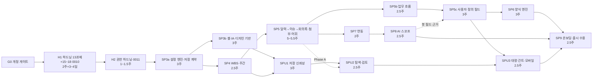

# 플랫폼 개정 설계 — 설정 계약·업무 흐름·사용자 정의 필드·달력·디자인

| 항목 | 값 |
|---|---|
| 날짜 | 2026-09-27 |
| 상태 | 초안 |
| 상위 정본 | `docs/superpowers/specs/2026-09-23-generic-platform-design.md`(이하 "정본") |
| 입력 | 검토 문서 `docs/2026-09-26-configurability-review-and-implementation.md` 제1~6부, 트리아지 `.superpowers/review-triage/triage-synthesis.md`(§2 설계 개정·§3 로드맵 편입)와 항목 상세 `.superpowers/review-triage/triage-parts.json`. 제7·8부는 원장 `.superpowers/review-triage/parts-7-8-synthesis.md`(main @`87bcd74` 읽기 전용 검증, §6.2.0 G0-7) |
| 사용자 결정(2026-09-26, 원문) | 1. 업무 흐름 설정화(트리아지 §2.1-1) — "어. 설정화"<br>2. 사용자 정의 필드(§2.1-2) — "사용자 정의 필드는 어디에 사용하는지 모르겠지만 필요하면 두는걸로 해줘."<br>3. 집계·위험·완료 정책(§2.1-3) — "지금과 동일하게"<br>4. 주 시작일과 근무일(§2.1-4) — "주 시작일은 일요일부터"<br>5. 한국 공휴일 오버레이(§2.1-5) — "안둬도 됨"<br>6. 디자인 쪽 기존 결정 번복(§2.1-6) — "기존결정 변경" |
| 선행 | 트리아지 §1 "지금 적용" 13과제와 제7·8부 원장이 더한 과제 15~18 은 SP2 뒤·SP3a 전 하드닝 H1 으로 따로 구현한다. 이 문서는 완료된 것으로 보고 다시 명세하지 않는다. 그 뒤 권한 하드닝 H2(`0011_authz_hardening`)를 SP3a 전에 한다(§6.2.0) |
| 기준 트리 | `sp2/phase-b` @ `9af4d38` + SP2 최종 fix wave `supabase/migrations/0009_sp2_isolation_fixes.sql`(F1~F6, SP2 최종 리뷰가 정한 번호). 코드 줄 번호는 `31878b1` 실측이다 — 그 뒤 커밋은 문서뿐이라 `src` 줄 번호가 같다. `0002`·`0009` 가 다시 정의한 함수(`import_wbs`·`replace_wbs`·`is_project_admin` 등)는 `0000` 줄이 아니라 최신 정의를 인용한다. `sp2-done` 태그가 찍히면 그 트리가 기준이다 |

## 이 문서를 읽는 법

- **이 문서는 정본의 개정이다.** 정본의 다음 범위를 대체하거나 고친다: §1.3 결정 6·결정 9 귀결, §1.4 Q4, §1.5(추가), §1.10(신설), §3.1 전부, §3.2.1 `nav`·§3.2.2 모듈 표 한 행·§3.2.3 본문·§3.2.5, §3.3 전부, §3.4 표의 일부 행, §3.5 #1·#3·#4, §4 서두·§4.2 결정 4·§4.5.1~§4.5.4 의 일부 경로·`FIXED_SLIDE_LIMIT`, §5.3.4 한 행·§5.4.3·§5.4.5·§5.5.1~§5.5.2 일부·§5.7(추가), §6.1(추가)·§6.2 SP3~SP9·§6.3·§6.4·§6.5.4~§6.5.9·§6.7, §7 머리·#2, 그리고 신설 디자인 시스템·IA 절. 편집 전수는 §7 이다.
- **나열되지 않은 정본 절은 그대로 정본이다.** §2 조직·권한 모델 전체, §3.2 의 나머지(`ModuleDef` 필드·`requireModule`·열거 게이트·env 플래그), §3.4 인벤토리의 나머지 행, §4 엔진 본체, §5 연동·AI·폐쇄망의 대부분, §6.1 원칙·§6.2 SP0~SP2·§6.6 포크 정책이 그렇다. SP1·SP2 스펙도 그대로다.
- **이 문서 안의 정본 분담.** 결정 수준의 모양과 결정 변경 대장은 §1, 설정 키의 이름·값 형태·저장·쓰기/읽기 계약·오류·이력은 §2, 업무 흐름·사용자 정의 필드의 동작·스키마는 §3, 달력·주간·이슈 채번·출력·연동의 동작은 §4, 디자인·IA 는 §5, SP 배정·게이트·마이그레이션 번호·기간·검증은 §6 이다. 서로 어긋나 보이면 사용자 결정(§1.2)을 먼저, 그다음 위 분담을 따른다.
- **표기.** `정본:N`(또는 문맥상 `:N`) = 정본 N행. `검토:N` = 검토 문서 N행(작업 트리 기준 — 제7부 추가로 17행 이후는 HEAD `23c1ab7` 보다 1행 밀려 있다). `0000:N` = `supabase/migrations/0000_baseline.sql` N행. `트리아지 §x` = 트리아지 종합의 절. 항목 id 는 `triage-parts.json` 의 id 이고, 제2부 항목은 트리아지 종합의 `P2-*` 표기를 쓴다. `§N` 은 이 문서의 절이다.
- **마지막 두 절.** §7 은 정본에 적용할 편집 목록이고, §8 은 남은 열린 항목이다. 정본 반영(§6.2.0 G0-6)이 끝나면 이 문서는 정본이 가리키는 개정 기록으로 남는다.

---

## 1. 개정 범위·결정 변경·착수 게이트

이 절은 정본을 2026-09-26 사용자 결정 6건에 맞춰 개정할 때 **무엇이 바뀌고 무엇이 그대로인지** 정한다. 여기에는 결정 수준의 모양과 소유 SP 만 적는다. 필드 단위 정본은 다음 절이다.

| 주제 | 정본 절 |
|---|---|
| 설정 키 이름·스코프·저장·쓰기/읽기 계약·오류·이력·카탈로그 | §2 |
| 업무 흐름(표시 상태·승인 단계·선행 기준·크레딧 정책)·사용자 정의 필드 | §3 |
| 달력·주 시작·주간 영역·이슈 채번·출력·연동 | §4 |
| 디자인 시스템·정보 구조(IA) | §5 |
| SP 배정·착수 게이트·마이그레이션 번호·기간·검증 | §6 |

### 1.1 개정의 입력과 범위

| 입력 | 지위 | 처리 |
|---|---|---|
| 정본 §1~§7 | 정본 | 이 개정으로 고친다(§7 정본 반영 지시) |
| 검토 문서 제1~6부 | **입력**(정본 아님) | 트리아지를 거친 항목만 반영한다. 검토:5 의 "이 파일이 … 단일 정본" 선언은 검토·인계 문서 사이의 정본성이다. 설계 정본은 정본 문서다(SP2 스펙 U1, `docs/superpowers/specs/2026-09-26-sp2-workspace-isolation-design.md:18`) |
| 트리아지 종합 + 항목 172건 | 분류 근거 | §1(지금 적용 13과제)은 SP2 뒤·SP3a 전 하드닝 H1 으로 **따로 구현 중**이며 여기서 다시 명세하지 않는다(§6.2.0). 이 개정의 대상은 트리아지 §2(설계 개정)와 §3(로드맵 편입)이다 |
| 사용자 결정 6건(2026-09-26) | 구속 | 1.2 |
| 검토 문서 제7·8부(권한 심층 검증 AUTH-01~12·회의록 첨부 업로드) | 입력(원장 판정 완료) | 제7·8부 — G0-7 원장 판정 완료(H1 15~18, H2, SP5 첨부 슬롯). 원장은 `.superpowers/review-triage/parts-7-8-synthesis.md` 다. AUTH-01·02 는 SP2 에서 해소됐다(`0009` F1·`5ae64e1`). 배치는 §6.2.0, 닫은 결정은 §8.2 다 |

범위 밖: 코드·마이그레이션 변경(이 개정은 문서만 바꾼다), SP2 범위(격리 — SP2 스펙이 정본), 하드닝 H1 과제(1~13·15~18)의 명세(구현 계획 `docs/superpowers/plans/2026-09-27-post-sp2-hardening.md`).

### 1.2 사용자 결정(2026-09-26)

| # | 트리아지가 올린 질문 | 사용자 답(원문) | 이 개정의 결정 | 관련 id |
|---|---|---|---|---|
| U-1 | 업무 흐름 설정화 — Q4 재개방(트리아지 §2.1-1) | "어. 설정화" | Q4 를 재개방한다. 시스템 의미 범주와 에이전트 프로토콜은 고정한다. 그 위에 프로젝트별 표시 상태·라벨, 선택형 승인 단계, 선행 충족 규칙, 크레딧 step/gap 정책을 둔다. 스크립팅은 없다(1.4.1, §3) | P1-1, D, P1-9c |
| U-2 | 사용자 정의 필드 — 결정 6 재개방(§2.1-2) | "사용자 정의 필드는 어디에 사용하는지 모르겠지만 필요하면 두는걸로 해줘." | 결정 6 을 완화한다. 대상은 3엔티티이고 필드는 선언형 타입이다(1.4.2, §3.6). 쓰임새는 고정 열에 없는 업무 값을 모아 검증·필터·출력하는 것이다. 예: 연구 프로젝트 이슈의 '실험 결과'(선택), 건설 프로젝트 WBS·주간 행의 '검측 수량'(숫자) | P1-4, E |
| U-3 | 집계·위험·완료 정책 설정화(§2.1-3) | "지금과 동일하게" | 설정화하지 않는다. 고정 목록에 명시하고 null 가중치 불일치만 정합 수정한다(1.4.3, §2.9) | COV-01, COV-02, I |
| U-4 | 주 시작일과 근무일(§2.1-4) | "주 시작일은 일요일부터" | 트리아지 안 (a)를 일요일로 채택한다. `calendar.week_start` 를 신설하고 기본값은 `'sunday'`, `'monday'` 도 허용한다. 주차 문서가 있는 기존 프로젝트는 **다음 주부터** 일요일로 전환하고 과거 주차 키는 다시 쓰지 않는다. 주차 문서가 없는 기존 프로젝트는 이관 시점부터 바로 일요일이다(1.4.4). 주차 라벨은 단일 규칙으로 통일한다(1.4.4, §4.2) | COV-03, J |
| U-5 | 한국 공휴일 오버레이(§2.1-5) | "안둬도 됨" | 오버레이를 삭제한다. 제품 어디에도 기본 공휴일을 두지 않는다(1.4.5, §4.2.7) | P1-3b |
| U-6 | 디자인 쪽 기존 결정(§2.1-6) | "기존결정 변경" | 셋 다 번복한다(1.4.6, §5):<br>• 전역 브리지 메뉴 → 워크스페이스 전체<br>• 다크 모드 재노출<br>• 크림·틸 → 중립·코발트(`public/brand/dflow-flow.svg` 흐름 아이콘과 맞춤) | D5-§3-bridge, D6-§3-fallback, D5-§9, D5-§5, D5-§2, D6-§1, D6-§13-palette |

U-3 은 재개방이 아니라 현행 확인이다. 나머지 다섯은 정본의 "변경 불가" 결정이나 원본에서 물려받은 코드 결정을 **사용자가 직접** 연 것이다. 트리아지 P1-판정이 짚은 대로, 에이전트나 검토 문서가 대신 연 것이 아니다.

### 1.3 결정 변경 대장

| # | 정본 위치 | 이전 | 개정 | 출처 | 귀결 |
|---|---|---|---|---|---|
| C1 | 머리 표 `정본:12`<br>§1.3 제목 `정본:60`<br>§6.7 `정본:3300`<br>§7 `정본:3315` | 결정 1~9·Q1~Q6 는 "변경 불가"이고 "설계상 결정은 닫혔다" | **사용자 명시 결정으로만 개정한다.** 개정은 §1.10(신설) 「결정 개정 이력」에 남긴다. 기록 항목은 날짜·결정 번호·이전/이후·출처다 | U-1·U-2·U-4·U-5·U-6 | 에이전트·검토 문서가 결정을 대신 뒤집지 못한다는 규칙은 유지한다(트리아지 P1-판정 주의점을 규칙으로 승격). 결정 3 은 재개방이 아니라 현행 확인이다 |
| C2 | Q4 `정본:81`<br>§3.3.4 `정본:1489-1490`<br>§6.1 표 `정본:2774`<br>SP5 본문 `정본:2978`, 범위 제외 `정본:2985`<br>R12 `정본:3178` | 이슈 상태 4종과 WBS 단계 `as/ip/im/xx` 는 제품 고정 | **Q4′**: 시스템 의미 범주와 에이전트 프로토콜만 고정한다. 프로젝트별로 다음을 설정한다:<br>• 표시 상태·라벨<br>• 선택형 승인 단계<br>• 선행 충족 규칙<br>• 크레딧 step/gap 정책<br>스크립팅은 없다(1.4.1) | U-1 | 소유 SP 는 신설 SP5b 하나다(§6.2). TS·SQL 패리티 대상은 `apply_workflow_event`·`guard_workflow_actual`·`enforce_issue_workflow` 다(§3.7). 호출처가 0건인 `set_dependency_waiver` 는 재작성하지 않고 SP5b 에서 삭제한다(§3.3.3). SP5 범위 제외 행은 삭제한다. §4.5.2 `areas[].issues[].status_label` 의 "제품 고정(Q4)" 표기(`정본:2021`)는 해석된 표시 상태 라벨이 된다 |
| C3 | §3.3.1 `core.stage_credits`(`정본:1441`)<br>트리아지 P1-9c 기각 | `CREDIT_STEP=5`·`CREDIT_GAP=10`(`src/lib/domain/stageCredits.ts:18-19`)은 제품 계약 | 두 값을 프로젝트 정책 `workflow.credit_policy {step, min_gap}` 으로 바꾼다. `step ∈ {1, 5}`, `min_gap` 은 정수 1~10, 기본값 `{5, 10}`(현행). 표 불변식(정수, 0~100, `xx=100`, 엄격 증가)은 고정한다. 표 키는 `workflow.stage_credits` 로 개명한다(§2.8.6) | U-1 | SQL 변경은 거의 없다. SQL 은 표 값만 읽고 상수는 폴백 `c_default` 하나뿐이다(`0000_baseline.sql:735`). 트리아지가 든 `tests/migrations/0096` 대조 테스트는 SP0 에서 삭제돼 없다(WF-GAP-2, §3.0). TS 검증기와 슬라이더만 바꾼다. P1-9c 판정은 번복한다 |
| C4 | §3.3.1 `agents.stage_workflow`(`정본:1448`)<br>§3.5 `정본:1630` | `{enabled, require_approval}`. 승인은 1단 고정이고, 기본값은 SP7 에서 정하기로 했다 | `agents.stage_workflow` 를 은퇴시킨다. 에이전트 사용 여부는 `modules.enabled ∋ 'agents'`, 승인은 `workflow.approval_steps`(1~3단, 기본 1단 = 현행)다. 0단(자동 승인)은 두지 않는다(§3.3.1 결정 W5) | U-1 | §3.5 열린 항목(`정본:1630`)이 닫힌다. 소유는 SP5b. 하드닝 과제 11(`expectedReportId`)의 계약 위에 쌓는다. 승인 원장은 `wbs_stage_approvals`(§3.3.2)다 |
| C5 | 결정 6 `정본:69`<br>§4.2 결정 4 `정본:1677`<br>§3.3.4 `정본:1492`<br>§4.5 카탈로그 | 행=설정값, **열=제품 고정** | **결정 6′**: 열 = 제품 고정 핵심 필드 + 프로젝트 사용자 정의 필드(대상 3엔티티, 선언형 타입). "출력=고객 양식+자리표시"는 유지한다 | U-2 | 신설 SP5c 가 소유한다. §4.5 에 `custom.<key>` 경로가 생긴다.<br>`정본:2050` 의 "팀별 동적 열 미지원"은 유지한다. 열 수가 팀 수에 따라 변하는 문제라 사용자 정의 필드와 무관하다.<br>결정 5("설정 항목=코드 고정")도 유지한다. 설정 키 `fields.wbs_item`·`fields.issue`·`fields.weekly_row` 셋은 코드 레지스트리에 고정이고, 그 값(필드 정의 목록)만 프로젝트 관리자가 정한다. Q4 어휘와 같은 모양이다 |
| C6 | §3.3.4 `정본:1491`·`정본:1502`<br>트리아지 COV-01·COV-02·I 의 권고 키 | 롤업·판정·`round1` 은 고정. 위험 임계값·생애 판정은 정본에 언급이 없다 | 고정을 유지하고, 고정 목록에 위험 임계값·생애 판정·이슈 대시보드 창을 명시한다. 예외는 하나 — 진척 롤업의 null 가중치 단일 규칙(null=1) 정합 수정이다(1.4.3). 위험 모델의 null 해석은 바꾸지 않는다 | U-3 | 번들 I 는 기각한다. 따라서 `progress.rollup`·`risk.thresholds`·`lifecycle.completion` 키를 만들지 않는다. null 가중치 통일은 SP4 에서 한다 |
| C7 | §3.3.4 `정본:1498`<br>§3.3.3 `정본:1481`(소비처 "주간 범위 계산")<br>§4.5.1 `report.week_label` 예시<br>§4.5.4 기준일 클램프 `정본:2066` | 주 시작=월요일. `calendar.week_start` 는 YAGNI | `calendar.week_start`, 기본값 `'sunday'`, `'monday'` 허용. 프로젝트 저장값은 적용일을 가진 규칙 목록이다. 이미 있는 주차 키는 바꾸지 않고, 기존 프로젝트를 포함해 다음 주부터 새 요일을 쓴다(1.4.4) | U-4 | 소유는 SP5 Phase A(`0015_calendar.sql`). `weekly_reports` 에 주 키 검증 트리거(`WEEK_KEY_INVALID`)를 둔다. 주차 라벨은 "주 키+3일이 속한 달의 몇 번째 주" 로 통일한다(§4.2.5) |
| C8 | §3.3.3 `정본:1481` 끝 문장<br>§3.5 `정본:1627`<br>§7 #2 `정본:3320` | 한국 공휴일 오버레이는 표시 전용이고 제품 고정(제안: 표시 유지) | 오버레이를 없앤다. 제품 어디에도 기본 공휴일을 두지 않는다. 쉬는 날은 프로젝트 데이터(근무 요일 + `holidays` 날짜 예외)에서만 온다 | U-5 | 소유는 SP5 Phase A(1.4.5). 트리아지 P1-3b 의 `calendar.holiday_region` 안과 설계 개정 20 의 "국가 달력 선택화"는 삭제한다 |
| C9 | 정본에 없음 — 원본에서 물려받은 코드 결정(`src/components/app/ProjectNavigationContext.tsx:33-47`, 포크 루트 `0e0ceaf`) | 전역 화면(`/meetings`·`/minutes`·`/account`·`/usage`·`/portfolio`·`/agents`·`/admin/*`)이 최근 프로젝트의 메뉴를 유지한다(브리지) | 워크스페이스 화면은 '워크스페이스 전체' 범위다. 프로젝트 메뉴와 프로젝트명 접두어를 보이지 않는다 | U-6 | 소유는 SP3b `ui/sp3-menu` 다. `/w/[slug]` 이동과 한 작업으로 묶는다(§5.3.3, §5.12.3) |
| C10 | 정본에 없음 — `src/components/app/HeaderChrome.tsx:187-193`. 주석 "사용자 요청으로 화면에서 숨김"(물려받음) | 다크 토글 숨김 | 다크 모드를 다시 노출한다. 테마 값은 `system \| light \| dark` 셋이고 계정 팝오버와 `/account` 에서 고른다. 토글 **위치**(숨겼던 전역 바 자리 대 계정 팝오버)는 에이전트 설계 판단이라 사용자 확인 항목으로 둔다(§8 #21 — 확인 전까지 이 배치가 잠정 기본값). 언어 토글(`:189`)은 이번 결정 범위 밖이라 숨김을 유지한다 | U-6 | UI-1(`ui/sp3-tokens`)에서 새 다크 토큰과 함께 노출한다. 옛 크림·틸 다크 세트를 먼저 노출하지 않는다(§5.6) |
| C11 | 정본에 없음 — `src/app/globals.css:37-41`("warm cream + teal … 재스킨"), `:47`·`:57`·`:85`·`:123`, 다크 `:141-190`(물려받음, 트리아지 D5-§1 정정) | 크림·틸 팔레트, 어두운 사이드바·히어로 | 중립·코발트로 바꾼다. 값은 제5부 §5(검토:785-800)에 제6부 §5 보정(검토:1090-1102)을 적용한 §5.5 다. 사이드바도 밝은 표면으로 바꾼다 | U-6 | 정본에 디자인 시스템·IA 절을 신설한다(트리아지 설계 개정 28~35, §5). UI-1 을 `ui/sp3-menu` 보다 먼저 머지한다(§5.12.1) |
| C12 | §6.3 번호표 `정본:3121-3127`<br>본문 `정본:3147`·`정본:3159` | `0009_settings`(SP3) … | 번호표를 교체한다. SP2 최종 fix wave 가 `0009_sp2_isolation_fixes` 를, 하드닝 과제 2 가 `0010_issue_code_seq_width` 를, 권한 하드닝 H2 가 `0011_authz_hardening` 을 쓰므로 SP3a 는 `0012` 부터다. SP4·SP5·SP5b·SP5c 신규 파일이 생기고, 번호는 레인 일정의 main 머지 순서다(§6.3) | SP2 최종 리뷰, 하드닝 과제 2, 제7·8부 원장(H2), U-1·U-2·U-4 | `정본:3147`·`정본:3159` 에 남은 옛 순서 서술("`0009`(SP7) → `0010`(SP6) → `0011`(SP8)")은 이미 배정표와 어긋나 있으므로 함께 정정한다 |
| C13 | §1.5 비목표 `정본:87-105` | — | 비목표를 추가한다:<br>• 스크립트형 워크플로(조건식, 프로젝트별 전이표, 필드 값 조건 전이, 자동 전이·타이머·웹훅 트리거)<br>• 승인 0단계(자동 승인)<br>• 대상 밖 엔티티의 사용자 정의 필드와 §3.6.10 의 필드 비목표<br>• 국가·지역 공휴일 달력<br>• 집계·위험·완료 정책의 설정화<br>• 고객별 임의 CSS·HTML·JS·레이아웃, 메뉴 그룹 구조 변경, 메뉴 숨김 설정(§5.11) | U-1·U-2·U-3·U-5·U-6 | "재제안 금지"(`정본:105`)에도 넣는다 |

**바뀌지 않는 결정.** 결정 1~5·7·8·9와 Q1·Q2·Q3·Q5·Q6 는 그대로다. Q4 의 승격 부분(근태 유형, 회의 카테고리, 이슈 심각도·원인·원천, 타임존, 근무일)도 그대로다. 결정 9 의 "목록형 설정은 FK 테이블"은 행이 FK 로 참조하는 목록(팀·담당 영역)에 계속 적용한다. 이슈 표시 상태와 필드 정의는 Q4 어휘와 같이 `values` + 트리거로 둔다 — 정본 §3.5 열린 항목 3 을 "`values` + 트리거"로 닫는 것과 같은 판단이다(§2.4.1). §2.8 비목표 "고객별 역할·capability"(COV-08·M 기각)도 유지한다.

### 1.4 변경 결정별 계약(결정 수준)

#### 1.4.1 업무 흐름 — Q4′ (U-1)

고정과 설정의 경계는 다음과 같다. 키 형태는 §2.8.2, 동작 규칙·스키마·DB 판정·done_when 은 §3 이 정본이다.

| 층 | 고정(제품) | 설정(프로젝트) | 저장 | 정본 |
|---|---|---|---|---|
| WBS 단계 | 코드 `as/ip/im/xx`(+크레딧 키 `rw`)와 `wbs_items_stage_check`(`0000_baseline.sql:6989`)<br>사건 → 단계 매핑(`0000:866-870`, `stageCredits.ts` `EVENT_CREDIT`) | 표시 라벨 `workflow.wbs_stage_labels`(미착수 포함 5칸). 미설정 칸은 현 `STAGE_LABEL_KO`·`STAGE_NONE_LABEL_KO`(`src/lib/domain/stageLabels.ts:9-12`) | `values` | §3.3.1 |
| 선행 충족 | 판정 축 셋: 단계, 승인된 주문, 실적 | `workflow.predecessor_gate: 'reached' \| 'final'`<br>• `'reached'`(기본값) = 현행 `predecessorReached`(`src/lib/domain/agentWork.ts:19-23`)<br>• `'final'` = `stage='xx'` ∨ 승인된 주문 ∨ (워크플로 밖 항목 ∧ 실적 ≥ 100) | `values`. TS 소비 5곳과 SQL 1곳(`apply_workflow_event` 첫 도달 `0000:916`)이 같은 값을 읽는다. 기준선의 둘째 SQL 사본 `set_dependency_waiver`(`0000:4832`)는 호출처가 없어 SP5b 가 삭제한다 | §3.3.3 |
| 크레딧 | 표 불변식(정수, 0~100, `xx=100`, 엄격 증가) | `workflow.credit_policy {step, min_gap}`, 기본 `{5, 10}`. 표는 `workflow.stage_credits` | `values` | §3.3.4 |
| 승인 단계 | 최종 승인 = 주문 `approved` = 단계 `xx`. 1단 이상 필수 | `workflow.approval_steps {code, label, approver}[]`(1~3단), `workflow.approval_distinct_approvers` | `values` + 원장 `wbs_stage_approvals`(라운드) | §3.3.2 |
| 에이전트 프로토콜 | 주문 상태 `ready/claimed/reported/approved/cancelled`(`agentWork.ts:5`)와 사건 종류<br>`/api/v1/agent/*` 경로·응답(SP7 동결, `정본:2577-2592`) | — | — | §3.4 |
| 이슈 상태 | 범주 4종 `open/in_progress/resolved/on_hold`<br>범주 전이표(`src/lib/domain/issues.ts:60-65`)<br>`issues_status_check`(`0000:6374`) | 표시 상태 `workflow.issue_statuses {code, label, color, category, sort, active}[]` | `values` + 새 열 `issues.status_code`, 트리거 `enforce_issue_workflow` | §3.2 |

핵심 규칙(상세는 §3):

- **전이.** 범주 사이의 이동은 고정 범주 전이표를 따른다. 같은 범주 안에서 표시 상태끼리는 자유롭게 옮긴다. 프로젝트별 전이표·역할별 간선·조건식은 두지 않는다(C13).
- **개수.** `open` 과 `resolved` 범주에는 활성 표시 상태가 1개 이상 있어야 한다. 새 이슈의 기본 상태는 `open` 범주의 첫 활성 상태(sort 순)다.
- **승인.** 마지막 단계의 승인만 `approve` 사건을 일으킨다(단계 `xx`, 크레딧 100, unblocked 알림). 중간 단계는 주문 status 를 바꾸지 않고 에이전트에게 보이지 않는다 — 프로토콜 불변의 근거다. 유효 단계가 2 이상이면 사람이 단계를 `xx` 로 직접 지정할 수 없고, `im` 라운드의 단계 승인으로만 `xx` 에 간다. DB 도 같은 판정을 하고 JWT 세션의 `stage` 직접 쓰기를 거부한다(§3.3.2). 승인자는 기존 관문(`loadOrderForAdmin`, `src/app/actions/agentWork.ts:213`)을 먼저 통과해야 하며, 설정은 권한을 좁히기만 한다(결정 8).
- **삭제.** 사용 중인 code(표시 상태, 승인 단계)는 삭제할 수 없고 비활성화와 명시적 이관(`migrate_setting_code`, §2.4.2)만 허용한다.
- **기본값.** 설정이 없으면 현행 동작을 그대로 재현한다: 표시 상태 4개(범주와 1:1), 라벨은 현 i18n, 선행 기준 `'reached'`, 크레딧 정책 `{5,10}`, 승인 1단.

#### 1.4.2 사용자 정의 필드 — 결정 6′ (U-2)

| 항목 | 결정 | 정본 |
|---|---|---|
| 대상 엔티티(1차) | `wbs_item`·`issue`·`weekly_row`(검토:450). 회의·근태·회의록·공지·위키·사람은 지원 한계다(C13) | §3.6.1 F1 |
| 정의 | 설정 키 `fields.<entity>` 의 `FieldDef[]`. 쓰기는 설정 RPC(revision CAS·키 단위 이력), 읽기는 `project_settings` RLS | §2.8.2, §3.6.2 |
| 값 | 엔티티 행의 `custom jsonb not null default '{}'`. EAV 는 기각한다(현 조회 패턴이 행 전체 적재이고, 엔티티 RLS 를 그대로 상속한다) | §3.6.1 F2 |
| 타입 | text·multiline·number·date·boolean·select·multiselect | §3.6.3 |
| 검증 | DB 트리거 `enforce_custom_fields(entity)` 가 PostgREST 직접 쓰기까지 막는다(Q4 어휘 트리거와 같은 이유, `정본:1471`) | §3.6.4 |
| 검색·색인 | GIN `jsonb_path_ops`(값 등가·포함 `@>`). `searchable` 필드만 AI 색인 본문에 들어간다 | §3.6.6 |
| 출력 | 카탈로그 경로 `custom.<key>`, Excel 프로파일 `customColumns` | §3.6.7·§3.6.8 |
| 상한 | 엔티티당 활성 30개(지원 제한) | §3.6.10 |
| 소유 | SP5c(`0023_custom_fields.sql`) | §6.2 |

#### 1.4.3 집계·위험·완료 정책 — 고정 유지 (U-3)

§2.9.1 고정 목록에 진척 롤업·위험 신호 임계값·프로젝트 생애 판정·이슈 대시보드 창을 명시한다(정의 file:line 은 §2.9.1). 번들 I 의 카탈로그 키 후보는 만들지 않는다.

**정합 수정 — 진척 롤업의 null 가중치 단일 규칙.** 현재 같은 null 이 롤업 층마다 다르게 해석된다.

- 루트: `overallProgress`(`src/lib/domain/rollup.ts:17-19`)와 `trend.ts:107-109` 는 전부 null 이면 균등, 일부만 null 이면 null=0 이다.
- 하위: `siblingWeight`(`rollup.ts:27-29`)와 `trend.ts:100` 은 null=1 이다.

결정: **진척 롤업의 모든 층에서 null=1** 로 하고, `rollup.ts` 가 export 하는 한 함수 `weightOf(w) = w ?? 1` 로 모은다. 적용 대상은 `overallProgress`·`siblingWeight`·`trend.ts` 의 루트·하위 계획 곡선 셋뿐이다. 이유는 셋이다.

- 한 트리 안에서 같은 null 이 층마다 다른 뜻이면 안 된다.
- null=0 은 가중치를 적지 않은 작업을 집계에서 조용히 뺀다. 에러 처리 원칙 ①의 위장과 같은 결이다.
- 루트가 전부 null 이면 두 규칙의 결과가 같다(현행 테스트가 이미 "전부 null → 균등"을 고정한다). 그래서 대부분의 프로젝트는 값이 바뀌지 않는다.

**위험 모델은 바꾸지 않는다.** `topWeightPhaseDelayed`(`src/lib/domain/dashboard.ts:118-123`)는 `riskModel` 의 입력이고 현행 규칙은 null=0, 전부 null 이면 비교 불가 → false 다. 이 함수에 `weightOf` 를 쓰면 루트 [A w=null·지연, B w=0.5·정상] 의 최상위 가중 Phase 가 B 에서 A 로 바뀌어 `topWeightDelayed` 가 false → true 가 되고 위험 신호가 한 단계 오른다. 사용자 결정 3("지금과 동일하게")이 위험 정책을 고정하므로 이 함수는 정합 수정의 범위 밖이다(§2.9.1 위험 신호 행). 바꾸려면 사용자 결정이 따로 필요하다.

SQL 에는 같은 집계가 없다(`0000_baseline.sql` 의 `weight` 는 저장·임포트만 한다). TS 만 고친다. 과거 스냅샷(`src/lib/data/snapshots.ts:61,94` 의 저장값)은 기록 시점의 값이므로 재계산하지 않고, 커밋 메시지에 동작 변화를 적는다. 가중치가 일부만 채워진 트리에는 WBS 에 "가중치 미지정 N개" 를 표시한다.

소유는 SP4 이고, done_when 은 다음과 같다(§6.2 SP4 가 이 목록을 인용한다).

- `[(100%, w=1), (0%, w=null)]` 의 전체 실적이 50 이다. 하위 노드에서도 같은 케이스가 같은 값을 낸다.
- `overallProgress(roots)` 가 가상 루트에 대한 `computeNode` 결과와 같다(속성 테스트).
- `trend` 의 루트 계획 곡선이 `overallProgress` 와 동치다.
- `riskModel` 이 개정 전후 같다. 루트 [A w=null·지연, B w=0.5·정상] 에서 `topWeightDelayed` 는 false 로 남는다(회귀 테스트). `dashboard.ts` 는 `weightOf` 를 import 하지 않는다.

귀결: 트리아지 설계 개정 3(카탈로그 키 후보)은 기각한다. P2-§5-accept 의 인수 시나리오에서 "다른 임계값과 집계 방식"을 뺀다(§6.5.8).

#### 1.4.4 주 시작 요일 — `calendar.week_start` (U-4)

| 항목 | 결정 | 정본 |
|---|---|---|
| 키·값 | 워크스페이스 키는 `'sunday' \| 'monday'`(기본 `'sunday'`). 프로젝트 키의 저장값은 규칙 목록 `{ day, from }[]` 이고 편집 입력은 요일 하나다. 새 프로젝트는 생성 시 워크스페이스 값을 복사한다(상속 아님) | §2.8.1·§2.8.2, §4.2.2 |
| `calendar.working_days` 와의 관계 | 별개의 축이다(`정본:1498` 의 구분 유지). 주는 주 시작 요일로 자른 기간이고, 보고 표시 요일은 그 기간 안의 근무일이다 | §4.2.5 |
| 적용 시점 | **다음 주부터.** 전환 주 하나가 6일(월→일) 또는 8일(일→월)이 되어 틈·겹침 없이 잇는다. 이미 있는 주차 문서의 `week_start` 는 바꾸지 않는다(재키·백필 없음). `UNIQUE (project_id, week_start)`(`0000_baseline.sql:7950`)는 그대로다 | §4.2.4 |
| 기존 프로젝트 | SP5 마이그레이션이 주차 문서가 있는 프로젝트에 월→일 전환을 마이그레이션 실행일 기준으로 기록한다(E 이후 키 문서가 이미 있으면 E 를 그 뒤로 미룬다). 주차 문서가 없는 프로젝트는 키 없음 = 제품 기본값(일요일)이라 **이관 시점부터 즉시** 일요일이다. 이 프로젝트들은 저장된 주 키가 없어 키 충돌은 없지만, 파생 주 보기(이슈 추이·봇의 '이번 주'·월 달력 첫 열)가 이관한 주 중간에 일요일 기준으로 바뀐다. 원격 운영 데이터는 없다(로컬 우선) | §4.2.4 |
| 주차 라벨 | 기준일 = 주 키 + 3일. 라벨 = 기준일이 속한 달의 몇 번째 주. 시트·보고서·파일명이 같은 함수를 쓴다. 보고서의 `ceil(오늘/7)` 규칙은 폐기한다 | §4.2.5 |
| 이월 원본 | `findCarryOverSource` 의 "해당 키 이전 가장 최근 문서"는 요일과 무관하므로 코드 변경 없이 전환을 넘는다. done_when 테스트로 고정한다 | §4.2.4 |
| 소유 | SP5 Phase A(`0015_calendar.sql`). `calendar.timezone`·`working_days` 소비처 교체와 같은 패스다 | §6.2 |

#### 1.4.5 한국 공휴일 오버레이 삭제 (U-5)

`src/lib/domain/holidays.ts`(KR 특일 표)와 `src/lib/i18n/dict/holidays.ts`·`holidays.en.ts` 를 지우고, 달력 3화면의 쉬는 날 표시는 프로젝트 달력(근무 요일 + `holidays` 날짜 예외)에서만 만든다. WBS 빌더 CLI·템플릿의 기본 공휴일은 하드닝 과제 6(DC-07)이 이미 `[]` 로 바꾼다(같은 방향의 선반영). 하드닝 6 범위 밖인 WBS 검증 CLI `scripts/wbs/validate.mjs:26,56`(`npm run wbs:validate`, 고정 공휴일 4일 하드코딩)은 SP5 Phase A 가 입력 JSON 의 `holidays`(기본 `[]`)로 바꾼다. 영업일 계산의 정본은 `calendar.working_days` 와 프로젝트 `holidays` 표 두 가지다. 소유는 SP5 Phase A, 상세·가드 테스트는 §4.2.7 이다.

#### 1.4.6 디자인 결정 번복 3건 (U-6)

| # | 현행(근거) | 개정 | 소유·브랜치 | 정본 |
|---|---|---|---|---|
| D-1 브리지 → 워크스페이스 전체 | `ProjectNavigationContext.tsx:33-47` `isGlobalProjectBridge`, `:77` `menuProjectId = routeProjectId ?? (isGlobalBridge ? remembered : null)`, `Sidebar.tsx:222` 의 "{프로젝트} 메뉴" | 워크스페이스 화면은 워크스페이스 내비(홈·내 업무·프로젝트·공용 공간·운영)만 보인다. 이 화면들은 SP2 U2 에 따라 `/w/[slug]/*` 로 이동한다. 최근 프로젝트는 전환기의 최근 방문 목록에만 쓰고 현재 범위처럼 강조하지 않는다 | SP3b `ui/sp3-menu`. UI-2·`navFor()` 와 한 작업(트리아지 설계 개정 27) | §5.3.3 |
| D-2 다크 모드 재노출 | `HeaderChrome.tsx:192` 토글이 `hidden`. 기능 코드는 살아 있다(`src/components/providers/ThemeProvider.tsx`, prefs `theme`, `src/lib/prefs/sync.ts:7`) | 테마 `system \| light \| dark` 를 계정 팝오버와 `/account` 에서 고른다(토글 위치는 §8 #21 사용자 확인 — 잠정 기본값). 언어 토글은 숨김 유지 | SP3b UI-1 `ui/sp3-tokens`. **새 다크 토큰과 같은 브랜치** | §5.6 |
| D-3 팔레트 중립·코발트 | `globals.css:47` canvas `#f5efe6`, `:57` brand `#0f766e`, `:85-92` 어두운 사이드바, `:94-100` 어두운 히어로, `:123` teal→navy 그라데이션, `.dark` `:141-190`. 포크 이후 값 변경이 없다(D5-§1) | 주 동작 코발트 `#315CDB`(흰 글자 5.70:1). 흐름 아이콘(`#597AFF`→`#3655DA`→`#2537A1`)과 같은 계열. 토큰 3층(원색→의미→컴포넌트)과 이행표. 고객 accent 는 `branding.accent` 파생 세트로만 | SP3b UI-1 `ui/sp3-tokens`. **`ui/sp3-menu` 보다 먼저 머지**(사이드바·헤더를 두 번 고치지 않기 위해) | §5.5 |

### 1.5 검토 문서의 "A~M 일괄 구현" 지시 기각

검토 문서는 다음을 지시한다.

- 파일 전체를 받아 제3부 A~H, 제2부 I~M, UI-0~6, COM-0~6 을 "함께 수행"하라(검토:19).
- "분석·계획만 제출하고 끝내지 말고 … 구현과 검증을 진행하라"(검토:302).
- "A~H만으로 완료를 선언하지 말고 … I~M도 반영"하라(검토:304).
- 한 패스 실행 순서를 따르라(검토:492-502).

이 지시를 **기각한다.** 트리아지 P3-§0·P3-§5 의 판정과 같다.

| 사유 | 근거 |
|---|---|
| SP2 가 진행 중이다 | `sp2/phase-b` 의 마지막 과제가 진행 중이다. 설정·워크플로·IA 는 SP2 뒤에 반영한다(SP2 스펙 U1 `:18`, U2 `:19`) |
| 의존 순서가 있다 | 레지스트리(SP3a)가 없으면 소비처를 옮길 수 없다(B·C·F) — `정본:2765` "설정 엔진(SP3)이 개별 승격(SP4·SP5)보다 먼저". SP4 의 팀 캐시 폐기는 SP5 `minutes.team_id` 의 전제다(`정본:2927`). SP3a → SP4 → SP5 → SP5b → SP5c → SP6 순서를 유지한다(§6.3) |
| 한 SP = 한 사이클이다 | `정본:2759-2763`: 매 SP 끝은 배포 가능 상태여야 한다. 일괄 구현은 다음 규칙들을 한 흐름에서 동시에 지킬 수 없다: 마이그레이션 번호 유일성, G1(코드·마이그레이션 분리), G4(`db:reset` 리허설 트레일러), G2(UI 위험 파일의 `ui/` 브랜치 + 눈확인) |
| 범위가 사용자 결정으로 바뀌었다 | • I 는 기각(U-3).<br>• K 의 보존 부분(COV-05)은 기각(트리아지 §4).<br>• M(COV-08)은 기각(§2.8 비목표, 결정 8).<br>• L 은 카탈로그의 운영 설정·지원 제한 절(§2.9)과 하드닝 과제 3(COV-07)으로 끝난다 |

묶음별 처리:

| 묶음 | 처리 | 소유 |
|---|---|---|
| A 설정 엔진·모듈 검증 | §2 | SP3a |
| B 주간 영역·팀 매핑 | §4.3. `ensureStandardRows` 는 "읽기 경로 쓰기 금지 + 영역 추가 RPC 백필"로 결정했다(트리아지 설계 개정 15 의 (a)) | SP4 |
| C 달력·시간대 | §4.2. 국가 달력 선택은 U-5 로 삭제한다 | SP5 Phase A |
| D 워크플로 | §3.1~§3.5 | SP5b |
| E 사용자 정의 필드 | §3.6 | SP5c |
| F 이슈 영역·채번·8칸 초과 | 채번(`issues.id_policy`)은 §4.4, 8칸 창은 §4.5.1. F-seq100 은 하드닝 과제 2 | SP5·SP6 |
| G Excel 프로파일 | 하드닝 과제 1 로 선반영한다. SP3a 는 저장소를, SP4 는 표준 레이아웃을 맡는다(§4.6) | H1·SP3a·SP4 |
| H SMTP·팀 인식·잔여 | 하드닝 과제 3·4·5·6·8, 그리고 SP4(팀 원천·이름 매칭)·SP5(어휘·회의록)·SP8(봇 도메인)(§4.8·§4.9) | 분산 |
| I 집계·위험·완료 | **기각**(U-3). null 가중치 통일만 한다(1.4.3) | SP4 |
| J 보고 주기·주 시작 | §4.2.4·§4.2.5. 보고 주기는 주간만(지원 제한) | SP5 Phase A |
| K 알림·보존·스케줄 | 알림 정책(COV-04)은 SP8 스트레치(§4.10). 보존(COV-05)은 기각한다 | SP8 |
| L 운영·호환·로케일·상한 | 카탈로그의 운영 설정·지원 제한 절(§2.8.4·§2.9.2·§4.9). COV-07 은 하드닝 과제 3 | H1·SP3a |
| M 역할·capability | **기각**(§2.8 비목표, 결정 8, §4.11) | — |
| UI-0~6·COM-0~6 | UI/COM 트랙으로 로드맵에 넣는다(트리아지 설계 개정 27). UI-1·UI-2 는 SP3b, 나머지는 SPU1~3·SP9(§5.12, §6.2) | 트랙 |

예외가 하나 있다. 트리아지 §1 의 13과제(와 제7·8부 원장이 더한 과제 15~18)는 일괄 구현이 아니라 **독립 소과제(H1)** 로, SP2 뒤·SP3a 전에 끝낸다. 각 과제는 자기 커밋·브랜치·트레일러 규칙을 따른다. 권한 하드닝 H2 도 같은 규칙의 독립 묶음이다(§6.2.0).

### 1.6 착수 게이트

SP3a 착수 게이트(G0)·하드닝(H1)·권한 하드닝(H2)의 정본은 §6.2.0 이다. H2 는 G0-7 판정으로 채택됐다(§8.2). "SP3a 착수"는 SP3a 첫 마이그레이션(H2 `0011_authz_hardening` 뒤이므로 `0012_settings.sql`)을 쓰는 시점이며, 이 개정이 게이트에 요구하는 것은 셋이다: 이 문서의 사용자 승인과 정본 반영(§7), §2 설정 계약의 확정, 레지스트리 모양이 사용자 결정의 키(범주 속성을 가진 어휘, 구조체 값, 규칙 목록 값, 복합 영향·입력≠저장·변환 복사)를 담을 수 있다는 것(§2.6.1). 목적은 SP3a 의 `0012` 가 나중 SP 의 키 때문에 다시 바뀌지 않게 하는 것이다. 나중 SP 가 SQL 쪽에 더하는 것은 `settings_ref_check` 디스패처의 분기뿐이다(`create or replace`, §2.3.2).

---

## 2. 설정 엔진 계약 개정(정본 §3)

이 절은 정본 §3.1(설정 엔진) 전부, §3.2.3 `effectiveModules` 본문, §3.3(설정 카탈로그) 전부, §3.3.4 고정 어휘 표, §3.5 열린 항목 1·3·4 를 **대체**한다. §3.2 의 나머지(`ModuleDef`·`requireModule`·메뉴 파생·게이트 테스트·env 플래그)와 §3.4 인벤토리는 그대로 둔다.

키의 **이름·스코프·저장소·검증·오류·이력 계약은 이 절이 정본**이다. 워크플로·사용자 정의 필드·달력·이슈 채번의 **동작 규칙**(전이 판정, 필드 값 컬럼, 날짜 예외·주 키, 채번 토큰 해석)은 주제 절(§3 업무 흐름·필드, §4 달력·주간·이슈, §5 디자인·IA)이 정본이다. 두 곳이 어긋나면 키 이름과 값 형태는 이 절을, 동작은 주제 절을 따른다.

**전제**

- 트리아지 §1 의 "지금 적용" 13과제는 SP2 머지 뒤, SP3a 착수 전에 끝난다(하드닝). 이 절은 그 결과를 전제로 쓴다.
  - 과제 1: `/api/export` 가 저장 프로파일을 expand 와 무관하게 쓴다. 손상은 422, 미설정+expand 는 409 로 응답한다.
  - 과제 2: `0010_issue_code_seq_width` 가 번호 0010 을 쓴다. 0009 는 SP2 최종 fix wave `0009_sp2_isolation_fixes` 다. 0011 은 권한 하드닝 H2 의 `0011_authz_hardening` 이다(§6.2.0). 그래서 SP3a 설정 마이그레이션은 **`0012_settings.sql`** 이 된다(번호표 교체는 §6.3).
  - 과제 3: 봇이 `getProjectConfig` 로 마일스톤 키워드를 읽는다. `EMBED_DIM` 은 768 로 고정된다.
  - 과제 5: SMTP 가 env 로 중립화된다.
  - 과제 7: 포털 아이콘 white-label 기본값이 정리된다.
  - 과제 12: 대비 토큰이 보정된다.
- 권한 하드닝 H2(§6.2.0)도 SP3a 착수 전에 끝난다. 설정 표와 관계있는 것은 둘이다. `anon`·`authenticated` 의 truncate/trigger/references/maintain 이 전 테이블에서 회수돼 있고(H2-b), minutes 는 `share_token` 을 뺀 열 단위 SELECT 권한이다(H2-c). 2.2.1 ⑤ 의 설정 표 revoke 는 H2-b 와 겹쳐도 그대로 둔다 — 이 표의 권한 계약을 이 마이그레이션이 스스로 말하게 한다.
- 사용자 결정 ①~⑥(§1.2)은 이 절에 키로만 반영한다: ① `workflow.*`, ② `fields.*`, ③ 고정 목록과 null 가중치 정정(2.9.1), ④ `calendar.week_start`, ⑤ 오버레이 삭제(키를 만들지 않는다), ⑥ `branding.*`·`navigation.menu`·개인 `theme`.

### 2.0 결정 요약

| # | 결정 | 정본 대비 | 이유 | 근거 |
|---|---|---|---|---|
| S1 | 스코프는 플랫폼·워크스페이스·프로젝트·개인 4층이다. 층 사이에 **런타임 상속은 없다**. 프로젝트 키는 `저장값 ?? 제품 기본값` 으로 해석한다. 워크스페이스 값은 생성 시 **복사**만 한다 | `:1170` "프로젝트 config 는 워크스페이스 config 를 포함하지 않는다"를 유지하고 명문화했다 | 동적 상속을 두면 워크스페이스 한 번의 변경이 모든 프로젝트의 과거 해석을 흔든다. 그러면 P1-AC4(프로젝트 격리)와 과거 의미 보존(P1-8)을 둘 다 지킬 수 없다 | D6-§10-inheritance, D5-§6.3 |
| S2 | 예외는 **배포 기본값** 3키뿐이다. 미설정 워크스페이스 키가 env 를 읽는다(`invites.allowed_domains`·`branding.product_name`·`branding.mail_from_name`) | SP2 `invites.ts:64-72` 의 env 폴백을 명시 계층으로 승격했다 | 운영자가 폐쇄망·단일 워크스페이스 설치에서 한 줄로 기본을 준다. 이 3키 밖으로 넓히지 않는다 | P3-§3.1 |
| S3 | 플랫폼 스코프에는 **새 테이블을 만들지 않는다**. env(운영 설정)와 기존 `llm_config`·`llm_profiles` 두 가지만 쓴다 | 신규 | 런타임에 플랫폼 관리자가 바꾸는 값이 LLM 말고는 없다(YAGNI). 운영 설정은 목록 상수로 카탈로그에만 싣는다 | P2-§4, COV-07, L |
| S4 | 설정 문서에 `revision bigint` 을 둔다. 모든 쓰기는 `expectedRevision` 과 `commandId` 를 받는다. revision 이 다르면 409, 같은 commandId 는 멱등으로 처리한다. 값을 하나도 바꾸지 않는 명령은 revision 을 올리지 않고 충돌도 내지 않는다(2.3.2) | `:1068-1099` 에 revision 이 없었다 | 두 관리자가 편집하면 마지막 쓰기가 앞 쓰기를 조용히 덮는다(J3 "무통보 덮어쓰기 0건" 위반) | P1-8, D6-§7-statemachine, D6-§7-server |
| S5 | `schema_version int` 과 레지스트리 변경 규칙을 둔다. 키 형태를 제자리에서 바꾸지 않고 새 키로 옮긴다. 저장본의 세대가 코드보다 새면 쓰기를 거부한다 | 신규 | 롤백한 구 코드가 새 세대 데이터에 쓰지 못하게 막는다. 형태 변경은 데이터 마이그레이션으로 드러낸다 | D6-§10-schema-revision |
| S6 | 모르는 키가 patch 에 오면 **거부**한다(`CONFIG_UNKNOWN_KEY`) | `:1133`·`:1185` 의 strip 을 폐기했다 | 저장 성공으로 위장하지 않는다. 저장본 안의 모르는 키(롤백 잔여)는 읽을 때 무시하고 쓸 때 보존한다 | P3-§3.2 |
| S7 | 읽을 때 parse 가 실패한 키는 **키 단위 `invalid` 상태**로 둔다. 기본값으로 치환하지 않는다 | `:1168` 의 "default 로 채우고 console.error" 를 폐기했다 | 에러 3원칙 ①(표시=로깅)을 따른다. 다른 키는 계속 쓴다 | P1-8, P3-§3.2 |
| S8 | 설정 표 쓰기는 **SECURITY DEFINER RPC 로만** 한다. `anon`·`authenticated` 의 insert/update/delete 를 회수하고, 0008 의 `workspace_settings_write` 정책을 삭제한다. **`service_role` 권한은 유지한다.** 서버 코드의 직접 쓰기는 grep 게이트(2.11 SP3a ⑦)로 막는다 | `:1076` "쓰기 정책 없음"을 권한 수준으로 강화했다. 0008 쓰기 정책을 뒤집는다 | PostgREST 직접 쓰기(클라이언트가 가진 `authenticated` JWT)가 parse·revision·이력을 우회하지 못하게 한다. `service_role` 키는 서버 안에만 있다. 이 권한까지 걷으면 SP2 불변식 ⓘ(`tests/rls/workspace-isolation-cases.test.ts:174-199`, F22 — service_role 은 public 표 전부에 SELECT·INSERT·UPDATE·DELETE)이 깨진다. 또 service_role 로 도는 INVOKER RPC(`apply_workflow_event` 등)의 `FOR SHARE` 가 UPDATE 권한을 요구하므로 42501 이 난다 | P3-§3.2 |
| S9 | 어휘 code 의 삭제 검사는 **저장과 같은 트랜잭션**에서 한다. 참조 쓰기 트리거와 같은 행 잠금 규약(`FOR UPDATE` 대 `FOR SHARE`)을 쓴다 | `:1206-1208` 의 사전 `count(*)` 주입을 폐기했다 | 사전 count 와 저장 사이에 경합이 생긴다(P1-8 반례) | P1-8, P3-§3.3 |
| S10 | 참조된 항목의 **의미 속성**(`counts_as`·상태 `category`·필드 `type` 등)은 바꾸지 못한다. 바꾸려면 새 code 를 추가하고 옛 code 를 비활성화한다 | 신규 | 과거 행의 의미를 기간 버전 없이 보존하는 가장 단순한 방법이다 | P1-8 |
| S11 | 키마다 `impact`(기존 데이터 영향)를 선언한다. 저장된 보고서·스냅샷은 설정이 바뀌어도 **재계산하지 않는다** | 신규 | 확정 보고가 조용히 재해석되지 않게 한다 | P3-§3.3, COV-01 |
| S12 | 모듈 모순을 해소한다. `modules.enabled` 에는 선택 모듈만 저장하고, core 는 닫힘 계산 **전에** 합친다 | `:1205` 행을 삭제하고 `:1306-1307` 의 순서를 뒤집었다 | 두 조건을 동시에 만족할 수 없다(P1-6) | P1-6, A |
| S13 | 꺼진 모듈의 설정도 **미리 저장할 수 있다**. 단, 워크스페이스가 그 모듈을 허용한 경우만이다 | `:1184` "꺼진 모듈 키는 거부"를 폐기했다 | 켜기 전에 준비할 수 있어야 한다. 허용 밖 모듈은 숨은 설정이 되므로 거부한다 | A |
| S14 | `SettingDef` 를 6필드에서 10필드로 늘린다(`editor`·`apply`·`impact`·`sql` 추가). `impact` 는 영향 목록(복합 가능)이다. 배포 기본값·생성 시 복사(변환 포함)·입력≠저장 편집·재색인 부수효과는 선택 필드 4개로 둔다 | `:1137` 의 "6종뿐"을 폐기했다 | 편집 주체·적용 시점·기존 데이터 영향이 없으면 카탈로그가 종단 연결을 보이지 못한다. `workflow.approval_steps`·`calendar.week_start`·`fields.*` 처럼 값이 복합 영향이거나 입력과 저장 형태가 다른 키를 SP3a 레지스트리가 담아야 한다(G0-4) | P3-§3.1, P2-§5-cols |
| S15 | 키 이름은 `<네임스페이스>.<이름>` 2단 평면 키다(`values` 최상위 문자열). 이름을 넷 바꾼다(2.8.6) | `branding` 단일 객체, `core.stage_credits`, `issues.code_prefix`, `agents.stage_workflow` | 부분 편집, 워크플로 한 네임스페이스, 채번 정책 확장 | D6-§10-branding-key, P1-5 |
| S16 | `docs/settings-catalog.md` 를 **SP3a** 에서 만든다. 레지스트리에서 자동 생성하고 동기화 테스트를 둔다 | `:1485`·R12 는 SP5 수기였다 | 카탈로그가 SP3a 계약 자체다. 수기로 두면 레지스트리와 갈라진다 | P3-§0, P2-§5-cols |
| S17 | `calendar.week_start` 의 요일은 `'sunday'`·`'monday'` 중 하나이고 제품 기본값은 `'sunday'` 다. 프로젝트 저장값은 적용일을 가진 규칙 목록이다(2.8.7). 기존 프로젝트는 이행이 "다음 주부터 일요일" 전환 규칙을 명시 기록한다(R2 의 예외). 주차 문서 키는 불변이다 | `:1498` 의 YAGNI 를 폐기했다 | 사용자 결정 ④. 기존 프로젝트까지 일요일로 바꾸는 것이 결정의 내용이다 | COV-03, J |
| S18 | 진척 롤업의 null 가중치를 **루트·하위 모두 1** 로 통일한다(정합성 수정, §1.4.3). 집계·위험·완료 정책 자체는 고정하고, 위험 모델의 `topWeightPhaseDelayed`(null=0)는 바꾸지 않는다 | `:1491`·`:1502` 의 고정을 유지하고 롤업 규칙만 단일화했다 | 사용자 결정 ③. 한 트리 안에서 null 의 의미가 0 과 1 로 갈린다(`rollup.ts:18-19` 대 `:27-29`) | COV-01, I |

### 2.1 스코프와 우선순위

| 층 | 저장소 | 편집 주체 | 적용 대상 | 해석 |
|---|---|---|---|---|
| 제품 기본값 | 코드 레지스트리 `SettingDef.default` | 코드 변경(2.6 레지스트리 변경 규칙) | 모든 키 | 미설정 키의 값 |
| 배포 기본값 | env — 3키만(S2) | 운영자 | 해당 워크스페이스 키가 미설정일 때 | `워크스페이스 저장값 ?? env ?? 제품 기본값` |
| 플랫폼 | env(운영 설정)와 `llm_config`·`llm_profiles`(2.8.4) | 운영자와 플랫폼 관리자 | 배포 전체 | 레지스트리 밖. 카탈로그 목록 상수 `OPERATIONAL_SETTINGS` 에 싣는다 |
| 워크스페이스 | `workspace_settings.values` | 워크스페이스 관리자. 단 `modules.allowed` 는 플랫폼 관리자 | `/w/[slug]/*` 화면, 워크스페이스 모듈, 새 프로젝트의 초기값. 그리고 닫힌 목록의 워크스페이스 전역 키(표시·셸·보안 제한·모듈 판정)는 `/p/*` 를 포함한 전 화면(아래 화면별 해석 규칙) | `저장값 ?? (배포 기본값) ?? 제품 기본값` |
| 프로젝트 | `project_settings.values` 와 목록형 FK 표(2.8.3) | 프로젝트 관리자(워크스페이스 관리자 승계 포함) | 그 프로젝트 | `저장값 ?? 제품 기본값`. **워크스페이스 값을 런타임에 읽지 않는다** |
| 개인 | `user_preferences.prefs` | 본인 | 표시만 | 업무 계산·권한·필수 입력에 들어가지 않는다 |

**용어.** "복사"와 "상속"을 구분한다. `SettingDef.seedFrom` 이 있는 프로젝트 키는 프로젝트를 만들 때 워크스페이스 값을 한 번 복사해 저장한다. 현재 이 목록은 `calendar.timezone`·`calendar.working_days`·`calendar.week_start`·`minutes.attachments`(SP5 MIN-ATT) 다(`week_start` 는 `seedFrom.map` 이 요일 하나를 규칙 목록 `[{ day, from: null }]` 로 바꿔 저장한다, 2.6.1·2.8.7). 그 뒤 워크스페이스 값이 바뀌어도 프로젝트 값은 따라가지 않는다.

설정 화면은 값마다 출처를 셋 중 하나로 보인다.

- 프로젝트 설정
- 제품 기본값
- 생성 시 워크스페이스 값에서 복사(이력의 `source='create'` 행으로 판정)

**"상속됨" 라벨은 쓰지 않는다**. 복사 원본 프로젝트가 있으면 `source='copy'`·`copied_from` 으로 표시한다(정본 3.1.6 의 `copy_project_config`, 2.3.3).

**화면별 해석 규칙.** 키를 두 종류로 나눠 규칙을 따로 둔다.

- **업무 계산 키**(달력 `calendar.*`·흐름 `workflow.*`·어휘·필드 `fields.*`·채번 `issues.*`·`core.*` 처럼 판정·계산·입력 검증에 쓰는 키)는 한 화면에서 한 층만 쓴다.
  - `/p/[id]/*` 는 프로젝트 키만 읽는다.
  - `/w/[slug]/*`(프로젝트 문맥 없음)는 워크스페이스 키만 읽는다. 예를 들어 워크스페이스 화면의 '오늘'과 '이번 주'는 워크스페이스의 `calendar.timezone`·`calendar.week_start` 로, 워크스페이스 달력의 비근무 요일 표시는 워크스페이스 `calendar.working_days` 로 계산한다. 포털·내 업무에 프로젝트 행이 섞여도 '오늘'·'오늘 마감'·'지연 N일' 판정은 워크스페이스 tz 하나로 한다. 행의 날짜 값은 date-only 라 변환하지 않는다(§4.2.3·§4.2.6·§5.9.1).
- **워크스페이스 전역 키**는 모든 화면(`/p/*` 포함)에 워크스페이스 값을 적용한다. 목록은 닫혀 있다.
  - 표시·셸 키: `branding.*`(셸 로고·accent·메일 발신명), `navigation.menu`(워크스페이스·프로젝트 내비의 그룹 안 순서·라벨, §5.3.5), `portal.widgets`(포털에서만 쓰인다).
  - 보안 제한: `security.local_drafts`(모든 편집 표면, §5.8.5). 개인 설정으로 완화하지 않는다.
  - 모듈 판정: `effectiveModules`(워크스페이스 `modules.allowed`·`ai.enabled` ∩ 프로젝트 `modules.enabled`, 2.7).
- 이 밖의 워크스페이스 키를 프로젝트 화면이 읽거나, 프로젝트 업무 계산 키를 워크스페이스 화면이 행 단위로 읽는 것은 금지한다. 새 워크스페이스 전역 키는 이 목록을 개정해서만 추가한다.

### 2.2 저장소

#### 2.2.1 표 정의(`0012_settings.sql`, SP3a)

`project_settings`(`0000:6799-6817`)와 `workspace_settings`(`0008:9-22`)는 이미 있다(PK·FK·RLS 정책 포함). 그래서 `create table` 이 아니라 **`alter table`** 로 문서 1행 모양으로 바꾼다. 순서는 ① 열 추가 → ② 누락 행 백필 → ③ 넓은 열 이행(2.2.2) → ④ 넓은 열 drop → ⑤ 권한·정책·행 생성 트리거다.

```sql
-- ① project_settings: 기준선의 넓은 컬럼식에 문서 열을 더한다(기존 행이 있으므로 not null 열은 기본값을 준다)
alter table public.project_settings
  add column values         jsonb  not null default '{}'::jsonb check (jsonb_typeof(values) = 'object'),
  add column schema_version int    not null default 1,   -- 쓴 코드의 SETTINGS_SCHEMA_VERSION(2.6.2). 이행 행은 1
  add column revision       bigint not null default 0;   -- 값을 바꾼 쓰기 명령마다 +1(키 수와 무관, 변경 0건 명령은 불변 — 2.3.2)
-- updated_at·updated_by 는 기준선 열을 그대로 쓴다(updated_by 는 FK 없음 — 기준선 유지).
-- workspace_settings(0008): 같은 세 열을 더하고, allowed_domains = '{}' 인 행은 키 없음(= 배포 기본값 env, SP2 동작 보존),
--   비어 있지 않으면 values 의 'invites.allowed_domains' 로 옮긴 뒤 컬럼 drop. workspace_settings_write 정책(0008:21-22) drop.

-- ② 누락 행 백필 — createProject 의 보상 삭제 실패(project.ts:100-110)나 테스트 직접 insert 로 행 없는 프로젝트가 있을 수 있다
insert into public.project_settings (project_id) select p.id from public.projects p
 where not exists (select 1 from public.project_settings s where s.project_id = p.id);
insert into public.workspace_settings (workspace_id) select w.id from public.workspaces w
 where not exists (select 1 from public.workspace_settings s where s.workspace_id = w.id);
-- ③ 이행은 ② 뒤라 백필 행도 기준선 열 기본값(level_labels 3단)을 core.level_labels 로 받는다 — 현 DEFAULT_PROJECT_CONFIG 폴백과 같은 결과

create table public.project_settings_history (
  id           bigint generated always as identity primary key,
  project_id   uuid   not null references public.projects(id) on delete cascade,
  revision     bigint not null,                    -- 이 변경이 만든 문서 revision
  key          text   not null,
  old_value    jsonb,                              -- null = 미설정(제품/배포 기본값 적용 중)
  new_value    jsonb,                              -- null = 설정 해제(기본값으로 복귀)
  source       text   not null check (source in ('edit','create','copy','migration','internal')),
  copied_from  uuid,                               -- source='copy' 의 원본 프로젝트(FK 없음 — 원본 삭제 뒤에도 기록 유지)
  command_id   uuid   not null,
  changed_by   uuid references auth.users(id) on delete set null,   -- 서버가 가드에서 얻은 user id. 클라이언트 입력 아님
  changed_at   timestamptz not null default now()
);
create index on public.project_settings_history (project_id, key, revision desc);
create index on public.project_settings_history (project_id, command_id);
-- workspace_settings_history 는 동형(project_id → workspace_id, copied_from 없음).

-- ⑤ 권한: 클라이언트 역할에서 쓰기를 걷는다. 쓰기는 2.3 의 RPC(SECURITY DEFINER, 소유자 postgres)뿐.
revoke insert, update, delete, truncate on public.project_settings, public.workspace_settings,
  public.project_settings_history, public.workspace_settings_history from anon, authenticated;
-- service_role 은 SELECT·INSERT·UPDATE·DELETE 를 유지한다(S8 — SP2 불변식 ⓘ). 서버 코드의 직접 쓰기는 2.11 ⑦ grep 게이트가 막는다.
-- 읽기 정책: project_settings·history 는 0006:220 템플릿(project_id in (select accessible_project_ids())),
--            workspace_settings·history 는 is_ws_member(workspace_id)(0008:19-20 유지).

-- ⑤ 행 생성 트리거 — 설정 행 존재를 생성 경로와 무관하게 보장한다(값은 RPC 가 채운다)
create function public.ensure_project_settings_row() returns trigger
language plpgsql security definer set search_path to '' as $$
begin
  insert into public.project_settings (project_id) values (new.id) on conflict do nothing;
  return null;
end $$;
create trigger projects_settings_row after insert on public.projects
  for each row execute function public.ensure_project_settings_row();
-- workspaces 에도 동형 트리거(ensure_workspace_settings_row). 두 함수 모두 EXECUTE 를 public·anon·authenticated 에서 회수한다(2.3.2 권한 규칙).
```

- **행 존재 불변식.** 모든 프로젝트·워크스페이스에 설정 행이 정확히 1개다. 트리거가 생성 경로(액션·RPC·`dev:bootstrap`·테스트 픽스처)와 무관하게 빈 행을 만들고, `create_project_with_settings`(2.3.3)는 그 행을 `update` 로 채운다. `tests/rls/settings-rows.test.ts` 가 `projects`·`workspaces` 와 설정 표의 1:1 을 단언한다. 행이 없는 상태는 비정상이며 조회·트리거 모두 `SETTINGS_ROW_MISSING` 으로 거부한다(2.3.4, 2.4.1).
- **워크스페이스 모듈 허용의 첫 값.** 트리거가 만든 워크스페이스 행은 `modules.allowed` 미설정(= 제품 기본값 `[]`, core 만)이다. 새 워크스페이스의 허용 모듈은 플랫폼 관리자가 고른다(계약은 명시 — 2.8.1). 로컬 개발의 `npm run dev:bootstrap`(`scripts/dev-bootstrap.mjs:40`)은 워크스페이스를 만든 뒤 `apply_workspace_settings` 로 `modules.allowed` 를 기록한다. 값은 env `BOOTSTRAP_MODULES`(쉼표 목록, 기본 = 비core 모듈 전부)다. 이렇게 해야 `db:reset → dev:bootstrap` 워크스페이스에서 기존 E2E 가 도는 모듈이 모두 켜진다.

- **값의 스키마는 DB 에 없다**. 정본 `:1101` 원칙을 유지한다.
- 예외는 SQL 이 읽는 키(`SettingDef.sql`, 2.6.1)다. 이 키들은 트리거·RPC 가 `values->'<key>'` 로 읽는다. TS `parse` 와 SQL 판정이 같은 결과를 내는지는 패리티 테스트(2.11 SP3a·SP5)가 지킨다.
- `values` 의 키는 **점이 든 평면 문자열**이다. 중첩 객체 경로가 아니다. SQL 에서는 `values->'calendar.timezone'` 처럼 읽는다.

#### 2.2.2 기준선 컬럼 이행(SP3a, 같은 마이그레이션)

| 기준선 컬럼(`0000:6799-6817`) | 이행 | 근거 |
|---|---|---|
| `level_labels` | `core.level_labels` | `projectConfig.ts:39` 가 읽는다 |
| `max_depth` | 버림. 라벨 수에서 파생한다 | `validateLevelSettings` 가 계산한다(`levelSettings.ts:41-59`) |
| `extra_axis_label`·`milestone_keywords` | `core.extra_axis_label`·`core.milestone_keywords` | 같음 |
| `excel_profile` | `'{}'` 면 키 없음, 아니면 `wbs.excel_profile` | 과제 1 이 미설정과 손상을 409·422 로 이미 구분했다 |
| `stage_credits` | null 이면 키 없음, 아니면 `workflow.stage_credits`(2.8.6 개명) | `apply_workflow_event` 가 `0000:908` 에서 읽는다. 같은 마이그레이션에서 읽기 경로를 교체한다 |
| `enabled_modules`·`weekly_sections`·`working_days`·`timezone`·`preset_applied` | drop | `src` 판독 0건(정본 `:1050`) |
| `force_bottleneck_min_successors`·`force_bottleneck_min_hours` | drop | `src` 판독 0건(`grep -rn force_bottleneck src` 0건. 기준선 `:6814-6816` 에만 있다). 정본 `:1049` 실측에서 빠진 2컬럼 |
| `agent_projects.enabled`(`0000:5907-5914`) | 행이 있고 `enabled` 면 `modules.enabled` 에 `'agents'` 를 포함하고, 아니면 제외한다. 표 drop 은 SP7 | `requireAgentProject` 가 행으로 판정한다(정본 `:1055`). SP3a~SP7 의 이중 원천 처리는 아래 문단 |
| (신규) `modules.enabled` | 기존 프로젝트에는 당시 `PROJECT_TOGGLABLE` 전부(위 `agents` 규칙 적용)를 **명시** 기록한다 | 현행은 모든 모듈이 켜져 있다. 동작을 보존한다(2.6.2 R2). 이후 새 모듈의 편입은 R6 |
| (신규) `modules.allowed`(워크스페이스) | 기존 워크스페이스(② 백필 행 포함)에는 당시 비core 모듈 전부를 기록한다 | 위와 같음 |

**에이전트 사용 여부의 이중 원천(SP3a~SP7).** SP3a 부터 정본은 `modules.enabled ∋ 'agents'` 다. 그러나 `agent_projects` 를 읽는 곳(`src/lib/agent/externalApi.ts:51` `requireAgentProject`, `mineShared.ts:13`, `api/v1/agent/me/route.ts:28`, `delegation.ts:81`, `ensureOrder.ts:21,132`, `data/agentHub.ts:33`)이 SP7 까지 남는다. 그래서 둘을 다음처럼 묶는다.

- 게이트는 **AND** 다: `effectiveModules ∋ 'agents'` ∧ `agent_projects.enabled`. 둘 중 하나라도 닫히면 닫힌다(fail-closed). "모듈 끔 → 에이전트 API 404" done_when 은 이 AND 로 성립한다.
- 옛 토글 액션(`src/app/actions/agentWork.ts:42-50`)과 그 UI 는 SP3a 에서 은퇴한다. 켜고 끄는 입구는 설정 화면의 모듈 토글 하나다.
- 설정 저장 액션은 `modules.enabled` 에 `agents` 를 더한 RPC 가 성공한 뒤 `agent_projects` 행을 `enabled=true` 로 맞춘다. 이 후속 쓰기가 실패하면 게이트가 닫힌 채 오류를 보인다. `agents` 를 뺄 때는 AND 로 이미 닫히므로 `agent_projects` 를 고치지 않는다.
- `ensureOrder`(`ensureOrder.ts:139`)의 행 자동 생성은 그대로 둔다. SP7 이 표를 지우며 위 판독처를 `effectiveModules` 로 바꾼다.

이행이 만든 값은 키마다 이력 1행으로 남긴다(`source='migration'`, `command_id` 는 프로젝트마다 1개).

**현 쓰기·읽기 경로 전수(SP3a 이관 대상).** 전부 2.3 RPC 와 2.5 해석기로 옮긴다.

- 쓰기 5곳
  - `src/app/actions/project.ts:92`(`createProject`)
  - `:176`(`updateLevelSettings`)
  - `:199`(`updateStageCredits`)
  - `src/app/api/import/execute/route.ts:149`(프로파일 저장)
  - `src/lib/agent/wbsImport.ts:226`(외부 API 레벨 시드)
- 읽기 5곳
  - `src/lib/data/projectConfig.ts:37-41`
  - `src/app/api/v1/wbs/structure/route.ts:43`
  - `src/app/actions/wbsMarkdown.ts:91`
  - `src/lib/agent/wbsImport.ts:201`
  - `src/lib/data/inviteDomains.ts:18`(`workspace_settings.allowed_domains` — 이 열은 ④ 에서 drop 된다. `getWorkspaceConfig` 의 `invites.allowed_domains` 로 바꾸고 fail-closed `{ ok:false }` 계약은 유지한다)
- 외부 API(`wbsImport`)와 임포트도 같은 RPC 를 거친다. 서버 내부 명령은 방금 읽은 revision 으로 CAS 하고, 충돌하면 1회 재시도한다(`source='internal'`).
- 임포트 프로파일 저장이 실패했을 때 로그만 남기는 현행(`route.ts:155`)은 실패를 응답으로 드러내게 바꾼다.

### 2.3 쓰기 계약 — RPC·revision·명령 ID·원자성

#### 2.3.1 서버 액션

```ts
// src/app/actions/settings.ts (SP3a)
export interface SettingsPatch {
  expectedRevision: number          // 폼이 열릴 때 받은 base revision. 필수
  commandId: string                 // uuid. 클라이언트가 만든다. 결과 불명(OutcomeUnknown) 재전송은 같은 값
  set: Partial<Record<SettingKey, unknown>>
  unset: SettingKey[]               // 기본값으로 복귀
}
export type SettingsCommandResult =
  | { ok: true;  kind: 'applied' | 'duplicate'; commandId: string; revision: number; rebased: boolean }
  | { ok: false; kind: 'conflict'; code: 'CONFIG_CONFLICT'; commandId: string; error: string
      latest: { revision: number; values: Partial<Record<SettingKey, unknown>> }   // 요청 키 ∪ 그사이 바뀐 키
      changedKeys: SettingKey[]; retryable: false }
  | { ok: false; kind: 'invalid'; code: 'CONFIG_INVALID' | 'CONFIG_UNKNOWN_KEY' | 'CONFIG_IN_USE' | 'CONFIG_MODULE_NOT_ALLOWED'
      commandId: string; error: string; fieldErrors: { key: SettingKey; message: string; refCount?: number }[]; retryable: false }
  | { ok: false; kind: 'denied' | 'unavailable' | 'schema_ahead'; code: string; commandId: string; error: string; retryable: boolean }

export async function updateProjectSettings(projectId: string, patch: SettingsPatch): Promise<SettingsCommandResult>
export async function updateWorkspaceSettings(workspaceId: string, patch: SettingsPatch): Promise<SettingsCommandResult>
```

**revision 의 타입.** DB 는 `bigint` 이고 TS·JSON 은 `number` 하나로 통일한다(UI 계약 §5.8.2 도 같다). 명령마다 최대 +1 이라 현실적으로 2^53 에 닿지 않지만, RPC 는 `revision + 1 > 9007199254740991` 이면 `SETTINGS_REVISION_OVERFLOW` 로 거부해 정밀도 손실을 조용히 넘기지 않는다.

`updateProjectSettings` 의 순서:

1. `requireProjectAdmin(projectId)`. 가드 3종 불변(결정 8).
2. 키마다 `settingDef('project', key)` 로 정의를 찾는다. 미등록·은퇴 키는 `CONFIG_UNKNOWN_KEY`. `def.editor` 가 행위자 등급보다 높으면 기존 `ERR_DENIED`(403). 예를 들어 워크스페이스 관리자는 `modules.allowed` 를 쓰지 못한다(정본 `:1193` 의 `PLATFORM_MANAGED_KEYS` 를 이것으로 대체).
3. 키의 소유 모듈을 검사한다(2.7.3).
   - core 이거나, 워크스페이스가 허용했는데 프로젝트에서 꺼져 있으면 통과한다.
   - 허용 밖이거나 이 배포에서 쓸 수 없는 모듈이면 `CONFIG_MODULE_NOT_ALLOWED`.
4. 저장 형태를 만들고 검증한다. `def.edit` 가 있는 키(입력 ≠ 저장, 예: `calendar.week_start`)는 `edit.parseInput(입력)` → `edit.toStored(저장값, 입력, ctx)` 로 저장 형태를 만든다. 클라이언트가 저장 형태(예: 규칙 목록)를 직접 보내면 `parseInput` 에서 `CONFIG_INVALID` 다. 그다음 모든 키에 `def.parse` 를 돌린다. 하나라도 실패하면 전체를 거부한다(부분 저장 없음). `fieldErrors` 에 키별 사유를 싣는다. 서버 내부 명령(생성·복사·이관, `source ∈ {create, copy, migration, internal}`)은 서버가 계산한 저장 형태를 `parse` 만 거쳐 RPC 에 넘긴다.
5. `validateConfig(next, deps)`. 교차 불변식이다(2.7.2, 그리고 정본 `:1203`·`:1206`·`:1210` 중 살아남는 행). **참조 건수는 여기서 세지 않는다**. DB 가 셈한다(S9).
6. RPC `apply_project_settings(p_project_id, p_expected_revision, p_command_id, p_set, p_unset, p_actor, p_schema_version, p_source)` 를 service_role(`adminFor(scope)`)로 호출한다.
7. RPC 가 `SETTINGS_REVISION_CONFLICT` 를 내면 **자동 재기준**을 1회 시도한다.
   - 최신 문서와, `revision > expectedRevision` 인 이력의 키 집합(`changedKeys`)을 읽는다.
   - `changedKeys ∩ patch 키 = ∅` 이면 최신 문서에 4~5 를 다시 돌리고, 최신 revision 으로 6 을 1회 재시도한다(`rebased: true`).
   - 겹치면 `kind:'conflict'` 로 돌려준다. 같은 문서 안에서 교차 불변식이 걸린 키 쌍(`workflow.stage_credits`↔`workflow.credit_policy`)은 겹친 것으로 본다. 워크스페이스 키 `modules.allowed` 는 프로젝트 이력에 나타나지 않으므로 이 판정 대상이 아니다 — 워크스페이스가 허용을 좁힌 결과는 교집합 해석(2.7.1·2.7.2)이 처리한다.
8. `revalidatePath('/p/[id]', 'layout')` 한 뒤 결과를 반환한다.

`updateWorkspaceSettings` 는 `requireWorkspaceAdmin(wid)` 로 시작하는 동형이다.

#### 2.3.2 RPC(SQL)

```sql
create function public.apply_project_settings(
  p_project_id uuid, p_expected_revision bigint, p_command_id uuid,
  p_set jsonb, p_unset text[], p_actor uuid, p_schema_version int, p_source text)
returns jsonb language plpgsql security definer set search_path to '' as $$
declare v_values jsonb; v_rev bigint; v_ver int; v_next jsonb; v_dup bigint; k text;
begin
  -- ① 문서 잠금 — 참조 쓰기 트리거의 FOR SHARE 와 직렬화된다(2.4.1). 같은 commandId 의 동시 재전송도 여기서 줄 선다
  select s.values, s.revision, s.schema_version into v_values, v_rev, v_ver
    from public.project_settings s where s.project_id = p_project_id for update;
  if not found then raise exception using errcode = 'P0001', message = 'SETTINGS_ROW_MISSING'; end if;
  -- ② 멱등(잠금 아래에서 판정): 같은 명령이 이미 값을 바꿨으면 그 결과를 돌려준다(재전송 = 결과 조회)
  select max(h.revision) into v_dup from public.project_settings_history h
   where h.project_id = p_project_id and h.command_id = p_command_id;
  if v_dup is not null then return jsonb_build_object('status','duplicate','revision',v_dup); end if;
  if v_ver > p_schema_version then raise exception using errcode = 'P0001', message = 'SETTINGS_SCHEMA_AHEAD'; end if;
  -- ③ 변경 0건 명령: revision 을 올리지 않고 이력도 없고 충돌도 내지 않는다 — 재전송해도 같은 결과(S4)
  v_next := (v_values - p_unset) || p_set;
  if v_next = v_values then return jsonb_build_object('status','applied','revision',v_rev,'changed',0); end if;
  if v_rev <> p_expected_revision then
    raise exception using errcode = 'P0001', message = 'SETTINGS_REVISION_CONFLICT', detail = v_rev::text;
  end if;
  -- ④ 참조 무결성: 디스패처(아래)가 SQL 이 아는 참조형 키만 검사한다(2.4.2 표). 위반은 23514 SETTINGS_CODE_IN_USE (detail = key/code/count JSON)
  for k in select jsonb_object_keys(p_set) union select unnest(p_unset) loop
    perform public.settings_ref_check(p_project_id, k, v_values -> k, p_set -> k);
  end loop;
  -- ⑤ 적용·이력(값이 같은 키는 이력을 남기지 않는다)
  if v_rev >= 9007199254740991 then raise exception using errcode = 'P0001', message = 'SETTINGS_REVISION_OVERFLOW'; end if;
  update public.project_settings set values = v_next, revision = v_rev + 1,
         schema_version = p_schema_version, updated_at = now(), updated_by = p_actor
   where project_id = p_project_id;
  insert into public.project_settings_history (project_id, revision, key, old_value, new_value, source, command_id, changed_by)
  select p_project_id, v_rev + 1, x.key, v_values -> x.key, v_next -> x.key, p_source, p_command_id, p_actor
    from (select jsonb_object_keys(p_set) as key union select unnest(p_unset)) x
   where (v_values -> x.key) is distinct from (v_next -> x.key);
  return jsonb_build_object('status','applied','revision',v_rev + 1);
end $$;
revoke execute on function public.apply_project_settings from public, anon, authenticated;
grant execute on function public.apply_project_settings to service_role;

-- 참조 검사 디스패처 — SP3a(0012)는 골격만 만든다. 참조형이 아닌 키(모르는 키 포함)는 통과한다.
-- 이후 SP 가 create or replace 로 키 분기(if p_key = '…' then … end if)를 더한다(아래 표). 0012 파일은 다시 바꾸지 않는다.
create function public.settings_ref_check(p_project_id uuid, p_key text, p_old jsonb, p_new jsonb)
returns void language plpgsql set search_path to '' as $$
begin
  return;   -- 분기 없음(SP3a)
end $$;
revoke execute on function public.settings_ref_check from public, anon, authenticated;   -- apply_*_settings(definer) 안에서만 부른다
```

`settings_ref_check` 분기를 더하는 마이그레이션(번호는 §6.3):

| 마이그레이션 | 더하는 분기 |
|---|---|
| SP5 Phase A `0015_calendar` | `calendar.week_start` — 새 규칙 원소의 적용일 E 이후 키 문서 수(2.4.2, §4.2.4) |
| SP5 Phase B `0018_vocab_settings` | Q4 어휘 5키(`attendance.types`·`meetings.categories`·`issues.severities`·`issues.sources`·`issues.cause_categories`) |
| SP5b `0020_workflow_policy` | `workflow.approval_steps`(대기 라운드) |
| SP5b `0021_issue_status_vocab` | `workflow.issue_statuses`(참조 이슈 수) |
| SP5c `0023_custom_fields` | `fields.<entity>`(값 보유 행 수) |
| SP6 `0024_form_templates` | `fields.<entity>` 분기에 활성 양식 매핑 검사(`FORM_MAPPING_IN_USE`, §3.6.5) |

- 동시성 충돌에 SQLSTATE `40001` 을 쓰지 않는다. 드라이버·풀러가 이 코드를 보고 자동 재시도할 수 있기 때문이다. 대신 `P0001` 과 메시지 토큰을 쓴다(0008 의 `INVITE_INACTIVE` 토큰 관례를 따름).
- `apply_workspace_settings` 는 동형이다(워크스페이스 키에는 참조형이 없어 ④ 가 없다).
- 행 부재(`SETTINGS_ROW_MISSING`)는 정상 경로로는 생길 수 없다(2.2.1 행 생성 트리거).
- **함수 권한 규칙(이 개정이 만드는 모든 함수).** Supabase 기본 권한은 새 함수의 EXECUTE 를 `anon`·`authenticated` 에 준다. 그래서 모든 새 함수에 `revoke execute … from public, anon, authenticated` 를 명시한다. `authenticated` 에 여는 함수는 없다 — SP2 fix wave F20 의 허용 목록(`tests/rls/schema-invariants.test.ts:149-176` `DEFINER_EXECUTABLE`)과 `p_actor` 함수 금지(`:178-`)가 바뀌지 않는다. `grant … to service_role` 은 서버가 부르는 명령에만 준다.
  - service_role 에 grant: `apply_project_settings`·`apply_workspace_settings`·`create_project_with_settings`·`copy_project_config`·`migrate_setting_code`·`backfill_custom_field`·`purge_custom_field`·`create_weekly_report`·`upsert_project_area`·`create_team`·`apply_workflow_event`(기존 권한 유지), 그리고 INVOKER RPC 가 service_role 로 부르는 읽기 헬퍼 `workflow_setting`·`wbs_predecessor_reached`.
  - 아무 역할에도 grant 하지 않음(트리거·definer RPC 안에서 소유자 권한으로만 불림): `settings_ref_check`·`custom_value_error`·`is_workday`·`week_key_of`·행 생성·검증 트리거 함수. 패리티 테스트는 superuser 연결(`tests/rls/harness.ts`)로 부른다.
  - 읽기 헬퍼는 잠금이 필요 없으면 SECURITY INVOKER 로 둔다(`workflow_setting`·`settings_ref_check`·`custom_value_error`·`wbs_predecessor_reached`). SECURITY DEFINER 는 RLS 를 건너뛰어야 하는 명령(RPC)과 트리거에만 쓴다.
  - 명시 명령 `migrate_setting_code`·`backfill_custom_field`·`purge_custom_field` 는 SECURITY DEFINER + `set search_path ''` + service_role 전용이다. 앱 입구는 `requireProjectAdmin(pid)` 액션이다.
  - done_when(§2.11 SP3a ②, §3.8 SP5b·SP5c): F20 허용 목록 무변경, 새 함수의 `anon`·`authenticated` EXECUTE 0건.

#### 2.3.3 생성·복사의 원자성

- `create_project_with_settings(p_workspace_id, p_name, …, p_values jsonb, p_actor, p_command_id)` 가 한 트랜잭션에서 세 가지를 한다.
  - `projects` insert(행 생성 트리거가 빈 설정 행을 만든다, 2.2.1)
  - 그 설정 행을 `update` 로 채운다(revision 1)
  - 키마다 이력(`source='create'`). `seedFrom` 키는 그 시점의 워크스페이스 값이다(`seedFrom.map` 이 있으면 변환한 값).
- 이로써 `project.ts:84-111` 의 보상 삭제와 `TODO(SP3a)` 가 사라진다.
- 필수 키(`core.level_labels`)가 `p_values` 에 없으면 거부한다.
- `modules.enabled` 는 생성 때 항상 **명시** 기록한다(제품 기본값을 풀어 쓴 목록 — 2.8.2). 그래서 모든 프로젝트가 명시값을 갖고, 새 모듈의 편입은 2.6.2 R6 한 규칙으로 정해진다.
- `copy_project_config` 는 정본 `:1217` 을 유지하되 셋을 바꾼다.
  - 이력을 `source='copy'`, `copied_from = src` 로 남긴다.
  - `modules.enabled` 를 대상 워크스페이스 `modules.allowed` 로 다시 교집합하는 것은 "새로 추가된 id" 규칙(2.7.2)과 같은 함수로 한다.
  - `calendar.week_start` 는 원본의 전환 이력을 옮기지 않는다. `[{ day: <원본 마지막 규칙의 day>, from: null }]` 로 정규화한다 — 새 프로젝트에는 주차 문서가 없으므로 과거 규칙이 필요 없다(2.8.7).

#### 2.3.4 오류 코드

`src/lib/authz/errors.ts:10-27` 관례를 따른다. 한국어 문구 상수 `ERR_*` 와 상태 매핑 함수를 한 순수 모듈에 둔다. 이 모듈은 `src/lib/settings/errors.ts` 이고, `vi.mock('@/lib/authz')` 대상 밖이다.

| code | 상수(문구 요지) | HTTP(`configStatus`) | 언제 |
|---|---|---|---|
| `CONFIG_CONFLICT` | `ERR_CONFIG_CONFLICT` "다른 사용자가 설정을 먼저 바꿨습니다. 최신 값을 확인한 뒤 다시 저장하세요." | 409 | revision 이 다르고 자동 재기준이 불가하다 |
| `CONFIG_INVALID` | `ERR_CONFIG_INVALID` "설정 값이 올바르지 않습니다: {키} — {사유}" | 422 | 쓸 때 parse·`validateConfig` 가 실패했다. 읽을 때 저장값이 손상됐다. 과제 1 의 "손상 프로파일 422" 와 같은 코드다 |
| `CONFIG_UNKNOWN_KEY` | `ERR_CONFIG_UNKNOWN_KEY` | 422 | patch 에 미등록·은퇴 키가 왔다 |
| `CONFIG_REQUIRED` | `ERR_CONFIG_REQUIRED` "이 기능을 쓰려면 먼저 설정이 필요합니다: {키}" | 409 | 기능에 필요한 키가 미설정이고 기본값이 없다. 범용 코드다. 예: SP4 전까지 `wbs.excel_profile` 이 비었을 때의 펼침 내보내기(과제 1 의 409 — SP4 표준 레이아웃 뒤로는 이 경우가 사라진다, §4.6), 주간 영역 0개의 주차 문서 생성(`WEEKLY_AREAS_REQUIRED`, §4.3.2) |
| `CONFIG_IN_USE` | `ERR_CONFIG_IN_USE` "사용 중인 항목은 삭제하거나 의미를 바꿀 수 없습니다. 비활성으로 두세요." | 409 | DB `SETTINGS_CODE_IN_USE`·`FORM_MAPPING_IN_USE`(2.4) |
| `CONFIG_MODULE_NOT_ALLOWED` | `ERR_CONFIG_MODULE_NOT_ALLOWED` | 422 | 허용 밖 모듈의 키를 저장하려 했다(2.7.3) |
| `CONFIG_SCHEMA_AHEAD` | `ERR_CONFIG_SCHEMA_AHEAD` | 503 | 저장본이 코드보다 새 세대다(롤백 중). 읽기는 된다 |
| `CONFIG_UNAVAILABLE` | `ERR_CONFIG_UNAVAILABLE` "설정을 불러오지 못해 중단했습니다." | 503 | 조회 실패·설정 행 부재. 재시도 가능. 리포지토리 계층은 기존 `PROJECT_SETTINGS_READ_FAILED`(`repositories/types.ts:51`)와 대응한다 |
| `CONFIG_BUSY` | `ERR_CONFIG_BUSY` "다른 작업과 겹쳐 처리하지 못했습니다. 잠시 뒤 다시 시도하세요." | 503 | 명시 명령과 동시 쓰기의 교착(40P01, 2.4.1). 재시도 가능 |
| `CONFIG_STALE` | `ERR_CONFIG_STALE` "설정이 바뀌었습니다. 새로고침한 뒤 다시 입력하세요." | 409 | **업무 쓰기**가 비활성·미존재 code 나 필드를 썼다(오래된 화면, 2.5 stale 규칙 3) |
| (권한) | 기존 `ERR_DENIED` | 403 | `editor` 등급 부족 |
| (모듈) | `ERR_MODULE_DISABLED`(정본 3.2.4) | 소비처별(정본 `:1349`) | 모듈 꺼짐 |

외부 API(`/api/v1/**`)는 정본 3.2.4·5절의 코드 계약이 우선한다. 위 표는 세션 경로의 기준이다.

**DB 토큰 → 오류 코드.** 트리거·RPC 는 메시지 첫 토큰(`:` 앞)으로 사유를 싣는다. 매핑은 `src/lib/settings/errors.ts` 의 `mapDbError(err)` 한 곳에서 한다. 표에 없는 토큰은 그대로 로깅하고 `CONFIG_UNAVAILABLE` 로 내지 않는다 — 500 으로 드러낸다(표시 = 로깅).

| DB 토큰(SQLSTATE) | 코드·HTTP | 사용자 문구 요지 | 정의 |
|---|---|---|---|
| `SETTINGS_REVISION_CONFLICT`(P0001) | `CONFIG_CONFLICT` 409 | 위 표 | 2.3.2 |
| `SETTINGS_SCHEMA_AHEAD`·`SETTINGS_REVISION_OVERFLOW`(P0001) | `CONFIG_SCHEMA_AHEAD` 503 | 위 표 | 2.3.2 |
| `SETTINGS_ROW_MISSING`(P0001) | `CONFIG_UNAVAILABLE` 503 | 위 표 | 2.2.1·2.4.1 |
| `SETTINGS_CODE_IN_USE`·`FORM_MAPPING_IN_USE`(23514) | `CONFIG_IN_USE` 409(건수 동봉) | 위 표 | 2.4.2, §3.6.5 |
| `CONFIG_INVALID:<key>`(22023) | `CONFIG_INVALID` 422 | 위 표 | §3.2.2, §3.3.1 |
| `PROJECT_VOCAB_INACTIVE`·`ISSUE_STATUS_INACTIVE`·`CUSTOM_FIELD_INACTIVE`·`CUSTOM_FIELD_UNKNOWN`(23514) | `CONFIG_STALE` 409 | "설정이 바뀌었습니다 — 새로고침" | 2.4.1, §3.2.2, §3.6.4 |
| `ISSUE_TRANSITION_DENIED`·`ISSUE_STATUS_NOT_INITIAL`·`ISSUE_STATUS_DERIVED`(23514) | 422 | "이 상태로는 옮길 수 없습니다: {from} → {to}" | §3.2.2 |
| `CUSTOM_FIELD_INVALID`·`CUSTOM_FIELD_NULL`·`CUSTOM_FIELD_REQUIRED`(23514) | 422, 필드 단위(`mapCustomFieldDbError`) | "{필드 라벨}: {사유}" | §3.6.4 |
| `CUSTOM_FIELD_ADMIN_ONLY`·`WORKFLOW_ACTUAL_LOCKED`·`WORKFLOW_APPROVAL_REQUIRED`·`WORKFLOW_COLUMNS_RPC_ONLY`(42501) | `ERR_DENIED` 403 | 사유별 문구(예: "승인 단계를 거쳐야 완료할 수 있습니다") | §3.3.2·§3.3.5·§3.6.4 |
| `WEEK_KEY_INVALID`(23514) | 422 | "주차 시작일이 프로젝트의 주 시작 규칙과 맞지 않습니다" | §4.2.3 |
| `WEEKLY_AREAS_REQUIRED`(23514) | `CONFIG_REQUIRED` 409 | "주간보고 영역을 먼저 설정하세요" | §4.3.2 |
| 40P01(교착) | `CONFIG_BUSY` 503 | 위 표 | 2.4.1 |

### 2.4 참조 무결성과 과거 의미 보존

#### 2.4.1 잠금 규약

참조하는 쓰기 쪽 규칙:

- 어휘·상태·필드 값·주 키를 저장하는 표에는 삽입·해당 컬럼 갱신 트리거를 둔다. 대상 표는 `attendance_records`·`meetings`·`issues`·(필드 값을 가진) `wbs_items`·`weekly_report_rows`, 그리고 주 키 트리거의 `weekly_reports`(§4.2.3)다.
- 트리거는 먼저 `select values from project_settings where project_id = new.project_id for share` 로 설정 행을 **공유 잠금**한다. 그다음 활성 code 집합이나 필드 정의·주 규칙으로 검증한다. 잠금은 트리거(volatile)가 잡는다. 트리거가 부르는 stable 헬퍼(`week_key_of`·`is_workday`)는 잠금 없이 읽는다 — stable 함수 안에서는 `FOR SHARE` 를 쓸 수 없다.
- 트리거 함수는 SECURITY DEFINER 다. `FOR SHARE` 에는 UPDATE 권한이 필요한데, 2.2.1 이 `authenticated` 에서 회수했기 때문이다(`service_role` 은 유지 — S8. 그래서 service_role 로 도는 INVOKER RPC `apply_workflow_event` 도 설정 행을 `FOR SHARE` 로 잡을 수 있다).
- 거부 코드(fail-closed):
  - 설정 행 부재 → `P0001 SETTINGS_ROW_MISSING`(모든 트리거 공통, 2.2.1 트리거가 있으므로 비정상).
  - 설정 값 모양 손상 → `22023 CONFIG_INVALID:<key>`.
  - Q4 어휘의 code 가 비활성·미존재 → `23514 PROJECT_VOCAB_INACTIVE:<key>:<code>`. 이 토큰은 Q4 어휘 5키 전용이다.
  - 이슈 표시 상태는 `ISSUE_*`(§3.2.2), 사용자 정의 필드는 `CUSTOM_FIELD_*`(§3.6.4), 주 키는 `WEEK_KEY_INVALID`(§4.2.3)를 쓴다. 앱 매핑은 2.3.4 표다.
- 정본 3.3.3 의 `enforce_project_vocab` 을 이 규약으로 확장한다. 정본 3.5 열린 항목 3 은 "`values` + 트리거"로 **닫는다**.

설정 쪽 규칙:

- 2.3.2 ① 이 `FOR UPDATE` 로 잠근 뒤 ④ 에서 참조 건수를 센다.
- 이미 있는 행을 잠그는 것으로는 아직 없는 행의 insert 를 막지 못한다. 그래서 "건수 확인과 커밋 사이의 새 참조"는 행 잠금이 아니라 **참조 쪽 트리거의 설정 행 `FOR SHARE`** 로 막는다. 참조 표를 잠그는 방식은 쓰지 않는다.

결과:

- 설정 변경 중인 동안 참조 삽입은 대기한다. 커밋 뒤 READ COMMITTED 의 재확인으로 새 값을 보고 판정한다.
- 반대로 먼저 들어온 참조 삽입이 커밋되기 전에는 설정 변경이 기다린다. 그래서 건수에 그 행이 들어간다.
- 따라서 "count=0 확인 뒤 삽입" 경합(P1-8 반례)은 생기지 않는다.
- `FOR SHARE` 끼리는 충돌하지 않으므로 평시 동시 입력을 막지 않는다.

**잠금 순서와 교착.** 일반 설정 저장(`apply_project_settings`)은 참조 행을 세기만 하고 잠그지 않으므로 교착이 없다. 참조 행을 대량으로 **고치는** 명시 명령(`migrate_setting_code`·`backfill_custom_field`·`purge_custom_field`)은 다르다. 동시 단건 UPDATE 는 BEFORE 트리거가 돌기 전에 그 행을 잠그고, 그다음 설정 행 `FOR SHARE` 를 기다린다. 명령이 설정 행을 먼저 잠그고 그 행을 고치려 하면 서로 기다린다(40P01). 그래서 명시 명령의 순서를 정한다.

1. 대상 엔티티 행을 id 순으로 `for update` 로 먼저 잠근다.
2. 그다음 설정 행 `FOR UPDATE` 로 revision CAS 를 한다.
3. 잠금 아래에서 대상 집합을 다시 세고 고친다. 1 과 2 사이에 새로 대상이 된 행(동시 insert·다른 행의 상태 변경)도 커밋된 값으로 잡힌다.

1~2 사이에 대상 집합으로 들어온 행의 잠금 경합은 드물지만 남는다. 이 교착(40P01)은 `CONFIG_BUSY`(재시도 가능, 2.3.4)로 매핑하고, 경합 테스트(§3.7)에 넣는다.

**잠금 수단 결정.** 설정 행 튜플 잠금(`FOR SHARE`/`FOR UPDATE`)을 쓴다. 대안은 프로젝트별 advisory 잠금(`pg_advisory_xact_lock_shared(hashtextextended('settings:'||project_id, 0))` 대 배타 잠금)이다. 이 대안은 튜플 쓰기(MultiXact)가 없고 UPDATE 권한도 요구하지 않는다. 그러나 행 잠금은 커밋 뒤 최신 행 재확인(EvalPlanQual)이 자동이고 `pg_locks` 로 진단이 쉽다. 그래서 행 잠금으로 시작한다. SP5·SP5b 성능 리허설(R3, p95 +20% 이내)에서 MultiXact 비용이 예산을 넘으면 같은 순서 규칙을 유지한 채 advisory 잠금으로 바꾼다. 바꾸는 범위는 트리거와 RPC 의 잠금 문장뿐이다.

FK 로 표현할 수 있는 목록은 잠금 없이 FK 로 막는다. 대상은 `project_areas`(주간행·이슈의 `area_id` 복합 FK)와 `teams` 다. P3-§3.3 의 "FK 가 가능하면 FK 우선"이다.

#### 2.4.2 키별 참조 검사와 의미 속성

| 키 | 참조처(DB 가 셈) | 삭제 | 의미 속성(참조 있으면 변경 금지) | 자유 변경 |
|---|---|---|---|---|
| `attendance.types` | `attendance_records.type` | 참조 0일 때만 | `counts_as` | `label`·`short`·`color`·`selectable`·`sort`·`active` |
| `meetings.categories` | `meetings.category` | 참조 0일 때만 | — | `label`·`color`·`sort`·`announce_default`·`active` |
| `issues.severities` | `issues.severity` | 참조 0일 때만 | — (`rank` 는 정렬 표시라 자유) | 전부 |
| `issues.sources` | `issues.source_type` | 참조 0 ∧ code ≠ `'minutes'`(예약, 비활성도 불가) | — | `label`·`sort` |
| `issues.cause_categories` | 분석 실행 JSON(스캔하지 않는다) | **금지 — 비활성만** | — | `label`·`sort`·`active` |
| `workflow.issue_statuses` | `issues.status_code` | 참조 0일 때만 | `category` | `label`·`color`·`sort`·`active` |
| `workflow.approval_steps` | 그 단계가 남아 있는 진행 중 검수 라운드(`wbs_items.review_steps`, §3.3.2) | 대기 0일 때만 | `approver` 넓히기(`admin` → `subtree_or_admin`) | `label`·`approver` 좁히기(`subtree_or_admin` → `admin`). 둘 다 진행 중 라운드에도 즉시 적용된다(§3.3.1) |
| `calendar.week_start` | `weekly_reports.week_start ≥ E`(새 규칙 원소의 적용일, §4.2.4) | — (`from ≤ 오늘` 원소의 수정·삭제는 액션이 거부) | 새 원소의 E 이후 키 문서가 1건이라도 있으면 거부(키 목록 동봉) | 아직 적용 전(`from` > 오늘)인 마지막 원소의 교체 |
| `fields.<entity>` | 엔티티 `custom ? key`(`project_id` 필터 뒤 순차 평가 — 프로젝트당 수천 행. GIN `jsonb_path_ops` 는 `?` 를 지원하지 않는다) | 값 0일 때만(정의 삭제). 옵션 code 도 같다. 값이 있는 필드의 완전 삭제는 명시 명령 `purge_custom_field`(§3.6.5) | `type`·옵션 `code`(범위·길이 좁히기는 위반 값 0일 때만) | `label`·`description`·`required`(2.8.2 규칙)·`sort`·`active`·`searchable`·`show_in_list`·`editable_by` |

- 같은 표에 **명시적 코드 이관 명령**을 둔다. 형태는 `migrate_setting_code(project, key, from, to)` 이고, 참조 행을 `from → to` 로 한 트랜잭션에서 바꾼 뒤 이력에 남긴다(SP5 Phase B `0018_vocab_settings.sql`, 잠금 순서는 2.4.1). SECURITY DEFINER·service_role 전용이다(2.3.2 권한 규칙). `workflow.issue_statuses` 의 이관은 이슈마다 `issue_updates(kind='status')` 이력을 함께 남긴다(SP5b, §3.2.3).
- 이 명령은 "의미를 바꾸고 싶은데 참조가 있는" 경우의 유일한 경로다. 조용한 재해석은 없다.

#### 2.4.3 기존 데이터 영향 등급(`SettingDef.impact`)

| 등급 | 뜻 | 저장된 것 | 화면 | 설정 화면 동작 |
|---|---|---|---|---|
| `none` | 표시만 바뀐다(라벨·색·순서) | 불변 | 즉시 반영 | 바로 저장 |
| `recompute` | 파생 계산이 바뀐다(오늘·근무일·선행 게이트) | 주간 문서·스냅샷(`data/snapshots.ts`)·이력은 **재계산하지 않는다** | 다음 요청부터 새 규칙 | '변경 내용 검토'에서 영향 범위를 고지한다 |
| `future_only` | 이후 생성·전이에만 적용된다(채번·크레딧·주 시작) | 기존 행·키·코드는 불변(트리거가 보장) | 새 행부터 | '변경 내용 검토'에서 적용 시점을 고지한다 |
| `guarded` | 참조된 항목의 삭제·의미 변경을 DB 가 거부한다 | 보존 | — | 거부 사유와 참조 건수를 보인다 |

- `SettingDef.impact` 는 등급의 목록이다(2.6.1). 한 키가 둘을 가질 수 있다. 예: `calendar.week_start` = `['future_only', 'recompute']`(주차 문서 키는 다음 주부터, 파생 주 보기는 즉시), `workflow.approval_steps` = `['future_only', 'guarded']`.
- '변경 내용 검토'(D5-§6.3)는 `impact` 에 `recompute`·`future_only` 가 하나라도 있거나 `guarded` 키에서 삭제가 있을 때만 띄운다. 작은 변경마다 모달을 강제하지 않는다.
- 생성된 PPT·엑셀 파일은 보관하지 않는다(정본 비목표 10). 그래서 "확정 보고서"의 정본은 주간 문서 행과 스냅샷이다.

### 2.5 읽기 계약 — 상태·fail-closed·stale 대 failed

```ts
// src/lib/settings/projectConfig.ts (SP3a) — src/lib/data/projectConfig.ts 는 삭제(정본이 둘이 되지 않게)
export type KeyState<T> =
  | { status: 'set'; value: T }                                  // 저장값(명시적 빈 배열 포함)
  | { status: 'default'; value: T; from: 'product' | 'deploy' }  // 미설정 → 기본값(출처 표시용)
  | { status: 'required_missing' }                               // 생성 필수 키 부재 — 정상 경로로는 불가
  | { status: 'invalid'; error: string }                         // 저장값 parse 실패 — 기본값으로 치환하지 않는다
export interface ProjectConfig {
  projectId: string; workspaceId: string
  revision: number; schemaVersion: number; schemaAhead: boolean
  keys: { [K in ProjectSettingKey]: KeyState<SettingValue<K>> }
  unknownKeys: string[]                                          // 롤백 잔여 등. 읽기에서 무시, 진단에 노출
  areas: { weekly_section: Area[]; issue_area: Area[] }
  teams: Team[]
  calendar: WorkCalendar                                         // §4.2.3 — SP5 Phase A 부터
}
/** 읽기 클라이언트를 호출자가 고른다. 쿠키 세션이 없는 경로(외부 PAT API `api/v1/**`, 워커·잡, 봇 잡)는 반드시
 *  `{ client: adminFor({ projectId }) }` 를 넘긴다. 세션 없는 RLS 클라이언트는 설정 행 0행을 받기 때문이다.
 *  설정 행이 0행이면 기본값으로 풀지 않고 ConfigUnavailableError(CONFIG_UNAVAILABLE)를 throw 한다 — 행 존재는
 *  2.2.1 트리거가 보장하므로 0행 = 권한 밖 조회이거나 잘못된 클라이언트다(fail-closed). 요청 안 캐시 키는 (projectId, client). */
export const getProjectConfig = cache(async (projectId: string, opts?: { client?: ConfigReadClient }): Promise<ProjectConfig> => {
  /* 정본 :1155 의 4조회 + holidays(§4.2.3) = 5조회 */ })
/** 값이 필요한 소비처의 유일한 접근자. invalid·required_missing 은 ConfigKeyError(code, key) throw. */
export function valueOf<K extends ProjectSettingKey>(cfg: ProjectConfig, key: K): SettingValue<K>
```

| 상태 | 판별 | 소비처 동작 |
|---|---|---|
| 미설정 | 키 없음 → `default` | 기본값을 쓴다. 설정 화면에 "제품 기본값"(또는 "배포 기본값") 출처를 표시한다 |
| 명시적 빈 값 | `set` 이고 `[]`·`null` | 그 뜻대로 동작한다. `core.milestone_keywords: []` 는 마커 0건이 정답이다. `invites.allowed_domains: []` 는 초대 불가다. **빈 값을 미설정으로 되돌리지 않는다** |
| 비활성 항목 | 어휘 항목 `active=false` | 새 선택지에서 빠진다. 기존 행 표시에는 라벨을 그대로 쓴다. 새 쓰기는 DB 가 거부한다(2.4.1) |
| 값 손상 | `invalid` | 그 키를 쓰는 기능만 멈춘다. 페이지는 "설정 손상" 상태(D5-§8)를, 액션은 `CONFIG_INVALID` 를 내고 로그를 남긴다. **다른 키는 계속 쓴다** |
| 필요 설정 없음 | 기능이 요구하는 키가 미설정이고 기본값이 없다(예: SP4 전까지의 `wbs.excel_profile` 펼침 내보내기 — SP4 부터 표준 레이아웃이 있어 이 경우가 사라진다, §4.6) | `CONFIG_REQUIRED` 를 낸다. 관리자에게는 설정 경로를, 나머지에게는 담당 안내를 보인다 |
| 조회 실패(failed) | 5조회(SP5 Phase A 부터 `holidays` 포함) 중 하나라도 `error`, 또는 설정 행 0행 | `getProjectConfig` 전체가 throw 한다(`CONFIG_UNAVAILABLE`). 부분 기본값으로 이어 가지 않는다 |
| 오래된 값(stale) | 호출자가 가진 revision < 현재 revision | 아래 규칙 |
| 새 세대 | `schemaAhead` | 읽기는 된다(아는 키만). 설정 쓰기는 `CONFIG_SCHEMA_AHEAD` 로 거부한다 |

**fail-closed.** 보안과 노출에 걸린 판정은 조회 실패·손상이면 거부 쪽으로 간다. 대상은 `modules.*` 와 `ai.enabled`(→ `effectiveModules`), `invites.allowed_domains` 다.

- `requireModule` 은 예외를 비활성으로 처리한다(정본 `:1333-1336` 유지).
- 초대 재판정은 `E_LOOKUP` 을 낸다(`inviteRedeem.ts:32-39` 유지).
- 업무 계산은 거부가 아니라 **오류 표시**로 간다. 서울 시간·월요일·기존 양식·원본 영역 같은 "그럴듯한 값"으로 이어 가지 않는다.

**stale 대 failed.**

- failed 는 지금 읽을 수 없는 상태다. 위와 같이 전체가 throw 한다.
- stale 은 읽은 값이 그사이 바뀐 상태다. 규칙은 넷이다.
  1. 화면 표시용 stale 은 허용한다. 저장 뒤 `revalidatePath` 로 다음 요청부터 새 값을 읽는다.
  2. 설정 쓰기는 `expectedRevision` 으로 막는다(2.3).
  3. 업무 쓰기는 클라이언트가 가진 설정이 아니라 **DB 의 커밋된 현재 설정**으로 판정한다(트리거·RPC). 그래서 stale 클라이언트가 비활성 code 로 쓰면 거부된다. 이때 문구는 "설정이 바뀌었습니다 — 새로고침" 이다.
  4. 요청 밖 캐시와 워커는 revision 을 키에 넣는다(아래).

**캐시.**

- 요청 안 캐시는 `react.cache` 하나다(정본 `:1166` 유지).
- 요청 밖 캐시(양식 스캔 결과, 색인 포맷터 등)의 키는 `(workspaceId, projectId, revision)` 이다. 프로세스 전역에 "마지막으로 읽은 설정"을 두지 않는다. `teams/master.ts` 는 SP4 에서 폐기한다(정본 R10).
- 워커는 잡마다 설정을 새로 읽는다. 산출물 메타에 `settings_revision` 을 남겨 진단에 쓴다.

**세션 없는 경로.** 현 `getProjectConfig(projectId, client?)`(`src/lib/data/projectConfig.ts:35`)는 클라이언트 주입을 받고 `src/lib/ai/projectFacts.ts:52` 가 쓴다. 새 해석기도 주입을 유지한다. 외부 PAT 경로(`loadDependsInfo(admin, …)` `src/lib/agent/depends.ts:34-38` → claim 게이트)와 워커(`src/lib/ai/ingest.ts:31`)는 `adminFor({ projectId })` 를 넘긴다. 넘기지 않으면 쿠키 없는 RLS 클라이언트가 0행을 받는다. 옛 해석기는 이때 기본값을 돌려줬다(`projectConfig.ts:43`). 새 해석기가 같은 동작을 하면 `workflow.predecessor_gate='final'` 프로젝트의 claim 게이트가 기본값 `'reached'` 로 조용히 열린다(fail-open). 그래서 0행은 throw 다. 테스트: PAT 로 부른 claim 이 `'final'` 프로젝트의 im 선행에서 403 `dependency_not_met`(§3.8 SP5b #4), 워커가 설정 0행이면 잡 실패로 기록.

### 2.6 레지스트리 모양

#### 2.6.1 `SettingDef` — 10필드 + 선택 4

```ts
// src/lib/settings/registry.ts (SP3a)
export type SettingScope = 'workspace' | 'project'              // 플랫폼은 레지스트리 밖(2.8.4)
export type SettingEditor = 'platform_admin' | 'workspace_admin' | 'project_admin'
export type ApplyTiming = 'immediate' | 'next_job'               // restart·rebuild 는 운영 설정(env)만의 값. 재색인은 apply 가 아니라 부수효과(reindexOn)
export type DataImpact = 'none' | 'recompute' | 'future_only' | 'guarded'
export const REQUIRED_ON_CREATE: unique symbol = Symbol('required')
type Parsed<T> = { ok: true; value: T } | { ok: false; error: string }
export interface EditCtx { projectId: string; today: string /* 프로젝트 tz 의 오늘 */; loadWeekKeys?: () => Promise<string[]> }

export interface SettingDef<T = unknown, I = T> {
  key: SettingKey                        // '<ns>.<name>' 2단 평면 키
  scope: SettingScope
  module: ModuleId                       // 소유 모듈(2.7.3 저장 규칙의 기준)
  default: T | typeof REQUIRED_ON_CREATE
  parse: (raw: unknown) => Parsed<T>     // 저장 형태 T 의 검증. 순수·throw 금지
  widget: SettingWidget                  // 정본 :1113-1119 유지
  editor: SettingEditor
  apply: ApplyTiming
  impact: readonly [DataImpact, ...DataImpact[]]   // 1개 이상. 복합 예: ['future_only','recompute'](2.4.3)
  sql: null | { readers: readonly string[] }   // 이 키를 values 에서 읽는 SQL 함수·트리거 이름 — 패리티 테스트 대상
  // ── 선택 4 ──
  deployDefault?: { env: string; parse: (raw: string | undefined) => T | undefined }  // S2 의 3키만
  seedFrom?: { key: SettingKey; map?: (wsValue: unknown) => T }   // 생성 시 이 워크스페이스 키에서 복사(2.1). map 은 형태 변환
  edit?: {                               // 편집 입력 I 가 저장 형태 T 와 다른 키만(2.3.1 ④)
    parseInput: (raw: unknown) => Parsed<I>
    toStored: (prev: T | undefined, input: I, ctx: EditCtx) => Promise<Parsed<T>> | Parsed<T>
  }
  reindexOn?: readonly string[]          // 값 안의 이 속성이 바뀌면 저장 성공 뒤 재색인 잡을 넣는다(§3.6.6)
}
```

- 필드는 필수 10개에 선택 4개다. 모듈 매니페스트의 10필드 상한(정본 `:1247`)과 같은 규율로, **필수**는 10개를 넘기지 않는다. 선택 필드는 그 필드가 없으면 동작이 완전히 정의되는(기본 = 없음) 것만 둔다.
- 사용자 결정의 키가 이 모양으로 표현된다(G0-4 증거).

| 키 | 쓰는 필드 |
|---|---|
| `workflow.approval_steps` | `apply: 'immediate'`, `impact: ['future_only','guarded']` |
| `calendar.week_start`(프로젝트) | `impact: ['future_only','recompute']`, `seedFrom: { key: 'calendar.week_start', map: day => [{ day, from: null }] }`, `edit: { parseInput: 요일 하나, toStored: §4.2.4 변경 연산 }` |
| `fields.<entity>` | `impact: ['guarded']`, `reindexOn: ['label', 'searchable', 'options.label']` |
| `workflow.issue_statuses` | 범주 속성을 가진 어휘. `impact: ['guarded']`, `sql.readers: ['enforce_issue_workflow']` |

- 라벨·설명은 정본 `:1137` 대로 i18n 키 규약을 따른다.
- 소비처·테스트·현재 상태는 레지스트리에 넣지 않는다. 옆 파일 `src/lib/settings/catalog-meta.ts` 에 둔다(2.10). 레지스트리를 런타임에 가볍게 두기 위해서다.
- **등록 시점.** 레지스트리 등록은 곧 편집 UI 노출이다. 그래서 키는 소비처를 배선하는 SP 에서 등록한다. 그 전까지는 카탈로그 문서의 `planned` 행으로만 존재한다(`catalog-meta.ts` 의 `PLANNED_KEYS`).

#### 2.6.2 레지스트리 변경 규칙과 `schema_version`

| # | 변경 | 허용 | 동반 조치 | `SETTINGS_SCHEMA_VERSION` |
|---|---|---|---|---|
| R1 | 키 추가, 제품 기본값 = 현행 동작 | ○ | 없음(미설정 → 기본값 = 현행) | 그대로 |
| R2 | 키 추가, 제품 기본값 ≠ 현행 동작 | ○ | 같은 SP 의 데이터 마이그레이션이 기존 행에 **현행 동작값을 명시 기록**한다. 런타임 상속이 없으므로(S1) 워크스페이스 키와 프로젝트 키를 **둘 다** 기록한다. 예: `calendar.timezone='Asia/Seoul'`(워크스페이스·프로젝트 모두 — 프로젝트 키가 없으면 곧바로 `'UTC'` 가 된다), `issues.analysis='required'` + `modules.enabled ∋ 'issue_analysis'` + 워크스페이스 `modules.allowed ∋ 'issue_analysis'`(§4.4.2, R6). 이 값들은 SP5 마이그레이션 SQL 의 데이터 리터럴이지 `src` 상수가 아니다 | 그대로 |
| R3 | 제품 기본값 변경 | ○ | R2 와 같은 백필(키가 미설정인 기존 행에 옛 기본값 기록) | +1 |
| R4 | 키 은퇴 | ○ | `RETIRED_KEYS` 에 이유와 함께 올린다. 저장값은 남지만 읽지 않는다. 쓰면 `CONFIG_UNKNOWN_KEY` | +1 |
| R5 | 형태·의미 변경 | **제자리 변경 금지** | 새 키를 만들고, 데이터 마이그레이션으로 변환·복사한 뒤, 옛 키를 R4 로 은퇴시킨다 | +1 |
| R6 | 모듈 추가(레지스트리에 새 비core 모듈) | ○ | 모든 프로젝트·워크스페이스가 `modules.enabled`·`modules.allowed` 를 명시값으로 가지므로(2.2.2·2.3.3) 새 모듈은 저절로 켜지지 않는다. 모듈을 더하는 SP 의 마이그레이션이 둘을 명시 기록한다. ① 기존 워크스페이스 `modules.allowed` 에 넣는다(기본 — 넣지 않으려면 이유를 스펙에 적는다). ② 기존 프로젝트 `modules.enabled` 에는 그 모듈이 현행 기능을 떼어 낸 것이면 넣고(동작 보존, 예: `issue_analysis`), 새 기능이면 넣지 않는다. ③ 새 프로젝트의 켜짐은 `OFF_ON_CREATE`(2.8.2)가 정한다 | 그대로 |

**R2 의 예외 — `calendar.week_start`.** 사용자 결정 ④ 는 기존 프로젝트의 동작 변경 자체를 정했다. 그래서 SP5 이행은 현행값(월요일)을 고정하지 않고, 주차 문서가 있는 프로젝트에 "다음 주부터 일요일" 전환 규칙을 명시 기록한다(`source='migration'`, §4.2.4). 주차 문서가 없는 프로젝트는 키 없음(= 일요일)으로 두어 즉시 바뀐다(§1.4.4). 조용한 변경이 아니라 이력·결정에 남는 명시 변경이다. 결정 없이 R2 를 건너뛰는 선례로 쓰지 않는다.

- 읽을 때 `schema_version < 코드` 는 정상이다(R5 금지 덕분에 옛 세대 형태도 그대로 읽힌다).
- `schema_version > 코드` 면 `schemaAhead` 다(2.5).

#### 2.6.3 운영 설정 목록(레지스트리 밖)

```ts
// src/lib/settings/operational.ts (SP3a) — 문서화·검사용 정적 목록. 값을 담지 않는다.
export interface OperationalDef {
  name: string                          // env 이름 또는 'table:llm_config'
  kind: 'env' | 'env_public' | 'table'
  secret: boolean                       // true 면 로그·화면·내보내기에 값을 싣지 않는다
  owner: string                         // 이 값을 읽는 유일한 파일
  editor: 'operator' | 'platform_admin'
  apply: 'restart' | 'rebuild' | 'immediate'
}
export const OPERATIONAL_SETTINGS: readonly OperationalDef[]    // 2.8.4 표
```

`tests/settings/operational-env.test.ts` 를 둔다. 정본 `:1413` 의 `env-flags.test.ts` 를 일반화한 것이다.

- 목록의 env 는 `owner` 파일에서만 `process.env.NAME` 으로 읽힌다.
- 목록에 없는 `process.env.*` 판독이 `src` 에 생기면 실패한다. 허용 목록 = `NODE_ENV` 등 런타임 표준.

### 2.7 모듈 검증 모순 해소(P1-6 / A)

#### 2.7.1 `effectiveModules` 개정(정본 `:1293-1309` 대체)

```ts
const CORE: ReadonlySet<ModuleId> = new Set(MODULES.filter(m => m.core).map(m => m.id))

export const effectiveModules = cache(async (scope: { workspaceId: string; projectId?: string }) => {
  const ws = await getWorkspaceConfig(scope.workspaceId)                  // 실패 throw → requireModule 이 fail-closed
  const allowed = new Set(valueOf(ws, 'modules.allowed'))                 // invalid 면 ConfigKeyError throw(동일)
  let optional = MODULES.filter(m => !m.core && m.envAvailable() && allowed.has(m.id)).map(m => m.id)
  if (valueOf(ws, 'ai.enabled') === false) optional = optional.filter(id => !AI_MODULES.includes(id))
  if (scope.projectId) {
    const enabled = new Set(valueOf(await getProjectConfig(scope.projectId), 'modules.enabled'))
    optional = optional.filter(id => !PROJECT_TOGGLABLE.has(id) || enabled.has(id))   // workspace 모듈은 통과(정본 유지)
  }
  return closeRequires(new Set([...CORE, ...optional]))   // ★ core 를 먼저 합친 뒤 닫는다 — kanban·agents→wbs 가 살아남는다
})
```

**레지스트리 적재 시 단언**(`tests/modules/registry.test.ts`):

- core 모듈은 `requires: []` 다.
- core 모듈의 `envAvailable()` 은 상수 `true` 다. 그래서 `closeRequires` 는 core 를 빼지 않는다.
- 훗날 core 에 배포 조건이 생기면, 그 조건이 거짓일 때 `effectiveModules` 가 `CONFIG_UNAVAILABLE` 을 throw 한다. 구성 오류이므로 core 를 조용히 빼지 않는다(A.3).

#### 2.7.2 `validateConfig` 모듈 행 개정(정본 `:1204-1205` 대체)

| 불변식 | 검사 | 실패 |
|---|---|---|
| `modules.enabled` 원소 | 전부 `PROJECT_TOGGLABLE` 에 속해야 한다. core id 나 workspace 스코프 id 가 들어오면 거부한다. **새로 추가된 id**(`patch − 저장값`)는 `modules.allowed` 에도 속해야 한다. 이미 저장된 id 가 허용 밖이면 허용한다: 워크스페이스가 나중에 좁혀서 생긴 잔여이고, 교집합으로 무력화되며, UI 는 "워크스페이스 미허용 — 저장값 유지"로 표시한다 | `CONFIG_INVALID` |
| `requires` 닫힘 | `closeRequires(CORE ∪ (allowed ∩ WORKSPACE_SCOPED) ∪ (enabled ∩ allowed)) ⊇ (enabled ∩ allowed)`. 빠진 requires 가 있으면 거부하고, 자동으로 추가하지 않는다 | `CONFIG_INVALID` "칸반은 WBS 모듈이 필요합니다" 류 |
| ~~core 누락 거부~~ | **삭제**(S12) | — |
| `modules.allowed`(워크스페이스) | 비core id 의 부분집합이어야 한다. 좁히는 것을 거부하지 않는다 | `CONFIG_INVALID` |

`modules.allowed` 를 좁히는 변경은 '변경 내용 검토'에서 영향 프로젝트 수를 보인다(`impact: 'recompute'`).

#### 2.7.3 꺼진 모듈의 준비 설정(정본 `:1184` 대체)

| 키 소유 모듈의 상태 | 저장 | 화면 |
|---|---|---|
| core(`modules.enabled` 를 소유한 `settings` 포함) | 항상 | 항상 보인다. 토글 키가 늘 닿는 경로다(A.4) |
| 워크스페이스 허용 ∧ env 가용 ∧ 프로젝트에서 꺼짐 | **허용**(준비 설정) | "꺼진 모듈" 접힘 구역에 배지와 함께 보인다 |
| 허용 밖, 또는 env 불가 | 거부 `CONFIG_MODULE_NOT_ALLOWED` | 숨긴다. 관리자에게는 "이 배포/계약에서 사용할 수 없는 모듈" 로 표시한다(정본 `:1314`) |

### 2.8 키 카탈로그(개정 후 전수)

표의 열은 다음과 같다.

- 편집: P=플랫폼 관리자, W=워크스페이스 관리자, A=프로젝트 관리자.
- 적용·영향: `apply`/`impact`.
- SQL: `sql.readers` 유무.
- SP: 소비처를 배선하는 SP. 레지스트리 등록 시점이다.

이 표는 `docs/settings-catalog.md` §1·§2 의 생성 원천이기도 하다(2.10). 의미 규칙이 주제 절에 있는 키는 "상세" 열에 표시했다.

#### 2.8.1 워크스페이스 키

| 키 | 편집 | 값 형태 · 기본값 | 검증 | 적용·영향 | SQL | SP | 상세 |
|---|---|---|---|---|---|---|---|
| `modules.allowed` | P | `ModuleId[]`(비core) · `[]`(= core 만 — 계약은 명시. 새 워크스페이스의 허용 모듈은 플랫폼 관리자가 고르고, 로컬 `dev:bootstrap` 은 `BOOTSTRAP_MODULES` 로 기록한다 — 2.2.1) | 레지스트리 id ⊆ 비core | immediate/recompute | — | SP3a | 2.7, 새 모듈 편입은 2.6.2 R6 |
| `ai.enabled` | W | `boolean` · `true` | — | immediate/none | — | SP3a | 정본 `:1466` |
| `invites.allowed_domains` | W | `string[]` · 미설정 → 배포 기본값 `INVITE_ALLOWED_DOMAINS` → `[]`(초대 불가). `[]` 명시 = 초대 불가 | `isAllowedInviteDomain`(서브도메인 불허, `invites.ts`) | immediate/none. 발급된 초대도 수락 시 재판정한다(`inviteRedeem.ts:32-39`) | — | SP2 칸 → SP3a values | S2 |
| `branding.product_name` | W | `string` 1~40 · 미설정 → `NEXT_PUBLIC_BRAND_NAME` → `'D-Flow'` | 길이 | immediate/none | — | SP3a | 로그인처럼 워크스페이스가 정해지지 않은 화면은 env(`branding.ts:6-14`) |
| `branding.logo` | W | `{ full: string \| null; full_dark: string \| null; mark: string \| null }`(Storage 경로) · 모두 null → 제품명이 'D-Flow' 면 흐름 아이콘, 아니면 제품명 첫 글자 모노그램 | SVG/PNG, 256KB 이하. `full` 은 박스 136×28, `mark` 는 28×28 에 contain(D6-§5-branding). `full_dark` 가 없으면 다크에서 로고 뒤에 중립 배경판을 둔다 | immediate/none | — | SP3a | `NEXT_PUBLIC_BRAND_PORTAL_ICON`·favicon·apple-icon 을 이 키로 흡수한다(과제 7 후속, §5.11.2) |
| `branding.accent` | W | `{ base: hex; light: AccentSet; dark: AccentSet } \| null`, `AccentSet = { bg; fg; hover; pressed; soft; focus }` · `null` = 제품 **중립·코발트** 토큰(결정 6. 옛 크림·틸로 폴백하지 않는다) | 서버가 `base` 에서 파생 세트를 계산해 저장한다(§5.11.2 파생 규칙). 라이트·다크 각각 fg/bg ≥ 4.5:1, focus 링/캔버스 ≥ 3:1, 상태색과 hue 가 가까우면 거부. 실패하면 거부하므로 저장값은 늘 마지막 유효값이다 | immediate/none | — | SP3a(키) · SP3b UI-1(토큰 소비) | D6-§5-branding |
| `branding.mail_from_name` | W | `string` 1~40 · 미설정 → `MAIL_FROM_NAME` → `branding.product_name` | 길이·개행 금지 | immediate/none | — | SP3a | `fromName.ts` |
| `navigation.menu` | W | `{ order: NavItemId[]; labels: Partial<Record<NavItemId, string>> }`(`NavItemId` 는 §5.3.5) · `{order:[],labels:{}}` = 레지스트리 순서·i18n 라벨 | order 유일·등록된 id. 그룹 안 순서만 바꾼다(그룹 이동 불가). 라벨 1~20자·꺾쇠 금지. **숨김 키는 두지 않는다** — 숨김은 모듈 비활성으로만 한다(숨김≠권한 회수, D5-§3) | immediate/none | — | SP3a(키·`navFor` 순수 함수) · SP3b(셸 소비, UI-2) | §5.3.5 |
| `portal.widgets` | W | `{ id: PortalWidgetId; enabled: boolean }[]` · 레지스트리 순서 전부 켬 | id ⊆ 위젯 레지스트리(`my_work`·`review`·`upcoming`·`recent_docs`·`projects`·`announcements`), 중복 금지. 숨겨도 필수 업무는 '내 업무'에 남는다 | immediate/none | — | SP3b(포털 v1) | §5.11.2 |
| `security.local_drafts` | W | `{ allowed: boolean; retention_days: number }` · `{ allowed: true, retention_days: 7 }` | retention 1~30 정수. `allowed:false` 는 개인 설정으로 완화할 수 없다 | immediate/none | — | SPU1(초안 정책 일반화) | §5.8.5 |
| `calendar.timezone` | W | IANA · `'UTC'`(생성 폼이 브라우저 tz 를 제안) | `Intl.supportedValuesOf('timeZone')` | immediate/recompute(워크스페이스 화면의 '오늘') · 새 프로젝트 seed | — | SP5 Phase A | §4.2.2 |
| `calendar.working_days` | W | `number[]`(ISO 1~7) · `[1,2,3,4,5]` | 길이 ≥ 1, 1..7 정수, 유일 | immediate/recompute(워크스페이스 달력의 비근무 요일 표시) · 새 프로젝트 seed | — | SP5 Phase A | §4.2.2 |
| `calendar.week_start` | W | `'sunday' \| 'monday'` · `'sunday'` | enum | immediate/recompute(워크스페이스 화면의 주 보기) · 새 프로젝트 seed | — | SP5 Phase A | 2.8.7 |
| `minutes.root_folders` | W | `{ mode: 'teams' } \| { mode: 'custom'; names: string[] }` · `{mode:'teams'}` | names 1~30자 유일 | immediate/future_only(기존 폴더 유지) | — | SP5 Phase B | 폴더↔팀은 이름이 아니라 ID 키(`minute_folders.kind`·`team_id`)로 잇는다. 모드별 팀 생성·개명·외부 업로드·재편철은 §4.7(DC-04) |
| `minutes.attachments` | W | `{ enabled: boolean; maxFileBytes: number; maxCount: number; maxTotalBytes: number; allowedExtensions: string[] \| null; previewEnabled: boolean }` · `{ enabled: true, maxFileBytes: MINUTES_ATTACHMENT_MAX_BYTES(20MB), maxCount: 10, maxTotalBytes: maxFileBytes × maxCount, allowedExtensions: null(= 확장자 제한 없음, 현행), previewEnabled: true }` | `maxFileBytes ≤ MINUTES_ATTACHMENT_MAX_BYTES`(운영 상한, 2.8.4). `maxCount` 1~10. `maxFileBytes ≤ maxTotalBytes ≤ maxFileBytes × maxCount`. `allowedExtensions` 는 소문자 `^[a-z0-9]{1,10}$`·유일·30개 이하 — **확장자만** 본다(mime 은 클라이언트 선언값일 뿐이다). 미리보기 대상 형식은 제품 고정(png·jpg·gif·webp·PDF, svg 제외 — 2.9.1)이고 이 키는 켜고 끄기만 한다 | immediate/future_only(기존 파일은 지우지 않는다. 다음 업로드부터) · 새 프로젝트 seed | ○ `minute_files_attachment_guard`(H2-h 가 만든 가드를 SP5 `0017` 이 `create or replace` 로 이 키를 읽게 바꾼다. 무프로젝트 회의록은 워크스페이스 값, 프로젝트 회의록은 2.8.2 프로젝트 값). TS/SQL 패리티 대상 | SP5 Phase B(MIN-ATT) | 무프로젝트 회의록과 새 프로젝트 seed 용이다. 워크스페이스 문맥(`/w/[slug]/*`)에서만 읽으므로 2.1 의 워크스페이스 전역 키 닫힌 목록은 고치지 않는다. 채택은 §8.2 ①, 슬롯은 §6.2 SP5 MIN-ATT |
| `notify.policy` | W | `{ [type: NotificationType]: { enabled: boolean } }` · `{}`(= 전부 켬) | 등록된 알림 유형만. `required` 유형 끄기 거부 | immediate/future_only(이후 발행부터) | — | SP8(스트레치 — 레지스트리 등록 전까지 `planned`, 레버 L1) | §4.10. 예약 네임스페이스 `notify.*` 의 첫 키 |

#### 2.8.2 프로젝트 키

| 키 | 편집 | 값 형태 · 기본값 | 검증 | 적용·영향 | SQL | SP | 상세 |
|---|---|---|---|---|---|---|---|
| `core.level_labels` | A | `string[]` 1~10 · **생성 필수** | `validateLevelSettings`. 줄일 때는 `treeMaxDepth` 와 대조(정본 `:1203`) | immediate/none | — | SP3a | — |
| `core.extra_axis_label` | A | `string \| null` · `null` | 1~20자 | immediate/none | — | SP3a | — |
| `core.milestone_keywords` | A | `string[]` · 현 `project.ts:58` 의 `DEFAULT_MILESTONE_KEYWORDS` 6개를 레지스트리 기본값으로 옮긴다(생성 시 저장하지 않는다). `[]` 명시 = 마커 0건 | 소문자 정규화, 항목 1~40자 | immediate/recompute | — | SP3a | 과제 3 에서 봇도 이 값을 읽는다 |
| `wbs.excel_profile` | A | `ExcelProfile v1` · 미설정 → **SP4 부터 표준 레이아웃**(`deriveStandardExcelProfile`, 화면에 '표준 양식' 표기, §4.6 R4-14). SP3a~SP4 사이(하드닝 1 동작)만 펼침 내보내기가 409 `CONFIG_REQUIRED` | `validateProfile`. `teamColumns` ⊆ `config.teams`(교차) | immediate/none | — | SP3a 이관(라우트는 과제 1 이 선반영) · SP4 표준 레이아웃 | 정본 `:1446`, §4.6 |
| `modules.enabled` | A | `ModuleId[]` ⊆ `PROJECT_TOGGLABLE` · `PROJECT_TOGGLABLE − OFF_ON_CREATE`(상수 `OFF_ON_CREATE` 는 모듈 레지스트리 옆 `src/lib/modules/defaults.ts`, 현재 `['issue_analysis']` — SP5 부터. `ModuleDef` 필드를 늘리지 않으려고 상수로 둔다). 생성 RPC 가 이 값을 풀어 **명시** 기록한다(2.3.3). 워크스페이스 허용이 교집합으로 좁힌다 | 2.7.2 | immediate/recompute | — | SP3a | 2.7, 새 모듈 편입은 2.6.2 R6 |
| `workflow.issue_statuses` | A | `{ code; label; color; category: 'open'\|'in_progress'\|'resolved'\|'on_hold'; sort; active }[]` · 현 4종이 각자 자기 범주(`issues.ts:8`, label null = i18n `issue.status.<code>`) | code `^[a-z][a-z0-9_]{0,19}$` 불변·유일. `open`·`resolved` 범주에 활성 1개 이상. 상태 20개 이하. `color` 는 의미 토큰 이름(§3.2.1) | immediate/guarded | ○ `enforce_issue_workflow`(§3.2.2). `issues_status_check`(`0000:6374`)는 범주 CHECK 로 남는다 | SP5b | §3.2 |
| `workflow.wbs_stage_labels` | A | `Partial<Record<'none'\|'as'\|'ip'\|'im'\|'xx', string>>` · 미설정 칸 → 로케일 사전(`none` = 미착수) | 1~20자 | immediate/none | — | SP5b | 코드는 고정(2.9), §3.3.1 |
| `workflow.approval_steps` | A | `{ code; label; approver: 'subtree_or_admin'\|'admin' }[]` **1~3** · `[{ code:'review', label:null, approver:'subtree_or_admin' }]`(현행 단일 승인, `reported→approved`. label null = 로케일 '승인', 기본 단계만) | code `^[a-z][a-z0-9_]{0,19}$` 유일. `approver` 는 기존 가드를 **좁히기만** 한다(`subtree_or_admin` = H1 과제 15 의 승인 가드 `requireCompletionApprover` — 관리자, 또는 서브트리 관리자이면서 리프 담당자 본인도 그 주문의 claim 계정도 아닌 사람. `admin` = `requireProjectAdmin`). 0단계(자동 승인)는 없다(§3.3.1 W5) | immediate/future_only + guarded. 단계 구성·순서는 다음 검수 라운드부터(진행 중 라운드는 스냅샷), 라벨·승인자는 즉시(승인자 넓히기는 대기 라운드가 없을 때만, 2.4.2). 대기 라운드에 남은 단계는 삭제 불가 | ○ `apply_workflow_event`·`guard_workflow_actual`·`guard_workflow_columns` | SP5b | §3.3.2 |
| `workflow.approval_distinct_approvers` | A | `boolean` · `true` | — | immediate/future_only(다음 승인부터) | ○ `apply_workflow_event` | SP5b | §3.3.2 |
| `workflow.predecessor_gate` | A | `'reached' \| 'final'` · `'reached'`(현행 `predecessorReached` 는 `im\|xx` ∨ 승인 주문 ∨ 실적≥100, `agentWork.ts:19-23`) | enum | immediate/recompute(현재 게이트 판정만 바뀐다. 이미 된 claim 은 유지) | ○ `apply_workflow_event` 첫 도달(`wbs_predecessor_reached`). 기준선의 `set_dependency_waiver` 는 SP5b 에서 삭제 | SP5b | §3.3.3 |
| `workflow.credit_policy` | A | `{ step: 1 \| 5; min_gap: 1..10 }` · `{ step: 5, min_gap: 10 }`(`stageCredits.ts:18-19`) | 정수. 현 `workflow.stage_credits` 가 새 정책을 만족해야 한다(교차). `min_gap ≥ 1` 은 고정 불변식(엄격 증가)에서 온다 | immediate/future_only | — (SQL 은 표 값만 읽는다. 폴백 패리티는 §3.7) | SP5b | 사용자 결정 ①. P1-9c 기각을 이 키로 흡수했다(§3.3.4) |
| `workflow.stage_credits` | A | `{ default: { as; ip; rw; im; xx } }` · `DEFAULT_STAGE_CREDITS` | `validateStageCredits`(정책 주입). `xx=100` 고정 | immediate/future_only(다음 전이부터. 기존 `actual_pct` 불변) | ○ `apply_workflow_event`(`0000:908` 을 `values->'workflow.stage_credits'` 로) | SP3a 이관 · SP5b 정책 주입 | 2.8.6 개명 |
| `issues.id_policy` | A | `{ prefix; pattern; counter_scope: 'area' \| 'project'; reset: 'never' \| 'yearly' }` · `{ prefix:'ISS', pattern:'{prefix}-{seq:3}', counter_scope:'project', reset:'never' }`(영역·분석 없는 프로젝트도 ID 를 받는다) | `prefix` `[A-Z0-9-]{0,8}`. 토큰 `{prefix}` `{area}` `{yyyy}` `{yy}` `{seq:n}`(n 2~6, 정확히 1개, 절단 없음 — F-seq100)과 리터럴 `[A-Za-z0-9._#/-]`. 렌더 결과 ≤ 40자. `counter_scope:'area'` 면 `{area}`, `reset:'yearly'` 면 `{yyyy}` 또는 `{yy}` 필수. `{area}` 가 있으면 이슈에 영역이 필요하다. 연도는 프로젝트 tz 의 달력 연도다 | immediate/future_only(기존 코드 불변 트리거) | ○ 채번 트리거 | SP5 Phase B | §4.4.3(P1-5/F) |
| `issues.analysis` | A(모듈 `issue_analysis`) | `'optional' \| 'required'` · `'optional'` | enum. 분석 사용 여부 자체는 모듈 토글(`modules.enabled ∋ 'issue_analysis'`)이다 | immediate/future_only(`required` 로 바꿔도 기존 미분석 이슈는 그대로) | — | SP5 Phase B | §4.4.2(DC-03. DB 는 이미 `mega_code NULL` 을 허용) |
| `issues.severities` | A | `{ code; label; rank; color; active }[]` · 현 3종 | code·rank 유일 | immediate/guarded | ○ 어휘 트리거 | SP5 Phase B | 정본 `:1477` |
| `issues.cause_categories` | A | `{ code; label; sort; active }[]` · 현 4종 | 삭제 금지(2.4.2) | immediate/guarded | — | SP5 Phase B | 정본 `:1478` |
| `issues.sources` | A | `{ code; label; sort; active }[]` · 현 6종 | `'minutes'` 예약 | immediate/guarded | ○ 어휘 트리거 | SP5 Phase B | 정본 `:1479` |
| `attendance.types` | A | 정본 `:1475` 형태 + `active` · 현 9종 | `counts_as` 는 참조 0일 때만 변경 | immediate/guarded | ○ 어휘 트리거 | SP5 Phase B | 정본 `:1475` |
| `meetings.categories` | A | `{ code; label; color; sort; announce_default; active }[]` · 현 6종 | code 유일 | immediate/guarded | ○ 어휘 트리거 | SP5 Phase B | 정본 `:1476` |
| `calendar.timezone` | A | IANA · `seedFrom: 'calendar.timezone'` · 제품 기본값 `'UTC'` | `Intl.supportedValuesOf`. 목록 밖이면 폴백 없이 거부 | immediate/recompute(날짜 전용 필드·UTC 시각은 불변) | ○ 채번 트리거의 `{yyyy}`(§4.4.3). 사용현황 RPC 는 인자 `p_timezone` 으로 받는다(§4.2.3) | SP5 Phase A | §4.2 |
| `calendar.week_start` | A | 규칙 목록 `{ day: 'sunday'\|'monday'; from: 'YYYY-MM-DD'\|null }[]`(편집 입력은 요일 하나 — `edit`) · `seedFrom: { key: 'calendar.week_start', map }` → `[{ day: <워크스페이스 값>, from: null }]` · 제품 기본값 `[{ day:'sunday', from:null }]`. 기존 프로젝트는 이행이 전환 규칙을 기록(R2 의 예외) | §4.2.4 규칙 | immediate/future_only(주차 문서 키) + recompute(파생 주 보기) | ○ `week_key_of`·`weekly_reports` 주 키 트리거·`settings_ref_check` 분기 | SP5 Phase A | 2.8.7 |
| `calendar.working_days` | A | `number[]`(ISO 1~7) · `seedFrom: 'calendar.working_days'` · 제품 기본값 `[1,2,3,4,5]` | 길이 ≥ 1, 1..7 정수, 유일 | immediate/recompute | ○ `is_workday`(§4.2.3) — `guard_dependent_wbs_dates`(`0000:3008`)·`validate_task_dependency`(`0000:5504,5511`) 의 `isodow < 6` 교체 | SP5 Phase A | §4.2 |
| `fields.wbs_item` · `fields.issue` · `fields.weekly_row` | A | `FieldDef[]`(형태는 §3.6.2) · `[]` | `key` 는 `^[a-z][a-z0-9_]{0,31}$` 이고 불변이다. 엔티티당 활성 30개(비활성 포함 60). 값이 있으면 `type`·옵션 code 변경을 거부한다. `required=true` 는 `default` 가 있고, 누락 0건이거나 같은 명령의 채움값이 있을 때만 허용한다. 정규식 검증은 두지 않는다(지원 제한) | immediate/guarded · `reindexOn: ['label','searchable','options.label']`(저장 성공 뒤 재색인 잡) | ○ `enforce_custom_fields`(§3.6.4) | SP5c | §3.6(값 컬럼·RLS·인덱스·양식 매핑) |
| `forms.weekly_report_pptx` · `forms.weekly_report_xlsx` · `forms.issue_analysis_pptx` · `forms.wbs_export_xlsx` | A | 정본 4.4.7 `{ template_id; mapping; options }` | 정본 4.6.3 | immediate/none | — | SP6 | 정본 4절 |
| `minutes.auto_file_by_path` | A | `boolean` · `true` | — | immediate/future_only | — | SP7 | 정본 `:1450` |
| `minutes.attachments` | A | 2.8.1 워크스페이스 키와 같은 형태 · `seedFrom: 'minutes.attachments'`(생성 시 복사 — S1, 런타임 상속 없음) · 제품 기본값은 워크스페이스 키와 같다 | 2.8.1 과 같다 | immediate/future_only(기존 파일은 지우지 않는다. 다음 업로드부터) | ○ `minute_files_attachment_guard`(그 프로젝트 회의록의 첨부 insert. SP5 `0017`) — TS/SQL 패리티 | SP5 Phase B(MIN-ATT) | 이 키를 읽는 것은 그 프로젝트의 회의록 첨부뿐이다. 상한은 운영 상한(2.9.2) 이하로만 좁힌다 |
| `views.default` | A | `{ wbs: 'sheet'\|'timeline'\|'board'; density: 'comfortable'\|'compact' }` · `{ wbs:'sheet', density:'comfortable' }` | `board` 는 `kanban` 모듈이 effective 일 때만 | immediate/none | — | SP3b(작업 계획 보기 전환) | §5.11.2. `views.*` 예약 네임스페이스의 첫 키 |

`holidays`(프로젝트 수동 휴일)는 키가 아니라 목록형 행이다(2.8.3).

#### 2.8.3 목록형 행 데이터(FK 표 — 설정 엔진이 합성만 한다)

| 표 | 편집 | 참조 무결성 | SP | 비고 |
|---|---|---|---|---|
| `teams`(워크스페이스 공용·프로젝트 전용) | W / A | FK | SP1(표) · SP4(소비처) | 정본 `:1442` |
| `project_areas kind='weekly_section'` + `area_teams` | A | 주간행 `(area_id, project_id, area_kind)` 복합 FK | SP4 | 정본 `:1443`. 비활성 영역의 이월 규칙은 §4.3.3 |
| `project_areas kind='issue_area'` | A | 이슈 `area_id` 복합 FK | SP5 | code `[A-Z0-9]{1,8}` 불변 |
| `holidays` | A | 프로젝트 FK | 기존 · SP5 Phase A(`kind`) | **날짜 예외의 유일한 원천**(결정 5 — 국가 달력 오버레이 없음). `kind 'off'\|'work'` 로 휴무와 특정일 근무를 함께 표현한다(§4.2.2) |
| `form_templates` | A | FK | SP6 | 정본 4.6.1 |

#### 2.8.4 운영 설정(플랫폼 — `OPERATIONAL_SETTINGS`)

| 이름 | 종류 | 편집 | 적용 | 비밀 | 소유 파일 | 비고 |
|---|---|---|---|---|---|---|
| `SMTP_HOST`·`SMTP_PORT`·`SMTP_SECURE`·`SMTP_AUTH`·`SMTP_USER`·`SMTP_PASS`·`SMTP_FROM_ADDRESS` | env | 운영자 | restart | `SMTP_USER`·`SMTP_PASS` | `src/lib/mail/transport.ts` | 과제 5. Gmail 암묵 기본값 없음. 정본 5.5.2 ⑥ 의 3개를 7개로 넓혔다 |
| `MAIL_FROM_NAME` | env | 운영자 | restart | — | `src/lib/mail/fromName.ts` | `branding.mail_from_name` 의 배포 기본값 |
| `INVITE_ALLOWED_DOMAINS` | env | 운영자 | restart | — | `src/lib/data/inviteDomains.ts` | `invites.allowed_domains` 의 배포 기본값 |
| `NEXT_PUBLIC_BRAND_NAME`·`_TAGLINE`·`_COPYRIGHT` | env_public | 운영자 | rebuild | — | `src/lib/branding.ts` | 워크스페이스가 정해지지 않은 화면. `_PORTAL_ICON` 은 `branding.logo` 흡수 후 삭제 |
| `NEXT_PUBLIC_APP_URL`·`APP_ENV` | env_public / env | 운영자 | rebuild / restart | — | 정본 5.5.2 ②⑦ | — |
| `CRON_SECRET` | env | 운영자 | restart | ○ | 잡 레지스트리(정본 5.5.2 ①) | — |
| 모듈 env 플래그 8종 | env | 운영자 | restart | — | `src/lib/modules/registry.ts` 외 2(정본 `:1413`) | `envAvailable` 과 API 킬스위치 |
| `AI_PROVIDER`·`LLM_BASE_URL`·`LLM_API_KEY`·`GEMINI_API_KEY`·`EMBED_MODEL` 등 | env | 운영자 | restart | 키 | `src/lib/ai/provider.ts` | `EMBED_DIM` 은 삭제(과제 3). 768 은 지원 제한(2.9.2) |
| `table:llm_config`·`table:llm_profiles` | table | 플랫폼 관리자(`/admin/llm-config`) | immediate | 토큰 | `src/lib/ai/llm-override.ts` | 정본 5.4.5. 워크스페이스별 키는 비목표 |
| 보존 90일(읽은 알림·사용 이벤트) | 코드 상수 | 코드 변경 | rebuild | — | `api/cron/inbox-retention/route.ts:24`, `domain/usage.ts:8` | COV-05 기각 유지. 운영 상수로 명시한다 |
| `MINUTES_ATTACHMENT_MAX_BYTES` | 코드 상수 = 버킷 `file_size_limit` | 코드 변경 + 버킷 마이그레이션 | rebuild | — | `src/lib/domain/minutes.ts`(현 `MINUTE_ATTACHMENT_MAX` 20,971,520 을 이 이름으로 — SP5 MIN-ATT), 버킷 `0001_storage_realtime.sql:5` | 회의록 첨부의 운영 상한(20MB). `minutes.attachments.maxFileBytes` 는 이 값 이하로만 좁힌다(2.8.1). 상수와 버킷 값의 일치는 테스트로 고정한다 |

#### 2.8.5 개인 설정(`user_preferences.prefs`)

| 키 | 값 | 비고 |
|---|---|---|
| `theme` | `'system' \| 'light' \| 'dark'` · 제품 기본값 `'system'` | **결정 6: 다크 모드를 다시 노출한다.** 계정 팝오버와 `/account` 에서 고른다(§5.6). 현 `'light'\|'dark'`(`prefs/sync.ts:7`)에 `'system'` 을 더한다. 명시 선택이 시스템 테마보다 우선한다. COM-6 다크 QA 통과 전까지는 선호가 없는 사용자를 `light` 로 해석한다 |
| `locale` | `'ko' \| 'en'` | UI 문구만 바꾼다. 보고서 출력 언어는 지원 제한(2.9.2) |
| `sidebarCollapsed`·`density`(`comfortable\|compact`, 신규 COM-1) | — | 표시 전용. `heroCollapsed` 는 PageHero 폐기와 함께 삭제한다(§5.4.4) |
| `startPage` | `'home' \| 'my_work' \| 'projects' \| 'last_project'` | 워크스페이스별. 접근할 수 없으면 `home`(§5.3.2) |
| `favoriteProjectIds`·`recentProjects` | `string[]`(최대 20) · `{ id; at }[]`(최대 10) | 워크스페이스별. **`recentProjects` 가 `lastProjectId` 를 대체한다**(첫 읽기에서 이행 후 삭제). 결정 6: 전환기와 최근 방문 용도로만 쓰고, 전역 화면(회의·회의록·사용현황 등)의 메뉴를 정하지 않는다. 브리지를 폐지하고 전역 화면은 '워크스페이스 전체' 범위를 쓴다(§5.3.6) |
| `portalHiddenWidgets` | `PortalWidgetId[]` | 워크스페이스별 개인 숨김(§5.11.3) |
| `notif` | 타입별 opt-out | 개인 필터(`inbox.ts:44-49`). 토글 화면은 SPU1(§4.10). 관리자 알림 정책은 `notify.policy`(2.8.1, 예약 네임스페이스 `notify.*` — 2.10 §9, §4.10) |

계정 범위 키(`theme`·`density`·`locale`·`sidebarCollapsed`)의 저장 위치는 SP2 가 `user_preferences` 기본키를 `(user_id, workspace_id)` 로 바꿨기 때문에 열려 있다(§8). 개인 설정은 서버 업무 계산·권한·필수 입력 검증에 들어가지 않는다. 테스트는 개인 prefs 를 바꿔도 `getProjectConfig` 결과와 서버 판정이 같음을 단언한다.

#### 2.8.6 은퇴·개명(정본 대비 — 구현 전이라 데이터 이행 없음)

| 정본 | 개정 | 이유 |
|---|---|---|
| `core.stage_credits`(`:1441`) | `workflow.stage_credits` | 크레딧 표·정책·선행 기준·승인 단계를 한 네임스페이스로 모은다. SQL 이 읽는 경로가 한 곳이 된다 |
| `issues.code_prefix`(`:1445`) | `issues.id_policy` | 접두 하나로는 연도·전역 일련번호를 표현할 수 없다(P1-5) |
| `agents.stage_workflow`(`:1448`) | `modules.enabled ∋ 'agents'` + `workflow.approval_steps` | `enabled` 는 모듈 토글과 중복된다. `require_approval` 은 승인 단계(1~3, 0단계 없음 — §3.3.1 W5)로 일반화한다. 정본 3.5 열린 항목 4 는 "기본 1단계 = 현행, 자동 승인 없음"으로 닫는다 |
| `branding`(단일 객체, `:1462`) | `branding.product_name`·`.logo`·`.accent`·`.mail_from_name` | 2단 키 규칙, 부분 편집, accent 파생 세트 |
| `PLATFORM_MANAGED_KEYS`(`:1193`) | `SettingDef.editor` | 편집 주체를 전 키에 선언한다 |
| (신설 안 함) `calendar.holiday_region` | — | 결정 5. 정본 3.5 열린 항목 1 과 `:3320` 을 "오버레이 삭제"로 닫는다 |
| (신설 안 함) `appearance.*` | `branding.*` 유지 | 한 개념에 두 이름을 두지 않는다(D6-§10-branding-key) |
| (신설 안 함) `progress.rollup`·`risk.thresholds`·`lifecycle.completion` | — | 결정 3(2.9.1) |
| (신설 안 함) `notifications.policy` | `notify.policy` | 관리자 알림 정책은 예약 네임스페이스 `notify.*` 에 둔다(§4.10) |

#### 2.8.7 `calendar.week_start` — 키 계약

동작 규칙(주 키 함수, 변경 연산, 전환 주, 라벨, 표시 요일)은 §4.2.2~§4.2.5 가 정본이다. 이 절은 키 계약만 정한다.

| 항목 | 결정 |
|---|---|
| 워크스페이스 값 | `'sunday' \| 'monday'`, 기본 `'sunday'`. `/w/[slug]` 화면의 주 보기와 새 프로젝트의 초기값이다 |
| 프로젝트 저장값 | 규칙 목록 `{ day, from }[]`(§4.2.2). 첫 원소는 `from null` 이다. **클라이언트 patch 는 목록을 쓸 수 없다** — 편집 UI·API 입력은 요일 하나이고(`edit.parseInput`), 목록을 보내면 `CONFIG_INVALID` 다(과거 규칙 위조 방지). **목록은 서버가 만든다.** 생성 = `[{ day: <워크스페이스 요일>, from: null }]`(`seedFrom.map`, `source='create'`), 복사 = `[{ day: <원본 마지막 규칙의 day>, from: null }]`(원본의 전환 이력은 옮기지 않는다, `source='copy'`, 2.3.3), 편집 = `edit.toStored` 가 §4.2.4 변경 연산으로 만든 목록(`source='edit'`), 이관 = SP5 마이그레이션(`source='migration'`) |
| 생성 시 복사 | `[{ day: <워크스페이스 값>, from: null }]`(`seedFrom: { key: 'calendar.week_start', map }`) |
| 기존 데이터 | R2 의 예외(2.6.2). 주차 문서가 있는 기존 프로젝트는 SP5 이행이 `[{ day:'monday', from:null }, { day:'sunday', from:E }]` 를 기록한다(E 는 이행 실행일 기준 §4.2.4 변경 연산의 결과이고, E 이후 키 문서가 이미 있으면 그 뒤로 미룬다 — §4.2.4). 문서가 없는 프로젝트는 키 없음(= 제품 기본값 일요일)이라 이관 시점부터 즉시 일요일이다(§1.4.4). 주차 문서 키는 다시 쓰지 않는다 |
| 영향 | `future_only`(주차 문서 키) + `recompute`(이번 주·이슈 추세 등 파생 보기). '변경 내용 검토'는 적용일 E 와 "기존 주간보고 N건은 그대로" 를 보인다 |
| 거부 | E 이후 날짜를 키로 이미 만든 주차 문서가 있으면 저장을 거부하고 그 `week_start` 목록을 돌려준다(`CONFIG_IN_USE`). **판정은 RPC 안이다**: `apply_project_settings` 가 설정 행을 `FOR UPDATE` 로 잡은 아래에서 `settings_ref_check('calendar.week_start')`(SP5 Phase A `0015` 분기)가 `week_start ≥ E` 문서를 센다. `weekly_reports` 주 키 트리거가 같은 설정 행을 `FOR SHARE` 로 잡으므로(2.4.1), 확인과 커밋 사이에 옛 규칙(월요일)의 E 이후 키 문서가 끼어들 수 없다. `weekly_reports` 행을 잠그는 방식은 쓰지 않는다 — 아직 없는 행의 insert 를 막지 못한다 |
| SQL | `week_key_of`·`weekly_reports` 주 키 트리거(§4.2.3)가 `values->'calendar.week_start'` 를 읽는다. `sql.readers` 대상이며 패리티는 §4.2.9 |
| 단일 출처 | 주 계산은 `src/lib/domain/calendar.ts` 한 모듈이다. `tests/domain/week-single-source.test.ts` 가 `mondayOf\|mondayIso\|(dow \+ 6) % 7` 판독을 그 밖에서 금지한다(ISO 주차 메타 `isoWeek` 는 ISO 정의라 제외) |
| 보고 주기 | 주간만. 격주·월간은 지원 제한(2.9.2) |

### 2.9 제품 고정과 지원 제한(정본 §3.3.4 대체)

#### 2.9.1 제품 고정

| 항목 | 정의 위치 | 고정 이유 | 개정 |
|---|---|---|---|
| WBS 단계 의미 범주 `as/ip/im/xx`(+크레딧 키 `rw`) | `stageLabels.ts:6`, `stageCredits.ts:6`, `0000:6989` | 에이전트 프로토콜, `apply_workflow_event`, `dflow-*` 스킬 계약 동결 | 라벨은 `workflow.wbs_stage_labels` 로 설정화했다(결정 ①) |
| 이슈 상태 범주 `open/in_progress/resolved/on_hold` 와 범주 간 전이 | `issues.ts:8`, `canTransition` | 대시보드·이력·집계의 의미 축. 스크립팅 없음(결정 ①) | 표시 상태는 `workflow.issue_statuses` 다. 프로젝트별 전이 그래프는 두지 않는다 |
| 에이전트 주문 상태 `ready/claimed/reported/approved/cancelled`, 보고 종류 | `agentWork.ts:5-6` | 외부 러너 프로토콜 | — |
| 에이전트 우선순위 4라벨·점수, 좌석 TTL(stale 5분, offline 30분, watcher 70분) | `agentWork.ts:109-119`, `seatState.ts:15-19`, `0000:6988` | 러너·TICK·watch 가 공유하는 프로토콜 상수(COV-06 기각) | 신규 명시 |
| WBS 진척 상태 `not_started/in_progress/delayed/done` | `types.ts`, `shared.tsx:17-22`, `progress.ts:38` | 결정 ③ | — |
| **진척 집계**: 가중 평균, `round1`, **null 가중치 = 1(루트·하위 동일)** | `rollup.ts:17-29`, 복제 `trend.ts:99-112` | 결정 ③ | **정합성 수정**(§1.4.3): 모든 층을 `weightOf(w) = w ?? 1` 하나로 통일한다. 저장된 스냅샷은 재계산하지 않는다(2.4.3). SP4 |
| 위험 신호 임계값·최상위 가중 Phase 판정 | `dashboard.ts:47-48`(예측 가드 14일/15%, 계획 5%)·`:56`(지연 3일 amber, 14일 red)·`:110-112`(SPI 0.98/0.9, 지연 4건)·`:118-123`(`topWeightPhaseDelayed` — null 가중치 = 0, 전부 null 이면 false), `riskSignals.ts:100-106`, `issueDashboard.ts:17-23`(7일·7일·12주) | 결정 ③ | 신규 명시. **null 가중치 정합 수정(SP4)의 대상이 아니다** — 위험 모델의 null 해석은 현행대로 둔다(§1.4.3) |
| 프로젝트 생애 상태 판정 | `project-status.ts:20-35` | 결정 ③ | 신규 명시 |
| 주간 시트 핵심 4열 | `weeklySheet.ts:131` `WEEKLY_CELL_KEYS` | 핵심 열. 확장은 `fields.weekly_row` | 결정 ② 로 "열=제품 고정"(정본 결정 6)을 "핵심 열 고정 + 사용자 정의 필드"로 완화했다 |
| 담당 종류 `primary/support`, 담당 영역 `kind` 2종, `form_kind` 4종 | `area_teams.kind`, `project_areas.kind`, `form_templates` | 엑셀 마크·PPT 배지, 모듈 선언 | — |
| 근태 `counts_as` 5분류, 공지 카테고리, 위키 항목 유형, 회의 반복 | 정본 `:1494-1497` | 집계 의미, 전개 로직, 요청 없음 | 항목별 `counts_as` 는 참조 0일 때만 바꿀 수 있다(2.4.2) |
| ~~주 시작 요일 = 월요일~~ | ~~`:1498`~~ | — | **삭제** → `calendar.week_start`(2.8.7, §4.2) |
| ~~한국 공휴일 오버레이(표시 전용)~~ | `src/lib/domain/holidays.ts`, `src/lib/i18n/dict/holidays.ts`, 소비처 `AttendanceView.tsx`·`MinutesCalendar.tsx`·`MeetingCalendar.tsx` | — | **삭제**(결정 5, SP5 Phase A, §4.2.7). 날짜 예외의 원천은 프로젝트 `holidays` 표뿐이다 |
| 회의록 공개 공유는 첨부를 포함하지 않는다 | `src/app/share/minutes/[token]/page.tsx:21-27`(본문만 렌더) | 공유 토큰은 capability 다(결정 8). 첨부까지 열려면 AUTH-10(만료·회수)을 함께 다시 열어야 한다(제8부 P8-NG-1) | 신규 명시(SP5 MIN-ATT). 회귀 테스트: 첨부가 있는 회의록을 공유해도 공유 화면 응답에 `minute_files` 경로·서명 URL 이 0건이다 |
| 회의록 첨부 권한 | 읽기·다운로드 = 그 회의록을 읽을 수 있음(`minutes` 읽기 RLS·`minutes bucket read`). 업로드·삭제 = `canEditMinute`(`src/lib/domain/authz.ts:114-119`) = SQL `can_manage_minute`(H2-f 뒤. 무프로젝트 회의록의 워크스페이스 관리자 칸 하나만 예외 — AUTH-11, §8.2 ③) | 첨부는 회의록의 일부다. 첨부 전용 역할·capability 는 두지 않는다(결정 8, 제8부 P8-NG-3) | 신규 명시(H2-f·H2-g·SP5 MIN-ATT). 미리보기 형식은 png·jpg·gif·webp·PDF(sandbox)로 고정하고 svg 는 제외한다. 그 밖의 형식은 다운로드만 한다 |

#### 2.9.2 지원 제한(설정화율 분모에서 제외하고 이유를 공개)

| 제한 | 값 | 근거(UI·API·Storage 일치) | 재검토 조건 |
|---|---|---|---|
| UI 언어 | ko·en | `prefs/sync.ts:8` | 번역 사전을 추가할 때 |
| 보고서 서식 라벨·생성 문구 언어 | 한국어. 양식은 원자 토큰(`week_year`·`week_month`·`week_ordinal`·`week_days[].date`·상태 code)으로 자기 언어의 라벨을 조립할 수 있다 | `report/week.ts:31-32`, `report/weekly.ts:16,233`, §4.5.3 | 고객 양식의 텍스트는 SP6 FormEngine 이 맡는다. 생성 문구의 locale 화는 요청이 있을 때 |
| 주 시작 요일 | 일·월 | 결정 ④, §4.2.2 | 다른 요일 요구가 있을 때(알고리즘은 요일 무관이라 목록만 넓힌다) |
| 보고 주기 | 주간 | `weekly_reports` | 격주·월간 요구가 있을 때 |
| 회계연도 | 달력 연도 | `issues.id_policy.reset='yearly'` 는 프로젝트 tz 의 달력 연도 | — |
| 날짜 예외의 Excel 왕복 | `kind='off'` 만 | §4.2.3 | — |
| WBS 단수 | 1~10 | `levelSettings.ts:4` | — |
| 회의록 첨부 | 운영 상한 20MB·10개 | `domain/minutes.ts:8-9` = 버킷 `0001_storage_realtime.sql:5` = `api/v1/minutes/meta/route.ts:66-67` = `MinuteUploadModal.tsx:133-134`. 개수 상한은 H2-h 가드가 DB 에서도 강제한다 | 운영 상한 20MB·10개. 그 이하는 `minutes.attachments`(SP5, 2.8.1·2.8.2) |
| 이슈 첨부 | 개당 50MB·10개 | `issueAttachments.ts:12,15` = 버킷 52,428,800 | 같음 |
| 회의록 폴더 깊이 | 5 | `domain/minutes.ts:264` | — |
| 주간 셀 | 20,000자 | `weeklySheet.ts:120` | — |
| 양식 업로드 | 10MB, DRM·매크로 거부 | `정본:2292` | — |
| 임베딩 차원 | 768(변경 = 마이그레이션 + 전량 재색인) | 정본 5.4.5, 과제 3 | 재색인 전환 절차를 설계할 때 |
| 승인 단계 | 1~3 | `workflow.approval_steps`, §3.3.1 | — |
| 사용자 정의 필드 | 3엔티티, 엔티티당 활성 30(비활성 포함 60), 정규식 검증 없음. 나머지 상한은 §3.6.10 | `fields.*` | — |
| 이슈 분석서 체브론 | 한 창 8칸. 영역 수는 제한하지 않는다(9개 이상은 창을 나눠 전부 출력) | §4.5.1 | — |
| 워크스페이스별 LLM 키 | 없음 | 정본 5.4.5 | — |
| 권한 모델(역할·capability) | 고정 격자 | 결정 8, 정본 §2.8(COV-08·M 기각), §4.11 | — |

프로젝트별로 상한을 더 낮추는 정책(예: 이슈 첨부 5MB)은 요구가 생기기 전까지 비목표다. 회의록 첨부는 제외한다 — 제8부가 "요청 시" 조건을 충족해 `minutes.attachments`(SP5 MIN-ATT)로 둔다.

#### 2.9.3 COV-01~09 판정 기록

| id | 판정 | 결과 |
|---|---|---|
| COV-01 집계 | 고정(결정 ③) + 정정 | null 가중치 통일(2.9.1) |
| COV-02 위험·생애 | 고정(결정 ③) | 2.9.1 에 명시 |
| COV-03 주 시작·보고 범위 | **승격** | `calendar.week_start`, 보고 열 = 근무일 파생, 라벨 단일 규칙(2.8.7, §4.2.5). 보고 주기는 지원 제한 |
| COV-04 알림 정책 | 로드맵 | `notify.policy`(이벤트별 켜기/끄기, SP8 스트레치, §4.10). 개인 opt-out 은 개인 설정이고 토글 화면은 SPU1 |
| COV-05 보존 | 고정(기각 유지) | 운영 상수(2.8.4) |
| COV-06 에이전트 운영 | 고정 | 프로토콜 상수(2.9.1) |
| COV-07 임베딩 | 지원 제한 | 768. env 는 과제 3 이 삭제 |
| COV-08 권한 모델 | 고정(비목표) | 2.9.2 |
| COV-09 언어·상한 | 지원 제한 | 2.9.2 |

### 2.10 `docs/settings-catalog.md` 구조

SP3a 에서 만든다(S16). 표 구역은 `scripts/settings-catalog.mjs` 가 레지스트리, `catalog-meta.ts`, `OPERATIONAL_SETTINGS` 에서 `<!-- catalog:auto:<구역> -->` 마커 사이에 생성한다. `tests/settings/catalog-sync.test.ts` 가 메모리에서 다시 생성해 문서와 다르면 실패시킨다. 원리는 G3 안전망 desync 검사와 같다.

| § | 제목 | 생성 | 내용 |
|---|---|---|---|
| 0 | 읽는 법 | 수기 | '설정 가능' 5기준(P2-§1), 현재 상태 어휘(아래), 스코프·우선순위 요약(2.1), 오류 코드(2.3.4) |
| 1 | 워크스페이스 설정 | 자동 | 2.8.1 |
| 2 | 프로젝트 설정 | 자동 | 2.8.2 |
| 3 | 목록형 행 데이터 | 수기 | 2.8.3 |
| 4 | 운영 설정 | 자동 | 2.8.4 |
| 5 | 개인 설정 | 자동 | 2.8.5 |
| 6 | 제품 고정 | 수기 | 2.9.1. 행마다 사유, 근거 file:line, 개정 이력 |
| 7 | 지원 제한 | 수기 | 2.9.2. 값, 근거, 재검토 조건. "설정화율 분모에서 제외" 명시 |
| 8 | 구현 세부 상수 | 수기 | 설정 대상이 아닌 예시(XML namespace, 렌더 안전 여유, 밀리초 환산) |
| 9 | 예약 네임스페이스 | 수기 | `notify.*`(관리자 알림 정책, 첫 키 `notify.policy` — SP8), `views.*`(보기, 첫 키 `views.default` — SP3b. 저장·공유 보기 UX-07 은 출시 후, §5.0 5-D14), `portal.*`(홈 위젯, 첫 키 `portal.widgets` — SP3b). 다른 용도로 쓰지 않는다 |
| 10 | 변경 절차·개정 이력 | 수기 | 정본 R12 를 대체한다. 고정 항목의 승격 요청은 §6 개정으로만 받는다. 레지스트리 변경은 2.6.2 규칙을 따른다 |

§1·§2·§4·§5 의 열(P2-§5-cols): **설정 키 · 스코프 · 편집 주체 · 편집 UI/API · 저장소 · 기본값(출처) · 검증기(parse / validateConfig / DB) · 소비처(전부) · 적용 시점 · 기존 데이터 영향 · 테스트 · 현재 상태 · 담당 SP**.

- 소비처와 테스트는 `catalog-meta.ts` 의 `{ consumers: string[]; tests: string[]; status; sp }` 에서 온다.
- 테스트가 확인하는 것: 모든 등록 키에 meta 항목이 있다. `consumers`·`tests` 경로가 실제로 존재한다. `status: 'verified'` 면 `tests` 가 비어 있지 않다.

**현재 상태 어휘.** "테이블 있음 = done" 을 금지한다.

| 상태 | 뜻(P2-§1 5기준) |
|---|---|
| `planned` | 카탈로그에만 있고 레지스트리에는 없다 |
| `stored` | 권한 있는 편집 UI/API 로 검증·저장·재조회된다(기준 1·2) |
| `wired` | 모든 소비처(계산·서버 쓰기·DB 제약·화면·보고서·봇·워커)가 주입값을 쓴다. `no-runtime-constants` 허용 목록에서 빠진다(기준 3) |
| `verified` | 격리(기준 4)와 기존 데이터·동시성·오류 테스트(기준 5)를 통과했다. **이 상태만 완료로 센다** |

설정화율(%)은 산출하지 않는다(검토 제2부 판정).

**P2-§2(제2부 26행 기능군 현재 제어 범위 표)의 처리.** 트리아지는 이 표를 "행별로 해당 항목·COV 로 분배, 로드맵 입력으로만" 쓰라고 판정했다. 그래서 26행 표를 별도 문서로 옮기지 않는다. `docs/settings-catalog.md` 의 **현재 상태 열**이 그 표를 대체한다. 26행의 각 기능군은 2.8 의 키(설정), 2.9.1 의 고정 행, 2.9.2 의 지원 제한 행 가운데 하나로 존재하고, 각 행의 담당 SP 열이 소유 SP 다. SP9 ④(§6.2 SP9)가 카탈로그 전 행의 상태 열을 검증하므로 26행 전체가 그 검증에 들어간다.

### 2.11 SP 배정과 done_when 추가

| SP | 추가 범위 | done_when 추가 |
|---|---|---|
| SP3a | 2.2 표·이행·행 생성 트리거(`0012_settings.sql` + 롤백), 2.3 RPC·`settings_ref_check` 골격·액션·오류 모듈, 2.5 해석기(`src/lib/data/projectConfig.ts` 삭제), 2.6 레지스트리 10필드 + 선택 4·`operational.ts`·`catalog-meta.ts`, 2.7 모듈 개정, `docs/settings-catalog.md` + 생성기, `dev:bootstrap` 의 `BOOTSTRAP_MODULES` | ① `tests/settings/config-lifecycle.test.ts` 가 다음을 단언한다. 미등록 키 → `CONFIG_UNKNOWN_KEY`. parse 실패 → `CONFIG_INVALID`(부분 저장 0). revision 불일치 → 409 와 최신값. 겹치지 않는 동시 편집 → 자동 재기준 성공. 같은 `commandId` 재전송 → `duplicate` 이고 이력 1벌. 같은 `commandId` 동시 재전송(독립 연결 2개) → 한쪽 `applied`·다른 쪽 `duplicate`, conflict 0. 값을 바꾸지 않는 명령 → `applied`·revision 불변·이력 0, 재전송해도 같은 결과. 저장값 손상 → 그 키만 `invalid`, 다른 키는 정상. `schema_version` 이 앞선 저장본 → 읽기 성공, 쓰기 `CONFIG_SCHEMA_AHEAD`<br>② `tests/rls/settings-write.test.ts` 가 다음을 단언한다. `anon`·`authenticated` 의 설정 4표 직접 insert/update/delete → `42501`. `workspace_settings_write` 정책 0건. RPC 실행은 service_role 만이고, 새 함수의 `anon`·`authenticated` EXECUTE 0건(F20 `DEFINER_EXECUTABLE` 허용 목록 무변경). service_role 권한은 유지되어 SP2 불변식 ⓘ·ⓘ′(`workspace-isolation-cases.test.ts:174-199`)가 무수정 초록. `tests/rls/workspace-settings.test.ts:29-73`(0008 — 관리자가 정책으로 직접 upsert)은 RPC 경로 기준으로 다시 쓴다: 관리자 직접 upsert → 42501, `apply_workspace_settings` 경로 → 성공, B 계정 → 0행. `tests/rls/settings-rows.test.ts` — 모든 프로젝트·워크스페이스에 설정 행 1개<br>③ `tests/modules/effective.test.ts` 가 다음을 단언한다. core 없이 저장한 `enabled` 가 성공한다. `allowed` 에 core id 가 없어도 `kanban`·`agents` 가 유효하다. `allowed` 를 좁히면 저장값은 남고 유효 집합에서 빠진다. 허용된 꺼진 모듈의 키는 저장되고, 허용 밖 모듈의 키는 거부된다<br>④ `tests/settings/project-isolation.test.ts`(P1-AC4)가 다음을 단언한다. A·B 를 번갈아, 또 동시에 읽고 쓴 뒤 B 의 config·요청 밖 캐시 키가 불변이다<br>⑤ `createProject` 가 설정 insert 실패를 주입해도 `projects` 행이 0이다. 복사 생성 이력은 `source='copy'`·`copied_from` 이다<br>⑥ `catalog-sync` 초록. SP3a 등록 키가 전부 `stored` 이상이다<br>⑦ `grep -rn "from('project_settings')\|from('workspace_settings')" src scripts` 가 해석기·RPC 호출 파일 밖에서 0건이다(service_role 이 쓰기 권한을 가지므로 서버 코드 우회를 막는 유일한 게이트다 — S8). `tests` 는 제외한다. `tests/rls` 는 직접 쓰기 거부를 단언하려고 일부러 쓴다 |
| SP3b | `navigation.menu`(셸 소비), `portal.widgets`, `views.default`, `branding.accent`·`branding.logo` 토큰 소비 | §5.12.5 의 SP3b 행. 세 키가 `stored` 이상 |
| SP4 | 진척 롤업의 null 가중치 통일(§1.4.3 — 위험 모델 `topWeightPhaseDelayed` 는 불변), `wbs.excel_profile` 소비처 확정(표준 레이아웃, §4.6) | null 가중치 done_when 은 §1.4.3(`riskModel` 불변 회귀 포함). SP4 는 주 계산 사본을 새로 만들지 않는다(주 키는 SP5 전까지 기존 `mondayIso` 를 쓴다) |
| SP5 | Phase A: `calendar.*` 3키(워크스페이스·프로젝트)와 이행(2.6.2 R2·R2 예외), 주 키 계약(2.8.7)과 `settings_ref_check('calendar.week_start')` 분기, KR 오버레이 삭제. Phase B: 어휘 트리거 잠금 규약(2.4.1), 참조 검사·이관 명령(2.4.2), `issues.id_policy`·`issues.analysis`, `minutes.root_folders`, `minutes.attachments`(W·P, Phase B2 MIN-ATT — 첨부 가드의 설정 읽기와 TS/SQL 패리티) | ① `tests/rls/config-vocabulary.test.ts`: 독립 DB 연결 둘로 참조 insert 와 code 삭제를 경합시켜도 고아 참조가 0이다. 의미 속성 변경은 → `CONFIG_IN_USE` 다<br>② 달력·주 시작 done_when 은 §4.2.9 를 따른다(주 키 전환·라벨·표시 요일·이월 원본·SQL 패리티). 기존 프로젝트의 전환 규칙이 이력 `source='migration'` 으로 남는다<br>③ SQL 이 읽는 키(`sql.readers`)마다 TS·SQL 판정 패리티를 `tests/rls` 에서 단언한다. `working_days` 는 `is_workday` 대 `isWorkingDay`, `week_start` 는 `week_key_of` 대 `weekKeyOf`, `timezone` 은 채번 `{yyyy}` 대 `ymdIn`(P1-AC5)<br>④ 채번·분석 모듈 done_when 은 §4.4.4<br>⑤ SP5 키가 전부 `verified` |
| SP6 | `forms.*` 4키, 보고 라벨·열이 `calendar.ts` 의 `weekLabelOf`·`weekDisplayDays` 에서 나온다(§4.5.2) | 보고서·시트 라벨이 같은 함수에서 나온다. `forms.*` 가 `verified` |
| SP7 | `minutes.auto_file_by_path`, `agent_projects` 표 drop | 외부 API 의 설정 쓰기(레벨 시드)가 RPC(`source='internal'`)를 거친다 |
| SP5b·SP5c | `workflow.*`(SP5b), `fields.*`(SP5c) | §3.8 의 done_when 에 더해 다음을 단언한다. 참조된 상태의 `category`, 참조된 필드의 `type` 변경 → `CONFIG_IN_USE`. `workflow.predecessor_gate` 의 TS·SQL 패리티(§3.7). 새 함수의 `anon`·`authenticated` EXECUTE 0건(2.3.2 권한 규칙) |
| SP8 | `notify.policy`(스트레치, 레버 L1) | §4.10 SP8 done_when |
| SPU1 | `security.local_drafts`, 개인 `notif` 토글 화면 | 워크스페이스가 `allowed:false` 면 모든 표면의 초안 기능이 꺼진다(§5.8.5) |

**픽스처·스크립트·격리 맵 갱신(SP 별).** 스키마 변경이 기존 테스트 픽스처·스크립트를 깨는 지점이다. 각 SP 의 범위에 넣고, 새 표는 `tests/rls/isolation-map.ts` 등록을 done_when 으로 둔다.

| SP | 깨지는 지점 | 조치 |
|---|---|---|
| SP3a | `tests/rls/fixture.sql:55`·`fixture-ws.sql:44` 가 `project_settings(project_id, level_labels)` 를 insert 한다(행 생성 트리거와 PK 충돌, `level_labels` 열 drop). `fixture-ws.sql` 의 `workspace_settings(workspace_id, allowed_domains)` insert(작업 트리 `:214`)는 drop 될 열에 쓴다. `scripts/e2e-local.mjs:209` 가 `level_labels,max_depth` 를 읽는다. `src/lib/data/inviteDomains.ts:18` 이 `allowed_domains` 를 읽는다(2.2.2) | 픽스처는 트리거가 만든 행을 `update … set values = …` 로 채운다(워크스페이스는 `modules.allowed`·`invites.allowed_domains` 포함). `e2e-local.mjs` 는 `values->'core.level_labels'` 를 읽는다. `isolation-map.ts` 에 `project_settings_history`·`workspace_settings_history` 등록 |
| SP4 | `fixture-ws.sql:149` 의 `weekly_report_rows(id, report_id)` insert 에 NOT NULL `project_id`·`area_id` 가 없다 | 픽스처에 주간 영역과 `project_id`·`area_id` 를 넣는다. `isolation-map.ts` 에 `command_receipts` 등록 |
| SP5 | `fixture-ws.sql:97` 의 `weekly_reports.week_start='2026-08-31'`(월요일)이 기본 일요일 규칙에서 `WEEK_KEY_INVALID` 다. `issue_mega_areas` 삭제로 `isolation-map.ts:25`·`:62` `OPEN_BY_DESIGN`, `schema-invariants.test.ts:64-65` `OPEN_READ_EXCEPTIONS` 가 죽은 예외가 된다(`:75` 가 실패시킨다). `OWN_INSERT_PROBES`(`isolation-map.ts:79-`)의 `issue_major_processes(mega_code)` 가 `area_id` 로 바뀐다 | 픽스처의 주차 날짜를 일요일로 바꾸거나 그 프로젝트에 `calendar.week_start` 월요일 규칙을 먼저 기록한다. 세 예외 목록에서 `issue_mega_areas` 를 지우고 탐침을 `area_id` 로 고친다 |
| SP5b | 새 표 `wbs_stage_approvals` | `isolation-map.ts` 등록(§3.7) |
| SP5c | 3표의 `custom` 열 | 픽스처 무변경(기본 `'{}'`). 격리 테스트에 다른 프로젝트 같은 key 케이스(§3.8 SP5c #2) |
| H2 | `fixture-ws.sql:133-135` 의 첨부 `minute_files` insert 가 새 가드(owner·크기·mime·중복·개수)와 버킷 entity 정책에 걸린다. `storage-realtime.test.ts:255-276` 의 첨부 기대가 바뀐다. `platform_admins` 직접 쓰기 픽스처가 있으면 revoke 에 걸린다 | 픽스처가 Storage 객체를 먼저 만들고(owner = 픽스처 사용자) 그 메타데이터로 행을 넣는다. `isolation-map.ts:83` 의 42501 기대는 유지한다(가드가 비관리 세션은 RLS 에 넘긴다) |

### 2.12 이 절이 다룬 검토·트리아지 id

P1-6, A, P1-8, P3-§3.1, P3-§3.2, P3-§3.3, P1-우선순위, P3-§0, P1-1/D(키), P1-4/E(키), P1-5/F(키), P1-3b, P1-9a/H-SMTP(운영 설정), P1-9c, P1-AC4, P1-AC5, DC-03(키), DC-04(키), COV-01~COV-09, I, J, K, L, M, P2-판정, P2-§1, P2-§2, P2-§4, P2-§5-cols, P2-§5-accept, D6-§7-statemachine(설정 쓰기), D6-§7-server(설정 명령 응답), D6-§10-schema-revision, D6-§10-inheritance, D6-§10-branding-key, D6-§5-branding, D5-§6.3, D6-§3-UX-06(출처·영향 표시 계약), D5-§9, D5-§3(메뉴 키), D5-§3-bridge·D6-§3-fallback(개인 선호 `lastProjectId`), D6-§13-palette·D6-§13-whitelabel(`branding.accent`·`branding.logo`), 트리아지 §2.1-1~6, §2.2-7~14.

---

## 3. 업무 흐름 설정화·사용자 정의 필드 모델

| 항목 | 값 |
|---|---|
| 근거 결정 | 사용자 결정 **1** 업무 흐름 설정화(Q4 재개방), **2** 사용자 정의 필드 포함(결정 6 완화), **3** 집계·위험·완료 정책은 현행 고정(§1.2) |
| 선행 | 하드닝 과제 11(승인 경합, `approveAgentCompletion(orderId, expectedReportId)`)과 과제 2(이슈 코드 자릿수 — `0010_issue_code_seq_width`) |
| 다룬 검토·트리아지 항목 | P1-1 / D · P1-4 / E · P1-9c(재개방) · P1-8·P3-§3.3(적용) · P1-AC1·P1-AC2·P1-AC5 · P3-§6·P3-§7(D·E 부분) · D6-§2-statuspill · D6-§8-board · D5-§6.2(보드 열) · D6-§8-approval(확장) · D6-§10-synthetic·D6-§10-schema-revision(적용) · COV-06(불변식 명시) · 정본 §3.5 `require_approval` 열린 항목 |

이 절은 두 가지를 정한다. (a) **고정된 시스템 의미 범주 위에** 프로젝트별 표시 상태·승인 단계·선행 충족 기준·크레딧 정책을 얹는 선언형 업무 흐름 모델. (b) WBS 항목·이슈·주간 행에 붙는 **타입 있는 사용자 정의 필드** 모델. 두 모델 모두 §2 의 설정 저장 계약(`project_settings.revision`·`expectedRevision`·키 단위 history·참조 검사 잠금·오류 코드)을 그대로 쓴다. 키 이름과 값 형태는 §2.8.2 가 정본이고, 여기서는 그 위의 도메인 규칙·스키마·DB 판정·소비처·이행·테스트만 다룬다. 집계 산식·위험 임계값·프로젝트 완료 판정은 사용자 결정 3 에 따라 **이 절의 어떤 설정으로도 바뀌지 않는다**.

---

### 3.0 현행 실측

| 항목 | 현행 | 근거(file:line) |
|---|---|---|
| 이슈 상태 | 4종 `open/in_progress/resolved/on_hold` + 전이 맵 10간선(자기 전이 없음, `resolved→on_hold` 없음) | `src/lib/domain/issues.ts:8,60-69`; CHECK `supabase/migrations/0000_baseline.sql:6374` |
| 이슈 전이 검증 위치 | 서버 액션뿐 — `canTransition` + `expectedStatus` CAS + `nextResolvedAt` | `src/app/actions/issues.ts:1029-1054`, `issues.ts:75-78` |
| 이슈 DB 쓰기 경로 | 멤버 UPDATE 정책 `member_update_issues`(`0000:10664`)가 열려 있어 **PostgREST 직접 PATCH 는 전이 맵·`resolved_at` 규칙을 건너뛴다**. DB 는 값 CHECK 만 본다 | `0000:6374,10664`, `0000:12469`(GRANT) |
| 이슈 상태 이력 | `issue_updates(kind='status')` 본문 `from>to` 기계 판독 형식 | `src/lib/domain/issueUpdates.ts:76-87`, `actions/issues.ts:1069-1081` |
| 이슈 상태 의미 소비처 | `resolved` 판정이 `isOverdue`·`dueDaysLeft`·`sortIssues`(`issues.ts:102-144`), `issueDashboard.ts:26-31,62-64`, 분석서 저장본 `report/issues/storedRun.ts:142,190-209`, `IssueStatusCard.tsx:29,50,151`, 정본 카탈로그 §4.5.2(`정본:2016,2021`) | grep `ISSUE_STATUSES\|'resolved'` |
| WBS 단계 | `as/ip/im/xx`(null = 미착수), 라벨 `STAGE_LABEL_KO`·`STAGE_NONE_LABEL_KO` + i18n `wbs.stage*` | `src/lib/domain/stageLabels.ts:6-22`; CHECK `0000:6989` |
| 원자 전이 RPC | `apply_workflow_event` — 사건별 기대·다음 주문 상태(`0000:786-801`), 스텁 잔존 거부(`:833-838`), 사건→단계·크레딧 키(`:866-870`), set_stage 허용 코드(`:884`), 사람 잠금(`:887-893`), xx=100(`:905-906`), 크레딧 조회·폴백 `c_default`(`:735,908-912`), 첫 도달 `('im','xx')`(`:916`) | `0000_baseline.sql:731-944` |
| 선행 충족 | `predecessorReached` = stage∈{im,xx} ∨ 승인 주문 ∨ 실적≥100. TS 소비 5곳: `agent/depends.ts:72`(→ claim 게이트 `api/v1/agent/work/[id]/claim/route.ts:56-68`), `agent/stageTransition.ts:30`, `domain/dependencyReadiness.ts:71`, `domain/waitReason.ts:27`. SQL 사본 2곳: `set_dependency_waiver`(`0000:4832`), RPC 첫 도달(`:916`). `set_dependency_waiver` 는 호출처가 없다(`grep -rn 'set_dependency_waiver\|depends_waived' src scripts .claude/skills` 0건) | `src/lib/domain/agentWork.ts:12-23` |
| 스킬 계약 | `depends_evidence[].reached` 는 서버 판정값이고 스킬은 축을 재조합하지 않는다 | `.claude/skills/dflow-dev/SKILL.md:136-137`, `dflow-team/SKILL.md:875-885`, `dflow-work/references/api-contract.md:26-29,164-168` |
| 주문 상태 | 5종·전이표 | `agentWork.ts:5,43-51`; CHECK `0000:5983` |
| 승인 | **1단계 고정**. 승인자 = 관리자 또는 서브트리 관리자(리프 담당자 본인·그 주문을 claim 한 계정 제외). 제외 규칙은 `31878b1` 시점에는 주석(`agentWork.ts:75-78`, `assignee.ts:24-28`)뿐이었고 부모·리프가 같은 담당자이거나 미배정 리프를 내가 claim 하면 자기 승인이 됐다(제7부 AUTH-07a). H1 과제 15 가 `requireCompletionApprover` 로 시행하므로 이 행은 H1 뒤 코드와 일치한다 | `src/app/actions/agentWork.ts:80-99,212-229`, `src/lib/agent/subtreeManager.ts:29-46` |
| 사람 단계 지정 | `setWbsStage` — 관리자·서브트리 관리자가 잠금 아닌 항목을 im·xx 로 직접 지정 | `src/app/actions/wbsAssign.ts:328-357` |
| 실적 100 잠금 | **앱 계층뿐**(`src/app/actions/wbs.ts:142-161`). DB 는 `member_update_actual`(`0006_workspace_isolation.sql:197-200`, 담당 팀 리프) + `guard_non_admin_column_scope`(`0000:3060-3080`, 멤버는 `actual_pct`·`deliverable` 만) — 위임·점유 항목에 PostgREST 직접 PATCH 로 100 을 쓸 수 있다 → **신규 발견 WF-GAP-1** | 코드 판독(재현 안 함) |
| 크레딧 규칙 | 5단위·간격 10 고정 | `src/lib/domain/stageCredits.ts:18-19,41-50` |
| TS·SQL 대조 테스트 | 주석이 가리키는 `tests/migrations/0096-*` 가 **포크에 없다**(`tests/migrations` 디렉터리 부재). 크레딧 기본값·잠금·선행 판정의 TS↔SQL 일치가 현재 무방비 → **신규 발견 WF-GAP-2** | `stageCredits.ts:2-4`, `agentWork.ts:31`, `tests/actions/wbs-assign.test.ts:504-506` |
| 사용자 정의 필드 | 없음. 주간 4열 고정, 정본 결정 6·§3.3.4·§4.5.3 가 "열=제품 고정" | `src/lib/domain/weeklySheet.ts:131`; `정본:69,1492,2050`; 마이그레이션 0000~0009 에 관련 테이블 없음 |

---

### 3.1 모델 — 고정 의미 범주 위의 표시 상태

| 층 | 고정/설정 | 내용 | 읽는 쪽 |
|---|---|---|---|
| 시스템 의미 범주 | **제품 고정** | 이슈 범주 `open/in_progress/on_hold/resolved`(현 `ISSUE_STATUSES` 그대로)와 범주 전이표, WBS 단계 `as/ip/im/xx`, 주문 상태 `ready/claimed/reported/approved/cancelled` | 집계·위험·대시보드·분석서 카운트·에이전트 API·`dflow-*` 스킬·DB CHECK |
| 표시 상태·라벨 | 프로젝트 설정 | 이슈 표시 상태(범주당 0~N개, `open`·`resolved` 는 최소 1개), WBS 단계 라벨 5칸(미착수 포함), 승인 단계 라벨 | UI·보고서 라벨·봇 문구·알림 본문 |
| 흐름 규칙 | 프로젝트 설정(선언형) | WBS 승인 단계 1~3과 승인자 역할, 선행 충족 기준, 크레딧 표·단위·간격 | 서버 액션(사전 검증·선택지 생성) → DB 트리거·RPC(최종 판정) |

**결정 W1 — 행은 범주와 표시 상태를 둘 다 가진다.** 이슈는 기존 `issues.status`(범주, CHECK `0000:6374` 유지)에 `issues.status_code`(표시 상태 code)를 더하고, `status` 는 트리거가 `status_code` 의 범주로 파생한다. WBS 는 `wbs_items.stage` 가 그대로 범주이며, `im` 안의 승인 진행만 별도 원장 `wbs_stage_approvals` 에 둔다.
근거: 사용자 결정 3 으로 범주 소비처(3.0 표의 `resolved` 판정 목록)는 무수정이어야 한다. 에이전트 API 는 stage 코드만 노출한다(`src/app/api` 에 단계 라벨 출력 0건). 파생 열은 트리거가 쓰므로 범주와 표시 상태가 어긋날 수 없다.

**결정 W2 — 스크립팅 없음.** 규칙은 위 표의 선언형 항목뿐이다. 프로젝트별 전이표·조건식·필드 값 조건 전이·자동 전이·타이머·웹훅 트리거는 비목표다(§1.3 C13). 이슈의 범주 사이 이동은 고정 범주 전이표(`issues.ts:60-65`)를 따르고, 같은 범주 안 표시 상태끼리는 자유롭게 옮긴다.

**결정 W3 — WBS 에는 같은 범주 안 복수 표시 상태를 두지 않는다.** 에이전트 사건이 범주 단위로 단계를 쓰므로(`0000:866-867`, claim→ip, report→im) 하위 상태의 진입점을 정할 수 없다. "내부 검토 → 고객 승인" 같은 WBS 흐름 요구는 `im` 안의 **승인 단계**(3.3.2)로 표현한다.

**결정 W4 — 설정은 권한을 넓히지 않는다.** 역할 칸은 기존 가드를 **좁히는 방향**으로만 쓴다 — 승인 단계 `approver: subtree_or_admin|admin`, 사용자 정의 필드 `editable_by: member|admin`. 이슈 전이에는 역할 칸을 두지 않는다(프로젝트별 전이표가 없다). 판정은 authz 두 곳(`src/lib/domain/authz.ts`·`src/lib/authz/**`)에서 하고, DB 트리거는 JWT 가 있을 때 같은 헬퍼(`is_project_admin()`)로 재판정한다(`guard_non_admin_column_scope` 의 `auth.uid() is null` 통과 관례, `0000:3066`).

---

### 3.2 이슈 업무 흐름

#### 3.2.1 스키마

```sql
-- 0021_issue_status_vocab.sql (SP5b). 순서: 열 추가 → 백필 → NOT NULL → 트리거 → settings_ref_check 의 workflow.issue_statuses 분기.
alter table public.issues add column status_code text;
update public.issues set status_code = status;              -- 기본 표시 상태 4개의 code = 범주 코드
alter table public.issues
  alter column status_code set not null,
  add constraint issues_status_code_shape check (status_code ~ '^[a-z][a-z0-9_]{0,19}$');
-- 정의는 project_settings.values->'workflow.issue_statuses'(§2.8.2). 키가 없으면 기본 4개(범주와 1:1, label null).
-- 상태·전이 표를 새로 만들지 않는다 — Q4 어휘와 같은 values + 트리거(§2.4.1).
-- issues_status_check(0000:6374)는 범주 CHECK 로 남는다.
```

`color` 는 hex 가 아니라 의미 토큰 이름이다: `'neutral' | 'action' | 'progress' | 'success' | 'warning' | 'danger' | 'pending'`(값은 §5.5.3 의 `action`, §5.5.4 의 상태 토큰 — `neutral` 포함). 현 `ISSUE_STATUS_META`(`issues.ts:82-90`)의 칩 색은 기본값에서 `open→danger`·`in_progress→progress`·`resolved→success`·`on_hold→pending` 으로 옮긴다.

#### 3.2.2 DB 판정 — 트리거 `enforce_issue_workflow`

`BEFORE INSERT OR UPDATE OF status, status_code ON public.issues`, `SECURITY DEFINER SET search_path TO ''`.

| 경우 | 판정 | 오류(`raise … using errcode`) |
|---|---|---|
| 정의 조회 | `project_settings` 행을 `FOR SHARE` 로 읽고(§2.4.1) `values->'workflow.issue_statuses'` 를 해석한다. 키가 없으면 기본 4개. 행이 없으면 거부, 모양이 틀리면 거부(fail-closed) | 행 부재 `SETTINGS_ROW_MISSING` P0001, 모양 `CONFIG_INVALID:workflow.issue_statuses` 22023(§2.4.1 공통 코드) |
| INSERT, `status_code` 없음 | `open` 범주의 첫 활성 상태(sort 순)로 채움 | — |
| INSERT, `status_code` 지정 | 활성 ∧ 범주 `open` 만 허용 | `ISSUE_STATUS_NOT_INITIAL:<code>` 23514 |
| UPDATE, `status_code` 불변인데 `status` 변경 | 거부 — `status` 는 파생 열 | `ISSUE_STATUS_DERIVED` 23514 |
| UPDATE, `status_code` 변경 | 대상 code 가 정의에 있어야 한다. 범주가 바뀌면 `(old 범주, new 범주)` 가 고정 범주 전이표(`issues.ts:60-65`)에 있어야 한다. 같은 범주 안 이동은 허용 | `ISSUE_TRANSITION_DENIED:<from>><to>` 23514 |
| 대상 상태 비활성 | 거부(비활성 상태에서 **나가는** 전이는 허용 — 과거 이슈가 갇히지 않게) | `ISSUE_STATUS_INACTIVE:<code>` 23514 |
| 공통 | `new.status := 대상 범주`; `resolved_at` = 범주가 `resolved` 로 **들어올 때** now(), `resolved` 안에서 이동은 유지, 나가면 null(현 `nextResolvedAt` 규칙을 DB 로 이동) | — |
| 이관 경로 | `current_setting('dflow.setting_code_migration', true) = 'on'` ∧ JWT 없음이면 범주 전이표 대신 `migrate_setting_code` 가 검증한 이관을 따른다(3.2.3) | — |

이 트리거로 3.0 의 "PostgREST 직접 PATCH 가 전이 맵을 건너뛴다" 가 닫힌다.

#### 3.2.3 흐름 저장 — 설정 RPC 위에서

표시 상태 목록의 저장은 일반 설정 저장이다(`updateProjectSettings` → `apply_project_settings`, §2.3). 전용 저장 RPC 는 두지 않는다.

| 순서 | 동작 |
|---|---|
| 1 | `validateConfig` 가 불변식을 검사한다: code 유일, `open`·`resolved` 범주에 활성 ≥1, 상태 ≤ 20. 모든 범주가 고정 전이표로 `resolved` 에 닿으므로(`issues.ts:60-65`) 도달 가능성 검사는 필요 없다 |
| 2 | `apply_project_settings` 가 설정 행 `FOR UPDATE` 뒤 `settings_ref_check('workflow.issue_statuses')` 로 사라지는 code 와 `category` 가 바뀌는 code 의 참조 이슈 수를 센다. 참조가 있으면 `CONFIG_IN_USE`(건수 동봉) — 과거 집계 의미가 조용히 바뀌는 것을 막는다(P1-8, §2.4.2 S10) |
| 3 | 사라져야 하는 code 에 참조가 있으면 명시 명령 `migrate_setting_code(p_project_id, 'workflow.issue_statuses', p_from, p_to, p_expected_revision, p_command_id, p_actor, p_remove_from)` 를 쓴다(SECURITY DEFINER·service_role 전용). 대상 이슈 행을 id 순으로 `for update`(§2.4.1 잠금 순서) → 설정 행 `FOR UPDATE` → revision CAS → `set_config('dflow.setting_code_migration','on', true)` 아래 `update issues set status_code = p_to where status_code = p_from` → 이슈마다 `issue_updates(kind='status', body='<from>><to>')` → `p_remove_from` 이면 정의에서 `p_from` 제거 → revision+1·이력. 한 트랜잭션이다(사전 count 가 아니라 잠금 아래 판정 — P3-§3.3) |
| 반환 | `{ ok: true, revision, migrated: <건수> }` 또는 §2.3.1 결과 타입 |

비활성화(`active=false`)는 언제나 허용된다 — 새 이슈·새 전이 대상이 될 수 없을 뿐 기존 이슈는 그 상태로 남고 화면에 "(비활성)" 배지가 붙는다.

#### 3.2.4 TS 도메인

```ts
// src/lib/domain/issueWorkflow.ts (SP5b 신설, 순수)
import { ISSUE_STATUSES, STATUS_TRANSITIONS, type IssueStatus } from './issues'
export type IssueCategory = IssueStatus                       // 이름만 '범주'. 값 4종과 전이표는 제품 고정
export type StatusColor = 'neutral' | 'action' | 'progress' | 'success' | 'warning' | 'danger' | 'pending'
export interface IssueStatusDef { code: string; category: IssueCategory; label: string | null; color: StatusColor; sort: number; active: boolean }

/** 현 ISSUE_STATUS_META 를 데이터로 옮긴 기본 4개 — 레지스트리 기본값·이행·테스트 오라클의 단일 출처 */
export const DEFAULT_ISSUE_STATUSES: readonly IssueStatusDef[]
export function parseIssueStatuses(raw: unknown): { ok: true; value: IssueStatusDef[] } | { ok: false; error: string }   // SettingDef.parse
export function initialStatus(defs: readonly IssueStatusDef[]): IssueStatusDef                 // open 범주의 첫 활성
export function allowedTargets(defs: readonly IssueStatusDef[], fromCode: string): IssueStatusDef[]
export function canTransitionCode(defs: readonly IssueStatusDef[], fromCode: string, toCode: string): boolean
export function categoryOf(defs: readonly IssueStatusDef[], code: string): IssueCategory | null   // 모르는 code → null(표시 = 로깅)
```

`STATUS_TRANSITIONS`(`issues.ts:60-65`)는 **범주 전이표**로 남는다(제품 고정). `canTransition`(`:67-69`)은 `canTransitionCode` 가 대체하고, `nextResolvedAt`(`:75-78`)은 트리거로 옮겨 SP5b 에서 삭제한다. 역할 인자는 없다(W4).

#### 3.2.5 소비처

| 소비처 | 변경 |
|---|---|
| `updateIssueProgress`(`actions/issues.ts:1004-1090`) | patch 가 `statusCode`·`expectedStatusCode` 를 받는다. `canTransitionCode(defs, expected, next)` 사전 검증, CAS `.eq('status_code', expected)`, `resolved_at` 계산 삭제. 이력 본문은 code(`encodeStatusChange(fromCode, toCode)`) |
| 이슈 생성 `actions/issues.ts:596-615`, `create_issue_from_minute_block`(`0000:1928`, 호출 `actions/issues.ts:861`) | 변경 없음 — `status_code` 생략 → 트리거가 초기 상태 |
| `IssueModals.tsx:226` | 선택지 = `[현재, ...allowedTargets(defs, 현재)]` |
| `IssuesView.tsx:124` | 필터 두 층: 범주 4칩(고정) + 표시 상태 드롭다운(설정) |
| `IssueStatusCard.tsx`·`issueDashboard.ts` | **범주 4종 그대로**(사용자 결정 3 — 집계 고정). 범례 라벨은 i18n 범주 라벨 |
| `issueUpdates.ts:76-87` `parseStatusChange` | code 정규식으로 받고 라벨은 프로젝트 상태(비활성 포함)에서 해석, 모르는 code 는 code 그대로 표시 |
| `storedRun.ts:142,190-209` | 범주 카운트 유지. 이슈 행 스냅샷에 `statusCode`·`statusLabel` 추가 |
| 정본 카탈로그 §4.5.2 | `areas[].issues[].status` = 범주(고정), **`status_code` 추가**, `status_label` = 표시 상태 라벨(label null 인 기본 4개는 i18n) |
| AI 색인 `src/lib/ai/index/content.ts:269-296` | 상태를 표시 라벨로 출력 |
| 알림 `issue.status`(`inbox.ts`) | 본문에 표시 라벨 스냅샷 |
| `issueMinuteSource.ts:39` | 범주 타입 유지 |

#### 3.2.6 이행과 새 프로젝트

- 기존 프로젝트: 설정 키가 없으므로 기본 4상태(code = 범주 코드, label null)다. `status_code = status` 백필만 한다. `issue_updates` 의 과거 `from>to` 본문은 code 가 범주 코드와 같으므로 그대로 유효하다.
- 새 프로젝트도 키 없음(= 기본값)으로 시작한다. `copy_project_config` 는 `workflow.issue_statuses` 를 다른 키와 같이 복사한다(이슈는 복사하지 않으므로 이관 없음).
- 롤백(`supabase/rollbacks/0021_issue_status_vocab_rollback.sql`): 기본 4 code 밖 `status_code` 를 쓰는 이슈가 있으면 raise(되돌리면 의미가 사라진다), 없으면 트리거·열 삭제.

---

### 3.3 WBS 단계 흐름

#### 3.3.1 설정 키

```jsonc
// project_settings.values — 키가 없으면 그 키의 기본값 = 현행 동작(§2.8.2)
{
  "workflow.wbs_stage_labels": { "im": "내부 검토" },                                          // 없는 칸 = 로케일 사전(stageLabels.ts:9-12)
  "workflow.approval_steps": [ { "code": "review", "label": null, "approver": "subtree_or_admin" } ],  // 1~3단. 기본 1단 = 현행
  "workflow.approval_distinct_approvers": true,                                                // 한 라운드에서 같은 사람이 두 단계를 승인하지 못함
  "workflow.predecessor_gate": "reached"                                                       // 'reached'(현행) | 'final'
}
```

| 키 | 검증(`parse`) | 적용 시점 |
|---|---|---|
| `workflow.wbs_stage_labels` | 칸 `none/as/ip/im/xx`, 값은 트림 1~20자 | 즉시(표시만) |
| `workflow.approval_steps` | 길이 1~3, `code` `^[a-z][a-z0-9_]{0,19}$` 유일, `label` null 또는 1~20자(기본 단계 `review` 만 null 허용), `approver ∈ {subtree_or_admin, admin}` | 단계 **구성·순서**는 다음 검수 라운드부터(진행 중 라운드는 개시 시점 스냅샷 `review_steps` 를 따른다, 3.3.2). **라벨·승인자**는 즉시 — 진행 중 라운드에도 현재 설정의 승인자를 쓴다. 승인자를 좁히는 변경(`subtree_or_admin` → `admin`)은 언제나 허용되고 권한을 넓히지 않는다. 넓히는 변경은 그 단계가 대기인 라운드가 없을 때만 허용한다(§2.4.2) |
| `workflow.approval_distinct_approvers` | boolean | 다음 승인부터 |
| `workflow.predecessor_gate` | `reached \| final` | 즉시(다음 판정부터). 이미 claim·착수된 후속은 되돌리지 않는다 — 설정 화면이 "im 선행으로 착수 가능·진행 중인 후속 N건" 을 영향 미리보기로 보인다 |

`parse` 실패 값은 default 로 치환하지 않는다(§2.5 "설정 손상"). SQL 쪽 읽기 헬퍼 `public.workflow_setting(p_project uuid, p_key text) returns jsonb`(SECURITY INVOKER, service_role 에만 EXECUTE — §2.3.2 권한 규칙)는 키가 없으면 레지스트리 기본값(SQL 리터럴 — 3.7 패리티 대상)을, 행이 없으면 `SETTINGS_ROW_MISSING`, 있는데 모양이 틀리면 `CONFIG_INVALID:<key>` 22023 을 낸다(fail-closed). `apply_workflow_event` 는 라운드를 열거나 승인을 기록할 때 설정 행을 `FOR SHARE` 로 잠근다(§2.4.1 — 단계 삭제의 참조 검사와 직렬화). 이 RPC 는 SECURITY INVOKER 이고 service_role 로 실행된다(`0000:731-733`, 권한 `0000:11512-11513`). `FOR SHARE` 에 필요한 UPDATE 권한은 service_role 에 남아 있다(§2.0 S8).

**결정 W5 — 승인 0단계(자동 승인)는 지원하지 않는다.** 정본 §3.3.1 `agents.stage_workflow.require_approval`(`정본:1448`)과 §3.5 열린 항목(`정본:1630`)을 닫는다 — `agents.stage_workflow` 는 은퇴하고(§2.8.6) 승인은 `workflow.approval_steps`(최소 1단계)로 옮긴다. 근거: `dflow-dev` 시작 시 승인 스윕과 `dflow-merge` 가 `approved` 를 **머지 조건**으로 쓴다. 자동 승인은 에이전트 산출물을 사람 검토 없이 기본 브랜치로 보내는 의미 변경이다.

#### 3.3.2 승인 단계 — 라운드와 원장

```sql
-- 0020_workflow_policy.sql (SP5b)
alter table public.wbs_items
  add column review_round integer not null default 0 check (review_round >= 0),
  add column review_steps text[];          -- 라운드 개시 시점의 단계 code 스냅샷. stage ∈ {im, xx} 동안 유지, 그 밖에서는 null
-- 두 열과 stage 는 RPC 만 쓴다. 멤버는 guard_non_admin_column_scope(0000:3060-3080)의 diff 로 막히지만 관리자는 그 가드를
-- 통과하고(0000:3066-3071) admin_write_items(0000:10263)로 PostgREST 직접 PATCH 가 된다. 그래서 JWT 세션 쓰기를 따로 막는다:
create function public.guard_workflow_columns() returns trigger
language plpgsql security definer set search_path to '' as $$
begin
  if auth.uid() is null then return new; end if;                          -- RPC·서버 경로(service_role)
  if tg_op = 'INSERT' then
    if new.stage is not null or new.review_round <> 0 or new.review_steps is not null then
      raise exception 'WORKFLOW_COLUMNS_RPC_ONLY' using errcode = '42501';
    end if;
  elsif (new.stage, new.review_round, new.review_steps) is distinct from (old.stage, old.review_round, old.review_steps) then
    raise exception 'WORKFLOW_COLUMNS_RPC_ONLY' using errcode = '42501';
  end if;
  return new;
end $$;
-- BEFORE INSERT OR UPDATE OF stage, review_round, review_steps ON public.wbs_items.
-- 확인: 현 JWT 경로의 stage 쓰기 0건(단계 지정은 apply_workflow_event, 외부 임포트는 service_role — agent/wbsImport.ts:164).
-- 관리자의 PostgREST 직접 단계 조작은 이 개정으로 사라진다(잔여로 두지 않는다).

create table public.wbs_stage_approvals (
  id            uuid primary key default gen_random_uuid(),
  project_id    uuid not null references public.projects(id) on delete cascade,
  wbs_item_id   uuid not null references public.wbs_items(id) on delete cascade,
  round         integer not null check (round >= 1),
  step_code     text not null,
  order_id      uuid references public.agent_work_orders(id) on delete set null,
  report_id     uuid references public.agent_work_reports(id) on delete set null,
  approved_by   uuid not null references auth.users(id),
  approved_at   timestamptz not null default now(),
  revoked_at    timestamptz,
  revoked_by    uuid references auth.users(id),
  revoke_reason text check (revoke_reason in ('reject','rework','unapprove','stage_reset')),
  check ((revoked_at is null) = (revoke_reason is null))
);
create unique index wbs_stage_approvals_live_uidx
  on public.wbs_stage_approvals (wbs_item_id, round, step_code) where revoked_at is null;
-- 읽기: project_id in (select public.accessible_project_ids()). 쓰기 정책 없음(apply_workflow_event 만).
```

**라운드와 스냅샷의 수명.**

- 라운드는 항목이 `im` 으로 들어갈 때(또는 1단계 설정에서 사람이 `xx` 로 직행할 때) 1 증가한다. 그 시점의 `workflow.approval_steps` code 배열을 `review_steps` 에 스냅샷한다.
- 스냅샷은 stage ∈ {`im`, `xx`} 동안 유지한다. `unapprove`(xx→im)가 같은 라운드의 마지막 단계를 다시 대기로 돌리려면 xx 에서도 스냅샷이 있어야 하기 때문이다. `im`·`xx` 밖(`as`·`ip`·null)으로 나갈 때 null 로 한다.
- 대기 단계 = `review_steps` 순서에서 이번 라운드의 유효(미철회) 승인이 없는 첫 단계.
- 대기 라운드에 남은 단계는 설정에서 삭제할 수 없다(§2.4.2). 그래도 스냅샷에 있으나 현재 설정에서 사라진 단계를 만나면 라벨을 code 로, 승인자를 `admin` 으로 본다(fail-closed). 그 밖의 단계는 현재 설정의 라벨·승인자를 쓴다(3.3.1 — 즉시 적용).

**유효 단계 목록(한 규칙).** 모든 판정 경로(`set_stage 'xx'`·`approve`·`approve_step`·`guard_workflow_actual`·`actualHundredBlocked`·`nextPendingStep`)가 같은 규칙을 쓴다.

- stage ∈ {`im`, `xx`} 이면 스냅샷 `review_steps`.
- 그 밖이면 현재 설정 `workflow.approval_steps` 의 code 목록.

```ts
// src/lib/domain/approvalSteps.ts (SP5b 신설, 순수) — RPC 판정과 같은 규칙(3.7 패리티)
export interface ApprovalStepDef { code: string; label: string | null; approver: 'subtree_or_admin' | 'admin' }
export function effectiveSteps(item: { stage: string | null; reviewSteps: readonly string[] | null }, current: readonly ApprovalStepDef[]): string[]
/** 이번 라운드에서 유효 승인이 없는 첫 단계. null = 전부 승인됨 */
export function nextPendingStep(steps: readonly string[], liveApprovals: readonly { stepCode: string }[]): string | null
/** 스냅샷 단계의 승인자 — 현재 설정에서 찾고, 사라졌으면 'admin'(fail-closed) */
export function approverOf(stepCode: string, current: readonly ApprovalStepDef[]): 'subtree_or_admin' | 'admin'
```

`apply_workflow_event` 개정(시그니처에 `p_expected_step text default null`·`p_expected_report_id uuid default null` 추가 — 인자 목록이 바뀌므로 `drop function` + `create` + 권한 재부여, 호출은 supabase-js 이름 인자라 무영향):

| 사건 | 현행 | 개정 |
|---|---|---|
| `report_completion`(claimed→reported, im) / `set_stage 'im'` | stage im, 크레딧 im | + 이전 stage 가 im 이 아니었으면 `review_round += 1`, `review_steps := 설정 단계 code` |
| `approve`(주문, reported) | →approved, xx, 100 | 대기 단계 ≠ `p_expected_step` → `approval_stale`. 최신 completion 보고 ≠ `p_expected_report_id` → `approval_stale`(과제 11 의 앱 검사를 RPC 로 내림). `workflow.approval_distinct_approvers` 이고 같은 라운드에 `p_actor` 승인이 있으면 `approval_same_actor`. 승인 행 기록. **대기가 남으면** 주문 `reported`·stage im·실적 불변, 결과에 `approval:{round, step_code, remaining}`. **마지막 단계면** 현행 그대로(approved·xx·100·스텁 검사 `:833-838`). 스냅샷은 xx 에서도 유지 |
| `approve_step`(신설, 주문 없는 사람 경로) | — | 조건: 잠금 아님(`:887-893` 과 같은 조건) ∧ stage=im. 판정은 `approve` 와 같고 주문 전이만 없다. 마지막 단계면 stage xx·실적 100 |
| `set_stage 'xx'`(사람) | 잠금 아니면 허용 | **유효 단계 목록의 길이 ≥ 2 이면 현재 stage 와 무관하게 `approval_required`** — `ip`·`as`·null 에서의 xx 직행도 막는다(현재 설정 기준). 사람 경로는 `im` 으로 올린 뒤 `approve_step` 으로만 xx 에 간다. 길이 1 이면 현행대로 허용한다: stage 가 im 이 아니었으면 먼저 라운드를 연다(`review_round += 1`, `review_steps := {그 단계}`). 그다음 그 라운드·그 단계의 승인 행을 남기고(감사, `round ≥ 1` 충족) xx·100 으로 간다 |
| `reject`(reported→claimed, ip, rw) / `rework`(approved→claimed) | | 라운드 승인 전부 철회(`reject`/`rework`). stage 가 im·xx 밖으로 나가므로 `review_steps := null` |
| `unapprove`(approved→reported, im) | | 마지막 단계 승인만 철회(`unapprove`) — 같은 라운드에서 마지막 단계가 다시 대기(스냅샷 유지) |
| `set_stage` 로 im·xx 에서 이탈(사람) | | 라운드 승인 전부 철회(`stage_reset`), `review_steps := null` |
| `claim`·`release`·`assign`·`unassign` | | 변경 없음 |

`REASON_TEXT`(`src/lib/agent/workflowEvent.ts:32-44`)에 `approval_stale`·`approval_same_actor`·`approval_required`·`config_invalid` 를 더한다. 승인자 역할(`approver`)은 RPC 가 아니라 액션이 판정한다 — 액션이 대기 단계를 먼저 읽고 `approverOf(단계, 현재 설정)` 가 `admin` 이면 `requireProjectAdmin`, `subtree_or_admin` 이면 H1 과제 15 의 `requireCompletionApprover`(`loadOrderForAdmin` 이 부르는 승인 가드 — 자기 담당·자기 claim 승인 거부, 반려·재작업의 `requireSubtreeManagerOrAdmin` 과 다르다)를 부른 뒤, 읽은 단계를 `p_expected_step` 으로 넘겨 CAS 한다. `recordReview`(`agentWork.ts:191-202`)·`agent_work_reports.review_action='approve'`(CHECK `0000:6020`)는 **마지막 단계에서만** 쓴다. 중간 단계는 새 알림 `work.approval_step`(범주 work, `defaultOn:true`, `required:true` — 승인 요청류 REQUIRED 관례 `inbox.ts:2-3`)을 다음 단계 승인 자격자에게 보낸다.

승인 단계는 에이전트 주문뿐 아니라 사람이 `im` 으로 올린 항목(`approve_step`)에도 적용된다. 1단계 기본값에서는 사람 경로의 동작이 현행과 같다(직행 xx 도 허용 — 라운드가 열리고 승인 행이 남는 것만 다르다).

#### 3.3.3 선행 충족 기준

| 기준 | 충족 조건 | 쓰임 |
|---|---|---|
| `reached`(기본 = 현행) | stage ∈ {im, xx} ∨ 승인된 주문 ∨ 실적 ≥ 100 | 검수 대기부터 후속 착수(`agentWork.ts:14-23`) |
| `final` | stage = xx ∨ 승인된 주문 ∨ (dev_workflow = false ∧ 실적 ≥ 100) | 최종 승인 전 후속 금지. `dev_workflow` 항목의 실적 100 축을 빼는 이유는 승인을 건너뛴 100 이 게이트를 여는 우회를 막기 위해서다(검토 D) |

```sql
create function public.wbs_predecessor_reached(p_gate text, p_stage text, p_order_approved boolean,
                                               p_actual numeric, p_dev_workflow boolean)
returns boolean language plpgsql immutable set search_path = '' as $$
begin
  if p_gate = 'reached' then
    return coalesce(p_stage in ('im','xx'), false) or coalesce(p_order_approved, false) or coalesce(p_actual >= 100, false);
  elsif p_gate = 'final' then
    return coalesce(p_stage = 'xx', false) or coalesce(p_order_approved, false)
        or (not coalesce(p_dev_workflow, false) and coalesce(p_actual >= 100, false));
  end if;
  raise exception 'CONFIG_INVALID:workflow.predecessor_gate=%', p_gate using errcode = '22023';
end $$;
```

```ts
// src/lib/domain/agentWork.ts — 시그니처 변경. gate 는 기본값 없는 필수 인자(tsc 가 호출부 전수를 드러낸다 — 과제 8 방식)
export type PredecessorGate = 'reached' | 'final'
export function predecessorReached(
  p: { stage: string | null; orderApproved?: boolean; actualPct?: number | null; devWorkflow?: boolean },
  gate: PredecessorGate,
): boolean
/** RPC 첫 도달(reached_first)과 같은 단계 축 규칙 — reached: im|xx, final: xx */
export function stageReachesGate(stage: string | null, gate: PredecessorGate): boolean
```

| 판정 지점 | 변경 |
|---|---|
| `agent/depends.ts:44-45,72` | select 에 `dev_workflow` 추가, gate 는 `getProjectConfig(pid, { client: admin })` 에서 — PAT 경로는 쿠키 세션이 없어 클라이언트를 넘겨야 한다(§2.5 세션 없는 경로, 0행이면 throw). `reached` 키·타입 불변 |
| claim 게이트 `work/[id]/claim/route.ts:56-68` | 변경 없음(`reached` 만 본다). 거부 문구의 "검수 대기 이상도" 는 gate 에 맞춰 생성 |
| `stageTransition.ts:14-31` | `allPredecessorsReached` 에 gate·`dev_workflow` 주입 |
| `dependencyReadiness.ts:71`, `waitReason.ts:21-27` | gate 주입. `waitReason.ts:9-12` `stageText` 는 해석된 라벨 주입 |
| `set_dependency_waiver`(`0000:4787-4880`) | **삭제**(`0020` 에서 `drop function`). src·scripts·스킬 호출이 0건인 죽은 RPC 라, 재작성해 패리티 대상으로 두면 유지비만 는다. `depends_waived` 열과 정리 트리거(`0000:5660-`)는 데이터 보존을 위해 그대로 둔다. 면제 기능이 필요해지면 새 RPC 가 `wbs_predecessor_reached` 를 쓴다. 롤백은 기준선 본문을 되살린다 |
| RPC 첫 도달(`0000:916`) | `stageReachesGate(new) and not stageReachesGate(old)` 의 SQL 판 — gate `final` 에서는 xx 첫 도달 때 `work.unblocked` 가 나간다. 기준을 `reached→final` 로 바꾼 뒤 xx 에 도달하면 dedupe 키 `unblocked:<후행>:<선행>`(`stageTransition.ts:78`)이 중복 발행을 막는다 |

#### 3.3.4 크레딧 정책

```jsonc
// project_settings.values — workflow.credit_policy 가 없으면 { step: 5, min_gap: 10 } = 현행
{ "workflow.stage_credits": { "default": { "as": 0, "ip": 20, "rw": 25, "im": 90, "xx": 100 } },
  "workflow.credit_policy": { "step": 5, "min_gap": 5 } }
```

| 구분 | 내용 |
|---|---|
| 설정 | `workflow.credit_policy.step ∈ {1, 5}`, `min_gap` 정수 1~10 |
| 고정 불변식 | 정수 0~100, `xx = 100`(`stageCredits.ts:45`), 엄격 증가 `as < ip < rw < im < xx`(그래서 `min_gap ≥ 1`), 키 5종 `CREDIT_KEYS`(`:6`), 사건→키 매핑 `EVENT_CREDIT`(`:23-26`, RPC `:869-870`), 반려·재작업은 `rw` 로 **실적이 내려갈 수 있다**(현행 규칙 명시) |
| 코드 | `validateStageCredits` 가 `workflow.credit_policy` 로 검사, `clampCredit(raw, key, table, policy)`(`:76-83`)에 policy 인자 추가, `CREDIT_STEP`·`CREDIT_GAP` 상수는 `DEFAULT_CREDIT_POLICY` 로 대체. 두 키의 교차 검사는 `validateConfig` 가 한다(§2.3.1 7 의 교차 키 쌍) |
| SQL | RPC 는 표 값만 읽고 재검증하지 않는다(저장은 service_role RPC 뿐). 폴백 `c_default`(`:735`)는 불변 — 패리티 테스트 대상 |
| 적용 시점 | 다음 사건부터. 이미 쓰인 `actual_pct` 는 재계산하지 않는다(과거 의미 보존 — P1-8) |
| 반례 수용 | 검토 반례 0/20/25/90/100 은 `{step:5, min_gap:5}` 에서 통과하고 기본 정책에서는 거부된다(P1-9c 재개방의 귀결) |

#### 3.3.5 실적 100 우회 차단(WF-GAP-1)

```sql
create function public.guard_workflow_actual() returns trigger
language plpgsql security definer set search_path = '' as $$
begin
  if auth.uid() is null then return new; end if;                          -- RPC·서버 경로
  if new.actual_pct is not distinct from old.actual_pct or coalesce(new.actual_pct, 0) < 100 then return new; end if;
  if not old.dev_workflow then return new; end if;
  if 'agent' = any(coalesce(old.tags, '{}'::text[]))
     or exists (select 1 from public.agent_work_orders where wbs_item_id = old.id and status in ('claimed','reported')) then
    raise exception 'WORKFLOW_ACTUAL_LOCKED' using errcode = '42501';     -- 현 앱 잠금(wbs.ts:142-161)의 DB 판
  end if;
  -- 유효 단계 목록(3.3.2 한 규칙): im 이면 스냅샷, 그 밖이면 현재 설정. xx 는 이미 최종 승인이다
  if old.stage is distinct from 'xx'
     and (case when old.stage = 'im' then coalesce(cardinality(old.review_steps), 1)
               else jsonb_array_length(public.workflow_setting(old.project_id, 'workflow.approval_steps')) end) >= 2 then
    raise exception 'WORKFLOW_APPROVAL_REQUIRED' using errcode = '42501';
  end if;
  return new;
end $$;
-- BEFORE UPDATE OF actual_pct ON public.wbs_items
```

- 판정 기준은 `set_stage 'xx'` 와 같은 유효 단계 목록이다(3.3.2). 진행 중 라운드가 스냅샷 1단계면 설정을 2단계로 바꿔도 이 라운드는 막히지 않고, 반대로 스냅샷 2단계 라운드는 설정을 1단계로 바꿔도 막힌다.
- "stage 를 먼저 xx 로 바꾼 뒤 실적 100" 우회는 `guard_workflow_columns`(3.3.2)가 JWT 세션의 stage 쓰기를 막아 닫힌다.

TS 쪽 `stageLockedForHuman`(`agentWork.ts:33-35`) 옆에 `actualHundredBlocked({ delegated, orderStatus, stage, reviewSteps, approvalSteps })` 를 두고 `updateActual`(`wbs.ts:146-161`)이 쓴다. 내부는 `effectiveSteps`(3.3.2)를 쓴다 — 3.7 패리티 대상. 잠금 절(위 첫 `raise`)은 승인 단계와 무관한 **현행 결함**이라 SP3a 전 하드닝으로 당길 수 있다(§8).

#### 3.3.6 이행

- `review_round`: stage 가 im·xx 인 항목은 1, 나머지 0. `review_steps`: stage ∈ {im, xx} 인 항목은 `{review}`(스냅샷 수명 규칙, 3.3.2 — xx 항목의 `unapprove` 가 계산될 수 있게), 나머지 null.
- `wbs_stage_approvals` 는 백필하지 않는다. 과거 승인의 정본은 `agent_work_reports.review_action`(`0000:6001`)이며, RPC 는 철회할 승인 행이 없어도 실패하지 않는다.
- 설정 키 부재 = 현행과 같은 동작이므로 values 이행은 없다.
- 롤백(`supabase/rollbacks/0020_workflow_policy_rollback.sql`): 어떤 프로젝트든 `workflow.approval_steps` 2단 이상·`workflow.predecessor_gate='final'`·`workflow.credit_policy` 가 설정돼 있거나 `approval_*` 대기 라운드가 있으면 raise. 아니면 `apply_workflow_event` 를 기준선 본문(`0000:731-944`)으로 되돌리고, 삭제한 `set_dependency_waiver` 를 기준선 본문(`0000:4787-4880`)과 권한(`0000:12024-12025`)으로 되살리고, 열·테이블·함수·트리거(`guard_workflow_columns`·`guard_workflow_actual`)를 지운다.

---

### 3.4 에이전트 프로토콜 불변식

`dflow-*` 스킬 API 는 동결이다(정본 §5.3.4 `정본:2577-2592`). 업무 흐름 설정이 바꿀 수 있는 것과 없는 것을 계약 단위로 못 박는다.

| 계약 | 고정 값 | 근거 | 설정의 영향 |
|---|---|---|---|
| URL 11개·요청/응답 키 | 동결 | `정본:2579-2586` | 없음. 응답에 새 키를 더하지 않는다(승인 진행도는 사람 UI 전용) |
| 주문 상태 5종·전이표 | `ready/claimed/reported/approved/cancelled` | `agentWork.ts:5,43-51`, CHECK `0000:5983` | 없음. 다단계 승인 중에도 주문은 `reported` |
| `approved` 의 의미 | 모든 승인 단계 통과 = 사람의 최종 승인 | 결정 W5, 스킬의 승인 스윕·머지 | 단계 수만 1~3. 0단계 없음 |
| stage 코드 | `as/ip/im/xx/null`, 입력 `fp→ip`·`todo→null` 정규화 | `api-contract.md:21,59,126,175`, `agent/wbsImport.ts:7` | 라벨만 설정(응답에 라벨 없음) |
| 사건→단계·크레딧 키 | `EVENT_CREDIT`, RPC `:866-870` | `stageCredits.ts:23-26` | 표 값·단위·간격만 |
| 보고 percent | progress 0~99, completion 100 | `agentWork.ts:58-66` | 없음 |
| `depends_evidence[].reached` | 키·타입 동결. **값 = 프로젝트 선행 기준 판정** | `depends.ts:4-20` | gate 가 값을 바꾼다. 스킬은 재조합하지 않으므로(`dflow-dev/SKILL.md:136-137`) 호환 |
| claim 거부 | 403 `dependency_not_met` + `unmet[{external_ref, stage}]` | claim route `:62-67`, `정본:2592` | 없음 |
| 우선순위 라벨→점수 | `critical 100/high 50/medium 10/low 0` | `agentWork.ts:109`, CHECK `0000:6988` | 없음(COV-06 기각 유지 — 고정 어휘에 명시) |
| `work.unblocked` 발행 시점 | 선행 기준 첫 충족 | RPC `:916` | gate 에 따라 im 또는 xx |

계약 문서: `.claude/skills/dflow-work/references/api-contract.md` 의 표 6·7행과 `:164-168` 에 "`reached` = 프로젝트 선행 기준 판정(기본 `workflow.predecessor_gate='reached'` 는 종전 식과 같고, `'final'` 은 stage=xx ∨ approved ∨ 비워크플로 항목 실적 100)" 주석을 단다. 필드·타입·기본 설정의 값이 불변이므로 `contract_version` 은 올리지 않고, SP7 의 v2.5 절(`정본:2586`)이 이 주석을 흡수한다. `tests/skills`(16파일)는 무수정으로 통과해야 한다.

---

### 3.5 업무 흐름 UI

| 화면 | 변경 | 파일 | 담당 |
|---|---|---|---|
| 설정 '상태·승인' 범주(§5.9.3) | 이슈 표시 상태 목록(범주·라벨·색 토큰·순서·활성 — 초기 상태는 `open` 범주 첫 활성), 사용 중 상태 삭제 시 이관 대화상자(건수 미리보기 → `migrate_setting_code`), WBS 단계 라벨 5칸, 승인 단계 1~3(라벨·승인자·서로 다른 승인자), 선행 기준 라디오(영향 미리보기), 크레딧 슬라이더 + 단위·간격. 저장은 섹션 단위 `expectedRevision`, 409 면 최신값과 비교 표시(§5.8) | `settings/page.tsx` + `src/components/settings/WorkflowSettings.tsx`(신설) | SP5b |
| 상태 칩 | `StatusPill` 은 고정 `STATUS`(`StatusPill.tsx:1-18`) 대신 해석된 정의 `{ id, label, category, tone, icon }` 을 받는다(D6-§2-statuspill, §5.7.1). 일정 상태(`not_started/in_progress/delayed/done`, 제품 고정)와 이슈 표시 상태(설정)가 같은 컴포넌트에 서로 다른 정의를 넘긴다 | `src/components/ui/StatusPill.tsx` | SP5b |
| 이슈 모달·목록 | 허용 전이만 선택지, 필터 두 층 | `IssueModals.tsx:226`, `IssuesView.tsx:124` | SP5b |
| 단계 패널 | 프로젝트 라벨, 단계 ≥2 면 xx 선택지 비활성 + "승인 단계로 완료합니다" 안내, "승인(1/2 · 내부 검토)" 버튼(`approve_step`) | `WbsAssigneeStagePanel.tsx` | SP5b |
| 결재 대기열·위임 표·좌석표·명세 패널 | 단계 표시 "n/m · 라벨", `expectedStep` 동봉, `approval_stale` 이면 새로고침 | `ApprovalQueue.tsx`, `DelegationTable.tsx`, `SeatmapView.tsx`, `WbsSpecPanel.tsx:495,501`(과제 11 의 호출처 4곳과 같다) | SP5b |
| 서버 문구 | `STAGE_LABEL_KO` 직접 사용(`actions/agentHub.ts`, `waitReason.ts:9-12`, `components/agent-hub/labels.ts`)을 해석된 라벨 주입으로 | | SP5b |
| 보드 | '흐름' 그룹 모드 — 열 = 단계 범주 5개(미착수 포함, 프로젝트 라벨) + `im` 열 부제에 승인 단계. 이슈 보드 열은 표시 상태 정의에서 파생한다. **드래그 없음**, 카드 이동 메뉴가 같은 액션·검증을 쓴다(D6-§8-board). 표·간트·보드 보기 전환 통합은 SP3b(D5-§6.2, §5.9.2) | `KanbanBoard.tsx:28,122,337` | SP5b |

라벨은 프로젝트 언어 한 벌이다(Q4 어휘의 `label` 관례와 같다). 라벨이 null 인 기본값만 로케일 사전을 따른다.

---

### 3.6 사용자 정의 필드

#### 3.6.1 결정

**F1 — 대상 엔티티는 3종: `wbs_item`·`issue`·`weekly_row`.** 검토 E 의 1차 범위다. 세 테이블 모두 행에 `project_id` 가 있어야 하며, `weekly_report_rows` 는 SP4 가 `project_id`·`area_id` 를 넣는다(정본 SP4 `정본:2934`, §4.3.1). 회의·근태·회의록·사람·공지는 v1 비목표로 명시한다(지원한다고 보고하지 않는다).

**F2 — 저장은 엔티티 행의 `custom jsonb` 열 + 설정 키 `fields.<entity>`(정의) + DB 트리거 검증. EAV 는 기각한다.**

| 기준 | `custom jsonb` 열(채택) | EAV `custom_field_values`(기각) |
|---|---|---|
| 읽기 | 행과 함께 온다. 현 로더는 프로젝트 단위 전량 조회 후 앱에서 거른다(`getComputedWbs`, 이슈 목록 `filterIssues` `issues.ts:151`, 칸반 `applyQuickFilters`) → 추가 쿼리 0 | 엔티티마다 2차 조회 + 피벗. 캐시·realtime 경로도 2벌 |
| 쓰기 원자성 | 한 행 UPDATE — 기존 CAS(`expectedStatus` `actions/issues.ts:1029-1054`, `expectedCurrent` `wbs.ts:163-167`)와 같은 트랜잭션 | 다행 upsert. 핵심 필드와의 원자성을 새로 설계해야 함 |
| RLS | 엔티티 행 정책을 그대로 상속(정책 추가 0) | 정책 3벌 복제. 엔티티마다 쓰기 규칙이 달라(WBS 멤버 열 제한 `0000:3060-3080`) 누락 위험(R1) |
| 타입 검증 | 트리거가 정의와 대조 | 원시 타입은 열로 공짜지만 선택지·필수·범위는 어차피 트리거 |
| 필터·검색 | GIN `jsonb_path_ops` 로 `@>`(값 등가·포함). 키 존재(`custom ? key`)는 이 인덱스가 지원하지 않으므로 `project_id` 필터 뒤 순차 평가한다(프로젝트당 수천 행). 범위 필터는 앱 | 타입별 B-tree 로 범위 검색 유리 |
| 개명·삭제 | key 불변이라 개명은 0행 갱신, 완전 삭제는 `custom - key` 일괄 | FK cascade |

결론: 프로젝트당 행 수가 수천 이하이고 필터가 이미 앱에서 돌므로 범위 인덱스의 이득이 작다. RLS 상속과 기존 CAS 재사용이 결정적이다.

정의를 별도 표(`custom_field_defs`)로 두는 안도 기각한다. 정의 변경은 설정 저장 계약(revision CAS·키 단위 이력·참조 검사 잠금·오류 코드)을 그대로 타야 하는데, 별도 표는 같은 계약을 두 번 구현하게 된다. Q4 어휘와 같은 `values` + 트리거 모양이다(§2.4.1, 정본 §3.5 열린 항목 3). 설정 키 셋은 코드 레지스트리에 고정이므로 결정 5 와도 맞는다.

**F3 — 식별자는 `key`(엔티티별 프로젝트 내 유일, 불변).** 값 객체의 키, 양식 매핑, 엑셀 프로파일, 색인 모두 `key` 를 쓴다(P1-AC2 "등록부터 출력까지 같은 ID"). 라벨은 자유 개명.

**F4 — `required` 필드는 `default` 가 필수다.** 값을 모르는 기계 생성 경로가 있기 때문이다 — 에이전트 `wbs/import`(계약 동결), `import_wbs`/`replace_wbs`, 회의록 블록 이슈 생성 RPC(`0000:1928`), 주간 기본 행·이월. 여기서 `required` 는 "비울 수 없음 + 입력 화면 필수 표시" 라는 뜻이다.

**F5 — 편집 권한은 `editable_by: member | admin` 으로 엔티티 쓰기 권한을 좁히기만 한다**(결정 W4 와 같은 원칙). WBS 는 현 멤버 열 제한(실적·산출물) 위에 `member` 필드만 추가로 연다.

**F6 — 필드 값은 진척·가중치·위험·완료 판정에 들어가지 않는다**(사용자 결정 3). 숫자 필드는 롤업되지 않는다.

**F7 — 정의 변경은 설정 저장 계약을 따른다.** revision CAS, 키 단위 history(키 `fields.<entity>`, 전후 값은 정의 목록), 오류 코드 규약(§2.3.4). 정의 변경은 프로젝트 `revision` 을 올리며, 요청 밖 캐시·서식·색인 무효화가 이 값을 키로 쓴다(§2.5).

#### 3.6.2 스키마

```ts
// FieldDef — project_settings.values['fields.<entity>'] 의 원소(§2.8.2). src/lib/domain/customFields.ts(SP5c 신설, 순수)
export type FieldType = 'text' | 'multiline' | 'number' | 'date' | 'boolean' | 'select' | 'multiselect'
export interface FieldDef {
  key: string                      // ^[a-z][a-z0-9_]{0,31}$ 불변, (프로젝트, 엔티티) 안 유일
  label: string                    // 1~40자
  description: string              // ≤ 300자
  type: FieldType
  required: boolean
  default?: FieldValue             // required 면 필수(F4)
  options?: { code: string; label: string; color?: StatusColor; sort: number; active: boolean }[]   // select·multiselect
  limits?: { maxLength?: number; min?: number; max?: number; decimals?: number; unit?: string; maxItems?: number }
  editable_by: 'member' | 'admin'
  show_in_list: boolean
  searchable: boolean
  carry_over?: boolean             // weekly_row 만(3.6.7)
  sort: number
  active: boolean
}
```

```sql
-- 0023_custom_fields.sql (SP5c — SP4 의 weekly_report_rows.project_id 뒤). 엔티티 3종 각각:
alter table public.<t> add column custom jsonb not null default '{}'::jsonb,
  add constraint <t>_custom_shape check (jsonb_typeof(custom) = 'object' and pg_column_size(custom) <= 16384);
create index <t>_custom_gin on public.<t> using gin (custom jsonb_path_ops);   -- @> 값 필터 전용. 키 존재 건수는 project_id 인덱스 + 순차 평가
create trigger <t>_custom_fields_trg before insert or update of custom on public.<t>
  for each row execute function public.enforce_custom_fields('<entity>');
-- 정의 표는 만들지 않는다. 정의 읽기 = project_settings 읽기 정책(accessible_project_ids), 쓰기 = 설정 RPC 만(§2.2.1).
```

#### 3.6.3 타입과 값 검증

TS `validateCustomValue(def, value, prev)`(`src/lib/domain/customFields.ts`)와 SQL `public.custom_value_error(def jsonb, v jsonb, prev jsonb) returns text`(null = 유효)는 같은 규칙이고, 같은 케이스 파일로 대조한다(3.7).

| type | JSON 값 | 정의 속성 | 검증 |
|---|---|---|---|
| `text` | string | `limits.maxLength: 1..2000 = 200` | 개행 금지, 길이. 빈 문자열은 앱이 키 삭제로 정규화, DB 는 거부 |
| `multiline` | string | `limits.maxLength: 1..4000 = 2000` | 길이 |
| `number` | number | `limits: { min?, max?, decimals: 0..4 = 0, unit?: 1..10자 }` | 유한, \|v\| ≤ 1e12, 소수 자릿수 ≤ decimals, 범위 |
| `date` | `"YYYY-MM-DD"` | — | 형식 + 실재 날짜(`::date` 왕복 일치). 시각·시간대 없음(date-only — §4.2.3 의 date-only 규칙과 같다) |
| `boolean` | true / false | — | jsonb boolean |
| `select` | string(옵션 code) | `options` 1..100 | 옵션 code ∈ options. **새 값**은 활성 옵션만, 바뀌지 않은 기존 값은 비활성 옵션도 통과 |
| `multiselect` | string[] | `options`, `limits.maxItems: 1..20 = 10` | 원소 유일, 각 원소 ∈ options, 개수 |
| (weekly_row 공통) | — | `carry_over: boolean = false` | 이월 시 값 복사 여부(3.6.7) |

옵션 code 는 `^[a-z0-9][a-z0-9_-]{0,29}$`, 라벨 1~40자, 색은 3.2.1 의 의미 토큰 이름이다.

#### 3.6.4 DB 판정 — 트리거 `enforce_custom_fields(entity)`

| 경우 | 동작 | 오류 |
|---|---|---|
| 정의 조회 | `project_settings` 행을 `FOR SHARE` 로 읽고 `values->'fields.<entity>'` 를 해석한다 — 설정 RPC 의 `FOR UPDATE`(§2.3.2 ①)와 직렬화된다(§2.4.1). 키가 없으면 정의 0개 | 행 부재 `SETTINGS_ROW_MISSING` P0001, 모양 `CONFIG_INVALID:fields.<entity>` 22023(§2.4.1 공통 코드) |
| 모르는 키 | 거부 | `CUSTOM_FIELD_UNKNOWN:<key>` 23514 |
| JSON null 값 | 거부(비움 = 키 제거) | `CUSTOM_FIELD_NULL:<key>` 23514 |
| 타입·범위·옵션 위반 | 거부 | `CUSTOM_FIELD_INVALID:<key>:<reason>` 23514 |
| 비활성 필드 값의 신규·변경 | 거부. OLD 와 같으면 통과(과거 값 보존) | `CUSTOM_FIELD_INACTIVE:<key>` 23514 |
| INSERT 에서 `required` 누락 | `default` 로 채움 | — |
| UPDATE 에서 `required` 키 제거 | 거부 | `CUSTOM_FIELD_REQUIRED:<key>` 23514 |
| `editable_by='admin'` 키를 JWT 멤버가 변경 | 거부. JWT 없는 service_role 경로는 액션이 authz 로 판정 | `CUSTOM_FIELD_ADMIN_ONLY:<key>` 42501 |
| 일괄 경로 | `current_setting('dflow.custom_field_admin', true) = 'on'` ∧ JWT 없음이면 정의 명령의 backfill·purge 로 보고 타입 검사만 한다 | — |

`guard_non_admin_column_scope`(`0000:3060-3080`)는 diff 비교에서 `custom` 을 빼고(`- 'custom'`) 키 단위 권한은 위 트리거에 맡긴다. 이슈와 주간 행은 멤버 UPDATE 정책(`member_update_issues` `0000:10664`, `weekly_report_rows_update` `0000:11297`)을 그대로 쓰고, 관리자 전용 키만 트리거가 막는다. 앱은 DB 오류 접두어를 필드 단위 메시지로 바꾼다(`mapCustomFieldDbError`, 표시 = 로깅).

**경합(P3-§3.3)**: "값 0건이면 타입 변경 허용" 같은 판정은 설정 행 `FOR UPDATE` → `custom ? key` 존재 count → 변경 순서로 한다(`settings_ref_check`). 값 쓰기 트리거가 같은 설정 행을 `FOR SHARE` 로 잡으므로, count 와 변경 사이에 옛 타입 값이 끼어들 수 없다.

#### 3.6.5 정의 변경 규칙과 명시 명령

정의 변경은 일반 설정 저장(`updateProjectSettings` → `apply_project_settings`)이다. `settings_ref_check('fields.<entity>')` 가 아래 표의 "값 0건일 때만" 조건을 `custom ? key`(및 옵션 값 대조)로 세고, 위반이면 `CONFIG_IN_USE`(건수 동봉)다. 설정 저장으로 할 수 없는 두 동작만 명시 명령으로 둔다. 둘 다 SECURITY DEFINER·service_role 전용이다. 대상 엔티티 행을 id 순으로 `for update` 한 뒤 설정 행 `FOR UPDATE` 로 revision CAS 를 하고(§2.4.1 잠금 순서), revision+1·이력을 남긴다. 앱 입구는 `requireProjectAdmin(pid)` 액션이다.

- `backfill_custom_field(p_project_id, p_expected_revision, p_command_id, p_entity, p_key, p_value, p_actor)` — 누락 행을 `p_value` 로 채우고 같은 트랜잭션에서 그 필드를 `required=true` 로 바꾼다.
- `purge_custom_field(p_project_id, p_expected_revision, p_command_id, p_entity, p_key, p_expected_count, p_actor)` — 값 보유 행이 `p_expected_count` 와 같을 때만 `custom - key` 일괄 제거 후 정의를 지운다.

| 변경 | 허용 조건 |
|---|---|
| `label`·`description`·`sort`·`show_in_list`·`searchable`·`editable_by` | 항상 |
| `key`·엔티티 | 불가 — 새 필드를 만든다 |
| `text` ↔ `multiline` | text→multiline 은 항상(저장 형태 같음), multiline→text 는 개행 포함 값 0건일 때 |
| 그 밖의 `type` 변경 | 값 0건일 때만 |
| 옵션 추가·라벨 변경·비활성 | 항상 |
| 옵션 삭제 | 그 옵션을 쓰는 값 0건일 때만 |
| `required` false→true | `default` 필수 + (누락 0건 또는 `backfill_custom_field`) |
| `maxLength`·`min`·`max`·`decimals`·`maxItems` 좁히기 | 위반 값 0건일 때만 |
| `active=false` | 항상(값 보존, 다시 켤 수 있음) |
| 정의 삭제 | 값 0건이면 설정 저장으로, 값이 있으면 `purge_custom_field` 로만(오래된 화면의 파괴 방지). SP6 부터: 활성 양식 매핑(`forms.*.mapping`)이 이 키를 가리키면 `FORM_MAPPING_IN_USE`(23514 → `CONFIG_IN_USE`, §2.3.4)로 거부한다. `forms.*` 키가 SP6 에서 등록되므로 이 검사는 SP6 `0024_form_templates` 가 `settings_ref_check('fields.<entity>')` 분기와 `purge_custom_field` 에 더한다(§3.8 SP6 행). SP5c 시점에는 매핑이 없다 |
| 개수 상한 | 3.6.10 표 |

#### 3.6.6 검색·색인

| 층 | 설계 |
|---|---|
| 목록 필터 | 앱 필터(현 패턴). 선택·불리언·다중선택은 칩, 날짜·숫자는 범위 팝오버. 서버는 프로젝트 스코프로 전량 로드 |
| 서버 조회 | GIN `jsonb_path_ops` — `@>` 등가·포함(봇·API 가 쓸 때). 존재 건수(purge·required·타입 변경)는 `project_id` 로 좁힌 뒤 `custom ? key` 순차 평가 — `jsonb_path_ops` 는 `?` 를 지원하지 않고 값 없는 `@? '$.k'` 도 전체 인덱스 스캔이다. 키 존재 인덱스가 필요해지면 기본 `jsonb_ops` 를 쓴다 |
| AI 색인 | `searchable` 활성 필드를 `라벨: 서식값` 줄로 색인 본문에 덧붙인다 — `src/lib/ai/index/content.ts` 의 WBS(`:116`)·주간(`:165`)·이슈(`:269`) 로더. 본문이 바뀌면 `content_hash` 로 재색인 |
| 정의 변경 후 | 라벨·옵션 라벨 개명은 본문을 바꾸므로, 정의 저장 성공 뒤 액션이 그 엔티티 도메인의 프로젝트 재색인 잡을 `upsert_ai_index_jobs`(`0000:5311`)로 넣는다. 넣기 실패는 설정 화면에 "색인 갱신 대기 + 재시도" 로 보인다(표시 = 로깅) |
| 통합 검색 | 별도 설계 없음. 범위 검색(UX-04, SPU2)은 AI 색인을 쓴다 |

#### 3.6.7 내보내기·가져오기·이월

| 경로 | 동작 |
|---|---|
| WBS 기본 내보내기 `buildWbsWorkbook`(`src/lib/excel/export.ts`) — SP4 뒤에는 표준 레이아웃 경로(§4.6) | 활성 `wbs_item` 필드를 고정 열 뒤 `sort` 순으로 붙인다. 헤더 = 라벨. 숫자·날짜는 셀 타입 유지 |
| 프로파일 경로 `ExcelProfile`(`src/lib/excel/profile.ts:4-24`) | 선택 필드 `customColumns: [number, string][]`(열 index → field key)를 추가한다. `version: 1` 은 유지하고, 키가 없으면 `[]` 로 정규화한다(`logical.name` 과 같은 전방호환 관례, `profile.ts:15-18`). `exportWithProfile`·`parseWithProfile` 은 대칭 |
| 임포트 마법사 자동 감지 | 헤더가 필드 라벨(공백·대소문자 정규화) 또는 key 와 같으면 매핑을 제안한다. 값은 `validateCustomValue` 로 검사해 행 단위 오류 표에 싣는다 |
| `import_wbs`·`replace_wbs`(최신 정의 `0009_sp2_isolation_fixes.sql:129`·`:194`) | 노드 `custom` 객체를 받고 트리거가 검증한다. replace 는 파일이 정본이라 파일에 없는 값은 사라진다 → 미리보기에 "사용자 정의 값 N건 삭제" 경고 |
| 에이전트 `/api/v1/wbs/import`(`import_wbs_upsert` `0000:3153`) | **계약 동결 — custom 미지원.** upsert 는 `custom` 을 건드리지 않고, 새 노드는 default 로 채워진다 |
| 주간 이월 `carryOverRows` | `carry_over=true` 필드만 같은 영역의 다음 주 행으로 복사한다. 나머지는 빈 값(required 는 트리거가 default 로 채운다). 필드 정의가 필요하므로 SP4 의 `carryOverRows` 에 둔 주입점 `carryCustom`(기본 = 빈 객체, §4.3.3)을 SP5c 가 채운다: `carryCustom = (prevCustom) => pick(prevCustom, carry_over=true 인 활성 필드 key)`. SP5c 가 고치는 것은 이 주입과 호출부(`actions/weekly.ts` 이월 경로)뿐이다 |
| 이슈·주간 행 가져오기 | 현행에 엑셀 가져오기 경로가 없다. 출력은 양식 엔진(3.6.8) |
| 이력 | WBS 는 `change_logs` 에 `field='custom.<key>'`(현 필드 편집 관례 `actions/wbs.ts:458`). 이슈·주간은 현행대로 필드 이력이 없다(이슈는 상태 변경만 `issue_updates`, `actions/issues.ts:1069-1081`) |

#### 3.6.8 양식 엔진(정본 §4) 매핑

결정 6 의 "열 = 제품 고정" 을 "열 = 제품 고정 핵심 필드 + 프로젝트가 정의한 사용자 필드" 로 개정한다. 카탈로그(정본 §4.5)에 동적이지만 **프로젝트 안에서 고정된** 경로를 더한다.

| form_kind | 경로 | 카탈로그 타입 | 출처 |
|---|---|---|---|
| `wbs_export_xlsx` | `wbs_items[].custom.<key>` | text(다중선택은 list<text>) | `wbs_items.custom` + 정의 |
| `weekly_report_pptx`·`weekly_report_xlsx` | `sections[].custom.<key>` | list<text> — 그 구분 안 행 순서대로 | `weekly_report_rows.custom` |
| `issue_analysis_pptx` | `areas[].issues[].custom.<key>`, `issues[].custom.<key>` | text / list<text> | `issues.custom` |

- 서식: 숫자 = 로케일 자릿수 구분 + `decimals` + 공백 + `unit`, 날짜 = `YYYY-MM-DD`, 불리언 = 로케일 사전의 예/아니오, 선택 = 옵션 라벨(비활성 옵션 포함), 빈 값 = `options.empty_text`.
- `{{.custom.<key>}}` 토큰은 그 프로젝트에 정의(활성·비활성)가 있을 때만 해석된다. 비활성 필드를 매핑한 양식은 활성화 화면에 경고를 띄운다. SP6 부터 purge·정의 삭제는 활성 매핑이 있으면 `FORM_MAPPING_IN_USE` 로 거부한다(3.6.5) — 활성화 뒤 렌더가 실패하는 경로를 막는다(정본 §4.7 fail-loud 유지).
- 정본 §4.5.3 의 "팀별 담당 마크 동적 열 금지"(`정본:2050`)는 유지한다. 사용자 필드는 행 수나 팀 수에 따라 열이 변하지 않는다.
- SP6 `catalog.ts` 의 `buildCatalog` 는 루트가 `custom` 경로를 참조할 때만 정의를 읽는다(정본 §4.5.4 로더 표에 행 추가).

#### 3.6.9 봇·AI와 UI

| 대상 | v1 동작 |
|---|---|
| 봇 읽기 도구(WBS 항목·이슈 상세, 주간 읽기) | `searchable` 필드를 `라벨: 값` 으로 덧붙인다. **SP5c 소유**다 — SP8 머지(W16) 뒤 SP5c 마지막 주(W16~17)에 넣는다. SP8 범위에는 없다(§6.2 SP8 ②). 파일은 봇 읽기 도구의 필드 덧붙임부(`src/lib/ai/tools/*`)다 |
| 봇 필드 조건 검색("실험 결과가 실패인 이슈") | 비목표(v1) |
| LLM 이슈 초안(회의록 → 이슈) | custom 을 채우지 않는다(default 적용) |
| 설정 '추가 필드' 범주(§5.9.3) | 엔티티 탭 3개, 목록(순서 드래그·활성 토글·사용 건수), 편집 모달(유형·라벨·key 는 첫 저장 전만 편집·필수와 기본값·옵션 편집기·권한·목록 표시·검색 포함·이월(주간)), 비활성과 완전 삭제(건수를 다시 입력해 확인) |
| 이슈 | 등록·수정 모달의 '추가 정보' 섹션, 목록 열(`show_in_list`)과 필터 |
| WBS | 상세 패널(`RowDetailPanel.tsx`) '추가 정보', 시트 선택 열(`WbsGanttSheet.tsx`) — 편집 셀은 멤버 필드만, 키보드 이동 모델에 편입(§5.9.2 확장 필드 — 필드 타입별 렌더러 1벌) |
| 주간 | 고정 4열(`WEEKLY_CELL_KEYS` `weeklySheet.ts:131`) 뒤 추가 열(`WeeklySheetView.tsx`), 이월 필드 표시 |

#### 3.6.10 한계(지원 제한 — `docs/settings-catalog.md` '지원 제한' 절에 싣는다)

| 항목 | 상한 |
|---|---|
| 활성 필드 / (프로젝트, 엔티티) | 30 (비활성 포함 60) |
| `show_in_list` / 엔티티 | 8 |
| 옵션 / 필드 | 100 |
| 다중선택 항목 | 20 |
| text / multiline 길이 | 2000 / 4000 |
| 숫자 | \|v\| ≤ 1e12, 소수 4자리 |
| 행당 `custom` 크기 | 16 KB(`pg_column_size`) |
| 라벨 언어 | 프로젝트 언어 1벌(다국어 라벨 없음) |

**비목표(정본 §1.5 추가, §1.3 C13)**: 계산식·롤업 필드, 조건부 표시·조건부 필수, 정규식 검증, 사람·파일·URL·관계 타입, 역할 2단(member/admin) 밖의 필드 단위 권한, 워크스페이스 공용 필드 템플릿(`copy_project_config` 의 정의 복사로 대체), 봇 필드 조건 검색, 이슈·주간 필드 값 이력, 에이전트 API 의 custom 입출력.

---

### 3.7 테스트·TS↔SQL 패리티

원칙은 §6.5.7 이다. 판정이 TS 와 SQL 두 곳에 있으면 **같은 케이스 표를 양쪽에 돌린다**. 케이스는 `tests/fixtures/parity/*.json` 에 두고 vitest(TS)와 `tests/rls`(SQL, `tests/rls/harness.ts`)가 같이 읽는다. `npm run test:rls` 가 DB 부재로 건너뛰면 통과가 아니다. grep 은 보조 게이트다.

| 대상 | TS | SQL | 테스트 |
|---|---|---|---|
| 현행 고정(WF-GAP-2) — **SP5b 첫 커밋** | `DEFAULT_STAGE_CREDITS`, `stageLockedForHuman`, `predecessorReached` | `c_default :735`, set_stage 잠금 `:887-893`, 첫 도달 `:916` | `tests/rls/workflow-parity.test.ts` — 개정 전 동작을 먼저 고정(`set_dependency_waiver :4832` 는 삭제 대상이라 고정하지 않는다) |
| 선행 기준 | `predecessorReached(p, gate)` | `wbs_predecessor_reached`, RPC `reached_first` | gate 2 × stage 5 × 승인 2 × 실적 {null, 99, 100} × dev_workflow 2 = 120 조합 |
| 크레딧 | `validateStageCredits`·`creditForKey` | RPC 사건별 `actual_pct` | 설정 없음·기본·{5,5}·{1,1} 표에서 사건 8종 |
| 실적 100 차단 | `actualHundredBlocked` | `guard_workflow_actual` | 위임·점유·단계 ≥2·stage 조합, JWT 멤버 세션 PATCH |
| 승인 단계 | `effectiveSteps`·`nextPendingStep`·`approverOf`(3.3.2) | RPC `approve`·`approve_step`·`set_stage 'xx'`, `guard_workflow_columns` | 1·2·3단계, stale 단계·보고, 같은 사람 두 단계, 반려·재작업·승인취소 후 라운드(xx 의 스냅샷 유지), 2단계 설정에서 `ip`→`xx` 직행 거부·1단계에서 직행 시 라운드 개시·승인 행, 스냅샷 1단계 라운드에 설정을 2단계로 바꾼 뒤의 판정, JWT 관리자 세션의 `stage`·`review_*` 직접 PATCH 42501 |
| 이슈 전이 | `canTransitionCode`·`allowedTargets` | `enforce_issue_workflow` | 멤버·관리자 JWT 세션으로 범주 간선 허용·거부, 같은 범주 이동, `status` 직접 쓰기 거부, `resolved_at` |
| 사용자 필드 값 | `validateCustomValue` | `custom_value_error`·`enforce_custom_fields` | `tests/fixtures/parity/custom-fields-cases.json` 타입 7종 × 유효/무효 |
| 설정 기본값 | 레지스트리 `default`(워크플로 키) | `workflow_setting` 의 SQL 리터럴 | 키 부재 시 두 쪽 기본값 일치 |

**경합(독립 DB 연결 2개)**: 같은 단계 동시 승인 → 정확히 1건 성공 · 이슈 표시 상태 삭제 vs 그 상태로 이슈 생성 → 고아 0(설정 행 잠금, §2.4.1) · 필드 타입 변경 vs 옛 타입 값 쓰기 → 둘 중 하나만 커밋 · `migrate_setting_code`·`purge_custom_field` vs 같은 행 단건 UPDATE → 교착 없이 끝나거나 40P01 이면 `CONFIG_BUSY`(재시도 후 성공), 부분 적용 0.

**격리**: `tests/rls/isolation-map.ts` 에 `wbs_stage_approvals` 를 추가한다(B 세션에서 A 행 0건). 표시 상태·필드 정의는 `project_settings` 격리 테스트가 덮는다. 게이트 매니페스트(`tests/gates/manifest.ts`, 정본 §6.5.3)에 새 액션을 등록한다: `migrateSettingCode`(projectAdmin, 모듈 settings)·`approveWbsStep`(가드 projectAdmin/subtree, 모듈 wbs)·`backfillCustomField`·`purgeCustomField`(projectAdmin).

**회귀**: 기본 설정에서 기존 테스트 무수정 통과 — `tests/domain/{agent-work,stage-credits,stage-labels,issues,issue-updates,issue-dashboard,wait-reason}.test.ts`, `tests/agent/{stage-lifecycle,workflow-event,claim-routes,report-route}.test.ts`, `tests/actions/{agent-work-actions,wbs-assign}.test.ts`, `tests/skills/**`(16파일). 에이전트 응답 키 집합 스냅샷(claim·GET work)을 새로 둔다.

---

### 3.8 로드맵 슬롯과 done_when

SP 배정·마이그레이션 번호·기간은 §6 이 정본이다. 이 절의 결정은 두 SP 로 간다.

| | SP5b — 업무 흐름 설정화 | SP5c — 사용자 정의 필드 |
|---|---|---|
| 의존 | SP5(어휘 트리거 인프라·`migrate_setting_code`·고정 어휘 절), 과제 11 | SP5b(파일 충돌: 이슈 모달·WBS 상세 패널·설정 페이지·엑셀 임포트), SP4(`weekly_report_rows.project_id`) |
| 뒤따르는 SP | SP6(카탈로그 `status_code`·`status_label`), SP7(계약 문서 `reached` 주석), SP8(봇 해석 라벨) | SP6(카탈로그 `custom.<key>`) |
| 마이그레이션 | `0020_workflow_policy.sql`(WBS: `apply_workflow_event` 재작성, `set_dependency_waiver` 삭제, `wbs_stage_approvals`, `review_round`·`review_steps`, `guard_workflow_columns`, `guard_workflow_actual`, `workflow_setting`, `settings_ref_check` 의 `workflow.approval_steps` 분기) · `0021_issue_status_vocab.sql`(`issues.status_code`, `enforce_issue_workflow`, `workflow.issue_statuses` 분기) + 각 롤백 | `0023_custom_fields.sql`(+ `fields.*` 분기) + 롤백 |

마이그레이션 식별자에는 `atomic` 접미사를 쓰지 않는다(CLI 2.75 문장 분할 — CLAUDE.md). 마이그레이션은 별도 커밋(G1)으로, 로컬 `npm run db:reset` 후 `Staging-verified: local db reset <일시>`(G4)를 붙인다. `StatusPill` 과 보드는 `src/components/ui`·`src/components/kanban` 이라 UI 위험 파일이 아니지만 전 화면에 렌더되므로 로컬 눈확인 트레일러를 관례로 붙인다.

**SP5b done_when**

1. 설정 키가 없는 프로젝트가 현행과 같이 동작한다 — 3.7 회귀 목록이 무수정으로 초록, 현행 고정 패리티(WF-GAP-2)가 개정 전후 모두 초록.
2. 연구 픽스처의 이슈 5상태 흐름 — 접수(open, 첫 활성) → 검토(open) → 고객 승인(on_hold) → 실행(in_progress) → 종료(resolved), 고객 승인 → 검토(반려), 종료 → 실행(재개) — 가 UI 선택지·액션·**PostgREST 직접 PATCH** 세 경로에서 같은 결과를 낸다. 범주 전이표 밖 이동(예: 종료 → 고객 승인 = `resolved→on_hold`)은 세 경로 모두 거부된다. 대시보드 카운트는 범주 기준으로 불변이다.
3. 2단계 승인(내부 검토·고객 승인) + `workflow.predecessor_gate='final'`: 첫 승인 뒤 주문 `reported`·stage `im`·실적 불변·`work.approved` 미발행·`work.approval_step` 1건, 후속 claim 거부. 둘째 승인 뒤 approved·xx·100·`work.approved` 1건, 후속 claim 허용. 기본 `'reached'` 에서는 선행이 `im`(보고 직후)에 도달하므로 승인 전에도 후속 claim 이 허용된다(현행과 같음 — 같은 픽스처로 대조). 같은 사람의 두 단계 승인 거부. stale 단계·보고 승인 거부. 반려 → 재보고 → 새 라운드. 2단계 설정에서 관리자·서브트리 관리자의 `set_stage 'xx'` 직행(`ip`·`as`·null·`im` 모두)은 `approval_required`, JWT 관리자 세션의 `stage` 직접 PATCH 는 42501 `WORKFLOW_COLUMNS_RPC_ONLY`.
4. `workflow.predecessor_gate='final'`: im 선행에 claim 하면 403 `dependency_not_met`, `depends_evidence[].reached=false`, xx 첫 도달에 `work.unblocked` 1건. `tests/skills` 무수정 통과, 에이전트 응답 키 스냅샷 불변, `grep -rhoE 'api/v1/[a-zA-Z_/-]+' .claude/skills | sort -u` 결과가 동결 목록(정본 6.6)과 같다.
5. 크레딧 0/20/25/90/100 을 `{step:5, min_gap:5}` 에서 저장·전이하고, 기본 정책에서는 거부된다. TS↔SQL 크레딧 패리티 초록.
6. 사용 중 이슈 상태 삭제는 이관 없이 거부(`CONFIG_IN_USE`, 건수 동봉), `migrate_setting_code` 가 건수를 반환하고 `issue_updates` 이력을 남긴다. 범주 변경은 사용 0건일 때만. 설정 revision 충돌은 409.
7. 위임·점유 항목과 유효 단계 ≥2 항목에 JWT 멤버가 `actual_pct=100` 을 직접 PATCH 하면 42501(WF-GAP-1). 새 함수의 `anon`·`authenticated` EXECUTE 0건(§2.3.2 권한 규칙), `isolation-map.ts` 에 `wbs_stage_approvals` 등록.
8. `apply_workflow_event` p95 가 SP5 종료 대비 +20% 이내다(R3).
9. 정본 반영(§7)과 `docs/settings-catalog.md` 고정 어휘 절, `api-contract.md` 의 `reached` 주석이 반영됐다.

**SP5c done_when**

1. 연구 픽스처 이슈에 `experiment_result`(select, 필수, 기본 `pending`), 건설 픽스처의 WBS 항목·주간 행에 `inspected_quantity`(number, decimals 1, unit `m³`)를 설정 화면만으로 만들고 입력·목록 표시·필터가 동작한다.
2. 잘못된 타입·모르는 키·비활성 필드 신규 값·관리자 전용 키 멤버 수정이 액션과 PostgREST 직접 쓰기 양쪽에서 거부된다(`tests/rls/custom-fields.test.ts`). 다른 프로젝트의 같은 key 는 서로 영향이 없다.
3. 라벨·옵션 라벨을 개명해도 값·필터·엑셀·색인 본문이 유지되고, 재색인 잡이 들어간다. 비활성화 뒤에도 과거 값이 읽기 전용으로 보인다.
4. WBS 엑셀 내보내기 → 가져오기 왕복(기본 경로·프로파일 `customColumns` 경로)에서 7타입 값이 보존된다. 에이전트 `wbs/import` upsert 는 기존 값을 지우지 않는다.
5. 이월 `carry_over` 필드만 다음 주로 복사된다.
6. 한계(3.6.10)가 액션과 DB 에서 같게 강제된다. 2,000행 `import_wbs` 시간이 필드 10개 기준 +20% 이내이고, 필드 30개·합성 WBS 1만 행에서 목록 로드 p95 가 SP5b 종료 대비 +20% 이내다(`scripts/perf-baseline.mjs`).
7. 타입 변경·purge 경합 테스트가 초록이다.

**다른 SP 의 done_when 추가**

| SP | 추가 |
|---|---|
| SP3a | 레지스트리가 범주 속성을 가진 어휘(`workflow.issue_statuses`), 구조체 값(`workflow.credit_policy`·`workflow.approval_steps`), 규칙 목록(`calendar.week_start`)을 `SettingWidget` 으로, 복합 영향·입력≠저장·변환 복사·재색인 부수효과를 `SettingDef` 의 `impact[]`·`edit`·`seedFrom.map`·`reindexOn` 으로 표현할 수 있다(§1.6, §2.6.1 표). `agents.stage_workflow` 는 등록하지 않는다(은퇴, §2.8.6) |
| SP6 | 카탈로그 `areas[].issues[].status_code/status_label` 과 `custom.<key>` 경로가 픽스처 양식에서 렌더된다. purge 된 키를 매핑한 양식은 활성화 전에 거부된다. **`FORM_MAPPING_IN_USE` 소유**: 활성 매핑이 가리키는 필드의 정의 삭제·`purge_custom_field` 를 거부한다(`0024_form_templates` 가 `settings_ref_check('fields.<entity>')` 분기와 purge 에 검사를 더한다, §3.6.5) |
| SP7 | `api-contract.md` v2.5 절이 `reached` 의미 주석을 흡수한다. 스튜디오 결재 화면이 단계 표시를 쓴다 |
| 최종 수용(§6.5.8, P1-AC1·P3-§7·D6-§10-synthetic) | 연구 = 이슈 5상태 + WBS 2단계 승인 + `final` 기준 + 크레딧 `{5,5}` + 이슈 `experiment_result`. 건설 = 기본 흐름 + WBS·주간 행 `inspected_quantity`. 한쪽 흐름·필드를 바꿔도 다른 쪽의 판정·출력이 불변 |

---

## 4. 달력·주간·영역·출력·연동 설계 보강(SP4~SP6)

> **입력.** 검토 문서(`docs/2026-09-26-configurability-review-and-implementation.md`) 제1부 2·3·5·7·9, 제2부 COV-03~09·번들 J·K·L·M, 제3부 B·C·F·G·H, 제4부 DC-01~09·§4, 제6부 D6-§2-approval·D6-§4-weekly. 트리아지(`.superpowers/review-triage/triage-synthesis.md`) §2.1-4·5, §2.2-14(운영 설정·지원 제한 분류 중 이 절 소관 행), §2.3 설계 15~21, §3 의 SP4·SP5·SP6·SP8 행.
> **범위.** 사용자 결정 4(주 시작 일요일)·5(한국 공휴일 오버레이 없음)는 이 절이 정본이다. 1·2·3·6 은 §3·§2.9·§5 소관이고 여기서는 접점만 적는다. 하드닝 H1 은 완료된 것으로 보고(4.1), 그 끝 상태 위에서 SP4~SP6(일부 SP3a·SP8·SP9)의 설계를 정한다. 키 이름과 값 형태는 §2.8 이 정본이다.

### 4.0 이 절의 결정

| # | 결정 | 근거 | SP |
|---|---|---|---|
| R4-1 | `calendar.week_start` 를 승격한다. 프로젝트 저장값은 규칙 목록 `{ day: 'sunday'\|'monday', from }[]`, 워크스페이스 값과 편집 입력은 요일 하나, 기본은 `sunday`. 기존 프로젝트도 다음 주부터 일요일로 전환한다(4.2.4). 3.3.4 의 "주 시작 요일 = 월요일" 고정 행(`정본:1498`)을 지운다 | 사용자 결정 4. 근무일(`working_days`)과 주차 경계는 다른 축이다(COV-03) | SP5 |
| R4-2 | 주 시작 변경은 **다음 주부터** 적용한다. 과도기 주 1개(6일 또는 8일)로 틈·겹침 없이 잇고, 과거 주 키는 다시 쓰지 않는다 | `UNIQUE (project_id, week_start)`(`0000:7950`)와 이월 원본 탐색(`src/lib/data/weeklySheet.ts:89-94`)이 키 재작성 없이 그대로 성립한다 | SP5 |
| R4-3 | 주차 라벨 규칙을 하나로 통일한다. 기준일 = 주 키 + 3일, 라벨 = 기준일이 속한 달의 몇 번째 주. 보고서의 `ceil(오늘 일자/7)` 규칙을 폐기한다(과거 사용자 요청의 폐기라 §8 에서 확인한다) | 지금은 같은 주가 생성일에 따라 '6월5주차'·'7월1주차' 두 라벨을 갖는다(`src/lib/report/weekly.ts:309-313` 대 `src/lib/report/week.ts:26`). 기준일 규칙은 "7일 중 4일이 속한 달"이며, 월요일 시작에서는 ISO 8601 주차 규칙과 같다 | SP5(카탈로그 소비는 SP6) |
| R4-4 | 시트·보고서의 표시 요일은 그 주 기간 안의 **근무일**(주 순서)이다. 월~금 5칸 고정을 폐기한다 | 토요일 근무 프로젝트의 근태 열(COV-03) | SP5 |
| R4-5 | 한국 공휴일 오버레이(`src/lib/domain/holidays.ts`)를 삭제한다. 쉬는 날의 표시와 계산은 프로젝트 데이터(근무 요일 + 날짜 예외)로만 한다. 국가 달력 선택 키(`calendar.holiday_region`)도 만들지 않는다 | 사용자 결정 5. 정본 3.5(`정본:1627`)·§7 #2(`정본:3320`)의 열린 항목을 종결한다 | SP5 |
| R4-6 | 날짜 예외: `holidays` 에 `kind 'off'\|'work'` 를 더한다. 우선순위는 날짜 예외 → 근무 요일이다 | 현 `holidays` 는 휴무만 표현한다(C). 표 하나로 '특정 토요일 근무'까지 표현한다 | SP5 |
| R4-7 | 달력 키 3종(`calendar.timezone`·`working_days`·`week_start`)은 소비처와 함께 SP5 에서 등록한다. SP3a 레지스트리에 워크스페이스 `calendar.timezone` 을 먼저 넣는 계획(`정본:2903`)을 철회한다. 같은 이유로 `minutes.root_folders`(소비처 SP5 — 4.7)도 SP5 에서 등록한다. 담당 영역 편집기의 kind 탭도 소비처 SP 에서 연다(`weekly_section` = SP4, `issue_area` = SP5) | 소비처 없는 키는 '설정 가능' 5기준에 못 미친다(P2-§1). 0058 미판독 컬럼(`정본:1050`)의 재발을 막는다 | SP3a→SP4·SP5 |
| R4-8 | 주간행은 `area_id` 복합 FK(+kind)로 잇고 `(report_id, area_id)` 를 유일로 한다. **읽기 경로는 쓰지 않는다.** 영역을 추가·재활성하는 RPC 가 현재·이후 주차 문서에만 행을 만든다 | 트리아지 설계 15 → (a) 채택. GET 무부작용, viewer 쓰기 실패 원천 제거, 과거 주차 불변 | SP4 |
| R4-9 | 이월할 때 비활성 영역에 대기 내용이 있으면 **거부하고 목록을 돌려준다.** 관리자가 명시 매핑(`→ 영역` 또는 `옮기지 않음`)을 주어야 진행한다. 첫 영역·폴백 흡수는 금지한다 | 제1부 2, 제3부 B | SP4 |
| R4-10 | `issues.code_prefix`(`정본:1445`)를 `issues.id_policy`(접두·패턴·카운터 범위·연도 리셋, 형태는 §2.8.2)로 대체한다. 이슈 코드는 **등록 시 발번**하고 이후 불변이다 | 접두 하나로는 연도·영역 일련번호를 표현할 수 없다(P1-5). 분류와 채번을 떼어야 분석 없는 이슈도 ID 를 받는다(DC-03) | SP5 |
| R4-11 | 프로세스 분석(Mega/Major/Sub·주관부서·원천 필수)을 선택 모듈 `issue_analysis` 로 분리한다. 기본 이슈는 분석 필드 없이 등록한다. 모듈 안에서 등록 시 분석을 필수로 할지는 `issues.analysis: 'optional'\|'required'` 가 정한다 | DC-03. DB 는 이미 `mega_code null` 을 허용한다(`0000:6369`). 강제는 TS 뿐이다(`src/app/actions/issues.ts:439-443`) | SP5 |
| R4-12 | 배포 전역 `issues.issue_no`(identity, `0000:6379-6383`, unique `0000:7606`)를 화면과 AI 색인에 노출하지 않는다 | 워크스페이스 간 이슈 생성량이 번호 간격으로 드러난다(**신규 발견 F-issue-no**). 프로젝트 번호는 R4-10 코드가 대신한다 | SP5 |
| R4-13 | 영역이 8개를 넘어도 거부하지 않는다. 체브론을 **8칸 창**으로 나눠 그린다. `FIXED_SLIDE_LIMIT` 를 삭제한다 | 체브론은 '전 영역 중 현재 영역'을 보여 주는 장치다(`src/lib/report/issues/processSlideRenderer.ts:165-173`). 창으로 나눠도 의미가 유지된다. 페이지 용량은 제품 전체 한도가 아니다(F) | SP6 |
| R4-14 | `wbs.excel_profile` 이 비어 있으면 **표준 레이아웃**(프로젝트 팀·단계에서 파생, 화면에 '표준 양식'으로 명시)을 두 모드 모두에 쓴다. 손상된 프로파일은 422 로 거부한다. `LEGACY_EXCEL_PROFILE_V1` 은 fixture 로 옮긴다 | 앱에서 만든 프로젝트에는 임포트 프로파일이 없다. '프로파일 필요'(`정본:1446`)로 두면 내보내기 자체가 막힌다. 파생 표준에는 고객 흔적이 없고, 현 접기 경로(`src/lib/excel/export.ts:62-67`)와 같은 배치다 | SP4 |
| R4-15 | 회의록 폴더와 팀의 관계를 `minute_folders.kind`·`team_id` 로 명시한다. `created_by null` 판정과 이름 역해석을 폐기한다. `minutes.root_folders` 모드별로 팀 생성·개명·외부 업로드·재편철 규칙을 둔다 | DC-04 | SP5 |
| R4-16 | SMTP 는 배포 운영 설정(env)으로 남긴다. 워크스페이스가 정하는 것은 발신 표시명뿐이다 | 비밀은 env 에 둔다(5.1.4). 1배포 1릴레이. 워크스페이스별 SMTP 는 비목표다 | SP3a(표시명)·SP9(리허설) |
| R4-17 | 알림: `required` 유형은 끌 수 없고, 수신자 규칙은 제품 고정이다. 관리자 정책은 이벤트별 켜기/끄기만 둔다(SP8). 보존 90일과 스케줄은 운영 상수다 | COV-04(범위를 줄여 수용), COV-05(기각 유지) | SP8 |
| R4-18 | 보고서 서식 라벨은 한국어 고정(지원 제한)이다. 대신 카탈로그에 원자 토큰(연·월·주차 번호·날짜)을 두어 양식이 다른 언어로 라벨을 조립하게 한다 | COV-09. 번역 자원이 없으면 locale 만으로 해결되지 않는다 | SP6 |
| R4-19 | 권한 모델(역할 격자·승계·가드)은 설정 대상이 아니다. 설정은 가드를 **좁히기만** 한다 | 결정 8, §2.8 비목표(`정본:1032`). COV-08·M 기각 유지 | 전 SP |
| R4-20 | SQL 의 근무일 하드코딩(`extract(isodow from d) < 6`)을 달력 함수로 바꾼다. 정본의 "SQL 함수 4개"(`정본:2975`)를 기준선 실측(사용현황 RPC 5종 + 의존성 트리거 2종)으로 고친다 | **신규 발견.** 정본 3.3.3 의 `working_days` 소비처 목록(`정본:1481`)에 없다 | SP5 |

### 4.1 하드닝 선반영 — 이 절이 전제하는 상태

| 과제 | id | SP3a 전 완료 상태 | 이 절의 후속 |
|---|---|---|---|
| 1 | P1-7/G, DC-02/G-default-layout | `/api/export` 가 설정을 한 번만 읽는다. 저장 프로파일은 expand 와 무관하게 `buildWorkbookWithProfile` 로 간다. 손상 422, `'{}'`+expand 409, headerRow·깊이 가드, 설정 화면 클라이언트 버튼 | 4.6 — SP3a 저장소 이전, SP4 표준 레이아웃·fixture |
| 2 | F-seq100 | 마이그레이션 `0010_issue_code_seq_width`: 채번 최소 2자리·절단 금지(SQL·TS 일치) | 4.4 — SP5 채번 재작성이 이 규칙을 잇는다 |
| 3 | DC-05a, COV-07 | 봇 대시보드가 프로젝트 `milestone_keywords` 를 쓴다. `EMBED_DIM = 768` 상수 | 4.8, 4.9 |
| 4 | P1-9b/H-router/DC-05b | 라우터가 주입된 팀 코드로 추출한다(비소비 경계·정규 코드·모호하면 추출 안 함). 캐시 cold → 503 `TEAMS_UNAVAILABLE` | 4.8 — SP4 원천 교체·이름 매칭 |
| 5 | P1-9a/H-SMTP | `SMTP_HOST`(필수)·`SMTP_PORT`·`SMTP_SECURE`·`SMTP_AUTH=none`·`SMTP_FROM_ADDRESS`. Gmail 암묵 기본값 삭제 | 4.9 |
| 6 | P1-2b, P4-§3-parse, P4-§3-brand-comment, DC-07 | `LEGACY_SECTION_MAP` 삭제, 구 파서 fixture 이동, `report/brand.ts` 삭제, WBS 빌더 CLI·템플릿 휴일 기본값 `[]` | 4.2.7, 4.3, 4.12 |
| 8 | DC-01a | `DEFAULT_TEAMS` 런타임 제거(파생 `DEFAULT_TEAM_CODES`·`SUB_ACT_TEAMS`·회의록 `TEAM_CODES`·`validateMinuteInput` 포함), `TeamsProvider` 기본값 `[]`, 5팀 fixture `tests/fixtures/teams.ts`, 가드 `tests/invariants/no-default-teams.test.ts`. 팀이 0개면 `buildWbsAoa` 둘째 헤더 행에 '담당' 칸을 더하지 않는다 — 4.6 SP4 동등성 테스트의 기준 | 4.12 |
| 13 | DC-06 | 배포 WBS 생성 스킬 중립화(규칙 문장) | P4-§4 부정 테스트 5 의 지금 부분. 스킬이 프로젝트 설정을 읽어 생성하는 부분은 SP7(§6.2 SP7 ③) |

`0009` 는 SP2 최종 fix wave(`0009_sp2_isolation_fixes`), `0010` 은 과제 2, `0011` 은 권한 하드닝 H2(`0011_authz_hardening`)가 쓰므로 SP3a 는 `0012` 부터다. 이 절의 파일명은 §6.3 배정표를 따른다(`0013_weekly_areas`·`0015_calendar`·`0016_issue_areas`·`0017_minutes_teams`).

---

### 4.2 달력·시간대·근무일·주 시작 (SP5)

다루는 id: C, P1-3, P1-3b, COV-03, J, P1-AC3, D6-§2-approval, P2-§5-accept(일요일 시작 보고), 트리아지 설계 4·5·20.

#### 4.2.1 현행 실측

| 항목 | 현행 | 근거 |
|---|---|---|
| 오늘 | `seoulToday`·`seoulYmd`·`seoulStamp` — Asia/Seoul 고정 | `src/lib/domain/dates.ts:15-40` |
| 주말 | `isWeekendDow` 토·일 고정. `isBusinessDay(date, holidays)` 에 요일 인자가 없다 | `dates.ts:10-12`, `:50-54` |
| 주 키 | 모든 입력을 월요일로 정규화한다(`mondayIso`) | `src/lib/report/week.ts:6-8` ← `src/app/actions/weekly.ts:94`, `src/app/(app)/p/[projectId]/weekly/page.tsx:23`, `src/app/api/report/route.ts:63`. 봇 사본 `src/lib/ai/chat/router.ts:104-108`, 이슈 추이 `(dow+6)%7` `src/lib/domain/issueDashboard.ts:113-114` |
| 주차 라벨 | 규칙이 둘이다. 시트는 "그 달의 몇 번째 월요일"(`report/week.ts:26`), 보고서는 `ceil(오늘 일자/7)`(`report/weekly.ts:309-313`). 두 규칙 모두 테스트가 고정한다(`tests/report/week.test.ts:20-33`, `tests/report/weekly.test.ts:49-63`) | — |
| 주 범위·표시 요일 | 시트 범위는 월~금(`week.ts:27-29`), 보고서 라벨 범위는 월~일(`weekly.ts:303`). 근태·워크로드 칸은 5칸 고정(`weekly.ts:16`, `:320-324`) | — |
| SQL 근무일 | `extract(isodow from d) < 6` 3곳 — `guard_dependent_wbs_dates`(`0000:3008`), `validate_task_dependency`(`0000:5504`, `:5511`) | R4-20 |
| SQL 시간대 | `Asia/Seoul` 16건이 전부 사용현황 RPC 5종 `usage_summary`·`usage_daily_actives`·`usage_menu_ranking`·`usage_user_rollup`·`usage_sessions`(`0000:5364-5457`)에 있다 | 정본 `정본:2975` 의 "0005·0016·0051·0079 SQL 함수 4개"는 원본 리포 파일명이다. 기준선에서는 이 5종으로 수렴했다 |
| TS 시간대 | `Asia/Seoul` 리터럴 25파일 30건. **리터럴이 아닌 오프셋 5파일**도 있다: `+09:00` 자정(`src/lib/data/usage.ts:25`, `src/lib/domain/announcements.ts:74`, `src/lib/domain/meetings.ts:166,169`), `+9h` 이동(`src/lib/report/weekly.ts:213`, `src/lib/domain/officeChatter.ts:49,190`). 정본 SP5 grep(`정본:2989`)은 이 5파일을 잡지 못한다 | — |
| 봇 계약 | `CHAT_TIMEZONE = 'Asia/Seoul'`(`src/lib/ai/chat/protocol.ts:4`). 도구 컨텍스트가 리터럴 **타입** `timezone: 'Asia/Seoul'`(`src/lib/ai/tools/types.ts:60`)이다. `stream/route.ts:108`, `BotPageContextProvider.tsx:106,130` | — |
| 달력 그리드 | 월 달력이 일요일 시작으로 고정돼 있다(`src/lib/domain/attendance.ts:51` `monthMatrix`, `p/[projectId]/meetings/page.tsx:18-22` `monthGrid`). 쉬는 날 표시는 한국 특일이다(`AttendanceView.tsx:137-138,326`, `MeetingCalendar.tsx:80`, `MinutesCalendar.tsx`) | — |
| 설정 저장 | `project_settings.working_days`·`timezone` 컬럼은 있으나 판독 코드가 0건이다 | `0000:6808-6809`, `src/lib/data/projectConfig.ts:39` |

#### 4.2.2 설정 키

| 키 | 스코프 | 값 형태 | 기본값 | 검증 | 소비처 | 적용 시점 |
|---|---|---|---|---|---|---|
| `calendar.timezone` | workspace(새 프로젝트 기본값)·project | IANA 문자열 | 워크스페이스: 생성 폼 입력(브라우저 `Intl.DateTimeFormat().resolvedOptions().timeZone` 을 제안, 없으면 `'UTC'`). 프로젝트: 생성 시 워크스페이스 값 **복사**(상속 아님) | `Intl.supportedValuesOf('timeZone')` 에 포함. 폴백 없이 거부(`정본:1480`) | 4.2.8 표 | 즉시(다음 요청). 저장된 date 값과 스냅샷은 바뀌지 않는다 |
| `calendar.working_days` | workspace(기본값)·project | `number[]`, ISO 1(월)~7(일) | `[1,2,3,4,5]` | 길이 ≥1, 1..7 정수, 유일(`정본:1210`) | 4.2.8 표 | 즉시(실시간 계산). 저장 스냅샷(`progress_snapshots`)은 재계산하지 않는다 — 집계 정책 고정(사용자 결정 3)과 같은 원칙 |
| `calendar.week_start` | workspace(요일 하나 — 새 프로젝트 초기값·워크스페이스 화면)·project(규칙 목록) | 프로젝트: `{ day: 'sunday'\|'monday'; from: 'YYYY-MM-DD' \| null }[]`. 첫 원소는 `from null`, 이후 `from` 은 오름차순이고 그 날짜의 요일이 `day` 와 같다. 워크스페이스: `'sunday'\|'monday'` | 프로젝트 `[{ day: 'sunday', from: null }]`(생성 시 워크스페이스 요일로 복사), 워크스페이스 `'sunday'` | 4.2.4 규칙. 편집기는 요일 선택 하나만 보인다. 규칙 원소는 액션이 만든다(§2.8.7) | 4.2.8 표 | 다음 주부터(4.2.4) |
| `holidays`(표 행, 키 아님) | project | `(project_id, date)` PK, `name`, **`kind 'off'\|'work'`**(신설, 기본 `'off'`) | 행 없음 | `kind` check | `isWorkingDay`·SQL `is_workday` | 즉시 |

요일은 `sunday`·`monday` 둘만 받는다(지원 제한, §2.9.2). 알고리즘(4.2.4)은 요일과 무관하므로, 다른 요일은 요청이 오면 목록만 넓히면 된다.

워크스페이스 값은 새 프로젝트를 만들 때 복사하는 **초기값**이다. 워크스페이스 값을 바꿔도 기존 프로젝트는 바뀌지 않는다. 설정 화면에는 "워크스페이스 기본값에서 복사됨(생성 시점)"으로만 표기하고, '상속됨'이라는 표현은 쓰지 않는다(트리아지 설계 10).

#### 4.2.3 `WorkCalendar` 계약

```ts
// src/lib/domain/calendar.ts (SP5 — dates.ts 의 요일·오늘 함수를 흡수. 순수, now 주입)
export type IsoDow = 1 | 2 | 3 | 4 | 5 | 6 | 7
export type WeekStartDay = 'sunday' | 'monday'
export interface WeekStartRule { day: WeekStartDay; from: string | null }
export interface WorkCalendar {
  timezone: string                        // IANA
  workingDays: ReadonlySet<IsoDow>
  offDates: ReadonlySet<string>           // holidays.kind = 'off'
  workDates: ReadonlySet<string>          // holidays.kind = 'work'
  weekStart: readonly WeekStartRule[]
}
export function todayIn(tz: string, now: Date): string                   // seoulToday 대체
export function ymdIn(tz: string, at: Date): string                      // seoulYmd 대체
export function stampIn(tz: string, at: Date | string): string          // seoulStamp 대체('YYYY-MM-DD HH:mm')
export function zonedMidnightUtc(dateIso: string, tz: string): Date     // `${d}T00:00:00+09:00` 리터럴 대체
export function isWorkingDay(date: string, cal: WorkCalendar): boolean  // workDates → offDates → workingDays
export function workingDaysBetween(start: string, end: string, cal: WorkCalendar): number
export function weekKeyOf(date: string, rules: readonly WeekStartRule[]): string
export function weekPeriodOf(key: string, rules: readonly WeekStartRule[]): { start: string; endExclusive: string }
export function weekDisplayDays(key: string, cal: WorkCalendar): string[]   // 기간 안 근무일(없으면 기간 전체)
export function weekLabelOf(key: string, rules: readonly WeekStartRule[]): { year: number; month: number; ordinal: number }
```

| 규칙 | 내용 |
|---|---|
| 판정 순서 | `workDates` 에 있으면 근무 → `offDates` 에 있으면 휴무 → `workingDays` 요일. 날짜 하나에는 `holidays` 행이 하나뿐이다(PK) |
| date-only | `planned_*`·`week_start`·`holidays.date`·근태·회의 일자는 프로젝트 달력의 날짜다. 시간대 변환을 거치지 않고 UTC 날짜 연산(`dates.ts:43-48` `addDaysIso` 관례)으로만 다룬다. 로컬 자정 `Date` 로 재해석하지 않는다 |
| instant | `timestamptz` 는 UTC 그대로 저장한다. 날짜로 바꿀 때만 `ymdIn(tz, at)` 을 쓴다 |
| 무한 루프 방지 | 다음 근무일 탐색(`src/lib/domain/dependencySchedule.ts:87-91` do-while)은 3,660일에서 멈추고 `CALENDAR_NO_WORKDAY` 를 throw 한다. `working_days` ≥1 이 저장 검증이지만, `off` 예외가 긴 기간을 덮을 수 있다 |
| 주입 | `ProjectConfig` 에 `calendar: WorkCalendar` 를 싣는다(§2.5 `getProjectConfig` 의 조회에 `holidays` 1건을 더해 5조회). 지금 `getComputedWbs` 가 따로 싣는 `holidays` 는 이 값으로 대체한다 |

SQL(SP5 Phase A `0015_calendar.sql`):

```sql
alter table public.holidays add column kind text not null default 'off' check (kind in ('off','work'));

-- project_settings.values 를 읽는다(§2.4.1 규약). stable, security definer, search_path ''. EXECUTE 는 어느 역할에도 주지 않는다(§2.3.2 권한 규칙 —
-- 호출자는 SECURITY DEFINER 트리거뿐). stable 이라 FOR SHARE 를 쓸 수 없다 — 잠금은 호출하는 트리거가 먼저 잡는다.
create function public.is_workday(p_project_id uuid, p_date date) returns boolean ...;
  -- 1) holidays 행이 있으면 kind = 'work'  2) 없으면 isodow ∈ values->'calendar.working_days'(없으면 {1..5})
create function public.week_key_of(p_project_id uuid, p_date date) returns date ...;
  -- TS weekKeyOf 와 같은 알고리즘(4.2.4)
```

- `guard_dependent_wbs_dates`(`0000:2989-3016`)와 `validate_task_dependency`(`0000:5466-`)의 `extract(isodow from d) < 6 and not exists (holidays …)` 3곳을 `public.is_workday(new.project_id, d::date)` 로 바꾼다.
- 사용현황 RPC 5종에 `p_timezone text` 를 더한다. `pg_timezone_names` 에 없으면 예외다(fail-closed). SP8 의 `p_workspace_id`(`정본:2628`)는 그 위에 얹는다.
- `weekly_reports` 에 `BEFORE INSERT OR UPDATE OF week_start` 트리거(SECURITY DEFINER)를 둔다. 트리거는 먼저 그 프로젝트의 `project_settings` 행을 `FOR SHARE` 로 잡는다(§2.4.1 — 설정 RPC 의 `week_start` 전환 검사와 직렬화). 그다음 `new.week_start <> public.week_key_of(new.project_id, new.week_start)` 이면 23514 `WEEK_KEY_INVALID`. RLS 가 관리자 insert(`0000:11321`)와 멤버 update(`0000:11335`)를 PostgREST 직접 쓰기로 허용하므로, 서버 액션 검증만으로는 부족하다.
- `import_wbs`·`replace_wbs` 의 휴일 upsert(최신 정의 `0009_sp2_isolation_fixes.sql:183-187`·`:250-254` — `on conflict (project_id, date) do update set name = excluded.name`)는 `kind='off'` 로 쓴다. Excel `Holiday` 시트가 휴무의 원천이다. `work` 행은 내보내지 않는다(지원 제한).
- **충돌 규칙.** 같은 날짜에 `kind='work'` 행이 있으면 Holiday 시트의 그 날짜는 건너뛴다. 갱신절을 `do update set name = excluded.name where public.holidays.kind = 'off'` 로 바꾸므로 `work` 예외를 `off` 로 덮거나 지우지 않는다. 건너뛴 날짜는 가져오기 라우트가 실행 전에 같은 날짜의 `work` 행을 조회해 미리보기와 결과에 '건너뜀(특정일 근무와 충돌)' 으로 보인다. RPC 반환 형태는 바꾸지 않는다.

#### 4.2.4 주차 키 — `week_start` 이행 규칙

**키 함수.** 규칙 목록 `rules`(첫 원소 `from null`)가 있을 때:

```
weekKeyOf(d):
  for i = rules.length-1 … 1:
    E = rules[i].from
    if d ≥ E: return startOf(d, rules[i].day)             // E 는 rules[i].day 요일이라 결과 ≥ E
    Kp = rules[i-1].day 요일인 날짜 ∈ [E-10, E-4]         // 직전 규칙의 마지막 주 키(창 7일 → 유일)
    if d ≥ Kp: return Kp                                   // 과도기 주: [Kp, E)
  return startOf(d, rules[0].day)
weekPeriodOf(k): k 가 어떤 전환의 Kp 이면 [k, E), 아니면 [k, k+7)
```

**변경 연산**(`SettingDef.edit.toStored` — `updateProjectSettings` 가 부른다, §2.3.1 ④. 오늘 T = `todayIn(프로젝트 tz)`, 새 요일 n):

| 경우 | 처리 |
|---|---|
| 프로젝트에 `weekly_reports` 가 0건 | 목록을 `[{ day: n, from: null }]` 로 **교체**한다. 전환 규칙(`from`)이 필요 없다 — 해석할 과거 키가 없다. 설정 이력 1행(`source='edit'`)은 여느 저장처럼 남는다 |
| 마지막 원소의 `from` > T(아직 적용 전 전환) | 그 원소를 교체한다. 새 요일이 직전 규칙과 같으면 삭제한다 |
| 그 밖 | K = `weekKeyOf(T)`, N0 = K + 7, E = [N0−3, N0+3] 안의 n 요일 날짜. E ≤ T 이면 E += 7(다음 주부터 보장). `{ day: n, from: E }` 를 **추가**한다 |
| 공통 | `from` ≤ T 인 원소의 수정·삭제는 거부한다(과거 키 불변 — `toStored` 가 판정). 새 원소의 `from`(E) 이후 날짜를 키로 이미 만든 주차 문서가 있으면 저장을 거부하고 그 `week_start` 목록을 돌려준다(`CONFIG_IN_USE`). 이 판정은 액션이 아니라 RPC 안의 `settings_ref_check('calendar.week_start')` 가 설정 행 `FOR UPDATE` 아래에서 한다(§2.8.7 거부 행). 주 키 트리거가 같은 설정 행을 `FOR SHARE` 로 잡으므로 확인과 커밋 사이에 옛 규칙 키 문서가 끼어들 수 없다 |

**예시**(2026-09-27 이 일요일):

| 변경 | 변경일 T | 현재 키 K | E | 과도기 주 | 이후 키 |
|---|---|---|---|---|---|
| 월→일 | 09-23(수) | 09-21(월) | 09-27(일) | `[09-21, 09-27)` 6일(월~토) | 09-27, 10-04 … |
| 일→월 | 09-23(수) | 09-20(일) | 09-28(월) | `[09-20, 09-28)` 8일(일~일) | 09-28, 10-05 … |
| 월→일 | 09-27(일) | 09-21(월) | 09-27 ≤ T → **10-04** | 09-21 주는 정상 7일, `[09-28, 10-04)` 6일 | 10-04 … |

| 불변식 | 보장 |
|---|---|
| 모든 날짜는 정확히 한 주 기간에 속한다(겹침·틈 0) | 키 함수 |
| 주 키는 그 시점 규칙의 시작 요일이거나 과도기 키다 | DB 트리거 `week_key_of` |
| `UNIQUE (project_id, week_start)`(`0000:7950`) 충돌 없음 | 날짜마다 키가 하나라서, 서로 다른 규칙의 키가 같은 날짜가 될 수 없다 |
| 이월 원본 = 직전 키 문서 | `findCarryOverSource` 의 "해당 주 이전 가장 최근 키"(`data/weeklySheet.ts:89-94`) 규칙이 그대로다. 과도기 주의 원본도 자연히 직전 키다 |
| 과거 문서 URL 유지 | `?week=<과거 월요일>` 은 과거 규칙으로 해석돼 같은 문서를 연다 |

**기존 데이터.** 사용자 결정 4 는 기존 프로젝트의 주 시작도 일요일로 바꾸는 것이다(트리아지 §2.1-4 안 (a) "새 주차부터 적용"). SP5 `0015_calendar.sql` 이관의 순서는 다음과 같다.

1. 기존 워크스페이스와 프로젝트 **둘 다**에 `calendar.timezone='Asia/Seoul'` 을 기록한다(4.2.6, §2.6.2 R2). 다음 단계의 T 가 이 값에 기댄다.
2. `weekly_reports` 가 1건이라도 있는 프로젝트에 위 변경 연산(월→일)을 이관 실행일 T(1 의 프로젝트 tz)로 적용해 E 를 구한다.
3. **E 이후 키 문서 확인.** 미래 주차 문서를 미리 만들어 `max(week_start) ≥ E` 인 프로젝트가 있으면, 그 문서들과 새 일요일 주가 겹친다. 이때는 E 를 `max(week_start) + 6`(그 마지막 월요일 키 뒤 첫 일요일)으로 미룬다. 그러면 마지막 기존 문서의 주가 6일 과도기 주가 된다. 기존 키 중 월요일이 아닌 것이 있으면(데이터 손상) 이관 전체를 raise 로 멈춘다.
4. `[{ day: 'monday', from: null }, { day: 'sunday', from: E }]` 를 넣는다. 과거 월요일 키는 첫 원소가 그대로 해석하고, 전환 주 하나가 6일이 된다.

그 밖의 프로젝트(주차 문서 0건)는 키 없음(= 기본값 `sunday`)이라 이관 시점부터 즉시 일요일이다(§1.4.4). 키 재작성은 어떤 경우에도 하지 않는다. 이 이력은 `source='migration'` 으로 남는다(§2.6.2 R2 의 예외). 리허설 `supabase/rehearsal/0015_calendar_week_start.sql` 이 세 경우(문서 없음·과거 문서만·E 이후 미래 문서)를 데이터가 있는 상태에서 검증한다. 원격 운영 데이터가 없으므로 영향은 로컬 개발 데이터뿐이다.

#### 4.2.5 주차 라벨·표시 요일

| 항목 | 규칙 |
|---|---|
| 기준일 a | 주 키 + 3일. 과도기 주에도 같다 |
| 연·월 | a 의 연·월 |
| 주차 번호 | 1 + (같은 달에 기준일이 떨어지는 앞선 주 키의 수). 전환이 없으면 `floor((a 의 일 − 1) / 7) + 1` 과 같다. 과도기 때문에 두 키의 기준일이 6일 간격으로 같은 산술 주차에 들어가도 번호가 겹치지 않는다 |
| 표시 요일 | `weekDisplayDays(key)` — 기간 안의 근무일(주 순서). 근무일이 0이면 기간 전체 |
| 범위 | 표시 요일의 첫날~끝날(`'6/29~7/3'`) |
| 서식 라벨(ko, R4-18) | 시트 `'M월 N주차'`, 파일명 `'M월N주차'`, 보고서 `'YYYY년 M월 N주차 (범위)'` |
| 지원 제한 | 주간 보고만 지원한다. 격주·월간 보고와 회계연도 주차는 비목표다 |

| 설정 | 주 키 | 기준일 | 라벨 | 범위(월~금 근무) |
|---|---|---|---|---|
| sunday | 2026-06-28(일) | 07-01 | 7월 1주차 | 6/29~7/3 |
| sunday | 2026-06-21(일) | 06-24 | 6월 4주차 | 6/22~6/26 |
| monday | 2026-06-29(월) | 07-02 | 7월 1주차 | 6/29~7/3 |
| monday, 근무 `[1..6]` | 2026-09-21(월) | 09-24 | 9월 4주차 | 9/21~9/26(6칸) |

테스트 변경(의도된 동작 변화, 커밋 메시지에 기록한다):
- `tests/report/week.test.ts:20-33` — 2026-06-29 주가 '6월5주차'에서 '7월1주차'로, 2026-07-06 주가 '7월1주차'에서 '7월2주차'로 바뀐다.
- `tests/report/weekly.test.ts:49-63` — 6/30 생성분이 '6월 5주차 (6/29~7/5)'에서 '7월 1주차 (6/29~7/3)'로 바뀐다. 7/4 생성분과 라벨이 같아진다. ISO 주차 메타(`isoWeek`)는 유지한다.

#### 4.2.6 시간대 적용 규칙

| 경로 | 기준 시간대 |
|---|---|
| 프로젝트 화면·액션·보고서·프로젝트 메일 | 프로젝트 `calendar.timezone` |
| 워크스페이스 화면(`/w/[slug]/minutes`·내 회의·포털) | 워크스페이스 `calendar.timezone` |
| 봇 | 요청에 `projectId` 가 있으면 프로젝트, 없으면 워크스페이스. `CHAT_TIMEZONE` 상수를 삭제하고, `ToolContext.timezone` 의 리터럴 타입을 `string` 으로 바꾼다 |
| `/usage`(플랫폼 관리자) | 워크스페이스 필터가 있으면 그 워크스페이스 tz. 전체 합산은 `'UTC'` 로 하고 화면에 명시한다 |
| 잡 스케줄 | UTC 고정(운영 설정, 4.10). 현 `vercel.json` `0 19 * * *` 도 UTC 표기다 |
| 이슈 코드 `{yyyy}` 토큰 | 등록 시각을 프로젝트 tz 로 날짜화한 연도(4.4.3) |
| 메일 시각 | `stampIn(tz)` + `" (<IANA>)"`. `" (한국 시간)"`(`src/lib/mail/projectInvite.ts:17`)을 대체한다 |
| DST | 날짜 연산은 UTC 날짜 연산이다. instant → date 변환만 `Intl` 을 거친다. 테스트: America/New_York 2026-03-08·2026-11-01 |

**기존 데이터.** SP5 이관은 기존 워크스페이스와 프로젝트 **둘 다**에 `'Asia/Seoul'` 을 넣어 현 동작을 보존한다(§2.6.2 R2 — 런타임 상속이 없어 프로젝트 키가 없으면 곧바로 `'UTC'` 가 된다. 로컬 개발 데이터만 해당, 이관 SQL 에만 있는 리터럴). 이 기록은 주 시작 전환(4.2.4)보다 먼저 한다. 이후 새 워크스페이스는 생성 폼 값을 쓴다.

#### 4.2.7 한국 공휴일 오버레이 삭제 (사용자 결정 5)

| 대상 | 처리 |
|---|---|
| `src/lib/domain/holidays.ts`(`krSpecialDayMap`), `src/lib/i18n/dict/holidays.ts`·`holidays.en.ts`(`hol.*`), `tests/domain/holidays.test.ts` | 삭제 |
| 소비처 `AttendanceView.tsx:24,137-138,326`, `MeetingCalendar.tsx:9,80`, `MinutesCalendar.tsx:5` | 쉬는 날 표시를 `!isWorkingDay(date, cal)` 로 바꾼다. 휴무일 이름은 `holidays.name` 에서 온다. 워크스페이스 달력(회의록)은 워크스페이스 `working_days` 요일만 표시한다(워크스페이스에는 날짜 예외 표가 없다) |
| 일·토 색(`dowClass` `AttendanceView.tsx:32-34` 등 3벌) | 요일 고정 색을 폐기하고 "비근무 요일" 색 하나로 통일한다 |
| 휴일 원천 | 프로젝트 `holidays` 표뿐이다. 입력 경로는 `ScheduleManager`(`src/components/settings/ScheduleManager.tsx`), Excel `Holiday` 시트 임포트, `/api/v1/wbs/import` payload 셋이다. 기본 삽입은 없다(하드닝 6 — CLI `scripts/wbs/build-xlsx.mjs:37-42`·템플릿 `src/lib/excel/template.ts:32-35` 기본값 `[]`) |
| WBS 검증 CLI `scripts/wbs/validate.mjs:26,56`(`package.json:31` `wbs:validate`) | 한국 공휴일 4일(`'2026-08-15'`·`'10-03'`·`'10-09'`·`'12-25'`)이 상수 `HOLIDAYS` 로 박혀 있고, `:56` 이 그 날짜에 시작·종료하는 작업을 문제로 보고한다. 하드닝 6(DC-07)의 범위(`build-xlsx.mjs`·`template.ts`) 밖이라 남아 있다. **상수를 지우고** 빌더와 같은 입력 JSON 의 `holidays?: { date, name }[]`(기본 `[]`, 하드닝 6 이 `build-xlsx.mjs` 입력 형식에 더한 키)에서 받는다. 배열이 아니면 오류로 끝낸다. 주말 검사(`isWeekend`, `:39-42` 토·일)는 CLI 입력 규칙이라 두되, 문구를 '주말(토·일)'로 명시한다 |
| 가드 | `tests/invariants/no-country-calendar.test.ts`. 스캔 범위는 `src/**`·`scripts/**`·`.claude/skills/**`(스킬 문서의 예시 코드 블록은 제외)다. 두 가지를 금지한다. ① `krSpecialDay\|holiday_region\|광복절\|개천절` 문자열 ② 고정 공휴일 상수 패턴 — 한 파일에 한국 고정 공휴일 월·일(`01-01`·`03-01`·`05-05`·`06-06`·`08-15`·`10-03`·`10-09`·`12-25`)을 가진 `YYYY-MM-DD` 리터럴이 2개 이상 함께 나오는 것. 행위 단언도 둔다: 빌더 CLI(`buildWorkbook(areas)`)·템플릿(`TEMPLATE_HOLIDAYS`)·검증 CLI(`holidays` 없는 입력)의 기본 공휴일이 모두 `[]` 이다. grep 만으로 판정하지 않는다(6.1 원칙 2) |

#### 4.2.8 소비처 전수

| 소비처 | 현행 | SP5 |
|---|---|---|
| `domain/dates.ts` `seoulToday`/`seoulYmd`/`seoulStamp`/`isWeekendDow`/`isBusinessDay`/`businessDaysBetween` | Seoul·토일 고정 | `calendar.ts` 함수로 대체. 이름에서 seoul 을 뺀다 |
| `domain/progress.ts:5-16` `plannedPct` | `businessDaysBetween(…, holidays)` | `workingDaysBetween(…, cal)` |
| `domain/dependencySchedule.ts:74,87-91,128,310,318` | `isBusinessDay` | `isWorkingDay` + 루프 상한 |
| `domain/trend.ts:79`, `domain/ganttScale.ts:40`, `WbsGanttSheet.tsx:842,848` | 토일 음영·주 끝 = 일요일 | `isWorkingDay`, 주 끝 = `weekPeriodOf(현재 키).endExclusive − 1` |
| `report/week.ts` `mondayIso`/`sheetWeekMeta`/`shiftWeeks` ← `weekly/page.tsx:23-24`, `api/report/route.ts:63,72`, `actions/weekly.ts:94`, `WeeklySheetView.tsx:802,806` | 월요일 | `weekKeyOf`/`weekLabelOf`/이웃 키(`weekKeyOf(key−1)`, `weekPeriodOf(key).endExclusive`) |
| `report/weekly.ts:302-326` 주차·요일, `:213` `announcedOn` +9h | 월요일·5칸·KST | 4.2.5, `ymdIn(tz)` |
| `domain/issueDashboard.ts:113-114` `issueTrend` | 월요일 | 현재 규칙의 `weekKeyOf` 를 12회 거슬러 올라간다(과거 전환은 보지 않는다 — 표시 전용 집계) |
| `ai/chat/router.ts:104-108,255-263,367-368` | 사본 `mondayOf` | `weekPeriodOf(weekKeyOf(today))` |
| `domain/attendance.ts:51` `monthMatrix`, `meetings/page.tsx:18-22`·`(app)/meetings/page.tsx:15` `monthGrid`, `MinutesCalendar.tsx` | 일요일 첫 열 | 첫 열 = 현재 규칙의 시작 요일 |
| `data/usage.ts:25`, `domain/announcements.ts:74`, `domain/meetings.ts:166,169`, `domain/officeChatter.ts:49,190` | `+09:00`·`+9h` | `zonedMidnightUtc`/`ymdIn` |
| `Asia/Seoul` 리터럴 25파일(표시 포맷 `ApprovalQueue.tsx:20`, `AgentHubView.tsx:23`, `SeatmapView.tsx:29`, `Usage*.tsx`, `WikiShared.tsx:229`, `ProjectInviteManager.tsx:45`, `AssistantChat.tsx:707`, `deckPlan.ts:231` 등) | 고정 | 해석된 tz 를 props/인자로 받는다. `ApprovalQueue` 의 검토 화면 개편은 COM-4(D6-§2-approval) |
| `src/app/(app)/layout.tsx:23,40` `seoulToday` | 고정 | 워크스페이스 tz. **UI 위험 파일** → `ui/` 브랜치 + 로컬 눈확인 트레일러 |
| `ai/chat/protocol.ts:4`, `ai/tools/types.ts:60`, `api/chat/v2/stream/route.ts:108`, `BotPageContextProvider.tsx:106,130`, `ai/chat/planner.ts:519` | 고정 | 해석된 tz(4.2.6) |
| SQL `is_workday`·`week_key_of`·사용현황 5종 | 4.2.3 | 4.2.3 |

#### 4.2.9 SP5 done_when 추가

- 순수 함수 행렬(P1-AC3): 근무 `[1..5]`·`[7,1,2,3,4]`(일~목)·`[1..6]`, 특정 토요일 `work` 예외, 휴일만 있는 기간, `working_days` 빈 배열 거부, UTC/서울/LA 날짜 경계, DST 전환일 2건, 루프 상한 throw.
- `tests/rls/calendar-parity.test.ts`: 같은 골든 행렬로 TS `isWorkingDay`·`weekKeyOf` 와 SQL `is_workday`·`week_key_of` 의 결과가 일치한다(전환 예시 3건 포함). 의존성 트리거가 `[7,1,2,3,4]` 프로젝트의 토요일만 걸친 작업을 거부하고 일요일 작업은 받는다.
- 주 시작: 일요일 프로젝트와 월요일 프로젝트에 같은 데이터를 넣으면 키·라벨·범위·표시 요일이 4.2.5 표대로 나온다(P2-§5-accept 일요일 시작 보고). 시트·보고서(PPT/Excel)·봇의 '이번 주/지난 주'·이슈 추이·월 달력이 모두 프로젝트 규칙의 시작 요일을 쓴다. 월→일, 일→월 전환 후 과도기 주 6/8일, 틈·겹침 0, 과거 URL 유지, 이월 원본 = 직전 키, UNIQUE 위반 0. E 이후 문서가 있으면 설정 저장이 거부된다. 트리거가 규칙에 맞지 않는 `week_start` 직접 insert·update 를 23514 로 거부한다(`tests/rls/week-start-transition.test.ts`). 같은 테스트의 경합 케이스: 독립 연결 2개로 한쪽은 월→일 전환 저장, 다른 쪽은 옛 규칙(월요일)의 E 이후 키 문서 insert 를 동시에 커밋하려 하면 정확히 하나만 커밋되고 겹치는 주 기간이 0이다. 기존 프로젝트 이관 결과(`[monday, sunday@E]`)가 이력 `source='migration'` 으로 남고, 미래 주차 문서가 있던 프로젝트는 E 가 그 뒤로 밀린다(리허설 `0015_calendar_week_start.sql`).
- 주차 라벨: 같은 주의 시트·PPT·엑셀·파일명 라벨이 같다(4.2.5 테스트 기대값 갱신).
- 시간대: 기존 done_when(`정본:2992`)에 더해, `tests/settings/no-runtime-constants` 패턴에 `\+09:00|9 \* 3600_000` 을 추가해 0건. `CHAT_TIMEZONE` 0건.
- 한국 공휴일: 4.2.7 가드 0건(`src`·`scripts`·`.claude/skills`), 빌더·템플릿·검증 CLI 의 기본 공휴일 `[]` 단언. 휴일을 등록하지 않은 프로젝트의 달력에는 쉬는 날 표시가 요일 규칙에서만 나온다.

---

### 4.3 주간 영역·이월 (SP4)

다루는 id: P1-2, B, DC-01b, B-ensureStandardRows(트리아지 설계 15), D6-§4-weekly, P1-AC2(주간 부분), 트리아지 설계 16, P4-§4 부정 테스트 1·2.

#### 4.3.1 스키마(`0013_weekly_areas.sql`, `정본:2934` 개정)

```sql
create unique index project_areas_id_project_kind_uidx on public.project_areas (id, project_id, kind);
create unique index weekly_reports_id_project_uidx on public.weekly_reports (id, project_id);

alter table public.weekly_report_rows
  add column project_id uuid,
  add column area_id uuid,
  add column area_kind text not null default 'weekly_section' check (area_kind = 'weekly_section');
-- 4.3.4 이관 후
alter table public.weekly_report_rows
  alter column project_id set not null,
  alter column area_id set not null,
  drop constraint weekly_report_rows_report_id_fkey,   -- 기준선 단일 FK(0000:9978-9979). 남기면 같은 표 쌍에 FK 가 둘이 된다
  add constraint weekly_report_rows_report_fk foreign key (report_id, project_id)
    references public.weekly_reports (id, project_id) on delete cascade,
  add constraint weekly_report_rows_area_fk foreign key (area_id, project_id, area_kind)
    references public.project_areas (id, project_id, kind) on delete restrict,
  drop column section, drop column module, drop column sort_order;
create unique index weekly_report_rows_report_area_uidx on public.weekly_report_rows (report_id, area_id);
```

- 기준선 단일 FK `weekly_report_rows_report_id_fkey` 를 같은 마이그레이션에서 지운다. 남기면 `weekly_report_rows → weekly_reports` 쌍에 FK 가 둘이 되어 `tests/rls/schema-invariants.test.ts:44-56`(같은 표 쌍 FK 하나 — 허용 목록 밖)이 실패하고, PostgREST 임베드가 PGRST201 로 거부된다(SP1 Task 3d 와 같은 결함). 그러면 `findCarryOverSource`(`src/lib/data/weeklySheet.ts:90`)와 `hasCarryOverSource` 의 count 임베드(`:116`)가 깨진다.
- `project_areas(id, project_id)` 유일 인덱스는 이미 있다(`0003_org_core.sql:91`). kind 까지 넣은 3열 FK 로 **이슈 영역을 주간행에 거는 것**도 DB 가 막는다. 참조되는 영역의 `kind` 는 FK 때문에 바꿀 수 없다.
- `on delete restrict`: 행이 달린 영역은 삭제되지 않고 `active=false` 만 가능하다(`정본:1443` 규칙의 DB 보장).
- 행의 표시 순서는 `project_areas.sort_order` 에서 온다. 활성 영역을 먼저 두고, 내용이 있는 비활성 영역을 그 뒤에 붙인다(`정본:1982` 규칙). 그래서 행 자체의 `sort_order` 는 버린다.
- `(report_id, area_id)` 유일: 동시 백필 때문에 생기던 같은 구분 중복 행(`src/lib/data/weeklySheet.ts:23-25` 주석)이 이제 23505 로 막힌다. 삽입은 모두 `on conflict do nothing` 이다.

#### 4.3.2 쓰기 경로 — 읽기는 쓰지 않는다(R4-8)

| 경로 | 현행 | SP4 |
|---|---|---|
| 조회 `getWeeklySheet` | `ensureStandardRows` 가 빠진 표준 구분을 사용자 클라이언트로 삽입(`data/weeklySheet.ts:27-50`, 호출 `:78`) | 삭제. 저장된 행만 돌려준다(4.3.1 순서). `정본:1552` 의 `ensureAreaRows(areas)` 승격안은 폐기한다 |
| 문서 생성 `createWeeklyReport` | 문서 insert → 행 insert, 실패하면 보상 삭제(`actions/weekly.ts:88-138`, `:71-85`) | RPC `create_weekly_report(p_project_id, p_week_start, p_seed jsonb)` 한 트랜잭션. 영역 0개면 23514 `WEEKLY_AREAS_REQUIRED`(임의 구분을 만들지 않는다). 보상 삭제는 사라진다 |
| 영역 추가·재활성 | 없음 | RPC `upsert_project_area(…, p_from_week date)` 가 `weekly_reports.week_start ≥ p_from_week`(현재·이후 주차) 문서에 `(report, area)` 행을 `on conflict do nothing` 으로 넣는다. `p_from_week` 는 액션이 계산한다(SP4 는 현 주 월요일, SP5 부터 `weekKeyOf(todayIn(tz))`). 과거 주차는 바꾸지 않는다 |
| 경합 | — | 두 RPC 모두 `pg_advisory_xact_lock(hashtextextended('weekly:' \|\| project_id, 0))` 을 잡는다. 문서 생성과 영역 추가가 엇갈려 행이 빠지는 창을 없앤다 |
| 셀 저장 `saveWeeklyCell(s)` | 행 id | 그대로(행 id). 행이 없는 영역은 편집 대상이 아니다 |

#### 4.3.3 이월 계약(R4-9)

```ts
// src/lib/domain/weeklySheet.ts (SP4)
export type CarryOverResult =
  | { ok: true; rows: NewWeeklyRow[] }
  | { ok: false; pending: { areaId: string; areaName: string; cells: number }[] }
export function carryOverRows(
  prev: readonly WeeklySheetRow[],
  areas: readonly Area[],                                    // project_areas kind='weekly_section'(비활성 포함)
  mapping?: ReadonlyMap<string /* inactive areaId */, string /* active areaId */ | 'skip'>,
  carryCustom: (prevCustom: Readonly<Record<string, unknown>>) => Record<string, unknown> = () => ({}),
  // ↑ 사용자 정의 값 주입점. SP4 기본 = 빈 객체(custom 열이 아직 없다). SP5c 가 carry_over=true 필드만 고르는 함수를 넘긴다(§3.6.7)
): CarryOverResult
```

| 규칙 | 내용 |
|---|---|
| 결과 | 활성 영역마다 1행(`sort_order` 순). `this_content ← prev.next_content`, `this_issue ← prev.next_issue`, next 는 비운다(현 의미 `weeklySheet.ts:155-178`) |
| 비활성 영역 | `prev` 행의 영역이 비활성이고 `next_*` 에 내용이 있으면 `pending` 이다. `mapping` 에 그 영역이 없으면 **전체 거부**(문서를 만들지 않는다) |
| 명시 매핑 | 대상이 영역이면 그 영역의 `this_*` 에 덧붙인다(현 append 규칙: trim, 20,000자 상한 `:163-168`). `'skip'` 이면 옮기지 않는다. 원본 주차 문서는 바뀌지 않으므로 내용이 유실되지는 않는다 |
| 사용자 정의 값 | 새 행의 `custom` = `carryCustom(prev 행의 custom)`. SP4 에서는 항상 `{}` 다. `create_weekly_report` 의 `p_seed` 행은 `custom` 을 그대로 넘기고, required 필드의 기본값은 트리거가 채운다(§3.6.4). 행 복사 함수가 모르는 열을 통째로 옮기는 방식은 쓰지 않는다 — `carry_over=false` 필드까지 옮기게 된다 |
| 금지 | 첫 영역·폴백 영역으로 조용히 흡수하는 것, 삭제하는 것 |
| UI | 이월 버튼 → `pending` 이면 모달("비활성 영역 X — 대기 N칸: [영역 선택 ▾ \| 옮기지 않음]") → 매핑을 붙여 재요청 |

#### 4.3.4 라벨 → 영역 이관(로컬 개발 데이터만 해당 — 결정 1)

1. 프로젝트마다 주간행의 distinct `btrim(section)` 으로 `project_areas(kind='weekly_section', code = name = section, sort_order = 그 구분의 최소 sort_order 순위, active = true)` 를 만든다.
2. 같은 `(report, section)` 중복 행(동시 백필 흔적)은 4셀을 `'\n'` 로 이어 붙여 한 행으로 합친다.
3. 전후 대조: '(report, 영역, 셀) 중 비어 있지 않은 조합 수'와 '셀 내용 총 글자 수(병합 구분자 제외)'가 같지 않으면 `raise exception` 한다. 결과는 `raise notice` 로 남기고, `supabase/rehearsal/0013_weekly_areas_smoke.sql` 로 재확인한다(0008 스모크 관례).
4. 주간행이 없는 프로젝트에는 영역을 만들지 않는다. 배너가 뜬다.

#### 4.3.5 소비처

| 소비처 | 현행 | SP4 |
|---|---|---|
| `defaultWeeklyRows()` `weeklySheet.ts:123-128` | 11구분 | `defaultWeeklyRows(areas)` — 활성 영역 |
| `sortWeeklyRows` `:78`, `rowSectionLabel` `:102`, `sectionKeyOf` `:114` | 구분 이름 | 영역 `sort_order`·`areaId`·`area.name` |
| `WEEKLY_SECTIONS`·`WEEKLY_TEAM_SECTIONS`·`FALLBACK_SECTION` `:21-44` | 런타임 | `tests/fixtures` 로 이동(`no-runtime-constants` 허용 목록에서 제거) |
| `WeeklySheetView.tsx:603` 빈 시트 안내, `:664` 주석 | 11구분 나열 | 영역 0개면 '설정 필요' 배너를 띄우고 '기본 시트로 시작'을 숨긴다. 있으면 `areas.map(name)`(`정본:1584`) |
| `report/sheetNarrative.ts`, `domain/weeklyLint.ts` | 구분 이름 | `buildSheetSections(rows, areas)`(`정본:1982`) |
| `ai/tools/weekly.ts:30-45` | `WEEKLY_TEAM_SECTIONS` + 동명 구분 | `area_teams`(4.8) |
| `api/report` `sections` | `WEEKLY_SECTIONS` | `getProjectConfig(pid).areas.weekly_section` |
| `repositories/supabase/weekly.ts` 봇 어댑터 | 구분 이름 | 영역 이름 |
| `data/weeklySheet.ts:90-93` `findCarryOverSource` | `weekly_report_rows(…)` 임베드 + `.order('sort_order', { referencedTable: 'weekly_report_rows' })` | 임베드는 FK 가 하나로 정리돼 그대로 된다(4.3.1). `sort_order` 열은 지워지므로 참조 정렬을 빼고 `sortWeeklyRows(rows, areas)`(영역 `sort_order`)로 앱에서 정렬한다 |
| `data/weeklySheet.ts:116` `hasCarryOverSource` | `weekly_report_rows(count)` 임베드 | 그대로(FK 하나) — 회귀 테스트로 PGRST201 0건을 단언한다 |

#### 4.3.6 SP4 done_when 추가(트리아지 설계 16)

- 반례: Research·Operations 두 영역의 대기 내용이 각자 자기 영역으로 이월된다. 첫 영역이나 다른 영역으로 흡수되는 경우 0.
- 비활성 영역에 대기 내용이 있으면 `pending` 목록을 받고 문서는 생기지 않는다. 매핑(영역/옮기지 않음)을 주면 생성되고, 원본 문서는 불변이다.
- 영역을 개명해도 같은 `area_id`·같은 셀이 유지된다. 순서 변경이 반영된다. 영역 0개면 배너가 뜨고 생성이 거부된다.
- `tests/rls`: 다른 프로젝트의 동명 영역 id 로 행을 넣으면 FK 위반이다. 이슈 영역 id 도 FK 위반이다. 같은 `(report, area)` 를 두 번 넣으면 23505 다.
- `getWeeklySheet` 가 insert 를 한 번도 부르지 않는다(읽기 무부작용).
- 영역 추가·재활성 RPC 가 현재·이후 주차에만 행을 만들고, 과거 주차는 불변이다.
- 봇 `weekly:read` 팀 필터 결과가 보고서 `sections` 의 같은 팀 영역 집합과 일치한다(패리티, P1-AC2).
- 이관 전후 건수 리포트가 일치한다(4.3.4 스모크).
- 부정 테스트 1·2(P4-§4): 사용자 정의 팀·영역만 있는 프로젝트의 기본 생성·이월·Excel/PPT·봇 응답에 PMO·ERP·MES·MDM·가공이 0건이다. 그 이름을 실제로 등록한 프로젝트는 정상 동작한다. 단어 전역 금지로 통과시키지 않는다.

---

### 4.4 이슈 영역·ID 정책·분석 모듈 (SP5)

다루는 id: P1-5(채번), F, F-seq100(선반영), DC-03, 트리아지 설계 17(채번)·18, P1-AC2(이슈 부분), 신규 F-issue-no.

#### 4.4.1 현행

| 항목 | 현행 | 근거 |
|---|---|---|
| 영역 | 전역 8 Mega(00~07, 제조 영역명) | `src/lib/domain/issueAnalysis.ts:4-13`, `issue_mega_areas` code `^[0-9]{2}$`(`0000:6289-6297`) |
| 채번 | 분류할 때(`mega_code` null → 값)만 `PI-I-<mega>-<seq>`. 미분류 이슈에는 코드가 없다 | `assign_issue_analysis_code`(`0000:1036-1109`, 일련번호 폭은 하드닝 `0010_issue_code_seq_width` 가 재정의), 카운터 `issue_number_counters (project_id, mega_code, last_no)` PK `(project_id, mega_code)`(`0000:6305-6311`, `:7589-7590`), FK `mega_code → issue_mega_areas(code)`(`:9410-9411`) |
| 분석 강제 | 일반 생성까지 Mega/Major/Sub/주관부서 필수(TS) | `actions/issues.ts:439-443` → `normalizeIssueAnalysisInput`(`issueAnalysis.ts:95`) |
| DB 제약 | 일관성 CHECK(`0000:6369`), 메타데이터 CHECK 는 `mega_code` 가 있을 때 sub·dept·source 필수(`:6370`), `major_id → mega_code`(`:6372`) | `0000:6369-6372` |
| 표시 번호 | `#${issueNo}` — 배포 전역 identity | `IssuesView.tsx:265,268`, `IssueQueueCard.tsx:39`, `src/lib/ai/index/content.ts:278-296` |

#### 4.4.2 분석 모듈 분리(R4-11, DC-03)

| 구분 | `issues`(기본) | `issue_analysis`(선택, `requires: issues`) |
|---|---|---|
| 필드 | 제목·본문·상태·심각도·담당·기간·원천, 선택 `area_id` | Major·Sub·주관부서·관련 시스템·원인 분석·개선기회 |
| 필수 규칙 | `issues.id_policy` 패턴에 `{area}` 가 있으면 `area_id` 필수(4.4.3). 그 밖에는 없다 | `issues.analysis='optional'`: "분석 분류" 동작에서만 area·Major·Sub·주관부서·원천 필수(현 계약 유지). `'required'`: 일반 등록에서도 필수(현행 동작) |
| 라우트·API | `/p/[id]/issues` | `/api/issue-analysis`, 분석 실행·분석서 PPT, 고정 슬라이드(정본 4.9) |
| 꺼졌을 때 | — | 분석 필드 쓰기 거부(`requireModule`), `/api/issue-analysis` 404, 기존 값은 읽기 전용으로 보존, AI 회의록 초안(`src/lib/ai/minute-issue-draft.ts`)은 분석 필드를 내지 않는다 |
| 기본값 | 켜짐(core 아님) | 새 프로젝트 **꺼짐** — `OFF_ON_CREATE ∋ 'issue_analysis'`(§2.8.2 `modules.enabled` 기본값). 복사는 원본을 따른다. 기존 프로젝트는 켜짐 + `issues.analysis='required'` 로 현행을 보존한다: SP5 마이그레이션이 ① 기존 워크스페이스 `modules.allowed` 에 `issue_analysis` 를 넣고 ② 기존 프로젝트 `modules.enabled` 에 넣고 ③ `issues.analysis='required'` 를 기록한다(§2.6.2 R2·R6). ① 이 없으면 `effectiveModules` 의 허용 교집합에서 빠져 현행 분석 동작이 사라진다 |

DB 제약은 "분석 분류 = Major 부여"를 기준으로 다시 정의한다:
- `issues_analysis_metadata_check`: `major_id is null or (btrim(sub_process) <> '' and btrim(owner_department) <> '' and source_type is not null)`.
- `major_id is null or area_id is not null`.
- 트리거의 `ISSUE_MAJOR_REQUIRED` 는 삭제한다. 이제 채번이 분류에 기대지 않는다.

정본 §3.2.2 모듈 표(`정본:1260`)에 `issue_analysis` 행을 더한다. `issues` 행의 `apiPrefixes` 에서 `/api/issue-analysis` 를 빼서 옮긴다.

#### 4.4.3 `issues.id_policy`(R4-10)

| 필드 | 형태 | 검증 |
|---|---|---|
| `prefix` | `[A-Z0-9-]{0,8}` | — |
| `pattern` | 토큰 `{prefix}` `{area}` `{yyyy}` `{yy}` `{seq:n}`(n = 2~6)과 리터럴 `[A-Za-z0-9._#/-]` | `{seq:n}` 정확히 1개. 렌더 결과 ≤ 40자 |
| `counter_scope` | `'project' \| 'area'` | `'area'` 면 패턴에 `{area}` 필수 |
| `reset` | `'never' \| 'yearly'` | `'yearly'` 면 `{yyyy}` 또는 `{yy}` 필수(범위마다 코드가 달라야 유일성이 선다) |

| 예 | 설정 | 결과 |
|---|---|---|
| 기본값 | `{ prefix: 'ISS', pattern: '{prefix}-{seq:3}', counter_scope: 'project', reset: 'never' }` | `ISS-001`, …, `ISS-1000`(절단 없음) |
| 연도별 | `{ prefix: 'RND', pattern: '{prefix}-{yyyy}-{seq:4}', counter_scope: 'project', reset: 'yearly' }` | `RND-2026-0001`, 해가 바뀌면 `RND-2027-0001` |
| 영역별(현 동작을 데이터로 재현) | `{ prefix: 'PI', pattern: '{prefix}-I-{area}-{seq:2}', counter_scope: 'area', reset: 'never' }` | `PI-I-00-01` … `PI-I-00-100` |

| 규칙 | 내용 |
|---|---|
| 발번 시점 | 등록(`BEFORE INSERT`) 시. 이후 `code`·`code_seq`·`code_scope` 는 불변이다(`ISSUE_CODE_IMMUTABLE` 유지) |
| `{area}` | 템플릿에 있으면 등록 시 `area_id` 필수(`ISSUE_AREA_REQUIRED`). 비활성 영역이면 `ISSUE_AREA_INACTIVE`. 발번에 쓴 영역은 `code_area_id` 에 남긴다. 그 뒤 `area_id` 는 `code_area_id` 와 달라질 수 없다 |
| `{yyyy}`·`{yy}` | 등록 시각을 프로젝트 `calendar.timezone` 으로 날짜화한 연도 |
| 카운터 | `issue_number_counters (project_id, scope_key text, last_no)`. `scope_key` 는 `counter_scope`·`reset` 에서 나온다: `''` \| `'a:<area_id>'` \| `'y:<yyyy>'` \| `'a:<area_id>\|y:<yyyy>'`. upsert 로 행을 잠근다(현 관례 `0000:1094-1101`) |
| 자리 | `lpad(seq, greatest(n, length(seq)))` — 하드닝 2 의 "최소 n자리·절단 금지" 규칙을 잇는다 |
| 정책 변경 | 새 이슈에만 적용한다. 설정 UI 에 "기존 ID 는 바뀌지 않습니다"를 고지한다(`정본:1207`). 바뀐 템플릿이 기존 코드와 겹치면, 카운터 행 잠금 아래에서 `while exists(code)` 로 seq 를 올려 건너뛴다. 1,000회를 넘으면 `ISSUE_CODE_EXHAUSTED` |

DB(SP5 Phase B `0016_issue_areas.sql`, `정본:2964` 개정):
- `issues`: `area_id uuid` + `area_kind text not null default 'issue_area'`, FK `(area_id, project_id, area_kind) → project_areas(id, project_id, kind)`. `code text not null`, `code_seq bigint not null`, `code_scope text not null`, `code_area_id uuid`. 유일 인덱스 `(project_id, code)`, `(project_id, code_scope, code_seq)`. CHECK `code = btrim(code) and code <> '' and code_seq > 0`. 형식 검사는 트리거 몫이다(설정이 바뀌면 CHECK 로 형식을 다시 계산할 수 없다).
- 삭제: `mega_code`·`mega_seq`·`pi_issue_code`, 일관성 CHECK(`0000:6369`), `issues_project_mega_seq_uidx`·`issues_project_pi_code_uidx`(`0000:8382`, `:8389`), `issue_mega_areas` 표와 그 개방 읽기 예외(SP2 D2). `issue_major_processes.mega_code` → `area_id`.
- `create_issue_from_minute_block`(`0000:1928`)의 반환 `(issue_id, issue_no, pi_issue_code)` → `(issue_id, code)`. 호출부 `actions/issues.ts:858`.
- 이관 순서(로컬 데이터, 한 마이그레이션 안):
  1. **영역 생성.** 프로젝트마다 사용 중인 `mega_code`(이슈·`issue_major_processes`·`issue_number_counters` 에 나타난 값의 합집합)로 `project_areas(kind='issue_area', code = mega_code, name = issue_mega_areas.name, sort_order = code 순, active = true)` 를 만든다. 전역 `issue_mega_areas` 의 이름을 프로젝트 행으로 복사하는 것이며, 이후 이름은 프로젝트 데이터다(원본 영역명이 새 코드의 기본값으로 남지 않는다).
  2. **이슈.** `issues.area_id` ← 1 의 매핑. `pi_issue_code` 가 있는 행은 `code = pi_issue_code`, `code_scope = 'a:'||area_id`, `code_seq = mega_seq`, `code_area_id = area_id`. 코드가 없는 행은 프로젝트 정책으로 `(created_at, issue_no)` 순서대로 발번한다. `pi_issue_code` 를 가진 프로젝트의 정책은 영역별 템플릿으로 둔다(연속성 유지).
  3. **대분류.** `issue_major_processes.mega_code` → `area_id`(같은 매핑). 식별 키 `issue_major_processes_identity_key (id, project_id, mega_code)`(`0000:7542`)와 형제 유일 키를 `area_id` 기준으로 바꾸고, `assign_issue_major_seq` 트리거(`0000:1116-`)를 `area_id` 기준으로 교체한다.
  4. **카운터 재키.** `issue_number_counters` 에 `scope_key text` 를 더해 `'a:' || area_id` 로 채우고, PK `(project_id, mega_code)`(`:7589-7590`)를 `(project_id, scope_key)` 로 바꾼 뒤 FK `mega_code → issue_mega_areas`(`:9410-9411`)와 `mega_code` 열을 지운다. `last_no` 는 그대로다.
  5. **대조.** 전후 이슈 수, 코드 보유 수, 범위별 `last_no = max(code_seq)` 가 맞지 않으면 raise. 결과는 `raise notice` 와 리허설 `supabase/rehearsal/0016_issue_areas_smoke.sql` 로 남긴다.
  6. 그다음 `mega_code`·`mega_seq`·`pi_issue_code` 열, 옛 인덱스·CHECK, `issue_mega_areas` 표와 개방 읽기 예외를 지운다(위 삭제 목록).
- 롤백(`supabase/rollbacks/0016_issue_areas_rollback.sql`)은 역매핑이 가능한 동안만 된다. 조건은 모든 `issue_area` 의 code 가 `^[0-9]{2}$` 이고, 새 정책(영역별 템플릿 밖)으로 발번한 이슈가 0건인 것이다. 아니면 raise 로 멈춘다(되돌리면 코드 의미가 사라진다).

**F-issue-no(R4-12).** `issue_no` 는 `GENERATED BY DEFAULT AS IDENTITY`(`0000:6382`)이고 전 배포에서 유일하다(`0000:7606`). 워크스페이스 A 사용자가 보는 번호 간격에 B 의 이슈 생성량이 드러난다. 화면(`IssuesView.tsx:265,268`, `IssueQueueCard.tsx:39`)과 AI 색인 제목(`ai/index/content.ts:281,296`)을 `code` 로 바꾼다. 색인 문구가 바뀌므로 SP8 재색인 대상에 넣는다. 컬럼은 내부 식별자로 남기고 노출만 없앤다(내부 참조 경로 `create_issue_from_minute_block` 반환 등을 정리할 이유가 없다).

#### 4.4.4 SP5 done_when 추가

- `RND` 같은 영문·숫자 영역 코드를 등록하고 이슈를 만든다. 영역이 0개이고 분석 모듈이 꺼진 프로젝트에서도 이슈가 등록되고 `ISS-001` 을 받는다.
- 영역별 템플릿이 현 `PI-I-<area>-<seq>` 동작을 그대로 재현한다(기존 동작 = 설정 데이터). seq 100 이상도 절단되지 않는다.
- 연도 토큰: LA 프로젝트에서 12/31 23:30(현지)에 등록한 이슈는 그해 연도로 발번된다(UTC 로는 다음 해).
- `tests/rls` 동시 채번: 독립 연결 2개로 같은 범위에 동시 insert 100건 → `code` 유일, 빈 번호 없음.
- 정책을 바꾼 뒤 기존 ID 는 불변이다. 기존 코드와 겹치는 템플릿으로 되돌리면 충돌을 건너뛴다.
- 분석 모듈을 끄면 분석 필드 쓰기가 거부되고 `/api/issue-analysis` 가 404 이며, AI 초안에 분석 필드가 없다. 켜면 현 분류 계약이 그대로다.
- 이관 뒤 기존 프로젝트는 `effectiveModules ∋ 'issue_analysis'` 이고(워크스페이스 `modules.allowed` 편입 포함, §2.6.2 R6) `issues.analysis='required'` 로 현행 등록 동작이 같다. 이관 뒤 새로 만든 프로젝트는 꺼져 있다(`OFF_ON_CREATE`). 전역 영역 → 프로젝트 영역·카운터 재키 이관의 전후 대조(§4.4.3 5)가 초록이다.
- 화면·AI 색인에서 `#${issueNo}` 노출 0건(grep + UI 테스트).
- P1-AC2: 등록 → 목록 → 분석서 → 봇 → PPT 가 같은 `area_id`·`code` 를 쓴다. 영역을 개명해도 기존 코드는 불변이다(`정본:2990` 유지).

---

### 4.5 영역 8개 초과 출력·보고서 카탈로그 (SP6)

다루는 id: P1-5(출력), F(출력), DC-08(선택 가드), P4-§4 부정 테스트 6, COV-09(보고서 출력 언어), 트리아지 설계 17(출력).

#### 4.5.1 체브론 8칸 창(R4-13)

| 항목 | 규칙 |
|---|---|
| 대상 영역 순서 | 출력 대상 영역 = 활성 영역(`sort_order`) + 이슈가 있는 비활성 영역(그 뒤). `buildIssueAnalysisProcessSlides(area, areas)` 가 이 목록을 받는다(`ISSUE_MEGA_AREAS` 직접 참조 `processSlideRenderer.ts:129,165` 제거) |
| 창 | 현재 영역의 위치 i → 창 w = ⌊i/8⌋, 체브론 = `areas.slice(8w, 8w+8)`. 활성 스타일은 현재 영역 |
| 8개 미만 | 쓰는 칸만 그리고, 남는 슬롯은 그리지 않는다(현 코드는 항상 8칸을 그린다) |
| 표기 | 영역이 8개를 넘으면 제목 접미 `(영역 9–16 / 17)` |
| 삭제 | `FIXED_SLIDE_LIMIT` — `ScanIssueCode` 유니온(`정본:1759`), `정본:2235`·`:2294`·`:3012` 문구 |
| 라벨 길이 | 체브론 텍스트 `${code}\n${name}` 의 줄바꿈·말줄임 한도는 SP6 스파이크에서 자산 실측으로 정한다(§8) |

Major 열 8개(`TREE_MAJOR_BOX_IDS`)는 이미 `pageInSeries` 로 페이지가 나뉜다(`src/lib/report/issues/processPages.ts:132` `chunked(columns, …)`, 제목 접미 `processSlideRenderer.ts:53-54` `seriesSuffix`). 이번 변경과 무관하다. 영역 창 표기는 이 접미 뒤에 붙인다.

#### 4.5.2 weekly 카탈로그 개정(정본 4.5.1·4.5.4)

| 경로 | 변경 |
|---|---|
| `report.week_label` | R4-3 라벨. 예: `'2026년 7월 1주차 (6/29~7/3)'` — 범위는 표시 요일 |
| `report.week_tag` | `'7월1주차'`(R4-3) |
| **신설** `report.week_year` / `report.week_month` / `report.week_ordinal` | int — 양식이 다른 언어로 라벨을 조립한다(R4-18) |
| **신설** `report.week_end` | date(기간 끝, 포함) |
| **신설** `report.week_days[]` | list<record> `{date, dow}` — `dow` 는 ISO 1~7, 표시 요일 |
| `report.week_range` / `prev_week_range` / `next_week_range` | 표시 요일의 첫~끝. 이웃 주는 이웃 키 |
| `attendance.*[].per_day[]`, `workload[].per_day[]` | 길이 = `week_days` 길이(`정본:1993` "월~금 5칸" 폐기) |
| 기준일(4.5.4, `정본:2066`) | `weekStart = weekKeyOf(week)`. `today` 클램프는 `[표시 요일 첫날, 끝날]`(근무일이 0이면 기간 전체). "weekStart+4일" 규칙 폐기 |

#### 4.5.3 보고서 출력 언어(R4-18, COV-09)

- 서식화된 라벨(`*_label`, 주차 라벨, 요일 약칭 `WEEKDAY_LABELS`(`report/weekly.ts:16`)·`DOW_KR`(`:233`), 상태 라벨)은 **한국어 고정**이다. `docs/settings-catalog.md` '지원 제한' 절(§2.9.2)에 명시한다.
- 양식은 원자 토큰(`week_year`·`week_month`·`week_ordinal`·`week_days[].date`·`status` 코드)으로 자기 언어의 라벨을 조립할 수 있다. 워크스페이스 locale 로 보고서를 서식화하는 것은 비목표다(번역 자원이 ko·en 뿐이고, 업무 라벨은 설정값이다).

#### 4.5.4 SP6 done_when 추가

- 이슈 영역 0·1·8·9·17개 픽스처로 분석서를 렌더하면, 모든 영역의 트리 슬라이드가 생긴다. 마지막 영역 누락 0, 각 슬라이드의 활성 체브론 = 그 영역, 9개 이상이면 창 표기가 붙는다. 긴 영역명 픽스처도 포함한다. Office 열기 결과는 스테이징(원격이 없으면 로컬) 실측으로 기록한다.
- 주간 12영역 이상과 근무 6일 프로젝트에서 `per_day` 가 6칸이고 표·셀이 넘치지 않는다(`정본:2263` 스파이크 ⑤ 픽스처 재사용).
- 부정 테스트 6(P4-§4, DC-08 가드): 제조 단어가 없는 픽스처로 주간 PPT/XLSX·분석서 PPT·WBS 엑셀을 렌더한다. 한 문단의 run 을 합친 뒤 모든 파트(`ppt/slides/*`, notes, `docProps/app.xml`·`core.xml`, rels, embeddings utf8/utf16le)를 스캔해 템플릿 샘플 토큰('예시 이슈', '예시:', 'ISS-02-', '국내영업팀', '해외영업팀', '영업 모듈', '온라인 주문 포털', '원가손익분석', '외주가공')이 0건이어야 한다. 원가·출하처럼 범위가 넓은 단어는 제외한다.
- 같은 `area_id`·`code` 가 카탈로그 `sections[]`·`areas[]`·`issues[]` 에 그대로 실린다(P1-AC2 출력 부분).

---

### 4.6 Excel 프로파일 통합 (SP3a·SP4)

다루는 id: G, G-default-layout, P1-7, DC-02, G-authz(해결됨 — cf2539b).

| 단계 | 내용 |
|---|---|
| 하드닝 1(완료) | 4.1 표 |
| SP3a | `project_settings.excel_profile` 컬럼 → `values['wbs.excel_profile']`(`정본:2902`). `validateProfile` 이 `SettingDef.parse` 가 된다. 저장값의 parse 가 실패하면 §2.5 의 '설정 손상' 상태로 보고하고, 내보내기는 422 를 유지한다(같은 문구: "저장된 엑셀 양식이 손상되었습니다 — 임포트 마법사에서 다시 저장하세요") |
| SP4 — 표준 레이아웃(R4-14) | `'{}'` 이면 `deriveStandardExcelProfile(teamColumns, levelLabels)` 를 **두 모드 모두**에 쓴다. 팀 열 = 활성 팀 코드 뒤에 트리 담당에 처음 나온 순서의 비활성 팀(`src/lib/excel/export.ts:44-53` `resolveTeamColumns` 규칙). 열 산술: `teamsStart = 1+L+2`, `base = teamsStart+n`, 산출물 = base, 시작 +1, 종료 +2, 가중치 +3, 실적% +5, `extraAxis 0`, `headerRow 2`, 마크 ●/△ |
| SP4 — 경로 하나로 | 라우트의 빌더는 `buildWorkbookWithProfile` 하나다. `buildWbsAoa`/`buildWbsWorkbook`(`excel/export.ts`)은 동등성 테스트를 통과한 뒤 삭제한다. 하드닝 1 의 `'{}'`+expand 409 는 사라진다 |
| SP4 — UI 표기 | 설정 화면 내보내기에 "표준 양식(프로젝트 팀·단계로 생성)" 또는 "저장된 양식(임포트 마법사, YYYY-MM-DD)"을 표시한다. 조용한 대체가 아니다 |
| SP4 — fixture | `LEGACY_EXCEL_PROFILE_V1` → `tests/fixtures/excel/legacy-3row-profile.ts`(`정본:1549`). 동등성 테스트: `deriveStandardExcelProfile(5 레거시 코드, 3)` 이 이 fixture 와 deep-equal |
| 교차 검증 | 저장 시(임포트 실행) `teamColumns` 의 팀명 ⊆ `config.teams` 코드(`정본:1446`). 이후 팀이 비활성화돼도 프로파일은 유효하다. 데이터에만 있는 팀은 마지막 열 뒤에 붙인다(현 `exportWithProfile.ts:141-148`) |
| 사용자 정의 필드 | `ExcelProfile` v1 에 선택 필드 `customColumns: [number, string][]`(열 index → field key)를 더한다. 없으면 `[]`. SP5c(§3.6.7) |
| 양식 출력(SP6) | `GET /api/export?form=1`(`wbs_export_xlsx`, 엔진)은 별개 경로다(`정본:3011`) |

SP4 done_when 추가:
- `export-route` 테스트: `'{}'` 두 모드가 표준으로 가고, 저장 프로파일 두 모드가 같은 프로파일을 쓰며(expand 만 다름), 손상은 422, outline+expand 는 400.
- 표준 ≡ 삭제 전 `buildWbsAoa` 셀 단위(L=3·5, 팀 ['R&D','Ops'] + 담당이 있는 비활성 팀 1).
- 팀 ['R&D','Ops'] 프로젝트 파일의 헤더에 PMO/ERP/MES/가공/MDM 이 0건(부정 테스트 1)이고 detect → parse → link 왕복이 된다. N단(L=5) 왕복.
- `grep -r LEGACY_EXCEL_PROFILE_V1 src` 0건.

---

### 4.7 회의록 폴더와 팀 (SP5)

다루는 id: DC-04, 트리아지 설계 19, P4-§4 부정 테스트 3.

현행: `addTeam` 이 `minute_folders(name = code, created_by null, parent_id null)` 를 시드하고, 시드에 실패하면 팀은 만들어진 채 `ok:false` 를 돌려준다(`src/app/actions/teams.ts:21-73`, `:55-62`). 팀 루트는 `parent_id null ∧ created_by null` 과 이름으로 판정·역해석한다(`src/lib/domain/minutes.ts:27-33`, `:41-43`, `:116`, `src/lib/minutes/folders.ts:15-26`, `:251-280`).

```sql
-- SP5 Phase B 0017_minutes_teams.sql(정본:2965 개정)
alter table public.minute_folders
  add column kind text not null default 'user' check (kind in ('user','team_root','custom_root')),
  add column team_id uuid references public.teams (id) on delete restrict,
  add constraint minute_folders_team_root_check check ((kind = 'team_root') = (team_id is not null)),
  add constraint minute_folders_root_parent_check check (kind = 'user' or parent_id is null);
create unique index minute_folders_team_root_uidx on public.minute_folders
  (workspace_id, coalesce(project_id, '00000000-0000-0000-0000-000000000000'::uuid), team_id) where kind = 'team_root';
-- 이관: parent_id null ∧ created_by null 행 → 같은 워크스페이스 팀 code 와 이름이 같으면 team_root(team_id), 아니면 custom_root
```

| 사건 | `minutes.root_folders = { mode: 'teams' }` | `{ mode: 'custom', names }` |
|---|---|---|
| 팀 생성 | RPC `create_team` 한 트랜잭션에서 팀 + `team_root` 1개. 실패하면 둘 다 롤백 | 폴더를 만들지 않는다 |
| 팀 개명(SP4 부터 `name` 편집) | 루트 표시명 = `teams.name`(트리거가 `minute_folders.name` 동기). 폴더 id 는 불변 | — |
| 팀 비활성 | 루트는 읽기 전용(새 편철 불가, 열람 가능 — `정본:2993`) | — |
| 회의록 `team_id` | 필수(편철 위치를 정한다) | 선택(속성·필터) |
| 외부 업로드 `team` + `folder_path` | `team` → `team_id`(SP7 `team_map`) → 그 팀 루트 아래 경로. 회의록 업로드 API v2.8 의 정규화 ①②③·`folder_path_status` 4값 규약(`docs/design/dflow-minutes-upload-api-spec.md` §4.3·§4.7) 그대로 | 정규화가 다르다: `path[0]` 이 `custom_root` 이름과 같으면 그 아래로 편철하고, 아니면 미분류로 저장한다(+ 서버 로그). v2.8 의 ②(팀 루트 아래로 한 칸 내림)·③(다른 팀 코드면 400)은 custom 모드에 없다. 응답 매핑: 편철 성공 = `exact`(깊이 절단·부분 편철은 v2.8 의 `truncated`·`partial` 그대로), 루트 불일치 = `unclassified` + `folder_id: null`·`folder_path: null`(v2.8 §4.7-5 규약 그대로). 새 오류 code 는 만들지 않는다(Q6). 이 분기는 v2.8 계약의 정규화 절을 바꾸므로 계약 문서에 **v2.9 절(루트 모드별 정규화)** 을 SP5 산출물로 더하고, 상대 팀 송부는 SP7 의 v3(인증 절)와 함께 한다. 송부 전 배포에서는 custom 모드를 켜지 않는다(teams 모드만 — v2.8 그대로, §8 #15) |
| 재편철(`folders.ts:362` 프로젝트 변경) | `kind`·`team_id` 로 판정 | 워크스페이스 폴더는 유지 |
| 모드 전환 | custom → teams: 활성 팀 중 루트가 없는 것만 만든다(멱등). teams → custom: 기존 `team_root` 는 남고(읽기·편철 가능), 새 팀은 루트를 만들지 않는다 | |

대체: `isTeamRootFolder` → `kind === 'team_root'`, `teamRootFolderIdOf`·`resolveTeamRootFolderId`·`ensureProjectTeamRoot` → `team_id` 조회, `teamSubOfFolder` → `folder.team_id`. `created_by` 는 작성자 의미로만 남는다.

SP5 done_when 추가(부정 테스트 3): custom 모드에서 팀을 추가해도 폴더가 0개 생긴다. 외부 업로드의 경로가 루트와 맞지 않으면 '미분류'에 저장되고 응답이 `folder_path_status='unclassified'`·`folder_id: null` 이다(v2.9 절). 재편철 후에도 의도한 폴더에 남는다. teams 모드에서 팀을 개명하면 루트 이름이 따라오고 폴더 id 는 불변이다. `created_by` null 로 폴더 종류를 판정하는 코드가 0건이다.

---

### 4.8 팀 인식 봇 (SP4·SP5·SP8)

다루는 id: P1-9b, H-router, DC-05b(하드닝 4), DC-05a(하드닝 3), H(봇 부분), 트리아지 §6 스켑틱 후보 3.

| 단계 | 내용 | SP |
|---|---|---|
| 선반영 | 하드닝 4(주입 코드·경계·정규 코드·모호 거부·허용 밖 pid `[]`·cold 503), 하드닝 3(마일스톤) | 완료 |
| 원천 교체 | `teamCodesFor` 가 `teams/master.ts` sync 접근자 대신 요청 스코프 로더를 쓴다. 프로젝트는 `getProjectConfig(pid).teams`, 프로젝트가 없으면 `teamViewOfScope(scope)` 로 가시 워크스페이스 팀 | SP4 |
| 이름 매칭 | SP4 에서 팀 개명(`name` 갱신, `code` 불변 — `정본:1442`)이 열리면 매칭 대상을 code ∪ name 으로 넓힌다. 반환은 code 다. 한 문자열이 서로 다른 팀의 code/name 에 걸리면 모호로 보고 추출하지 않는다. `정본:2640`("SP8 에서 코드·이름 완전 일치")을 앞당긴다 | SP4 |
| weekly 도구 | `sectionsForTeam`(`src/lib/ai/tools/weekly.ts:30-36`) → `area_teams`(primary ∪ support)의 `area_id` 집합. 매핑이 0이면 현 `invalidArgument` 문구(`:38-45`)를 영역 용어로 바꾼다. 미등록 팀이 원본 구분으로 필터되는 경로(스켑틱 후보 3)가 사라진다 | SP4 |
| 근태 유형 | `attendanceTypesFrom`(`router.ts:210-215`)을 설정 라벨에서 생성(`정본:2640`) | SP5 |
| 주·오늘 | 4.2.8 봇 행 | SP5 |
| 도메인 | 플래너·verifier 도메인을 레지스트리 `botDomains` 에서 파생(`정본:3068`) | SP3a·SP8 |
| 별칭 | 만들지 않는다. `teams` 에 alias 열이 없고 code ∪ name 매칭을 넘는 사용 사례가 없다 | — |

SP4 done_when 추가: 팀을 개명한 뒤 새 이름과 코드 모두로 추출된다. 두 팀의 이름·코드가 겹치면 추출하지 않는다. 봇 부분 부정 테스트 1·2(4.3.6).

---

### 4.9 메일·공급자·운영 설정과 지원 제한 (L·H, SP3a·SP8·SP9)

다루는 id: L, H(SMTP 부분), P1-9a/H-SMTP(하드닝 5), COV-06, COV-07(하드닝 3), COV-09, P2-§4(이 절 행), 트리아지 설계 14(이 절 행).

분류 틀(고객 업무·운영·개인·제품 불변식·구현 상수·지원 제한)과 카탈로그 행은 §2 가 정본이다: 운영 설정(SMTP 7종·`MAIL_FROM_NAME`·앱 URL·`CRON_SECRET`·LLM·보존 90일)은 §2.8.4, 프로토콜 상수(좌석 TTL·에이전트 우선순위)는 §2.9.1, 지원 제한(첨부·폴더 깊이·WBS 단수·주간 셀·양식 업로드·임베딩·UI 언어·보고서 서식 라벨·보고 주기·주 시작 요일·날짜 예외 Excel 왕복)은 §2.9.2 다. 카탈로그는 SP3a 가 레지스트리에서 생성하고(§2.10), 각 SP 가 자기 행을 채운다. 이 절 고유의 결정은 다음이다.

| 항목 | 결정 | SP |
|---|---|---|
| SMTP | 배포 운영 설정(env)으로 남긴다. 하드닝 5 가 `SMTP_FROM_ADDRESS`·`SMTP_AUTH=none` 을 더하고 Gmail 암묵 기본값을 지웠다(`정본:2696`). 워크스페이스가 정하는 것은 발신 표시명 `branding.mail_from_name` 뿐이다(R4-16) | 완료·SP3a |
| 워크스페이스별 SMTP·Reply-To·발신 주소 | 비목표. 정본 5.7 비목표에 한 줄 추가한다 | — |
| 로컬 SMTP 리허설 | inbucket `54325` / MailHog `1025`, `SMTP_AUTH=none`(`정본:2735` R9) | SP9 |
| 잡 스케줄 | 잡 레지스트리 → `vercel.json` 생성, UTC(`정본:2691` ①). 워크스페이스 tz 와 무관하다 | SP8 |

---

### 4.10 알림·보존·스케줄 정책 (K, SP8)

다루는 id: K, COV-04, COV-05(기각 유지).

현행: 카탈로그 19유형(`src/lib/domain/inbox.ts:7-34`, `required` 는 `work.reported`·`work.rejected`), 조회 시점 필터 `isTypeEnabled`(`:44-49`), 개인 prefs 쓰기 UI 0건(`:23-26` 주석), 발행 경로 `src/lib/notify/emit.ts` + 호출 12파일. 알림 메일 채널은 없다. 메일은 회의 안내·초대라는 명시적 동작 두 가지뿐이다(`src/app/actions/meetingNotify.ts:78`, `projectInvites.ts:344`).

| 층 | 결정 | SP |
|---|---|---|
| 워크스페이스 정책 `notify.policy`(workspace, 예약 네임스페이스 `notify.*` 의 첫 키 — §2.10) | `{ [type]: { enabled: boolean } }` 만 둔다. `required` 유형을 끄면 저장이 거부된다. 끈 유형은 **발행하지 않는다**(`emit.ts` 에서 판정). 화면만 숨기고 다른 채널로 계속 보내는 불일치가 생기지 않는다(COV-04 합격 조건) | SP8 |
| 개인 | `user_preferences.notif` 토글 화면. `required` 유형은 비활성으로 표시한다. 조회 시점 필터를 유지해 소급 적용한다. 설정 엔진이 필요 없는 S 규모다 | **SPU1**(§6.2 SPU1 범위). 관리자 정책과 분리돼 있어 레버 L1 로 SP8 정책을 미뤄도 이 토글은 남는다 |
| 판정 순서 | 발행 시 워크스페이스 정책(끔 → 미발행) → 조회 시 개인 prefs(`required` 제외) | SP8 |
| 수신자 규칙 | 제품 고정(명단·담당자에서 파생). 설정으로 권한 없는 사람에게 보내는 경로를 만들지 않는다(R4-19) | — |
| 메일 채널·요약 주기·방해금지 시간 | 비목표. 알림 메일 경로가 없고 SMTP 는 운영 설정이다 | — |
| 보존 | `purge_read_notifications(90)`(`src/app/api/cron/inbox-retention/route.ts:24`), `USAGE_RETAIN_DAYS = 90`(`src/lib/domain/usage.ts:8`) — 운영 상수. 워크스페이스별 보존은 비목표다(COV-05 기각, `정본:2632`·`:2705`) | 유지 |
| 스케줄 | `vercel.json` `0 19 * * *`(UTC) → 잡 레지스트리. UTC 로 적고 워크스페이스 tz 와 무관하다 | SP8 |

SP8 done_when 추가: `required` 유형 끄기가 거부된다. 끈 유형은 `notification_events` 행이 0이다. 개인 opt-out 이 소급 적용된다. 한 워크스페이스의 정책이 다른 워크스페이스 발행에 영향을 주지 않는다.

---

### 4.11 권한 범위 설정 (M)

다루는 id: M, COV-08(둘 다 기각 유지).

| 항목 | 판정 | 근거 |
|---|---|---|
| 권한 **배정**(명단 `access_role`, 워크스페이스 역할, 팀 배정) | 설정 가능(현행) | SP1·SP2 |
| 역할 격자·관리자 승계·가드 3종(+`requireWorkspaceAdmin`·`requireModule`) | 제품 고정 | 결정 8, §2.8 `정본:1032` |
| 권한 모델을 바꾸지 않고 행동을 **좁히는** 기능 정책 | 개별 설정 키로만 둔다: `workflow.approval_steps`(단계·`approver` 좁히기, §3.3.2), `invites.allowed_domains`(`정본:1463`), `fields.*` 의 `editable_by`(§3.6.1 F5), `notify.policy`(4.10) | 불변식: 어떤 설정도 가드가 허용하지 않은 행위를 허용하지 않는다. 승인자·수신자는 기존 가드를 먼저 만족해야 한다 |
| 설정형 역할·capability(검토 문서 제7부 AUTH-05, 제8부 P8-NG-3) | 비목표(G0-7 원장 판정, §8.2) — 결정 8 을 다시 열어야 하고 사용자가 열지 않았다 | 고정 격자 R4-19(§4.0), 개정 §2.9.2 권한 모델 행. 원장 `parts-7-8-synthesis.md` §5 |

---

### 4.12 이 절이 다룬 검토·트리아지 id

P1-2, P1-2b, P1-3, P1-3b, P1-5, P1-7, P1-9a, P1-9b, P1-AC2, P1-AC3, COV-03, COV-04, COV-05, COV-06, COV-07, COV-08, COV-09, J, K, L, M, P2-§1(R4-7 근거), P2-§4(이 절 행), P2-§5-accept(일요일 시작 보고), B, B-ensureStandardRows, C, F, F-seq100, G, G-default-layout, G-authz, H, H-SMTP, H-router, DC-01a, DC-01b, DC-02, DC-03, DC-04, DC-05a, DC-05b, DC-07, DC-08, P4-§3-parse, P4-§3-brand-comment, P4-§4, D5-§1-ProjectTabs(정정 행), D6-§2-approval, D6-§4-weekly, 트리아지 §2.1-4·§2.1-5·§2.2-14(이 절 행)·§2.3 설계 15~21, §6 스켑틱 후보 3. 신규 발견: R4-12(F-issue-no), R4-20(SQL 근무일 하드코딩·`+09:00` 오프셋 5파일).

---

## 5. 디자인 시스템·정보 구조(IA) 신설

| 항목 | 값 |
|---|---|
| 위상 | 정본(`2026-09-23-generic-platform-design.md`)에 새 절로 넣는다. 정본에는 디자인 시스템·IA 절이 없고 로드맵 SP0~SP9(:2782-3108)에도 UI 트랙이 없다(트리아지 D6-§1·D6-§11) |
| 입력 | 검토 문서 제5부(:681-1016)·제6부(:1020-1266), 트리아지 §2.1-6·§2.4 #26·#27·§2.5 #28~#35·§3 UI/COM 트랙, 사용자 결정 6(2026-09-26), SP2 스펙 U1·U2(`2026-09-26-sp2-workspace-isolation-design.md:18-19`) |
| 확정 범위 | 사용자 결정 6(§1.4.6) |
| 한계 | 디자인 역할 에이전트의 설계다. 사람 디자이너 검수·실사용자 평가를 거치지 않았다(검토 문서 :683, :1024). 방향의 최종 확인은 UI-3 대표 3화면의 사용자 눈확인 게이트(5.12.1)로 한다 |
| 식별자 | `D5-*` = 제5부, `D6-*` = 제6부 트리아지 항목(트리아지가 제2부를 `P2-*` 로 바꿔 불러 충돌 없음). 이 절의 결정은 `5-D*` 이고 열린 항목은 §8 로 모았다 |
| 선행 | 하드닝 H1 의 결과를 기준선으로 삼고 다시 명세하지 않는다(5.1.2) |

### 5.0 결정 요약

| # | 결정 | 근거 | 담당 |
|---|---|---|---|
| 5-D1 | 제품 인상은 **차분하고 정밀한 업무 도구**다. 밝은 중립 셸에 코발트 강조를 제한적으로 쓴다. 콘텐츠 유형별 패턴(업무=행 목록, 계획=그리드/타임라인, 문서=읽기 영역, 설정=편집 폼)을 쓰고 모든 화면에 hero·KPI·카드 묶음을 반복하지 않는다. 화면당 주 동작은 1개다 | 제5부 §2, 제6부 §1, D5-§2·D6-§1 | UI-1~UI-5 |
| 5-D2 | **팔레트: 물려받은 크림·틸 → 중립·코발트**(사용자 결정 6). 주 동작 코발트 `#315CDB` 는 흐름 아이콘의 코발트 그라데이션(`#597AFF`→`#3655DA`→`#2537A1`) 중간 톤과 맞춘 값이다. 아이콘의 민트(`#5BD7E7`)는 브랜드 자산과 간트 '오늘' 표시에만 쓴다 | 결정 6, D6-§13-palette | UI-1 |
| 5-D3 | **글로벌 브리지 폐기.** 공용 화면(회의 일정·회의록·에이전트 현황·포트폴리오·사용 현황·관리·계정)은 '워크스페이스 전체' 범위로 그리고, 최근 프로젝트의 메뉴를 유지하지 않는다 | 결정 6, D5-§3-bridge, D6-§3-fallback | SP3b ★ |
| 5-D4 | **다크 모드 재노출.** 테마 값은 `system \| light \| dark` 이고, 계정 메뉴와 `/account` 에서 고른다(5.6) | 결정 6, D5-§9 | UI-1 |
| 5-D5 | 토큰은 3층(원색 → 의미 → 컴포넌트)이다. 화면 코드는 의미·컴포넌트 토큰만 참조하고, HEX·원색·고객 색을 직접 쓰지 않는다 | D6-§5-tokens | UI-1 |
| 5-D6 | 셸 치수는 "기존 유지"가 아니라 명시적 변경이다. 사이드바 248/78 → **232/64**, 전역 바 **48px 유지**, 인스펙터 기본 400px(320~640 리사이즈), 우측 레일은 한 번에 하나만 점유한다 | D5-§4, D6-§5-density(문서가 적은 '기존 232/64·56' 은 오기) | UI-2 |
| 5-D7 | 워크스페이스 내비(홈/내 업무/프로젝트/공용 공간/운영)와 프로젝트 내비(개요/계획과 실행/협업과 지식/팀과 자동화/설정)를 분리한다. 노출 = `effectiveModules ∩ 권한 ∩ 표시 설정`. 숨김은 권한 회수가 아니다 | D5-§3, D5-§1-Sidebar | SP3b ★ |
| 5-D8 | 워크스페이스 화면은 `/w/[slug]/*` 다(SP2 U2 로 SP3b 이관). **`/projects` 도 `/w/[slug]/projects` 로 옮긴다** — 정본 :2871 은 `/projects` 를 옮기지 않았지만, 홈 포털이 `/w/[slug]` 에 생기므로 목록도 같은 범위에 둔다. 옛 경로는 307 리디렉션 스텁으로 남긴다 | D5-§1-projects, D5-§7 | SP3b ★ |
| 5-D9 | 표·간트·보드는 '작업 계획' 한 화면의 보기 전환이다(`/p/[id]/wbs?view=sheet\|timeline\|board`). `/kanban` 은 `?view=board` 로 리디렉션한다 | D5-§6.2. 표+간트는 이미 한 화면(`gantt/page.tsx:3-7`, `WbsGanttSheet.tsx:195,228`) | SP3b(동선), SP5b(보드 열 파생) |
| 5-D10 | 편집 상태 머신과 명령 응답의 **UI 계약(P0)은 SP3a 설정 저장보다 먼저** 정한다(이 문서 5.8 + §2.3). 되돌리기 의미는 "낙관 기록 → 서버 확인 뒤 활성화 → CAS 역명령" 하나로 통일한다 | D6-§7-statemachine, D6-§8-undo, 트리아지 #35 | COM-2(서버 SP3a, 클라이언트 SPU1) |
| 5-D11 | 디자인 설정은 정본 `branding.*` 을 2단 키로 나눠 확장해 쓰고 `appearance.*` 네임스페이스는 만들지 않는다. 신규 키는 `navigation.menu`·`portal.widgets`·`security.local_drafts`·`views.default` 넷이다(§2.8). 임의 CSS·HTML·JS 는 받지 않는다 | D6-§10-branding-key, D6-§5-branding, D5-§9 | SP3a(키)·SP3b(소비) |
| 5-D12 | UI-0~6·COM-0~6 트랙을 로드맵에 넣는다. **UI-2(셸·내비)는 SP3b `ui/sp3-menu` 의 `navFor()` 구현과 같은 작업**으로 한다(Sidebar·HeaderChrome 을 두 번 고치지 않기 위해) | D5-§10, D6-§11, 트리아지 #27 | 전 SP |
| 5-D13 | 사용자 결정 3·5 반영. 설정 화면에 '지표·위험' 범주를 두지 않는다(집계·위험·완료 정책 고정). 포트폴리오의 "서로 다른 계산 정책 비교 조건 표기"(제5부 §7)는 필요 없어진다. 간트·달력의 쉬는 날은 프로젝트 달력(근무 요일 + `holidays` 날짜 예외)에서만 그리며 국가 기본 오버레이는 없다 | 사용자 결정 3·5 | SP3b·SP5 |
| 5-D14 | **범위 축소(사용자 확인 대기 — §8 #20).** 트리아지 §3 이 COM-3·COM-5 에 넣은 항목 가운데 새 스키마나 새 저장소가 필요한 둘을 출시 후 백로그로 둔다. ① 저장·공유 보기(D6-§3-UX-07 — 개인·공유 보기, 공유 보기의 편집 시 복사). ② 가져오기 파일 fingerprint·매핑 복원(D6-§3-UX-09·D6-§2-import 의 그 부분). 같은 항목의 나머지는 슬롯을 준다: 가져오기 멱등·실행 ID·결과 링크는 SP4(`command_receipts`), 오류 문구 순서·지원 참조 ID(UX-10)는 SPU1(D6-§9-copy), 도움말·용어 동의어 검색(UX-10)은 UI-5(화면 소유 SP, 남으면 SPU3) | 제6부 P1 등급, 레인 B 용량(§6.3 — SPU2·SPU3 에 더하면 레인 B 가 SP9 착수(W20)를 넘는다). 개인 열·밀도(개인 보기의 기본)는 SPU2 에 남는다 | 출시 후 |

★ = SP3b 경로 이동과 **같은 브랜치에서 함께** 해야 하는 항목(5.12.3).

### 5.1 현행 실측과 SP3b 전 선행 완료분

#### 5.1.1 현행(`sp2/phase-b` @ 31878b1)

| 영역 | 실측 | 이 절의 처리 |
|---|---|---|
| 팔레트 | `globals.css:37-41` 주석 "warm cream + teal … 기존 컴포넌트가 코드 변경 없이 재스킨". canvas `#f5efe6`(:47), brand `#0f766e`(:57), `--gradient-primary` 틸→네이비(:123). 원본 리포에서 그대로 물려받은 값이다(D5-§1) | 5.5 |
| 배경 | `.app-backdrop` 이 canvas 위에 brand 12%·accent 8% 방사 그라데이션을 깐다(`globals.css:436-441`, `(app)/layout.tsx:99`). 트리아지 실측상 틴트 정점에서 보조 글자 대비가 추가로 떨어진다 | 삭제(단색 canvas) |
| 사이드바 | 라이트·다크 모두 어두운 사이드바(`globals.css:85-92` "라이트/다크 모드 모두 어둡게 유지", `.side-link` :421 "항상 다크"). 폭 248/78(`Sidebar.tsx:130`) | 5-D6 |
| 히어로 | `.hero-card` 다크 그라데이션(`globals.css:413-418`). `PageHero` 는 title 외 props 를 받기만 하고 렌더하지 않는다(`PageHero.tsx:4-18`, 호출 22곳). 컴팩트(폭<1280 또는 높이<800, `useCompactViewport.ts:19`)에서는 hero 를 렌더하지 않아 **h1 이 없다**(`ProjectPageShell.tsx:32-34`) | 5.4.4 PageHeader |
| 전역 바 | 48px 떠 있는 카드(`HeaderChrome.tsx:152-153`). 공지 티커가 가운데(:182-184). 언어·다크 토글이 `hidden`(:188-194). 관리 화면 진입은 프로필 팝오버뿐(:242-254) | 5.4 |
| 브리지 | `isGlobalProjectBridge`(`ProjectNavigationContext.tsx:37-47`)가 /meetings·/minutes·/account·/usage·/portfolio·/agents·/admin/* 에서 최근 프로젝트 메뉴를 유지한다. 사이드바 라벨 '{프로젝트} 메뉴'(`Sidebar.tsx:222`) | 5-D3 |
| 전환기 | 전 프로젝트 네이티브 `<select>`(`Sidebar.tsx:157,178`). 고르면 항상 `/dashboard`(`:111-113`). 검색·즐겨찾기·워크스페이스 층 없음 | 5.3.6 |
| 메뉴 | `projectMenu()` 정적 11항목 + 관리자 settings + 전역 portfolio/usage 혼입(`Sidebar.tsx:48-72`). 전역 좌석표는 "프로젝트 메뉴 옆에 놓이면 같은 종류로 읽힌다"는 이유로 메뉴에서 뺐다(:70-71 주석) | 5.3.3 |
| 스크롤 | `main` 이 `overflow-y-auto`(`(app)/layout.tsx:112`)이고 `ProjectPageShell` 영역도 스크롤한다(`ProjectPageShell.tsx:36-41`). 스크롤 주체가 둘이다 | 5.4.2 |
| 인스펙터 | WBS 상세는 `aria-modal` 오버레이, 폭 리사이즈·localStorage 저장(`RowDetailPanel.tsx:257-302`) | 5.4.3 |
| AI 패널 | FAB 52px + 420px 떠 있는 패널(`AssistantChat.tsx:475-508`, z 120/130) | 5.4.3 |
| z-index | header 70 · 팝오버 90/95 · 모바일 메뉴 100 · 인스펙터 110 · AI 120/130 · 모달 150 · 토스트 200 · 스킵 링크 200 · 스테이징 배지 300(`HeaderChrome.tsx:152,279-280,312`, `RowDetailPanel.tsx:299`, `Modal.tsx:86`, `Toast.tsx:59`) — 스킵 링크와 토스트가 같은 층 | 5.4.5 |
| 테마 | 값이 light/dark 둘뿐이다(`ThemeProvider.tsx:6`, `UiPrefs.theme` `types.ts:201`). no-flash 스크립트는 명시 'dark' 만 처리한다(`src/app/layout.tsx:15`). 시스템 설정을 따르지 않는다 | 5.6 |
| 프리미티브 | Button/Input 컴포넌트가 없다. CSS 클래스 `.btn*`(`globals.css:348-370`)과 `src/components/ui` 15파일뿐이다. `text-[10px]` 44파일, `KpiCard` 사용 14파일 | 5.7 |
| 루트 | `/` 는 무조건 `/projects` 로 보낸다(`src/app/page.tsx:3-5`) | 5.3.2 |
| 라우트 | `src/app/**/page.tsx` 31개 | 5.9.4 |

#### 5.1.2 SP3b 전 선행 완료(트리아지 §1 — 이 절의 기준선)

| 과제 | 이 절이 기대하는 결과 | 이어받는 곳 |
|---|---|---|
| 12 대비(D5-§5-contrast-now·D6-§5-contrast-current) | `--color-ink-subtle`·`--color-pending` = `#6f645d`(canvas 5.02·surface-2 4.89·sheet-head 4.68·pending-weak 4.68), 로그인 하드코딩 6곳 치환. 사이드바 보조 글자 `--color-sidebar-ink-subtle` = `#9a8f85`. 간트 주말·휴일 날짜 라벨은 `text-ink-subtle font-semibold` 이고 구분은 배경 밴드가 맡는다. 공지 티커 실패 칩은 글자 `text-ink`, 위험색은 아이콘에만 | UI-1 이행표가 두 토큰을 `fg-muted`(`#606E82`)로 옮긴다. 대비가 떨어지지 않는다(5.5.3) |
| 12 브레드크럼·사이드바(D5-§3-breadcrumb·D5-§3/§8-sidebar-affordances) | `/agents`·`/import` 라벨, '+ 새 프로젝트'를 `isAnyWorkspaceAdmin` 으로 제한, 홈 `aria-current`, 중복 링크 삭제 | UI-2 가 `SECTION_LABEL` 리터럴을 레지스트리 파생으로 바꾸며 흡수 |
| 12·10 로컬 초안(D6-§7-localdraft) | 위키 초안 키에 userId, 로그아웃 시 정리. 로그인·초대 합류 뒤 `router.refresh()` 로 이전 사용자의 라우터 캐시를 버린다 | 5.8.5 초안 정책의 첫 구현체 |
| 10 입력 보존(D6-§2-wbscommit) | 검증·저장 실패 시 WBS 셀 초안 유지. 충돌은 닫기+토스트(내 값 표시) | COM-2 가 충돌 비교·재적용으로 확장(5.8) |
| 11 승인 경합(D6-§8-approval) | `approve/rejectAgentCompletion(orderId, expectedReportId)` 로 stale 거부 | 5.9 검토 화면이 revision 기반 검토로 확장 |
| 9 대시보드(D5-§1-Dashboard·D5-§8-partial-error) | WBS 없음이 화면 전체를 막지 않음, 위젯 조회 실패는 0건이 아니라 오류 카드 | 5.7.2 표준 상태의 '부분 오류' 기준 구현 |
| 7 문구·브랜드(D6-§2-recent·D5-residue(원본 제품 라벨)·D6-§13-whitelabel) | '최근 프로젝트' 섹션 삭제, 원본 제품 라벨 잔재 배지 제거(트리아지 D5-residue 항목), 흐름 아이콘 기본값을 제품명에 연동 | 실제 최근 방문(UX-03)은 5.3.6, 아이콘은 5.11.2 `branding.logo.mark` 로 흡수 |

### 5.2 디자인 방향

목표는 '색만 바꾼 기존 대시보드'가 아니다. 사용자가 **포털에서 할 일을 판단하고, 프로젝트에서 집중해서 처리하고, 설정에서 변경 영향을 이해하는** 경험을 만든다(제5부 §2).

| 원칙 | 규칙 | 반례(금지) |
|---|---|---|
| 범위가 먼저 보인다 | 모든 화면의 전역 바가 `워크스페이스 / 프로젝트 / 화면` 을 한 번만 보여준다. 공용 화면에는 범위 칩 '워크스페이스 전체'가 붙는다 | 공용 화면에서 최근 프로젝트 메뉴를 유지(현 브리지) |
| 유형별 패턴 | 업무=행 목록(포털 56px 행), 계획=그리드/타임라인(가용 폭 전체), 문서=읽기 영역(본문 최대 760px), 설정=편집 폼(최대 800px) | 모든 데이터를 카드로 감싸기, 화면마다 KPI 타일 줄 |
| 주 동작 하나 | 화면당 주 버튼 1개. 저장/취소·승인/반려처럼 업무상 짝인 동작은 역할이 구분되게 유지한다. 위험 삭제는 주 버튼으로 노출하지 않는다 | 한 툴바에 채움 버튼 3개 |
| 근거 우선 | 숫자보다 근거·기한·담당·상태를 먼저 보인다. 요약 수치는 해당 필터 목록으로 이동하는 링크다 | 이동할 곳 없는 장식 KPI |
| 조용한 표면 | 얇은 1px 구분선, 주 표면에는 그림자 없음, 떠 있는 층(팝오버·모달·드로어)에만 얕은 그림자 | 그라데이션 hero, 방사 배경 틴트 |
| 회귀 금지 | WBS 키보드·다중 셀·붙여넣기·undo, 실시간 동시 편집, 필터·스크롤 복원, 직접 링크, 낮은 노트북 대응, 실패/빈 상태 구분, 권한 가드, 모달 focus trap/restore 를 보존한다 | 새 디자인을 이유로 위 동작 누락 |

### 5.3 정보 구조(IA)

#### 5.3.1 범위 모델

| 범위 | URL | 현재 범위 판정 | 셸 |
|---|---|---|---|
| 워크스페이스 | `/w/[slug]/**` | slug → `workspaces.id`. 소속이 아니면 404(플랫폼 관리자 예외). 정본 6.5.5 "타 워크스페이스 슬러그 404" | 워크스페이스 내비 |
| 프로젝트 | `/p/[projectId]/**` | `project_ws(projectId)`. 경로는 바꾸지 않는다(정본 3.2.2 routePrefixes) | 프로젝트 내비 + 워크스페이스로 돌아가는 링크 |
| 계정 | `/account` | 쿠키 `dflow-ws`(slug)가 가리키는 현재 워크스페이스 | 워크스페이스 내비(선택 항목 없음) |
| 플랫폼 | `/admin/llm-config`, `/admin/ui-states`(5.7.3) | 워크스페이스 무관(SP2 D1) | 워크스페이스 내비 + '플랫폼 운영' 그룹 |
| 공개 | `/login`, `/invite/[token]`, `/share/minutes/[token]` | 워크스페이스 미확정 → env `BRAND_*` 기본값(정본 :1462, D6-§4-login 이미 충족) | 앱 셸 없음 |

**현재 워크스페이스 쓰기 규칙.** `/w/[slug]` 나 `/p/[pid]` 에 들어가면 쿠키 `dflow-ws` 를 그 워크스페이스로 갱신한다. URL 이 정본이고 쿠키는 URL 이 범위를 말하지 않는 화면(`/`, `/account`)에서만 읽는다. 쿠키가 가리키는 워크스페이스에서 탈퇴했으면 무시하고, SP2 `prefsWorkspace.ts` 규칙(가장 먼저 가입한 워크스페이스)으로 돌아간다.

#### 5.3.2 라우트 지도 — `/w/[slug]` 이동(SP3b ★)

| 현 경로 | SP3b 후 | 비고 |
|---|---|---|
| `/` | 리졸버: 현재 워크스페이스 → 개인 `startPage`(5.11.3) → 기본 `/w/<slug>` | 소속 0 = "소속된 워크스페이스가 없습니다" 화면(초대 안내), 플랫폼 관리자는 `/admin` 목록(SP9) |
| `/projects` | `/w/[slug]/projects` | 5-D8. `BrandMark.tsx` 의 `pathname === '/projects'` 선적용 판정(83a9f39)도 같은 브랜치에서 새 경로로 바꾼다 |
| (신규) | `/w/[slug]` 홈 포털(SP3b), `/w/[slug]/my-work` 내 업무(SPU2) | 5.9.1 |
| `/meetings` | `/w/[slug]/meetings` | 라벨 '회의 일정'(워크스페이스), 프로젝트 쪽은 '회의' |
| `/minutes`, `/minutes/[id]` | `/w/[slug]/minutes`, `/w/[slug]/minutes/[id]` | `minutes` 모듈은 scope workspace(정본 3.2.2) |
| `/agents` | `/w/[slug]/agents` | 라벨 '에이전트 현황'(5.3.3) |
| `/portfolio`, `/usage` | `/w/[slug]/portfolio`, `/w/[slug]/usage` | 노출 판정은 현행 함수 그대로(`canViewUsage` 등). 정본 §7 #1 기본값 유지 |
| `/admin/accounts`, `/admin/teams` | `/w/[slug]/admin/accounts`, `/w/[slug]/admin/teams` | 플랫폼 전용 조작(`resetPassword`·`setPlatformAdmin`, SP2 D1)은 이 화면 안에서 플랫폼 관리자에게만 렌더 |
| (신규) | `/w/[slug]/settings` | SP3a 범위(정본 :2906, §6.2) |
| `/admin/llm-config`, `/account` | 유지 | 워크스페이스 무관 |
| `/p/[id]/kanban` | `/p/[id]/wbs?view=board` | 5-D9. 기존 쿼리 보존 |
| `/p/[id]/gantt` | 유지(이미 `?view=timeline` 리디렉션) | — |

옛 경로 호환 규칙:

- 옛 `page.tsx` 는 지우지 않고 **리디렉션 스텁**으로 남긴다(`gantt/page.tsx` 관례). 쿼리스트링과 하위 경로(`/minutes/[id]`)를 보존한다.
- 리디렉션 대상이 사용자의 현재 워크스페이스에 따라 달라지므로 **307** 을 쓴다. 301/308 은 브라우저가 캐시해 다른 워크스페이스로 잘못 보낸다.
- 미들웨어 matcher 는 제외 목록 방식이라 바꾸지 않는다(SP2 스펙 :44).
- 경로 리터럴 이행 규모는 SP2 실측(이동 대상 6라우트 = 리터럴 95줄·`revalidatePath` 29, SP2 스펙 :45)에 `/projects` 를 더한 것이다.
- 테스트 `tests/routes/legacy-redirects.test.ts` 가 옛 경로 9개(`/projects`·`/meetings`·`/minutes`·`/minutes/[id]`·`/agents`·`/portfolio`·`/usage`·`/admin/accounts`·`/admin/teams`) × 쿼리 보존을 단언한다.

#### 5.3.3 워크스페이스 내비 — 브리지 폐기(결정 6)

```text
[워크스페이스 이름 ▾]          ← 전환기(소속 2개 이상일 때만 목록, 5.3.6)
  홈                           /w/[slug]
  내 업무                       /w/[slug]/my-work
  프로젝트                      /w/[slug]/projects
    ☆ 즐겨찾기 최대 5            (링크일 뿐 '현재 범위' 강조 없음)
    최근 방문 최대 3             (실제 방문 기록, 5.3.6)
  공용 공간
    회의 일정                   meetings(workspace)
    회의록                      minutes
    에이전트 현황                agents(workspace)
  운영                         (항목이 하나라도 보일 때만 그룹 표시)
    포트폴리오 · 사용 현황 · 멤버·초대 · 공용 팀 · 워크스페이스 설정
  플랫폼 운영                   (플랫폼 관리자만)
    LLM 설정 · 컴포넌트 상태 점검
```

| 규칙 | 내용 |
|---|---|
| 브리지 삭제 | `isGlobalProjectBridge`·`menuProjectId`·`isGlobalBridge`(`ProjectNavigationContext.tsx:20-29,37-47,76-78`)를 지운다. 공용 화면의 사이드바는 항상 워크스페이스 내비다. 프로젝트 선택 표시는 '워크스페이스 전체'이고, 최근 프로젝트를 현재 범위처럼 강조하지 않는다 |
| 공지·결재 배지 | 현재 '최근 프로젝트 메뉴'의 배지(`Sidebar.tsx` `menuUnreadAnnouncements`·`menuPendingApprovals`)는 공용 화면에서 사라진다. 대신 '내 업무' 항목에 워크스페이스 합계 배지(검토 대기 수)를 단다. 공지 안읽음은 알림함이 맡는다 |
| 에이전트 현황 | 현재는 메뉴에 없다(`Sidebar.tsx:70-71`, "프로젝트 메뉴 옆이면 같은 종류로 읽힌다"). 내비가 두 층으로 갈라지면 그 우려가 사라지므로 공용 공간에 '에이전트 현황'(프로젝트 쪽은 '에이전트')으로 넣는다 |
| 관리 화면 | 프로필 팝오버에만 있던 관리 링크(`HeaderChrome.tsx:242-254`)를 '운영'·'플랫폼 운영' 그룹으로 옮긴다. 팝오버에는 계정·테마·로그아웃만 남는다 |
| 회의록과 프로젝트 | 프로젝트 내비에 회의록을 두지 않는다(모듈 scope = workspace). 프로젝트 개요·회의 화면에서 "이 프로젝트 회의록" 링크 → `/w/[slug]/minutes?project=<pid>`(범위 칩 '프로젝트: X', 칩을 지우면 워크스페이스 전체) |

#### 5.3.4 프로젝트 내비

```text
[← 워크스페이스 홈]  [프로젝트 이름 ▾]
  개요                        dashboard(라벨만 '개요', 경로 유지)
  계획과 실행
    작업 계획                  wbs — 보기 전환 표|간트|보드
    이슈                       issues
    주간보고                    weekly
  협업과 지식
    회의 · 위키 · 공지           meetings · wiki · announcements
  팀과 자동화
    팀 구성 · 근태 · 에이전트      members · attendance · agents
  ─────────────
  프로젝트 설정                 settings(프로젝트 관리자만, 하단 분리)
```

보드는 모듈 `kanban` 이 켜져 있을 때만 보기 전환 탭으로 보인다. 모듈이 꺼졌는데 `?view=board` 로 들어오면 `sheet` 로 떨어지고 "이 프로젝트에서는 보드를 사용하지 않습니다"를 알린다. 서버 페이지가 `requireModule({projectId}, 'kanban')` 로 판정한다.

#### 5.3.5 `navFor` — 단일 파생

정본 3.2.5 의 "메뉴 11벌 통합"을 이 절의 IA 로 구체화한다. 데스크톱 사이드바·모바일 드로어·브레드크럼·⌘K 이동 목록이 **한 함수**에서 파생된다.

```ts
// src/lib/nav/registry.ts (SP3b) — 순수. 권한은 판정하지 않고 caps 로 받는다(판정은 domain/authz·authz/** 두 곳 규칙).
export type NavGroupId =
  | 'ws.main' | 'ws.shared' | 'ws.ops' | 'ws.platform'
  | 'p.overview' | 'p.plan' | 'p.collab' | 'p.team' | 'p.settings'
export interface NavEntry {
  id: NavItemId                 // 'ws.home' | 'ws.my_work' | 'ws.projects' | 'p.wbs' | … 안정 ID(설정이 참조)
  labelKey: DictKey
  icon: string
  segment: string               // 경로 조각. 브레드크럼·사용 현황 키·봇 딥링크가 같은 값을 쓴다
  group: NavGroupId
  order: number
}

// 정본 3.2.1 ModuleDef.nav 개정 — 필드 수 10 은 유지하고 nav 의 형태만 바꾼다(scope 'both' 모듈은 두 층에 항목이 있다)
nav: { project?: NavEntry; workspace?: NavEntry } | null

// 모듈 밖 셸 항목(홈·내 업무·프로젝트 목록·워크스페이스 설정·관리·플랫폼)
export const SHELL_NAV: readonly (NavEntry & { scope: 'workspace' | 'project'; needs: keyof NavCaps | null })[]

export interface NavCaps {      // src/lib/authz/** 가 계산해 레이아웃이 넘긴다
  isPlatformAdmin: boolean; isWorkspaceAdmin: boolean; isProjectAdmin: boolean
  canViewUsage: boolean; canViewPortfolio: boolean; canCreateProject: boolean
}

export function navFor(input: {
  scope: 'workspace' | 'project'
  base: string                            // '/w/<slug>' | '/p/<pid>'
  effective: ReadonlySet<ModuleId>        // effectiveModules(3.2.3)
  caps: NavCaps
  menu: NavMenuSetting                    // navigation.menu(§2.8.1) — 그룹 안 순서·라벨만
}): { group: NavGroupId; items: { id: NavItemId; href: string; label: string | { key: DictKey }; icon: string }[] }[]
```

| 규칙 | 내용 |
|---|---|
| 노출 식 | `(모듈 항목: effective 에 있음 ∧ caps 충족) ∨ (셸 항목: needs 가 null 이거나 caps[needs])` → 그룹 안에서 `navigation.menu.order` 로 정렬하고 `labels` 로 라벨을 덮는다 |
| 숨김 = 모듈 비활성 | 메뉴 숨김 설정은 두지 않는다(§2.8.1). 항목이 사라지는 경로는 모듈 비활성과 권한(caps)뿐이고, 모듈 비활성은 `requireModule` 이 서버에서 막는다(정본 3.2.4). 메뉴 표시와 서버 판정이 갈라지지 않는다(숨김 ≠ 권한 회수, D5-§3) |
| 항상 보이는 항목 | `ws.home`, `p.settings`(관리자에게), `ws.settings`(워크스페이스 관리자에게). 셸 항목이거나 core 모듈이라 끌 수 없다 |
| 회색 메뉴 금지 | 꺼진 모듈을 일반 사용자에게 회색으로 보이지 않는다. 관리자는 설정의 '모듈·메뉴' 범주에서 '사용 안 함' 상태를 본다 |
| 그룹 고정 | 그룹 사이 이동과 2단 이상 중첩은 없다. 설정으로 바꿀 수 있는 것은 그룹 안 순서·라벨뿐이다(제5부 §3) |
| 소비처 | `Sidebar`(데스크톱), 모바일 드로어(현 `HeaderChrome.tsx:312` 의 `projectMenu` 재사용 자리), 브레드크럼(현 `SECTION_LABEL` `HeaderChrome.tsx:27-30` 대체), ⌘K '이동' 그룹, `usageMenu.resolveMenuKey`(`usageMenu.ts:59-65` — `/w/[slug]/minutes` 와 옛 `/minutes` 가 같은 키), 봇 `DOMAIN_PATH`(`verifier.ts:35-37`) |
| `ProjectTabs` | importer 0 이다(D5-§1-ProjectTabs). 정본 3.2.5 #4 "`navFor(...).filter(core)`" 를 **"삭제"** 로 고친다 |

#### 5.3.6 전환기·최근 방문·프로젝트 전환 규칙

| 항목 | 결정 |
|---|---|
| 워크스페이스 전환기 | 소속(`my_workspace_ids()`)이 2개 이상일 때만 목록을 연다(정본 :2871 "`count > 1` 일 때만 노출"). 전환하면 `/w/<새 slug>` 홈으로 간다. 이전 워크스페이스의 프로젝트 ID·필터는 가져가지 않는다 |
| 프로젝트 전환기 | 검색 가능한 콤보박스(`role="combobox"`, 입력 필터, ↑↓·Enter). 구획은 즐겨찾기 → 최근 방문 → 전체(상태 칩) 순이다. 네이티브 `<select>`(`Sidebar.tsx:157,178`)를 대체한다 |
| 같은 화면 유지 | 현재 경로의 첫 세그먼트(모듈)를 유지한다. 대상 프로젝트에서 그 모듈이 `effective` 가 아니면 `/p/<B>/dashboard` 로 가고, 토스트로 "이 프로젝트에서는 {모듈}을 사용하지 않아 개요를 열었습니다"를 알린다(제6부 §3 UX-03) |
| 파라미터 정리 | 동적 하위 경로(`/wiki/topics/[topicId]`, `/agents/office`)는 모듈 루트로 접는다. 쿼리는 보기 상태 화이트리스트(`view`·`density`·`scale`)만 남기고 나머지(항목 ID·필터)는 버린다 |
| 즐겨찾기 | `UiPrefs.favoriteProjectIds: string[]`(워크스페이스별, 최대 20). 목록 행의 ☆ 로 토글 |
| 최근 방문 | `UiPrefs.recentProjects: { id: string; at: string }[]`(워크스페이스별, 최대 10, 방문 시 앞에 삽입). 현 `lastProjectId`(`types.ts:208`)는 첫 읽기에서 이 목록의 첫 원소로 이행한 뒤 삭제한다. 렌더할 때 현재 접근 가능한 프로젝트 목록과 교집합을 잡아 권한 잃은 항목은 보이지 않게 한다 |
| 직접 링크 일치 | URL·전역 바·사이드바·권한 판정이 가리키는 프로젝트가 항상 같다. 공용 화면에서 이전 프로젝트가 선택된 것처럼 보이지 않는다(D6-§3-fallback) |

#### 5.3.7 전역 바·브레드크럼·찾기(⌘K)

| 요소 | 결정 |
|---|---|
| 브레드크럼 | `워크스페이스 / 프로젝트 / 화면` 을 전역 바에서 한 번만 보인다. 화면명은 `navFor` 항목 라벨이다. 페이지 h1 은 화면명이고 프로젝트명을 반복하지 않는다 |
| 찾기 상자 | 전역 바 가운데에 둔다. 자리표시 글자에 범위 칩('현재 프로젝트' / '워크스페이스 전체')을 넣는다. 버튼과 ⌘K/Ctrl+K 로 같은 대화상자를 연다 |
| v1 범위(SPU2) | 결과를 **이동**(`navFor` 항목·설정 범주)과 **찾기**로 나눈다. 찾기 대상은 프로젝트 이름, 현재 프로젝트의 WBS 항목 이름·코드뿐이다. 입력창과 결과 머리에 "제목 검색"이라고 적는다(본문 검색으로 표기하지 않음). 서버 액션이 세션 클라이언트·RLS 로 조회하고, 클라이언트에 전체 목록을 내려 거르지 않는다 |
| SP8 확장 | 회의록·위키 본문 검색은 SP8 의 워크스페이스 인자 RPC(정본 5.4.2) 위에서 붙인다. 미색인·실패·0건을 따로 표시한다(UX-04) |
| 명령 | '명령' 그룹(작업 추가·보기 전환·테마 전환 등)은 해당 화면이 등록한 것만 보인다. 권한 없는 명령은 등록하지 않는다 |

### 5.4 셸 골격과 치수

#### 5.4.1 치수(정본 화면: 1440×900, 1280×720)

| 요소 | 현재 | 결정 | 근거 |
|---|---|---|---|
| 사이드바 | 248 / 78px, 어두운 표면 | **232 / 64px**, 라이트는 `surface` + 오른쪽 1px `border` | 표 폭 확보(제5부 §4). 명시적 변경 |
| 전역 바 | 48px 떠 있는 둥근 카드 + 그림자 | **48px 유지**, 전체 폭·하단 1px `border`·그림자 없음 | 제6부 §5 의 의도는 "기존 유지"였다. 1280×720 에서 세로 8px 가 표 1행에 가깝다 |
| 페이지 머리 | hero(컴팩트에서 사라짐) | PageHeader 64~80px, 컴팩트 48px(5.4.4) | D5-§1-compact |
| 본문 여백 | px 6/20/28(`layout.tsx:112`) | desktop 24 · tablet 20 · mobile 16px, 그리드 화면은 12~16px | 제5부 §4 |
| 최대 폭 | 없음 | 포털·개요 1440, 문서 본문 760, 설정 폼 800, 표·간트는 전체 | 제5부 §4 |
| 그리드 | — | 12열 gap 24. 포털은 업무 8열 + 보조 4열, 1024 미만은 한 열로 합친다 | 제5부 §4 |
| 업무 툴바 | — | 44px(항목이 많으면 2행). 검색·필터·보기와 편집 동작을 좌우로 나눈다 | 제5부 §4 |
| 행 | — | 기본 40px, 조밀 32px, 포털 업무 행 56px. 터치 상호작용 영역은 44px 이상 | 제6부 §5 |
| 인스펙터 | 오버레이, 리사이즈 | 기본 400px, 320~640 리사이즈(`wbs.detailPanelWidth` 저장 유지) | 5.4.3 |
| 반경 | 제각각(카드 rounded-3xl 등) | 입력·버튼 8px, 패널 12px, 상태 pill 만 capsule | 제5부 §4 |
| 아이콘 | 18/16 혼재 | 메뉴 18px, 툴바 16px, 선 굵기 1.75 통일(lucide) | 제5부 §4 |

#### 5.4.2 스크롤 소유 계약

| 페이지 유형 | 주 스크롤 | 규칙 |
|---|---|---|
| 문서형(포털·개요·설정·목록) | `main` 하나 | 페이지 안에 세로 `overflow-auto` 를 두지 않는다 |
| 채움형(작업 계획·주간 시트·근태 매트릭스) | 그리드 viewport 하나 | `PageFrame variant="fill"` 이 `main` 을 `overflow-hidden` 으로 바꾸고 그리드가 남은 높이를 전부 쓴다 |

`ProjectPageShell`(`ProjectPageShell.tsx:20-44`)은 `PageFrame` 으로 대체하고 이중 스크롤을 없앤다. `/agents` 이중 스크롤 사고(`agents/page.tsx:14-15` 주석)를 회귀 사례로 테스트에 넣는다. 모달·인스펙터가 닫히면 원래 셀·행·스크롤 위치로 돌아온다.

#### 5.4.3 우측 레일 — 인스펙터·AI 패널·공지

| 항목 | 결정 |
|---|---|
| 병치 조건 | `viewport − sidebar − 400 − 2×gutter ≥ 720` 이면 인스펙터를 **병치**한다(`role="complementary"`, 비모달, 본문 조작 허용). 아니면 **오버레이**다(`role="dialog"` `aria-modal`, 현 `RowDetailPanel` 방식). 1440 펼침(1440−232−400−48=760)과 1280 접힘(1280−64−400−32=784)은 병치, 1280 펼침은 오버레이 |
| 단일 점유 | 우측 레일은 인스펙터와 AI 패널 중 **하나만** 차지한다. 하나를 열면 다른 하나는 상태를 보존한 채 닫힌다. 인스펙터가 dirty 면 교체 전에 이탈 확인(5.8.4)을 거친다 |
| AI 진입점 | 1024 이상에서는 FAB(`AssistantChat.tsx:475`)를 없애고 전역 바 아이콘 버튼으로 연다. 1024 미만은 FAB 를 유지하되, 저장 바가 보이거나 가상 키보드가 열린 동안에는 숨긴다(표 마지막 행·저장 버튼 가림 방지) |
| 공지 티커 | 전역 바에서 뺀다(가운데를 찾기 상자가 쓴다). 중요 공지는 포털과 프로젝트 개요의 공지 띠(과제 9 의 `AnnouncementStrip`)가 맡고, 새 공지는 알림 배지로 알린다 |

#### 5.4.4 PageHeader 계약(PageHero 대체)

```ts
// src/components/app/PageHeader.tsx (UI-2) — src/components/app/ 에 둬 G2 가 자동으로 잡는다
export interface PageAction { id: string; label: string; icon?: string; onSelect?: () => void; href?: string; disabled?: { reason: string } }
export interface PageHeaderProps {
  title: string                 // h1. 모든 뷰포트에서 렌더(컴팩트 포함) — 페이지당 h1 정확히 1개
  description?: ReactNode       // 컴팩트에서 가장 먼저 접힌다
  meta?: ReactNode              // 기준일·시간대 등. 컴팩트에서 접힌다
  primaryAction?: PageAction    // 0~1개
  secondaryActions?: PageAction[]  // 보이는 것 최대 2개, 나머지 overflow
  overflow?: PageAction[]
  syncStatus?: ReactNode        // SyncStatus(5.8.3) 자리 — 오른쪽 고정
}
```

- 1280×720 과 컴팩트 조건에서는 제목·주 동작·동기화 상태·필터 줄이 남는다. 설명·meta·장식이 먼저 줄어든다(제5부 §8).
- `PageHero` 호출 22곳(D5-§1-PageHero)은 props 를 하나씩 대조해 옮긴다. `heroKpis` 는 장식이면 지우고, 필터로 이동하는 링크면 본문 요약 줄로 옮긴다. `HeroBadge`·`.hero-card`·`hero-*` 토큰은 UI-5 끝에 삭제한다.
- 과도기(UI-2 이전 화면): `ProjectPageShell` 이 컴팩트에서 `sr-only` h1 을 렌더한다(트리아지 #31).

#### 5.4.5 층(z-index) 토큰

| 토큰 | 값 | 대상 |
|---|---|---|
| `--z-sticky` | 20 | 표 머리·고정 열 |
| `--z-shell` | 70 | 전역 바·사이드바 |
| `--z-rail` | 90 | 병치 인스펙터·AI 패널 |
| `--z-popover` | 100 | 메뉴·팝오버·콤보박스 |
| `--z-overlay` | 110 | 오버레이 인스펙터·모바일 드로어 |
| `--z-modal` | 150 | 모달(중첩 모달은 +1) |
| `--z-toast` | 200 | 토스트 |
| `--z-skip` | 250 | 본문 바로가기(현재 토스트와 같은 200) |

임의값 `z-[…]` 는 새 코드에서 금지하고 위 토큰만 쓴다(5.5.7 테스트).

### 5.5 시각 토큰

#### 5.5.1 3층 구조

| 층 | 예 | 규칙 |
|---|---|---|
| 원색(primitive) | `cobalt-600 #315CDB`, `gray-900 #17212F` | `globals.css` `@theme` 밖 `:root` 에만 정의한다. 컴포넌트·페이지가 직접 참조하지 않는다 |
| 의미(semantic) | `--color-action`, `--color-fg-muted` | `@theme` 에 둬 Tailwind 유틸(`bg-action`, `text-fg-muted`)을 만든다. `.dark` 에서 재정의한다 |
| 컴포넌트 | `--button-primary-bg: var(--color-action)` | `@layer components` 의 `.btn-primary` 등이 소비한다. 고객 accent(5.11.2)는 이 층과 `action` 계열만 덮는다 |

- 토큰은 `src/app/globals.css` 에 둔다. 파일을 나누면(`tokens.css` 등) 같은 커밋에서 pre-push `UI_RE`(정본 6.5.4)와 CLAUDE.md UI 위험 목록에 새 파일을 더한다. 빼먹으면 G2 가 토큰 변경을 잡지 못한다.
- 하나의 `line` 토큰을 장식 경계·입력 경계·선택·포커스에 함께 쓰지 않는다(제6부 §5). 네 역할을 `border`·`border-input`·`surface-selected`·`border-focus` 로 나눈다.

#### 5.5.2 원색 팔레트

| 이름 | HEX | 이름 | HEX |
|---|---|---|---|
| gray-0 | `#FFFFFF` | cobalt-50 | `#EDF2FF` |
| gray-25 | `#F5F7FA` | cobalt-300 | `#A8BDFF` |
| gray-50 | `#F0F3F8` | cobalt-400 | `#8AA8FF` |
| gray-75 | `#EEF2F7` | cobalt-450 | `#7799F7` |
| gray-100 | `#EDF0F4` | cobalt-600 | `#315CDB` |
| gray-150 | `#E3E8EF` | cobalt-700 | `#274CC5` |
| gray-200 | `#DCE2EA` | cobalt-800 | `#2142AB` |
| gray-400 | `#7B8798` | cobalt-900 | `#26375E`(다크 선택면) |
| gray-450 | `#788394` | cobalt-950 | `#111B35` |
| gray-500 | `#606E82` | mint-300 | `#5BD7E7`(아이콘 민트) |
| gray-600 | `#526074` | mint-700 | `#0B7A8A` |
| gray-900 | `#17212F` | ink-d50 | `#EDF2FA` |
| night-950 | `#11151C` | ink-d200 | `#B6C2D2` |
| night-900 | `#191F29` | ink-d300 | `#96A5BA` |
| night-850 | `#1F2632` | ink-d350 | `#8994A5` |
| night-800 | `#222B38` | ink-d400 | `#718198` |
| night-780 | `#232A35` | night-700 | `#344052` |

#### 5.5.3 의미 토큰과 대비

대비는 WCAG 상대 명도식으로 로컬 계산했다(2026-09-26, 이 절 작성 시 재계산 — 검토 문서 제5부 §5·제6부 §5 값과 일치). 단색 쌍의 계산값일 뿐 전체 화면 검증은 아니다. 실제 조합은 Q03(§6.5.9)에서 다시 확인한다. 목표: 본문·보조 글자 ≥ 4.5:1, 입력 경계·포커스·아이콘·차트 표식 ≥ 3:1.

| 의미 토큰(Tailwind) | 라이트 | 다크 | 라이트 대비 | 다크 대비 | 용도 |
|---|---|---|---|---|---|
| `canvas` | `#F5F7FA` | `#11151C` | — | — | 앱 바탕 |
| `surface` | `#FFFFFF` | `#191F29` | — | — | 내용·탐색 표면 |
| `surface-subtle` | `#EEF2F7` | `#222B38` | — | — | 조용한 그룹, 표 머리, 대기 상태 배경 |
| `surface-raised` | `#FFFFFF` | `#1F2632` | — | — | 팝오버·모달(라이트는 그림자로 구분) |
| `surface-hover` | `#F0F3F8` | `#222B38` | — | — | hover. 콘텐츠를 움직이지 않는다 |
| `surface-zebra` | `#F5F7FA` | `#1C232E` | — | — | 표 줄무늬(위 `fg-muted` L 4.83 · D 6.31) |
| `surface-selected` | `#EDF2FF` | `#26375E` | — | — | 선택 행·탭. 체크 표시를 함께 쓴다 |
| `surface-disabled` | `#EDF0F4` | `#232A35` | — | — | 조작 불가 |
| `fg` | `#17212F` | `#EDF2FA` | 흰 16.22 · canvas 15.11 · subtle 14.42 | surface 14.72 · subtle 12.70 · selected 10.43 | 주요 본문 |
| `fg-secondary` | `#526074` | `#B6C2D2` | 흰 6.39 · canvas 5.96 · subtle 5.69 | surface 9.17 · subtle 7.91 | 설명 |
| `fg-muted` | `#606E82` | `#96A5BA` | 흰 5.19 · canvas 4.83 · subtle 4.61 · selected 4.63 · hover 4.66 · disabled 4.54 | surface 6.61 · subtle 5.70 · selected 4.68 · raised 6.07 | 보조 메타(현 `ink-subtle`·`pending` 이 옮겨 온다) |
| `fg-disabled` | `#788394` | `#8994A5` | 흰 3.84 · disabled 3.36 | surface 5.39 · disabled 4.71 | 조작 불가 글자(WCAG 예외). **사유 설명은 `fg-secondary` 로** |
| `border` | `#DCE2EA` | `#344052` | 흰 1.30 | surface 1.58 | 장식 구분선 전용 |
| `border-input` | `#7B8798` | `#718198` | 흰 3.65 · canvas 3.40 · subtle 3.24 | surface 4.17 · subtle 3.60 | 입력·체크박스 경계 |
| `border-focus` | `#315CDB` | `#A8BDFF` | 흰 5.70 · canvas 5.31 · selected 5.09 | surface 8.97 · selected 6.36 | 2px 외곽선 + 2px offset |
| `action` | `#315CDB` | `#8AA8FF` | 흰 글자 5.70 · 링크(흰 위) 5.70 · subtle 위 5.07 | 링크(surface 위) 7.19 · selected 위 5.10 | 주 동작·링크·선택 |
| `action-hover` | `#274CC5` | `#A8BDFF` | 흰 글자 7.18 | 전경 9.24 | hover |
| `action-pressed` | `#2142AB` | `#7799F7` | 흰 글자 8.63 | 전경 6.24 | 눌림. 상태색으로 쓰지 않는다 |
| `action-fg` | `#FFFFFF` | `#111B35` | — | action 위 7.41 | 주 버튼 글자 |
| `action-soft` | `#EDF2FF` | `#26375E` | — | — | 선택 탭 배경(= selected) |

본문 안 링크는 색만으로 구분하지 않고 밑줄을 함께 쓴다. 포커스 표시는 모든 배경에서 3:1 이상이다. 고객 accent 는 `action` 계열만 바꾸고 상태색을 덮지 않는다(5.11.2).

#### 5.5.4 상태·범주·간트 전용 토큰

| 토큰 | 라이트 | 라이트 weak | 다크 | 다크 weak | 대비(글자, 표면/weak 위) |
|---|---|---|---|---|---|
| `success`(완료) | `#197455` | `#E6F4EE` | `#4CC99A` | `#173429` | L 5.72/5.05 · D 7.98/6.49 |
| `warning`(주의·검토 대기) | `#8A5B13` | `#FBF1DE` | `#E7B25A` | `#3A2F17` | L 5.86/5.22 · D 8.60/6.83 |
| `danger`(위험·실패·삭제) | `#B93845` | `#FBEAEC` | `#FF8A94` | `#3F2126` | L 5.65/4.87 · D 7.34/6.39 |
| `progress`(진행 중) | `#1F6FA8` | `#E5F0F8` | `#6CB3EB` | `#16283A` | L 5.39/4.66 · D 7.32/6.64 |
| `pending`(시작 전) | = `fg-muted` | = `surface-subtle` | = `fg-muted` | = `surface-disabled` | L 4.61 · D 5.77 |
| `neutral`(의미 없는 중립 상태 — 사용자 정의 상태·옵션 색의 기본) | = `fg-secondary` `#526074` | = `surface-subtle` `#EEF2F7` | = `fg-secondary` `#B6C2D2` | = `surface-subtle` `#222B38` | L 6.39/5.69 · D 9.17/7.91(5.5.3 값) |
| `today`(간트 오늘 선·칩) | `#0B7A8A` | — | `#5BD7E7` | — | 칩 글자 L 흰 5.04 · D `#111B35` 10.00, 선 L 5.04 · D 9.70 |
| `critical`(주 경로) | `#B4541A` | — | `#F29A5C` | — | L 4.97 · D 7.53 |
| `phasebar` | `#3F4A5C` | — | `#7A879C` | — | L 8.95 · D 4.55 |
| `plan-track` | `#E3E8EF` | — | `#2A3240` | — | 장식. 그 위 진척 막대 `action` L 4.63 · D 5.60 |
| `weekend` | `#F0F3F8` | — | `#1D2430` | — | 위 글자 `fg-muted` L 4.66 · D 6.23 |
| `holiday-band` | `#FFF4E0` | — | `#2E2718` | — | 위 글자 `fg-muted` L 4.76 · D 5.91. **프로젝트 `holidays` 행만**(5-D13) |

| 범주 슬롯 | 라이트 | 다크 | 표면 대비 L/D |
|---|---|---|---|
| `category-1` | `#4F46E5` | `#8B87F5` | 6.29 / 5.42 |
| `category-2` | `#0276A8` | `#4FB3E3` | 5.05 / 7.00 |
| `category-3` | `#7C3AED` | `#B394F7` | 5.70 / 6.69 |
| `category-4` | `#A65B00` | `#E0A24B` | 5.10 / 7.44 |
| `category-5` | `#0F766E` | `#3DBFB0` | 5.47 / 7.31 |
| `category-6` | `#9D3B8C` | `#D98ACB` | 6.11 / 6.66 |
| `category-7` | `#5B6B00` | `#B3C24A` | 5.92 / 8.45 |
| `category-8` | `#3F5F7A` | `#8FB0CC` | 6.71 / 7.29 |

- 팀·영역 등 엔티티 색은 **엔티티 ID 에 안정 매핑**한다(`hash(id) % 8`, 또는 `teams.color` 가 있으면 그 값). 범주색에 위험 의미를 싣지 않는다. 현 `--color-team-1..5`(`globals.css:103-107`)는 `category-1..5` 로 옮긴다.
- 상태는 아이콘 + 라벨 + weak 배지로 표현하고 색만으로 전달하지 않는다. 배지 계열을 나눈다: 알림 수 = `action`, 검토 대기 = `warning`, 긴급 위험 = `danger`. 전부 빨간 점으로 그리지 않는다(제6부 §4).
- 간트 '오늘'(현 `--color-today` = `--color-delayed` = `#cb4b5f`, `globals.css:73,111`)은 위험색과 분리해 민트 계열 `today` 로 바꾼다(D6-§5-status-charts). 칩 글자는 9px 가 아니라 12px 이상이다(현 `WbsGanttSheet.tsx:1976`).
- 차트는 단위·기간·기준일을 가까이 적고, 결측을 0으로 잇지 않으며, 선·마커·패턴이나 데이터 표로 색 외 구분을 준다.

#### 5.5.5 현 토큰 → 새 토큰 이행표

UI-1 은 **별칭 단계**다. 현 토큰 이름을 새 의미 토큰의 별칭으로 바꿔(`@theme inline { --color-ink-subtle: var(--color-fg-muted) }` 류) 호출부 수정 없이 색을 전환한다. 호출부는 UI-5 에서 화면군별로 새 이름으로 옮긴다. UI-6 에서 별칭을 지우고, 옛 이름을 금지하는 불변식을 켠다. 값만 바꿔서는 안 되는 마크업(어두운 hero 전제 `projects/page.tsx:201,219` 의 `bg-white/10`·`border-white/15`, 사이드바 `.side-link`)은 UI-1 에서 함께 고친다(D5-§5).

| 현 토큰(`globals.css`) | 새 토큰 | 비고 |
|---|---|---|
| `canvas`·`surface` | `canvas`·`surface` | 값만 변경 |
| `surface-2` | `surface-subtle` | |
| `line` | `border` | 입력 경계로 쓰던 곳은 UI-5 에서 `border-input` 으로 |
| `line-strong` | `border-input` | |
| `ink` · `ink-muted` · `ink-subtle` | `fg` · `fg-secondary` · `fg-muted` | 과제 12 의 `#6f645d` → `#606E82`(대비 하락 없음, 5.5.3) |
| `brand` · `brand-hover` · `brand-fg` | `action` · `action-hover` · `action-fg` | 틸 → 코발트 |
| `brand-weak` | `action-soft` | |
| `brand-ring` | `border-focus` | |
| `accent-secondary`(공지 배지 등) | `action`(알림 수) 또는 `warning` | 용도별로 판정 |
| `accent-ink` | `action` | |
| `accent-warning` | `warning` | |
| `done`·`progress`·`delayed`·`pending`(+`-weak`) | `success`·`progress`·`danger`·`pending` | `delayed` 는 WBS 상태 라벨에만 남기고 색은 `danger` |
| `grid`·`grid-strong` | `border`·`border-input` | |
| `sheet-head`·`sheet-gutter`·`zebra` | `surface-subtle`·`surface-subtle`·`surface-zebra`(신규: 라이트 `#F5F7FA`·다크 `#1C232E`, 위 `fg-muted` L 4.83 · D 6.31) | `sheet-gutter` 는 현재 미사용 |
| `sidebar-*` 7종 | 삭제 → `surface`·`fg-*`·`surface-selected` | 사이드바가 밝은 표면으로 바뀐다 |
| `hero-*` 6종, `.hero-card`, `.hero-glow` | 삭제(UI-5 끝) | PageHeader 가 대체 |
| `team-1..5`(+`-weak`) | `category-1..5` | |
| `today`·`weekend`·`holiday-band`·`plan-track`·`phasebar*`·`critical*` | 같은 이름, 5.5.4 값 | 간트 전용 |
| `--gradient-primary/secondary/accent/surface/dark` | 삭제 | 단색 `action`. 그라데이션 버튼 없음 |
| `--shadow-glow`·`--ring-soft` | 삭제 | |
| `--shadow-sm..xl` | `--shadow-popover`·`--shadow-modal` 2종 | 주 표면 그림자 없음 |
| `.app-backdrop` | 삭제 | 단색 canvas |

#### 5.5.6 글자·밀도·모션

| 항목 | 결정 |
|---|---|
| 글꼴 | Pretendard Variable 유지(`globals.css:43`). 원천(CDN, `src/app/layout.tsx:35`)은 정본 5.5 폐쇄망 절 소관이다. 이 절은 폰트 대체 시 줄바꿈·높이 검수만 요구한다 |
| 크기/행간/굵기 | 페이지 제목 24/32·600(모바일 22/30), 섹션 16/24·600, 본문 14/22·400, 메뉴·버튼·입력 14/20·400~500, 보조 메타 12/18·400, KPI 28/34·600, 문서 본문 16/26·400. 13px 메뉴는 조밀 모드에서만 쓴다 |
| 금지 | 주요 조작에 12px 미만을 쓰지 않는다(현 `text-[10px]` 44파일, `KpiCard.tsx:41,55`·`SectionCard.tsx:22` 의 10px uppercase·넓은 자간). 한글에 uppercase·과도한 자간을 쓰지 않는다 |
| 숫자 | `tabular-nums`, 수치 열 우측 정렬, 날짜·단위 위치 통일 |
| 간격 | 4/8/12/16/24/32/48px, 버튼·입력 36px |
| 조밀 모드 | 표의 행 높이·셀 패딩만 줄인다. 오류·설명·모달은 줄이지 않는다 |
| 모션 | hover·focus 100~120ms, 메뉴 120~160ms, 인스펙터 160~200ms, opacity·transform 만. hover 로 콘텐츠를 옮기지 않는다(현 `projects/page.tsx:107` `hover:-translate-y-0.5` 삭제). 셀 저장마다 성공 토스트를 쌓지 않는다(현 `WbsGanttSheet.tsx:952`). `prefers-reduced-motion` 에서 비필수 이동은 없애되 저장·실패 피드백은 남긴다(현 블록 `globals.css:457` 유지) |

#### 5.5.7 기계 검증

| 테스트 | 판정 | 도입 |
|---|---|---|
| `tests/css/contrast-tokens.test.ts` | `globals.css` 에서 의미 토큰 값을 파싱해 5.5.3·5.5.4 의 글자 쌍 ≥ 4.5, 비글자 쌍 ≥ 3.0 을 라이트·다크 둘 다 단언한다. 과제 12 가 선택으로 만든 것을 UI-1 에서 필수로 바꾼다 | UI-1 |
| `tests/css/no-raw-color.test.ts` | `src/components/**`·`src/app/**/*.tsx` 의 className 에서 `#[0-9a-f]{3,8}`·`rgb(`·`z-[` 임의값을 금지한다. 허용 목록은 브랜드 SVG 와 출력물(PPT/Excel) 전용 모듈뿐이다. 새 파일부터 적용하고 UI-5 에서 허용 목록을 비운다 | UI-1 시작, UI-6 완결 |
| `tests/css/no-legacy-tokens.test.ts` | `ink-*`·`brand*`·`sidebar-*`·`hero-*`·`line*` 유틸 0건 | UI-6 |
| G3 `breakpoint-safety-net` | 기존 그대로. 새 셸도 상태 변형 display 유틸(`group-hover:flex`, `data-[state=open]:hidden`)과 컨테이너 쿼리+반응형 display 겹침을 쓰지 않는다(CLAUDE.md CSS 절). 인스펙터 병치/오버레이 전환은 `matchMedia` 훅과 조건부 렌더로 한다 | 상시 |

### 5.6 다크 모드 재노출(결정 6)

| 항목 | 결정 |
|---|---|
| 값 | `UiPrefs.theme?: 'system' \| 'light' \| 'dark'`(현 `types.ts:201` 확장). `ThemeProvider`(`ThemeProvider.tsx:6`)도 3값이다. `system` 이면 `matchMedia('(prefers-color-scheme: dark)')` 변화를 구독한다 |
| no-flash | `src/app/layout.tsx:15` 스크립트가 `system` 이거나 값이 없을 때 `matchMedia` 로 판정하도록 바꾼다(UI 위험 파일). 쿠키·localStorage 키 `dflow-theme` 는 유지한다 |
| 노출 위치 | **잠정 기본값**: 계정 팝오버의 '화면 테마' 3단 선택(라디오 그룹)과 `/account` 개인 설정. 전역 바 아이콘 토글(현 `HeaderChrome.tsx:192`)은 되살리지 않는다 — 3값(`system` 포함)을 아이콘 하나로 담기 어렵고, 전역 바 공간은 찾기·알림·AI·계정이 쓴다. 사용자 결정 6 이 연 것은 "숨긴 다크 토글의 재노출"이므로, 위치를 옮긴 것은 에이전트 설계 판단이다. 그래서 §8 #21 에서 사용자 확인을 받는다. 전역 바를 고르면 라이트↔다크 아이콘 토글을 전역 바에 더하고 `system` 은 `/account` 에서만 고른다 |
| 시점 | UI-1(새 다크 세트와 같은 브랜치). 현 크림·틸 다크를 먼저 노출하지 않는다 |
| 기본값 | 선호가 없는 사용자는 COM-6 의 다크 QA(Q01·Q03 다크 열) 통과 전까지 `light`, 통과 뒤 `system` 이다. 명시 선택은 UI-1 부터 존중한다 |
| 규칙 | 라이트 값을 반전하지 않는다(5.5.3 다크 열은 별도 설계). 다크에서 사이드바도 `surface` 다. 차트는 다크 범주값을 쓴다. 다크용 로고가 없으면 로고 뒤에 중립 배경판을 둔다(5.11.2) |
| 언어 토글 | 결정 6 범위 밖이다. 전역 바에서는 숨김을 유지하고 `/account` 에서만 고른다 |

### 5.7 컴포넌트 상태 계약

#### 5.7.1 컴포넌트별 필수 상태

| 컴포넌트 | 필수 상태 | 완료 조건(ARIA·데이터 속성) |
|---|---|---|
| Button / IconButton | 기본·hover·pressed·focus·disabled·busy | busy 는 `aria-busy="true"`, 폭 유지(`min-width` 고정), 중복 제출 차단. icon-only 는 `aria-label` 필수. disabled 에 사유가 있으면 `aria-describedby` 로 연결하거나 tooltip 대신 옆에 글로 적는다 |
| Input / Select / Combobox | 비어 있음·입력됨·focus·invalid·checking·readonly·disabled | `aria-invalid` + 오류 문구 `aria-describedby`. readonly(값 복사 가능)와 disabled 를 구분한다. 설명을 placeholder 에만 두지 않는다 |
| Grid cell / row | hover·선택·focus·편집·저장 중·오류·충돌 | `aria-selected`, roving `tabindex`, `data-sync="saving\|error\|conflict"` + 아이콘. 선택+오류+focus 가 동시에 구별된다. sticky 경계가 focus 링을 가리지 않는다 |
| View switch / Tab | 기본·focus·선택·사용 불가 | 라우트·쿼리를 바꾸는 보기 전환은 링크 + `aria-current="page"`, 화면 안 패널 전환은 `role="tablist"`. 장식만으로 라우트 접근을 허용하지 않는다 |
| Modal / Inspector | 열림·dirty·busy·invalid·conflict | 닫기와 저장을 분리한다. 모달은 focus trap·복원(현 `Modal.tsx:51-78` 출발점). 병치 인스펙터는 `aria-modal` 을 쓰지 않는다. Esc 는 dirty 면 이탈 확인(5.8.4) |
| Notice / Toast | 정보·성공·주의·오류·재시도 | 토스트는 `role="status"`. 업무를 막는 오류는 사라지는 토스트만으로 알리지 않고 인라인 `role="alert"` 로 남긴다 |
| Widget / List | 로딩·정상·0건·필터 0건·설정 필요·부분 실패·접근 불가 | 실패·미설정을 0건으로 위장하지 않는다. 권한에 맞는 다음 행동 하나를 준다 |
| Menu / Popover | 열림·항목 focus·선택·disabled·overflow | 화면 경계를 피하고, 중첩 Esc 는 안쪽부터 닫는다. 터치 대체 조작이 있다 |
| StatusPill | 해석된 상태 정의 | 고정 `STATUS`(`StatusPill.tsx:4,11-15`) 대신 `{ id, label, category, tone, icon }` 을 받는다. 일정 상태(제품 고정)와 이슈 표시 상태(§3.2, 사용자 결정 1)가 같은 컴포넌트에 서로 다른 정의를 넘긴다 |

#### 5.7.2 표준 상태 8종(화면·위젯 공통)

| 상태 | 표현 | 금지 |
|---|---|---|
| Loading | 실제 레이아웃 높이를 유지하는 skeleton | 모르는 수치를 0으로 표시 |
| Empty | 무엇이 없는지 + 권한에 맞는 첫 행동 하나 | 필터 0건과 같은 문구 |
| 설정 필요 | 부족한 설정 + 관리자에게만 설정 링크, 나머지에게는 담당 안내 | Empty 로 표시 |
| Disabled | 관리자 설정 화면에서만 비활성 사유와 켜기 경로. 일반 사용자에게는 기능 자체를 노출하지 않는다 | 회색 메뉴 나열 |
| 부분 오류 | 실패한 위젯·행에만 재시도(과제 9 기준 구현) | 정상 데이터까지 비움 |
| 충돌 | 내 값 보존 + 최신값 비교 + 재적용 선택(5.8) | 무통보 덮어쓰기 |
| 오프라인·저장 대기 | 편집 상태를 눈에 띄게 표시하고 이탈 정책을 적용 | '동기화됨' 표시 유지 |
| 권한 변경 | mutation 을 멈추고 범위를 다시 조회, 허용되지 않은 데이터 제거 | 버튼만 숨기고 계속 |

#### 5.7.3 상태 점검 화면

`/admin/ui-states`(플랫폼 관리자, `requireSuperuser()`)에 5.7.1 의 복합 상태(selected+error+focus, dirty+invalid, conflict+busy)를 라이트·다크·밝은/어두운 accent 로 한 화면에 모은다. 새 env 플래그로 게이트하지 않는다 — `*_ENABLED` 직접 비교는 정본 3.2.7 `env-flags` 불변식이 금지한다. COM-1 은 이 화면을 먼저 만들고 각 화면에 적용한다(제6부 §6).

### 5.8 저장·충돌·복구 상태 머신(P0)

업무 상태(프로젝트 정책), **편집 상태**(공통 편집 엔진), **연결 상태**(네트워크 계층)를 따로 관리한다. 실시간 채널이 연결됐다는 이유로 '저장됨'을 표시하지 않는다.

#### 5.8.1 전이

| 현재 → 다음 | 사건 | 보존 데이터·가능 행동 |
|---|---|---|
| Synced → Editing | 입력 시작 | 원값·base revision·draft·대상 ID |
| Editing → Invalid | 클라이언트 검증 실패 | draft 유지, 필드 오류, 같은 필드에서 수정(과제 10 이 WBS 셀에 선적용) |
| Editing/Invalid → Saving | 유효 입력 제출 | `commandId` 발급, 중복 제출 차단, 그 묶음만 pending |
| Saving → Synced | 서버 성공·새 revision | 기준값 갱신, undo 기록 활성화(5.8.6), 마지막 저장 시각 |
| Saving → OutcomeUnknown | 응답 전 연결 단절·타임아웃 | draft·`commandId` 유지, "저장 결과를 확인하고 있습니다" |
| OutcomeUnknown → Synced/Failed/Conflict | `commandId` 결과 조회 완료 | 확인한 결과로 분기. 무조건 재전송하지 않는다 |
| Saving → Failed | 확정적 실패 | 입력 유지, 원인·재시도·취소 |
| Editing/Saving → Conflict | revision 불일치·원격 변경 | 내 값·원값·최신값 비교, 최신 revision 으로 재검증 뒤 재적용 |
| Editing → Synced | 명시적 취소 | 그 세션만 원복, 다른 성공 변경 보존 |
| 임의 → PermissionChanged | 권한 회수·모듈 차단(`ERR_MODULE_DISABLED`) | mutation 중지, 범위 재조회 |

#### 5.8.2 데이터 형태(UI 측 계약)

```ts
// src/lib/edit/session.ts (COM-2 — 타입 SP3a, 리듀서 SPU1) — 순수 리듀서. 화면(설정 폼·WBS 셀·칸반·주간·위키)이 같은 타입을 쓴다
export type EditState = 'synced' | 'editing' | 'invalid' | 'saving' | 'outcome_unknown' | 'failed' | 'conflict' | 'permission_changed'
export type ConnState = 'online' | 'connecting' | 'offline'
export interface EditSession<V> {
  targetId: string; fieldId: string                // focus·초안 키(배열 index 금지 — D6-§8-grid)
  baseRevision: number | null                      // 서버 revision(설정은 project_settings.revision, 셀은 값 CAS라 null). 타입은 §2.3.1 과 같다
  original: V; draft: V; latest?: V                // latest = 충돌 시 서버 최신값(권한 범위 안)
  commandId?: string; state: EditState
  error?: { message: string; fieldErrors?: Record<string, string>; retryable: boolean }
}
// 서버 응답 — 명령 응답 계약(§2.3.1 SettingsCommandResult, SP4 command_receipts)의 UI 소비 형태. 서버 쪽이 정본이다
export type MutationResult<V> =
  | { kind: 'ok'; commandId: string; revision: number | null; value?: V }
  | { kind: 'invalid'; commandId: string; fieldErrors: Record<string, string> }
  | { kind: 'conflict'; commandId: string; latest: V; latestRevision: number | null }
  | { kind: 'forbidden' | 'module_disabled'; commandId: string }
  | { kind: 'failed'; commandId: string; retryable: boolean; message: string }
export type CommandOutcome<V> = MutationResult<V> | { kind: 'pending' } | { kind: 'unknown' }   // getCommandOutcome(commandId)
```

현 액션의 `{ ok, error, conflict }`(예: `WbsGanttSheet.tsx:919-957`)는 어댑터로 `MutationResult` 에 싣는다. 액션 시그니처를 한 번에 바꾸지 않는다. `OutcomeUnknown` 조회는 서버가 `commandId` 를 기록하는 표면(설정 저장·승인·가져오기 append)에서만 켠다. 그 밖의 표면은 `failed{retryable:true}` 로 둔다.

#### 5.8.3 동기화 표시

| 표시 | 조건 |
|---|---|
| 동기화됨 · HH:MM | 현재 범위에 saving·failed·outcome_unknown·conflict 세션이 없고 서버 상태를 확인했을 때만 |
| 저장 중 | saving 세션 ≥1(중립 스피너 + 문구, 상태색 아님) |
| 확인 필요 n | failed·conflict·outcome_unknown ≥1 — 누르면 해당 셀·필드로 이동 |
| 연결 끊김 · 마지막 확인 HH:MM | `ConnState=offline`. 연결이 회복돼도 초안이 남으면 '동기화됨'으로 바꾸지 않는다 |

`SyncStatus` 는 PageHeader `syncStatus` 자리(5.4.4)에 둔다. 완료 여부·업무 위험(상태색)과 편집 동기화(중립)는 다른 표시 체계다. 셀 저장 오류를 업무 지연 색으로 표시하지 않는다.

#### 5.8.4 이탈·Esc 계층

| 상황 | 동작 |
|---|---|
| 명시 저장 폼 이탈(라우트 이동·모달 닫기·레일 교체) | "저장 / 변경 버리기 / 계속 편집". '초안으로 남기기'는 실제 저장소(5.8.5)가 있는 표면에만 |
| 셀 편집 Esc | 그 셀 세션만 취소(현 `WbsGanttSheet.tsx:985` 유지) |
| 중첩 Esc | 날짜 선택기·메뉴 → 셀·필드 → 인스펙터·모달 순으로 한 층씩. 현 `Modal.tsx:60` 의 즉시 닫기는 dirty 면 확인으로 바꾼다 |
| 저장 중 닫기 | mutation 상태를 모달 밖(세션 저장소)에 두어 결과와 복구 경로를 잃지 않는다 |
| 한글 조합 중 | Enter·Esc·방향키를 업무 단축키로 처리하지 않는다(현 `useSheetGrid.ts:344-358` 가드 재사용) |

#### 5.8.5 로컬 초안 정책

- 키: `draft:v2:<userId>:<workspaceId>:<projectId|_>:<surface>:<targetId>`. 값에 `baseRevision` 과 저장 시각을 둔다. 과제 10 의 위키 키(`wiki-draft:v2:<userId>:<projectId>:<topicId>`)는 이 규격의 첫 사례이며 SP3b 에서 워크스페이스 세그먼트를 더해 이행한다.
- 정리: 로그아웃(과제 12 경로), 권한 회수 감지(PermissionChanged), 보존기간 초과(워크스페이스 `security.local_drafts.retention_days`, §2.8.1).
- 비밀값·첨부 바이트는 저장하지 않는다. 워크스페이스가 `allowed: false` 면 모든 표면이 초안 기능을 끈다. 개인 설정으로 완화할 수 없다.
- 복구 순서: 편집 진입 시 먼저 읽고, 복구·폐기 결정 전에는 지우지 않는다(과제 10 이 고친 순서). `baseRevision` 이 서버와 다르면 배너에서 경고하고 비교로 들어간다.

#### 5.8.6 되돌리기 의미(결정 5-D10, 트리아지 #35)

| 규칙 | 내용 |
|---|---|
| 기록 | 입력 즉시 undo 항목을 **pending** 으로 쌓는다(현 주간 시트 `WeeklySheetView.tsx:326-330` 의 낙관 기록 유지 — 반응성). |
| 활성화 | 서버 확인(`kind:'ok'`) 뒤에만 되돌릴 수 있다. 실패·충돌이면 항목을 버린다 |
| 역명령 | 역명령은 "현재 서버 값 = 내가 쓴 값"을 기대값으로 보내는 CAS 다. 다르면(다른 사용자가 이후에 바꿈) 덮어쓰지 않고 충돌로 전환한다. 현 `sheetUndo.ts:20-27` 의 무조건 `before` 재적용을 이 규칙으로 바꾼다 |
| 부분 성공 | 일부만 되돌려지면 항목별 결과를 보이고 남은 이력을 서버 상태와 맞춘다 |
| 제외 | 외부 발송·승인·파괴적 가져오기는 역명령이 없으면 undo 를 제공하지 않는다 |

이 규칙은 현 주간 시트 계약(`WeeklySheetView.tsx` 계약 §2-④ "undo 스택 push")의 **순서**는 유지하고 **실행 조건**만 좁힌다. 따라서 주간 시트의 키보드·배치 동작은 회귀하지 않는다.

#### 5.8.7 표면별 채택 순서

| 표면 | 채택 SP | 비고 |
|---|---|---|
| 프로젝트·워크스페이스 설정 저장 | SP3a(서버 409·설정 화면 비교) → SPU1(공통 리듀서) | `expectedRevision` 409(§2.3)의 첫 소비자. J3 "무통보 덮어쓰기 0건" |
| WBS 셀(표·간트) | SPU1 | 과제 10 기반. 충돌 비교·재적용 추가 |
| 가져오기 append | SP4(멱등 키 `command_receipts`) → SPU1(OutcomeUnknown 조회) | `import/execute/route.ts:135`(Q10) |
| 칸반 이동 | SPU1 | 롤백 대신 현재 위치·의도 위치 보존 후 재시도(D6-§2-kanban) |
| 주간 시트 | SPU1(SP4 머지 뒤) | 되돌리기 규칙 5.8.6 |
| 승인 | SP5b(단계 CAS) → SPU2(검토 화면) | 과제 11 의 `expectedReportId` 를 `expectedStep`·`commandId`·검토 revision 으로 확장(Q09) |
| 위키·회의록 문서 | SPU3 | 열람 버전·최신 여부·초안/게시 구분(D6-§8-docs) |

#### 5.8.8 실시간(D6-§8-realtime)

원격 변경은 편집 상태 머신의 입력 중 하나다(5.8.1 `Editing/Saving → Conflict`). 규칙은 다섯이다. 소유는 SPU1 이다.

| 규칙 | 내용 |
|---|---|
| presence 는 잠금이 아니다 | 누가 보고·편집 중인지는 표시만 한다(현 `src/components/app/PresenceStrip.tsx`). 편집을 막지 않는다. 충돌 판정은 저장 때의 revision·값 CAS 다 |
| 편집 중 필드의 원격 값 | 초안을 덮지 않는다. 원격 값은 `latest` 후보로 보관하고, 저장하거나 사용자가 비교를 열면 Conflict 로 간다. 현 주간 시트의 규칙(낙관 적용 전에 셀을 dirty 로 표시해 수신 실시간 값을 막는다, `WeeklySheetView.tsx:314-315`)을 일반화한 것이다 |
| 편집 중인 행은 재정렬로 옮기지 않는다 | 원격 갱신이 정렬 키를 바꿔도 편집·focus 중인 행은 현재 위치에 고정한다. 편집을 마치면 한 번에 재배치한다. focus 는 `itemId+fieldId` 로 유지한다(5.9.2) |
| 새 항목은 묶어서 반영한다 | 원격 신규 행을 편집 중인 목록 한가운데 즉시 끼워 넣지 않는다. "새 항목 N개 — 표시" 띠로 모았다가 사용자가 누르거나 편집이 끝나면 반영한다 |
| 재연결 뒤 다시 확인한다 | `ConnState` 가 `offline → online` 으로 돌아오면 현재 범위의 revision·스냅샷을 다시 조회해 놓친 변경을 반영한다. 초안의 base 와 다르면 Conflict 로 간다. 재연결만으로 '동기화됨'을 표시하지 않는다(5.8.3) |

live-region 은 변경을 묶어 읽는다(5.10.2). SPU1 done_when 에 두 항목을 더한다(§6.2 SPU1): 원격 재정렬·신규 행을 받는 중에도 편집 셀의 위치와 focus 가 유지된다, 재연결 뒤 revision 을 다시 조회하고 달라졌으면 비교로 들어간다.

### 5.9 대표 화면

아래 구도는 구현 가능한 구조 와이어프레임이다. 숫자·이름은 예시이고 실제 데이터가 아니다.

#### 5.9.1 워크스페이스 홈·내 업무·프로젝트 목록(SP3b, 내 업무 화면 SPU2)

```text
┌──────────────┬─────────────────────────────────────────────────────────┐
│ D-Flow       │ 연구 워크스페이스        [현재: 워크스페이스 전체 ⌘K]  🔔 AI 👤 │
│ 워크스페이스▾├─────────────────────────────────────────────────────────┤
│ ● 홈         │ 오늘의 업무                               [업무 만들기 ▾] │
│   내 업무  3 │ 9월 26일 토요일 · 워크스페이스 시간대 UTC                 │
│   프로젝트   │ 내 담당 12 → 필터   검토 대기 3 → 필터   오늘 마감 2 → 필터 │
│   ☆ A 프로젝트│ ─────────────────────────────────  ─────────────────── │
│   ☆ B 프로젝트│ 지금 처리할 일 [전체][내 담당][검토]   오늘 일정          │
│ 공용 공간    │ 검토 · 실험 설계 검토   A · 09.26      10:00 설계 검토     │
│   회의 일정  │ 기한 · 결과 등록        B · 09.26 지연1일 최근 문서         │
│   회의록     │ 담당 · 데이터 확인      A · 09.28      회의록 · 20분 전     │
│   에이전트 현황│ 진행 중인 프로젝트                                         │
│ 운영         │ 이름      현황/근거   다음 기한                           │
│   설정       │ A 프로젝트 주의 2건    09.28                               │
└──────────────┴─────────────────────────────────────────────────────────┘
```

| 규칙 | 내용 |
|---|---|
| 머리 | 거대한 환영 hero 대신 '오늘의 업무' + 날짜·시간대 한 줄. 요약 수치는 3개 내외이고 각각 필터된 목록으로 가는 링크다 |
| 업무 행 | 56px 행에 종류·제목·프로젝트·기한·상태. 기한은 색만이 아니라 날짜와 지연 일수를 함께 쓴다. 검토 행을 열면 근거·변경 inspector 로 간다. 목록에서 무맥락 일괄 승인은 없다 |
| 프로젝트 | 기본은 행 목록(카드 보기는 개인 선택). 검색·상태 필터·즐겨찾기가 있다. 많아지면 서버 검색·페이지네이션으로 간다 |
| 격리 | 워크스페이스 밖 항목을 집계하지 않는다. 모든 로더가 세션 클라이언트 + RLS(`accessible_project_ids()`)로 읽는다. 디자인 때문에 service_role 전역 조회를 새로 만들지 않는다 |
| 부분 실패 | 위젯마다 독립 로더다. 실패한 위젯만 재시도 카드로 바뀐다(0건 금지, 과제 9 패턴) |
| 역할별 | capability 없는 사용자에게 승인 큐를 만들지 않는다. 관리자 홈에는 '프로젝트 준비' 체크리스트(UX-01, SP9)가 들어갈 자리를 둔다 |

읽기 모델(SP3b, 신규):

```ts
// src/lib/data/portal.ts — members.ts:17-38 의 Result 패턴. 로더마다 1왕복(프로젝트별 루프 = N+1 금지)
type Loaded<T> = { ok: true; rows: T[]; nextCursor: string | null } | { ok: false; error: string }
getMyWork(workspaceId, { kinds?: MyWorkKind[]; cursor?: string; limit?: number /* ≤50 */ }): Promise<Loaded<MyWorkRow>>
//  kinds: 'wbs'(wbs_items.assignee_member_id ∈ actor.memberIds, 미완료) · 'issue'(issue_assignees.member_id) ·
//         'approval'(모듈 소유 검토 대기 — 현 에이전트 완료 보고, SP5b 가 승인 단계를 더한다) · 'meeting'(오늘 meeting_attendees)
//  원천은 MY_WORK_SOURCES 레지스트리(모듈 id 소속). 모듈이 effective 가 아니면 그 원천은 조회하지 않는다
getPortalSummary(workspaceId): Promise<{ assigned: Loaded1; review: Loaded1; dueToday: Loaded1 }>   // 칸별 독립 실패, 실패 칸은 '—'
getUpcomingMeetings(workspaceId, { limit: 5 }), getRecentDocuments(workspaceId, { limit: 5 })
getProjectRows(workspaceId, { q?, status?, favoritesOnly?, cursor?, limit?: 50 })
```

'오늘'은 SP5 전까지 현행(`seoulToday`)으로 판정하고, SP5 Phase A 부터 워크스페이스 `calendar.timezone` 하나로 판정한다(§4.2.6). 포털·내 업무에 여러 프로젝트의 행이 섞여도 '오늘 마감'·'지연 N일'은 이 '오늘' 기준이다 — 한 화면에 '오늘'이 둘이면 행마다 뜻이 달라진다(§2.1 화면별 해석 규칙). 행의 기한은 date-only 값이라 변환하지 않는다. 프로젝트 화면에 들어가면 그 프로젝트의 tz 로 다시 판정한다. '내 업무' 화면(SPU2)은 같은 `getMyWork` 의 전체 목록 + 탭(내 작업·검토·알림) + inspector 다. 알림 탭은 기존 알림함(`InboxPanel`)을 쓰며, 읽음은 완료가 아니다.

#### 5.9.2 작업 계획 — 표·간트·보드(SP3b 동선, SPU2 그리드, SP5b 열)

```text
┌──────────────┬─────────────────────────────────────────────────────────┐
│ ← 워크스페이스 │ 연구 / A 프로젝트 / 작업 계획                   ⌘K 🔔 AI 👤 │
│ A 프로젝트 ▾ ├─────────────────────────────────────────────────────────┤
│   개요       │ 작업 계획               동기화됨 10:32  [작업 추가] [···]  │
│ 계획과 실행  │ [표][간트][보드]  보기: 전체▾  필터  열  밀도               │
│ ● 작업 계획  │ ┌───┬──────────────┬──────┬──────┬───────────────┐        │
│   이슈       │ │ ▾ │ 실험 준비     │ 팀 A │ 진행 │ 09.20–10.02 60% │ ┃인스 │
│   주간보고   │ │ □ │  기준 확정    │ 담당A│ 검토 │ …               │ ┃펙터 │
│ 협업과 지식  │ │ □ │  데이터 검증  │ 담당B│ 진행 │ …               │ ┃400 │
│ 팀과 자동화  │ └───┴──────────────┴──────┴──────┴───────────────┘        │
│ ──────────── │ [2개 선택] 담당 변경 · 상태 변경 · 선택 해제                │
│ 프로젝트 설정│ 126개 작업 · 필터 32개                                     │
└──────────────┴─────────────────────────────────────────────────────────┘
```

| 규칙 | 내용 | SP |
|---|---|---|
| 보기 전환 | `?view=sheet\|timeline\|board`. 같은 필터·선택 문맥을 가능한 범위에서 유지한다. 보드는 기존 `KanbanBoard` 엔진을 같은 페이지 프레임에 넣는다(내부 구현 유지, 동선 통일) | SP3b |
| 보드 열 | 현재는 고정 `statusOf` 구간(`KanbanBoard.tsx:19,33`)이다. 표시 상태 정의(§3.5, 사용자 결정 1)에서 파생한다. 그룹 기준(담당·단계)과 업무 전이를 분리하고, 읽기 전용 그룹은 이동을 받지 않는다. 이동 메뉴는 드래그와 같은 검증을 쓴다(D6-§8-board) | SP5b |
| 1280×720 | 제목·주 동작·보기 전환·필터 줄이 남는다. 설명·보조 메타부터 줄인다 | SP3b |
| 인스펙터 | 상태·일정·담당·확장 필드·연결 문서·변경 이력 순서. 필드 오류는 필드 옆, 저장 결과는 하단. 병치 조건은 5.4.3 | SP3b(레일)·SPU1(저장 상태) |
| 확장 필드 | 사용자 정의 필드(사용자 결정 2)는 표준 열과 같은 열·inspector 패턴을 쓴다(필드 타입별 렌더러 1벌). 정의·저장은 §3.6 이 정본 | SP5c |
| 개인 보기 | 열 폭·순서·숨김·밀도는 개인별로 저장한다. 식별 열(코드·이름)은 **제품이 고정한** 필수 열이라 숨길 수 없다(관리자 설정 키가 아니다 — §5.11.1). 프로젝트 기본 보기는 `views.default`(§2.8.2). 저장·공유 보기(UX-07)는 출시 후(5-D14) | SPU2 |
| 키보드 | 탐색 모드 방향키=셀 이동, Shift+방향키=범위, Enter/F2=편집, Tab=다음 영역. 편집 모드 방향키=커서. focus 는 `itemId+fieldId` 로 유지한다(가상화·정렬·원격 갱신 뒤에도). 행 체크 선택과 셀 범위 선택은 다른 상태다. 주간 시트 모델(`useSheetGrid.ts`)을 이식한다(D6-§8-grid) | SPU2 |
| 대량 변경 | '선택한 25개'와 '현재 결과 1,240개 전체'를 명시적으로 고른다. 전체 선택은 서버 대상 snapshot 으로 실행 중 추가 항목 혼입을 막는다. 혼합 값은 빈 값과 다르다(변경 안 함/값 지정/값 지우기). 숨긴 열·필터 제외 행에 붙여넣지 않는다. 결과 패널은 성공·충돌·권한 없음·검증 실패를 남기고 실패만 재시도한다(D6-§8-bulk, UX-08) | SPU3 |
| 간트 | 작업명 열 고정 + 시간축 수평 이동. 드래그 중 원래 일정 점선·예정 일정 실선, 놓으면 선후행 영향 검토. 전파 정책 없이 후속을 자동 이동하지 않는다. 의존 선을 hover 에만 그리지 않는다(현 `WbsGanttSheet.tsx:678-683`) — 선택 작업 기준으로도 그린다. 날짜 폼이 드래그 없는 대체 경로다(D6-§8-gantt) | SPU3(드래그), SP5(달력) |
| 표시 분리 | 완료·업무 위험(상태색)과 편집 동기화(중립)를 섞지 않는다 | SP3b |

#### 5.9.3 설정 — 출처·영향 미리보기(SP3a 기능, SP3b UI-3)

```text
┌──────────────┬──────────────┬──────────────────────────────────────────┐
│ 프로젝트 메뉴 │ 설정 내 검색  │ 달력                                      │
│              │ 일반         │ 이 프로젝트의 일정·진척 계산에 적용          │
│ ● 프로젝트 설정│ 모듈·메뉴    │ 시간대   [America/Los_Angeles ▾]  출처: 프로젝트 │
│              │ 팀·업무영역  │ 근무 요일 월 화 수 목 금 [토][일]  출처: 제품 기본 │
│              │ 상태·승인    │ 날짜 예외 [+ 예외 추가]                      │
│              │ ● 달력       │ ───────────────────────────────────────── │
│              │ 추가 필드    │ 변경 영향(서버 계산)                         │
│              │ 양식         │  · 진행 중 작업 126개의 영업일 재계산        │
│              │ 알림 · 연동  │  · 적용 시점: 저장 즉시                      │
│              │ 기록         │ 변경 2개            [취소] [변경 내용 검토]  │
└──────────────┴──────────────┴──────────────────────────────────────────┘
```

| 규칙 | 내용 |
|---|---|
| 범주 | 일반 · 모듈·메뉴 · 팀·업무영역 · 상태·승인(사용자 결정 1, §3.5) · 달력 · 추가 필드(사용자 결정 2, §3.6.9) · 양식(SP6) · 알림(SP8) · 연동(SP7) · 기록. **'지표·위험' 범주는 없다**(5-D13). 준비되지 않은 범주는 목차에 보이지 않는다 |
| 값 표시 | 각 값에 현재 적용값·출처·적용 시점·변경 권한을 붙인다. 출처 라벨은 §2.1 과 같은 낱말을 쓴다. 동적 상속은 없으므로(§2.0 S1) 라벨은 '프로젝트 설정'·'제품 기본값'·'생성 시 복사'(이력 `source='create'`·`'copy'`)뿐이고 **'상속됨'은 쓰지 않는다**(정본 :1170 "프로젝트 config 는 워크스페이스 config 를 포함하지 않는다") |
| 저장 단위 | 범주마다 저장 바('이 섹션 저장', 변경 수 표시)를 둔다. 전용 편집기(팀·영역·양식·모듈)는 원자 범위가 따로이므로 '전체 적용'을 두지 않는다(D6-§3-UX-06). 저장 바 아래 여백을 예약해 오류·마지막 입력을 가리지 않는다 |
| 검토 단계 | 영향이 큰 키만 '변경 내용 검토'(전후 차이 + 영향 대상)를 거친다. 작은 변경에 확인 모달을 강제하지 않는다 |
| 영향 미리보기 | 서버가 계산한 수치만 보인다. 계산기가 없는 키는 수치 없이 적용 시점 문구만 보인다. 미구현 영향을 가짜 숫자로 채우지 않는다(제6부 J3) |
| 상태 구분 | invalid·미설정·비활성 모듈·조회 실패·**설정 손상**(§2.5 — parse 실패를 default 로 치환하지 않음)을 다른 상태로 표시한다. disabled 에는 사유와 켜는 경로를 준다 |
| 충돌 | 저장이 409(`expectedRevision` 불일치)면 내 편집을 보존하고 서버 변경과 필드별로 비교한다(5.8). 알리지 않고 덮어쓰지 않는다 |
| 내보내기·복사 | 내보낸 설정에 시크릿을 넣지 않는다. 복사 생성 화면은 "멤버·WBS·회의록·이슈는 복사하지 않습니다"를 구체적으로 적는다(정본 3.1.6) |

설정 정의가 영향 메타데이터를 UI 에 주는 형태는 §2.6.1 `SettingDef.apply`·`impact` 다. '변경 내용 검토'는 `impact ∈ {recompute, future_only}` 이거나 `guarded` 키에서 삭제가 있을 때만 띄운다(§2.4.3). 미리보기 계산기는 레지스트리를 가볍게 두기 위해 밖에 둔다.

```ts
// src/lib/settings/impactPreview.ts (SP3a) — 서버 전용·읽기만. 계산기가 없는 키는 수치 없이 적용 시점 문구만 보인다
export const IMPACT_PREVIEW: Partial<Record<SettingKey, (ctx: { projectId: string; next: unknown }) =>
  Promise<{ ok: true; lines: { labelKey: DictKey; count: number | null }[] } | { ok: false; error: string }>>>
```

| 검토 대상 키(예) | `apply`/`impact` | 미리보기 |
|---|---|---|
| `modules.enabled` 끄기 | immediate/recompute | 숨겨지는 메뉴·데이터 건수(데이터는 삭제되지 않음) |
| `calendar.timezone`·`calendar.working_days` | immediate/recompute | 재계산되는 진행 중 작업 수 |
| `calendar.week_start`(사용자 결정 4) | immediate/future_only + recompute | "다음 주차(적용일 E)부터 적용" + 영향 받는 기존 주간보고 0건 명시(주차 키 이행은 §4.2.4) |
| `workflow.issue_statuses` 삭제·범주 변경(사용자 결정 1) | immediate/guarded | 해당 상태의 이슈 수 → 이관 대화상자(§3.2.3) |
| `fields.<entity>` 삭제·타입 변경(사용자 결정 2) | immediate/guarded | 값이 있는 행 수 |
| 어휘 비활성, `issues.id_policy`, `core.level_labels` | future_only / none | 사용 중 건수·"기존 ID 는 바뀌지 않습니다" |

#### 5.9.4 화면군 적용표(부록 — 현 31개 + 신규)

태그: **W** = `/w/[slug]` 이동 의존(SP3b ★) · **S** = 설정 엔진 의존 · **F** = 워크플로·사용자 정의 필드 의존 · **P** = 프로젝트 전용 · **O** = 공개(셸 없음).

| # | 현 경로 → SP3b 후 | 패턴 | 태그 | 화면 이행(UI-5) |
|---|---|---|---|---|
| 1 | `/` → 리졸버 | 리디렉션 | W | SP3b |
| 2 | `/login` | 단일 작업 | O | SP3b(UI-1 토큰) |
| 3 | `/invite/[token]` | 단일 작업: 워크스페이스·프로젝트·권한·본인 식별 | O | SP3b |
| 4 | `/share/minutes/[token]` | 문서 읽기(앱 메뉴 없음, 공유 범위·버전) | O | SP8 |
| 5 | `/projects` → `/w/[slug]/projects` | 행 목록 | W | SP3b |
| 6 | (신규) `/w/[slug]` | 포털 | W | SP3b |
| 7 | (신규) `/w/[slug]/my-work` | 목록 + inspector | W | SPU2 |
| 8 | `/meetings` → `/w/[slug]/meetings` | 월/주/목록, 범위 칩 | W·S | 이동 SP3b, 화면 SP5 |
| 9 | `/minutes` → `/w/[slug]/minutes` | 폴더·목록·문서 3영역 | W·S | 이동 SP3b, 화면 SP5 |
| 10 | `/minutes/[id]` → `/w/[slug]/minutes/[id]` | 문서 | W | 이동 SP3b, 화면 SP8 |
| 11 | `/agents` → `/w/[slug]/agents` | 실행 현황·필요 조치 | W | 이동 SP3b, 화면 SP7 |
| 12 | `/portfolio` → `/w/[slug]/portfolio` | 비교 표 + 마감 타임라인 | W | 이동 SP3b, 화면 SP8 |
| 13 | `/usage` → `/w/[slug]/usage` | 기간·대상 → 추세 → 상세 | W | 이동 SP3b, 화면 SP8 |
| 14 | `/admin/accounts` → `/w/[slug]/admin/accounts` | 관리 목록 + 행 상세 | W | SP3b |
| 15 | `/admin/teams` → `/w/[slug]/admin/teams` | 관리 목록 | W·S | 이동 SP3b, 화면 SP4 |
| 16 | (신규) `/w/[slug]/settings` | 설정 작업 공간 | W·S | SP3a(기능)·SP3b(UI-3) |
| 17 | `/admin/llm-config` | 보호된 편집(비밀 가림, 저장·테스트 분리) | — | SP8 |
| 18 | `/account` | 개인 설정(테마·밀도·시작 화면·언어) | — | SP3b |
| 19 | `/p/[id]/dashboard`(개요) | 요약 → 위험·다음 마감 → 추세 | P | 라벨 SP3b, 위젯 SP4 |
| 20 | `/p/[id]/wbs` | 작업 계획(표·간트·보드) | P·F | 보기 전환 SP3b, 그리드 SPU2, 대량·간트 SPU3 |
| 21 | `/p/[id]/gantt` | 리디렉션(유지) | P | — |
| 22 | `/p/[id]/kanban` → `wbs?view=board` | 리디렉션 | P | SP3b |
| 23 | `/p/[id]/import` | 파일 → 매핑 → 검증 → 결과 | P | SP4(멱등·실행 ID·결과 링크), fingerprint·매핑 복원은 출시 후(5-D14) |
| 24 | `/p/[id]/issues` | 저장 필터 + 목록/보드 + inspector | P·S·F | SP5 |
| 25 | `/p/[id]/weekly` | 기간 선택 → 영역 행 시트 | P·S | SP4 |
| 26 | `/p/[id]/meetings` | 일정 | P·S | SP5 |
| 27 | `/p/[id]/wiki` | 주제 목록 → 읽기 | P | SP8 |
| 28 | `/p/[id]/wiki/topics/[topicId]` | 문서(출처·검증 상태) | P | SP8 |
| 29 | `/p/[id]/announcements` | 피드 + 읽기 | P | SP5 |
| 30 | `/p/[id]/members` | 사람 행, 다중 팀 칩, 초대 상태 | P | SP4 |
| 31 | `/p/[id]/attendance` | 개인×날짜 매트릭스(모바일 날짜별 목록) | P·S | SP5 |
| 32 | `/p/[id]/agents` | 실행 목록·검토 대기 | P·F | SP7 |
| 33 | `/p/[id]/agents/office` | 좌석 보기(보조) | P | SP7 |
| 34 | `/p/[id]/settings` | 설정 작업 공간(5.9.3) | P·S | SP3a(기능)·SP3b(UI-3) |
| 35 | (신규) `/admin/ui-states` | 상태 점검(5.7.3) | — | SP3b(UI-1) |

각 라우트의 loading·error·not-found 와 전역 알림·AI 패널은 해당 화면군의 반응형·포커스 검증에 포함한다. 라우트가 늘면 이 표를 갱신한다(D5-§11). 표의 SP 에서 이행하지 못한 화면은 SPU3 가 맡는다(§6.1 원칙 4).

### 5.10 반응형·접근성·문구

#### 5.10.1 브레이크포인트

| 조건 | 결정 |
|---|---|
| ≥ 1440 | 사이드바 펼침 + 인스펙터 병치 |
| 1280~1439 | 5.4.3 식으로 판정한다. 사이드바 접힘(64)이면 병치다. 펼침(232)이면 gutter 24 기준 1400 이상에서 병치, 1400 미만은 오버레이다(1440−232−400−48 = 760, 1400−232−400−48 = 720) |
| 1024~1279 | 사이드바 접힘 기본. 보조 열을 아래로 옮기고 표 편집 높이를 우선한다 |
| 768~1023 | 탐색은 드로어, 본문 한 열, 인스펙터 오버레이 |
| < 768 | 상단 범위 선택 + 메뉴, 본문 한 열, 상세는 전체 화면. WBS 는 이름·상태 고정 + 수평 이동 또는 업무 목록 보기 |
| 1280×720 | 제목·주 동작·필터를 유지하고 보조 설명·장식·통계부터 줄인다 |
| 200% 확대 | 중요 조작이 잘리지 않는다. 목록·설정은 한 열로 흐르고 표만 자기 viewport 안에서 수평 스크롤한다 |

390px 에서 오늘 업무 확인·상세 읽기·상태 변경·검토·짧은 작성과 저장을 끝낼 수 있어야 한다. 정밀 대량 편집이 데스크톱 전용이면 범위와 대체 경로를 표시한다. 버튼을 숨기는 것으로 모바일 지원이라고 판정하지 않는다(D6-§9-mobile-a11y).

#### 5.10.2 키보드·포커스·터치

- 탭 순서: 메뉴 → 페이지 동작 → 필터 → 본문 → 인스펙터. 현재 메뉴 항목에 `aria-current="page"`(과제 12 로 홈 누락 해소), 보기 전환에 선택 상태를 둔다.
- focus 표시는 항상 보인다(`border-focus` 2px + offset, 현 전역 `:focus-visible` `globals.css:228` 대체). 모달·드로어가 닫히면 트리거로, 트리거가 사라졌으면 인접 유효 행 또는 목록 제목으로 복귀한다(현 `Modal.tsx:78` 은 이전 요소만).
- hover 전용 조작을 없앤다: 간트 의존 선(`WbsGanttSheet.tsx:678-683`), 카드 hover 이동. 메뉴나 항상 보이는 버튼으로 대체한다.
- 가상 키보드가 열려도 저장·취소와 오류 위치에 닿을 수 있다. 터치 상호작용 영역은 44px 이상이고 투명 hit area 가 서로 겹치지 않는다.
- live region 은 변경을 묶어 읽는다. 셀 이벤트를 연속 낭독하지 않는다(현 칸반 커밋당 1건 `KanbanBoard.tsx:203` 유지).

#### 5.10.3 표준 제품 문구

| 상황 | 기본 문구(ko) | 제공 행동 |
|---|---|---|
| 저장 실패 | "저장하지 못했습니다. 입력 내용은 유지됩니다." | 다시 시도 · 계속 편집 |
| 충돌 | "다른 사용자가 이 항목을 변경했습니다. 내 변경과 최신 내용을 확인하세요." | 비교 · 최신 내용 사용 · 선택 필드 재적용 |
| 결과 불명확 | "저장 결과를 확인하고 있습니다." | 상태 확인(확인 전 중복 제출 차단) |
| 필터 0건 | "현재 조건에 맞는 항목이 없습니다." | 적용 조건 표시 · 필터 지우기 |
| 설정 필요 | "이 기능을 사용하려면 먼저 필요한 설정을 확인하세요." | 권한자에게만 설정 이동 |
| 부분 처리 | "12개 중 10개를 변경했습니다. 2개는 확인이 필요합니다." | 실패 항목·이유 · 실패만 재시도 |
| 연결 끊김 | "연결이 끊겼습니다. 마지막 확인: 14:32." | 재연결 · 허용된 초안 행동 |
| 모듈 전환 대체 | "이 프로젝트에서는 {모듈}을 사용하지 않아 개요를 열었습니다." | — |

- 문구의 복구 약속(입력 유지·초안)은 **그 표면에 실제 구현이 있을 때만** 쓴다. COM-2 채택 전 표면은 현행 문구를 유지한다(D6-§9-copy).
- 오류 문구 순서는 실패한 작업 → 입력 보존 여부 → 다음 행동이다. 지원용 참조 ID(`commandId` 앞 8자)를 붙인다. 기술 스택·내부 구현은 노출하지 않는다. 이것이 UX-10 의 오류 문구 부분이고 SPU1(D6-§9-copy)이 맡는다. UX-10 의 도움말·용어 동의어 검색은 UI-5 가 화면별로 맡는다(5.12.1).
- 시각은 유효 locale·시간대를 따른다. 서울 고정 표시(현 `ApprovalQueue.tsx:20`, 25파일)는 SP5 `calendar.timezone` 이 걷는다.
- 사용 현황 수집은 경로만 보낸다(현 `UsageTracker.tsx:25-30` 충족). 사용성 계측을 이유로 업무 본문·검색어를 외부로 보내지 않는다.

### 5.11 디자인 설정 가능 범위

#### 5.11.1 소유자별

| 소유자 | 바꿀 수 있는 것 | 제한 |
|---|---|---|
| 워크스페이스 관리자 | 제품 표시명·로고·마크, 검증된 accent, 홈 위젯 노출·순서, 메뉴 라벨·순서, 로컬 초안 허용·보존기간 | 권한 밖 데이터·기능을 노출할 수 없다. 무제한 CSS·메뉴 숨김 설정 금지 |
| 프로젝트 관리자 | 활성 모듈(`modules.enabled`), 업무 라벨(어휘·워크플로 표시 상태·WBS 단계 라벨), 기본 보기(`views.default`) | 업무 정책·권한 변경과 단순 배치를 구분한다. 제5부 §9 가 적은 나머지 둘은 두지 않는다: **개요 위젯**은 별도 키 없이 effective 모듈에서 파생한다(모듈을 끄면 그 위젯도 사라진다). **공유 필터**는 저장·공유 보기(UX-07)와 같은 기능이라 출시 후다(5-D14). 필수 식별 열(코드·이름)은 제품 고정이다 |
| 개인 | 테마, 조밀도, 사이드바 접힘, 개인 열·필터·즐겨찾기, 시작 화면 | 공유 데이터·필수 식별 정보의 의미를 바꾸지 않는다. 보안 제한을 완화하지 않는다 |
| 제품 고정 | focus·입력·오류 계약, 최소 글자·조작 크기, 대비 하한, 보안·권한 경계, 그룹 구조, 작업 계획의 필수 식별 열(코드·이름) | 고객 설정으로 해제하지 않는다 |

설정이 없으면 이 절의 중립 디자인으로 동작한다. 옛 고객 팔레트나 메뉴로 폴백하지 않는다(제5부 §9).

#### 5.11.2 설정 키(워크스페이스·프로젝트)

키 이름·값 형태·검증·SP 는 §2.8.1·§2.8.2 가 정본이다. 이 절은 디자인 쪽 소비 규칙만 적는다.

| 키 | 스코프 | 디자인 소비 규칙 | 소비처 |
|---|---|---|---|
| `branding.product_name`·`branding.logo`·`branding.accent`·`branding.mail_from_name`(정본 3.3.2 `branding` 을 2단 키로 나눔) | workspace | 로고 `full` 136×28·`mark` 28×28 contain, 다크용 `full_dark` 가 없으면 로고 뒤 중립 배경판. accent 는 아래 파생·검증을 통과한 세트만 `action` 계열을 덮는다 | 셸 로고·마크, 파비콘(`/w/[slug]` 레이아웃 메타데이터), 버튼·링크·선택, 메일 발신명, 양식 `{{branding.product_name}}` |
| `navigation.menu` | workspace | 그룹 안 순서와 라벨만 바꾼다. 숨김은 없다(5.3.5) | `navFor` |
| `portal.widgets` | workspace | 위젯 노출·순서. 개인 숨김은 `UiPrefs.portalHiddenWidgets`. 숨겨도 필수 업무는 '내 업무'에 남는다 | 포털 |
| `security.local_drafts` | workspace | 5.8.5 초안 정책 | 편집 표면 전부 |
| `views.default` | project | 작업 계획의 첫 보기와 밀도. `board` 는 `kanban` 모듈이 effective 일 때만 | 작업 계획 |

**accent 파생·검증(D6-§5-branding).** 서버가 저장 시 계산해 `branding.accent.light`·`.dark` 에 함께 저장한다.

1. 입력 hex 를 OKLCH 로 바꾼다. 라이트 `bg` 는 흰 글자 대비가 4.5 이상이 될 때까지 L 을 낮춘 값이다. `hover` 는 L −0.05, `pressed` 는 L −0.10, `soft` 는 같은 hue 에 L 0.96·C 0.03, `focus` 는 `bg` 다.
2. 다크 `bg` 는 다크 `surface` 위 링크 대비가 4.5 이상이 되도록 L 을 올리고, 전경은 같은 hue 의 L 0.20 을 쓴다.
3. 거부 조건: `danger`·`success` 와 OKLCH hue 거리가 20° 미만이면서 C > 0.08 이다(상태 의미 혼동). 파생 세트 중 한 쌍이라도 5.5.3 하한 미달이면 거부한다.
4. 거부 응답은 실패한 샘플 쌍과 대비값을 돌려준다. 저장이 거부되므로 마지막 유효 설정이 그대로 남는다. 설정 화면은 적용 전에 preview(버튼·링크·선택 행·포커스)와 '기본값으로 되돌리기'를 제공한다.

**env 흡수.** `NEXT_PUBLIC_BRAND_PORTAL_ICON`(과제 7 이후 제품명 연동 기본값)과 고정 D 파비콘(`src/app/icon.tsx`·`apple-icon.tsx`)은 SP3a 에서 `branding.logo.mark` 로 흡수한다. 마크가 없으면 `product_name === 'D-Flow'` 일 때 흐름 아이콘, 아니면 제품명 첫 글자 모노그램이다. 공개 화면(로그인·초대·공유)은 계속 env `BRAND_*` 를 쓴다(정본 :1462).

#### 5.11.3 개인 설정(`UiPrefs`)

개인 설정 키(`theme`·`density`·`sidebarCollapsed`·`locale`·`startPage`·`favoriteProjectIds`·`recentProjects`·`portalHiddenWidgets`·`notif`)는 §2.8.5 가 정본이다. `heroCollapsed` 는 PageHero 폐기와 함께 삭제한다. 계정 범위 키의 저장 위치는 §8 열린 항목이다(SP2 가 `user_preferences` 기본키를 `(user_id, workspace_id)` 로 바꿨다, `0006_workspace_isolation.sql:113-114`).

### 5.12 롤아웃 — UI-0~6 · COM-0~6 × SP

#### 5.12.1 트랙 매핑

SP 배정의 정본은 §6.2 다. 이 표는 디자인 트랙이 어느 SP 에 실리는지를 보인다.

| 단계 | 내용 | 담당 SP·시점 | 브랜치 | 완료 증거 |
|---|---|---|---|---|
| UI-0 / COM-0 | 31개 라우트 재열거, 1440×900·1280×720·768·390 기준 스크린샷(라이트), 핵심 동작 기록, 1만 행 합성 WBS 성능 기준선, 설정·권한·편집 API 소비처 조사 | SP3b 첫 주(코드 무변경이라 G0 승인 직후 착수 가능) | — | 현행/목표 매핑표(`docs/baseline/sp3b-ui0.md`), 성능 수치(기준 장치·브라우저 명시), 브라우저 미확인 항목 목록 |
| UI-1 / COM-1 | 원색·의미·컴포넌트 토큰(라이트·다크), 별칭 전환, 다크 모드·`system`, `.app-backdrop` 제거, 사이드바 밝은 표면, 공통 Button/Input/StatusPill/KpiCard 상태, `/admin/ui-states`, 대비·원색 금지 테스트 | SP3b(SP3a 와 병렬 가능, `/w/[slug]` 비의존). **`ui/sp3-menu` 보다 먼저 머지** | `ui/sp3-tokens` | 토큰 테스트 초록, 상태 점검 화면 라이트·다크 눈확인 |
| COM-2 | 5.8 UI 계약 + 서버 명령 응답 계약(§2.3.1) + 설정 `revision`(§2.2) | 계약 = 이 문서. 서버 = SP3a(`0012_settings.sql` 설정 저장), 가져오기 멱등 = SP4(`command_receipts`), 클라이언트 상태 머신·실시간 규칙(5.8.8) = SPU1 | 일반 | 설정 충돌 409 → 비교 → 재적용, 응답 유실 결과 조회 |
| UI-2 / COM-3 | `/w/[slug]` 이동, 워크스페이스·프로젝트 내비, `navFor` 소비, 전환기, 브레드크럼, PageHeader·PageFrame, 우측 레일, z 토큰. ⌘K·찾기 v1(5.3.7)과 '내 업무' 화면은 SPU2 | **SP3b = `ui/sp3-menu`**(정본 6.5.4 행과 같은 작업) | `ui/sp3-menu` | 5.12.3 체크리스트 전부 |
| UI-3 | 대표 3화면: 포털(+프로젝트 목록), 작업 계획 보기 전환(보드 흡수), 설정(출처·영향) | SP3b | `ui/sp3-screens` | **사용자 눈확인 게이트** — 3화면 × 4 뷰포트 × 라이트/다크를 사용자가 확인한 뒤 UI-5 착수(5-D1 방향 확정) |
| UI-4 / COM-4 | 공통 패턴(WorkList·DataGridFrame·Inspector·DocumentLayout·SettingsLayout·StatusMessage) + 핵심 업무: WBS 그리드 모델·대량 변경·간트 드래그 미리보기·문서 버전 | SPU2(그리드 키보드·검토 화면), SPU3(대량 변경·간트·문서), SP5b(보드 열) | 각 SP 의 `ui/` 또는 일반 | Q04·Q05·Q06·Q07·Q08·Q09·Q11 |
| UI-5 / COM-5 | 5.9.4 적용표 순서로 전 화면 이행 + 편의(생성 여정 UX-02, UX-10 의 도움말·용어 동의어 검색), 별칭 호출부 이행. UX-10 의 오류 문구 순서·참조 ID 는 SPU1(5.10.3). UX-09 의 실행 ID·결과 링크는 SP4. 가져오기 fingerprint·매핑 복원(UX-09 나머지)·저장·공유 보기 UX-07 은 출시 후 백로그(5-D14, §8 #20) | 각 화면을 만지는 SP(§6.1 원칙 4), 남는 화면은 SPU3. 준비 체크리스트 UX-01 은 SP9 | 화면별 | 화면군별 Q01 부분집합 |
| UI-6 / COM-6 | 회귀·실측, Q01~Q14 전체, J1~J3, 별칭 삭제·`no-legacy-tokens`, 다크 기본값 `system` 전환 | SP9 | — | 통과/실패/미검증·잔여 작업을 기록 |

#### 5.12.2 UI 위험 파일 규칙

브랜치·트레일러 규칙은 §6.5.4 가 정본이다. 디자인 쪽 요구는 둘이다.

- 새 셸 컴포넌트는 `src/components/app/` 에 둔다. 그래야 G2 정규식이 자동으로 잡는다. `PageHeader` 를 `src/components/ui/` 에 두지 않는 이유다.
- SP3b 에서 `UI_RE`(`.githooks/pre-push`)에 `src/app/\(app\)/w/\[slug\]/layout\.tsx` 와 `src/app/\(app\)/p/\[projectId\]/layout\.tsx` 를 더한다(둘 다 전 화면의 셸·404 판정을 렌더한다). CLAUDE.md 의 UI 위험 목록도 같은 커밋에서 고친다. `BrandMark.tsx` 는 정규식 밖이지만 전역 바에 렌더되므로 눈확인을 관례로 한다(트리아지 §5-6).

#### 5.12.3 SP3b 경로 이동과 함께 해야 하는 것(★ 체크리스트)

같은 `ui/sp3-menu` 브랜치에서 끝내야 한다. 나눠 하면 Sidebar·HeaderChrome·`ProjectNavigationContext` 를 두 번 고치고 중간 상태에서 링크가 깨진다.

1. `/w/[slug]` 라우트 신설 + 옛 경로 9개 307 스텁(쿼리 보존) + 루트 리졸버(5.3.2).
2. 현재 워크스페이스 판정·쿠키 `dflow-ws` 갱신(5.3.1), 타 워크스페이스 슬러그 404.
3. 브리지 삭제(`isGlobalProjectBridge`·`menuProjectId`), 워크스페이스 내비(5-D3).
4. `navFor` 단일 파생: 사이드바·모바일 드로어·브레드크럼(`SECTION_LABEL` 리터럴 삭제)·`usageMenu.resolveMenuKey`(`usageMenu.ts:59-65`)·봇 `DOMAIN_PATH`(`verifier.ts:35-37`)·딥링크(`deep-links.ts`). ⌘K 이동 목록은 SPU2 가 같은 함수로 붙인다.
5. `ProjectTabs.tsx` 삭제, 정본 3.2.5 #4 정정.
6. 워크스페이스 전환기·검색형 프로젝트 전환기·같은 모듈 유지·대체 안내(5.3.6), `lastProjectId` → `recentProjects` 이행.
7. `/kanban` → `wbs?view=board` 리디렉션, 칸반 메뉴 항목 삭제(보기 전환 탭으로).
8. `BrandMark.tsx` 의 `/projects` 선적용 판정을 포털 경로로 바꾸고, SP3a 의 `branding.logo` 로 `NEXT_PUBLIC_BRAND_PORTAL_ICON`·고정 파비콘을 흡수한 결과를 셸에 반영(5.11.2).
9. `href`·`revalidatePath` 리터럴(SP2 실측 95줄·29건 + `/projects`)과 e2e·스모크의 경로(정본 6.5.5 `/w/<slug>` 셸 응답).
10. 관리 링크를 프로필 팝오버에서 '운영'·'플랫폼 운영' 그룹으로 이동.
11. PageHeader·PageFrame 도입과 스크롤 주체 단일화(최소한 셸과 포털·작업 계획·설정은 이 브랜치에서).

#### 5.12.4 Q01~Q14 · J1~J3

QA 항목의 SP 배정은 §6.5.9 가 정본이다(트리아지 §6 "블록 단위만" 보완). 선행 기준선은 H1 과제 12(Q03 대비), 과제 10(Q04 입력 보존·Q11 위키 초안), 과제 11(Q09 승인 경합), 과제 9(Q14 부분 실패), UI-0(Q07 성능)이다.

#### 5.12.5 SP 별 done_when 추가

| SP | 추가 조건 |
|---|---|
| SP3a | 설정 409 충돌에서 내 값 보존·필드별 재적용(설정 화면, Q05·Q10 의 설정 부분) |
| SP3b | ① `tests/routes/legacy-redirects.test.ts` 초록(옛 9경로·쿼리 보존·307) ② `grep -rnE "isGlobalProjectBridge\|isGlobalBridge\|ProjectTabs\|SECTION_LABEL" src` 0건 ③ `tests/nav/nav-for.test.ts` — 모듈 × caps × `navigation.menu` 조합 파라미터화. 모듈을 끄면 사이드바·모바일 드로어·브레드크럼에서 사라지고 직접 링크는 `requireModule` 로 404 ④ 모든 페이지 h1 정확히 1개(컴팩트 포함) ⑤ `tests/css/contrast-tokens.test.ts`·`no-raw-color`(새 파일 기준) 초록 ⑥ 포털 로더별 `{ok:false}` → 해당 위젯만 오류 카드(단위 테스트) ⑦ 프로젝트 전환이 같은 모듈을 유지하고, 비활성이면 개요 + 안내(단위 테스트) ⑧ 2-워크스페이스 e2e: 전환기·A 전용 계정의 `/w/<B>` 404 ⑨ 테마 3값 선택·no-flash `system` ⑩ `Preview-checked: local …` 트레일러가 §6.5.4 의 확인 화면을 모두 적음 ⑪ UI-3 사용자 눈확인 기록 |
| SP4 | 팀 색 `category-*` 이행(`ui/sp4-teams`) |
| SP5 | ① 시각 표시가 유효 시간대·locale(승인 큐 포함) ② 간트·달력의 쉬는 날은 프로젝트 달력(근무 요일 + `holidays`)에서만 ③ 달력 설정 영향 미리보기가 서버 계산값(Q08 달력 부분) |
| SP5b | ① `StatusPill` 이 해석된 상태 정의를 받음 ② 보드 열이 표시 상태 정의에서 파생 |
| SPU1 | ① 표면별 편집 상태 머신(5.8.7) ② 주간 undo CAS 역명령(Q05) ③ 가져오기 OutcomeUnknown 조회(Q10) |
| SPU2 | ① WBS 그리드 키보드 모델·`itemId+fieldId` focus(Q04) ② 1만 행 합성 WBS 지연이 UI-0 기준선 대비 기록(Q07) ③ 검토 화면이 제출 revision·근거·영향을 보이고 오래된 자료로 승인하지 않음(Q09) ④ ⌘K 제목 검색이 세션 클라이언트·RLS 로 조회 |
| SPU3 | ① 대량 변경 결과 패널·실패만 재시도(Q06) ② 간트 드래그 미리보기·영향 검토·폼 대체 경로 ③ 문서 열람 버전·최신 여부·첨부 상태(Q11) |
| SP8 | ⌘K 본문 검색이 워크스페이스 인자 RPC 위에서 동작, 미색인·실패·0건 구분 |
| SP9 | ① Q01~Q14 전체 매트릭스 결과 기록 ② J1~J3 실행 기록 ③ `no-legacy-tokens` 초록·별칭 삭제 ④ 다크 기본값 `system` 전환 |

**이 절이 다루는 검토·트리아지 식별자:** 제5부 §1~§11(6.1·6.2·6.3 포함), 제6부 §1~§13, UX-01~UX-10, UI-0~UI-6, COM-0~COM-6, Q01~Q14, J1~J3. 트리아지 설계 개정 #6(결정 6)·#26·#27·#28~#35, #8·#10·#11·#12(UI 측 소비만 — 계약 본문은 §2).

---

## 6. 로드맵·마이그레이션 번호·검증 전략 개정(정본 §6)

이 절은 정본 §6(`정본:2753-3309`)을 개정한다. SP 배정·착수 게이트·마이그레이션 번호·기간·검증의 정본은 이 절이고, 각 결정의 설계(키·스키마·계약·동작)는 §2~§5 가 정본이다. 제2부 항목은 트리아지 종합과 같이 `P2-*`로 부른다(`triage-synthesis.md:4`).

| 정본 절 | 처리 |
|---|---|
| 6.1 운영 원칙 | 유지하고 원칙 6개를 추가한다(→ 6.1) |
| 6.2 SP0~SP2 | 변경하지 않는다. `sp0-done`·`sp1-done` 태그가 있고 SP2 는 `sp2/phase-b` 에서 마무리 중이다 |
| 6.2 SP3~SP9 | **전면 개정한다.** 착수 게이트 G0·하드닝 H1·권한 하드닝 H2 를 앞에 둔다. SP3 을 SP3a·SP3b 로 나누고 SP5b·SP5c·SPU1~3 을 신설한다(→ 6.2) |
| 6.3 번호표·의존·기간 | **전면 교체한다.** `0009` 는 SP2 최종 fix wave(`0009_sp2_isolation_fixes`), `0010` 은 하드닝 H1, `0011` 은 권한 하드닝 H2(`0011_authz_hardening`)가 쓰고 SP3a 는 `0012` 부터다(→ 6.3) |
| 6.4 리스크 | R1~R12 의 상태를 갱신하고 R13~R26 을 추가한다(→ 6.4) |
| 6.5 검증 전략 | 6.5.4~6.5.6 을 개정하고 6.5.7~6.5.9 를 신설한다(→ 6.5) |
| 6.6 포크 정책 | 변경하지 않는다 |
| 6.7 열린 항목 | 교체한다(→ §8) |

### 6.0 개정 근거 — 결정이 로드맵에 들어가는 자리

정본 6.1 의 Q1~Q6 표와 같은 서식이다. 이 절은 각 결정을 **어느 SP·어느 마이그레이션·어떤 done_when** 에 넣을지만 정한다.

| 결정 | 확정 답 | 로드맵 반영 | 기간 영향(노력 단위) |
|---|---|---|---|
| 1 업무 흐름 | 설정화한다(Q4 재개방). 고정하는 것은 두 가지다. ① 시스템 의미 범주(WBS `as/ip/im/xx`, 이슈 open/in_progress/resolved/on_hold 범주) ② 에이전트 프로토콜. 프로젝트마다 설정하는 것은 넷이다. 표시 상태·라벨, 선택형 승인 단계, 선행 충족 기준, 크레딧 step/gap 정책. 스크립팅은 하지 않는다 | **SP5b 신설**. 마이그레이션 `0020`·`0021`. 정본 §3.3.4 의 고정 어휘 중 이슈 상태·WBS 단계 행(`:1489-1490`)은 "범주만 고정" 으로 바뀐다 | 임계 경로 +2.5주 |
| 2 사용자 정의 필드 | 포함한다("필요하면 둔다"). 정본 결정 6 "열=제품 고정"(`:69`)을 완화한다 | **SP5c 신설**. 마이그레이션 `0023`. SP6 데이터 카탈로그에 `custom.<key>` 경로를 추가한다 | 임계 경로 +3주 |
| 3 집계·위험·완료 정책 | 지금과 같이 둔다. 설정화하지 않는다 | 번들 I(COV-01·02)는 기각한다. 정정 하나만 SP4 에 넣는다. 진척 롤업의 null 가중치 규칙이 루트(null=0, `rollup.ts:17-25`)와 자식(null=1, `:27-29`)에서 다르므로 하나로 통일한다(→ SP4). 위험 모델의 `topWeightPhaseDelayed`(`dashboard.ts:118-123`, null=0)는 결정 3 에 따라 그대로 둔다(§1.4.3) | +0.5주 이내 |
| 4 주 시작일 | 일요일부터. `calendar.week_start` 를 두고 기본값은 `'sunday'`, `'monday'` 도 허용한다. 기존 프로젝트도 다음 주부터 일요일로 바꾼다 | SP5 Phase A `0015_calendar.sql` 에 넣는다. 기존 `week_start` 키 이행 규칙과 주차 라벨 통일은 §4.2.4·§4.2.5 다(→ SP5) | SP5 +0.5주 |
| 5 한국 공휴일 오버레이 | 두지 않는다. 기본 공휴일은 어디에도 없고, 휴일은 프로젝트 데이터(`holidays`)에서만 온다 | SP5 에서 오버레이를 **제거**한다(`src/lib/domain/holidays.ts` 와 소비처 3곳). 정본 §3.3.3 `:1481` "표시 전용 제품 고정", §3.5 `:1627`, §7 #2 `:3320` 을 닫는다 | 0(삭제) |
| 6 디자인 결정 번복 | 세 가지다. 글로벌 브리지 메뉴를 워크스페이스 전체로 바꾼다. 다크 모드를 다시 노출한다(계정 팝오버·`/account`). 팔레트를 크림·틸에서 중립·코발트로 바꾼다(`public/brand/dflow-flow.svg` 에 맞춤) | **SP3b 신설**. SP2 결정 U2 로 넘어온 `/w/[slug]` 이동·전환기·`/projects` 이동(`2026-09-26-sp2-workspace-isolation-design.md:19`)과 한 번에 한다 | 레인 B 에서 +3주. SP3a 와 병렬이라 임계 경로 밖이다 |
| (SP2 U1) | 검토 문서는 SP2 뒤, SP3a 전에 정본에 반영한다 | **착수 게이트 G0**(→ 6.2.0) | 문서 작업 |
| (기결정) 지금 적용 13과제 | SP2 후속 하드닝으로 별도 구현한다 | **H1**(→ 6.2.0). SP3a 전에 완료한다. 여기서 다시 기술하지 않는다. 마이그레이션은 `0010_issue_code_seq_width` 하나다 | 임계 경로 +2주 |
| (제7·8부 원장, G0-7) 권한 심층 검증·회의록 첨부 | H1 에 과제 15~18 을 더하고, 권한 하드닝 H2 를 SP3a 전에 둔다. 제8부 기능은 SP5 Phase B 에 새 슬롯을 둔다 | **H1 과제 15~18**(마이그레이션 없음) · **H2**(→ 6.2.0, `0011_authz_hardening` 하나 — SP3a 이후 번호가 한 칸씩 밀린다) · **SP5 MIN-ATT**(→ SP5, 마이그레이션은 `0017_minutes_teams` 에 합친다) | H1 +3~4일, H2 임계 경로 +1~1.5주, SP5 +1~1.5주 |
| (검토 제5·6부) UI·COM 트랙 | 트리아지 27에 따라 로드맵에 넣는다 | SP3b(UI-0~3·COM-0·COM-1 기반·COM-3 셸)와 **SPU1~3**(COM-2 클라이언트·COM-3 잔여·COM-4)로 나눈다. COM-6 은 SP9 에 넣는다 | 레인 B 에서 +8주, 임계 경로 밖 |

### 6.1 로드맵 운영 원칙 — 추가분

정본 6.1(`:2757-2776`)은 모두 유지한다. 다음 여섯 가지를 더한다.

1. **SP 당 노력 상한은 3주다.** 넘는 SP 는 Phase 로 나누고 Phase 사이에 main 체크포인트를 둔다(SP2 결정 U3 관례). 이번 개정에서 Phase 분할이 필수인 SP 는 SP5(5~5.5주 — Phase A·B1·B2)다.
2. **완료의 근거는 행위 테스트다.** done_when 의 `grep … 0건` 은 보조 게이트다. 같은 SP 의 부정 테스트나 센티널 스캔(6.5.8 S10)이 함께 통과해야 완료 근거가 된다(P3-§8 원칙, P4-§4). **RLS 건너뜀은 통과가 아니다.** 현재 하네스는 DSN 이 없으면 throw 한다(`tests/rls/harness.ts:40-53`). 이 동작을 유지하고 `skipIf` 를 추가하지 않는다.
3. **설정 항목의 done 은 네 연결로 판정한다.** 새 설정 키는 한 SP 안에서 네 가지가 모두 연결돼야 done 이다. ① `SettingDef` 와 카탈로그 행 ② 편집 UI/API ③ 모든 소비처(계산·서버 쓰기·DB 제약·화면·보고서·봇·워커) ④ 테스트. 이는 제2부 §1 의 5기준(P2-§1)을 그대로 따른 것이다. "테이블 있음 = done" 은 금지한다(P2-§5-cols).
4. **화면 소유 규칙.** 어떤 SP 가 화면을 만지면 그 화면에 SP3b 패턴을 적용해서 끝낸다. SP3b 패턴은 토큰·`PageHeader`·`StatusMessage`·상태 계약이다. 옛 패턴(크림·틸, 10px uppercase, 전면 `EmptyState`)으로 새 화면을 만들지 않는다. 전 화면을 한 번에 재스킨하는 SP 는 두지 않는다. 남는 화면은 SPU3 가 맡는다.
5. **레인 병렬과 파일 소유.** 세션(worktree) 2개로 레인 A(도메인·임계)와 레인 B(UI·연동)를 굴린다. 각 SP 블록에 **소유 파일**을 적는다. 겹치는 파일은 먼저 머지한 쪽을 기준으로 삼고 나중 쪽이 rebase 한다.
6. **원격 배포 전 규칙.** 원격 배포 전에는 done_when 의 "스테이징 실측" 을 로컬 검증으로 대신한다. 로컬 검증은 `db:reset` → `dev:bootstrap` → E2E → `test:rls` 가 초록인 것이다. `mark:good` 태그는 `sp<id>-done` 로컬 태그로 대신한다(`sp0-done`·`sp1-done` 관례). UI 눈확인 트레일러는 `Preview-checked: local <YYYY-MM-DD HH:MM> — <화면>` 이다(CLAUDE.md "지금은 원격 Preview 가 없다"). 첫 원격 배포 시점은 §8 열린 항목이다.

### 6.2 서브 프로젝트 상세(개정)

서식은 정본과 같다(목표 / 왜 이 순서 / 의존 / 마이그레이션 / 노력 / 범위 포함 / 범위 제외 / 완료 조건). 기존 SP(SP4·SP5·SP6·SP7·SP8·SP9)는 정본 범위를 **유지**한다. 여기에는 **추가·변경분**만 적는다. SP 번호의 정체성(SP4 = WBS·주간 등)은 바꾸지 않는다. 이유는 코드 주석과 테스트가 `SP3`~`SP7` 을 34곳(24파일, `grep -rnoE "SP[3-9]\b" src tests scripts supabase`)에서 인용하기 때문이다. 신설 SP 는 접미사로 구분한다.

**구 → 신 대응**

| 구(정본) | 신 | 비고 |
|---|---|---|
| — | G0 착수 게이트 | 이 개정 문서의 승인과 정본 반영 |
| — | H1 하드닝 | 트리아지 §1 과제 1~13 + 제7·8부 원장 과제 15~18, `0010` |
| — | **H2** 권한 하드닝 | 제7·8부 원장(G0-7 채택), `0011_authz_hardening` |
| SP3 설정 엔진·모듈·메뉴 통합 | **SP3a** 설정 엔진·모듈·저장 계약·설정 화면 | 메뉴 **소비**는 SP3b 로 옮긴다. `navFor` 순수 함수는 SP3a 가 만든다 |
| (SP2 U2 이관분) + SP3 메뉴 통합 | **SP3b** 워크스페이스 셸·IA·디자인 기반 | 결정 6 |
| SP4 | SP4 | + null 가중치 정정, 가져오기 멱등 |
| SP5 | SP5(Phase A 달력 → Phase B 이슈·회의록·어휘) | + 주 시작일, 공휴일 오버레이 제거, 채번 정책, DC-03·04 |
| — | **SP5b** 업무 흐름 설정화 | 결정 1 |
| — | **SP5c** 사용자 정의 필드 | 결정 2 |
| SP6 | SP6 | + 필드·상태 카탈로그, 체브론 8칸 창(영역 9개 이상 전부 출력) |
| SP7 | SP7 | 번호만 바뀐다 |
| SP8 | SP8 | + 봇 도메인 파생, 해석된 상태·필드·주 키(팀 이름 매칭은 SP4 로 당겼다) |
| — | **SPU1~3** UI 트랙 | 제6부 COM-2·3·4 |
| SP9 | SP9 | + 합성 2프로젝트 최종 게이트, COM-6 출시 수용 |

#### 6.2.0 G0 착수 게이트와 H1·H2 하드닝

트리아지 §2.0(P1-우선순위·P3-§0·P3-§5)은 "A~H·I~M 한 번에 구현" 을 기각했다(§1.5). 대신 SP3a 앞에 결정 게이트를 둔다. "SP3a 착수"는 SP3a 의 첫 마이그레이션 파일 `0012_settings.sql`(H2 `0011_authz_hardening` 뒤)을 쓰는 시점이다. 그 전에 G0-1~G0-9 가 **전부** 참이어야 한다. 통과 증거는 SP3a 스펙 머리 표의 "선행" 행에 커밋 SHA 와 명령 결과로 남긴다(SP2 스펙 머리 표 관례).

| # | SP3a 착수 조건 | 증거 | 근거 |
|---|---|---|---|
| G0-1 | SP2 완료. `sp2/phase-b` 가 main 에 머지되고, `sp2-done` 태그가 있고, SP2 스펙 §7 done_when 이 기록돼 있다 | `git tag -l sp2-done`, `npm run test:rls` 초록, 2-워크스페이스 E2E 기록 | SP2 U1·U3 |
| G0-2 | 이 개정 문서를 사용자가 승인한다. 사용자 결정 1~6 과 결정 변경 대장(§1.3)이 들어 있어야 한다 | 스펙 상태 "승인" | 트리아지 §2 [사용자 결정] |
| G0-3 | 설정 계약을 확정한다(트리아지 §2.2 7~14). SP3a 스키마를 정하는 결정들이다:<br>• 모듈 검증 모순(P1-6/A)<br>• `revision`·`expectedRevision`·409·`schema_version`<br>• code 삭제·의미 변경의 RPC 원자 검사<br>• parse 실패 비위장, 미등록 키 거부, 오류 코드<br>• 이력(before/after/actor/revision/`command_id`)<br>• SettingDef 메타(P3-§3.1)<br>• 상속 없음·생성 시 복사(D6-§10-inheritance)<br>• 명령 응답 계약(D6-§7-server)<br>• `branding.*` 2단 키(D6-§10-branding-key)<br>• 카탈로그 열과 운영 설정/지원 제한 분류(P2-§1, P2-§4) | §2 | 트리아지 §2.2 |
| G0-4 | 레지스트리 모양이 사용자 결정의 키를 담을 수 있다:<br>• 범주 속성과 예약 code 를 가진 어휘(`workflow.issue_statuses[].category`)<br>• 구조체 값(`workflow.credit_policy`, `workflow.approval_steps`)<br>• 적용일을 가진 규칙 목록(`calendar.week_start`)<br>• 엔티티별 정의 목록(`fields.<entity>`)<br>• 복합 영향 `impact: DataImpact[]`(`approval_steps` = future_only+guarded, `week_start` = future_only+recompute)<br>• 부수효과 `reindexOn`(`fields.*` 의 라벨·searchable 변경)<br>• 변환 복사 `seedFrom.map`(워크스페이스 요일 → 규칙 목록)<br>• 입력≠저장 `edit: { parseInput, toStored }`(`week_start` 편집 입력은 요일 하나)<br>목적은 SP3a 의 `0012` 가 나중 SP 의 키 때문에 다시 바뀌지 않게 하는 것이다. SQL 쪽은 `settings_ref_check` 디스패처 골격을 `0012` 에 두고 나중 SP 가 분기만 더한다(§2.3.2) | SP3a 스펙의 `SettingWidget`·`SettingDef` 정의(§2.6.1 표의 네 키를 실제로 선언한 코드 조각) | U-1·U-2·U-4 |
| G0-5 | H1 13과제 + 추가 15~18 이 main 에 반영돼 있다. 과제별 테스트가 초록이다 | 과제별 커밋(1~13 은 `triage-synthesis.md:23-122`, 15~18 은 `parts-7-8-synthesis.md` §2 — 구현 계획 `docs/superpowers/plans/2026-09-27-post-sp2-hardening.md` 과제 15~18).<br>과제 2 는 `0010_issue_code_seq_width.sql` 과 `Staging-verified: local db reset …`(훅 G4).<br>과제 8·12 는 `ui/` 브랜치와 `Preview-checked: local …`(훅 G2) | 트리아지 §1, 제7·8부 원장 §2 |
| G0-6 | 이 개정이 정본에 들어가 있다. §7 정본 반영 지시의 모든 행에 대응하는 정본 diff 가 있고, §1.10 결정 개정 이력이 신설되고, 정본 표 정정(트리아지 21 — DEFAULT_TEAMS SP0/SP4 모순, `parse.ts`, `TEAM_COLOR` 소멸, `ProjectTabs` "삭제", `:1580` 라우터 선반영 등)이 들어가 있다 | 정본 커밋. docs 전용이며 코드·마이그레이션과 분리한다 | P1-우선순위, P3-§0, P3-§5 |
| G0-7 | 제7·8부 원장 + H2 채택. 제7부 AUTH-01~12·제8부 항목의 판정이 원장에 기록돼 있고(판정 완료 — §8.2), 채택한 H2(아래)가 main 에 반영돼 있다. H2 done_when 이 초록이다 | 원장 `.superpowers/review-triage/parts-7-8-synthesis.md`.<br>H2 커밋 셋(앱 호환 코드 → `0011_authz_hardening.sql` + 롤백과 `Staging-verified: local db reset …`(훅 G4) → RLS 테스트) | R19(판정 완료) |
| G0-8 | SP3a 스펙이 작성되고 사용자 승인을 받았다. 범위는 §2 와 이 절 SP3a 블록이다. SP3b 스펙은 SP3b 착수 전(SP3a 1주차)에 승인받는다: SP2 U2 이관분(`/w/[slug]` 이동·전환기·`/projects` 이동), 브리지 폐기, UI-1 → `ui/sp3-menu` → `ui/sp3-screens` 순서, 계정 범위 개인 설정의 저장 위치(§8) | `docs/superpowers/specs/<일자>-sp3a-*-design.md` 상태 "승인" | 한 SP = 한 사이클(`정본:2759`) |
| G0-9 | main 기준선이 초록이다 | `npm run db:reset` → `npm run dev:bootstrap` → `npm run test:rls`·`npm run test`·`npm run lint`·`npm run typecheck`·`npm run build` 초록, GitHub Actions CI 초록 | CLAUDE.md |

게이트가 **요구하지 않는 것**:

- 업무 흐름·사용자 정의 필드·주 시작의 구현. 각각 SP5b·SP5c·SP5 에서 한다.
- 주차 라벨 규칙의 사용자 확인(§8). SP5 착수 전에 닫는다.
- UI-1 의 구현. SP3a 와 병렬로 해도 된다. 단 `ui/sp3-menu` 보다 먼저 머지한다.
- Q5 양식 확보. SP6 전에 닫는다.

**H1**(트리아지 §1 과제 1~13 + 제7·8부 원장 과제 15~18)은 여기서 다시 기술하지 않는다. 웨이브 A(1·2·3·5·9·10·11·13, 그리고 11 → 15, 9 → 16, 9 → 17 → 18) → B(4 → 6, 1 → 7) → C(8·12, 각각 `ui/` 브랜치)이며 노력은 2주 + 3~4일(15~18)이다. 15~18 은 마이그레이션도 UI 위험 파일도 없다. 과제의 내용은 트리아지 §1(1~13)과 원장 `parts-7-8-synthesis.md` §2(15~18)가 정본이고, 구현 계획은 `docs/superpowers/plans/2026-09-27-post-sp2-hardening.md` 다. 로드맵과 이 개정이 기대는 선반영분은 다음과 같다.

| H1 과제 | 로드맵에서 선반영으로 취급하는 것 | 이 개정과의 접점 |
|---|---|---|
| 1 | Excel 내보내기가 프로파일 하나로 통일되고 LEGACY 폴백은 삭제된다 | SP3a 는 저장소를, SP4 는 표준 레이아웃을 맡는다(§4.6) |
| 2 | 이슈 코드 일련번호 폭. `0010_issue_code_seq_width.sql` 이 최소 2자리·절단 금지를 만든다 | `0010` 을 쓰고 H2 가 `0011` 이므로 SP3a 는 `0012` 부터다(§6.3). SP5 `issues.id_policy` 의 `{seq:n}` 이 규칙을 잇는다(§4.4.3) |
| 3·4 | 봇 마일스톤 키워드를 설정에서 읽는다. 라우터는 **코드** 기반으로 팀을 추출한다 | 이름 매칭은 SP4, 별칭은 두지 않는다(§4.8) |
| 5 | SMTP env 중립화 | 운영 설정 목록(§2.8.4) |
| 6·8 | `LEGACY_SECTION_MAP`·`DEFAULT_TEAMS` 런타임 삭제, CLI·템플릿 공휴일 기본값 `[]`(DC-07) | 과제 6 은 U-5 의 선반영이다(§4.2.7). SP4·SP5 범위에서 그만큼 빠진다 |
| 7 | 포털 아이콘 white-label 기본값 정리. `NEXT_PUBLIC_BRAND_PORTAL_ICON` 은 명시값 `flow`·`monogram` 이 우선이고, 비면 제품명이 기본값일 때만 `flow`, 아니면 `monogram` 이다. 파비콘은 그대로 둔다 | SP3a `branding.logo` 가 env 와 파비콘을 흡수한다(트리아지 설계 개정 12, §5.11.2). 위키 추출 `prompt_version` 은 `'wiki-v1'` 그대로다 — 올리려면 마이그레이션이 필요하다(SP8 블록 ⑦) |
| 9 | 대시보드 부분 실패 표시(`{ok,rows}\|{ok:false}` 패턴) | SP3b `StatusMessage` 가 이 계약을 쓴다(§5.7.2) |
| 10·11 | WBS 셀 입력 보존(Q04 선행), 승인 `expectedReportId`(Q09 선행) | 과제 11 은 SP5b 승인 단계의 전제다(보고 id 검사를 RPC 로 내림, §3.3.2). SPU1·SPU2 가 일반화한다 |
| 12 | 브레드크럼·사이드바 어포던스·`ink-subtle` 대비(`#6f645d`) | 대비 보정값은 UI-1 이 `fg-muted #606E82` 로 대체하고, 대비 테스트는 회귀 가드로 남긴다(§5.1.2) |
| 15 | 자기 완료 승인 차단(제7부 AUTH-07a). 비관리자는 그 리프의 담당자 본인이거나 그 주문을 claim 한 계정(`claimed_by_user_id`)이면 승인이 `ERR_SELF_APPROVAL` 로 거부되고, 리프 행이 없으면 거부된다. 반려·승인 취소·재작업은 그대로 허용된다. 승인 버튼·결재 대기 배지도 같은 판정(`canApprove`)을 쓴다 | SP5b `approver:'subtree_or_admin'`(§2.8.2 `workflow.approval_steps` 행)은 새 승인 가드 `requireCompletionApprover` 에 매핑한다. 레거시 비밀로 claim 한 주문(`claimed_by_user_id` null)은 담당자 검사만 받는다 → SP7. 설정형 자기 승인 금지(AUTH-07b)는 비목표(SP5b 범위 제외) |
| 16 | 산출물 첨부 정직화(제7부 P7-2-DL). `listAttachments` 가 `{ ok, rows, download }` 결과형을 돌려준다. 다운로드 판정은 Storage 정책과 같은 `can_attach` RPC 1회(오류면 `unknown` 으로 막는다 — fail-closed)이고, 서명은 `allowed` 일 때만 한 번에 발급한다. 목록 실패는 오류로 보이고 `href="#"` 링크는 없다 | 조회 전용 사용자의 산출물 다운로드는 현행 `can_attach` 를 유지한다(§8.2 ②, `정본:860`). SPU3 문서 버전·첨부 상태(D6-§8-docs)가 이 결과형을 잇는다 |
| 17 | 회의록 상세 정직화(제8부 P8-H1-2·3). 파일 목록 조회 실패를 빈 목록으로 위장하지 않고 뷰어에 한 줄 경고를 띄운다. 관리 어포던스(`canManage`)는 서버 `checkOwner` 와 같은 `canEditMinute`(행의 `project_id`·`workspace_id` — 회의 폴백 프로젝트가 아니다)다 | SP5 MIN-ATT 첨부 패널이 이 결과형·판정을 쓴다. 탐색기 `canMoveLeaf`(`MinutesExplorer.tsx:217`)의 같은 결함은 SP5 Phase B 에서 맞춘다 |
| 18 | 회의록 서명 URL·삭제 정직(제8부 P8-H1-4, P8-H1-1 최소 수정). 서명 URL TTL 은 `MINUTE_FILE_URL_TTL_SEC = 60` 이다(발급 때 RLS 재검사, 회수된 권한의 기존 URL 은 TTL 까지만 유효, 보관 상태는 발급을 막지 않는다). 버전 원본 파일은 렌더 때가 아니라 클릭할 때 발급한다. `removeMinuteFile` 은 Storage 삭제가 정확히 1건일 때만 행을 지우고, 행 삭제 0건도 오류다 | 삭제 권한 불일치의 근본 수정은 H2-g, 삭제 톰스톤은 SP5 MIN-ATT(SP5-7). service_role 로 우회하는 경로는 두지 않는다 |

**H2 — 권한 하드닝(채택, G0-7)**

제7·8부 원장(`.superpowers/review-triage/parts-7-8-synthesis.md` §3)이 §8 옛 열린 항목 1 의 대체안으로 정했고 G0-7 판정으로 채택했다(§8.2). H1(G0-5) 다음, SP3a 착수 전에 한다. 제7부가 올린 AUTH-01(소속 회수 뒤 SQL 명단 분기)·AUTH-02(작성자 예외의 멤버 전제)는 **SP2 에서 해소**됐다(`0009` F1 — `0009_sp2_isolation_fixes.sql:57-101` 명단 분기의 `is_ws_member`, `5ae64e1` — `authz.ts:114-119` 의 `isMinuteMember` 전제). H2 는 남은 경계 결함(AUTH-04·12·10a·01b, 선택 09a)과 제8부의 SQL 쪽 결함(P8-H2-1~3)을 한 마이그레이션으로 닫는다.

| 항목 | 내용 |
|---|---|
| 의존 | H1 전부(G0-5). 과제 9·18 이 같은 파일 `actions/minutes.ts` 를 먼저 고친다. H2-g 의 버킷 삭제 정책은 과제 18 의 삭제 정직화(Storage 삭제 0건이면 행 유지) 위에 선다 |
| 마이그레이션 | `0011_authz_hardening.sql` 과 `supabase/rollbacks/0011_authz_hardening_rollback.sql` 하나. §8.1 #4(WF-GAP-1 잠금 절)를 당기기로 하면 새 번호를 만들지 않고 이 파일에 넣는다 — 넣을지는 #4 와 함께 정한다(권고: 넣는다. 번호표는 그대로다) |
| 커밋 | 셋으로 나눈다. ① 앱 호환 코드(마이그레이션 전후 모두 초록 — `readShareRow`·`accounts.ts`·`buildActor.ts`) → ② 마이그레이션(G1 분리, `Staging-verified: local db reset …` — G4) → ③ RLS 테스트 |
| 노력 | 1~1.5주 |
| 소유 파일 | `supabase/migrations/0011_authz_hardening.sql`·롤백, `src/app/actions/accounts.ts`(`setPlatformAdmin`), `src/app/actions/minutes.ts`(`readShareRow`), `src/lib/authz/buildActor.ts`, `tests/rls/fixture-ws.sql`, `tests/rls/storage-realtime.test.ts`, `tests/rls/**` 의 H2 케이스. H1 이월(g 보강·i): `src/app/actions/attachments.ts`·`issueAttachments.ts`·`minutes.ts`(`removeMinuteFile`)의 삭제 경로, `src/app/actions/agentWork.ts`·`src/lib/agent/workflowEvent.ts` |

범위(항목별):

- **a. AUTH-04 — 마지막 슈퍼유저 보호**
  - `platform_admins_write`(`0003:641-642`, ALL `is_superuser`) 를 drop 하고 `authenticated` 의 INSERT/UPDATE/DELETE/TRUNCATE 를 revoke 한다. 플랫폼 관리자 변경은 서버 경로(service_role, `accounts.ts`)로만 한다.
  - 트리거 `platform_admins_keep_last`(BEFORE UPDATE OR DELETE)가 마지막 1명을 없애는 변경을 `PLATFORM_LAST_ADMIN` 으로 거부한다. `user_id` 가 같은 UPDATE 는 통과한다(`granted_by` 의 SET NULL 캐스케이드가 UPDATE 로 들어온다).
  - DELETE 는 `pg_advisory_xact_lock` 으로 직렬화한다. 남은 행을 `for update` 로 잠그면 두 연결이 서로를 해제할 때 40P01 교착이 난다(`0008:213` 패턴).
  - **`auth.users` 캐스케이드 삭제는 면제한다**(§8.2 ④). 가드는 `platform_admins` 에 직접 내린 DELETE·UPDATE(세션·service_role 모두)만 막는다. `dev-bootstrap.mjs:48-58` 의 실패 롤백(방금 만든 계정 삭제)이 이 캐스케이드라, 막으면 부트스트랩이 슈퍼유저 행만 남은 반쪽 상태로 끝난다. 앱에는 계정 삭제 화면이 없고 `deleteUser` 는 생성 보상 롤백(`accounts.ts:121-127`·`inviteRedeem.ts:145-158`)뿐이므로, 면제가 여는 경로는 운영자의 SQL 직접 조작이다. 캐스케이드 판별은 `workspace_members_keep_last_admin` 과 같이 `auth.users` 행 부재로 한다(`0008:206-209` 선례 — 캐스케이드 시점에는 부모 행이 이미 지워져 있다).
  - `accounts.ts:325-334` 의 사전 count 를 없애고(경합에 안전한 쪽이 DB — `setWorkspaceRole` 의 `WORKSPACE_LAST_ADMIN` 관례) `PLATFORM_LAST_ADMIN` 을 사용자 문구로 매핑한다.
- **b. AUTH-12 — 쓰지 않는 표 권한 회수**
  - `anon`·`authenticated` 의 truncate/trigger/references/maintain 을 public 전 테이블에서 revoke 하고 `postgres` default ACL(`arwdDxtm`)에서도 뺀다. 실측: 이 권한을 가진 public 테이블이 40개다(psql, 원장). `0003:633-635` 의 명시적 grant all 도 대상이다.
  - 정책이 없는 13개 테이블은 **명령 단위로** revoke 한다. 쓰이는 명령(`change_logs` INSERT, `issue_assignees` INSERT/DELETE 등)은 남긴다.
  - 사후 검사(`do $$ … raise exception $$`)로 남은 권한 0 을 확인한다. 롤백은 명시한 테이블 목록으로 되돌린다. 함수의 PUBLIC EXECUTE 기본값은 범위 밖으로 기록한다(`0006:723` 은 효과가 없다).
- **c. AUTH-10a — 공유 토큰 열 숨김**
  - 코드 먼저: `readShareRow`(`actions/minutes.ts:1387-1394`)는 `checkOwner` 통과 뒤 adminOr(service_role)로 토큰을 읽는다. `minutes_ws_read` 가 행 전체를 열어 멤버가 `share_token` 을 읽을 수 있었다(`has_column_privilege(authenticated, minutes.share_token, SELECT)` = t) — 편집자 전용 공개 게이트(`actions/minutes.ts:1396`)를 우회한다.
  - 그다음 `minutes` 의 table SELECT 를 revoke 하고 `share_token` 을 뺀 열에만 grant 한다.
  - 불변식 테스트: "`share_token` 외 모든 열은 grant 돼 있다". SP5 가 열을 더할 때 grant 누락을 잡는다.
- **d. AUTH-01b — 소속 회수가 권한 소멸이 되게**
  - ⓪ 사전 검사: 소속이 없는데 `access_role` 이 남은 명단 행이 0건인지 확인한다(있으면 raise).
  - `workspace_members` 에 AFTER DELETE / UPDATE OF `user_id`, `workspace_id` 트리거를 두어 그 워크스페이스 프로젝트의 명단 행을 `access_role = null` 로 만든다. 행은 남긴다(이력·담당 보존).
  - `project_members_no_self_demote` 에 `is_ws_member` 조건을 더한다. 빼면 `workspace-isolation-cases.test.ts:49,73` 이 깨진다.
  - 컬럼 권한은 `grant update(role)` 만 남긴다.
  - `upsert_project_member`(`0004_upsert_member_keep_name.sql:48`) ①과 이름 변경 분기에 소속 조건을 더한다. 재초대가 max(옛, 새)를 유지해 남은 admin 이 되살아나던 경로(`0008:96-110`)를 닫는다.
  - 코드: `buildActor.ts:54-57` 은 `projectWorkspace` 에 없는 pid 의 역할을 건너뛴다(`authz.ts:168-174` 로 새지 않게).
- **e. AUTH-09a(선택 동승)**
  - `access_granted_*` 열의 UPDATE 권한(`0006:506-508`)을 revoke 하고 INSERT 는 열 목록으로 다시 grant 한다. `0008` ③ 이 `created_by` 를 불변으로 만든 목적을 지킨다.
  - 세션에서 역할이 바뀔 때만 `auth.uid()` 를 찍는다. FK SET NULL 경로는 고정하지 않는다.
  - `invited_by` 는 SP3a 로 넘긴다(권한 이력 `authz_events` 와 함께).
- **f. P8-H2-3 — `can_manage_minute` 를 앱 판정과 맞춘다**
  - 프로젝트가 있으면: 관리자 ∨ (작성자 ∧ 그 프로젝트 멤버). 프로젝트가 없으면: 슈퍼유저 ∨ (작성자 ∧ `has_project_role_in_ws`) ∨ `is_ws_admin`.
  - 새 도우미 `has_project_role_in_ws` 는 `authz.ts:204-211`(`hasProjectRoleInWorkspace`)과 같은 판정이다.
  - 마지막 `is_ws_admin` 칸은 **AUTH-11 차이로 유지하고 문서화한다**(§8.2 ③): 무프로젝트 회의록을 SQL 은 워크스페이스 관리자에게 열고(`0007:116-123`), 앱 `canEditMinute` 는 슈퍼유저만 연다(`authz.ts:111,114-119`, SP1 스펙 §3.5 의 의도된 fail-closed). 앱이 더 좁으므로 권한 확대는 없다.
- **g. P8-H2-2 — 회의록 버킷 정책을 entity 별로**
  - `minutes` 버킷의 insert/delete 정책을 entity(`split_part(name,'/',5)`)별로 나눈다.
  - `minute-files` 삽입: `can_manage_minute(그 회의록)` 과 경로의 워크스페이스·프로젝트가 회의록 행과 일치.
  - `minute-files` 삭제: (관리 권한 ∧ 워크스페이스 일치) ∨ `is_ws_admin` ∨ (소유자 ∧ 어떤 `minute_files` 행도 참조하지 않음). 프로젝트 세그먼트는 요구하지 않는다 — 회의록을 다른 프로젝트로 옮겨도 파일 경로는 그대로이기 때문이다. `정본:861` 의 "프로젝트 관리자도 삭제" 가 이것으로 성립한다.
  - `minutes`(본문) entity 의 정책과 `minute_versions` WORM 가드는 그대로 둔다.
  - **(H1 이월 — 과제 18·19) 이미 없는 객체의 행 삭제.** 첨부 삭제는 Storage 삭제가 정확히 1건일 때만 행을 지우므로, 객체가 이미 없으면 그 행을 영영 지우지 못한다. 세션의 `exists()` 는 '없음'과 '읽을 수 없음'을 가르지 못한다(회의록을 다른 프로젝트로 옮기면 옛 경로를 읽지 못한다 — 오판하면 과제 18 이 닫은 고아 객체가 다시 생긴다). SECURITY DEFINER 존재 확인 RPC 를 두고, 산출물 첨부(`actions/attachments.ts`)·이슈 첨부(`actions/issueAttachments.ts`)·회의록 파일(`actions/minutes.ts` `removeMinuteFile`)의 세 삭제 경로를 공용 삭제 도우미 하나로 합친다. 확인이 실패하면 행을 남기고 오류다(fail-closed).
- **h. P8-H2-1 — 첨부 insert 가드(PostgREST 직접 쓰기 차단, WF-GAP-1 선례)**
  - `minute_files_attachment_guard` BEFORE INSERT WHEN `role = 'attachment'`. 검사 순서:
    1. 그 회의록을 관리할 수 없는 세션(`not can_manage_minute`)은 `return new` 해서 RLS insert 정책이 42501 을 내게 한다 — 가드가 먼저 다른 오류를 내면 격리 테스트의 기대(`tests/rls/isolation-map.ts:83`)가 깨진다.
    2. `minutes` 행을 `for no key update` 로 잠그고 보관(`archived_at`)된 회의록이면 거부한다.
    3. 경로를 검사한다. 프로젝트는 `is not distinct from` 으로 비교한다.
    4. Storage 객체의 owner 가 세션 사용자인지 확인하고, `size`·`mime` 을 객체 메타데이터 값으로 덮어쓴다(클라이언트 선언값을 믿지 않는다).
    5. 같은 경로가 이미 있으면 23505 를 낸다 — 개수 검사보다 먼저다.
    6. 이미 10개면 거부한다(운영 상한, 2.9.2). SP5 `0017` 이 이 가드를 `create or replace` 로 `minutes.attachments` 설정을 읽게 바꾼다(2.8.1).
  - `unique (file_path) where role = 'attachment'` 부분 인덱스를 둔다.
  - `attachment_update_minute_files` 정책을 drop 하고 UPDATE 권한을 revoke 한다(첨부는 추가·삭제만 한다).
  - 픽스처 `tests/rls/fixture-ws.sql:133-135` 와 `tests/rls/storage-realtime.test.ts:255-276` 을 새 규칙에 맞춰 다시 만든다.
- **i. (H1 이월 — 과제 11) 승인 보고 id 대조의 원자화**
  - 지금은 앱의 보고 id 대조(`checkReportFresh`)와 전이 RPC `apply_workflow_event` 의 주문 상태 CAS 가 따로 돈다. 그 사이(ms)에 재보고가 끼면 사람이 보지 않은 보고가 승인·반려될 수 있다(`agentWork.ts` 의 '잔여 창' 주석).
  - RPC 에 `p_expected_report_id` 를 더하고 주문 행 잠금 아래에서 최신 completion 보고 id 와 비교해 다르면 거부한다. 승인·반려 두 사건이 쓴다. 같은 `0011_authz_hardening` 에 넣는다(번호표 불변). SP5b 의 `0020` 재작성(§3.3.2)은 이 인자를 잇는다.

**H2 완료 조건(done_when)** — 제7부 P7-8 이 요구한 행 가운데 없는 것만 더한다(회수·작성자 예외는 이미 테스트가 있다).

- 재가입: 워크스페이스에서 빠졌다가 member 로 재초대되면 전 명단 역할이 되살아나지 않는다 — 재초대한 프로젝트는 member, 같은 워크스페이스의 다른 프로젝트는 `access_role` null.
- 마지막 슈퍼유저를 직접 DELETE·UPDATE 하면 거부된다. 독립 연결 두 개가 서로를 동시에 해제해도 1명이 남는다. `auth.users` 캐스케이드 삭제(부트스트랩 롤백 경로)는 통과한다.
- `anon`·`authenticated` 의 truncate/trigger/references/maintain 권한 0(전 public 테이블), default ACL 에서도 빠져 있다.
- 멤버가 `minutes.share_token` 을 SELECT 하면 42501 이다. 편집자의 공개 설정은 서버 경로로 그대로 된다.
- 제8부 탐침 P1~P4(첨부 직접 insert 개수·중복·보관 회의록·크기/mime 위조)가 모두 거부된다.
- TS `canEditMinute` 와 SQL `can_manage_minute` 의 패리티 표가 같은 결과를 낸다. 예외는 AUTH-11 칸(무프로젝트 회의록 × 워크스페이스 관리자) 하나뿐이고 테스트에 명시한다.
- (H1 이월) Storage 객체가 이미 없는 첨부·회의록 파일 행을 권한 있는 사용자가 지울 수 있고, 읽을 수 없을 뿐인 객체의 행은 지워지지 않는다(g 보강).
- (H1 이월) 보고 id 대조와 상태 CAS 사이에 재보고가 들어오면 승인·반려가 stale 로 거부된다(i).
- `npm run db:reset` → `dev:bootstrap` → `npm run test:rls` 초록(건너뜀 0).

#### SP3a — 설정 엔진·모듈 레지스트리·저장 계약·설정 화면

| 항목 | 내용 |
|---|---|
| 목표 | 설정 항목(스키마)은 코드 레지스트리에, 값은 관리자 설정 화면에 둔다(결정 5). 저장은 revision CAS 로 한다. 무통보 덮어쓰기와 조용한 기본값 치환은 0건이어야 한다. 모든 모듈은 3층 교집합으로 켜고 끈다. URL·액션·API·봇·워커와 메뉴 모델(`navFor`)이 한 판정에서 파생된다. 설정 카탈로그 문서는 레지스트리에서 **생성**한다 |
| 왜 이 순서 | 이후 모든 SP 가 이 SP 가 만든 자리(`values`·`SettingDef`)와 저장 계약 위에 선다. 저장 계약(제6부 COM-2 의 서버 쪽)을 설정 UI 보다 먼저 정해야 이중 작업이 없다(트리아지 27, D6-§7-statemachine). SP3b 는 여기서 만든 `effectiveModules`·`navFor` 를 소비한다 |
| 의존 | G0·H1·H2 |
| 마이그레이션 | `0012_settings.sql`(구 `0009_settings`. H2 `0011_authz_hardening` 뒤). 권한 이력 `authz_events` 도 이 파일에 둔다 |
| 노력 | 3주(2.5~3.5) |
| 소유 파일 | `src/lib/settings/**`·`src/lib/modules/**`·`src/lib/nav/registry.ts`·설정 액션·`/p/[id]/settings`·`/w/[slug]/layout.tsx`(골격)·`/w/[slug]/settings`·`tests/settings/**`·`tests/modules/**`·`tests/gates/**` |

**범위 포함**

- 정본 SP3 범위를 유지한다(`정본:2902-2907`). 스키마 폐기·레지스트리·`getProjectConfig`·`effectiveModules`·`requireModule`·액션/라우트 열거 게이트·워커 순회·env 10종·`createProject`/`copy_project_config`·`no-runtime-constants` 가 여기에 든다. 모듈 목록과 열거 게이트에는 SP5b·SP5c 가 새로 만드는 액션도 등록한다.
- 설정 계약 전부(§2): 표·이행(2.2), 쓰기 RPC·revision·`commandId`·오류 코드(2.3), 참조 무결성 잠금 규약(2.4), 읽기 상태·fail-closed(2.5), `SettingDef` 10필드 + 선택 4·`schema_version`·운영 설정 목록(2.6), 모듈 검증 모순 해소(2.7), `docs/settings-catalog.md` 생성기와 동기화 테스트(2.10). 정본 §3.3.4 가 SP5 에 두었던 카탈로그 **생성**을 여기로 당긴다. 고정 어휘 절 확정은 SP5 에서 한다.
- SP3a 가 등록하는 키: `modules.*`·`ai.enabled`·`invites.allowed_domains`·`branding.*`·`navigation.menu`·`core.*`·`wbs.excel_profile`·`workflow.stage_credits`(키 이관만). 달력 키와 `minutes.root_folders` 는 소비처와 함께 SP5 에서 등록한다(§4 R4-7). 레지스트리는 G0-4 의 값 형태를 모두 표현할 수 있어야 한다.
- `navFor`(시그니처 §5.3.5) 순수 함수를 만든다. **Sidebar·HeaderChrome 이 이것을 소비하는 작업은 SP3b** 가 한다(D5-§10: "Sidebar/HeaderChrome 을 두 번 고치지 않는다").
- `branding.logo` 가 H1 과제 7 의 `NEXT_PUBLIC_BRAND_PORTAL_ICON`·favicon·apple-icon 을 흡수한다. `branding.accent` 는 서버가 파생·검증한 세트만 저장한다(§5.11.2).
- 설정 화면(D5-§6.3·UX-06, §5.9.3): 내부 목차·필드 검색, 현재값·출처(제품 기본/생성 시 복사/프로젝트 직접)·적용 시점, 섹션 저장, 영향 미리보기(`impactPreview.ts`). 충돌이 나면 내 값을 보존하고 최신값과 비교한다. 상속 체인은 두지 않으며 "상속됨" 라벨을 금지한다(§2.1).
- 워크스페이스 설정은 `/w/[slug]/settings` 에 둔다. 이 SP 는 `/w/[slug]/layout.tsx`(슬러그 → 워크스페이스, 비소속은 404)만 먼저 만든다. 기존 라우트 이동은 SP3b 가 한다.
- 명령 응답 공통 타입(`commandId`·결과 종류·revision·필드 오류·retryable — D6-§7-server)을 둔다. 가져오기 멱등 표는 SP4 가 만든다.
- 설정 행 존재 트리거(2.2.1)와 `dev:bootstrap` 의 `BOOTSTRAP_MODULES`(워크스페이스 `modules.allowed` 기록). CLAUDE.md 의 `dev:bootstrap` 설명에 env 한 줄을 더한다(§7.7).
- 에이전트 사용 여부의 이중 원천 처리(2.2.2): 게이트 AND, 옛 토글 액션(`actions/agentWork.ts:42-50`) 은퇴, 모듈 토글이 `agent_projects` 를 맞춘다.
- 픽스처·스크립트·격리 맵 갱신(2.11 표의 SP3a 행).
- **권한 변경 이력 `authz_events`**(제7부 AUTH-09 — `accounts.ts:317-378` 의 슈퍼유저 지정·해제, 워크스페이스 등급, 명단 `access_role` 변경이 이벤트를 남기지 않는다). 열은 actor·target(사용자·범위)·before/after·`command_id` 이고, 설정 이력의 명령 ID 계약(2.3.1)과 한 번에 설계한다. 쓰기는 서버 경로(service_role)만, 읽기는 슈퍼유저(`is_superuser()`)와 그 워크스페이스 관리자다. H2-e 가 넘긴 `invited_by` 기록도 여기서 한다. 2.2.1 ⑤ 의 설정 표 revoke 는 H2-b 의 전역 회수와 겹쳐도 유지한다.

**범위 제외**: 메뉴 소비·셸·경로 이동(SP3b). 개별 상수 승격(SP4~SP5c). 양식(SP6). 편집 상태 머신의 클라이언트 일반화(SPU1).

**완료 조건(done_when)** — 정본 SP3 done_when(`정본:2917-2920`) 중 URL 404·액션 거부·API 404·봇 도메인·워커는 유지한다. **메뉴 조건은 SP3b 로 옮긴다.** 설정 계약 done_when 은 §2.11 SP3a 행(①~⑦)이다. 로드맵 고유 추가분은 다음과 같다.

- `tests/rls/settings-cas.test.ts`: 독립 연결 2개로 같은 `expectedRevision` 을 저장하면 한쪽만 성공한다.
- 레지스트리가 G0-4 의 값 형태를 표현한다(§3.8 SP3a 행).
- 설정 409 충돌에서 내 값 보존·필드별 재적용(§5.12.5).
- 로컬 E2E: 설정을 변경하면 이력에 before/after 가 남는다. 빈 값/복사로 만든 새 프로젝트는 복사 대상과 제외 범위(데이터·멤버 제외)가 화면에 표시된다.
- 권한 변경(슈퍼유저 지정·해제, 워크스페이스 등급, 명단 `access_role`)마다 `authz_events` 1행이 before/after·actor 와 함께 남고, 같은 `command_id` 재전송은 1행이다. `anon`·`authenticated` 의 직접 insert 는 42501 이다.
- 합성 게이트 S1(설정 입력 경로)·S9(격리)를 통과한다. `sp3a-done` 태그.

#### SP3b — 워크스페이스 셸·IA·디자인 기반

| 항목 | 내용 |
|---|---|
| 목표 | 다음을 **한 번에** 적용한다. SP2 U2 이관분(`/w/[slug]` 경로·워크스페이스 전환기·`/projects` 이동), 새 IA(워크스페이스 내비와 프로젝트 내비 분리), 결정 6 세 가지(브리지 → 워크스페이스 전체, 다크 모드, 중립·코발트), 공통 셸·상태 컴포넌트. 설계는 §5 가 정본이다 |
| 왜 이 순서 | U2 는 "제5부 IA·셸 재설계와 한 번에" 로 정했다(SP2 스펙 `:19`). 메뉴 소비는 `navFor`(SP3a) 뒤여야 한다. UI-0 기준선과 UI-1 토큰은 `/w/[slug]` 와 무관하므로 SP3a 와 병렬로 시작한다(트리아지 D5-§10). 도메인 SP(SP4~)가 화면 소유 규칙(6.1-4)으로 쓸 패턴을 먼저 공급해야 한다 |
| 의존 | SP3a. `effectiveModules`·`navFor` 순수 함수가 머지된 뒤 UI-2 에 들어간다. H1 과제 12 |
| 마이그레이션 | 기본은 없음. 전환기·즐겨찾기·최근 방문은 `user_preferences` 에 둔다. 계정 범위 키를 `profiles.ui_prefs` 로 옮기기로 하면(§8 #5 권고 기본값) 조건부 마이그레이션이 하나 생긴다 — 번호는 §6.3 의 조건부 행 |
| 노력 | 3주(3~4). 레인 B 에서 SP3a 시작 1주 뒤 착수 |
| 소유 파일 | **UI 위험 파일 전부**: `src/app/globals.css`·`src/app/layout.tsx`·`src/app/(app)/layout.tsx`·`src/components/app/**`(`.githooks/pre-push:83` `UI_RE`). 새 셸 컴포넌트 `src/components/app/{WorkspaceNav,ProjectNav,ContextBreadcrumb,PageHeader,PageFrame,RightRail}.tsx`, `src/components/ui/StatusMessage`, 이동하는 라우트 |

**범위 포함**(상세는 §5, 브랜치 순서는 `ui/sp3-tokens` → `ui/sp3-menu` → `ui/sp3-screens`)

- UI-0·COM-0 기준선: 31라우트(`find src/app -name page.tsx` = 31)를 다시 열거한다. 현행 스크린샷(1440×900·1280×720·768·390, 라이트)과 핵심 동작을 `docs/baseline/sp3b-ui0.md` 에 기록한다. 화면군 적용표(§5.9.4)에 라우트별 의존 태그를 붙인다.
- UI-1 토큰(`ui/sp3-tokens`, §5.5·§5.6): 3층 구조, 현 토큰명 → 새 토큰명 이행표, 라이트·다크 세트, `--color-today` 를 위험 색과 분리, 타입 스케일과 10px uppercase 제거, 어두운 히어로 전제 마크업(`projects/page.tsx:201,219`) 수정, `.app-backdrop` 제거, 사이드바 밝은 표면. 반응형 안전망(`globals.css` 끝 unlayered)은 그대로 두고 CLAUDE.md 의 상태 변형 display 유틸 금지를 지킨다.
- 다크 모드를 다시 노출한다(결정 6). 테마 `system|light|dark` 를 계정 팝오버와 `/account` 에서 고르고, 전역 바 아이콘 토글(`HeaderChrome.tsx:192`)은 되살리지 않는 것이 잠정 기본값이다(§5.6). 토글 위치는 §8 #21 에서 사용자가 확인한다 — UI-1 착수 전에 닫는다. 언어 토글(`:189`)은 숨김을 유지한다.
- UI-2 셸·IA(`ui/sp3-menu`, §5.3·§5.4): Sidebar·HeaderChrome·모바일 메뉴·브레드크럼이 모두 `navFor` 에서 파생한다(정본 3.2.5 의 11벌 통합). `ProjectTabs.tsx` 는 importer 가 0이므로 **삭제**한다. 작업 계획은 표·간트·보드 보기 전환을 담은 한 메뉴이고, 옛 `/wbs`·`/gantt`·`/kanban` 직접 링크는 보존한다. 스크롤 주체는 하나다(`layout.tsx:112` 와 `ProjectPageShell.tsx:37` 의 이중 스크롤 해소).
- 브리지 메뉴 → 워크스페이스 전체(결정 6, §5.3.3): `isGlobalProjectBridge`(`ProjectNavigationContext.tsx:36-46`)를 삭제한다.
- 경로 이동(SP2 U2, §5.3.2): `/projects`·`/minutes`·`/meetings`·`/agents`·`/portfolio`·`/usage`·`/admin/accounts`·`/admin/teams` 를 `/w/[slug]/…` 로 옮긴다. SP2 실측으로 리터럴 95줄, `revalidatePath` 29곳이다(SP2 스펙 `:45`) — 여기에 `/projects` 가 더해진다. 옛 경로는 **307** 리디렉션 스텁으로 남긴다(대상이 현재 워크스페이스에 따라 달라 캐시되면 안 된다). 미들웨어 matcher 는 제외 목록 방식이라 바꾸지 않는다(`:44`). 화면·액션이 쓰던 `resolveSoleWorkspaceId` 는 라우트 슬러그로 바꾼다(7파일: `src/app/(app)` 3 — `projects`·`admin/teams`·`minutes` page, `src/components` 3 — `NewProjectModal`·`MinuteUploadModal`·`MinutesView`, `src/app/actions/minutes.ts`). `api/v1/*` 의 소비는 SP7 이 한다. `canViewAgents` 의 워크스페이스 밖 명단 문제도 여기서 고친다(SP2 스펙 `:50`).
- 전환기(UX-03·D6-§2-sidebar, §5.3.6): 워크스페이스가 2개 이상일 때만 노출한다. 검색형 프로젝트 전환기, 즐겨찾기, **실제 방문 기록 기반** 최근 목록(`recentProjects` 가 `lastProjectId` 를 대체). 프로젝트를 전환해도 같은 모듈 화면을 유지하고, 대상에 그 모듈이 없으면 이유를 안내하고 개요로 간다.
- `/w/[slug]/projects`(D5-§1-projects·UX-02·D6-§2-newproject): 검색 가능한 행 목록, 개인 보기로 카드 보기. 생성 여정은 대상 워크스페이스·빈 값/복사만 노출한다(`createProject` 는 SP3a).
- 워크스페이스 홈 v1(D5-§6.1, §5.9.1): 오늘의 업무(내 담당·승인 대기·오늘 마감), `portal.widgets`. 기존 로더로 스코프 검증이 되는 것만 쓰고, 없는 집계는 섹션째 생략한다. 위젯 실패는 H1 과제 9 패턴으로 보인다. 워크스페이스를 넘는 집계는 금지한다.
- UI-3 대표 3화면(`ui/sp3-screens`): 포털, 작업 계획 보기 전환(보드 흡수, `views.default`), 설정(출처·영향). 사용자 눈확인 게이트를 통과해야 UI-5 를 시작한다.
- 명단 화면의 실효 역할(제7부 P7-6.3, `/p/[projectId]/members`): 명단 칸(`project_members.access_role`) 옆에 **실효 역할** 열을 두고, 워크스페이스 관리자는 "워크스페이스 관리자에서 상속" 배지로 보인다. 판정은 `roleIn`(`authz.ts:56` — 승계가 명단 행보다 먼저)을 그대로 쓴다. 명단이 'member' 라도 실효가 관리자인 사람을 화면이 member 로 보이지 않게 하는 표시 정직성 항목이다. 권한 승계는 실제 규칙이라 2.1 의 설정 "상속됨" 라벨 금지와 부딪히지 않는다.
- 상태 컴포넌트(D5-§8·D6-§6, §5.7): `StatusMessage` 8상태, Button·Input·Modal 상태 계약, 상태 점검 화면 `/admin/ui-states`(플랫폼 관리자 전용 `requireSuperuser()`, 새 env 플래그로 게이트하지 않는다).

**범위 제외**: 저장 상태 머신의 일반화(SPU1). ⌘K·범위 검색·내 업무 화면(SPU2). 대량 변경·간트(SPU3). 개별 화면의 전면 이행(각 도메인 SP·SPU3). 로그인·초대·공유는 워크스페이스가 확정되기 전이므로 env 브랜드를 유지한다(D6-§4-login).

**완료 조건(done_when)** — 정본 SP3 의 메뉴 조건(프로젝트 관리자가 모듈을 끄면 데스크톱·모바일 메뉴·브레드크럼에서 사라진다)을 여기로 옮긴다. 디자인 done_when 은 §5.12.5 SP3b 행(①~⑪)이다. 로드맵 고유 추가분은 다음과 같다.

- 로컬 E2E(`scripts/e2e-local.mjs` 확장): 옛 경로 9종이 `/w/<slug>/…` 로 307 리디렉션된다. B 계정이 A 슬러그를 쓰면 404 다. 워크스페이스 2개 계정만 전환기를 본다.
- `tests/css/breakpoint-safety-net.test.ts` 가 파일 수정 없이 초록이다.
- `src/app/(app)`·`src/app/actions`·`src/components` 의 `resolveSoleWorkspaceId` 0건.
- 명단 화면: 워크스페이스 관리자인 명단 member 의 실효 역할 열이 관리자이고 상속 배지가 보인다. 워크스페이스 관리자가 아닌 행은 배지가 없고 실효 역할 = 명단 역할(null 이면 조회 전용)이다(P7-6.3).
- 대표 3화면(워크스페이스 홈·작업 계획·프로젝트 설정)을 4크기 × 라이트/다크로 찍어 `docs/baseline/sp3b-ui.md` 에 기록한다. `ui/sp3-*` 머지 커밋마다 `Preview-checked: local …` 을 붙인다(6.5.9 Q01·Q02·Q14 부분). `sp3b-done` 태그.

#### SP4 — WBS·주간보고 설정값 승격 + 팀 캐시 폐기(+ 진척 null 가중치 정정·가져오기 멱등)

| 항목 | 내용 |
|---|---|
| 목표 | 정본 목표(`:2926`)를 유지한다. 여기에 네 가지를 더한다. ① 이월·점검·보고서·봇이 같은 `area_id` 로 동작하고 사용자 구분이 PMO 로 바뀌지 않는다 ② 진척 집계의 null 가중치 규칙이 하나다 ③ WBS 가져오기 append 가 멱등이다 ④ 주간·WBS 화면이 SP3b 패턴을 따른다 |
| 왜 이 순서 | 정본과 같다(팀 캐시 폐기가 SP5 `minutes.team_id` 의 전제다) |
| 의존 | SP3a. SP3b 와는 파일이 나뉜다. `TeamsProvider.tsx`(`components/app`)는 SP4 가 소유하고, SP3b 가 먼저 머지되면 rebase 한다 |
| 마이그레이션 | `0013_weekly_areas.sql`(구 `0010`)·`0014_command_receipts.sql`(신설) |
| 노력 | 2.5주(2~3) |

**범위 추가·변경**

- 정본 SP4 범위(`정본:2934-2938`)를 유지한다. H1 과제 6·8 이 `LEGACY_SECTION_MAP`·`DEFAULT_TEAMS` 런타임을 이미 지웠다. 남은 대상은 `WEEKLY_SECTIONS`·`WEEKLY_TEAM_SECTIONS`·`FALLBACK_SECTION`·`teams/master.ts`·`TEAM_*` 토큰·`globals.css` 팀 토큰 15개(정본 3.4.2a)다.
- 주간 영역·이월(§4.3): `weekly_report_rows` 의 `area_id` 복합 FK, 읽기 경로 쓰기 금지와 영역 추가·재활성 RPC 백필(트리아지 15 의 (a), R4-8), 비활성 영역 대기 내용의 거부·명시 매핑(R4-9), 라벨 → 영역 이관 전후 대조와 `supabase/rehearsal/0013_weekly_areas_smoke.sql`. `carryOverRows` 는 사용자 정의 값 주입점 `carryCustom`(기본 = 빈 객체, §4.3.3)을 둔다. SP5c 는 이 주입과 호출부만 채운다(§3.6.7). 행 복사 함수가 모르는 열을 통째로 옮기는 방식은 쓰지 않는다 — `carry_over=false` 필드까지 옮기게 된다. 기준선 단일 FK `weekly_report_rows_report_id_fkey` 를 같은 마이그레이션에서 지운다(§4.3.1).
- Excel 표준 레이아웃과 경로 통일(§4.6, R4-14), 봇 팀 원천 교체·이름 매칭·weekly 도구의 `area_teams`(§4.8).
- **null 가중치 통일**(결정 3 의 정정, §1.4.3). 대상은 진척 롤업(`overallProgress`·`siblingWeight`·`trend.ts`)뿐이고 위험 모델의 `topWeightPhaseDelayed`(`dashboard.ts:118-123`)는 바꾸지 않는다.
- **가져오기 멱등**(D6-§7-server 의 첫 소비처, Q10)
  - `command_receipts(command_id uuid, workspace_id uuid not null references workspaces, project_id uuid references projects, actor uuid not null, kind text not null, result jsonb, created_at)` 를 둔다. 기본키는 `(command_id, actor, kind)` 다.
  - 격리: RLS 읽기 정책은 SP2 의 사용자 소유 행 관례(`0006` `own_user_preferences`)와 같게 `actor = auth.uid() and is_ws_member(workspace_id)` 다 — 워크스페이스에서 빠진 사용자는 옛 가져오기 결과를 읽지 못한다. 쓰기 정책은 없고 서버 경로(service_role)로만 쓴다. `project_id` 가 있으면 그 프로젝트의 워크스페이스가 `workspace_id` 와 같아야 한다(트리거로 강제). `tests/rls/isolation-map.ts` 에 등록한다.
  - 조회 키는 `command_id` 하나가 아니라 `(command_id, actor, project_id, kind)` 다. 다른 사람의 `command_id` 를 재사용해 그 결과를 재생할 수 없다.
  - `import/execute`(`route.ts:135` `rpc('import_wbs')`)가 `command_id` 를 받는다. 같은 id 로 다시 요청하면 저장된 결과를 돌려준다. 결과 화면은 실행 ID(`command_id` 앞 8자)와 영수증 조회 링크를 보인다(UX-09 의 실행 ID 부분, 5-D14).
  - 제6부 §7 공통 응답(`commandId`·결과 종류·revision·필드 오류·retryable)의 타입은 SP3a 에서, 이 표는 여기서 도입한다.
- 빈 시트 문구(D6-§4-weekly, `WeeklySheetView.tsx:603`): 영역이 있으면 `areas.map(name)`, 없으면 "설정 필요" `StatusMessage` 를 보인다.
- (H1 이월) 두 잔여를 이 SP 가 닫는다. ① 테스트 픽스처 곳곳에 원본 5팀 구성의 옛 구분 이름이 남아 있다(과제 6 잔여) — 영역 이관 때 합성 이름으로 바꾼다. ② 임포트 템플릿의 담당 표시 열이 팀 열로 감지된다(과제 1 잔여) — Excel 표준 레이아웃·임포트 UX(§4.6)와 함께 고친다.

**완료 조건(done_when)** — 정본(`정본:2947-2950`)을 유지하고, §4.3.6(주간 영역·이월·부정 테스트 1·2)·§4.6(Excel 표준 레이아웃)·§4.8(봇 이름 매칭)·§1.4.3(null 가중치)의 done_when 을 더한다. 로드맵 고유 추가분은 다음과 같다.

- 같은 `command_id` 로 가져오기를 2회 하면 행은 1벌이다.
- 합성 게이트 S2·S4(월요일 키)·S10(주간·WBS 부분)을 통과한다(6.5.8).
- 팀 토큰 삭제·`TeamsProvider` 변경은 `ui/sp4-teams` 브랜치에서 하고 `Preview-checked: local …` 을 붙인다. `sp4-done` 태그.

#### SP5 — 이슈·회의록·어휘·달력(주 시작일)

| 항목 | 내용 |
|---|---|
| 목표 | 정본 목표(`:2956`)를 유지한다. 여기에 여섯 가지를 더한다. ① 주 시작일 설정과 기존 주 키 이행(결정 4) ② 한국 공휴일 오버레이 제거(결정 5) ③ 날짜별 근무/휴무 예외 ④ 이슈 채번 형식(F) ⑤ 분석 체계 선택화(DC-03)·회의록 폴더↔팀 ID(DC-04) ⑥ 기존 회의록에 첨부를 더하고 관리하는 화면과 설정형 첨부 정책(검토 문서 제8부, MIN-ATT) |
| 왜 이 순서 | 정본 사유에 하나를 더한다. 달력 순수 함수(`todayIn`·`weekKeyOf`)는 이후 모든 SP 와 SPU2(승인 검토 화면의 유효 시간대)가 소비하므로 Phase A 로 먼저 머지한다 |
| 의존 | SP4 |
| 마이그레이션 | Phase A `0015_calendar.sql`. Phase B `0016_issue_areas.sql`(구 `0011`)·`0017_minutes_teams.sql`(구 `0012`. 제8부 첨부의 톰스톤 열과 H2-h 가드의 설정 읽기를 이 파일에 합친다)·`0018_vocab_settings.sql`(구 `0013`). 정본이 `0013_vocab_settings` 에 두었던 SQL 시간대 함수 4개 재정의는 `0015_calendar` 로 옮긴다 |
| 노력 | 5~5.5주(4.5~6). **Phase A 달력(1.5주) → main 체크포인트 → Phase B1 이슈 영역·채번·분석(1.25주, `0016`) → main 체크포인트 → Phase B2 회의록 폴더·팀 + 첨부 MIN-ATT + 어휘(2.25~2.75주, `0017`·`0018`)**. MIN-ATT(+1~1.5주)가 Phase B 를 3주 상한(6.1 원칙 1) 너머로 늘리므로 B 를 둘로 나눈다. 첨부 SQL 이 `0017_minutes_teams` 에 합쳐지므로 회의록 작업과 첨부는 같은 체크포인트(B2)에 둔다 |

**Phase A — 달력**(§4.2)

- 정본 Q4 표의 `calendar.timezone`·`calendar.working_days`(`정본:2975-2976`)와 SQL 판정을 여기서 한다. 정본의 "SQL 함수 4개"는 기준선 실측(사용현황 RPC 5종 + 의존성 트리거 2종)으로 고친다(R4-20).
- 날짜 예외: `holidays.kind 'off'|'work'`(R4-6). 우선순위는 날짜 예외 → 근무 요일이다. 국가 달력은 두지 않는다(결정 5).
- **한국 공휴일 오버레이 제거**(결정 5, §4.2.7). H1 과제 6(DC-07)이 빌더 CLI·템플릿 기본 공휴일을 이미 비웠다. 과제 6 범위 밖으로 남은 WBS 검증 CLI 의 하드코딩 4일(`scripts/wbs/validate.mjs:26,56`)도 이 단계가 입력 JSON 의 `holidays`(기본 `[]`)로 바꾼다. 그래서 이 단계가 끝나면 기본 공휴일 출처는 0이다. 근거: 4.2.7 가드(`src`·`scripts`·`.claude/skills` 스캔 + 빌더·템플릿·검증 CLI 기본값 `[]` 단언).
- **주 시작일**(결정 4, §4.2.2~§4.2.5): 워크스페이스·프로젝트 `calendar.week_start`, 규칙 목록과 변경 연산, 기존 프로젝트의 "다음 주부터 일요일" 이관, 주 키 트리거, 주차 라벨 통일, 표시 요일 = 근무일. 소비처 전수는 §4.2.8 이다.

**Phase B — 이슈·회의록·어휘**(B1 = 이슈 영역·채번·분석, B2 = 회의록·첨부·어휘)

- 정본 SP5 범위(`정본:2964-2979`)를 유지한다. 단 정본의 이슈 상태 제품 고정(`:2978`)은 SP5b 에서 "범주 고정 + 표시 상태 설정" 으로 바뀐다. 이 SP 의 `docs/settings-catalog.md` 고정 어휘 절에는 **범주**만 고정으로 적는다.
- 이슈 영역·채번(§4.4): `issues.code_prefix` 를 `issues.id_policy` 로 대체한다(토큰 문법 §4.4.3). `0010` 의 최소 2자리·절단 금지를 잇는다. 전역 영역 → 프로젝트 영역·카운터 재키 이관 순서는 §4.4.3 이다. 배포 전역 `issue_no` 는 노출하지 않는다(R4-12).
- 분석 체계 선택화(DC-03, §4.4.2): 선택 모듈 `issue_analysis` + `issues.analysis`. DB 제약은 "Major 부여" 기준으로 다시 정의한다. 기존 워크스페이스 `modules.allowed`·기존 프로젝트 `modules.enabled` 에 `issue_analysis` 를 넣는다(§2.6.2 R6).
- 회의록 폴더 ↔ 팀(DC-04, §4.7): `minute_folders.kind`·`team_id` 로 **ID 키**를 건다(`0017_minutes_teams.sql`). custom 모드의 외부 업로드 응답 매핑을 회의록 업로드 계약 v2.9 절로 남긴다(§4.7).
- 어휘 삭제 원자화(트리아지 8, 정본 `:1206-1207` 사전 count 폐기, §2.4): 사용 중 code 검사와 저장을 한 RPC 트랜잭션 안에서 잠금으로 처리한다. `settings_ref_check` 에 어휘 분기를 더하고 `migrate_setting_code` 를 둔다(`0018_vocab_settings.sql`).
- 회의록 탐색기의 이동·일괄 지정 어포던스 `canMoveLeaf`(`MinutesExplorer.tsx:217`)를 상세 화면(H1 과제 17)과 같은 `canEditMinute` 판정으로 맞춘다 — 회의 폴백 프로젝트의 관리자에게 열리는 같은 결함이다.

**Phase B2 — 제8부 회의록 첨부(MIN-ATT)**(검토 문서 제8부, 원장 `parts-7-8-synthesis.md` P8-SP5-1~7·EX-1·EX-2. 노력 +1~1.5주)

권한·가드의 SQL 쪽(첨부 insert 가드·버킷 정책·`can_manage_minute`)은 H2(f·g·h)가 먼저 닫는다. 이 슬롯은 화면·정책 키·정리 작업을 더한다. 첨부는 회의록 단위의 **현재 자료**다(제8부 §2-5) — 버전별 첨부 스냅샷은 두지 않는다(P8-NG-4).

| 항목 | 내용 |
|---|---|
| SP5-1 첨부 패널 | 상세 화면에 본문과 분리된 첨부 영역을 둔다. 개수·남은 개수·허용 형식·개당 용량 안내, 파일 추가 버튼과 드래그 앤 드롭(키보드·모바일은 버튼), 파일별 상태(대기 → 전송 → 확정 / 실패 / 취소), 실패한 파일만 재시도, 권한이 있으면 삭제. 기존 `MinuteUploadModal` 의 본문 필수 흐름(`MinuteUploadModal.tsx:202,250`)은 재사용하지 않는다. 목록은 H1 과제 17 의 결과형(`files: {ok,rows}\|{ok:false}`)을 쓴다 |
| SP5-2 메타 표시 | 파일명(말줄임 + 전체 이름 확인)·형식·크기·등록자·등록일(`types.ts:291-301` 의 `MinuteFile` 에 등록자를 더하고 `data/minutes.ts:172` select 를 넓힌다) |
| SP5-3 과거 버전 | 과거 본문 버전 화면(`MinuteViewer.tsx:122-123`)은 첨부를 비우는 대신 "첨부파일은 현재 회의록에서 확인" 링크를 둔다(`:777-785` 배너 옆). 당시 첨부가 있었던 것처럼 보이지 않는다 |
| SP5-4 미리보기 | png·jpg·gif·webp 는 이미지로, PDF 는 sandbox iframe 으로 미리본다. svg·html 은 미리보지 않는다(스크립트 실행 경로). 그 밖의 형식은 다운로드만 한다. 다운로드 서명은 `download` 강제를 유지하고(`actions/minutes.ts:864-867`), 미리보기용 서명은 안전 형식에만 `download` 없이 발급한다. TTL 은 H1 과제 18 의 `MINUTE_FILE_URL_TTL_SEC` 다. `minutes.attachments.previewEnabled=false` 면 미리보기를 끈다 |
| SP5-5 정책 키 | `minutes.attachments`(W·P, 2.8.1·2.8.2). 파일 선택기 안내·서버 액션·H2-h 가드(`0017` 이 `create or replace` 로 설정 읽기)가 같은 유효 정책을 쓴다. 운영 상한 `MINUTES_ATTACHMENT_MAX_BYTES`(2.8.4)를 넘는 값은 저장에서 거부한다. 제8부 제안 중 `allowedMimeTypes`(mime 은 선언값) 와 `externalDownloadEnabled`(공개 공유는 첨부를 포함하지 않는다 — 2.9.1, P8-NG-1)는 두지 않는다 |
| SP5-6 고아 청소 | 업로드 실패·취소·확정 실패로 남은 `minute-files` 객체(어떤 `minute_files` 행도 참조하지 않는 객체)를 지우는 service_role 잡과 dry-run 모드를 둔다. 현재는 청소 작업이 어디에도 없다(`MinuteUploadModal.tsx:161-167,184,233` 의 즉시 정리 시도만 있다). 업로드 예약 표(P8-RJ-1)는 두지 않는다 — 커밋 시점 가드(H2-h)와 이 청소가 같은 수용 기준을 더 단순하게 충족한다 |
| SP5-7 삭제 톰스톤 | `minute_files.deleted_at`·`deleted_by`·`purged_at`. 삭제는 먼저 톰스톤을 찍어 목록·다운로드에서 막고, Storage 객체 삭제가 끝나면 `purged_at` 을 찍는다. 객체 삭제 실패는 청소 잡이 재시도한다. 현행 하드 삭제(`actions/minutes.ts:806-808`)를 대체하는 최소 감사 기록이다 |

MIN-ATT 완료 조건(아래 SP5 done_when 에 더한다):

- 회귀(기존 충족 항목): EX-1 경로 검증 — 다른 회의록·프로젝트·워크스페이스 경로의 객체를 첨부로 기록하지 못한다(`storagePath.ts:12-18,30-34`, `actions/minutes.ts:731-735`). EX-2 같은 이름을 올려도 덮어쓰지 않는다(`stampedFileName` — `domain/minutes.ts:212-214`, 업로드 `upsert:false` — `MinuteUploadModal.tsx:225`).
- 제8부 수용 #1: 기존 회의록에 본문 재업로드 없이 여러 파일을 추가하고 새로고침·재로그인 뒤에도 목록·다운로드가 유지된다. 새 회의록 동시 첨부도 그대로 된다.
- #2: 두 프로젝트의 `minutes.attachments` 를 다르게 두면 화면 안내와 서버·DB 가드가 같은 제한을 쓴다. 상수 20MB·10개가 설정을 덮어쓰지 않는다(운영 상한 안에서).
- #3: 조회 전용·권한 회수 사용자, 다른 프로젝트·워크스페이스 사용자의 직접 액션·Storage·첨부 id 바꿔치기가 거부된다. 무프로젝트 회의록은 2.9.1 첨부 권한 행대로 동작한다(AUTH-11 칸 포함).
- #4: 두 창에서 동시에 한도 근처까지 올리는 경우, mime·크기 위조, 같은 요청 재전송은 H2-h 트리거로 시험한다(개수 초과 0, 중복 연결 0, 크기·mime = 객체 메타데이터). DB 확정 실패·취소·삭제 실패에서 본문과 성공한 첨부는 남고, 남은 객체는 청소 잡(dry-run 으로 대상 확인)이 회수한다.
- #5: 업로드 도중 권한 회수·프로젝트 이동·회의록 보관이 일어나면 확정이 거부된다(H2-h 의 행 잠금·보관 검사). 이미 발급한 서명 URL 은 TTL(60초)까지만 유효하다.
- #6: 공개 공유 화면에 첨부가 0건이다(2.9.1 회귀 테스트). 과거 본문 화면은 첨부의 현재 상태와 혼동되지 않는다(SP5-3).

**완료 조건(done_when)** — 정본(`정본:2989-2993`)을 유지한다. grep 은 보조다. §4.2.9(달력·주 시작·라벨·공휴일), §4.4.4(이슈 채번·분석 모듈), §4.7(회의록 부정 테스트 3), §2.11 SP5 행(어휘 경합·TS/SQL 패리티)을 더한다. 로드맵 고유 추가분은 다음과 같다.

- Phase A 와 Phase B1 이 끝날 때마다 main 체크포인트를 둔다(6.1 원칙 1).
- MIN-ATT 완료 조건(위 Phase B2 목록 — EX-1·EX-2 회귀, 제8부 수용 #1~#6)을 통과한다. 키보드·모바일 조작(제8부 수용 #7)은 SPU3 의 390px·키보드 점검에서 확인한다.
- 합성 게이트 S4(일요일 키)·S5·S6(채번·영역)을 통과한다. `sp5-done` 태그.

#### SP5b — 업무 흐름 설정화(결정 1)

| 항목 | 내용 |
|---|---|
| 목표 | 시스템 의미 범주와 에이전트 프로토콜은 고정한다. 프로젝트마다 표시 상태·라벨, 선택형 승인 단계, 선행 충족 기준, 크레딧 step/gap 정책을 선언형으로 설정한다. UI·서버·DB·에이전트가 같은 정의를 쓰고 DB 가 최종 판정한다. 스크립팅은 하지 않는다. 설계는 §3.1~§3.5 가 정본이다 |
| 왜 이 순서 | 이슈 표시 상태는 SP5 의 어휘 트리거 잠금 규약과 `migrate_setting_code` 를 재사용한다. WBS 흐름은 `apply_workflow_event`(`0000_baseline.sql:731`)를 다시 써야 하므로 SP3a revision 계약 위에서 한다. SP6 카탈로그·SP8 봇·보드가 해석된 상태 정의를 소비하므로 그보다 먼저다 |
| 의존 | SP5, H1 과제 11·15 |
| 마이그레이션 | `0020_workflow_policy.sql`(`apply_workflow_event` 재작성, `set_dependency_waiver` 삭제, `wbs_stage_approvals`, `guard_workflow_columns`, `guard_workflow_actual`)·`0021_issue_status_vocab.sql`(`issues.status_code` + `enforce_issue_workflow`. `issues_status_check` 는 범주 CHECK 로 남는다) |
| 노력 | 2.5주(2~3) |
| 소유 파일 | `src/lib/domain/{agentWork,stageCredits,stageLabels,issues,issueWorkflow}.ts`·`src/lib/agent/{workflowEvent,stageTransition,depends}.ts`·`src/app/actions/agentWork.ts`·`src/components/ui/StatusPill.tsx`·`src/components/settings/WorkflowSettings.tsx`·칸반 열 파생부. `api/v1/agent/work/*` 의 **승인 판정부**(인증부는 SP7) |

**범위 포함**(키는 §2.8.2)

| 설정 | 키 | 기본값 = 현행 | 현행 근거 | 설계 |
|---|---|---|---|---|
| 선행 충족 기준 | `workflow.predecessor_gate: 'reached' \| 'final'` | `'reached'` | `REACHED_STAGES={im,xx}`(`agentWork.ts:12`)·`predecessorReached`(`:19-23`) | §3.3.3 |
| 승인 단계 | `workflow.approval_steps`(1~3)·`workflow.approval_distinct_approvers` | 1단계 | `approveAgentCompletion` 1회 | §3.3.2 |
| 크레딧 정책 | `workflow.credit_policy {step, min_gap}` + `workflow.stage_credits` | `{ step: 5, min_gap: 10 }` | `CREDIT_STEP`·`CREDIT_GAP`(`stageCredits.ts:18-19`) | §3.3.4 |
| 이슈 표시 상태 | `workflow.issue_statuses`, `category ∈ {open, in_progress, resolved, on_hold}` 고정 | 현행 4행 | `ISSUE_STATUSES`(`issues.ts:8`)·`0000_baseline.sql:6374` | §3.2 |
| WBS 단계 | 코드 `as/ip/im/xx` 고정, 라벨만 `workflow.wbs_stage_labels` | i18n 라벨 | `wbs_items_stage_check`(`0000_baseline.sql:6989`) | §3.3.1 |

- TS·SQL 패리티(P1-AC5, §3.7): 골든 행렬(`tests/fixtures/parity/workflow.json`)을 vitest 와 `tests/rls` 가 공유해 **실행 결과로** 대조한다. `tests/migrations/0096` 류의 SQL 텍스트 단언은 쓰지 않는다.
- 우회 경로 제거(제3부 §4.D, §3.3.2·§3.3.3·§3.3.5): `'final'` 기준에서 승인을 건너뛴 실적 100 이 후속 착수를 열지 않는다. `'final'` 기준의 2단계 승인에서는 첫 승인만으로 후속 착수가 열리지 않는다(기본 `'reached'` 에서는 보고 직후 `im` 부터 후속 착수가 열리는 현행 그대로다). 2단계 이상에서 사람의 `set_stage 'xx'` 직행과 JWT 세션의 `stage` 직접 PATCH 를 막는다. 진행률·업무 완료·승인 완료·후속 착수 허용을 구분한다. 완료 알림은 완료 범주에 도달했을 때만 보낸다.
- 에이전트 프로토콜 동결(정본 5.3.4, §3.4): 주문 상태, `api/v1/agent/*` 경로와 응답 형식은 바꾸지 않는다.
- 소비처: `StatusPill` 은 해석된 정의를 받는다(D6-§2-statuspill). 보드 열은 상태 정의에서 파생한다(D6-§8-board·D5-§6.2). 대시보드·이슈 현황은 **범주**로 집계한다(결정 3).

**범위 제외**: 프로젝트별 전이 그래프 편집기. 역할·capability 설정(COV-08·M 기각 유지. 제7부 AUTH-05 는 비목표 — §8.2). 제7부 AUTH-07 은 둘로 나눈다. **07a**(자기 담당·자기 claim 완료의 자기 승인)는 H1 과제 15 가 해소했다 — SP5b 의 `approver:'subtree_or_admin'` 은 그 가드(`requireCompletionApprover`)에 매핑되고, §3.0 의 승인 행(`agentWork.ts:80-99`, "리프 담당자 본인 제외")은 H1 뒤 코드와 일치한다. **07b**(설정형 `preventSelfApproval`, 관리자 자기 승인 금지)는 비목표다 — `workflow.approval_distinct_approvers` 는 단계 사이의 같은 사람만 막는다. 스크립트·수식.

**완료 조건(done_when)** — §3.8 SP5b done_when 1~9 와 §5.12.5 SP5b 행이다. 로드맵 고유 추가분: 합성 게이트 S3(흐름)·S6(상태) 통과, `StatusPill`·보드 변경에 관례상 `Preview-checked: local …`(`src/components/ui` 는 G2 정규식 밖이지만 전 화면에 렌더된다), `sp5b-done` 태그.

#### SP5c — 사용자 정의 필드(결정 2)

| 항목 | 내용 |
|---|---|
| 목표 | 프로젝트 관리자가 1차 지원 엔티티(`wbs_item`·`issue`·`weekly_row`)에 타입 있는 확장 필드를 정의한다. 입력·상세·목록 필터·검색·봇 근거·Excel/PPT 매핑이 모두 같은 field key 를 쓴다. 설계는 §3.6 이 정본이다 |
| 왜 이 순서 | 엔티티 형태가 SP4(주간행 `area_id`)·SP5(이슈 영역)·SP5b(상태)에서 확정된 뒤에 한 번에 얹는다. SP6 데이터 카탈로그가 필드를 소비하므로 그보다 먼저다. **결정 자체는 G0 에서 닫는다.** 그래야 SP4 가 주간행을 두 번 고치지 않는다(트리아지 E: "SP4 전에 정한다") |
| 의존 | SP5b. SP3a·SP3b 컴포넌트. 봇 근거는 SP8 머지(W16) 뒤 마지막 주(W16~17)에 SP5c 가 넣는다(§3.6.9) |
| 마이그레이션 | `0023_custom_fields.sql`(3테이블 `custom jsonb`·GIN·`enforce_custom_fields`·`settings_ref_check` 의 `fields.*` 분기. 정의 표는 없다 — 정의는 설정 키 `fields.<entity>`) |
| 노력 | 3주(2.5~3.5) |
| 소유 파일 | `src/lib/domain/customFields.ts`·`src/components/settings/CustomFieldsSettings.tsx`·인스펙터 "추가 정보" 섹션·필드 열·주간 이월 `carryCustom` 주입과 호출부·봇 읽기 도구의 필드 덧붙임부(`src/lib/ai/tools/*`, SP8 머지 뒤)·`tests/**/custom-fields*` |

**범위 포함**: 정의 키와 변경 규칙(§3.6.2·§3.6.5), 값 검증 트리거(§3.6.4), 검색·색인(§3.6.6), 내보내기·가져오기·이월(§3.6.7), 양식 카탈로그 `custom.<key>`(§3.6.8, SP6 이 소비), 봇·UI(§3.6.9), 한계(§3.6.10 — 엔티티당 활성 30).

**범위 제외**: 계산 필드·수식. 필드 단위 권한(member/admin 밖). 조건부 표시. 워크스페이스 공용 필드 정의. 미지원 엔티티(회의·근태·회의록).

**완료 조건(done_when)** — §3.8 SP5c done_when 1~7 이다. 로드맵 고유 추가분: 합성 게이트 S3(필드) 통과, `sp5c-done` 태그.

#### SP6 — 양식 병합 엔진

정본 SP6(`:2995-3024`)을 유지한다. 착수 조건 Q5 도 유지한다. 바뀌는 것은 다음과 같다.

| 항목 | 개정 |
|---|---|
| 의존 | SP5c(정본은 SP4·SP5. SP5b 상태와 SP5c 필드가 추가됐다) |
| 마이그레이션 | `0024_form_templates.sql`(구 `0015`) |
| 노력 | 3주(3~3.5), 1주 스파이크 포함 |
| 범위 추가 | ① 데이터 카탈로그(정본 4.5)에 `custom.<key>`(SP5c, §3.6.8), `status_code`·`status_label`(SP5b, §3.2.5), 통일 주차 라벨과 원자 토큰(SP5, §4.5.2)을 더한다. ② 영역 9개 이상 출력(F·트리아지 17): 체브론을 8칸 창으로 나눠 모든 영역 슬라이드를 출력한다(§4.5.1). 정본 `:2235`·`:3012` 의 `FIXED_SLIDE_LIMIT` 거부는 폐기한다. ③ 보고서 서식 라벨은 한국어 고정(지원 제한)이고 양식은 원자 토큰으로 자기 언어의 라벨을 조립한다(§4.5.3). ④ `FORM_MAPPING_IN_USE`: 활성 양식 매핑이 가리키는 사용자 정의 필드의 정의 삭제·purge 를 거부한다(`settings_ref_check('fields.<entity>')` 분기와 `purge_custom_field` 에 추가, §3.6.5) |
| 완료 조건 추가 | §4.5.4(영역 0/1/8/9/17개 완결성, 근무 6일 `per_day`, 산출물 XML 부정 테스트 6, 같은 `area_id`·`code`)와 §3.8 SP6 행. DC-08 가드 테스트(선택). 합성 게이트 S8 통과 |

#### SP7 — 외부 연동 패키지화

정본 SP7(`:3026-3052`)을 유지한다.

| 항목 | 개정 |
|---|---|
| 의존 | SP3a·SP5(Phase B 회의록 팀 해석 함수) |
| 마이그레이션 | `0019_integration_credentials.sql`(구 `0014`). 레인 B 일정상 SP5b(`0020`·`0021`)보다 먼저 머지되므로 앞 번호다(6.3) |
| 레인 | 레인 B. SP5b 와 같은 시기에 진행한다. `api/v1/agent/work/*` 의 인증부는 SP7, 승인 판정부는 SP5b 가 소유한다. 계획상 SP7(W13.5)이 SP5b(W14)보다 먼저 끝난다. 같은 주에 겹쳐 SP5b 를 먼저 머지하게 되면 번호를 맞바꾼다(SP5b `0019`·`0020`, SP7 `0021` — 원격이 없는 동안의 재배정 규칙, 6.3) |
| 범위 추가 | ① `api/v1/*` 의 `resolveSoleWorkspaceId`(agent watch·minutes)를 자격증명 행의 워크스페이스로 바꾸고 함수를 삭제한다. 제7부 AUTH-06(원장 판정 SP7 — `agent/externalApi.ts:144,194,201-204`·`routeShared.ts:18-19` 의 시크릿·PAT 신원 판정)의 done_when 으로 "사용자 현재 권한 ∩ 토큰 범위 ∩ 활성 모듈 ∩ 자원 범위" 교집합 테스트를 더한다. 제7부 AUTH-08(`src/lib/supabase/adminFor.ts:15-19` 가 service_role 호출의 스코프를 강제하지 않는 구조적 약점 — 현재 누출은 없다, `tests/invariants/admin-scope.test.ts:4-7`)은 자격증명 행이 호출의 워크스페이스를 정하는 이 SP 에서 강제형으로 바꾼다. ② `agent_projects` 표 drop 과 판독처 교체(§2.2.2 이중 원천 문단). ③ **P4-§4 부정 테스트 5 의 설정 기반 부분**(DC-06 후속 — 트리아지 매핑 "설정을 읽는 생성은 SP3+"): 배포 WBS 생성 스킬 `dflow-wbs-nlevel` 이 `/api/v1/wbs/structure`(현 `src/app/api/v1/wbs/structure/route.ts`)로 프로젝트의 단계 라벨·팀을 읽어 생성하고, ERP/L2 인터페이스 축은 입력(프로그램 목록·레벨 선언)에 있을 때만 만든다. 규칙 문장의 중립화는 H1 과제 13 이 먼저 했다. done_when: 인터페이스를 선언하지 않은 합성 연구 프로젝트(6.5.8 R)에서 생성하면 ERP/L2 WP 0건, 선언한 픽스처에서는 생성된다. 스킬 API 경로 동결(`grep -rhoE 'api/v1/…' .claude/skills` = 동결 목록)은 유지한다 |
| 완료 조건 추가 | 위 ③ 과 회의록 업로드 계약 v2.9 절(§4.7 custom 모드)의 상대 팀 송부를 v3(인증 절)와 함께 한다 |

#### SP8 — AI·위키·챗봇·사용현황·포트폴리오 워크스페이스 스코프

정본 SP8(`:3054-3080`)을 유지한다.

| 항목 | 개정 |
|---|---|
| 의존 | SP7(레인 B) |
| 마이그레이션 | `0022_ai_scope.sql`(구 `0016`) |
| 노력 | 2.5주(2~3) |
| 범위 추가 | ① 봇 플래너·verifier 도메인을 레지스트리 `botDomains` 에서 파생한다(`정본:3068`). 팀 추출은 H1 과제 4(코드)와 SP4(이름 매칭)가 끝냈고 별칭은 두지 않는다(§4.8). ② 봇 도구가 해석된 상태(SP5b)·영역·주 키(SP5)를 쓴다. 사용자 정의 필드 근거는 SP8 범위가 아니다 — SP8 머지 뒤 SP5c 가 넣는다(§3.6.9, 소유 파일도 SP5c). ③ 부정 테스트 1·2 의 봇 부분(P4-§4). ④ 잡 레지스트리를 cron 정본으로 삼는다(K 의 스케줄 부분). ⑤ `issue_no` 노출 제거에 따른 재색인(§4.4.3). ⑥ 관리자 알림 정책 `notify.policy`(COV-04·K, §4.10 — 이벤트별 켜기/끄기만)는 **스트레치**다. 범위 조정 레버 L1(6.3)이며 출시 후로 넘길 수 있다. ⑦ (H1 이월 — 과제 7) 위키 추출 프롬프트는 과제 7 에서 문구가 바뀌었지만 `prompt_version` 은 `'wiki-v1'` 그대로다. 이 값은 기준선 재생성 RPC(`0000_baseline.sql`)와 `src/lib/ai/wiki-ingest.ts` 두 곳에 박혀 있어 올리려면 마이그레이션이 필요하다. 위키 수집을 다음에 만지는 SP 가 그 마이그레이션에서 함께 올린다 — 현 로드맵에서는 이 SP(`0022_ai_scope`)다. ⑧ (H1 이월 — 과제 4) 챗 팀 추출이 아직 뽑지 않는 두 경우: 팀 코드 뒤에 한국어 접미가 붙은 언급(예: 코드 + '팀')과, 팀 코드로 시작할 뿐인 다른 단어다. 지금은 추출하지 않는 쪽(fail-safe)이다. 별칭은 두지 않는다는 결정(§4.8) 안에서 처리 방식을 SP8 스펙이 정한다 |

#### SPU1 — 저장 신뢰성·상태 표현(UI 트랙 1)

| 항목 | 내용 |
|---|---|
| 목표 | 제6부 §7 공통 편집·저장·충돌·중단 복구 상태 머신(COM-2 클라이언트)을 WBS 셀·칸반·주간·설정·위키 편집에 적용한다. 헤더의 "동기화됨" 은 사실일 때만 표시한다 |
| 의존 | SP3a(서버 응답 계약·revision), SP3b(상태 컴포넌트), SP4(`command_receipts`) |
| 마이그레이션 | 없음 |
| 노력 | 3주(2.5~3.5). 레인 B |
| 소유 파일 | `src/components/ui/{EditSession,ConflictResolver,SyncStatus}`·`WbsGanttSheet.tsx` 의 commit 경로·`KanbanBoard.tsx` 의 commit 경로·`HeaderChrome.tsx` 동기화 표시(`ui/spu1-sync`). 주간 저장 경로는 SP4 머지 뒤에 적용한다 |

- 범위: `EditSession`·`ConflictResolver`·`MutationReceipt`·`SyncStatus`(제6부 §11 COM-2, §5.8 — 표면별 채택 순서 §5.8.7), 저장 상태·마지막 저장 시각(UX-05), dirty guard·Esc 계층(D6-§7-exit), 칸반 이동 실패 시 의도한 위치 보존·재시도(D6-§2-kanban), 실시간 규칙 5가지(D6-§8-realtime — presence≠잠금, 편집 중 원격 값 보관, 편집 행 재정렬 고정, 새 항목 일괄 반영, 재연결 뒤 재확인, §5.8.8), undo 의미(D6-§8-undo — 개정 설계 결정 35 에 따라 서버 확인 뒤 기록하고 revision 을 검사), 표준 문구(D6-§9-copy — UX-10 의 오류 문구 순서·참조 ID 포함), 모션 중 셀 저장마다 뜨는 성공 토스트 제거(D6-§5-motion 의 이 부분 — 토큰·hover 이동 삭제는 SP3b UI-1), 개인 알림 타입 토글(COV-04 개인분, `user_preferences.notif`, S — §4.10), 로컬 초안 정책과 `security.local_drafts`(§5.8.5). 위키 초안 격리는 H1 과제 10·12 가 먼저 했다.
- 완료 조건:
  - Q04: 과제 10 확장. 한글 조합과 Enter/F2/Tab/Esc, 101 → 오류 → 100 에서 입력이 유지된다.
  - Q05: A 가 50 → 60 을 작성하는 중에 B 가 50 → 70 을 저장하면 A 에게 비교 화면이 뜬다. 무통보 덮어쓰기는 0건이다.
  - Q10: 응답이 유실되면 결과 조회로 복구하고, 중복 생성은 0건이다.
  - Q12(모달·중첩 picker Esc 순서)를 통과한다.
  - 헤더 "동기화됨" 은 미저장·실패·대기 명령이 0일 때만 보인다.
  - 실시간(§5.8.8): 원격 재정렬·신규 행을 받는 중에도 편집 셀의 위치와 focus 가 유지된다. 재연결 뒤 revision 을 다시 조회하고 달라졌으면 비교로 들어간다.
  - 개인 알림 토글: `required` 유형은 끌 수 없고, opt-out 이 조회 시점 필터로 소급 적용된다(§4.10).

#### SPU2 — 탐색·검토(UI 트랙 2)

| 항목 | 내용 |
|---|---|
| 목표 | 범위를 명시한 검색·⌘K(UX-04, 찾기 v1 §5.3.7)와 그리드 키보드·포커스 모델(D6-§8-grid, `itemId+fieldId`)을 만든다. 승인 검토 화면(제6부 §8 승인, D6-§2-approval: 검토 revision·command ID·유효 시간대·locale)과 "내 업무" 화면(스코프가 검증된 읽기 모델, D5-§3 잔여)도 만든다 |
| 의존 | SPU1, SP5 Phase A(달력 순수 함수) |
| 마이그레이션 | 없음 |
| 노력 | 2.5주(2~3). 레인 B |
| 소유 파일 | `HeaderChrome.tsx` 검색(`ui/spu2-search`)·`ApprovalQueue.tsx`·WBS 그리드 포커스 모델·내 업무 라우트 |

- 완료 조건:
  - Q07: 합성 WBS 1만 행에서 UI-0(SP3b) 기준 대비 회귀가 없다. 수치 목표는 UI-0 실측 뒤 적는다.
  - Q09: 과제 11 확장. 검토 중 재제출·타인 처리·권한 회수가 일어나도 검토하지 않은 버전은 승인되지 않는다.
  - 검색 결과는 서버에서 권한을 다시 검증한다. 미색인·실패·0건을 구분해 보인다.

#### SPU3 — 대량 변경·간트·모바일(UI 트랙 3)

| 항목 | 내용 |
|---|---|
| 목표 | 대량 변경·붙여넣기(UX-08·D6-§8-bulk: 미리보기, 항목별 결과, 실패 건만 재시도, 필드 값 "혼합" 표시)를 만든다. 간트 드래그 미리보기·영향 검토·폼 대체 경로(D6-§8-gantt), 문서 버전·첨부 상태(D6-§8-docs), 390px 과업 완수·200% 확대(D6-§9-mobile-a11y)도 한다. 남은 화면의 UI-5 이행(D6-§4, 제5부 §7 적용표)을 마친다 |
| 의존 | SP5b(전이 검증), SP5c(필드), SPU2 |
| 마이그레이션 | 없음(`command_receipts` 재사용) |
| 노력 | 2.5주(2~3). 레인 B |

- 완료 조건: Q06·Q08·Q11·Q12(터치·가상 키보드)를 통과한다. 제5부 §7 적용표의 모든 라우트가 새 패턴이다(`docs/baseline/spu3-ui.md`).

#### SP9 — 온보딩·패키징·폐쇄망 리허설·출시 수용

정본 SP9(`:3082-3108`)를 유지한다.

| 항목 | 개정 |
|---|---|
| 의존 | SP6·SP8·SPU3 |
| 노력 | 2.5주(2~3) |
| 범위 추가 | ① 준비 체크리스트(UX-01: 기본 정보 → 사용 기능 → 달력·업무 규칙 → 첫 데이터, 건너뛰기·이어하기). ② 합성 2프로젝트 최종 게이트 전 단계(6.5.8). ③ COM-6 출시 수용 Q01~Q14 전부. 31라우트 × 라이트/다크 × 4크기, J1~J3 워크스루(6.5.9). ④ `docs/settings-catalog.md` 전 항목의 "상태" 열이 5기준 충족이거나 "고정/지원 제한(사유)" 이다 |
| 완료 조건 추가 | 6.5.8 S1~S10 전부 통과(건너뜀 0). 6.5.9 Q01~Q14 기록 — 통과·실패·미검증을 구분하고, 미검증이 있으면 제6부 §11 에 따라 "상용 설계 전체 완료" 라고 표현하지 않는다. §5.12.5 SP9 행. 첫 원격 배포와 `mark:good` 은 §8 에 따른다 |

### 6.3 의존 그래프·마이그레이션 번호·총 기간(교체)

**마이그레이션 번호 배정표**(파일 단위 유일. `tests/invariants/migration-files.test.ts` 가 검사한다). 번호는 레인 배치(아래)의 main 머지 순서다.

| 번호 | 파일 | 소유(머지 주차) | 구 번호(정본 `:3112-3127`) |
|---|---|---|---|
| `0000`~`0008` | 기존 | SP0~SP2 | 불변 |
| `0009` | `0009_sp2_isolation_fixes.sql`(SP2 최종 리뷰 fix wave F1~F6) | SP2 | 신설(SP2 최종 리뷰). 구 `0009_settings` 자리 |
| `0010` | `0010_issue_code_seq_width.sql` | H1 과제 2(W2) | 신설 |
| `0011` | `0011_authz_hardening.sql`(H2 — `platform_admins` 마지막 1명 가드·쓰지 않는 표 권한 회수·`minutes.share_token` 열 권한·소속 회수 트리거·`can_manage_minute` 개정·회의록 버킷 entity 별 정책·첨부 insert 가드, H1 이월의 Storage 객체 존재 확인 RPC·승인 RPC 보고 id 비교, §6.2.0) | H2(G0-5 뒤, SP3a 전) | 신설(제7·8부 원장) |
| `0012` | `0012_settings.sql`(설정 표 ALTER·이행·행 생성 트리거·`apply_*_settings`·`settings_ref_check` 골격·권한 이력 `authz_events`) | SP3a(W5) | `0009` |
| (조건부) | `profiles.ui_prefs`(§8 #5 권고 기본값을 채택할 때만) | SP3b(W6) | 신설. 채택하면 SP3b 머지 순서(SP3a 뒤·SP4 앞)에 맞춰 `0013` 을 받고 이하를 한 칸씩 민다(아래 재배정 규칙) |
| `0013` | `0013_weekly_areas.sql`(+ 기준선 단일 FK drop) | SP4(W7.5) | `0010` |
| `0014` | `0014_command_receipts.sql` | SP4(W7.5) | 신설 |
| `0015` | `0015_calendar.sql`(사용현황 RPC 5종 `p_timezone`·`is_workday`·`week_key_of`·주 키 트리거·`holidays.kind`·`calendar.*` 이행 — tz 기록 → 기존 프로젝트의 일요일 전환 순서·`settings_ref_check` 의 `calendar.week_start` 분기) | SP5 Phase A(W9) | 신설. 구 `0013` 의 시간대 함수를 흡수 |
| `0016` | `0016_issue_areas.sql`(+ `issues.id_policy` 채번·`issue_analysis` 제약·영역 생성·카운터 재키) | SP5 Phase B1(B2 앞 체크포인트) | `0011` |
| `0017` | `0017_minutes_teams.sql`(+ 폴더 `team_id`, 제8부 첨부 — `minute_files` 톰스톤 열·첨부 가드의 `minutes.attachments` 읽기) | SP5 Phase B2(W11.5) | `0012` |
| `0018` | `0018_vocab_settings.sql`(어휘 트리거 잠금 규약·`settings_ref_check` 어휘 분기·`migrate_setting_code`) | SP5 Phase B2(W11.5) | `0013` |
| `0019` | `0019_integration_credentials.sql` | SP7(W13.5, 레인 B) | `0014` |
| `0020` | `0020_workflow_policy.sql`(WBS 흐름) | SP5b(W14) | 신설 |
| `0021` | `0021_issue_status_vocab.sql`(이슈 표시 상태) | SP5b(W14) | 신설 |
| `0022` | `0022_ai_scope.sql` | SP8(W16, 레인 B) | `0016` |
| `0023` | `0023_custom_fields.sql`(3테이블 `custom`·GIN·트리거·`fields.*` 분기) | SP5c(W17) | 신설 |
| `0024` | `0024_form_templates.sql`(+ `FORM_MAPPING_IN_USE` 검사) | SP6(W20) | `0015` |
| — | 없음 | SP3b(조건부 행 제외)·SPU1~3·SP9 | — |

번호 규칙:

- 번호는 **예상 main 머지 순서**다. 정본의 "준비 순서 예약" 규칙(`:3147`)을 유지한다. 위 표는 레인 배치의 종료 주차 순서로 매겼다 — 레인 B 의 SP7(W13.5)이 레인 A 의 SP5b(W14)보다 먼저 머지되므로 `0019` 가 SP7 이다. 머지 주차(W)는 H2 이전 기준값이다(아래 총 기간의 제7·8부 보정 — 머지 순서는 그대로다).
- **원격 DB 가 생기기 전**에는 머지 직전 rename 이 비용 0이다. `db:reset` 이 전체를 다시 적용하고, `migration_ledger` 는 원격 적용 때만 쓰이기 때문이다. 레인 A·B 의 머지 순서가 바뀌면 머지 직전에 번호를 맞바꾼다.
- **원격 DB 가 생긴 뒤**(§8 #10 — 권고는 SP5c 뒤 스테이징)에는 이미 적용된 번호보다 앞 번호를 새로 끼워 넣지 않는다. `supabase migration up` 이 "inserted before the last migration" 으로 거부하기 때문이다. 순서가 어긋나면 머지하는 쪽이 **그때의 다음 빈 번호**를 받고, 이 표를 고친다. 이미 원격에 적용된 파일은 rename 하지 않는다.
- H2 는 `0011_authz_hardening` 을 쓴다(G0-7 채택, 2026-09-27). 이 채택으로 SP3a 이후 번호가 한 칸씩 밀렸다 — SP3a `0012` … SP6 `0024`. H1 계획 과제 14(`docs/superpowers/plans/2026-09-27-post-sp2-hardening.md`)도 같은 번호를 기대한다. §8.1 #4(WF-GAP-1 잠금 절)를 당겨도 `0011` 안에 넣으므로 번호표는 바뀌지 않는다.
- 파일마다 롤백 쌍(`supabase/rollbacks/NNNN_*_rollback.sql`)을 둔다. 데이터가 있는 업그레이드 리허설(`supabase/rehearsal/NNNN_*`, SP2 관례)과 G4 트레일러 `Staging-verified: local db reset <일시>` 도 필요하다.



**레인 배치**(W = G0 시작 기준 주차, 노력 단위, 기준값)

| 레인 | 순서 | 구간 |
|---|---|---|
| A(도메인·임계) | H1 → SP3a → SP4 → SP5 → SP5b → SP5c → SP6 → SP9 | W0~2 · W2~5 · W5~7.5 · W7.5~11.5 · W11.5~14 · W14~17 · W17~20 · W20~22.5 |
| B(UI·연동) | H1 → SP3b → SPU1 → SPU2 → SP7 → SP8 → SPU3 | W0~2 · W3~6 · W6~9 · W9~11.5 · W11.5~13.5 · W13.5~16 · W17~19.5 |

H2 는 두 레인 공통으로 H1 과 SP3a·SP3b 사이에 들어간다. 위 W 는 H2 채택 전 기준값이다(아래 "제7·8부 보정").

두 레인이 겹칠 때 파일 경계는 각 SP 블록의 "소유 파일" 을 따른다. 겹치는 구간은 셋이다.

- SP4 ↔ SPU1: 주간 저장 경로는 SP4 머지 뒤에 SPU1 이 적용한다.
- SP5 ↔ SPU2: 간트 음영은 `ganttScale.ts`(SP5), 그리드 포커스는 `WbsGanttSheet.tsx`(SPU2)로 나눈다.
- SP5b ↔ SP7: `api/v1/agent/work/*` 는 판정부(SP5b)와 인증부(SP7)로 나눈다.

**총 기간**

| 산정 | 계산 | 결과 |
|---|---|---|
| 레인 A 기준(임계) | H1 2 + SP3a 3 + SP4 2.5 + SP5 4 + SP5b 2.5 + SP5c 3 + SP6 3 + SP9 2.5 | **22.5주**(제7·8부 반영 전) |
| 레인 A 최소 | 1.5 + 2.5 + 2 + 3.5 + 2 + 2.5 + 3 + 2 | 19주 |
| 레인 A 최대 | 2 + 3.5 + 3 + 4.5 + 3 + 3.5 + 3.5 + 3 | 26주 |
| 레인 B | W3~19.5 | SP9 착수(W20)보다 0.5주 이르다. 최대치에서는 SP9 가 레인 B 를 기다릴 수 있다 |
| 세션 1개(직렬) | 모든 SP 합 | 약 38주(제7·8부 반영 전) |
| 제7·8부 반영 후 레인 A | 위 기준 + H1 과제 15~18(+0.5~1) + H2(+1~1.5) + SP5 MIN-ATT(+1~1.5) | **약 25~26.5주**. 직렬은 약 41~42주 |

정본 병렬 추정에서 SP3~SP9 는 약 12~14주였다((2~3)+2+3+max(3, 2+2)+(1~2)). 이번 개정으로 노력은 약 두 배가 된다. 증가분은 신설 SP 6개(SP3b·SP5b·SP5c·SPU1~3), H1, SP5 확장이다.

**제7·8부 보정(2026-09-27).** 레인 배치의 W 와 번호표의 머지 주차는 H2 채택 전 기준값이다. H1 추가 과제와 H2 가 레인 A·B 의 SP3a·SP3b 착수를 함께 약 1.5~2.5주 미루고, MIN-ATT 가 레인 A 의 SP5 이후를 1~1.5주 더 민다. 머지 **순서**는 바뀌지 않는다 — SP7 은 SP5 종료 뒤 2주라 SP5b 종료보다 먼저이고, SP8 은 SP5c 보다 먼저다. 그래서 번호 배정은 위 표 그대로다. 절대 주차는 SP3a 종료 재산정 체크포인트에서 다시 계산한다.

**달력 보정.** 위 "주" 는 정본 관례의 **노력 단위(상대 크기)** 이지 달력 예측이 아니다.

- 실측: SP0~SP2 는 추정 합 7~8주였는데 달력으로 약 4일(2026-09-23~26)에 끝났다. `git log` 로 커밋 128개, `sp0-done`·`sp1-done` 태그를 확인했다. 에이전트 구현은 추정의 약 0.1배 속도로 진행됐다.
- 개정 로드맵의 달력은 **사람 게이트**가 정한다. 사람 게이트는 다섯 가지다.
  - G0 승인과 6.7 결정
  - `ui/` 브랜치 눈확인 약 12회. 샌드박스에는 localhost 라이브 브라우저가 없다
  - SP6 Office 열림 확인(픽스처 3 × 출력 4)
  - SP7 상대 팀 릴리스
  - SP9 제3자 배포·워크스루
- 가정: 에이전트 작업이 추정의 0.1~0.2배(2~5주)이고 사람 게이트 대기가 2~5주라고 보면, **달력은 약 5~10주(추정, 외부 팀 일정 제외)**다.
- **재산정 체크포인트**: SP3a 가 끝나면 실측 비율로 이 표를 다시 계산한다.

**범위 조정 레버**(일정이 넘칠 때 쓰는 순서)

| # | 레버 | 줄어드는 것 | 대가 |
|---|---|---|---|
| L1 | SP8 관리자 알림 정책을 출시 후로 | 레인 B 0.5~1주 | COV-04 는 개인 토글(SPU1)만 해결 |
| L2 | SPU3 를 출시 후로 | 레인 B 2.5주 | Q06·Q08·Q11 을 "미검증" 으로 두고 출시한다. "상용 설계 전체 완료" 라고 표현하지 않는다(제6부 §11) |
| L3 | SP5b ∥ SP5c 병렬(SP5c 를 레인 B 로) | 임계 경로 −2.5~3주 | 이슈·WBS 상세 화면의 파일 충돌. 소유 파일을 다시 나눠야 한다. SP5 종료 시 판단한다(§8) |
| L4 | SP5c 1차 엔티티를 WBS·이슈로 한정 | −0.5주 | 주간행 필드는 후속 |
| L5 | SP5b 승인 단계 상한을 2로 | −0.5주 | 3단계 이상은 지원 제한 |

### 6.4 리스크(갱신)

**기존 R1~R12 상태**

| # | 상태 | 갱신 내용 |
|---|---|---|
| R1 읽기 격리 전면성 | SP2 에서 대부분 해소 | 72테이블 전수 교차·개방 읽기 0(D2 예외 1). 제7부 AUTH-01(소속 회수 뒤 SQL 명단 분기)은 SP2 fix wave 가 해소했다(`0009_sp2_isolation_fixes.sql:57-101`, 테스트 `workspace-isolation-cases.test.ts:31,68`). 남은 위험은 AUTH-08(`adminFor` 가 스코프 강제 장치가 아님 — 현재 누출 없음) 하나이고 SP7 이 강제형으로 바꾼다(§6.2 SP7) |
| R2 SP1 폭발 반경 | 종료 | `sp1-done` |
| R3 RLS 성능 | 유지·확장 | 새 비용원이 있다. `apply_workflow_event` 의 설정 조회·`FOR SHARE`(SP5b), 필드·어휘·주 키 검증 트리거(SP5·SP5c)가 행마다 설정 행을 `FOR SHARE` 로 잡는다. 동시 공유 잠금은 MultiXact 쓰기를 늘린다. SP5b·SP5c done_when 에 p95 +20% 이내를 두고, 넘치면 같은 잠금 순서의 advisory 잠금으로 바꾼다(§2.4.1 잠금 수단 결정) |
| R4 양식 엔진 미검증 | 유지 | 카탈로그에 필드·상태가 더해져 스파이크 픽스처에 필드 열을 포함한다 |
| R5 도형 페이지 | Q1 로 해소 | 영역 9개 이상 페이지 분할(SP6)이 새로 생겼다. 페이지 경계 외관을 스파이크 항목에 넣는다 |
| R6 또박또박 계약 | 유지 | SP7 |
| R7 기준선 드리프트 | 종료 | SP0 |
| R8 포크 이중 유지보수 | 유지 | — |
| R9 `requireModule` 누락 | 유지·확장 | 열거 게이트 매니페스트에 SP5b·SP5c·SPU 의 새 액션을 넣지 않으면 CI 가 실패한다 |
| R10 팀 전역 캐시 | 완화 중 | SP2 스코프 필터와 H1 과제 4(`teamViewOfScope`) 뒤 SP4 에서 폐기 |
| R11 UI 위험 파일 | **확대** | SP3b 가 UI 위험 파일 전부를 소유한다. 6.5.4 표로 브랜치를 쪼갠다 |
| R12 제품 고정 누수 | 재정의 | Q4 일부(업무 흐름)와 결정 6(열 고정)이 풀렸다. 고정 목록은 SP3a 가 레지스트리에서 생성하는 카탈로그의 제품 불변식·고정 어휘·지원 제한 절이 정본이다. 이후 요청은 그 절 개정으로만 받는다 |

**신규 R13~R26**

| # | 리스크 | 근거 | 대응 | 담당 |
|---|---|---|---|---|
| R13 | 범위 증가로 일정 초과 | 신설 SP 6개와 H1 으로 노력이 약 2배(6.3) | 범위 조정 레버 L1~L5, SP 당 3주 상한과 Phase 분할, SP3a 종료 시 재산정 | 전 SP |
| R14 | 업무 흐름 설정화가 에이전트 프로토콜과 `dflow-*` 스킬 계약을 깬다 | `apply_workflow_event`(`0000_baseline.sql:731`) 재작성, `predecessorReached` 소비처 14곳(트리아지 P1-1) | 범주·주문 상태를 고정한다. `api/v1` 경로·응답 동결 테스트를 둔다. TS·SQL 골든 행렬을 공유한다. 기본값으로 현행을 재현하는 테스트를 둔다 | SP5b |
| R15 | 사용자 정의 필드가 검증을 우회하고 색인·양식 카탈로그가 비대해진다 | `custom jsonb` 는 PostgREST 직접 쓰기 경로가 있다 | DB 트리거로 검증한다. 엔티티당 활성 30개 상한, 행당 16KB. GIN 인덱스와 `EXPLAIN` 기준. 카탈로그는 레코드 아래 `custom.<key>` 경로 하나로 둔다(§3.6.8) | SP5c·SP6 |
| R16 | 주 시작일 전환 때 주 키가 충돌하거나 이월 원본이 빠진다 | `UNIQUE (project_id, week_start)`(`:7950`), 월요일 정규화 소비처(§4.2.8) | `weekKeyOf` 단일 함수와 SQL `week_key_of` 패리티, 전환 규칙 테스트, 적용일 E 이후 문서가 있으면 저장 거부, 주 키 트리거, 이월 원본 규칙 고정(§4.2.4) | SP5 |
| R17 | 재스킨·셸 교체 회귀는 빌드·테스트로 잡히지 않는다 | 2026-07-27 사고(CLAUDE.md). 토큰·셸·경로를 동시에 바꾼다 | `ui/sp3-tokens` → `ui/sp3-menu` → `ui/sp3-screens` 3브랜치로 쪼갠다. 경로 이동·셸·`navFor` 소비는 셸을 두 번 고치지 않도록 한 브랜치에 둔다(§5.12.3). 스크린샷 행렬, 대비 토큰 테스트, 반응형 안전망 테스트를 무수정으로 유지한다 | SP3b |
| R18 | 설정 저장 계약을 뒤늦게 도입하면 이중 작업이 된다 | 정본 `:1176-1190` 은 `values \|\| p_patch` 만 있고 revision 이 없다(D6-§7-statemachine) | SP3a 에서 revision·오류 코드·이력을 UI 보다 먼저 만든다. G0-3 | SP3a |
| R19 | 제7부 AUTH 가 트리아지 전이다 — **판정 완료** | 원장 `parts-7-8-synthesis.md`(main @`87bcd74` 읽기 전용 검증). AUTH-01·02 는 SP2 해소, 04·12·10a·01b(+09a)와 제8부 P8-H2-1~3 은 H2, 07a 는 H1 과제 15 | G0-7 에서 판정했다. H2(`0011_authz_hardening`)를 SP3a 전에 한다(§6.2.0). 남은 것은 SP7(AUTH-06·08)·SP3a(AUTH-09)·SP3b(P7-6.3)의 슬롯이다 | G0 |
| R20 | null 가중치 통일로 표시 진척이 바뀐다 | 가중치가 일부만 null 인 루트 트리 | 운영 데이터가 없다. 스냅샷은 재계산하지 않는다. 커밋에 동작 변화를 기록한다 | SP4 |
| R21 | 사람 게이트 병목 | 눈확인 약 12회, Office 확인, 외부 팀, 워크스루 | 게이트를 한 세션에 몰아 처리한다. 눈확인 체크리스트를 미리 작성한다(`docs/baseline/<sp>-ui.md` 양식) | 전 SP |
| R22 | 별칭 단계의 색만 바뀐 반쪽 상태가 '재디자인 완료'로 보고됨 | UI-1 은 토큰 별칭 단계다(§5.5.5) | UI-1 완료 = 토큰·다크·상태 점검까지. 전체 완료는 UI-6·Q 매트릭스로만 판정(D5-§11). 대표 3화면만 바꾸고 승인·공유·로그인·실패 화면을 남기면 미완료 | SP9 |
| R23 | 다크 노출 뒤 일부 화면의 다크 품질 미달 | 결정 6 으로 다크가 필수가 됐다 | 선호가 없는 사용자의 기본은 다크 QA 통과 전까지 `light`(§5.6), 명시 선택자만 다크 | SP3b~SP9 |
| R24 | 경로 이동으로 사용 현황 키·봇 딥링크·북마크가 갈라짐 | 옛 경로 9개와 리터럴 95줄·`revalidatePath` 29곳 | `resolveMenuKey`·`DOMAIN_PATH`·307 스텁을 같은 브랜치에서(§5.12.3 ★4·★1) | SP3b |
| R25 | 셸 추가 조회로 페이지당 API 호출 증가, 포털 N+1 | 워크스페이스 홈·전환기·최근 방문 | 셸 상태는 현 `ShellStateProvider` 1왕복을 유지·확장. 포털 로더는 위젯당 1왕복. SP2 p95 기준선 대비 +20% 이내 | SP3b |
| R26 | 사람 디자이너 부재로 방향이 사용자 기대와 어긋남 | 디자인 역할 에이전트의 설계다(검토:683, :1024) | UI-3 사용자 눈확인 게이트 전에는 UI-5 를 시작하지 않는다(§5.12.1) | SP3b |

### 6.5 검증 전략(개정·추가)

#### 6.5.4 UI 위험 파일 규칙(개정)

`UI_RE`(`.githooks/pre-push:83`)를 유지하되 SP3b 에서 두 레이아웃을 더한다(§5.12.2). 정본의 "눈확인 정본은 스테이징 URL"(`정본:3230`)은 원격 Preview 가 생길 때까지 **로컬 눈확인**으로 대신한다. 트레일러는 `Preview-checked: local <YYYY-MM-DD HH:MM> — <확인 화면>` 이다(CLAUDE.md).

| SP·단계 | UI 위험 파일 | 브랜치 | 트레일러에 적을 확인 화면 |
|---|---|---|---|
| H1 과제 8·12 | `TeamsProvider.tsx`·`HeaderChrome.tsx`·`Sidebar.tsx`·`(app)/layout.tsx`·`globals.css` | 트리아지 §1 의 `ui/` 브랜치 | 과제별 |
| SP3b·UI-1 | `globals.css`(토큰·`.app-backdrop`·`.side-link`), `src/app/layout.tsx`(no-flash `system`), `src/components/app/HeaderChrome.tsx`(테마 선택), `PrefsSync.tsx` | `ui/sp3-tokens` | `/admin/ui-states`, 포털, WBS, 설정, 로그인 × 라이트/다크 |
| SP3b·UI-2 | `(app)/layout.tsx`(셸·스크롤 주체), `Sidebar.tsx`·`HeaderChrome.tsx`·`ProjectNavigationContext.tsx`(브리지 삭제)·`ProjectPageShell.tsx`·`ProjectTabs.tsx`(삭제)·`ShellStateProvider.tsx`, 신규 `src/components/app/{WorkspaceNav,ProjectNav,ContextBreadcrumb,PageHeader,PageFrame,RightRail}.tsx`, `/w/[slug]`·`/p/[projectId]` 레이아웃 | `ui/sp3-menu`(경로 이동·셸·`navFor` 소비를 한 브랜치에서 — §5.12.3 ★) | 멤버/워크스페이스 관리자/플랫폼 관리자 × 펼침/접힘 × 1440/1280×720/768/390, 2-워크스페이스 전환 |
| SP3b·UI-3 | 위 셸 위의 페이지(`/w/[slug]/**`, `/p/[id]/wbs`, `/p/[id]/settings`) | `ui/sp3-screens` | 대표 3화면 × 4 뷰포트 × 라이트/다크 |
| SP4 | `globals.css`(팀 토큰 15개 삭제, 정본 3.4.2a — `category-*` 이행)·`components/app/TeamsProvider.tsx` | `ui/sp4-teams` | WBS·칸반·멤버 |
| SP5 Phase A | `src/app/(app)/layout.tsx:23,40` `seoulToday` → 워크스페이스 tz(§4.2.8) | `ui/sp5-calendar` | 포털·달력 3화면 |
| SPU1 | `HeaderChrome.tsx`(동기화 상태) | `ui/spu1-sync` | 편집 표면별 저장 상태 |
| SPU2 | `HeaderChrome.tsx`(검색·⌘K) | `ui/spu2-search` | 찾기 대화상자·범위 칩 |
| (관례) SP5b·SP5c | `components/ui/StatusPill.tsx`·인스펙터 필드 섹션 — 정규식 밖이지만 전 화면에 렌더된다 | 트레일러만 | 이슈·WBS·보드 |

정본 3.2.5 #4·R11·6.5.4 의 `ProjectTabs` "레지스트리 파생" 은 **삭제**로 고친다(D5-§1-ProjectTabs, importer 0).

#### 6.5.5 `mark:good` 과 스모크(개정)

원격이 생기기 전에는 "각 SP done_when 의 `mark:good`" 을 `sp<id>-done` 로컬 태그와 로컬 E2E 기록(`docs/baseline/<sp>-e2e.md`, SP1·SP2 관례)으로 대신한다. 원격이 생기면 정본 규칙으로 돌아간다(§8).

#### 6.5.6 SP 별 검증 체크리스트(교체)

| SP | 단위·정적 | 실행형(`test:rls`·E2E) | 로컬 실측 | 합성 게이트(6.5.8) | 태그 |
|---|---|---|---|---|---|
| H1 | 과제별(트리아지 §1, 원장 §2 — 15~18) | 과제 2 `test:rls` | 과제 8·12 눈확인, 과제 16~18 로컬 동작 확인 | — | — |
| H2 | `canEditMinute`↔`can_manage_minute` 패리티 표, `share_token` 외 열 grant 불변식 | H2 done_when(재가입·마지막 슈퍼유저 동시 해제·권한 0·`share_token` 42501·제8부 탐침 P1~P4) | `db:reset` → `dev:bootstrap`(캐스케이드 면제 경로 포함) | S9(격리) | — |
| SP3a | config-lifecycle·modules/effective·project-isolation·catalog-sync·열거 게이트 | settings-cas | 설정 화면 이력·충돌 | S1(설정 입력 경로)·S9(격리) | `sp3a-done` |
| SP3b | contrast-tokens·safety-net·`navFor` | E2E 리다이렉트·404·전환기 | 대표 3화면 × 4크기 × 2테마 | — | `sp3b-done` |
| SP4 | 이월 반례·null 가중치 속성·센티널 | 가져오기 멱등 | 구분 0개 → 등록 → 이월 | S2·S4(월)·S10 부분 | `sp4-done` |
| SP5 | 달력 행렬·주 키·주차 라벨, 첨부 정책 TS/SQL 패리티 | calendar-sql·week-start-transition·config-vocabulary, 첨부 가드 경합(두 연결 동시 업로드)·위조·재전송 | 달력 3화면 휴일, 기존 회의록 첨부 추가·삭제·미리보기 | S4(일)·S5·S6 | `sp5-done` |
| SP5b | 골든 행렬(TS)·기본값 재현 | 골든 행렬(SQL)·동시 전이 | StatusPill·보드 | S3(흐름)·S6(상태) | `sp5b-done` |
| SP5c | 필드 정책 | custom-fields(직접 쓰기) | 인스펙터·열·필터 | S3(필드) | `sp5c-done` |
| SP6 | 픽스처 회귀·9/17 영역·XML 센티널 | — | Office 열림 | S8 | `sp6-done` |
| SP7 | payload v2.5 회귀 | 에이전트 스코프 | 또박또박 E2E(모의 클라이언트 가능) | — | `sp7-done` |
| SP8 | RPC 인자 표·봇 센티널 | RPC 격리 | 위키 완주 | S7 | `sp8-done` |
| SPU1~3 | 상태 머신 단위 | Q05·Q10(E2E) | Q 항목별 | — | `spu<n>-done` |
| SP9 | standalone | 자체호스트 리허설 | 제3자 배포·J1~J3 | **S1~S10 전부** | `sp9-done`(원격 뒤 `mark:good`) |

#### 6.5.7 원칙 — 설정 조합 계약·TS/SQL 패리티·경합(신설, P1-AC5·P3-§6)

- **설정 조합 파라미터화.** 설정을 읽는 도메인 함수와 RPC 의 계약 테스트는 최소 세 설정(기본·R·C, 6.5.8)으로 `describe.each` 반복한다. 설정은 `tests/fixtures/synthetic/configs.ts` 에서 공용으로 쓴다.
- **TS·SQL 판정 패리티.** 같은 판정이 TS 와 SQL 양쪽에 있으면 골든 행렬 JSON 하나를 vitest 와 `tests/rls` 가 함께 읽는다. 대상은 선행 충족·크레딧·어휘 활성·달력 날짜·채번·필드 검증이다. 위치는 `tests/fixtures/parity/*.json` 이다. 선례로 `stageCredits.ts:1-4` 와 0096 대조, `agentWork.ts:30-33` 과 RPC 대조가 있다.
- **경합은 독립 연결로 검사한다.** `pg` 클라이언트를 2개 이상 써서 잠금 대기·재시도 결과를 기록한다(어휘 삭제·설정 CAS·동시 전이·동시 채번).
- **데이터가 있는 업그레이드.** 스키마를 바꾸는 마이그레이션마다 `supabase/rehearsal/<번호>_*.sql` 로 기존 설정·주간행·이슈·승인 데이터가 있는 상태에서 적용을 검증한다(제3부 §6, SP2 `0006_backfill_*` 관례).
- **grep 은 보조다.** 허용 목록(보안·자원 상수, 역사 fixture)을 분리한다. 살아 있는 소비처가 fixture 를 import 하면 실패하게 한다.

#### 6.5.8 합성 2프로젝트 설정화 수용 게이트(신설 — P1-AC1~5·P3-§7·D6-§10-synthetic·P2-§5-accept·Q13)

**목적.** 같은 배포에서 업무 정책이 다른 두 합성 프로젝트를 **소스 수정 없이 관리자 설정만으로** 구성한다. 그리고 생성부터 출력까지 같은 설정과 ID 가 쓰이는지, 원본 기본값이 숨은 폴백으로 새지 않는지, 프로젝트·워크스페이스 사이 설정이 격리되는지 확인한다.

**두 프로젝트**(워크스페이스 A. 워크스페이스 B 는 기존 QA 픽스처로 교차 확인에 쓴다. 실제 고객 데이터는 쓰지 않는다)

| 항목 | R(연구) | C(건설) |
|---|---|---|
| 팀(코드) | `RES` 연구·`OPS` 운영 | `CIV` 토목·`MEP` 설비·`SAF` 안전 |
| 주간 영역 | 실험·데이터·운영(3) | 공정·안전·품질·자재(4) |
| 이슈 영역 | 10개(`RND`·`DATA`·`LAB`·`EQP`·`SAMP`·`ANL`·`DOC`·`OPS`·`SEC`·`ETC`) → 9개 이상 출력 | 3개(`STR`·`SAF`·`PRC`) |
| 채번 `issues.id_policy`(SP5, §4.4.3) | `{ prefix:'RS', pattern:'{prefix}-{area}-{seq:3}', counter_scope:'area', reset:'never' }` | `{ prefix:'CN', pattern:'{prefix}-{yyyy}-{seq:4}', counter_scope:'project', reset:'yearly' }` |
| 시간대 | `America/Los_Angeles` | `Europe/Berlin` |
| 근무일·예외 | 월~금 | 월~토 + 특정 토요일 휴무 1일(`holidays.kind='off'`) + 특정 일요일 근무 1일(`kind='work'`) |
| 주 시작 | `sunday`(기본) | `monday`(주차 문서를 만들기 전에 설정 — 규칙 목록이 교체된다, §4.2.4) |
| 이슈 표시 상태 | 접수·검토·고객 승인·실행·종료(5개 → 범주 4, §3.8 SP5b #2) | 기본 4 |
| WBS 흐름 | 승인 2단계(내부 검토 → 고객 승인), `workflow.predecessor_gate='final'`, 크레딧 0/20/25/90/100(`{step:5, min_gap:5}`) | 승인 1단계, `'reached'`, 기본 크레딧 |
| 사용자 정의 필드 | 이슈 `experiment_result` select(대기·성공·실패·재시험, 필수, 기본 대기) | WBS 항목·주간 행 `inspected_quantity` number(decimals 1, unit `m³`) |
| 근태 유형·회의 분류 | 연구용(세미나·실험 당직 등) | 건설용(현장·안전점검 등) |
| 양식 | 자체 샘플 A | 자체 샘플 B(표 구조가 다름) — SP6 Q5 픽스처 재사용 |

P2-§5-accept 의 인수 시나리오 6종은 이렇게 처리한다. ① 다른 경고 임계값 ② 다른 집계 방식: 결정 3 에 따라 두 프로젝트가 같으므로 제외한다. ③ 일요일 시작 보고: 포함(S4). ④ 보존 기간 ⑤ 에이전트 운영 정책: 기각됐으므로 제외한다(트리아지 25). ⑥ 알림 수신 정책: 관리자 정책 `notify.policy` 는 SP8 스트레치(레버 L1)라 필수 단계에서 빼고, **조건부 단계 S7b** 로 둔다. 개인 opt-out(SPU1)은 S7 이 확인한다.

**실행 형태**

- 러너: `scripts/e2e-synthetic.mjs`(`scripts/e2e-local.mjs` 패턴), `npm run accept:synthetic`. 로컬 Supabase 와 dev 서버에서 돈다.
- 설정은 **설정 화면과 같은 서버 액션·API 로만** 입력한다. DB 직접 쓰기는 금지한다(제3부 §7: "DB 를 수동 편집해야만 가능한 상태는 완료가 아니다"). 시드는 `dev:bootstrap` 의 계정·워크스페이스뿐이다.
- 입력 데이터(설정 문서 JSON·WBS xlsx·양식)는 `tests/fixtures/synthetic/{research,construction}/` 에 둔다. SQL 판정 대조는 `tests/rls/synthetic-parity.test.ts` 가 한다.
- 소스 무수정 판정: 실행 전후 `git diff --quiet -- src supabase` 가 참이어야 한다.
- 건너뛴 단계는 실패로 친다. 결과는 `docs/baseline/synthetic-acceptance.md` 에 날짜별로 기록한다.

**단계와 활성 SP**(SP 가 끝날 때마다 해당 단계를 켠다. SP9 에서 전부)

| 단계 | 내용 | 활성 SP |
|---|---|---|
| S1 생성 | 빈 값으로 프로젝트를 만들고 위 표의 설정을 입력한다. 필수 설정과 생성이 한 트랜잭션이다 | SP3a(엔진) → 각 SP 가 자기 키 |
| S2 WBS | 프로파일을 저장하는 가져오기, 같은 `command_id` 재전송 | SP4 |
| S3 편집 | 실적·상태 전이·승인 단계·필드 값 입력 | SP5b·SP5c |
| S4 주간 | 연속 2주 생성과 이월(R 일요일 키, C 월요일 키), 영역 개명 뒤 같은 ID | SP4(월)·SP5(일) |
| S5 달력 집계 | 계획 진척·근무일·"오늘"(LA 와 베를린, DST 주 포함)이 두 프로젝트에서 각각 맞다 | SP5 |
| S6 이슈 | R 영역 10개 등록, 채번 형식, 표시 상태 흐름 | SP5·SP5b |
| S7 봇·알림 | `weekly:read` 팀 필터·대시보드·이슈 조회가 화면과 같은 값을 낸다. 개인 알림 opt-out 이 소급 적용되고 `required` 유형은 끌 수 없다 | SP8(봇)·SPU1(개인 알림) |
| S7b 알림 정책(조건부) | SP8 에서 `notify.policy` 가 들어간 경우에만 켠다. R 이 끈 알림 유형은 R 에서 `notification_events` 0행이고, 같은 유형이 C 에서는 계속 발행된다. `notify.policy` 가 출시 후로 밀리면(레버 L1) 이 단계는 '해당 없음'으로 기록하고 건너뜀으로 세지 않는다 | SP8(스트레치) |
| S8 출력 | 주간 PPT/Excel·WBS Excel·이슈분석서. R 은 영역 10개라 2페이지가 되고, 마지막 영역까지 누락이 없다 | SP6 |
| S9 격리 | R 설정을 바꾼 뒤(영역 개명·상태 비활성·필드 개명) C 의 S5~S8 산출물 해시가 그대로다(생성 시각 제외, P1-AC4). 워크스페이스 B 에서는 교차 0건이다 | SP3a~ |
| S10 부정 | 센티널 스캔. 원본 기본값 문자열(`tests/fixtures/legacy-sentinels.ts`: 11구분명·5팀 코드·8 영역명·`PI-I-`·`Asia/Seoul`·`+09:00`)이 R·C 의 API 응답·봇 답·출력 XML 전 파트에서 0건이다 | SP4~SP8 |

**경계 행렬**(P1-AC3, 두 프로젝트 각각)

| 경계 | 기대 |
|---|---|
| 설정 없음 | "설정 필요" 상태가 된다. 0건이나 폴백으로 위장하지 않는다 |
| 잘못된 설정 | 설정 오류 코드를 내고 해당 업무를 중단한다 |
| 비활성 유형 | 새로 선택할 수 없고, 과거 값은 표시된다 |
| 영역 9개 이상 | 페이지를 나눠 전부 출력한다 |
| 데이터가 있는 개명 | ID 가 그대로다 |
| 동시 설정 변경 | 409 이고 최신값을 함께 돌려준다 |

#### 6.5.9 디자인·UX 출시 수용(신설 — 제5부 §11·제6부 §12, D5-§11·D6-§12-qa·D6-§12-journeys)

**증거 형식**

- 표: `docs/baseline/<sp>-ui.md` 에 둔다. 열은 라우트, 크기(1440×900·1280×720·768·390), 테마(라이트·다크), accent(기본·밝은 값·어두운 값), 결과(통과·실패·미검증), 스크린샷 파일명이다.
- 이미지: `.superpowers/qa/<sp>/` 에 둔다(gitignore 대상, `.gitignore:56`). 파일명과 해시만 표에 적는다.
- 트레일러: `ui/` 머지 커밋마다 `Preview-checked: local …` 을 붙인다.
- 에이전트 샌드박스에는 localhost 라이브 브라우저가 없다(프로젝트 `verify` 스킬). 따라서 눈확인은 사람 게이트다(R21).

**Q01~Q14 배정**(제6부 §12 표)

| Q | 담당 SP | 비고 |
|---|---|---|
| Q01 시각·크기 | SP3b(대표 3화면) → SP9(31라우트 전부) | 다크는 결정 6 으로 이제 필수다 |
| Q02 복합 상태 | SP3b(쇼케이스) | — |
| Q03 대비·확대 | SP3b(`contrast-tokens` 테스트) → SP9(실제 조합·200%) | H1 과제 12 는 과도기 값 |
| Q04 IME·입력 보존 | H1 과제 10 → SPU1 일반화 | — |
| Q05 동시 편집·undo | SPU1 | — |
| Q06 대량 변경 | SPU3 | 레버 L2 를 쓰면 미검증 |
| Q07 가상화·성능 | SPU2(UI-0 대비) | 수치는 UI-0 실측 뒤 |
| Q08 일정·보드 | SP5b(보드 전이) → SPU3(간트) | — |
| Q09 승인 경쟁 | H1 과제 11 → SPU2 검토 화면 | — |
| Q10 응답 유실 | SP4(`command_receipts`) → SPU1(OutcomeUnknown) | — |
| Q11 문서·첨부 | SPU3 | — |
| Q12 focus·터치 | SPU1(Esc 계층) → SPU3(390px) | — |
| Q13 범용 설정 | 6.5.8 합성 게이트 | — |
| Q14 로딩·오류 | H1 과제 9 → SP3b `StatusMessage` | — |

**제5부 §11 디자인 완료 판정 8항 배정**

| 항 | 배정 |
|---|---|
| ① 스크린샷 | SP3b(대표) → SP9(전체) |
| ② 문맥 오인 없음 | SP3b(브리지 제거·전환기) |
| ③ 주 동작·제목·필터 접근 | SP3b(`PageHeader`) → 화면 소유 SP |
| ④ IA·화면 유형 차이 | SP3b → SPU3 |
| ⑤ 긴 이름·0건·accent | SP9 Q01 |
| ⑥ 키보드 | SPU1·SPU2 |
| ⑦ 핵심 업무 회귀·1만 행 | SPU2 Q07 |
| ⑧ 실제 조합 대비 | SP3b 토큰 테스트 + SP9 Q03 |

**J1~J3 여정**(SP9): 준비 체크리스트(UX-01)와 SPU3 가 끝나야 실행할 수 있다(트리아지 D6-§12-journeys). J1 첫 관리자는 준비 체크리스트, J2 반복 사용자는 대량 변경·검토(SPU2·SPU3), J3 고급 관리자는 근무 요일·설정 충돌(SP5·SP3a)에 기댄다. 출시 전 최소선과 정식 형성평가(역할별 5명)의 구분은 §8 이다.

### 6.6 포크 정책

변경하지 않는다. 정본 `:3253-3296` 을 유지한다.

### 6.7 열린 항목(교체)

정본 6.7 의 항목 가운데 셋은 닫혔다: 라이브 정책 수(SP0 `baseline-diff`·SP2 실측 40정책), `realtime.topic()` 흉내(SP2 에서 실측), SP1 분할 여부(종료). 정본 §7 #2 한국 공휴일 표시 조건은 결정 5 로 닫혔다. 남은 것과 새로 생긴 것은 이 문서 §8 로 모았다(정본 반영 시 6.7 을 §8 의 로드맵 행으로 교체한다).

### 6.8 트리아지 ID 배정 대조(부록)

한 항목이 여러 SP 로 나뉘면 행을 나눠 괄호에 그 부분을 적는다. 아래 "분할 배정" 표에 있는 id 는 위 표에 다시 적지 않는다.

| ID | 배정 |
|---|---|
| P1-우선순위·P3-§0·P3-§5·트리아지 §2.0 | G0(6.2.0) |
| 트리아지 §1 과제 1~13(P1-7·G·DC-02·F-seq100·DC-05a·COV-07·P1-9b·H-router·DC-05b·P1-9a·H-SMTP·P1-2b·P4-§3-parse·P4-§3-brand-comment·DC-07·DC-09·D5-residue(원본 제품 라벨)·D6-§2-recent·D6-§13-whitelabel·DC-01a·D5-§1-Dashboard·D5-§8-partial-error·D6-§2-wbscommit·D6-§7-localdraft·D6-§8-approval·D5-§3-breadcrumb·D5-§3/§8-sidebar-affordances·D5-§5-contrast-now·D6-§5-contrast-current·DC-06) | H1(재기술하지 않음, `0010`) |
| 제7·8부 원장(`parts-7-8-synthesis.md` §1): AUTH-07a·P7-2-DL·P8-H1-1(최소)·P8-H1-2·P8-H1-3·P8-H1-4 | H1 과제 15~18 |
| AUTH-01b·AUTH-04·AUTH-09a·AUTH-10a·AUTH-12·P7-7(축소)·P7-8(done_when)·P8-H1-1(근본)·P8-H2-1·P8-H2-2·P8-H2-3 | H2(6.2.0, `0011_authz_hardening`) |
| AUTH-09 | SP3a(`authz_events`) |
| P7-6.3 | SP3b(명단 화면 실효 역할) |
| P8-SP5-1~7·P8-EX-1·P8-EX-2 | SP5 Phase B2 MIN-ATT |
| AUTH-06·AUTH-08 | SP7 |
| AUTH-01·AUTH-02(SP2 해소)·P7-2-MATRIX·P8-RJ-1 | 기각 — 로드맵 슬롯 없음(원장 §5) |
| AUTH-03·AUTH-05·AUTH-07b·AUTH-10·AUTH-11(SQL 유지·차이 문서화)·P7-6·P8-NG-1~4 | 비목표 — 결정 8·정본 §1.5(원장 §5, §8.2) |
| P1-6·A·P1-8·P3-§3.1~3.3·D6-§10-schema-revision·D6-§10-inheritance·D6-§10-branding-key·D6-§5-branding·D6-§7-statemachine(서버)·D6-§7-server(타입)·P2-§1·P2-§4·P2-§5-cols·P2-§2(26행은 카탈로그 현재 상태 열로 대체 — §2.10)·COV-06·COV-09·L·D5-§6.3·D6-§3-UX-06·P1-AC4 | SP3a |
| D5-§1·D5-§2·D5-§3·D5-§3-bridge·D6-§3-fallback·D5-§4·D6-§5-density·D5-§5·D6-§5-tokens·D6-§1·D6-§13-palette·D5-§1-PageHero·D5-§1-compact·D5-§1-Sidebar·D5-§1-ProjectTabs·D5-§1-projects·D5-§6.1·D5-§7·D5-§8·D6-§6·D6-§2-sidebar·D6-§2-newproject·D6-§3-UX-02·D6-§3-UX-03·D6-§2-kpi·D6-§5-type·D6-§5-status-charts·D5-§10(UI-0~2)·D6-§11(COM-0·1·3 셸) | SP3b |
| P1-2·B·DC-01b·B-ensureStandardRows·D6-§4-weekly·COV-01·I(null 가중치만)·P1-AC2 | SP4 |
| P1-3·C·P1-3b·COV-03·J·P1-5·F(채번)·DC-03·DC-04·P1-AC3 | SP5 |
| P1-1·D·D6-§2-statuspill·D6-§8-board | SP5b |
| P1-4·E | SP5c |
| F(9개 이상 출력)·DC-08 | SP6 |
| D6-§3-UX-05·D6-§7-exit·D6-§2-kanban·D6-§8-realtime(§5.8.8)·D6-§8-undo·D6-§9-copy·D6-§7-statemachine(클라이언트) | SPU1 |
| D6-§3-UX-04·D6-§8-grid·D5-§3(내 업무) | SPU2 |
| D6-§3-UX-08·D6-§8-bulk·D6-§8-gantt·D6-§8-docs·D6-§9-mobile-a11y | SPU3 |
| P3-§7·P1-AC1·D6-§10-synthetic·P2-§5-accept·D6-§12-qa·D6-§12-journeys·D5-§11·D6-§3-UX-01·Q13 | SP9 + 6.5.8·6.5.9 |
| P1-AC5·P3-§6 | 6.5.7 원칙 + 각 SP |
| COV-02·P2-판정 | 고정(결정 3)·판정 기록 — 로드맵 슬롯 없음(§2.9.1·§2.9.3·§2.10) |
| 기각·이미 해결(트리아지 §4) | 로드맵 슬롯 없음 |

**분할 배정**

| ID | 배정 |
|---|---|
| D5-§6.2 | (보기 전환 — 표·간트·보드 한 화면) SP3b · (개인 열·밀도) SPU2 · (보드 열 = 상태 정의 파생) SP5b |
| D5-§9 | (키 — `branding.*`·`navigation.menu`·`portal.widgets`·`views.default`) SP3a · (소비) SP3b · (프로젝트 개요 위젯 키·공유 필터) 두지 않음 / 출시 후(§5.11.1, 5-D14) |
| D6-§2-approval | (유효 시간대·locale 표시) SP5(§4.2.8, §5.12.5 SP5 ①) · (검토 화면 — revision·근거·영향) SPU2 |
| H | (TeamsProvider 폴백) H1 과제 8 · (`master.ts` 폐기·팀 토큰·봇 팀 원천·팀 이름 매칭) SP4(§4.8) · (근태·회의 분류·심각도·원인·출처 어휘, 회의록 루트 폴더) SP5 · (봇 도메인 파생) SP8 · (SMTP 로컬 리허설) SP9 |
| D6-§4 | (인스펙터 병치 레일 400px) SP3b(§5.4.3) · (화면별 구성) 그 화면을 만지는 SP(§5.9.4) · (남은 화면) SPU3 |
| P4-§4 | #1·#2 SP4(봇 부분 SP8) · #3 SP5 · #4 H1 과제 3(DC-05a) · #5 H1 과제 13(DC-06 규칙 중립화) + SP7 ③(설정을 읽는 생성) · #6 SP6(DC-08 가드는 선택) |
| D6-§5-motion | (모션 토큰·hover 이동 삭제 `projects/page.tsx:107`) SP3b UI-1(§5.5.6) · (셀 저장 성공 토스트 제거) SPU1 |
| COV-04·K | (개인 알림 토글 화면) SPU1(§4.10) · (관리자 정책 `notify.policy`) SP8 스트레치(레버 L1) · (스케줄) SP8 잡 레지스트리 · (보존 COV-05) 기각 유지 |
| D6-§3-UX-07 | (저장·공유 보기) 출시 후 백로그(5-D14, §8 #20) · (개인 열·밀도) SPU2 |
| D6-§3-UX-09·D6-§2-import | (append 멱등) SP4 · (실행 ID·결과 링크) SP4 · (파일 fingerprint·매핑 복원) 출시 후 백로그(5-D14, §8 #20) |
| D6-§3-UX-10 | (오류 문구 순서·지원 참조 ID) SPU1(D6-§9-copy, §5.10.3) · (도움말·용어 동의어 검색) UI-5 — 화면 소유 SP, 남으면 SPU3 · (분석 전송 규칙) 이미 충족 |

---

## 7. 정본 반영 지시

정본(`docs/superpowers/specs/2026-09-23-generic-platform-design.md`)에 이 개정을 반영할 편집의 전수다. 뒤의 패스가 이 표만 보고 적용할 수 있게 위치·현 문구 요지·개정 내용·근거 절을 적는다. 줄 번호는 `정본:N`(HEAD `31878b1` 기준)이다.

**적용 규칙**

- 정본 편집은 docs 전용 커밋 하나(또는 절별 여러 개)로 한다. 코드·마이그레이션과 섞지 않는다(G1). 이 반영이 G0-6 의 증거다(§6.2.0).
- "대체"는 정본의 해당 범위를 지우고 **요약 1~3문장 + 이 문서의 절 포인터**를 남기는 것이다. 표 행 단위 개정은 행을 고친다. 이 문서의 표·코드를 정본으로 복사하지 않는다 — 정본이 둘이 되지 않게 한다.
- 이 문서 이름은 이하 "개정 문서"(`docs/superpowers/specs/2026-09-27-platform-revision-configurability-design.md`)라 부른다.
- 적용 순서는 7.1 → 7.7 이다. 줄 번호는 위에서부터 고치면 밀리므로 **아래 절부터** 적용하거나 앵커 문구로 찾는다.

### 7.1 머리·§1 개요·결정

| # | 정본 위치 | 현 문구(요지) | 개정 | 근거 |
|---|---|---|---|---|
| E1 | 머리 표 "확정 결정" `정본:12` | 결정 1~9·Q1~Q6 은 변경 불가 | "결정 1~9·Q1~Q6 은 **사용자 명시 결정으로만** 개정한다. 개정 이력은 §1.10." 머리 표에 행 "개정" = "2026-09-27 개정 문서(결정 6·Q4 개정, 설정 계약·로드맵 교체)" 추가 | §1.3 C1 |
| E2 | 목차 `정본:14-22`, §1.9 문서 구성 `정본:155` | 7절 구성, 6절 끝에 열린 항목 | "7. 디자인 시스템·정보 구조"를 넣고 "7. 열린 항목"을 "8. 열린 항목"으로 바꾼다. §1.9 에 "7 디자인·IA — 토큰·셸·내비·상태 계약 / 8 열린 항목" 추가 | §5, E58 |
| E3 | §1.3 제목 `정본:60` | "확정 결정(변경 불가)" | "확정 결정(사용자 결정으로만 개정 — §1.10)" | C1 |
| E4 | §1.3 결정 6 행 `정본:69` | 행=설정값, 열=제품 고정, 출력=고객 양식+자리표시 | **결정 6′**: 행=설정값, 열=제품 고정 핵심 필드 + 프로젝트 사용자 정의 필드(대상 `wbs_item`·`issue`·`weekly_row`, 선언형 타입), 출력=고객 양식+자리표시. 귀결 열에 "`fields.<entity>` 설정 키 + `custom jsonb`(→ 개정 문서 §3.6)" | C5 |
| E5 | §1.3 결정 9 행 `정본:72` 귀결 | 목록형 설정은 FK 테이블, 어휘 승격(Q4) | "행이 FK 로 참조하는 목록(팀·담당 영역)은 FK 테이블. 어휘·표시 상태·필드 정의는 `values` + 트리거(§3.5 열린 항목 3 종결)" | §1.3 바뀌지 않는 결정, §2.4.1 |
| E6 | §1.4 Q4 `정본:81` | 이슈 상태(4)·WBS 단계 `as/ip/im/xx` 고정 | **Q4′**: 근태 유형·회의 카테고리·이슈 심각도/원인/원천·타임존·근무일 승격(유지) + 주 시작 요일 승격. 시스템 의미 범주(이슈 4·WBS 단계 4·주문 5)와 에이전트 프로토콜은 고정, 표시 상태·라벨·승인 단계·선행 기준·크레딧 정책은 프로젝트 설정(→ 개정 문서 §3). 스크립팅 없음 | C2, C7 |
| E7 | §1.5 비목표 표 `정본:87-101`, 재제안 금지 `정본:105` | 기각 11건 | 행 추가: 스크립트형 워크플로(프로젝트별 전이표·조건식·자동 전이·타이머·웹훅), 승인 0단계(자동 승인), 대상 밖 엔티티의 사용자 정의 필드와 필드 비목표(개정 문서 §3.6.10), 국가·지역 공휴일 달력, 집계·위험·완료 정책의 설정화, 고객별 임의 CSS·HTML·JS·레이아웃·메뉴 그룹 구조 변경·메뉴 숨김 설정, 워크스페이스별 SMTP. 같은 항목을 "재제안 금지"에도 넣는다 | C13, §4.9 |
| E8 | §1.10(신설) — §1.9 뒤 | — | 「결정 개정 이력」 표(날짜·결정·이전·이후·출처). 첫 행들: 2026-09-26 Q4→Q4′(U-1), 결정 6→6′(U-2), 결정 3 현행 확인(U-3), §3.3.4 주 시작=월요일 → `calendar.week_start` 기본 일요일(U-4), §3.5·§7 #2 공휴일 오버레이 → 삭제(U-5), 물려받은 코드 결정 3건(브리지·다크 숨김·크림·틸) → 번복(U-6). 규칙 한 줄: "에이전트·검토 문서는 결정을 대신 뒤집지 못한다" | C1, §1.2 |

### 7.2 §3 설정 엔진·모듈 레지스트리·인벤토리

| # | 정본 위치 | 현 문구(요지) | 개정 | 근거 |
|---|---|---|---|---|
| E9 | §3.1 전부 `정본:1061-1218` | 저장소 3표(revision 없음), `SettingDef` 6필드, 합성 시 parse 실패 → default(`:1168`), 미등록 키 strip(`:1133`·`:1185`), 꺼진 모듈 키 거부(`:1184`), `PLATFORM_MANAGED_KEYS`(`:1193`), core 누락 거부(`:1205`), 사전 count(`:1206-1208`), 생성·복사(`:1217`) | **대체** → 개정 문서 §2.0~§2.7. 요약: 4층 스코프·런타임 상속 없음(생성 시 복사), `revision`·`schema_version`·키 단위 이력, SECURITY DEFINER RPC 쓰기만(`anon`·`authenticated` 쓰기 회수, service_role 유지, 0008 `workspace_settings_write` 정책 삭제), 설정 행 존재 트리거, `expectedRevision`·`commandId`·409, 미등록 키 거부, parse 실패 = 키 단위 `invalid`, 참조 검사는 같은 트랜잭션 잠금(`settings_ref_check` 디스패처), `SettingDef` 10필드 + 선택 4(`impact` 목록), 오류 코드 `CONFIG_*`, 모듈 검증 모순 해소 | §2 S1~S16 |
| E10 | §3.2.1 `ModuleDef.nav` `정본:1221-1248` | `{ labelKey, icon, segment, order } \| null` | `{ project?: NavEntry; workspace?: NavEntry } \| null`, `NavEntry` 에 `id`·`group`. 필드 수 10 유지(→ 개정 문서 §5.3.5) | §5.3.5 |
| E11 | §3.2.2 모듈 표 `정본:1260`(`issues` 행) | `/api/issue-analysis` 가 `issues` 모듈 | 새 행 `issue_analysis`(선택, `requires: issues`, 새 프로젝트 꺼짐 — `OFF_ON_CREATE`, 기존 워크스페이스 `modules.allowed`·기존 프로젝트 `modules.enabled` 에 편입). `issues` 행의 `apiPrefixes` 에서 `/api/issue-analysis` 를 옮긴다(→ 개정 문서 §4.4.2, §2.6.2 R6) | R4-11 |
| E12 | §3.2.3 `effectiveModules` 본문 `정본:1293-1309` | core 합집합이 `closeRequires` 뒤 | **대체** → 개정 문서 §2.7.1(core 를 먼저 합친 뒤 닫는다, 레지스트리 적재 단언) | S12 |
| E13 | §3.2.5 표 `정본:1363-1382` | #1 `navFor(effective, base, actor)`, #3 `SECTION_LABEL` → `t()`, #4 `ProjectTabs` → `navFor(...).filter(core)` | #1 개정 문서 §5.3.5 시그니처(caps·`navigation.menu` 주입), #3 `navFor` 라벨, **#4 삭제**(importer 0), 행 추가: 브레드크럼·⌘K 이동·`usageMenu.resolveMenuKey`·봇 `DOMAIN_PATH` | §5.3.5, 트리아지 21 |
| E14 | §3.3 머리 `정본:1430-1432` | 카탈로그 열 정의 | **대체** → 개정 문서 §2.8(키 카탈로그 전수)·§2.10(`docs/settings-catalog.md` 는 SP3a 에서 레지스트리로 생성) | S16 |
| E15 | §3.3.1 `core.stage_credits` 행 `정본:1441` | 5단위·간격≥`CREDIT_GAP` | `workflow.stage_credits`(개명) + `workflow.credit_policy {step: 1\|5, min_gap: 1~10}`, 기본 `{5,10}`. 불변식(정수·0~100·`xx=100`·엄격 증가) 고정 | C3, §2.8.6 |
| E16 | §3.3.1 `issues.code_prefix` 행 `정본:1445` | 접두 1~8자 | `issues.id_policy { prefix; pattern; counter_scope; reset }`, 기본 `ISS-{seq:3}` 프로젝트 카운터(→ 개정 문서 §4.4.3) | R4-10 |
| E17 | §3.3.1 `wbs.excel_profile` 행 `정본:1446` | 없으면 "프로파일 필요", 폴백 없음 | "라우트는 하드닝 1 선반영(저장 양식은 접기·펼침 두 내보내기 모두에 쓰고, 손상 422, 양식 없음+펼침 409, LEGACY 폴백 삭제. 가져오기는 저장 양식과 파일 구조가 다르면 감지 결과가 기본이고 서버가 409 — 하드닝 1b). SP3a = 읽기 원천을 이 키로. SP4 = 비어 있으면 표준 레이아웃(명시 표기), 손상은 422, LEGACY 는 fixture. 사용자 필드 `customColumns`(SP5c)"(→ 개정 문서 §4.1·§4.6). 원천 열의 `parse.ts:20` `LEGACY_COLUMN_MAP` 언급은 지운다 — 구 파서는 하드닝 6 이 fixture 로 옮겼다(E27) | R4-14 |
| E18 | §3.3.1 `agents.stage_workflow` 행 `정본:1448` | `{ enabled, require_approval }` | 행 삭제(은퇴). `modules.enabled ∋ 'agents'` + `workflow.approval_steps`(1~3, 자동 승인 없음) | C4, §2.8.6 |
| E19 | §3.3.1 신규 행 | — | `workflow.issue_statuses`·`workflow.wbs_stage_labels`·`workflow.approval_steps`·`workflow.approval_distinct_approvers`·`workflow.predecessor_gate`·`workflow.credit_policy`, `issues.analysis`, `fields.wbs_item`·`fields.issue`·`fields.weekly_row`, `views.default`, `calendar.week_start`(프로젝트, 규칙 목록). 값 형태는 개정 문서 §2.8.2 | §2.8.2 |
| E20 | §3.3.2 워크스페이스 스코프 `정본:1458-1468` | `branding` 단일 객체, `minutes.root_folders`·`calendar.timezone` 은 SP3 등록 | `branding.product_name`·`.logo`·`.accent`·`.mail_from_name`(2단 키), 신규 `navigation.menu`·`portal.widgets`·`security.local_drafts`·`calendar.working_days`·`calendar.week_start`·`notify.policy`(SP8 planned). 달력 키와 `minutes.root_folders` 는 SP5 등록(→ 개정 문서 §2.8.1) | §2.8.1, R4-7 |
| E21 | §3.3.3 머리 `정본:1471` | `enforce_project_vocab` 가 활성 code 집합 검사 | 잠금 규약 추가: 참조 쓰기 트리거는 설정 행 `FOR SHARE`, 설정 RPC 는 `FOR UPDATE` 후 참조 수를 센다. 명시 이관 명령 `migrate_setting_code`(→ 개정 문서 §2.4) | S9 |
| E22 | §3.3.3 `calendar.working_days` 행 `정본:1481` | 소비처 "주간 범위 계산", 한국 공휴일 테이블은 표시 전용 제품 고정 유지 | 소비처는 개정 문서 §4.2.8 표. 한국 공휴일 문장 **삭제**. 표에 `calendar.week_start` 행 추가(→ §4.2.2). 워크스페이스 기본값에 `working_days`·`week_start` 추가. `holidays.kind 'off'\|'work'`. 한 줄 추가: "제품은 어떤 공휴일도 기본으로 넣지 않는다(사용자 결정 5, 2026-09-26). WBS 빌더 CLI·Excel 템플릿의 기본 공휴일은 빈 목록이다(하드닝 6 선반영), 검증 CLI 는 SP5 Phase A"(→ 개정 문서 §1.4.5·§4.2.7) | C7, C8, R4-6 |
| E23 | §3.3.4 전부 `정본:1483-1503` | 이슈 상태·WBS 단계 코드·주간 4열 고정, 주 시작=월요일(`:1498`), SP5 에서 카탈로그 배포 | **대체** → 개정 문서 §2.9.1(제품 고정)·§2.9.2(지원 제한). 요지: 이슈 → "범주 4종·범주 전이 고정, 표시 상태는 설정", WBS → "코드 고정, 라벨·승인 단계·선행 기준은 설정", 주간 → "핵심 4열 고정 + 사용자 필드", 주 시작 행 삭제. 추가 행: 주문 상태 5종, 사건→크레딧 키, 크레딧 불변식, 에이전트 우선순위·좌석 TTL, 진척 집계(null 가중치=1)·위험 임계값·생애 판정 | C2, C6, C7 |
| E24 | §3.4.2 전수 표 — `정본:1519` 대 `:1551` | `DEFAULT_TEAMS` 를 SP0 fixture(`:1551`) / SP4 까지 런타임(`:1519`) — 모순 | `:1551` SP 열 → "하드닝 8(SP3a 전)". SP4 grep(`:2948`)은 회귀 가드로 남긴다. 하드닝 8 로 확인된 사실을 함께 적는다: `DEFAULT_TEAMS` 와 파생 상수(`DEFAULT_TEAM_CODES`·`SUB_ACT_TEAMS`·회의록 `TEAM_CODES`)·`validateMinuteInput` 을 `src` 에서 지웠고, `TeamsProvider` 문맥 기본값은 `[]`, 5팀은 fixture `tests/fixtures/teams.ts`, 가드는 `tests/invariants/no-default-teams.test.ts` 다. `:1519` 의 "`DEFAULT_TEAMS` 등은 SP4/5 에서 fixture 로"와 `:2798` 의 "런타임 importer 가 없는 것만 — `DEFAULT_TEAMS`"는 틀렸었다(`TeamsProvider` 가 import 했다) — "하드닝 8 이 런타임 소비처를 걷고 옮겼다"로 고친다. `:1519` 의 LEGACY 폴백 삭제도 SP4 가 아니라 하드닝 1 이다(fixture 이동은 SP4 그대로, E17) | 트리아지 21, DC-01a |
| E25 | §3.4.2 `정본:1528` | `LEGACY_SECTION_MAP` 삭제 — SP4 | "하드닝 6 선반영" | P1-2b |
| E26 | §3.4.2 `정본:1552` | `ensureStandardRows` → `ensureAreaRows(areas)` 승격(읽기 시 백필) | "삭제 — 읽기 경로 쓰기 금지. 영역 추가·재활성 RPC 가 현재·이후 주차에 행 생성"(→ 개정 문서 §4.3.2) | R4-8 |
| E27 | §3.4.2 `정본:1574` | `parse.ts` fixture — SP0 | "하드닝 6 선반영(SP0 에서 밀림)". 런타임 5팀 사본은 `profile.ts:150`(SP4 fixture)만 남는다 | P4-§3-parse |
| E28 | §3.4.2 `정본:1580` | 라우터 팀 정규식 — SP8 | "코드 추출은 하드닝 4 선반영. SP4 = 원천을 `config.teams` 로 + 이름 매칭. 별칭 없음. SP8 = 플래너·verifier 도메인"(→ 개정 문서 §4.8) | P1-9b |
| E29 | §3.4.2 `정본:1584` | `WeeklySheetView.tsx:603` — SP4 | 유지. `:664` 주석(업무영역 11개)을 함께 고친다 | D6-§4-weekly |
| E30 | §3.4.2 `TEAM_COLOR` 관련 `정본:50`·`:403`·`:1442`·`:1545-1546`·`:2797` | `TEAM_COLOR`(`report/brand.ts`) 승격 | `brand.ts` 는 importer 0 인 죽은 모듈이었고 하드닝 6 으로 삭제됐다. 해당 행은 "해소", `:403` 비고는 "`shared.tsx` TEAM 토큰 대체"만 남긴다 | P4-§3-brand-comment |
| E31 | §3.4.3 SP별 집계 `정본:1614`, §3.4.2 `src/app/api/export/route.ts` 행 `정본:1532` | SP4 에 `LEGACY_ORIGIN_PROFILE` 폴백 제거 | E17 과 같게: 라우트는 하드닝 1, 표준 레이아웃은 SP4. `:1532` 행의 SP 열은 "하드닝 1(폴백 삭제·'{}'+펼침 409) / SP3a(읽기 원천) / SP4(표준 레이아웃)" | G, DC-02 |
| E32 | §3.5 열린 항목 `정본:1623-1633` | 4건 | #1 한국 공휴일 → **닫힘**(결정 5, 오버레이 삭제). #3 트리거 vs FK → **닫힘**("`values` + 트리거"). #4 `require_approval` 기본값 → **닫힘**(기본 1단계 = 현행, 자동 승인 없음). #2 `usageMenu` 과거 키는 유지 | §2.4.1, §3.3.1 W5, C8 |

### 7.3 §4 양식 병합 엔진

| # | 정본 위치 | 현 문구(요지) | 개정 | 근거 |
|---|---|---|---|---|
| E33 | §4 서두 `정본:1636`, §4.2 결정 4 `정본:1677` | 열은 제품 고정 | 사용자 필드 경로 `custom.<key>` 허용(→ 개정 문서 §3.6.8) | C5 |
| E34 | §4.5.1 weekly `정본:1967-2003` | `report.week_label` 예시·월~금 `per_day` 5칸(`:1993`)·`week_range` 예시(`:1974`) | 라벨 = 주 키+3일 규칙, `report.week_year`·`week_month`·`week_ordinal`·`week_end`·`week_days[]` 신설, `per_day` 길이 = `week_days`, `sections[].custom.<key>`(→ 개정 문서 §4.5.2, §3.6.8) | R4-3, R4-4, R4-18 |
| E35 | §4.5.2 issue_analysis `정본:2016`·`:2021` | 상태 4종 고정 키, `status_label` = i18n(Q4 고정) | `status` = 범주(고정 키 유지), `status_code` 추가, `status_label` = 해석된 표시 상태 라벨. `areas[].issues[].custom.<key>`, 이슈 코드 경로는 `code`(→ 개정 문서 §3.2.5, §4.4.3) | C2 |
| E36 | §4.5.3 wbs_export `정본:2050` | 동적 필드 미지원 | 팀 마크 동적 열 금지는 유지, `wbs_items[].custom.<key>` 는 허용 | §3.6.8 |
| E37 | §4.5.4 기준일 `정본:2066`, 로더 표 | `weekStart = mondayIso(week)`, `today` 클램프 `[weekStart, weekStart+4일]` | `weekStart = weekKeyOf(week)`, 클램프 `[표시 요일 첫날, 끝날]`. 로더 표에 `custom` 루트 → 필드 정의 로더 행 | §4.5.2 |
| E38 | `FIXED_SLIDE_LIMIT` — `정본:1759`(`ScanIssueCode`)·`:2235`·`:2294`·`:3012` | 영역 8개 초과 렌더 거부 | 체브론 8칸 창 분할, 영역 수 제한 없음. `ScanIssueCode` 에서 삭제(→ 개정 문서 §4.5.1) | R4-13 |
| E39 | §4.12 명시적 한계 | 보고서 라벨 언어 언급 없음 | "보고서 서식 라벨은 한국어 고정(지원 제한), 양식은 원자 토큰으로 조립" 한 줄(→ §4.5.3) | R4-18 |

### 7.4 §5 연동·AI·폐쇄망

| # | 정본 위치 | 현 문구(요지) | 개정 | 근거 |
|---|---|---|---|---|
| E40 | §5.3.4 `정본:2577-2592` | 경로·응답 동결 | 한 행 추가: "`depends_evidence[].reached` 값 = 프로젝트 선행 기준(`workflow.predecessor_gate`) 판정. 필드·타입 불변"(→ 개정 문서 §3.4) | §3.4 |
| E41 | §5.4.3 `정본:2638-2641` | 라우터 팀명 하드코딩 제거 — SP8 | "코드 추출은 하드닝 4 선반영, 이름 매칭은 SP4, 별칭 없음. SP8 은 도메인 파생"(→ §4.8) | P1-9b |
| E42 | §5.4.5 `정본:2660` | `EMBED_DIM` env 삭제 계획 | "하드닝 3 완료 — `EMBED_DIM = KNOWLEDGE_EMBEDDING_DIMENSIONS`(768)" | COV-07 |
| E43 | §5.5.1 표 `정본:2676`, §5.5.2 ⑥ `정본:2696` | `smtp.gmail.com:465`, SMTP env 3종 | 5.5.1 행 "해소". ⑥ → "하드닝 5 완료 — 7종(`SMTP_FROM_ADDRESS`·`SMTP_AUTH=none` 추가), `SMTP_HOST` 필수, Gmail 기본값 없음, 인증을 쓰는 비TLS 연결은 `requireTLS`(평문으로 조용히 내려가지 않는다), 발신명은 `branding.mail_from_name`(SP3a)" | P1-9a |
| E44 | §5.7 비목표 `정본:2747-2752` | — | "워크스페이스별 SMTP·Reply-To·발신 주소" 추가 | R4-16 |

### 7.5 §6 로드맵·리스크·검증

| # | 정본 위치 | 현 문구(요지) | 개정 | 근거 |
|---|---|---|---|---|
| E45 | §6.1 원칙 `정본:2757-2776` | 운영 원칙 | 유지하고 원칙 6개 추가(SP 3주 상한과 Phase, 행위 테스트, 설정 done 네 연결, 화면 소유, 레인 병렬, 원격 배포 전 규칙 — 개정 문서 §6.1). Q4 행(`:2774`)의 "이슈 상태·WBS 단계 고정"은 "범주 고정, 표시·흐름은 SP5b" 로 | C2 |
| E46 | §6.2 SP2 UI 행 `정본:2871` | 워크스페이스 전환·`/w/[slug]` 이동·`/projects` 필터 | "SP3b 로 이관(SP2 U2)" 표기. `/projects` 는 필터가 아니라 `/w/[slug]/projects` 이동(→ 개정 문서 §5.3.2 5-D8) | §5 |
| E47 | §6.2 SP3~SP9 `정본:2890-3108` | SP3~SP9 블록 | **대체** → 개정 문서 §6.2(G0·H1·H2·SP3a·SP3b·SP4·SP5·SP5b·SP5c·SP6~SP8·SPU1~3·SP9). 정본 블록 안에서 따로 고칠 문구: SP3 `:2903`(워크스페이스 `calendar.timezone`·`minutes.root_folders` 등록 → SP5), SP4 `:2935`(`LEGACY_SECTION_MAP` 선반영, `WEEKLY_TEAM_SECTIONS`·`FALLBACK_SECTION` 만 남김)·`:2937`(E17)·`:2798`(E24), SP5 `:2964`(`issues.code_prefix` → `id_policy`, "SQL·TS 모두 최소 2자리, 절단 금지")·`:2975`("SQL 함수 4개" → 사용현황 RPC 5종 + 의존성 트리거 2종. `Asia/Seoul` 파일 예시에서 `lib/excel/parse.ts` 를 뺀다 — 하드닝 6 이 fixture 로 옮겼다)·`:2978`·`:2985`(이슈 상태·WBS 단계 설정화 범위 제외 행 삭제)·`:2989`(grep 에 `\+09:00`·`9 \* 3600_000` 추가), SP6 `:3011-3012`(E38) | §6.2, R4-20, C2 |
| E48 | §6.3 `정본:3110-3160` | 번호표 `0009_settings`…, 그래프, 기간, `:3147`·`:3159` 의 옛 순서 서술 | **대체** → 개정 문서 §6.3(번호표 `0009`~`0024` — `0009` SP2 fix wave, `0010` 하드닝 H1, `0011` 권한 하드닝 H2(`0011_authz_hardening`), SP3a `0012` 부터, 레인 머지 순서, 원격 생성 뒤 재배정 규칙, 레인 A·B 그래프, 노력 22.5주 기준과 제7·8부 보정(약 25~26.5주), 달력 보정, 범위 조정 레버). `0009_settings` 참조(`:1068`·`:2897`·`:2929`·`:2959`·`:3002`)를 새 번호(`0012_settings` 등)로 고친다. 하드닝 계획 과제 14(`docs/superpowers/plans/2026-09-27-post-sp2-hardening.md` 과제 14 표 과제 2 행 — "H2 가 0011, SP3a 는 0012 부터")가 기대하는 번호와 같다 | C12 |
| E49 | §6.4 `정본:3161-3179` | 리스크 12건 | R1~R12 상태 갱신 + R13~R26 추가(→ 개정 문서 §6.4). R11(`:3177`)의 `ProjectTabs` 는 "삭제", R12(`:3178`)는 "고정 목록은 SP3a 가 생성하는 카탈로그의 제품 고정·지원 제한 절이 정본" 으로 | §6.4 |
| E50 | §6.5.2 `no-runtime-constants` `정본:3206` | 패턴에 `Asia/Seoul` | `\+09:00`·`9 \* 3600_000` 오프셋 패턴 추가 | §4.2.1 |
| E51 | §6.5.4 `정본:3220-3231` | SP0·SP2·SP3 3행, 눈확인 정본 = 스테이징 URL(`:3230`), `ProjectTabs`(`:3228`) | **대체** → 개정 문서 §6.5.4(로컬 눈확인 트레일러, `ui/sp3-tokens`→`ui/sp3-menu`→`ui/sp3-screens`, `UI_RE` 확장) | §6.5.4 |
| E52 | §6.5.5·§6.5.6 `정본:3232-3252` | `mark:good`, SP 별 체크리스트 | **대체** → 개정 문서 §6.5.5·§6.5.6 | §6.5 |
| E53 | §6.5.7~§6.5.9(신설) | — | 설정 조합 계약·TS/SQL 패리티·경합 원칙, 합성 2프로젝트 수용 게이트(S1~S10), 디자인·UX 출시 수용(Q01~Q14·J1~J3) — 포인터(→ 개정 문서 §6.5.7~§6.5.9) | §6.5 |
| E54 | §6.7 `정본:3298-3312` | 실측·시점 열린 항목 6건 | 닫힌 3건(라이브 정책 수·`realtime.topic()`·SP1 분할)을 표시하고, 나머지는 개정 문서 §8 의 "로드맵" 행으로 교체 | §8 |

### 7.6 §7 열린 항목과 신설 절

| # | 정본 위치 | 현 문구(요지) | 개정 | 근거 |
|---|---|---|---|---|
| E55 | §7 머리 `정본:3315` | "결정 1~9·Q1~Q6 으로 설계상 결정은 닫혔다" | "결정은 사용자 명시 결정으로만 개정한다(§1.10)" | C1 |
| E56 | §7 #2 `정본:3320` | 한국 공휴일 표시 조건 | **닫힘**(결정 5 — 오버레이 삭제). 행을 지우고 §1.10 에 기록 | C8 |
| E57 | §7 표 | #1·#3~#6 | #1(사용 현황 노출)·#3(Q5)·#4(개선기회 다이어그램)·#5(또박또박 v3)·#6(Vercel 플랜)은 유지. 개정 문서 §8 의 "사용자" 판단 행을 추가 | §8 |
| E58 | 신설 "## 7. 디자인 시스템·정보 구조" — 옛 §7 앞 | — | 개정 문서 §5 의 결정 요약(5-D1~5-D13)과 절 포인터(방향 5.2, IA 5.3, 셸 5.4, 토큰 5.5, 다크 5.6, 상태 계약 5.7, 저장 상태 머신 5.8, 대표 화면 5.9, 반응형·접근성·문구 5.10, 설정 범위 5.11, 롤아웃 5.12). 옛 "## 7. 열린 항목"은 "## 8." 로 번호를 바꾸고, 정본 안 `§7 #n` 참조와 SP0 스펙(`2026-09-23-sp0-fork-bootstrap-design.md:186-187`)의 `§7` 참조를 확인한다 | §5 |

### 7.7 정본 밖 후속(같은 커밋에 넣지 않는다)

정본은 아니지만 이 개정이 바꾸는 문서다. 각 SP 의 구현 커밋에서 고친다.

| 문서 | 개정 | 시점 |
|---|---|---|
| `CLAUDE.md` UI 위험 파일 목록 | `/w/[slug]`·`/p/[projectId]` 레이아웃 추가(`UI_RE` 와 같은 커밋) | SP3b |
| `CLAUDE.md` 로컬 셋업의 `dev:bootstrap` 설명 | env `BOOTSTRAP_MODULES`(기본 = 비core 모듈 전부) 한 줄 | SP3a |
| `docs/design/dflow-minutes-upload-api-spec.md` | v2.9 절 — 루트 모드별 정규화(custom 모드 응답 매핑, §4.7) | SP5(송부는 SP7 v3 와 함께) |
| `.claude/skills/dflow-work/references/api-contract.md` | `reached` 의미 주석(§3.4) | SP5b(SP7 v2.5 절이 흡수) |
| `.claude/skills/dflow-work/references/api-contract.md:77` | PAT 멤버십 서술의 옛 `project_roles`(0003 에서 폐기)를 현행 판정(`isProjectMember` — 플랫폼 관리자·워크스페이스 관리자 승계·명단 `access_role`)으로 | H1 계획 과제 19(e) |
| `docs/settings-catalog.md` | 신설(레지스트리 생성) | SP3a |
| SP2 스펙 U2 행 | SP3 → SP3b 로 표기 | G0-6 과 같은 docs 커밋 가능 |

### 7.8 H1 하드닝 선반영·정정(과제 14)

H1(§6.2.0)이 정본 문장을 앞서 구현했거나 정본의 옛 서술이 틀렸음을 확인한 것 가운데 7.1~7.6 에 자리가 없던 것이다. 이미 있던 행은 그 행에 사실을 더했다(E17·E22·E24·E31·E43·E47). 정본 편집이므로 G0-6 에서 7.1~7.6 과 함께 적용한다(7.7 과 달리 정본 안). 줄 번호는 §7 머리의 기준(`31878b1`)이고, 앵커 문구로 찾는다.

| # | 정본 위치 | 현 문구(요지) | 개정 | 근거 |
|---|---|---|---|---|
| E59 | §6.2 SP0 브랜드 항목 `정본:2797`(앵커 "브랜드: `src/lib/branding.ts` 단일 출처") | 브랜드 env 기본값, SP3 에서 `branding` 으로 승격 | 한 문장 추가: "포털 아이콘 `NEXT_PUBLIC_BRAND_PORTAL_ICON` 은 명시값 `flow`·`monogram` 이 우선이고, 비면 제품명이 기본값일 때만 `flow`, 아니면 제품명 첫 글자 `monogram` 이다(하드닝 7). 고정 D 파비콘·apple-icon 과 이 env 는 SP3a `branding.logo` 가 흡수한다"(→ 개정 문서 §5.11.2) | H1 과제 7 |
| E60 | §2.4.6 Storage 정책 표 `deliverables` 행 `정본:860`, `issue-attachments` 행 `정본:862`(앵커 "`storage.js` 의 `remove()`" 바로 위 표) | 읽기·insert·delete 판정만 | 표 아래 한 줄 추가: "산출물 첨부의 다운로드는 서버 목록 액션도 Storage 읽기 정책과 같은 `can_attach` 로 판정한다(RPC 1회, 오류면 막는다 — 하드닝 16). 조회 전용 사용자는 목록만 보고 다운로드하지 못한다(현행 유지, 개정 문서 §8.2 ②). 산출물·이슈 첨부 삭제는 Storage 삭제 1건을 확인한 뒤에만 행을 지운다(하드닝 19). 두 첨부의 목록 서명 링크 TTL 은 3600초(`LIST_SIGNED_URL_TTL_SEC`), 클릭 발급 전환은 후속이다(개정 문서 §8.1 #23)" | H1 과제 16·19 |
| E61 | §2.4.6 Storage 정책 표 `minutes` 행 `정본:861`, §5.5.4 R3 행 `정본:2729`(앵커 "3버킷 생성·정책 적용·서명 URL 발급") | 버킷 판정만. R3 합격 기준 "회의록 첨부 1건 왕복" | `minutes` 행 비고: "회의록 파일 서명 URL 은 클릭할 때 발급하고 TTL 60초(`MINUTE_FILE_URL_TTL_SEC`)다 — 발급 때 RLS 재검사, 회수 창 = TTL, 보관은 발급을 막지 않는다. 버전 원본도 클릭 때 발급한다. 첨부 삭제는 Storage 삭제 1건을 확인한 뒤에만 행을 지운다(하드닝 18). 버킷·행 삭제 권한 불일치의 근본 수정은 H2-g"(→ 개정 문서 §6.2.0 H1 표 18 행·H2-g). R3 절차의 "서명 URL 발급" 뒤에 "(회의록 파일은 클릭 때 60초)" 를 붙인다 | H1 과제 18 |

---

## 8. 열린 항목

각 절의 열린 항목을 한 표로 모았다. "판단" 열이 **사용자**인 행은 정본 §7(개정 후 §8)로, **시점·실측**인 행은 정본 §6.7 로 옮긴다(§7 E54·E57). 결정으로 닫은 항목은 8.2 에 적는다.

### 8.1 남은 항목

| # | 항목 | 왜 열려 있는가 | 권고 기본값 | 닫는 시점 | 판단 |
|---|---|---|---|---|---|
| 2 | 주차 라벨 규칙의 사용자 확인 | §4.2.5 는 "기준일 = 주 키 + 3일, 그 달의 몇 번째 주"로 정했다. 이 규칙은 보고서의 `ceil(오늘/7)`(`src/lib/report/weekly.ts:309-313` — 원본 리포 시절의 사용자 요청)과 시트의 "N번째 월요일" 규칙을 모두 바꾸고, `tests/report/week.test.ts:20-33`·`weekly.test.ts:49-63` 의 기대값이 달라진다 | §4.2.5 규칙 채택. 대안: 키가 속한 달의 N번째 시작 요일(일요일 시작이면 평일 대부분이 다음 달인 주도 전달 라벨을 받는다) | SP5 착수 전 | 사용자 |
| 3 | 기존 프로젝트의 주 시작 전환 확인 | 사용자 결정 4 와 트리아지 안 (a)("새 주차부터 적용")를 따라 기존 프로젝트도 다음 주부터 일요일로 바꾼다(§4.2.4). 입력 초안 일부는 기존 프로젝트를 월요일로 유지하는 안이었다 | 이 문서대로 전환한다(과거 키 불변, 전환 주 6일). 대안: 주차 문서가 있는 프로젝트에 `[{ day:'monday', from:null }]` 만 기록해 월요일을 유지 | G0-2(이 문서 승인 때 함께) | 사용자 |
| 4 | WF-GAP-1·WF-GAP-2 를 SP3a 전 하드닝으로 당길지 | 트리아지 13과제 밖에서 새로 찾은 **현행 결함**이다: 위임·점유 항목에 PostgREST 직접 PATCH 로 실적 100 을 쓸 수 있다(§3.3.5), 크레딧·잠금·선행 판정의 TS↔SQL 대조 테스트가 없다(§3.0). 승인 단계와 무관한 잠금 절만 떼면 S 규모(마이그레이션 1 + `tests/rls` 1)다 | **당긴다** — `guard_workflow_actual` 의 첫 `raise`(잠금 절)와 현행 고정 패리티 테스트(`tests/rls/workflow-parity.test.ts`)만. 단계 ≥2 절은 SP5b. 당기면 새 번호를 만들지 않고 H2 의 `0011_authz_hardening` 에 넣는다(§6.2.0 — 번호표 불변) | H2 착수 전 | 사용자 |
| 5 | 계정 범위 개인 설정의 저장 위치 | SP2 가 `user_preferences` 기본키를 `(user_id, workspace_id)` 로 바꿔(`0006_workspace_isolation.sql:113-114`) 테마·밀도·언어·사이드바 같은 계정 전역 값이 워크스페이스마다 갈린다 | `profiles` 에 `ui_prefs jsonb` 를 두고 계정 범위 키만 옮긴다. 워크스페이스 범위 키(`startPage`·`favoriteProjectIds`·`recentProjects`·`portalHiddenWidgets`)는 `user_preferences` 에 남긴다. 채택하면 SP3b 에 마이그레이션이 하나 생긴다(§6.3 조건부 행) | SP3b 스펙(G0-8) | 설계 |
| 6 | 포트폴리오·사용 현황의 워크스페이스 관리자 노출 | 정본 §7 #1(사용 현황 플랫폼 관리자 전용)이 유지 중이다. 내비는 caps 만 소비하므로 판정이 바뀌어도 §5 는 바뀌지 않는다 | 현행 유지 | 수요가 생길 때 | 사용자 |
| 7 | 전역 바 공지 티커 제거 수용 | 현 티커(`HeaderChrome.tsx:182-184`)는 과거 사용자 요청일 수 있다 | 제거하고 포털·개요 공지 띠 + 알림 배지로 대체(§5.4.3) | UI-3 눈확인 게이트 | 사용자 |
| 8 | accent 거부 임계값(hue 20°·C 0.08) | 계산 규칙은 정했으나 실제 고객 색 표본으로 검증하지 않았다 | 이 값으로 시작하고 `/admin/ui-states` accent 샘플 10종으로 조정, 조정값은 테스트에 고정 | UI-1 | 실측 |
| 9 | 인스펙터 병치 임계값(작업 영역 720px) | 실측 없이 정한 값이다 | 720 으로 시작, UI-0 스크린샷·Q01 에서 조정 | UI-3 | 실측 |
| 10 | 첫 원격 배포(스테이징·운영 Supabase·Vercel) 시점 | CLAUDE.md 는 "첫 배포 SP 에서 생성" 이라고만 적었다. `mark:good`·Preview 규칙 복귀가 이것에 달렸다. 정본 §7 #6(Vercel 플랜)과 묶인다 | SP5c 뒤(스키마가 대부분 안정된 시점) 스테이징 생성, SP9 에서 운영 | SP5c 종료 | 사용자 |
| 11 | J1~J3 사용성 평가의 출시 조건 | 제6부 §12 는 역할별 5명 형성평가를 권장한다. 1인 운영에서는 출시 전 확보가 불확실하다 | 출시 전에는 사용자 1인이 3역할 워크스루를 하고 기록한다. 정식 평가는 출시 후 | SP9 착수 전 | 사용자 |
| 12 | 관리자 알림 정책 포함 여부 | 사용자 결정 목록에 없다. L 규모다 | SP8 스트레치(`notify.policy` 이벤트별 켜기/끄기만, §4.10), 넘치면 출시 후(레버 L1) | SP8 착수 | 사용자 |
| 13 | SP5b ∥ SP5c 병렬(레버 L3) | 임계 경로를 2.5~3주 줄일 수 있지만 이슈·WBS 상세 화면 파일이 충돌한다 | 직렬 기본 | SP5 종료 | 설계 |
| 14 | Q5 고객 양식 확보(정본 §7 #3 유지) | 실제 양식의 확보 여부는 사용자만 안다 | SP5c 종료 시 재확인 | SP6 직전 | 사용자 |
| 15 | 또박또박 v3 배포 시점과 미지 `code` 처리(정본 §7 #5 유지) | 상대 팀 일정이다. `minutes.root_folders` custom 모드에서 외부 업로드 경로가 루트와 맞지 않을 때 또박또박이 모르는 code 를 어떻게 처리하는지 이 리포에서 확인할 수 없다(§4.7) | '미분류' 저장(`folder_path_status='unclassified'`, `folder_id: null`) + 서버 로그, 새 code 는 만들지 않는다. custom 모드의 정규화는 v2.8 과 다르므로 계약 v2.9 절로 적고(§4.7) v3 초안과 함께 송부한다. 송부 전 배포에서는 custom 모드를 켜지 않는다. 실 E2E 는 모의 클라이언트로 완료하고 후속 검증 | SP7 | 사용자 |
| 16 | 달력 보정 비율 | SP0~SP2 실측(추정의 약 0.1배)이 UI·사람 게이트 비중이 큰 SP 에도 맞는지 모른다 | §6.3 의 5~10주 추정 | SP3a 종료 재산정 | 실측 |
| 17 | 체브론 라벨 길이 한도 | 자산 도형 폭과 글꼴은 실측이 필요하다 | SP6 스파이크에서 측정. 잠정: 2줄, 줄당 전각 6자 초과 말줄임 | SP6 1주차 | 실측 |
| 18 | 워크스페이스 기본 시간대 입력 경로 | 제품 기본값은 `'UTC'`(`정본:1467`)다 | 생성 폼이 브라우저 tz 를 제안한다. `dev:bootstrap` 에 `BOOTSTRAP_TIMEZONE`(기본 `'UTC'`)을 둔다 | SP5 Phase A | 설계 |
| 19 | 사용자 필드 `person`(명단 참조) 타입 | 명단 FK·외부 인력(people)·RLS 설계가 따로 필요하다 | SP5c 제외, 요구가 생기면 후속 슬롯 | 요구 발생 시 | 사용자 |
| 20 | 저장·공유 보기(D6-§3-UX-07)와 가져오기 파일 fingerprint·매핑 복원(D6-§3-UX-09·D6-§2-import 의 그 부분)을 출시 후로 미루는 것 | 트리아지 §3 은 둘을 COM-3·COM-5(로드맵 편입)에 넣었다. 이 문서는 새 스키마·저장소가 필요하고 레인 B 용량(§6.3)을 넘는다는 이유로 출시 후 백로그로 뺐다(5-D14). 범위 축소이므로 사용자가 확인한다. 같은 항목의 나머지(멱등·실행 ID·결과 링크, 오류 문구, 도움말·동의어)는 슬롯이 있다(§6.8 분할 배정) | 출시 후. 대안: UX-07 을 SPU2 에 넣고(개인 보기 `user_preferences` + 공유 보기 `views.*` 프로젝트 키, +0.5주), fingerprint·매핑 복원을 SPU3 에 넣는다(+0.5주) — 레인 B 가 SP9 착수를 0.5~1주 늦춘다 | G0-2(이 문서 승인 때 함께) | 사용자 |
| 21 | 다크 토글의 위치 | 사용자 결정 6 이 연 것은 "숨긴 다크 토글(`HeaderChrome.tsx:186-194`)의 재노출"이다. 이 문서는 값에 `system` 을 더하면서 토글을 전역 바에서 계정 팝오버·`/account` 로 옮겼다(§5.6). 배치는 에이전트 설계 판단이라 사용자 확인이 필요하다(C1 — 결정 해석을 에이전트가 대신 바꾸지 않는다) | 계정 팝오버의 3단 선택 + `/account`. 대안: 숨겼던 전역 바 자리에 라이트↔다크 아이콘 토글을 되살리고 `system` 은 `/account` 에서만 고른다 | UI-1 착수 전(G0-2 와 함께) | 사용자 |
| 22 | 회의 예외 이중 조회 실패의 빈 결과(H1 이월, 낮은 우선순위) | `fetchExceptionsByIds`(`src/lib/data/meetings.ts`)는 임베드 조회가 실패한 뒤의 별도 조회까지 실패하면 로그만 남기고 빈 목록을 돌려준다. 그러면 취소된 회차가 살아 있는 것처럼 보인다(에러 처리 원칙 ①, 기존 결함 — H1 과제 9 범위 밖) | 결과형으로 바꿔 호출부(`getProjectMeetingData`·`getMyMeetings`)가 실패를 표시한다 | 회의 화면을 만지는 SP(미배정) | 설계 |
| 23 | 산출물·이슈 첨부 서명 링크의 클릭 발급 전환(H1 이월) | 두 첨부는 목록을 불러올 때 서명해 `<a href>` 로 그리므로 TTL 이 3600초(`LIST_SIGNED_URL_TTL_SEC`)다. 60초(`SIGNED_URL_TTL_SEC`)로 줄이면 패널을 열어 둔 뒤 누른 링크가 죽는다. 회수 창을 회의록처럼 60초로 맞추려면 클릭할 때 발급해야 한다(과제 19 판정) | 회의록 파일(과제 18)과 같은 클릭 발급 | H2 또는 SP5(첨부 경로를 만질 때) | 설계 |

옛 #1(검토 문서 제7부 AUTH-01~12 트리아지)은 G0-7 원장 판정으로 닫혀 8.2 로 옮겼다. 번호는 다른 절의 참조(§8 #4·#5·#10·#15·#21 등)를 지키려고 다시 매기지 않는다. 원장이 새로 올린 네 항목(첨부 정책 키, 조회 전용 산출물 다운로드, AUTH-11, 마지막 슈퍼유저 캐스케이드)은 권고 기본값으로 판정돼 8.2 에 있다.

정본 §3.5 #2(`usageMenu` 과거 키)와 §7 #4(개선기회 다이어그램)는 이 개정과 무관하므로 그대로 둔다.

### 8.2 이 개정에서 닫은 항목

| 출처 | 항목 | 닫은 방식 |
|---|---|---|
| 정본 §3.5 #1, §7 #2, 트리아지 P1-3b | 한국 공휴일 오버레이의 표시 조건 | 사용자 결정 5 — 오버레이 삭제(§4.2.7) |
| 정본 §3.5 #3 | 어휘 트리거 대 FK 테이블 | `values` + 트리거 + 잠금 규약(§2.4.1). 표시 상태·필드 정의도 같은 모양 |
| 정본 §3.5 #4 | `require_approval` 기본값 | 키 은퇴, 승인 단계 기본 1단 = 현행, 자동 승인 없음(§3.3.1 W5) |
| 정본 6.7 3건 | 라이브 정책 수, `realtime.topic()`, SP1 분할 | SP0·SP2 실측과 SP1 종료 |
| 트리아지 §2.1-1~6 | 사용자 결정 6건 | §1.2 |
| 트리아지 §2.2-10 | 상속 체인 여부 | 두지 않는다, 생성 시 복사(§2.0 S1) |
| 트리아지 §2.3-15 | `ensureStandardRows` | 읽기 경로 쓰기 금지 + 영역 추가 RPC 백필(§4.3.2) |
| 트리아지 §2.3-17 | `FIXED_SLIDE_LIMIT` | 체브론 8칸 창(§4.5.1) |
| 트리아지 §2.2-14 | 보고서 출력 언어 | 한국어 고정(지원 제한) + 원자 토큰(§4.5.3) |
| 테마 기본값·시스템 추종 | 다크 재노출 후 기본 테마 | 값 `system\|light\|dark`, 제품 기본 `'system'` — 다크 QA 통과 전까지 선호 없는 사용자는 `light`(§2.8.5, §5.6) |
| 사이드바 표면 | 결정 6 팔레트에 사이드바 포함 여부 | 포함. 라이트는 밝은 표면 + 1px 경계(§5.4.1) |
| 언어 토글 | 결정 6 범위 | 숨김 유지, `/account` 에서만(§5.6) |
| 사람 Task 완료의 승인 단계 | 승인 단계 적용 범위 | 사람 경로(`approve_step`)에도 적용한다. 1단 기본값에서는 현행과 같다(§3.3.2) |
| `weekly_reports` 겹침 가드 수단 | exclusion 제약 대 트리거 | 규칙 목록 + `week_key_of` 주 키 트리거(§4.2.3). `btree_gist` 가 필요 없다 |
| 주 시작 허용값 | 다른 요일 | 일·월만, 나머지는 지원 제한(§2.9.2) |
| 승인 단계 상한 | 0~2 / 1~3 | 1~3(§3.3.1). 레버 L5 로 2 까지 줄일 수 있다 |
| `issues.id_policy` 기본값 | 영역 없는 프로젝트 | `ISS-{seq:3}` 프로젝트 카운터(§4.4.3) |
| `issues.analysis` | 3값 키 대 선택 모듈 | 모듈 `issue_analysis`(사용 여부) + `issues.analysis: 'optional'\|'required'`(§4.4.2) |
| `portal.*` 키 형태 | 홈 위젯 | `portal.widgets`(§2.8.1) |
| 설정 이력의 '생성 시 복사' 판별 | 출처 표시 | 이력 `source ∈ {edit, create, copy, migration, internal}`(§2.2.1) |
| 프로젝트 단위 메뉴 재정의 | 메뉴 라벨·순서 | 두지 않는다. 메뉴는 워크스페이스 `navigation.menu` 하나, 프로젝트 차이는 `modules.enabled` 로만 |
| 사용자 정의 필드 1차 엔티티와 AI 색인 | 범위 | 3엔티티(§3.6.1), `searchable` 필드만 색인(§3.6.6). 일정이 넘치면 주간행을 뺀다(레버 L4) |
| 이슈 `resolved` 안 결과 속성, 이슈 다인 승인, 보드 드래그 전이 | 워크플로 부가 기능 | 두지 않는다. "취소"는 `resolved` 범주의 표시 상태로, 보드는 이동 메뉴로(§3.5) |
| 팀 별칭 | 봇 팀 인식 | 만들지 않는다. code ∪ name 매칭(SP4, §4.8) |
| `issues.issue_no` 컬럼 | 삭제 여부 | 컬럼은 유지하고 노출만 없앤다(§4.4.3) |
| `issue_analysis` 모듈 기본값 | 새 프로젝트 | 꺼짐(`OFF_ON_CREATE`), 복사는 원본을 따른다. 기존 프로젝트는 켜짐 + `required`, 기존 워크스페이스 `modules.allowed` 에도 넣는다(§4.4.2, §2.6.2 R6) |
| 알림 메일 채널·요약 | 범위 | 비목표(§4.10) |
| 설정 표의 `service_role` 쓰기 권한 | 회수 대 유지 | 유지. `anon`·`authenticated` 만 회수하고 서버 코드 우회는 grep 게이트로 막는다 — SP2 불변식 ⓘ(F22)와 INVOKER RPC 의 `FOR SHARE` 를 지킨다(§2.0 S8) |
| 설정 행 존재 | 생성 경로마다 insert 대 트리거 | `projects`·`workspaces` AFTER INSERT 트리거가 빈 행을 만들고 RPC 가 채운다. 0행은 `CONFIG_UNAVAILABLE`(§2.2.1, §2.5) |
| `set_dependency_waiver` | 재작성 대 삭제 | 삭제 — 호출처 0건(§3.3.3). `depends_waived` 열은 보존 |
| 참조 잠금 수단 | 행 잠금 대 advisory 잠금 | 행 잠금(`FOR SHARE`/`FOR UPDATE`)으로 시작, 명시 명령은 엔티티 행 → 설정 행 순서, 40P01 은 `CONFIG_BUSY`. 성능 예산을 넘으면 advisory 로 교체(§2.4.1) |
| 승인 단계 판정 기준 | 스냅샷 대 현재 설정 | 유효 단계 목록 한 규칙 — im·xx 는 스냅샷, 그 밖은 현재 설정. 2단계 이상이면 사람의 xx 직행 금지, JWT 의 stage 직접 쓰기 금지(§3.3.2) |
| 포털의 '오늘' 시간대 | 워크스페이스 tz 대 행마다 프로젝트 tz | 워크스페이스 tz 하나(§2.1, §5.9.1) |
| 마이그레이션 번호 | 정본 순서 대 레인 머지 순서 | 레인 머지 순서(SP7 `0019` 가 SP5b `0020`·`0021` 앞). 원격 생성 뒤에는 앞 번호 삽입 금지(§6.3) |
| 개정 §8.1 옛 #1, 검토 문서 제7·8부 | 제7부 AUTH-01~12·제8부 회의록 첨부의 트리아지와 H2 여부 | G0-7 원장 판정(`.superpowers/review-triage/parts-7-8-synthesis.md`, main @`87bcd74` 읽기 전용 검증). **H2 채택** — `0011_authz_hardening`(§6.2.0), SP3a 이후 번호 한 칸씩 밀림(§6.3). AUTH-01·02 는 SP2 해소(`0009` F1·`5ae64e1`). H1 과제 15~18, SP3a `authz_events`(AUTH-09), SP3b 실효 역할(P7-6.3), SP5 MIN-ATT(제8부), SP7(AUTH-06·08). AUTH-03·05·07b·10·11·P7-6·P8-NG-1~4 는 비목표, AUTH-01·02·P7-2-MATRIX·P8-RJ-1 은 기각(원장 §5) |
| 원장 신규 ① | 회의록 첨부 정책 키 채택 여부 | **채택**(권고 기본값). `minutes.attachments` W·P 키(§2.8.1·§2.8.2), 운영 상한 `MINUTES_ATTACHMENT_MAX_BYTES`(§2.8.4), 슬롯 SP5 MIN-ATT. 컨트롤러 판정 — 사용자 일괄 승인(2026-09-27) |
| 원장 신규 ② | 조회 전용 사용자의 산출물 다운로드 | **현행 `can_attach` 유지**(권고 기본값, `정본:860` — 읽기도 `can_attach`). 조회 전용 사용자는 목록은 보되 다운로드 판정이 `denied` 다(H1 과제 16). 컨트롤러 판정 — 사용자 일괄 승인(2026-09-27) |
| 원장 신규 ③ | AUTH-11 — 무프로젝트 회의록의 워크스페이스 관리자 칸 | **SQL 유지, 앱과의 차이를 문서화**(권고 기본값). `can_manage_minute` 는 워크스페이스 관리자에게 열고(`0007:116-123`) 앱 `canEditMinute` 는 슈퍼유저만 연다(SP1 스펙 §3.5). 앱이 더 좁아 권한 확대가 없다. H2-f 패리티 표의 명시적 예외 1칸, §2.9.1 첨부 권한 행. 컨트롤러 판정 — 사용자 일괄 승인(2026-09-27) |
| 원장 신규 ④ | 마지막 슈퍼유저 가드의 `auth.users` 캐스케이드 삭제 | **면제**(권고 기본값). `platform_admins_keep_last` 는 `platform_admins` 에 직접 내린 DELETE·UPDATE 만 막고, `auth.users` 삭제의 캐스케이드는 통과시킨다 — `dev-bootstrap.mjs:48-58` 의 실패 롤백 경로를 보존한다(H2-a). 컨트롤러 판정 — 사용자 일괄 승인(2026-09-27) |
